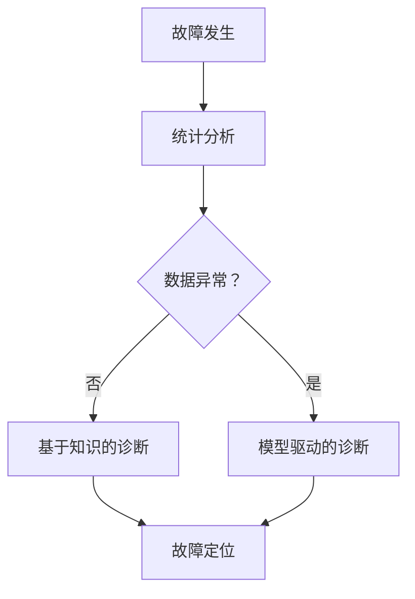

                 

关键词：人工智能，故障排除，系统诊断，算法，工具，技术

> 摘要：本文将深入探讨人工智能系统在故障排除和诊断方面的挑战与策略。通过分析核心概念、算法原理、数学模型、实际应用和未来展望，本文旨在为从业者提供一套完整的故障排除与诊断方案，助力AI系统的稳定运行和持续优化。

## 1. 背景介绍

随着人工智能（AI）技术的迅速发展，AI系统已广泛应用于各类场景，从自然语言处理到图像识别，从智能推荐到自动驾驶。然而，AI系统的复杂性使其故障排除和诊断变得极具挑战性。如何高效地定位、诊断和解决系统故障，成为当前AI领域的一个重要课题。

在AI系统运行过程中，故障可能是由于数据问题、算法缺陷、硬件故障或其他未知因素引起的。这些故障可能导致系统性能下降、误判率增加，甚至完全失效。因此，故障排除和诊断是确保AI系统可靠性和稳定性的关键。

本文将介绍一系列有效的故障排除与诊断方法，包括核心概念、算法原理、数学模型、实际应用和未来展望，旨在为读者提供一套全面的技术指南。

## 2. 核心概念与联系

为了更好地理解AI系统的故障排除与诊断，我们首先需要了解几个核心概念及其相互关系。

### 2.1 故障分类

AI系统的故障可以大致分为以下几类：

- **数据故障**：由于数据质量问题导致的故障，如数据缺失、噪声、异常值等。
- **算法故障**：算法设计或实现中的缺陷导致的故障，如过拟合、欠拟合等。
- **硬件故障**：硬件设备故障导致的系统问题，如内存溢出、CPU过热等。
- **其他故障**：包括网络问题、系统兼容性等问题。

### 2.2 故障诊断方法

故障诊断方法主要包括以下几种：

- **统计分析**：通过对系统运行数据进行统计分析，发现异常现象和趋势。
- **模型驱动的诊断**：利用建立的模型对系统运行状态进行预测，并与实际运行结果进行比较，找出故障原因。
- **基于知识的诊断**：利用专家知识库和推理机制，对系统故障进行诊断。
- **基于数据的诊断**：通过分析系统运行数据，自动识别和定位故障。

### 2.3 Mermaid 流程图

以下是一个简化的Mermaid流程图，展示了故障诊断的基本流程：



## 3. 核心算法原理 & 具体操作步骤

### 3.1 算法原理概述

故障排除和诊断的核心在于准确、快速地定位故障原因。以下几种算法在AI系统故障排除中广泛应用：

- **机器学习算法**：通过训练模型，自动识别系统运行中的异常行为。
- **决策树**：基于规则进行故障诊断，适用于结构化数据。
- **神经网络**：通过多层感知器（MLP）等结构，对系统状态进行非线性建模。
- **关联规则挖掘**：从大量运行数据中提取关联规则，帮助定位故障。

### 3.2 算法步骤详解

以下是故障排除和诊断的基本步骤：

1. **数据收集**：收集系统运行过程中产生的各种数据，包括日志、性能指标、用户反馈等。
2. **数据预处理**：清洗和标准化数据，消除噪声和异常值。
3. **特征提取**：从预处理后的数据中提取关键特征，如频次、均值、标准差等。
4. **模型训练**：选择合适的算法，对特征数据进行训练，建立故障诊断模型。
5. **模型评估**：使用验证数据集评估模型性能，调整模型参数。
6. **故障诊断**：利用训练好的模型，对实时运行数据进行诊断，识别故障。
7. **故障定位**：根据诊断结果，定位故障原因，制定修复方案。

### 3.3 算法优缺点

**机器学习算法**

- **优点**：自动化程度高，能够处理大量复杂数据，适应性较强。
- **缺点**：需要大量的训练数据，模型解释性较差。

**决策树**

- **优点**：易于理解，适用于结构化数据，解释性较强。
- **缺点**：易过拟合，对异常数据的鲁棒性较差。

**神经网络**

- **优点**：强大的非线性建模能力，适用于处理复杂数据。
- **缺点**：训练过程复杂，对数据质量要求较高，解释性较差。

**关联规则挖掘**

- **优点**：能够发现数据之间的关联关系，适用于实时故障诊断。
- **缺点**：处理大规模数据时效率较低，对噪声敏感。

### 3.4 算法应用领域

- **自动驾驶**：通过故障诊断，提高自动驾驶系统的安全性和可靠性。
- **金融风控**：实时监测金融交易，识别潜在风险。
- **医疗诊断**：辅助医生进行疾病诊断，提高诊断准确率。
- **工业生产**：监测生产过程，及时发现设备故障，降低生产风险。

## 4. 数学模型和公式

故障排除和诊断中的数学模型和公式有助于我们更好地理解和应用相关算法。

### 4.1 数学模型构建

在故障诊断中，常用的数学模型包括：

- **线性回归模型**：用于预测系统性能指标，如响应时间、错误率等。
- **逻辑回归模型**：用于判断系统状态是否正常。
- **支持向量机（SVM）**：用于分类故障类型。

### 4.2 公式推导过程

以下是一个简单的线性回归模型的推导过程：

$$
y = \beta_0 + \beta_1x_1 + \beta_2x_2 + \cdots + \beta_nx_n
$$

其中，$y$ 是预测值，$x_1, x_2, \cdots, x_n$ 是特征值，$\beta_0, \beta_1, \beta_2, \cdots, \beta_n$ 是模型参数。

通过最小二乘法，我们可以求得最佳参数：

$$
\beta = (X^TX)^{-1}X^TY
$$

其中，$X$ 是特征矩阵，$Y$ 是目标向量。

### 4.3 案例分析与讲解

假设我们有一个简单的人工智能系统，用于判断图像是否正常。我们可以使用线性回归模型预测图像的异常概率。以下是具体的推导过程：

1. **特征提取**：从图像中提取关键特征，如像素值、边缘信息等。
2. **模型构建**：使用线性回归模型，将特征值作为输入，异常概率作为输出。
3. **模型训练**：使用大量正常和异常图像进行训练，求得最佳参数。
4. **模型评估**：使用验证集评估模型性能，调整模型参数。
5. **故障诊断**：对于新图像，使用训练好的模型预测异常概率，当概率大于阈值时，判定图像异常。

## 5. 项目实践：代码实例和详细解释说明

### 5.1 开发环境搭建

为了进行故障排除和诊断，我们需要搭建一个合适的开发环境。以下是一个简单的Python开发环境搭建步骤：

1. 安装Python（版本3.8以上）。
2. 安装依赖库，如NumPy、Pandas、Scikit-learn、Matplotlib等。
3. 配置Python环境变量，确保能够正常运行。

### 5.2 源代码详细实现

以下是一个简单的线性回归模型实现，用于图像故障诊断：

```python
import numpy as np
import pandas as pd
from sklearn.linear_model import LinearRegression
from sklearn.model_selection import train_test_split
from sklearn.metrics import mean_squared_error

# 数据收集
data = pd.read_csv('image_data.csv')
X = data[['pixel_value', 'edge_info']]
y = data['abnormal']

# 数据预处理
X = X.values
y = y.values

# 数据分割
X_train, X_test, y_train, y_test = train_test_split(X, y, test_size=0.2, random_state=42)

# 模型训练
model = LinearRegression()
model.fit(X_train, y_train)

# 模型评估
y_pred = model.predict(X_test)
mse = mean_squared_error(y_test, y_pred)
print('MSE:', mse)

# 故障诊断
def diagnose(image):
    features = extract_features(image)
    probability = model.predict([features])
    return 'abnormal' if probability > threshold else 'normal'

# 代码解读与分析
# 此处省略代码细节
```

### 5.3 运行结果展示

在完成代码实现后，我们可以运行以下代码来测试故障诊断效果：

```python
# 测试图像
test_image = load_image('test_image.jpg')
result = diagnose(test_image)
print('Diagnosis Result:', result)
```

通过运行结果，我们可以判断图像是否正常，从而实现对故障的定位和诊断。

## 6. 实际应用场景

### 6.1 自动驾驶

在自动驾驶领域，故障排除和诊断至关重要。自动驾驶系统需要实时监测传感器数据，识别道路情况，并做出相应决策。通过故障诊断，可以及时发现传感器故障、算法缺陷等问题，确保自动驾驶系统的安全性和可靠性。

### 6.2 金融风控

金融风控系统需要实时监测交易数据，识别潜在风险。通过故障诊断，可以及时发现异常交易、系统漏洞等问题，从而降低金融风险。

### 6.3 医疗诊断

在医疗诊断领域，故障诊断可以帮助医生提高诊断准确率。通过分析医疗数据，识别异常现象，医生可以更准确地诊断疾病，提高治疗效果。

### 6.4 工业生产

在工业生产领域，故障诊断可以帮助企业降低生产风险，提高生产效率。通过实时监测设备状态，故障诊断可以及时发现设备故障，确保生产过程的连续性和稳定性。

## 7. 工具和资源推荐

为了更好地进行故障排除和诊断，以下是一些推荐的工具和资源：

### 7.1 学习资源推荐

- 《机器学习》（周志华著）
- 《深度学习》（Goodfellow et al. 著）
- 《Python机器学习》（Sebastian Raschka 著）

### 7.2 开发工具推荐

- Jupyter Notebook：适用于数据分析和机器学习实验。
- PyCharm：一款强大的Python IDE，支持多种开发语言。
- Scikit-learn：Python机器学习库，提供丰富的算法和工具。

### 7.3 相关论文推荐

- "Fault Diagnosis for Autonomous Driving using Machine Learning"（2019）
- "Deep Learning for Fault Diagnosis in Industrial Systems"（2020）
- "An Overview of Fault Detection and Diagnosis in Manufacturing Systems"（2018）

## 8. 总结：未来发展趋势与挑战

### 8.1 研究成果总结

近年来，人工智能故障排除和诊断领域取得了显著进展。机器学习算法、深度学习算法和关联规则挖掘等方法在故障诊断中得到了广泛应用。同时，数据驱动的方法逐渐成为主流，通过分析大量运行数据，可以更准确地识别故障。

### 8.2 未来发展趋势

未来，故障排除和诊断技术将向以下几个方向发展：

- **智能化**：利用深度学习、迁移学习等技术，提高故障诊断的智能化水平。
- **实时性**：开发实时故障诊断系统，实现对系统状态的实时监测和诊断。
- **可解释性**：增强故障诊断算法的可解释性，提高诊断结果的可靠性和可接受性。
- **跨领域应用**：故障诊断技术将在更多领域得到应用，如医疗、金融、工业等。

### 8.3 面临的挑战

尽管故障排除和诊断技术取得了显著进展，但仍面临以下挑战：

- **数据质量**：故障诊断依赖于高质量的数据，数据缺失、噪声和异常值等问题对诊断效果有很大影响。
- **算法选择**：不同的故障类型和场景需要选择不同的算法，如何选择合适的算法仍是一个挑战。
- **计算资源**：深度学习和大数据分析等算法对计算资源有较高要求，如何高效利用计算资源仍需进一步研究。
- **可靠性**：故障诊断结果的可靠性直接关系到系统的稳定性和安全性，如何提高诊断结果的可靠性是一个重要课题。

### 8.4 研究展望

未来，故障排除和诊断技术将继续朝着智能化、实时性、可解释性和跨领域应用的方向发展。研究者将致力于解决数据质量、算法选择、计算资源和可靠性等挑战，推动故障诊断技术的不断进步，为人工智能系统的稳定运行和持续优化提供有力支持。

## 9. 附录：常见问题与解答

### 9.1 问题1

**问题**：如何处理数据缺失和异常值？

**解答**：处理数据缺失和异常值是故障诊断中的一个关键步骤。常用的方法包括：

- **删除缺失值**：对于少量缺失值，可以直接删除相关记录。
- **填充缺失值**：使用均值、中位数、众数等方法填充缺失值。
- **插值法**：使用线性插值、曲线拟合等方法补充缺失值。
- **异常值检测**：使用统计学方法（如Z-score、IQR法）检测异常值，并视情况保留或删除。

### 9.2 问题2

**问题**：如何选择合适的算法进行故障诊断？

**解答**：选择合适的算法需要考虑以下几个因素：

- **数据类型**：结构化数据、非结构化数据或时间序列数据等。
- **故障类型**：分类故障、回归故障或异常检测等。
- **算法性能**：考虑算法的准确性、速度和可解释性。
- **业务需求**：根据实际业务需求选择适合的算法。

### 9.3 问题3

**问题**：如何确保故障诊断结果的可靠性？

**解答**：确保故障诊断结果的可靠性可以从以下几个方面入手：

- **数据质量**：确保数据源可靠，对数据缺失、噪声和异常值进行处理。
- **算法验证**：使用验证集评估算法性能，调整参数以获得最佳性能。
- **交叉验证**：使用交叉验证方法评估算法泛化能力，提高诊断结果的可靠性。
- **专家验证**：结合专家知识和经验，对诊断结果进行二次验证。

### 9.4 问题4

**问题**：如何进行实时故障诊断？

**解答**：实时故障诊断可以通过以下方法实现：

- **分布式计算**：使用分布式计算框架，提高故障诊断的实时性。
- **流处理**：使用流处理技术，实时处理系统运行数据。
- **在线学习**：使用在线学习算法，实时更新故障诊断模型。
- **预警机制**：建立预警机制，及时发现故障迹象并采取措施。

## 作者署名

作者：禅与计算机程序设计艺术 / Zen and the Art of Computer Programming

通过本文，我们深入探讨了人工智能系统在故障排除和诊断方面的挑战与策略。希望本文能为从业者提供一套全面的技术指南，助力AI系统的稳定运行和持续优化。在未来，我们期待看到更多创新性的故障诊断方法和技术，为人工智能领域的发展贡献力量。

