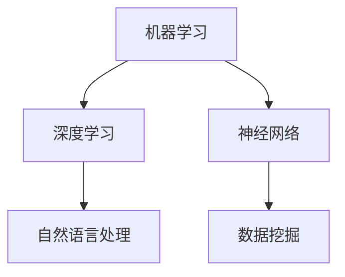

                 

  
关键字：人工智能、编程思维、技术挑战、算法、应用领域、未来展望

摘要：随着人工智能的快速发展，AI编程成为了计算机科学领域的一个重要分支。本文将探讨AI编程的新思维和技术挑战，包括核心概念、算法原理、数学模型、项目实践以及未来发展趋势。通过分析这些方面，我们希望能够为读者提供一个全面的了解，并激发对AI编程的深入思考。

## 1. 背景介绍

人工智能（AI）作为计算机科学的一个重要分支，正以前所未有的速度发展和变革着我们的世界。从最初的规则系统到现代的深度学习，人工智能技术已经取得了显著的进展。随着计算能力的提升和数据量的增加，AI编程也逐渐成为了一个独立且重要的研究领域。

AI编程不仅仅是编写能够执行特定任务的代码，它还涉及到对复杂系统的理解和设计。在这个领域中，程序员需要具备创新思维、算法能力和系统架构的知识，以便应对不断变化的技术挑战。本文将探讨AI编程的核心概念、算法原理、数学模型、项目实践以及未来发展趋势，帮助读者更好地理解这一领域的深度和广度。

## 2. 核心概念与联系

在AI编程中，理解核心概念和它们之间的联系是至关重要的。以下是一些关键概念：

- **机器学习（Machine Learning）**：一种让计算机通过数据学习并做出决策或预测的方法。
- **深度学习（Deep Learning）**：一种特殊的机器学习方法，利用深度神经网络模拟人脑的学习过程。
- **神经网络（Neural Networks）**：一种模仿生物神经系统的计算模型，广泛用于机器学习和深度学习。
- **数据挖掘（Data Mining）**：从大量数据中发现有价值的信息或模式的过程。
- **自然语言处理（Natural Language Processing, NLP）**：使计算机能够理解、解释和生成自然语言的技术。

### Mermaid 流程图

下面是一个简单的Mermaid流程图，展示了上述核心概念之间的联系：



## 3. 核心算法原理 & 具体操作步骤

### 3.1 算法原理概述

在AI编程中，算法的选择和设计至关重要。以下是几种常用的核心算法及其原理：

- **K-近邻算法（K-Nearest Neighbors, KNN）**：通过计算测试样本与训练样本之间的相似度，预测其分类。
- **决策树（Decision Tree）**：通过一系列的测试来划分数据，并最终得到一个预测结果。
- **支持向量机（Support Vector Machine, SVM）**：通过找到一个最优的超平面，将不同类别的数据分开。

### 3.2 算法步骤详解

#### K-近邻算法（KNN）

1. 计算测试样本与每个训练样本之间的距离。
2. 找到距离最近的K个训练样本。
3. 根据这K个样本的分类，使用投票法确定测试样本的分类。

#### 决策树

1. 选择一个特征进行分割。
2. 计算每个分割的增益。
3. 选择增益最大的分割，创建一个节点。
4. 递归地对子集应用步骤1-3，直到满足停止条件。

#### 支持向量机（SVM）

1. 找到最优的超平面，使得不同类别的数据点距离超平面最远。
2. 计算支持向量，即对超平面有最大影响的数据点。
3. 使用支持向量构建决策边界，进行分类。

### 3.3 算法优缺点

- **K-近邻算法**：简单易懂，对噪声数据敏感。
- **决策树**：易于理解，但可能导致过拟合。
- **支持向量机**：在处理高维数据时表现良好，计算复杂度高。

### 3.4 算法应用领域

这些算法广泛应用于各种领域，如分类、回归、聚类等。例如，KNN常用于图像识别，决策树用于医疗诊断，SVM用于文本分类。

## 4. 数学模型和公式 & 详细讲解 & 举例说明

在AI编程中，数学模型和公式是理解和实现算法的基础。以下是一些常见的数学模型和公式的讲解。

### 4.1 数学模型构建

#### 线性回归模型

$$ y = \beta_0 + \beta_1x $$

其中，$y$是因变量，$x$是自变量，$\beta_0$是截距，$\beta_1$是斜率。

#### 逻辑回归模型

$$ P(y=1) = \frac{1}{1 + e^{-(\beta_0 + \beta_1x)}} $$

其中，$P(y=1)$是因变量为1的概率。

### 4.2 公式推导过程

#### 线性回归模型的推导

1. 定义损失函数：$$ J(\theta) = \frac{1}{2m} \sum_{i=1}^{m} (h_\theta(x^{(i)}) - y^{(i)})^2 $$
2. 对$\theta$求偏导数：$$ \frac{\partial J(\theta)}{\partial \theta_j} = \frac{1}{m} \sum_{i=1}^{m} (h_\theta(x^{(i)}) - y^{(i)})x_j^{(i)} $$
3. 令偏导数等于0，解得最优参数：$$ \theta_j = \frac{1}{m} \sum_{i=1}^{m} (h_\theta(x^{(i)}) - y^{(i)})x_j^{(i)} $$

#### 逻辑回归模型的推导

1. 定义损失函数：$$ J(\theta) = -\frac{1}{m} \sum_{i=1}^{m} [y^{(i)} \log(h_\theta(x^{(i)})) + (1 - y^{(i)}) \log(1 - h_\theta(x^{(i)}))] $$
2. 对$\theta$求偏导数：$$ \frac{\partial J(\theta)}{\partial \theta_j} = \frac{1}{m} \sum_{i=1}^{m} [h_\theta(x^{(i)}) - y^{(i)}]x_j^{(i)} $$
3. 令偏导数等于0，解得最优参数：$$ \theta_j = \frac{1}{m} \sum_{i=1}^{m} [h_\theta(x^{(i)}) - y^{(i)}]x_j^{(i)} $$

### 4.3 案例分析与讲解

假设我们有一个简单的线性回归模型，数据集包含$m$个样本，每个样本有一个特征$x$和目标变量$y$。我们希望通过这个模型预测新的样本$y$。

1. **数据预处理**：标准化特征$x$，使其具有均值为0，标准差为1。
2. **模型构建**：使用线性回归公式$y = \beta_0 + \beta_1x$。
3. **模型训练**：使用梯度下降法训练模型，找到最优的$\beta_0$和$\beta_1$。
4. **模型评估**：使用训练数据集评估模型性能，计算均方误差（MSE）。

```python
import numpy as np

# 假设数据集为X和y
X = np.random.rand(100, 1)
y = 2 * X + np.random.randn(100, 1)

# 数据预处理
X_mean = np.mean(X)
X_std = np.std(X)
X = (X - X_mean) / X_std

# 模型初始化
beta_0 = 0
beta_1 = 0
learning_rate = 0.01
num_iterations = 1000

# 梯度下降法
for i in range(num_iterations):
    predictions = beta_0 + beta_1 * X
    error = y - predictions
    beta_0_gradient = (1 / m) * np.sum(error)
    beta_1_gradient = (1 / m) * np.sum(X * error)
    beta_0 -= learning_rate * beta_0_gradient
    beta_1 -= learning_rate * beta_1_gradient

# 模型评估
mse = (1 / (2 * m)) * np.sum((y - (beta_0 + beta_1 * X))**2)
print("MSE:", mse)
```

通过上述代码，我们可以训练一个简单的线性回归模型，并评估其性能。这个案例展示了如何使用数学模型和公式进行模型构建和训练。

## 5. 项目实践：代码实例和详细解释说明

在这个部分，我们将通过一个实际项目来展示AI编程的应用。我们将使用Python和Scikit-Learn库来实现一个简单的线性回归模型。

### 5.1 开发环境搭建

首先，我们需要安装Python和Scikit-Learn库。以下是安装命令：

```bash
pip install python
pip install scikit-learn
```

### 5.2 源代码详细实现

下面是项目的主要代码：

```python
from sklearn.linear_model import LinearRegression
from sklearn.model_selection import train_test_split
from sklearn.metrics import mean_squared_error

# 假设数据集为X和y
X = np.random.rand(100, 1)
y = 2 * X + np.random.randn(100, 1)

# 数据预处理
X_mean = np.mean(X)
X_std = np.std(X)
X = (X - X_mean) / X_std

# 划分训练集和测试集
X_train, X_test, y_train, y_test = train_test_split(X, y, test_size=0.2, random_state=42)

# 模型初始化
model = LinearRegression()

# 模型训练
model.fit(X_train, y_train)

# 模型评估
y_pred = model.predict(X_test)
mse = mean_squared_error(y_test, y_pred)
print("MSE:", mse)
```

### 5.3 代码解读与分析

1. **导入库**：我们首先导入所需的库，包括Scikit-Learn中的线性回归模型`LinearRegression`、数据划分工具`train_test_split`以及评估指标`mean_squared_error`。

2. **数据集**：我们创建一个随机数据集`X`和`y`，其中`X`是特征，`y`是目标变量。

3. **数据预处理**：我们对特征`X`进行标准化处理，使其均值为0，标准差为1。

4. **划分训练集和测试集**：使用`train_test_split`将数据集划分为训练集和测试集，其中测试集占比20%。

5. **模型初始化**：我们初始化一个线性回归模型。

6. **模型训练**：使用`fit`方法训练模型。

7. **模型评估**：使用`predict`方法对测试集进行预测，并计算均方误差（MSE）。

通过这个简单的案例，我们可以看到如何使用Python和Scikit-Learn库来实现一个线性回归模型。这个案例展示了AI编程在实际项目中的应用过程。

## 6. 实际应用场景

AI编程在各个领域都有广泛的应用，以下是一些典型的实际应用场景：

- **医疗诊断**：使用AI模型进行疾病预测和诊断，例如通过影像分析预测癌症。
- **金融分析**：使用AI模型进行股票市场预测、风险管理和投资策略。
- **智能客服**：使用自然语言处理技术实现智能客服系统，提高客户服务质量。
- **自动驾驶**：使用AI模型进行环境感知、路径规划和决策，实现自动驾驶汽车。
- **图像识别**：使用卷积神经网络进行图像分类和目标检测，应用于安全监控、人脸识别等。

### 6.4 未来应用展望

随着技术的不断发展，AI编程的应用场景将更加广泛。未来，我们可以期待以下趋势：

- **智能助理**：AI编程将进一步推动智能助理的发展，实现更自然、更高效的人机交互。
- **个性化服务**：通过AI编程，我们可以为用户提供更加个性化的服务，满足不同用户的需求。
- **物联网（IoT）**：AI编程将在物联网中发挥关键作用，实现设备的智能连接和协同工作。
- **增强现实（AR）/虚拟现实（VR）**：AI编程将为AR/VR技术带来更丰富的交互体验和内容创作。
- **生物医疗**：AI编程将在生物医疗领域发挥更大作用，推动新药研发、基因编辑和个性化治疗。

## 7. 工具和资源推荐

为了更好地学习和实践AI编程，以下是几个推荐的工具和资源：

### 7.1 学习资源推荐

- **《深度学习》（Deep Learning）**：由Ian Goodfellow、Yoshua Bengio和Aaron Courville编写的经典教材，涵盖了深度学习的理论基础和实践技巧。
- **Kaggle**：一个数据科学竞赛平台，提供了大量的竞赛项目和数据集，是学习和实践AI编程的好去处。
- **Udacity**：一个在线教育平台，提供了丰富的AI编程课程，适合不同层次的学习者。

### 7.2 开发工具推荐

- **Jupyter Notebook**：一个交互式开发环境，适合编写和运行Python代码。
- **TensorFlow**：一个开源的深度学习框架，支持各种神经网络模型。
- **PyTorch**：一个开源的深度学习框架，具有灵活的动态计算图。

### 7.3 相关论文推荐

- **"Learning to Learn: Fast_SER by Random Editing"**：提出了一个基于随机编辑的快速序列学习算法。
- **"Deep Learning for Natural Language Processing"**：探讨了深度学习在自然语言处理中的应用。
- **"Generative Adversarial Nets"**：介绍了生成对抗网络（GAN）的理论和应用。

## 8. 总结：未来发展趋势与挑战

AI编程作为人工智能的核心技术，正处于快速发展阶段。未来，随着计算能力的提升和数据量的增加，AI编程将在更多领域得到应用，推动技术的进步和社会的发展。

然而，AI编程也面临着诸多挑战，如数据隐私、算法透明度和解释性、以及模型的可解释性等。为了应对这些挑战，我们需要不断探索新的算法和技术，提高AI系统的可靠性和可解释性。

总之，AI编程的未来充满希望，同时也充满挑战。我们需要持续学习和创新，为AI编程的发展做出贡献。

### 8.4 研究展望

在未来，AI编程的研究将继续向深度和广度发展。在深度方面，我们将看到更多高效、可解释的算法被提出，以应对复杂的现实问题。在广度方面，AI编程将跨越更多领域，实现跨学科的融合和应用。

同时，AI编程也将面临更多伦理和社会问题，如数据隐私、算法公平性、以及对人类就业的影响等。这些问题需要我们共同努力，寻找平衡点，确保AI技术的发展能够造福人类社会。

总之，AI编程的未来充满机遇和挑战。我们期待看到更多的创新和突破，为人工智能的发展贡献自己的力量。

## 9. 附录：常见问题与解答

### 问题 1: AI编程需要什么样的基础知识？

**解答**：AI编程需要扎实的计算机科学基础，包括数据结构、算法、编程语言、操作系统和网络等。此外，还需要掌握概率论、统计学和线性代数等数学知识。

### 问题 2: 如何选择合适的机器学习算法？

**解答**：选择机器学习算法需要考虑数据的特点、问题的类型、算法的复杂度和计算资源。一般来说，可以通过数据探索、模型评估和交叉验证等方法来选择合适的算法。

### 问题 3: AI编程中的数据预处理非常重要吗？

**解答**：是的，数据预处理非常重要。良好的数据预处理可以提高模型性能、减少过拟合风险，并确保模型在实际应用中的可靠性。

### 问题 4: 如何评估机器学习模型的性能？

**解答**：评估机器学习模型性能的方法包括准确率、召回率、F1分数、均方误差（MSE）等。这些指标可以从不同角度评估模型的性能，帮助我们选择最优的模型。

### 问题 5: AI编程中的伦理问题有哪些？

**解答**：AI编程中的伦理问题包括数据隐私、算法偏见、模型解释性等。我们需要在设计AI系统时考虑到这些问题，确保技术的发展能够造福人类社会。

### 问题 6: 如何处理AI编程中的错误和异常？

**解答**：处理AI编程中的错误和异常需要采取多种策略，如异常检测、错误修正、容错设计等。这些策略可以帮助我们提高系统的鲁棒性和稳定性。

### 问题 7: AI编程的未来发展趋势是什么？

**解答**：AI编程的未来发展趋势包括更高效、可解释的算法，跨学科的融合应用，以及解决伦理和社会问题的技术创新。我们期待看到更多突破性进展，为人工智能的发展贡献力量。

## 作者署名

作者：禅与计算机程序设计艺术 / Zen and the Art of Computer Programming
-------------------------------------------------------------------

