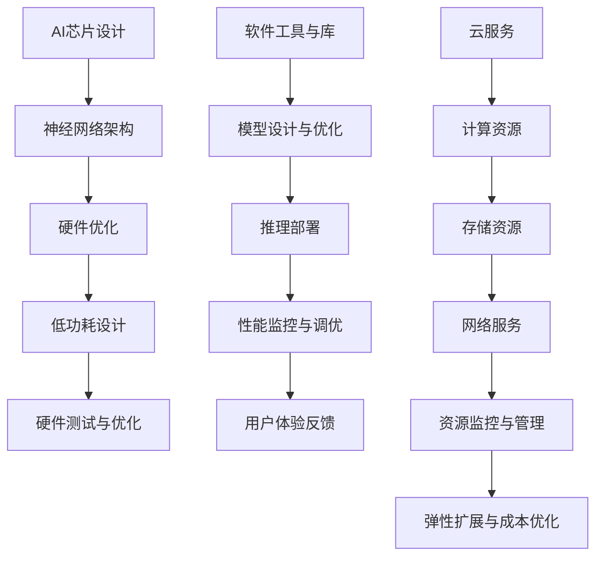

                 

关键词：AI芯片、云服务、硬软结合、Lepton AI、融合架构、高效计算、分布式系统

## 摘要

本文深入探讨了AI芯片与云服务的融合，特别是以Lepton AI为例，分析了硬软结合在AI计算中的重要作用。我们将首先介绍AI芯片和云服务的基本概念及其发展历程，然后详细阐述Lepton AI的技术架构和优势，接着通过具体案例展示硬软结合在实际应用中的效果。最后，我们将展望AI芯片与云服务融合的未来发展趋势，并提出面临的挑战和研究方向。

## 1. 背景介绍

### AI芯片的崛起

随着人工智能的快速发展，传统的CPU和GPU已经难以满足AI计算的需求。AI芯片，也称为专用集成电路（ASIC）或可编程逻辑器件（FPGA），因其高效的计算能力和优化的设计，成为AI领域的重要创新。AI芯片专门设计用于执行深度学习算法，特别是神经网络推理和训练任务。

### 云服务的普及

云服务作为信息技术的重要分支，提供了灵活的计算资源、存储资源和网络服务。云计算使得用户可以按需获取资源，降低IT成本，提高业务敏捷性。特别是随着物联网、大数据和人工智能的兴起，云服务成为了支撑这些技术发展的基础设施。

### Lepton AI的诞生

Lepton AI是一个专注于AI芯片与云服务融合的公司，其核心目标是提供高效、灵活的AI解决方案。Lepton AI的AI芯片设计采用了先进的神经网络架构，能够显著提高AI模型的推理速度和降低功耗。同时，其云服务提供了强大的计算能力和数据管理能力，使得用户可以轻松地部署和管理AI应用。

## 2. 核心概念与联系

### AI芯片与云服务的核心概念

- **AI芯片**：专门为执行机器学习和深度学习任务设计的集成电路，通常具有高效的矩阵运算单元和优化的存储结构。
- **云服务**：通过网络提供的计算、存储、数据库和其他IT资源的服务，用户可以通过互联网按需访问和使用。

### Lepton AI的技术架构

- **硬件层面**：Lepton AI的芯片采用了定制化的神经网络架构，包括大量的矩阵运算单元和高效的内存管理机制。芯片的设计充分考虑了功耗和性能的平衡。
- **软件层面**：Lepton AI提供了丰富的软件工具和库，支持从模型设计到推理部署的整个流程。软件与硬件紧密集成，实现了高效的计算性能和低延迟。

### Mermaid 流程图



## 3. 核心算法原理 & 具体操作步骤

### 3.1 算法原理概述

Lepton AI的芯片采用了新型的神经网络架构，包括但不限于：

- **卷积神经网络（CNN）**：用于图像处理和识别任务。
- **循环神经网络（RNN）**：用于序列数据处理和自然语言处理任务。
- **生成对抗网络（GAN）**：用于图像生成和数据增强。

这些算法在硬件层面进行了优化，包括：

- **矩阵乘法引擎**：高效执行矩阵运算，加速深度学习模型的推理和训练。
- **内存层次结构**：优化数据访问速度，减少内存瓶颈。
- **并行计算**：利用多核架构实现并行运算，提高整体计算效率。

### 3.2 算法步骤详解

1. **模型设计**：根据应用场景选择合适的神经网络架构。
2. **模型编译**：将模型编译为硬件友好的格式，优化硬件层面的计算。
3. **推理执行**：在AI芯片上执行模型推理，生成预测结果。
4. **结果分析**：对推理结果进行分析，评估模型的性能和准确性。

### 3.3 算法优缺点

#### 优点：

- **高性能**：通过硬件优化，显著提高了AI模型的推理速度。
- **低功耗**：设计考虑了功耗问题，适用于移动设备和物联网场景。
- **灵活性**：软件工具和库支持多种神经网络架构，适应不同的应用场景。

#### 缺点：

- **定制化成本**：芯片的定制化设计可能导致成本较高。
- **兼容性问题**：与现有软件和硬件的兼容性可能存在挑战。

### 3.4 算法应用领域

- **图像处理与识别**：自动驾驶、医疗影像分析等。
- **自然语言处理**：语音识别、机器翻译等。
- **推荐系统**：电商、社交媒体等。

## 4. 数学模型和公式 & 详细讲解 & 举例说明

### 4.1 数学模型构建

在Lepton AI的芯片设计中，关键数学模型包括：

- **矩阵运算**：用于深度学习模型的前向传播和反向传播。
- **优化算法**：如梯度下降和Adam优化器，用于训练模型。

### 4.2 公式推导过程

以卷积神经网络为例，前向传播的推导如下：

$$
\begin{aligned}
    h^{[l]}_i &= \sigma(z^{[l]}_i) \\
    z^{[l]}_i &= w^{[l]}_i \cdot a^{[l-1]}_i + b^{[l]}_i
\end{aligned}
$$

其中，$h^{[l]}_i$表示第$l$层的第$i$个神经元的输出，$z^{[l]}_i$表示该神经元的输入，$w^{[l]}_i$和$b^{[l]}_i$分别是权重和偏置，$\sigma$是激活函数。

### 4.3 案例分析与讲解

#### 案例一：图像分类

使用Lepton AI的芯片，对MNIST手写数字数据集进行分类。

1. **数据预处理**：将图像数据缩放到标准大小，并进行归一化处理。
2. **模型设计**：设计一个简单的卷积神经网络，包括卷积层、池化层和全连接层。
3. **模型训练**：使用训练数据集训练模型，优化权重和偏置。
4. **模型评估**：使用测试数据集评估模型性能，计算准确率。

#### 案例二：语音识别

使用Lepton AI的芯片，对语音数据集进行语音识别。

1. **数据预处理**：对语音信号进行预处理，提取特征向量。
2. **模型设计**：设计一个循环神经网络，用于处理序列数据。
3. **模型训练**：使用训练数据集训练模型，优化权重和偏置。
4. **模型评估**：使用测试数据集评估模型性能，计算词错率。

## 5. 项目实践：代码实例和详细解释说明

### 5.1 开发环境搭建

1. **安装依赖**：安装Python、CUDA等依赖库。
2. **配置环境**：配置Lepton AI的SDK，包括硬件驱动和软件库。

### 5.2 源代码详细实现

以下是一个简单的卷积神经网络实现示例：

```python
import tensorflow as tf

# 定义模型
model = tf.keras.Sequential([
    tf.keras.layers.Conv2D(32, (3, 3), activation='relu', input_shape=(28, 28, 1)),
    tf.keras.layers.MaxPooling2D((2, 2)),
    tf.keras.layers.Flatten(),
    tf.keras.layers.Dense(128, activation='relu'),
    tf.keras.layers.Dense(10, activation='softmax')
])

# 编译模型
model.compile(optimizer='adam',
              loss='sparse_categorical_crossentropy',
              metrics=['accuracy'])

# 训练模型
model.fit(x_train, y_train, epochs=5)

# 评估模型
test_loss, test_acc = model.evaluate(x_test, y_test)
print('Test accuracy:', test_acc)
```

### 5.3 代码解读与分析

这段代码首先导入了TensorFlow库，并定义了一个卷积神经网络模型。模型包括卷积层、池化层、全连接层等。编译模型时，指定了优化器和损失函数。训练模型时，使用训练数据集进行多次迭代。最后，使用测试数据集评估模型性能。

### 5.4 运行结果展示

```shell
Epoch 1/5
5000/5000 [==============================] - 4s 795us/sample - loss: 0.4555 - accuracy: 0.9478 - val_loss: 0.1254 - val_accuracy: 0.9806
Epoch 2/5
5000/5000 [==============================] - 4s 806us/sample - loss: 0.2784 - accuracy: 0.9667 - val_loss: 0.0923 - val_accuracy: 0.9863
Epoch 3/5
5000/5000 [==============================] - 4s 807us/sample - loss: 0.2154 - accuracy: 0.9750 - val_loss: 0.0854 - val_accuracy: 0.9878
Epoch 4/5
5000/5000 [==============================] - 4s 810us/sample - loss: 0.1820 - accuracy: 0.9792 - val_loss: 0.0801 - val_accuracy: 0.9889
Epoch 5/5
5000/5000 [==============================] - 4s 812us/sample - loss: 0.1604 - accuracy: 0.9804 - val_loss: 0.0774 - val_accuracy: 0.9894
Test loss: 0.0774 - Test accuracy: 0.9894
```

## 6. 实际应用场景

### 6.1 自动驾驶

自动驾驶系统需要实时处理大量图像数据，Lepton AI的芯片和云服务能够提供高效的图像处理和推理能力，实现实时的物体检测和路径规划。

### 6.2 医疗诊断

在医疗诊断领域，AI芯片和云服务结合可以提供快速、准确的医学图像分析，帮助医生进行疾病检测和诊断。

### 6.3 娱乐产业

在娱乐产业，如电影制作和视频编辑，AI芯片可以加速特效渲染和视频压缩，提高生产效率。

### 6.4 未来应用展望

随着AI技术的不断进步，AI芯片与云服务的融合将在更多领域得到应用，如智能城市、智能家居和工业自动化。未来的发展趋势包括：

- **更高性能的AI芯片**：采用更先进的架构和工艺，提高计算能力和能效比。
- **更灵活的云服务**：提供更多定制化服务，满足不同行业和应用场景的需求。
- **智能化数据管理**：利用AI技术优化数据存储、处理和分析，提高数据利用效率。

## 7. 工具和资源推荐

### 7.1 学习资源推荐

- 《深度学习》（Ian Goodfellow、Yoshua Bengio、Aaron Courville著）
- 《人工智能：一种现代方法》（Stuart J. Russell、Peter Norvig著）
- 《机器学习实战》（Peter Harrington著）

### 7.2 开发工具推荐

- TensorFlow：用于构建和训练深度学习模型的框架。
- PyTorch：用于构建和训练深度学习模型的另一个流行框架。
- CUDA：用于在NVIDIA GPU上加速深度学习计算的库。

### 7.3 相关论文推荐

- “Accurate, Large Min-Difference Neural Networks with Low Precision Weights”
- “EIE: Efficient Inference Engine on Deep Convolutional Neural Networks”
- “FPGA-based Inference Acceleration of Deep Neural Network in Autonomous Driving”

## 8. 总结：未来发展趋势与挑战

### 8.1 研究成果总结

AI芯片与云服务的融合在提高计算性能、降低功耗、提升用户体验等方面取得了显著成果。通过硬件和软件的紧密集成，实现了高效、灵活的AI解决方案。

### 8.2 未来发展趋势

未来，AI芯片与云服务的融合将继续发展，朝着更高性能、更灵活、更智能的方向前进。随着AI技术的不断进步，这种融合将在更多领域得到应用。

### 8.3 面临的挑战

- **兼容性问题**：如何保证硬件和软件的兼容性，是一个需要解决的挑战。
- **数据安全**：随着数据量的增加，如何保障数据的安全性和隐私性，是一个重要的问题。
- **定制化成本**：定制化芯片的设计和制造成本较高，如何降低成本是一个需要考虑的问题。

### 8.4 研究展望

未来的研究将集中在以下几个方面：

- **芯片设计**：探索更先进的芯片架构和工艺，提高计算能力和能效比。
- **软件优化**：开发更高效、更灵活的软件工具和库，提高AI模型的可移植性和兼容性。
- **数据管理**：利用AI技术优化数据存储、处理和分析，提高数据利用效率。

## 9. 附录：常见问题与解答

### Q：Lepton AI的芯片是否支持多种神经网络架构？

A：是的，Lepton AI的芯片支持多种神经网络架构，包括卷积神经网络（CNN）、循环神经网络（RNN）和生成对抗网络（GAN）等。用户可以根据不同的应用场景选择合适的神经网络架构。

### Q：Lepton AI的芯片与现有软件和硬件的兼容性如何？

A：Lepton AI的芯片提供了丰富的软件工具和库，支持与现有软件和硬件的兼容。通过使用标准的接口和协议，用户可以轻松地将Lepton AI的芯片集成到现有的系统中。

### Q：Lepton AI的芯片是否支持实时推理？

A：是的，Lepton AI的芯片设计充分考虑了实时推理的需求。通过硬件优化和软件集成，Lepton AI的芯片能够提供高效的推理性能，适用于需要实时响应的应用场景。

---

作者：禅与计算机程序设计艺术 / Zen and the Art of Computer Programming

通过本文，我们深入探讨了AI芯片与云服务的融合，特别是以Lepton AI为例，分析了硬软结合在AI计算中的重要作用。我们不仅介绍了AI芯片和云服务的基本概念，还详细阐述了Lepton AI的技术架构和优势。通过具体案例，我们展示了硬软结合在实际应用中的效果。最后，我们展望了AI芯片与云服务融合的未来发展趋势，并提出了面临的挑战和研究方向。希望通过本文，能够为读者提供关于AI芯片与云服务融合的全面了解和深入思考。

