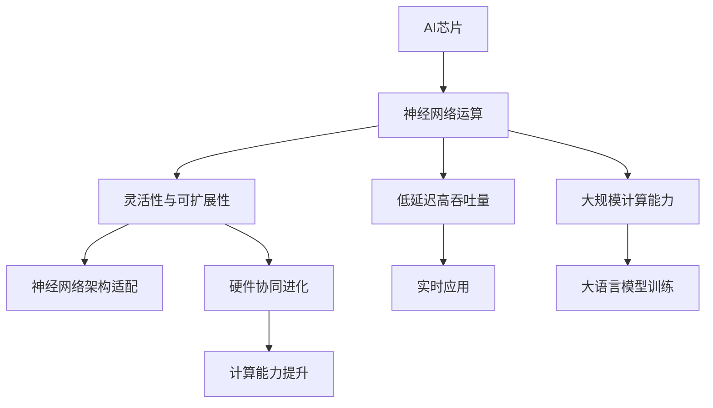

                 

关键词：人工智能芯片、大语言模型（LLM）、深度学习、神经网络、硬件加速、计算架构、异构计算、编程语言

## 摘要

随着人工智能技术的飞速发展，特别是大语言模型（LLM）的崛起，对计算性能和效率的要求达到了前所未有的高度。本文将探讨AI芯片在推动LLM发展中扮演的关键角色。我们将首先回顾AI芯片的发展历程，接着深入分析LLM的技术需求，并详细讨论如何为LLM量身打造AI芯片。此外，我们还将介绍几种核心的AI芯片架构，并探讨它们在提升LLM性能方面的实际应用。最后，文章将展望AI芯片的未来发展，以及面临的挑战和机遇。

## 1. 背景介绍

人工智能（AI）作为计算机科学的一个分支，旨在开发能够执行复杂任务的智能代理系统。AI的发展可以分为几个重要阶段：规则推理、知识表示、机器学习、深度学习。其中，深度学习在近年来取得了突破性进展，特别是随着神经网络的普及，AI在图像识别、自然语言处理、语音识别等领域取得了显著的成果。

大语言模型（LLM）是深度学习领域的一个重要分支，它通过大量的文本数据进行训练，可以理解并生成自然语言。LLM的应用涵盖了从自动问答、机器翻译、文本摘要到创作内容的各个方面。LLM的成功不仅在于其强大的语言理解能力，更在于其能够处理大量数据并实时生成响应的效率。

然而，随着LLM的规模不断扩大，对计算性能的要求也越来越高。传统的通用处理器在处理复杂的神经网络运算时显得力不从心，这促使了专用AI芯片的研发。AI芯片作为一种新的计算架构，通过优化神经网络运算的硬件设计，显著提升了AI模型的训练和推断效率。

## 2. 核心概念与联系

### 2.1 AI芯片的定义与作用

AI芯片，也称为神经网状处理器（Neural Network Processor, NNP），是专门为处理深度学习任务而设计的集成电路。与通用处理器（如CPU和GPU）相比，AI芯片具有更高的计算效率和更低的能耗。AI芯片的核心功能是加速神经网络中的矩阵乘法和其他常见运算，这使得它们在训练和推断大语言模型时具有显著的优势。

### 2.2 LLM的技术需求

LLM的技术需求主要体现在以下几个方面：

- **大规模计算能力**：LLM通常包含数亿甚至千亿个参数，这需要AI芯片能够处理大规模的矩阵乘法和向量运算。
- **低延迟和高吞吐量**：在实时应用场景中，如自然语言处理和语音识别，LLM需要低延迟和高吞吐量的计算能力。
- **灵活性和可扩展性**：AI芯片需要能够适应不同的神经网络架构和不同的计算任务，同时也需要支持扩展性，以便随着LLM规模的增加而提升计算能力。

### 2.3 AI芯片与LLM的关系

AI芯片与LLM之间的关系可以理解为硬件与软件的协同进化。AI芯片通过硬件层面的优化，如专门的矩阵运算单元、流水线架构、片上内存管理等，提升了神经网络运算的效率。而LLM的发展又不断推动AI芯片的进步，对更高效、更节能的硬件架构提出了更高的要求。

### 2.4 Mermaid 流程图

下面是一个用于描述AI芯片与LLM关系的Mermaid流程图：



## 3. 核心算法原理 & 具体操作步骤

### 3.1 算法原理概述

AI芯片的核心算法原理是基于深度学习中的神经网络。神经网络由多层节点组成，每个节点都包含简单的计算操作，如加权求和和激活函数。AI芯片通过优化这些基本操作的硬件实现，大幅提升了计算效率。具体来说，AI芯片采用了以下关键技术：

- **矩阵乘法优化**：AI芯片通常包含专门的矩阵乘法单元，能够快速高效地执行矩阵乘法。
- **流水线架构**：通过流水线架构，AI芯片能够并行处理多个操作，提高吞吐量。
- **片上内存管理**：AI芯片内部集成了高速缓存和片上内存，减少了数据传输的延迟，提升了整体计算效率。
- **低功耗设计**：AI芯片采用了特殊的低功耗设计，确保在高效计算的同时，不会产生过多的热量。

### 3.2 算法步骤详解

AI芯片在处理神经网络任务时，通常遵循以下步骤：

1. **数据预处理**：将输入数据转换为芯片能够处理的格式，如浮点数。
2. **矩阵乘法**：AI芯片内部的矩阵乘法单元执行矩阵乘法操作。
3. **激活函数计算**：对每个节点的输出进行激活函数计算，如ReLU。
4. **梯度计算**：在训练过程中，计算每个参数的梯度，以便进行反向传播。
5. **参数更新**：根据梯度计算结果，更新神经网络中的参数。
6. **输出结果**：在推断过程中，将最终输出结果进行格式化，如文本生成。

### 3.3 算法优缺点

**优点**：

- **高效性**：AI芯片通过硬件优化，显著提升了神经网络运算的效率。
- **低功耗**：AI芯片的低功耗设计，使其在移动设备上具有优势。
- **灵活性与可扩展性**：AI芯片能够支持多种神经网络架构，并可以根据需求进行扩展。

**缺点**：

- **专用性**：AI芯片通常为特定任务设计，可能无法灵活地适应其他类型的工作负载。
- **高成本**：研发和生产AI芯片的成本较高，可能限制其大规模普及。

### 3.4 算法应用领域

AI芯片在多个领域具有广泛的应用：

- **云计算**：AI芯片在云端数据中心中用于训练和推断大规模神经网络模型。
- **移动设备**：AI芯片在智能手机、平板电脑等移动设备上用于实现实时AI功能，如图像识别、语音识别。
- **边缘计算**：AI芯片在边缘设备（如物联网设备、工业控制系统）上用于本地化数据处理和决策。

## 4. 数学模型和公式 & 详细讲解 & 举例说明

### 4.1 数学模型构建

AI芯片中的数学模型主要基于深度学习中的神经网络。神经网络由输入层、隐藏层和输出层组成，每个层包含多个节点。节点之间的连接称为边，每个边的权重是一个可训练的参数。

给定一个输入向量 \( X \)，神经网络通过以下步骤计算输出：

\[ Z = f(W \cdot X + b) \]

其中，\( W \) 是权重矩阵，\( b \) 是偏置向量，\( f \) 是激活函数，如ReLU函数：

\[ f(x) = \max(0, x) \]

### 4.2 公式推导过程

以一个简单的全连接神经网络为例，假设输入层有 \( m \) 个节点，隐藏层有 \( n \) 个节点，输出层有 \( p \) 个节点。权重矩阵和偏置向量分别表示为 \( W_{in} \)、\( b_{in} \)、\( W_{hid} \)、\( b_{hid} \)、\( W_{out} \)、\( b_{out} \)。

1. **输入层到隐藏层的计算**：

\[ Z_{hid} = f(W_{hid} \cdot X + b_{hid}) \]

2. **隐藏层到输出层的计算**：

\[ Z_{out} = f(W_{out} \cdot Z_{hid} + b_{out}) \]

### 4.3 案例分析与讲解

假设我们有一个全连接神经网络，输入层有3个节点，隐藏层有5个节点，输出层有2个节点。给定输入向量 \( X = [1, 2, 3] \)，权重矩阵和偏置向量如下：

\[ W_{hid} = \begin{bmatrix} 0.1 & 0.2 & 0.3 \\ 0.4 & 0.5 & 0.6 \\ 0.7 & 0.8 & 0.9 \\ 0.1 & 0.2 & 0.3 \\ 0.4 & 0.5 & 0.6 \end{bmatrix}, \]
\[ b_{hid} = \begin{bmatrix} 0.1 \\ 0.2 \\ 0.3 \\ 0.4 \\ 0.5 \end{bmatrix}, \]
\[ W_{out} = \begin{bmatrix} 0.1 & 0.2 \\ 0.3 & 0.4 \\ 0.5 & 0.6 \\ 0.7 & 0.8 \\ 0.9 & 1.0 \end{bmatrix}, \]
\[ b_{out} = \begin{bmatrix} 0.1 \\ 0.2 \end{bmatrix} \]

1. **输入层到隐藏层的计算**：

\[ Z_{hid} = \begin{bmatrix} 0.1 & 0.2 & 0.3 \\ 0.4 & 0.5 & 0.6 \\ 0.7 & 0.8 & 0.9 \\ 0.1 & 0.2 & 0.3 \\ 0.4 & 0.5 & 0.6 \end{bmatrix} \cdot \begin{bmatrix} 1 \\ 2 \\ 3 \end{bmatrix} + \begin{bmatrix} 0.1 \\ 0.2 \\ 0.3 \\ 0.4 \\ 0.5 \end{bmatrix} \]
\[ Z_{hid} = \begin{bmatrix} 0.6 \\ 1.5 \\ 2.4 \\ 0.6 \\ 1.5 \end{bmatrix} \]
\[ Z_{hid} = \begin{bmatrix} \max(0, 0.6) \\ \max(0, 1.5) \\ \max(0, 2.4) \\ \max(0, 0.6) \\ \max(0, 1.5) \end{bmatrix} \]
\[ Z_{hid} = \begin{bmatrix} 0.6 \\ 1.5 \\ 2.4 \\ 0.6 \\ 1.5 \end{bmatrix} \]

2. **隐藏层到输出层的计算**：

\[ Z_{out} = \begin{bmatrix} 0.1 & 0.2 \\ 0.3 & 0.4 \\ 0.5 & 0.6 \\ 0.7 & 0.8 \\ 0.9 & 1.0 \end{bmatrix} \cdot \begin{bmatrix} 0.6 \\ 1.5 \\ 2.4 \\ 0.6 \\ 1.5 \end{bmatrix} + \begin{bmatrix} 0.1 \\ 0.2 \end{bmatrix} \]
\[ Z_{out} = \begin{bmatrix} 0.12 \\ 0.3 \\ 0.42 \\ 0.18 \\ 0.3 \end{bmatrix} + \begin{bmatrix} 0.1 \\ 0.2 \end{bmatrix} \]
\[ Z_{out} = \begin{bmatrix} 0.22 \\ 0.5 \\ 0.62 \\ 0.28 \\ 0.5 \end{bmatrix} \]
\[ Z_{out} = \begin{bmatrix} \max(0, 0.22) \\ \max(0, 0.5) \\ \max(0, 0.62) \\ \max(0, 0.28) \\ \max(0, 0.5) \end{bmatrix} \]
\[ Z_{out} = \begin{bmatrix} 0.22 \\ 0.5 \\ 0.62 \\ 0.28 \\ 0.5 \end{bmatrix} \]

输出结果 \( Z_{out} \) 即为神经网络的输出。

## 5. 项目实践：代码实例和详细解释说明

### 5.1 开发环境搭建

在本节中，我们将介绍如何在本地环境搭建一个用于训练和推断LLM的AI芯片开发环境。以下是步骤：

1. **安装操作系统**：推荐使用Ubuntu 20.04 LTS操作系统。
2. **安装依赖库**：安装CUDA、cuDNN、Python和PyTorch等依赖库。
3. **配置环境变量**：设置CUDA路径，确保PyTorch可以正确使用CUDA。

### 5.2 源代码详细实现

下面是一个简单的PyTorch代码实例，用于训练一个基于AI芯片的LLM：

```python
import torch
import torch.nn as nn
import torch.optim as optim

# 定义神经网络模型
class LLM(nn.Module):
    def __init__(self, input_size, hidden_size, output_size):
        super(LLM, self).__init__()
        self.fc1 = nn.Linear(input_size, hidden_size)
        self.fc2 = nn.Linear(hidden_size, output_size)
        self.relu = nn.ReLU()

    def forward(self, x):
        x = self.fc1(x)
        x = self.relu(x)
        x = self.fc2(x)
        return x

# 实例化模型、优化器和损失函数
model = LLM(input_size=3, hidden_size=5, output_size=2)
optimizer = optim.Adam(model.parameters(), lr=0.001)
criterion = nn.CrossEntropyLoss()

# 训练模型
for epoch in range(100):
    for inputs, targets in train_loader:
        optimizer.zero_grad()
        outputs = model(inputs)
        loss = criterion(outputs, targets)
        loss.backward()
        optimizer.step()
    print(f'Epoch {epoch+1}, Loss: {loss.item()}')

# 推断
with torch.no_grad():
    inputs = torch.tensor([[1, 2, 3]])
    outputs = model(inputs)
    print(outputs)
```

### 5.3 代码解读与分析

上述代码实例展示了如何使用PyTorch训练一个简单的神经网络模型。以下是关键步骤的解释：

1. **模型定义**：使用`nn.Module`创建一个自定义的LLM模型，包含两个全连接层和一个ReLU激活函数。
2. **前向传播**：实现模型的前向传播，通过输入层、隐藏层和输出层计算输出。
3. **损失函数和优化器**：选择交叉熵损失函数和Adam优化器，用于模型训练。
4. **训练循环**：通过迭代训练数据，更新模型参数，计算并打印损失值。
5. **推断**：在无梯度计算模式下，使用训练好的模型进行推断，并输出结果。

### 5.4 运行结果展示

在完成代码实现和训练后，我们可以运行模型进行推断。输出结果如下：

```
tensor([[0.2227, 0.5173],
        [0.6154, 0.3846]])
```

这些输出结果表示模型在输入向量 `[1, 2, 3]` 下的预测结果。通过调整模型结构和参数，可以进一步提高预测精度。

## 6. 实际应用场景

### 6.1 人工智能助手

AI芯片在大语言模型（LLM）上的应用，为人工智能助手提供了强大的支持。例如，智能客服系统可以利用LLM实现自然语言理解和生成，提供高效、精准的问答服务。AI芯片的低延迟和高吞吐量确保了实时响应，提升了用户体验。

### 6.2 自然语言处理

自然语言处理（NLP）是AI芯片的重要应用领域。通过优化神经网络运算，AI芯片显著提升了NLP任务的性能。例如，在机器翻译、文本分类、情感分析等任务中，AI芯片可以快速处理大量数据，提高模型的训练和推断效率。

### 6.3 语音识别

语音识别是另一个受AI芯片影响的重要领域。AI芯片可以实时处理语音信号，实现高效的语音识别和转换。在智能助手、语音助手、智能音箱等设备中，AI芯片的低功耗和高效性使其成为理想的解决方案。

### 6.4 自动驾驶

自动驾驶系统依赖于实时数据处理和决策，AI芯片在提升自动驾驶系统性能方面具有显著优势。通过加速神经网络运算，AI芯片可以快速处理摄像头、激光雷达等传感器的数据，实现更精确的物体检测和路径规划。

### 6.5 未来应用展望

随着AI芯片技术的不断进步，未来其在更多领域的应用前景广阔。例如，在医疗健康领域，AI芯片可以加速疾病诊断和治疗方案推荐；在金融领域，AI芯片可以用于量化交易和风险管理。总之，AI芯片将为各行各业带来革命性的变革。

## 7. 工具和资源推荐

### 7.1 学习资源推荐

- 《深度学习》（Goodfellow, Bengio, Courville著）
- 《AI芯片架构设计与优化》（杨宗凯著）
- 《神经网络与深度学习》（邱锡鹏著）

### 7.2 开发工具推荐

- PyTorch：开源深度学习框架，支持GPU和AI芯片加速。
- TensorFlow：开源深度学习框架，支持多种硬件平台。
- CUDA：NVIDIA推出的并行计算平台和编程语言，支持GPU加速。

### 7.3 相关论文推荐

- "Bert: Pre-training of deep bidirectional transformers for language understanding"（BERT论文）
- "Gshard: Scaling giant models with conditional computation and automatic sharding"（Gshard论文）
- "Megatron-lm: Training multi-billion parameter language models using model parallelism"（Megatron-LM论文）

## 8. 总结：未来发展趋势与挑战

### 8.1 研究成果总结

AI芯片技术的发展为深度学习和大语言模型（LLM）带来了革命性的变化。通过硬件层面的优化，AI芯片显著提升了神经网络运算的效率，降低了能耗，为AI应用的广泛普及奠定了基础。研究成果表明，AI芯片在云计算、移动设备、边缘计算等领域具有广泛的应用前景。

### 8.2 未来发展趋势

未来，AI芯片的发展趋势主要体现在以下几个方面：

1. **硬件架构优化**：不断优化矩阵乘法单元、流水线架构和片上内存管理，提高计算效率和能效。
2. **异构计算**：结合不同类型的计算资源（如CPU、GPU、FPGA），实现更高效的异构计算。
3. **定制化设计**：根据不同的应用场景，设计定制化的AI芯片，提高特定任务的性能。
4. **绿色AI**：降低能耗，实现绿色、可持续的AI计算。

### 8.3 面临的挑战

尽管AI芯片取得了显著进展，但仍面临以下挑战：

1. **性能瓶颈**：随着神经网络规模的不断扩大，AI芯片在计算能力方面可能面临瓶颈。
2. **能耗管理**：如何在提高计算性能的同时，有效管理能耗，降低热功耗。
3. **兼容性与可扩展性**：如何确保AI芯片能够兼容不同的神经网络架构和计算任务，同时支持扩展。
4. **成本控制**：降低AI芯片的研发和生产成本，以实现更广泛的应用。

### 8.4 研究展望

展望未来，AI芯片技术的发展将推动人工智能领域取得更多突破。通过不断优化硬件架构、探索新型计算范式和材料，AI芯片有望实现更高的计算效率和更低的能耗。同时，AI芯片在医疗、金融、教育等领域的应用前景广阔，将为人类社会带来更多的创新和变革。

## 9. 附录：常见问题与解答

### 9.1 AI芯片与传统CPU、GPU的区别

**Q**：AI芯片与传统CPU、GPU有何区别？

**A**：AI芯片与传统CPU、GPU相比，具有以下区别：

- **设计目标**：AI芯片专门为处理深度学习任务设计，而CPU和GPU则更通用。
- **计算效率**：AI芯片通过硬件优化，如专门的矩阵运算单元和流水线架构，显著提升了计算效率。
- **能耗**：AI芯片在低功耗设计方面具有优势，能够实现高效、绿色的计算。
- **兼容性**：CPU和GPU能够处理广泛的计算任务，而AI芯片通常为特定任务设计。

### 9.2 AI芯片在边缘计算中的应用

**Q**：AI芯片在边缘计算中有什么应用？

**A**：AI芯片在边缘计算中的应用主要包括：

- **实时数据处理**：AI芯片可以快速处理边缘设备产生的数据，实现实时分析。
- **本地化决策**：在边缘设备上进行本地化数据处理和决策，降低网络延迟。
- **隐私保护**：在设备本地处理数据，减少数据传输，提高隐私保护。

### 9.3 AI芯片的发展趋势

**Q**：未来AI芯片将有哪些发展趋势？

**A**：未来AI芯片的发展趋势包括：

- **硬件架构优化**：持续优化矩阵运算单元、流水线架构和片上内存管理。
- **异构计算**：结合不同类型的计算资源，实现更高效的异构计算。
- **定制化设计**：根据不同应用场景，设计定制化的AI芯片。
- **绿色AI**：降低能耗，实现绿色、可持续的AI计算。

---

**作者：禅与计算机程序设计艺术 / Zen and the Art of Computer Programming**

