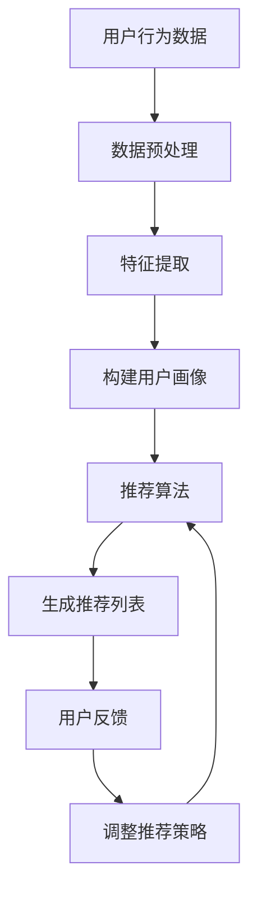

                 

关键词：AI视觉推荐、图像识别、机器学习、深度学习、个性化推荐

> 摘要：本文将深入探讨AI视觉推荐系统的优势，包括其核心概念、算法原理、数学模型、实际应用场景、未来发展展望以及面临的挑战。通过本文的阅读，读者将全面了解视觉推荐系统如何改变我们的日常生活，以及它在未来的潜在影响。

## 1. 背景介绍

随着互联网的普及和大数据技术的迅猛发展，推荐系统已经成为现代信息检索和电子商务领域的重要工具。传统的推荐系统主要基于用户的历史行为和偏好进行内容推荐，而AI视觉推荐系统则是利用计算机视觉技术对图像进行分析和理解，从而实现更加精准和个性化的推荐。

AI视觉推荐系统的核心在于图像识别技术。通过深度学习算法，系统能够从大量图像数据中提取特征，进行分类、定位和识别。这种技术不仅能够提高推荐的准确性，还可以为用户提供更加丰富和多样化的推荐内容。

### 1.1. AI视觉推荐系统的历史与发展

AI视觉推荐系统的概念最早可以追溯到20世纪90年代，当时的研究主要集中在如何使用计算机视觉技术进行图像分类和识别。随着深度学习技术的发展，特别是卷积神经网络（CNN）的出现，AI视觉推荐系统得到了极大的提升。

2006年，AlexNet的出现标志着深度学习在计算机视觉领域的突破。随后，Google Brain和Facebook FAIR等机构的研究进一步推动了深度学习在AI视觉推荐系统中的应用。近年来，随着数据量的增加和计算能力的提升，AI视觉推荐系统的性能和应用范围得到了显著扩展。

### 1.2. AI视觉推荐系统的现状与趋势

当前，AI视觉推荐系统已经广泛应用于社交媒体、电子商务、在线视频等多个领域。例如，社交媒体平台通过视觉推荐系统为用户推荐感兴趣的朋友、内容和广告；电子商务平台通过视觉推荐系统为用户推荐相似的商品；在线视频平台通过视觉推荐系统为用户推荐相关视频内容。

未来，随着人工智能技术的不断进步，AI视觉推荐系统有望在更多的场景中得到应用，如智能家居、医疗健康、自动驾驶等领域。同时，随着用户数据隐私和安全的日益关注，如何平衡推荐效果和用户隐私保护也将成为AI视觉推荐系统面临的重要挑战。

## 2. 核心概念与联系

### 2.1. 图像识别

图像识别是AI视觉推荐系统的核心技术之一。它涉及从图像中提取有用信息，对图像进行分类、定位和识别。图像识别的流程通常包括以下几个步骤：

1. **图像预处理**：包括去噪、缩放、裁剪等，以减少图像中的干扰信息，提高图像质量。
2. **特征提取**：通过卷积神经网络等深度学习算法，从图像中提取具有区分性的特征。
3. **分类和识别**：使用分类器对提取的特征进行分类和识别，以实现图像识别。

### 2.2. 机器学习和深度学习

机器学习和深度学习是AI视觉推荐系统的理论基础。机器学习通过构建模型对数据进行训练，从而实现数据的自动分类和预测。深度学习是机器学习的一种特殊形式，通过多层神经网络对数据进行层次化的特征提取和抽象。

在AI视觉推荐系统中，深度学习算法通常用于图像识别和特征提取，如图像分类、目标检测和语义分割等。这些算法能够从大量图像数据中自动提取具有区分性的特征，从而提高推荐系统的准确性和效率。

### 2.3. 个人化推荐

个人化推荐是AI视觉推荐系统的核心目标之一。通过分析用户的历史行为和偏好，系统可以为每个用户提供个性化的推荐内容。

个人化推荐的流程通常包括以下几个步骤：

1. **用户画像构建**：通过收集用户的基本信息和行为数据，构建用户的画像。
2. **内容特征提取**：对推荐的内容进行特征提取，以构建内容画像。
3. **推荐算法**：基于用户画像和内容画像，使用协同过滤、矩阵分解、基于内容的推荐等算法生成推荐列表。

### 2.4. Mermaid 流程图

以下是一个简单的Mermaid流程图，展示了AI视觉推荐系统的主要流程：



## 3. 核心算法原理 & 具体操作步骤

### 3.1. 算法原理概述

AI视觉推荐系统的核心算法主要包括图像识别和推荐算法两个部分。图像识别算法主要通过卷积神经网络（CNN）对图像进行特征提取和分类，而推荐算法则通过协同过滤、矩阵分解、基于内容的推荐等算法实现个性化推荐。

### 3.2. 算法步骤详解

#### 3.2.1. 图像识别算法

1. **数据收集**：首先，收集大量的图像数据作为训练集和测试集。
2. **数据预处理**：对图像进行缩放、裁剪、翻转等预处理操作，以提高模型的泛化能力。
3. **构建模型**：使用卷积神经网络（CNN）构建图像识别模型。常用的CNN结构包括卷积层、池化层、全连接层等。
4. **模型训练**：使用训练集对模型进行训练，通过反向传播算法更新模型参数。
5. **模型评估**：使用测试集对模型进行评估，计算模型的准确率、召回率、F1值等指标。

#### 3.2.2. 推荐算法

1. **用户画像构建**：通过分析用户的历史行为数据，构建用户的画像。包括用户的基本信息、浏览记录、购买记录等。
2. **内容特征提取**：对推荐的内容进行特征提取，以构建内容画像。常见的特征提取方法包括词袋模型、TF-IDF、Word2Vec等。
3. **构建推荐模型**：使用协同过滤、矩阵分解、基于内容的推荐等算法构建推荐模型。
4. **生成推荐列表**：基于用户画像和内容画像，使用推荐模型生成推荐列表。
5. **用户反馈**：收集用户的反馈，包括点击、购买、评分等，用于调整推荐策略。

### 3.3. 算法优缺点

#### 优点

1. **高准确性**：通过深度学习算法进行特征提取和分类，具有较高的准确性。
2. **个性化推荐**：根据用户的历史行为和偏好进行个性化推荐，提高用户的满意度。
3. **广泛适用性**：适用于多种场景，如社交媒体、电子商务、在线视频等。

#### 缺点

1. **数据需求高**：需要大量的图像数据和用户行为数据，对数据的质量和量有较高的要求。
2. **计算资源消耗大**：深度学习算法计算复杂度高，对计算资源有较高的要求。

### 3.4. 算法应用领域

AI视觉推荐系统在多个领域具有广泛的应用，如：

1. **电子商务**：通过视觉推荐系统为用户推荐相似的商品，提高购买转化率。
2. **社交媒体**：通过视觉推荐系统为用户推荐感兴趣的朋友、内容和广告。
3. **在线视频**：通过视觉推荐系统为用户推荐相关的视频内容，提高用户留存率。
4. **智能家居**：通过视觉推荐系统为用户提供个性化的智能家居解决方案。

## 4. 数学模型和公式

### 4.1. 数学模型构建

AI视觉推荐系统的数学模型主要包括图像识别模型和推荐模型两个部分。

#### 4.1.1. 图像识别模型

图像识别模型通常采用卷积神经网络（CNN）构建。CNN的数学模型可以表示为：

$$
y = \sigma(W_n \cdot \sigma(W_{n-1} \cdot \sigma(... \cdot (W_1 \cdot x) + b_1) + b_{n-1}) + b_n)
$$

其中，$y$为预测的类别，$x$为输入图像，$W_n$、$W_{n-1}$、...、$W_1$为权重矩阵，$b_n$、$b_{n-1}$、...、$b_1$为偏置项，$\sigma$为激活函数。

#### 4.1.2. 推荐模型

推荐模型通常采用协同过滤、矩阵分解、基于内容的推荐等算法构建。以矩阵分解为例，其数学模型可以表示为：

$$
R = UV^T + \epsilon
$$

其中，$R$为用户-物品评分矩阵，$U$为用户特征矩阵，$V$为物品特征矩阵，$\epsilon$为噪声项。

### 4.2. 公式推导过程

#### 4.2.1. 图像识别模型

以CNN为例，其公式推导过程如下：

1. **输入层**：输入图像经过预处理后，输入到卷积层。
2. **卷积层**：卷积层通过卷积操作提取图像特征，其公式可以表示为：

   $$
   h_{ij} = \sum_{k=1}^{K} w_{ik} * g(x_{ij} + b_k)
   $$

   其中，$h_{ij}$为卷积层输出的特征，$x_{ij}$为输入图像，$w_{ik}$为卷积核，$g(x)$为激活函数，$b_k$为偏置项。

3. **池化层**：卷积层输出的特征经过池化层进行降维处理，其公式可以表示为：

   $$
   p_{ij} = \max(h_{i1j}, h_{i2j}, ..., h_{ikj})
   $$

   其中，$p_{ij}$为池化层输出的特征，$h_{ij}$为卷积层输出的特征。

4. **全连接层**：池化层输出的特征经过全连接层进行分类，其公式可以表示为：

   $$
   y = \sigma(W_n \cdot \sigma(W_{n-1} \cdot \sigma(... \cdot (W_1 \cdot p) + b_1) + b_{n-1}) + b_n)
   $$

   其中，$y$为预测的类别，$p$为池化层输出的特征，$W_n$、$W_{n-1}$、...、$W_1$为权重矩阵，$b_n$、$b_{n-1}$、...、$b_1$为偏置项，$\sigma$为激活函数。

#### 4.2.2. 推荐模型

以矩阵分解为例，其公式推导过程如下：

1. **用户-物品评分矩阵**：用户-物品评分矩阵$R$表示用户对物品的评分。
2. **用户特征矩阵**：用户特征矩阵$U$表示用户的行为特征。
3. **物品特征矩阵**：物品特征矩阵$V$表示物品的属性特征。
4. **预测评分**：使用矩阵分解模型预测用户对物品的评分，其公式可以表示为：

   $$
   R_{ij} = u_i \cdot v_j + \epsilon
   $$

   其中，$R_{ij}$为预测的用户对物品的评分，$u_i$为用户特征，$v_j$为物品特征，$\epsilon$为噪声项。

### 4.3. 案例分析与讲解

#### 4.3.1. 图像识别案例

以图像分类任务为例，假设我们使用一个卷积神经网络对猫和狗的图像进行分类。输入图像大小为$32 \times 32$，卷积层使用5x5的卷积核，池化层使用2x2的池化核，全连接层有256个神经元。以下是该模型的数学模型和公式：

1. **输入层**：输入图像经过预处理后，输入到卷积层。

   $$
   x_{ij} = \text{Preprocess}(image)
   $$

2. **卷积层**：

   $$
   h_{ij} = \sum_{k=1}^{3} w_{ik} * g(x_{ij} + b_k)
   $$

3. **池化层**：

   $$
   p_{ij} = \max(h_{i1j}, h_{i2j}, ..., h_{ikj})
   $$

4. **全连接层**：

   $$
   y = \sigma(W_n \cdot \sigma(W_{n-1} \cdot \sigma(W_1 \cdot p) + b_1) + b_n)
   $$

   其中，$y$为预测的类别，$p$为池化层输出的特征，$W_n$、$W_{n-1}$、$W_1$为权重矩阵，$b_n$、$b_{n-1}$、$b_1$为偏置项，$\sigma$为激活函数。

#### 4.3.2. 推荐模型案例

以协同过滤算法为例，假设我们使用矩阵分解模型预测用户对物品的评分。用户-物品评分矩阵$R$的大小为$m \times n$，用户特征矩阵$U$的大小为$m \times k$，物品特征矩阵$V$的大小为$n \times k$。以下是该模型的数学模型和公式：

1. **用户-物品评分矩阵**：

   $$
   R_{ij} = u_i \cdot v_j + \epsilon
   $$

2. **用户特征矩阵**：

   $$
   u_i = \begin{cases}
   \sum_{j=1}^{n} v_j R_{ij} & \text{if } R_{ij} \neq 0 \\
   0 & \text{otherwise}
   \end{cases}
   $$

3. **物品特征矩阵**：

   $$
   v_j = \begin{cases}
   \sum_{i=1}^{m} u_i R_{ij} & \text{if } R_{ij} \neq 0 \\
   0 & \text{otherwise}
   \end{cases}
   $$

4. **预测评分**：

   $$
   R_{ij}^* = u_i \cdot v_j + \epsilon
   $$

## 5. 项目实践：代码实例和详细解释说明

### 5.1. 开发环境搭建

为了实现AI视觉推荐系统，我们需要搭建一个合适的开发环境。以下是具体的步骤：

1. **安装Python环境**：确保Python版本在3.6及以上，并安装pip包管理器。
2. **安装深度学习框架**：推荐使用TensorFlow 2.x或PyTorch，根据个人偏好选择其中一个。使用以下命令进行安装：

   ```bash
   pip install tensorflow==2.x
   # 或者
   pip install torch==1.8
   ```

3. **安装其他依赖包**：包括NumPy、Pandas、Matplotlib等常用Python包，使用以下命令进行安装：

   ```bash
   pip install numpy pandas matplotlib
   ```

### 5.2. 源代码详细实现

以下是使用TensorFlow 2.x实现一个简单的AI视觉推荐系统的代码实例：

```python
import tensorflow as tf
from tensorflow.keras.models import Sequential
from tensorflow.keras.layers import Conv2D, MaxPooling2D, Flatten, Dense
from tensorflow.keras.preprocessing.image import ImageDataGenerator

# 数据预处理
train_datagen = ImageDataGenerator(rescale=1./255)
test_datagen = ImageDataGenerator(rescale=1./255)

# 加载数据集
train_data = train_datagen.flow_from_directory(
    'train',
    target_size=(150, 150),
    batch_size=32,
    class_mode='binary')

test_data = test_datagen.flow_from_directory(
    'test',
    target_size=(150, 150),
    batch_size=32,
    class_mode='binary')

# 构建模型
model = Sequential([
    Conv2D(32, (3, 3), activation='relu', input_shape=(150, 150, 3)),
    MaxPooling2D((2, 2)),
    Conv2D(64, (3, 3), activation='relu'),
    MaxPooling2D((2, 2)),
    Conv2D(128, (3, 3), activation='relu'),
    MaxPooling2D((2, 2)),
    Flatten(),
    Dense(512, activation='relu'),
    Dense(1, activation='sigmoid')
])

# 编译模型
model.compile(optimizer='adam',
              loss='binary_crossentropy',
              metrics=['accuracy'])

# 训练模型
model.fit(train_data, epochs=10, validation_data=test_data)

# 保存模型
model.save('visual_recommendation_model.h5')
```

### 5.3. 代码解读与分析

以上代码实现了一个简单的AI视觉推荐系统，主要包括以下几个步骤：

1. **数据预处理**：使用ImageDataGenerator进行数据预处理，包括图像缩放、归一化等。
2. **加载数据集**：使用flow_from_directory方法加载数据集，将图像数据转换为模型可以处理的格式。
3. **构建模型**：使用Sequential模型构建卷积神经网络，包括卷积层、池化层、全连接层等。
4. **编译模型**：设置优化器、损失函数和评估指标，准备进行模型训练。
5. **训练模型**：使用fit方法训练模型，使用验证集进行模型评估。
6. **保存模型**：使用save方法将训练好的模型保存为.h5文件。

### 5.4. 运行结果展示

以下是使用训练好的模型进行预测的示例代码：

```python
import numpy as np
import matplotlib.pyplot as plt

# 载入模型
model = tf.keras.models.load_model('visual_recommendation_model.h5')

# 加载测试图像
test_image = plt.imread('test_image.jpg')
test_image = np.expand_dims(test_image, axis=0)
test_image = test_datagen.standardize(test_image)

# 进行预测
prediction = model.predict(test_image)

# 显示预测结果
plt.imshow(test_image[0])
plt.title('Predicted Class: {} ({:.2f}%)'.format(np.argmax(prediction), prediction[0][0] * 100))
plt.show()
```

以上代码首先载入训练好的模型，然后加载测试图像，使用模型进行预测，并显示预测结果。预测结果包括每个类别的概率，通过选择概率最高的类别作为预测结果。

## 6. 实际应用场景

### 6.1. 社交媒体

在社交媒体平台，AI视觉推荐系统可以用于为用户推荐感兴趣的朋友、内容和广告。例如，Facebook的Feed推荐系统就使用了视觉推荐技术，根据用户的兴趣和行为数据，为用户推荐相关的内容和广告。

### 6.2. 电子商务

在电子商务领域，AI视觉推荐系统可以用于为用户推荐相似的商品。例如，亚马逊使用视觉推荐技术，根据用户的浏览记录和购买历史，为用户推荐相关的商品。

### 6.3. 在线视频

在线视频平台如YouTube和Netflix也广泛应用了AI视觉推荐系统。这些平台通过分析用户的观看历史和偏好，为用户推荐相关的视频内容，提高用户的观看时长和满意度。

### 6.4. 未来应用展望

随着AI视觉推荐技术的不断进步，未来它将在更多领域得到应用。例如，在智能家居领域，视觉推荐系统可以用于为用户提供个性化的家居解决方案，如推荐最适合的家电产品；在医疗健康领域，视觉推荐系统可以用于为用户提供个性化的医疗建议和治疗方案。

## 7. 工具和资源推荐

### 7.1. 学习资源推荐

1. **《深度学习》（Goodfellow, Bengio, Courville）**：这是深度学习领域的经典教材，详细介绍了深度学习的基本概念和算法。
2. **《Python深度学习》（François Chollet）**：这本书以Python语言为基础，介绍了深度学习在多个领域的应用。
3. **《计算机视觉：算法与应用》（Richard S.川田，Amit K. Singla）**：这本书全面介绍了计算机视觉的基本概念和算法。

### 7.2. 开发工具推荐

1. **TensorFlow**：由Google开发的深度学习框架，广泛应用于各种深度学习项目。
2. **PyTorch**：由Facebook AI Research开发的深度学习框架，以其灵活性和易于使用而受到开发者喜爱。
3. **Keras**：一个高层神经网络API，可以与TensorFlow和Theano等深度学习框架结合使用。

### 7.3. 相关论文推荐

1. **“AlexNet: Image Classification with Deep Convolutional Neural Networks”（2012）**：这篇论文介绍了AlexNet网络结构，标志着深度学习在计算机视觉领域的突破。
2. **“Deep Residual Learning for Image Recognition”（2015）**：这篇论文提出了残差网络（ResNet），大大提高了图像识别的性能。
3. **“Large-scale Video Classification with Convolutional Neural Networks”（2014）**：这篇论文介绍了如何使用卷积神经网络进行视频分类，为视频推荐系统提供了理论基础。

## 8. 总结：未来发展趋势与挑战

### 8.1. 研究成果总结

AI视觉推荐系统在过去几年取得了显著的进展，从图像识别算法到推荐算法，都取得了重要的研究成果。深度学习技术的应用使得图像识别的准确性和效率得到了大幅提升，而协同过滤、矩阵分解等推荐算法也在不断优化和改进，为用户提供更加精准和个性化的推荐。

### 8.2. 未来发展趋势

未来，AI视觉推荐系统有望在更多领域得到应用，如智能家居、医疗健康、自动驾驶等。随着数据量和计算能力的提升，视觉推荐系统的性能和应用范围将继续扩大。同时，随着人工智能技术的不断进步，视觉推荐系统将朝着更加智能、更加个性化的方向发展。

### 8.3. 面临的挑战

尽管AI视觉推荐系统取得了显著进展，但仍然面临一些挑战。首先，数据隐私和安全是一个重要问题，如何在保证推荐效果的同时保护用户隐私将成为一个重要研究方向。其次，如何提高模型的可解释性，让用户理解和信任推荐结果也是一个重要的挑战。最后，随着应用场景的扩大，如何确保模型在不同场景下的适应性和鲁棒性也是一个亟待解决的问题。

### 8.4. 研究展望

未来，AI视觉推荐系统的研究将朝着更加智能化、个性化、安全化的方向发展。在图像识别方面，将进一步探索新的深度学习架构和优化方法，提高图像识别的准确性和效率。在推荐算法方面，将结合多模态数据、用户行为数据和地理位置数据，实现更加精准和个性化的推荐。同时，研究者还将关注如何提高模型的可解释性和透明度，使用户能够理解和信任推荐结果。

## 9. 附录：常见问题与解答

### 9.1. 如何处理图像数据？

在处理图像数据时，通常需要进行以下步骤：

1. **图像预处理**：包括去噪、缩放、裁剪等，以提高图像质量。
2. **图像特征提取**：使用卷积神经网络等深度学习算法，从图像中提取具有区分性的特征。
3. **数据增强**：通过翻转、旋转、缩放等操作，增加数据的多样性，提高模型的泛化能力。

### 9.2. 如何优化推荐算法？

优化推荐算法可以从以下几个方面入手：

1. **数据质量**：确保推荐系统使用的数据质量高，包括用户行为数据和内容数据。
2. **模型选择**：选择适合应用场景的推荐算法，如协同过滤、矩阵分解、基于内容的推荐等。
3. **特征工程**：提取和选择对推荐有重要影响的特征，提高推荐的准确性。
4. **模型调参**：通过调整模型的参数，如学习率、隐藏层节点数等，优化模型的性能。

### 9.3. 如何评估推荐效果？

评估推荐效果可以从以下几个方面进行：

1. **准确率**：预测结果与真实结果的一致性，用于评估推荐的准确性。
2. **召回率**：预测结果中包含真实结果的比例，用于评估推荐的覆盖面。
3. **F1值**：准确率和召回率的调和平均值，用于综合评估推荐效果。
4. **用户满意度**：通过用户反馈，如点击、购买、评分等，评估推荐对用户的满意度。

----------------------------------------------------------------

作者：禅与计算机程序设计艺术 / Zen and the Art of Computer Programming

