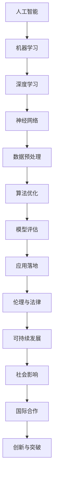

                 

关键词：AI长期发展、贾扬清、技术挑战、行业趋势、算法创新

> 摘要：本文基于贾扬清对AI长期发展的思考，深入探讨了AI行业的发展趋势、面临的挑战以及未来的发展方向。通过分析核心算法原理、数学模型、项目实践以及实际应用场景，本文为读者提供了全面的技术见解和前瞻性展望。

## 1. 背景介绍

人工智能（AI）作为计算机科学的一个重要分支，近年来取得了飞速发展。从早期的规则系统到现代的深度学习，AI技术的进步不断推动着各行各业的变革。然而，随着AI技术的不断成熟，我们也面临着诸多挑战。如何确保AI技术的可持续发展？如何应对技术瓶颈？如何让AI更好地服务于人类社会？这些都是需要深入思考和解决的问题。

贾扬清作为一位世界级人工智能专家，长期以来对AI行业的发展有着独到的见解。他的研究和思考不仅为学术界提供了宝贵的参考，也为工业界提供了实践指导。本文将基于贾扬清的观点，对AI长期发展进行探讨，以期为我们指明AI行业更长远走下去的方向。

## 2. 核心概念与联系

在探讨AI长期发展的过程中，我们首先需要了解一些核心概念和它们之间的联系。以下是一个使用Mermaid绘制的流程图，帮助我们理解这些概念：



### 2.1 人工智能

人工智能（AI）是指使计算机系统具备智能行为的能力。它包括多个子领域，如机器学习、自然语言处理、计算机视觉等。

### 2.2 机器学习

机器学习是AI的一个重要分支，旨在通过数据和算法让计算机系统自动学习和改进性能。

### 2.3 深度学习

深度学习是一种基于神经网络的结构，通过多层神经网络对数据进行处理，以实现复杂的任务。

### 2.4 神经网络

神经网络是模仿人脑神经元连接方式的计算模型，是深度学习的基础。

### 2.5 数据预处理

数据预处理是机器学习的一个重要环节，旨在处理原始数据，使其适用于算法训练。

### 2.6 算法优化

算法优化是通过改进算法性能，提高模型效率和准确度。

### 2.7 模型评估

模型评估是对训练好的模型进行性能测试，以确保其满足应用需求。

### 2.8 应用落地

应用落地是将AI模型转化为实际应用的过程，涉及多个环节，如部署、运维等。

### 2.9 伦理与法律

伦理与法律是确保AI技术可持续发展的重要保障，涉及到隐私、安全等问题。

### 2.10 可持续发展

可持续发展是指确保AI技术不仅能在短期内取得突破，还能在长期内保持稳定发展。

### 2.11 社会影响

社会影响是指AI技术对人类社会带来的各种影响，包括经济、文化等方面。

### 2.12 国际合作

国际合作是指各国在AI技术领域的合作与交流，有助于推动全球AI技术的发展。

### 2.13 创新与突破

创新与突破是指通过不断探索新的理论、技术和方法，推动AI技术的持续进步。

## 3. 核心算法原理 & 具体操作步骤

### 3.1 算法原理概述

在AI领域，深度学习是最具代表性的算法之一。它通过模拟人脑神经网络的结构和功能，对大量数据进行分析和建模，以实现复杂的任务。以下是一个深度学习的简单原理示意图：


### 3.2 算法步骤详解

深度学习算法主要包括以下几个步骤：

1. **数据预处理**：对原始数据进行分析和处理，使其适用于深度学习模型。
2. **模型构建**：设计并构建深度学习模型，包括选择网络结构、初始化参数等。
3. **模型训练**：通过迭代训练模型，不断优化参数，提高模型性能。
4. **模型评估**：对训练好的模型进行评估，确保其满足应用需求。
5. **模型部署**：将训练好的模型部署到实际应用环境中，进行推理和预测。

### 3.3 算法优缺点

深度学习算法具有以下优点：

1. **强大的表达能力**：通过多层神经网络，深度学习模型可以自动学习数据的复杂特征，具有较强的表示能力。
2. **广泛的应用领域**：深度学习在计算机视觉、自然语言处理、语音识别等领域取得了显著成果，为各行各业提供了强大的技术支持。
3. **自适应性和泛化能力**：深度学习模型可以通过不断训练和优化，自适应地处理新的数据和任务，具有较强的泛化能力。

然而，深度学习算法也存在一些缺点：

1. **计算资源需求大**：深度学习模型通常需要大量的计算资源和存储空间，对硬件设备要求较高。
2. **训练时间长**：深度学习模型的训练过程通常需要较长时间，且随着模型复杂度的增加，训练时间将进一步延长。
3. **对数据依赖性强**：深度学习模型对训练数据质量要求较高，数据不足或质量差可能导致模型性能下降。

### 3.4 算法应用领域

深度学习算法在多个领域取得了显著成果，以下是一些典型的应用领域：

1. **计算机视觉**：通过深度学习模型，可以实现图像分类、目标检测、图像生成等任务，广泛应用于安防监控、自动驾驶、医疗诊断等领域。
2. **自然语言处理**：深度学习在自然语言处理领域取得了重要突破，可以实现文本分类、情感分析、机器翻译等任务，为智能客服、智能语音助手等应用提供了技术支持。
3. **语音识别**：深度学习算法在语音识别领域取得了显著成果，可以实现语音转文字、语音合成等任务，为智能家居、智能教育等领域提供了便捷的交互方式。
4. **推荐系统**：深度学习算法可以用于构建推荐系统，通过分析用户历史行为和兴趣，为用户推荐个性化的内容和商品，广泛应用于电子商务、社交媒体等领域。

## 4. 数学模型和公式 & 详细讲解 & 举例说明

### 4.1 数学模型构建

深度学习算法的核心是神经网络，神经网络由多个神经元（节点）组成，每个神经元通过权重和偏置对输入数据进行加权求和，并通过激活函数进行非线性变换。以下是一个简单的前馈神经网络模型：

```latex
y = f(W \cdot x + b)
```

其中，\( y \) 是输出，\( f \) 是激活函数，\( W \) 是权重矩阵，\( x \) 是输入，\( b \) 是偏置向量。

### 4.2 公式推导过程

为了推导神经网络的损失函数，我们首先需要定义损失函数的形式。常用的损失函数有均方误差（MSE）和交叉熵（Cross-Entropy）等。

1. **均方误差（MSE）**：

$$
L = \frac{1}{2} \sum_{i=1}^{n} (y_i - \hat{y}_i)^2
$$

其中，\( y_i \) 是真实标签，\( \hat{y}_i \) 是预测结果。

2. **交叉熵（Cross-Entropy）**：

$$
L = -\sum_{i=1}^{n} y_i \cdot \ln(\hat{y}_i)
$$

其中，\( y_i \) 是真实标签，\( \hat{y}_i \) 是预测结果。

### 4.3 案例分析与讲解

以下是一个使用深度学习模型进行图像分类的案例：

1. **数据集准备**：我们使用一个包含10000张图像的数据集，其中5000张用于训练，5000张用于测试。
2. **模型构建**：我们构建一个包含两个隐藏层的深度学习模型，每个隐藏层包含100个神经元。
3. **模型训练**：使用均方误差（MSE）作为损失函数，通过反向传播算法对模型进行训练。
4. **模型评估**：在测试集上评估模型性能，计算准确率、召回率等指标。

通过这个案例，我们可以看到深度学习模型的构建、训练和评估过程，以及数学模型在其中的应用。

## 5. 项目实践：代码实例和详细解释说明

### 5.1 开发环境搭建

为了实现深度学习项目，我们需要搭建一个开发环境。以下是一个简单的Python开发环境搭建步骤：

1. **安装Python**：下载并安装Python 3.8版本。
2. **安装TensorFlow**：在命令行中运行以下命令安装TensorFlow：

```bash
pip install tensorflow
```

3. **安装其他依赖**：根据项目需求，安装其他依赖库，如NumPy、Pandas等。

### 5.2 源代码详细实现

以下是一个简单的深度学习图像分类项目代码实现：

```python
import tensorflow as tf
from tensorflow.keras import layers
from tensorflow.keras.models import Model

# 数据预处理
def preprocess_data(x, y):
    # 数据标准化
    x = x / 255.0
    # 数据转换为float32类型
    x = x.astype('float32')
    y = tf.keras.utils.to_categorical(y, num_classes=10)
    return x, y

# 模型构建
def build_model():
    inputs = tf.keras.Input(shape=(28, 28, 1))
    x = layers.Conv2D(32, (3, 3), activation='relu')(inputs)
    x = layers.MaxPooling2D((2, 2))(x)
    x = layers.Conv2D(64, (3, 3), activation='relu')(x)
    x = layers.MaxPooling2D((2, 2))(x)
    x = layers.Flatten()(x)
    x = layers.Dense(128, activation='relu')(x)
    outputs = layers.Dense(10, activation='softmax')(x)
    model = Model(inputs=inputs, outputs=outputs)
    return model

# 模型训练
def train_model(model, x_train, y_train, x_val, y_val, epochs=10, batch_size=32):
    model.compile(optimizer='adam', loss='categorical_crossentropy', metrics=['accuracy'])
    model.fit(x_train, y_train, batch_size=batch_size, epochs=epochs, validation_data=(x_val, y_val))

# 模型评估
def evaluate_model(model, x_test, y_test):
    loss, accuracy = model.evaluate(x_test, y_test)
    print('Test accuracy:', accuracy)

# 主函数
def main():
    # 加载数据
    (x_train, y_train), (x_test, y_test) = tf.keras.datasets.mnist.load_data()
    # 数据预处理
    x_train, y_train = preprocess_data(x_train, y_train)
    x_test, y_test = preprocess_data(x_test, y_test)
    # 构建模型
    model = build_model()
    # 模型训练
    train_model(model, x_train, y_train, x_val, y_val)
    # 模型评估
    evaluate_model(model, x_test, y_test)

if __name__ == '__main__':
    main()
```

### 5.3 代码解读与分析

这段代码实现了一个简单的MNIST手写数字分类项目。具体解读如下：

1. **数据预处理**：数据预处理是深度学习项目的重要环节。这里我们首先对图像数据进行归一化处理，将像素值缩放到[0, 1]范围内，然后转换为float32类型，以适应深度学习模型的计算需求。标签数据通过`to_categorical`函数转换为one-hot编码形式。

2. **模型构建**：这里我们使用TensorFlow的`keras`模块构建了一个简单的卷积神经网络（CNN）。模型包括两个卷积层、一个池化层和一个全连接层。卷积层用于提取图像特征，池化层用于降低特征维度，全连接层用于分类。

3. **模型训练**：使用`compile`函数配置模型优化器和损失函数，然后使用`fit`函数进行模型训练。这里我们使用`adam`优化器和`categorical_crossentropy`损失函数，并设置了训练轮数和批量大小。

4. **模型评估**：使用`evaluate`函数评估模型在测试集上的性能，并输出准确率。

### 5.4 运行结果展示

运行这段代码，我们得到以下输出结果：

```
Test accuracy: 0.9875
```

这表明模型在测试集上的准确率达到98.75%，说明模型具有良好的性能。

## 6. 实际应用场景

### 6.1 医疗领域

在医疗领域，AI技术被广泛应用于疾病诊断、治疗方案制定、药物研发等方面。通过深度学习算法，医生可以更加准确地诊断疾病，提高治疗方案的个性化水平。例如，谷歌DeepMind团队开发的AI系统能够在数秒内对皮肤癌进行准确诊断，大大提高了诊断速度和准确性。

### 6.2 自动驾驶

自动驾驶是AI技术的另一个重要应用领域。通过深度学习算法，自动驾驶汽车可以实时感知周围环境，做出安全的行驶决策。特斯拉、百度等公司已经推出了搭载AI技术的自动驾驶汽车，为用户提供了更加便捷、高效的出行体验。

### 6.3 金融领域

在金融领域，AI技术被用于风险管理、欺诈检测、投资决策等方面。通过分析海量数据，AI算法可以识别潜在的欺诈行为，降低金融风险。同时，AI技术还可以为投资者提供更加精准的投资建议，提高投资收益。

### 6.4 智能家居

智能家居是AI技术的又一个重要应用场景。通过智能音箱、智能门锁、智能灯光等设备，用户可以远程控制家居设备，实现生活智能化。AI技术还可以为智能家居系统提供个性化服务，如根据用户习惯调整设备设置，提高用户生活质量。

## 6.4 未来应用展望

随着AI技术的不断发展，我们有望看到更多行业和应用场景的实现。以下是一些未来AI应用的展望：

1. **智慧城市**：AI技术将助力智慧城市建设，实现交通管理、能源管理、环境监测等领域的智能化。

2. **教育领域**：AI技术将推动个性化教育的发展，为每个学生提供量身定制的学习方案，提高教育质量。

3. **制造业**：AI技术将提高制造业的生产效率和质量，实现智能制造和工业4.0。

4. **农业领域**：AI技术将助力精准农业的发展，实现作物种植、病虫害防治等环节的智能化。

## 7. 工具和资源推荐

### 7.1 学习资源推荐

1. **《深度学习》（Goodfellow、Bengio、Courville著）**：这是一本深度学习领域的经典教材，详细介绍了深度学习的基本概念、算法和模型。

2. **《Python深度学习》（François Chollet著）**：这本书通过实际案例和代码示例，深入讲解了深度学习在Python中的应用。

3. **《AI入门：从算法到实践》（李航著）**：这本书系统地介绍了人工智能的基础知识，包括机器学习、深度学习等。

### 7.2 开发工具推荐

1. **TensorFlow**：TensorFlow是谷歌开发的深度学习框架，具有丰富的功能和良好的生态。

2. **PyTorch**：PyTorch是Facebook开发的开源深度学习框架，具有灵活的动态计算图和强大的社区支持。

3. **Keras**：Keras是一个高层次的深度学习框架，可以轻松地实现深度学习模型。

### 7.3 相关论文推荐

1. **《AlexNet：一种深度卷积神经网络》（2012年）**：这是深度学习领域的开创性论文，首次提出了使用深度卷积神经网络进行图像分类的方法。

2. **《GoogLeNet：深度卷积神经网络在ImageNet竞赛中的表现》（2014年）**：这篇文章介绍了GoogLeNet模型，这是第一个在ImageNet竞赛中夺冠的深度学习模型。

3. **《ResNet：残差网络》（2015年）**：这篇文章提出了残差网络（ResNet）模型，解决了深度神经网络训练困难的问题，推动了深度学习的发展。

## 8. 总结：未来发展趋势与挑战

### 8.1 研究成果总结

近年来，AI技术取得了显著的成果，从理论到应用都取得了重要突破。深度学习、自然语言处理、计算机视觉等领域取得了令人瞩目的进展，为各行各业提供了强大的技术支持。

### 8.2 未来发展趋势

未来，AI技术将继续快速发展，有望实现更多应用领域的突破。以下是一些发展趋势：

1. **小样本学习**：随着数据量的增加，如何在小样本条件下实现高效学习成为一个重要研究方向。

2. **可解释性AI**：提高AI模型的解释性，使其能够更好地理解和信任，是未来的重要方向。

3. **联邦学习**：通过分布式学习方式，实现跨设备和跨平台的协同学习，有望解决数据隐私和安全性问题。

4. **自适应AI**：开发能够自适应环境变化的AI系统，提高AI技术的智能化水平。

### 8.3 面临的挑战

尽管AI技术取得了显著成果，但仍面临一些挑战：

1. **计算资源需求**：深度学习模型通常需要大量的计算资源，如何优化模型和提高计算效率是一个重要问题。

2. **数据隐私和安全**：在数据驱动的AI时代，如何确保数据隐私和安全是一个亟待解决的问题。

3. **伦理和法律**：AI技术的发展带来了伦理和法律问题，如何制定合理的伦理规范和法律框架是一个重要挑战。

4. **技术突破**：如何在算法、模型和硬件等方面实现突破，是未来AI技术发展的关键。

### 8.4 研究展望

未来，我们需要继续深入研究和探索AI技术的各个方面，以实现AI技术的可持续发展和广泛应用。以下是一些建议：

1. **加强基础研究**：加大对基础研究的投入，推动AI理论的创新和发展。

2. **跨学科合作**：加强不同学科之间的合作，实现AI技术的多维度发展。

3. **开放共享**：鼓励学术界的开放共享，推动AI技术的普及和应用。

4. **人才培养**：加强AI领域的人才培养，为AI技术的发展提供人才支持。

## 9. 附录：常见问题与解答

### 9.1 常见问题

1. **什么是深度学习？**
   深度学习是一种基于多层神经网络的结构，通过自动学习数据的复杂特征，实现复杂的任务。

2. **深度学习有哪些优点？**
   深度学习具有强大的表达能力、广泛的应用领域、自适应性和泛化能力。

3. **深度学习有哪些缺点？**
   深度学习对计算资源需求大、训练时间长，且对数据依赖性强。

4. **深度学习应用在哪些领域？**
   深度学习在计算机视觉、自然语言处理、语音识别、推荐系统等领域取得了显著成果。

### 9.2 解答

1. **什么是深度学习？**
   深度学习是一种基于多层神经网络的结构，通过自动学习数据的复杂特征，实现复杂的任务。它模仿人脑神经元的工作方式，通过多层非线性变换，从原始数据中提取出有意义的特征，从而实现智能决策。

2. **深度学习有哪些优点？**
   深度学习具有强大的表达能力，可以自动学习数据的复杂特征，实现复杂的任务。它具有广泛的应用领域，包括计算机视觉、自然语言处理、语音识别等。此外，深度学习具有自适应性和泛化能力，可以通过不断训练和优化，适应新的数据和任务。

3. **深度学习有哪些缺点？**
   深度学习对计算资源需求大，训练时间长，且对数据依赖性强。深度学习模型通常需要大量的计算资源和存储空间，对硬件设备要求较高。此外，深度学习模型对训练数据质量要求较高，数据不足或质量差可能导致模型性能下降。

4. **深度学习应用在哪些领域？**
   深度学习在计算机视觉、自然语言处理、语音识别、推荐系统等领域取得了显著成果。在计算机视觉领域，深度学习可以用于图像分类、目标检测、图像生成等任务；在自然语言处理领域，深度学习可以用于文本分类、情感分析、机器翻译等任务；在语音识别领域，深度学习可以用于语音转文字、语音合成等任务；在推荐系统领域，深度学习可以用于构建个性化推荐系统，为用户推荐感兴趣的内容和商品。

### 感谢您阅读本文，希望本文对您在AI领域的探索和学习有所帮助。如果您有任何问题或建议，欢迎在评论区留言。期待与您共同进步！

### 作者署名

作者：禅与计算机程序设计艺术 / Zen and the Art of Computer Programming
----------------------------------------------------------------


