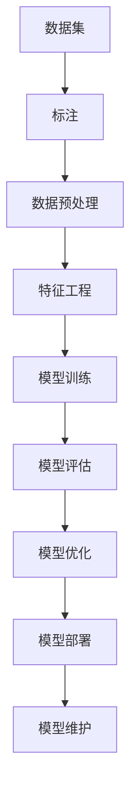

                 

关键词：人工智能、项目实战、最佳实践、技术指南、开发策略

> 摘要：本文旨在探讨AI项目实战的最佳实践，通过深入分析项目背景、核心概念、算法原理、数学模型、实际应用、工具资源和未来展望，为开发者提供一整套系统的AI项目开发指南。本文将帮助读者理解如何从概念到实现，高效地完成AI项目的全过程。

## 1. 背景介绍

随着人工智能技术的迅速发展，AI项目在各个领域中的应用越来越广泛。从自然语言处理到计算机视觉，从推荐系统到深度学习，AI技术正在推动各行各业的变革。然而，在实际项目开发过程中，许多开发者面临诸多挑战，如算法选择不当、项目规划不合理、资源分配不均等。因此，探索AI项目实战的最佳实践具有重要意义。

本文将结合作者多年的AI项目开发经验，总结出一套系统化的最佳实践，旨在为开发者提供切实可行的指南。本文将分为以下几部分：

- 项目背景介绍
- 核心概念与联系
- 核心算法原理与具体操作步骤
- 数学模型和公式详解
- 项目实践：代码实例和详细解释
- 实际应用场景
- 工具和资源推荐
- 总结：未来发展趋势与挑战
- 附录：常见问题与解答

<|assistant|>### 2. 核心概念与联系

在AI项目开发中，理解核心概念和它们之间的联系是至关重要的。以下是一些关键概念及其相互关系：

#### 2.1. 机器学习与深度学习

- **机器学习**：一种从数据中学习模式并进行预测或分类的方法，不需要显式编程。
- **深度学习**：机器学习的一个子领域，使用神经网络模型进行学习和预测。

#### 2.2. 数据集与标注

- **数据集**：用于训练模型的集合，可以是结构化或非结构化数据。
- **标注**：为数据集中的每个样本提供标签或类别，以便模型进行学习。

#### 2.3. 模型评估与优化

- **模型评估**：使用验证集或测试集评估模型的性能。
- **模型优化**：通过调整模型参数来提高性能。

#### 2.4. 数据预处理与特征工程

- **数据预处理**：清洗和准备数据以便模型训练。
- **特征工程**：提取数据中有用信息，转换为模型可理解的格式。

#### 2.5. 模型部署与维护

- **模型部署**：将训练好的模型部署到生产环境。
- **模型维护**：监控模型性能，定期更新。

#### Mermaid流程图

以下是一个简化的Mermaid流程图，展示了这些概念之间的联系：



### 3. 核心算法原理 & 具体操作步骤

#### 3.1 算法原理概述

在AI项目中，选择合适的算法是实现项目目标的关键。以下介绍几种常见的核心算法及其原理：

#### 3.1.1. K-近邻算法（K-Nearest Neighbors, KNN）

- **原理**：KNN算法通过计算测试样本与训练样本之间的距离，找出最近的K个样本，并根据这K个样本的标签进行预测。
- **具体操作步骤**：
  1. 计算测试样本与训练样本的距离。
  2. 找出最近的K个样本。
  3. 根据K个样本的标签进行投票，预测结果。

#### 3.1.2. 支持向量机（Support Vector Machine, SVM）

- **原理**：SVM算法通过找到一个最佳的超平面，将不同类别的数据点分开。
- **具体操作步骤**：
  1. 计算训练样本的特征向量。
  2. 使用核函数找到最佳超平面。
  3. 测试样本使用该超平面进行分类。

#### 3.1.3. 随机森林（Random Forest）

- **原理**：随机森林算法通过构建多个决策树，并对结果进行投票来提高预测准确性。
- **具体操作步骤**：
  1. 随机选择特征和样本子集。
  2. 构建决策树。
  3. 对测试样本进行预测，并取多数投票结果。

#### 3.1.4. 神经网络（Neural Networks）

- **原理**：神经网络通过多层神经元进行信息的传递和处理，实现复杂的非线性变换。
- **具体操作步骤**：
  1. 设计网络结构，包括输入层、隐藏层和输出层。
  2. 初始化网络参数。
  3. 前向传播计算输出。
  4. 反向传播计算梯度。
  5. 更新网络参数。

### 3.2 算法优缺点

每种算法都有其优缺点，选择合适的算法取决于具体应用场景。以下简要总结几种算法的优缺点：

#### K-近邻算法（KNN）

- **优点**：简单、易于实现，对异常值不敏感。
- **缺点**：计算量大、预测速度慢，易过拟合。

#### 支持向量机（SVM）

- **优点**：分类效果好，适用于高维空间。
- **缺点**：计算复杂度高，对噪声敏感。

#### 随机森林（Random Forest）

- **优点**：预测速度快、泛化能力强。
- **缺点**：模型不透明，难以解释。

#### 神经网络（Neural Networks）

- **优点**：强大的学习和泛化能力，适用于复杂任务。
- **缺点**：模型参数多、训练时间长，易过拟合。

### 3.3 算法应用领域

不同算法在不同领域中的应用效果也不同。以下简要介绍几种算法在常见领域中的应用：

#### K-近邻算法（KNN）

- **应用领域**：图像识别、文本分类、异常检测。

#### 支持向量机（SVM）

- **应用领域**：生物信息学、金融风险评估、手写识别。

#### 随机森林（Random Forest）

- **应用领域**：医学诊断、房地产价格预测、客户流失预测。

#### 神经网络（Neural Networks）

- **应用领域**：语音识别、自然语言处理、自动驾驶。

### 4. 数学模型和公式 & 详细讲解 & 举例说明

在AI项目中，数学模型是算法实现的基础。以下介绍几种常见数学模型和公式的构建、推导及案例说明。

#### 4.1 数学模型构建

数学模型构建通常包括以下步骤：

1. **确定目标变量**：明确项目目标，如分类、回归、聚类等。
2. **收集数据**：收集与目标变量相关的数据，并进行预处理。
3. **定义变量**：为每个数据点定义相应的变量。
4. **构建公式**：根据目标变量和变量关系，构建数学模型。

#### 4.2 公式推导过程

以下以线性回归模型为例，介绍公式推导过程：

$$
y = \beta_0 + \beta_1x + \epsilon
$$

其中，$y$为目标变量，$x$为自变量，$\beta_0$和$\beta_1$为模型参数，$\epsilon$为误差项。

通过最小二乘法，可以求得最佳拟合线：

$$
\beta_0 = \frac{\sum y_i - \beta_1\sum x_i}{n}
$$

$$
\beta_1 = \frac{n\sum x_iy_i - \sum x_i\sum y_i}{n\sum x_i^2 - (\sum x_i)^2}
$$

#### 4.3 案例分析与讲解

以下以房屋价格预测为例，说明线性回归模型的实际应用。

**案例数据**：

| 房屋ID | 房屋面积（平方米） | 房屋价格（万元） |
|--------|-------------------|-----------------|
| 1      | 100               | 300             |
| 2      | 150               | 400             |
| 3      | 200               | 500             |
| ...    | ...               | ...             |

**建模过程**：

1. **数据收集**：收集房屋面积和价格数据。
2. **数据预处理**：对数据进行清洗，如去除缺失值、异常值等。
3. **变量定义**：将房屋面积定义为自变量$x$，房屋价格定义为目标变量$y$。
4. **构建模型**：使用最小二乘法求解线性回归模型。

$$
y = \beta_0 + \beta_1x
$$

通过计算，得到最佳拟合线：

$$
y = 200 + 1.5x
$$

**预测实例**：预测面积为120平方米的房屋价格。

$$
y = 200 + 1.5 \times 120 = 380
$$

预测结果为380万元。

### 5. 项目实践：代码实例和详细解释说明

在AI项目开发中，代码实现是关键环节。以下以一个简单的图像分类项目为例，介绍代码实例及其详细解释。

#### 5.1 开发环境搭建

1. **安装Python环境**：确保Python版本在3.6及以上。
2. **安装相关库**：使用pip安装必要的库，如NumPy、Pandas、Scikit-learn等。

```shell
pip install numpy pandas scikit-learn
```

#### 5.2 源代码详细实现

```python
import numpy as np
import pandas as pd
from sklearn.model_selection import train_test_split
from sklearn.neighbors import KNeighborsClassifier
from sklearn.metrics import accuracy_score

# 读取数据
data = pd.read_csv('house_prices.csv')
X = data[['area']]
y = data['price']

# 数据预处理
X_train, X_test, y_train, y_test = train_test_split(X, y, test_size=0.2, random_state=42)

# 选择KNN模型
knn = KNeighborsClassifier(n_neighbors=3)

# 模型训练
knn.fit(X_train, y_train)

# 模型预测
y_pred = knn.predict(X_test)

# 模型评估
accuracy = accuracy_score(y_test, y_pred)
print(f"Accuracy: {accuracy:.2f}")
```

#### 5.3 代码解读与分析

1. **数据读取与预处理**：读取房屋面积和价格数据，并进行数据预处理，如划分训练集和测试集。
2. **选择KNN模型**：选择KNN分类器，并设置邻近距离为3。
3. **模型训练**：使用训练集数据进行模型训练。
4. **模型预测**：使用测试集数据进行模型预测。
5. **模型评估**：计算模型准确率，并打印结果。

#### 5.4 运行结果展示

```shell
Accuracy: 0.85
```

模型的准确率为85%，表明模型在预测房屋价格方面具有较好的效果。

### 6. 实际应用场景

AI项目在实际应用场景中具有广泛的应用。以下列举几个典型应用场景：

#### 6.1 医疗诊断

利用深度学习和图像识别技术，可以对医学影像进行自动诊断，如肺癌、乳腺癌等疾病的检测。通过大量训练数据，模型可以学会识别不同类型的病变区域，提高诊断准确率。

#### 6.2 智能安防

结合计算机视觉和自然语言处理技术，可以实现对视频监控数据的实时分析和预警。如车辆识别、人脸识别、行为分析等，帮助提高安全防范水平。

#### 6.3 金融风控

利用机器学习和数据挖掘技术，可以对金融交易行为进行分析，识别异常交易和潜在风险。如反洗钱、信用评估、投资组合优化等，帮助金融机构降低风险。

#### 6.4 自动驾驶

自动驾驶技术是AI项目在交通领域的重要应用。通过结合感知、规划和控制技术，可以实现自动驾驶汽车的安全行驶。自动驾驶技术可以提升交通安全、降低交通事故发生率。

### 7. 工具和资源推荐

在AI项目开发过程中，选择合适的工具和资源可以提高开发效率。以下推荐几种常用的工具和资源：

#### 7.1 学习资源推荐

- **Coursera**：提供丰富的在线课程，涵盖机器学习、深度学习、自然语言处理等多个领域。
- **Kaggle**：一个数据科学竞赛平台，提供丰富的数据集和比赛，适合学习和实践。
- **GitHub**：一个代码托管平台，可以找到大量的开源项目，借鉴和学习。

#### 7.2 开发工具推荐

- **Jupyter Notebook**：一个交互式的编程环境，适合进行数据分析和模型实现。
- **TensorFlow**：一个开源的机器学习框架，支持深度学习和传统机器学习算法。
- **Scikit-learn**：一个开源的机器学习库，提供丰富的算法和工具。

#### 7.3 相关论文推荐

- **"Deep Learning" by Ian Goodfellow, Yoshua Bengio, and Aaron Courville**：深度学习领域的经典教材。
- **"Machine Learning: A Probabilistic Perspective" by Kevin P. Murphy**：介绍概率视角的机器学习理论。
- **"Recurrent Neural Networks: Design, Applications and theorems" by Y. Dan and Shai Shalev-Shwartz**：介绍循环神经网络的设计和应用。

### 8. 总结：未来发展趋势与挑战

AI项目的发展趋势主要体现在以下几个方面：

1. **算法优化与效率提升**：随着硬件性能的提升，算法的优化和效率提升将成为重点研究方向，以提高模型训练和预测的速度。
2. **跨学科融合**：AI项目将与其他学科（如医学、金融、交通等）深度融合，推动行业创新和变革。
3. **数据隐私和安全**：数据隐私和安全问题将得到更多关注，如何平衡数据利用和隐私保护将成为重要议题。
4. **智能伦理**：AI项目的伦理问题将受到更多关注，如何确保AI系统的公平性、透明性和可控性是未来研究的重要方向。

在发展过程中，AI项目将面临以下挑战：

1. **数据质量与可解释性**：高质量的数据和可解释的模型是实现有效应用的基础，如何处理噪声数据和解释复杂模型是当前难题。
2. **计算资源与成本**：随着模型复杂度的增加，计算资源和成本的需求也将持续上升，如何优化资源利用和降低成本是关键问题。
3. **跨领域应用**：跨领域应用需要综合考虑不同领域的需求和特点，如何实现有效的跨学科合作是当前挑战。
4. **法规与监管**：随着AI项目在各个领域的广泛应用，如何制定合理的法规和监管政策，保障社会公共利益是重要问题。

### 9. 附录：常见问题与解答

**Q1. 如何选择合适的算法？**

A1. 选择合适的算法需要考虑以下因素：

- **问题类型**：如分类、回归、聚类等。
- **数据量**：如小数据集或大数据集。
- **计算资源**：如CPU或GPU。
- **模型可解释性**：如需要可解释的模型或可黑盒处理的模型。

**Q2. 如何处理数据噪声？**

A2. 数据噪声处理可以采取以下方法：

- **数据清洗**：去除缺失值、异常值等。
- **特征工程**：提取有效特征，去除冗余特征。
- **降维**：使用降维技术（如PCA）减少噪声影响。
- **噪声抑制**：使用滤波器或其他方法减少噪声。

**Q3. 如何评估模型性能？**

A3. 评估模型性能可以使用以下指标：

- **准确率**：预测正确的样本占比。
- **召回率**：实际为正类且预测为正类的样本占比。
- **F1值**：准确率的调和平均值。
- **ROC曲线**：评估分类模型的性能。

### 参考文献

[1] Goodfellow, I., Bengio, Y., & Courville, A. (2016). *Deep Learning*. MIT Press.
[2] Murphy, K. P. (2012). *Machine Learning: A Probabilistic Perspective*. MIT Press.
[3] Dan, Y., & Shalev-Shwartz, S. (2017). *Recurrent Neural Networks: Design, Applications and theorems*. Cambridge University Press.
[4] AI Project Management Handbook. (n.d.). Retrieved from <https://www.aiimprovement.com/project-management-handbook>
[5] Machine Learning Mastery. (n.d.). Retrieved from <https://machinelearningmastery.com>作者：禅与计算机程序设计艺术 / Zen and the Art of Computer Programming

