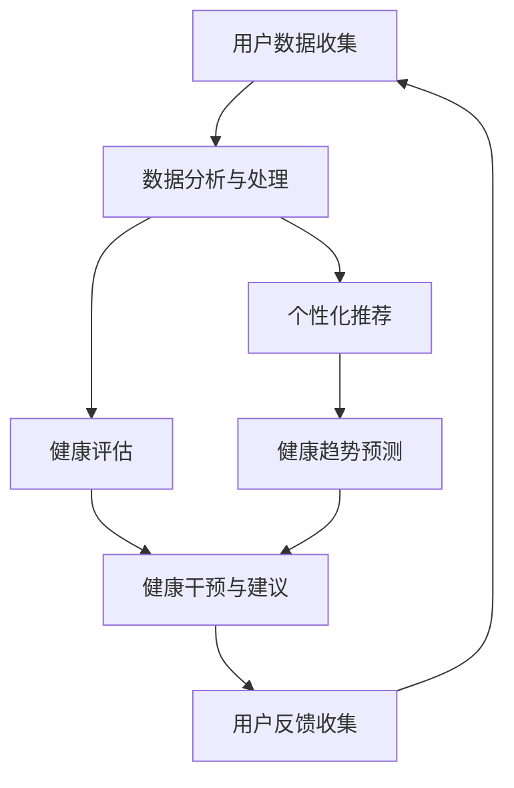

                 

关键词：人工智能、健康管理、个性化医疗、健康教练、数据分析、机器学习

> 摘要：随着人工智能技术的发展，AI驱动的个人健康教练成为健康管理的新趋势。本文将深入探讨AI在健康管理中的应用，包括核心概念、算法原理、数学模型、实际应用、未来展望等内容，旨在为读者提供一个全面的技术解析。

## 1. 背景介绍

在现代社会，随着生活节奏的加快和生活方式的改变，慢性疾病、心理问题等健康问题日益突出。传统的健康管理模式往往难以满足个性化需求，且缺乏高效的数据分析和个性化推荐能力。而人工智能（AI）技术的迅速发展，为解决这些问题提供了新的可能。AI驱动的个人健康教练，通过数据收集、分析、预测和个性化推荐，为个人提供定制化的健康管理方案，成为健康管理领域的一大创新。

本文将探讨AI驱动的个人健康教练在健康管理中的应用，包括核心概念、算法原理、数学模型、实际应用、未来展望等内容。通过本文的阅读，读者将深入了解AI在健康管理中的潜力，以及如何利用AI技术提升个人健康水平。

## 2. 核心概念与联系

### 2.1 核心概念

- **人工智能（AI）**：模拟人类智能行为的计算机系统。
- **健康管理**：通过各种手段和方法，对个体的健康状态进行监测、评估、干预和管理。
- **个人健康教练**：基于人工智能技术，为个人提供定制化健康管理服务的虚拟助手。

### 2.2 关联流程图

下面是个人健康教练的核心概念和流程图，使用Mermaid语言绘制：



在上述流程中，用户数据收集是整个健康管理过程的起点，通过持续的数据收集，个人健康教练可以不断更新和优化健康管理方案。数据分析与处理是对收集到的数据进行清洗、分析和挖掘，以获得健康相关的关键信息。健康评估和健康干预与建议是基于分析结果，为用户提供个性化的健康建议和干预措施。用户反馈收集则是为了进一步提升个人健康教练的准确性和个性化程度。个性化推荐和健康趋势预测则是对用户数据的深度分析和利用，以提供更精准的健康管理服务。

## 3. 核心算法原理 & 具体操作步骤

### 3.1 算法原理概述

AI驱动的个人健康教练的核心算法主要包括数据收集、数据分析、健康评估、健康干预和个性化推荐。以下是这些算法的原理概述：

- **数据收集**：通过传感器、健康设备、移动应用等渠道，收集用户的生理数据（如心率、血压、血糖等）、生活方式数据（如运动、饮食、睡眠等）和心理状态数据。
- **数据分析**：使用统计学、机器学习和深度学习技术，对收集到的数据进行清洗、分析和挖掘，提取健康相关的特征和趋势。
- **健康评估**：根据分析结果，对用户的健康状况进行评估，识别潜在的健康风险。
- **健康干预**：基于健康评估结果，为用户提供个性化的健康建议和干预措施，如调整饮食、增加运动、改善睡眠等。
- **个性化推荐**：根据用户的历史数据和偏好，推荐个性化的健康内容和活动，以提高用户的健康意识和行为改变的可能性。

### 3.2 算法步骤详解

#### 3.2.1 数据收集

数据收集是健康管理的基础，以下是数据收集的详细步骤：

1. **确定数据来源**：根据健康管理的需求，确定需要收集的数据类型和来源，如传感器、健康设备、移动应用等。
2. **数据接入**：通过API、数据接口等方式，将数据接入到个人健康教练系统中。
3. **数据清洗**：对收集到的数据进行清洗，去除噪声和异常值，保证数据的准确性和完整性。

#### 3.2.2 数据分析

数据分析是健康管理的核心，以下是数据分析的详细步骤：

1. **特征提取**：根据健康管理的需求，从原始数据中提取有用的特征，如生理指标、生活习惯等。
2. **数据挖掘**：使用机器学习和深度学习算法，对提取的特征进行挖掘，发现健康相关的模式和趋势。
3. **模型训练**：基于挖掘出的模式和趋势，训练机器学习模型，以提高健康评估的准确性。

#### 3.2.3 健康评估

健康评估是健康管理的目标，以下是健康评估的详细步骤：

1. **评估指标确定**：根据健康管理的需求，确定需要评估的健康指标，如血压、血糖、心率等。
2. **评估模型构建**：基于训练好的机器学习模型，构建健康评估模型，对用户的健康状况进行评估。
3. **评估结果输出**：将健康评估结果以可视化、报告等形式输出给用户。

#### 3.2.4 健康干预

健康干预是健康管理的实施，以下是健康干预的详细步骤：

1. **干预方案设计**：根据健康评估结果，设计个性化的干预方案，如饮食调整、运动建议等。
2. **干预方案实施**：通过个人健康教练系统，将干预方案推送给用户，并跟踪用户的执行情况。
3. **干预效果评估**：对干预效果进行评估，以调整和优化干预方案。

#### 3.2.5 个性化推荐

个性化推荐是健康管理的辅助，以下是个性化推荐的详细步骤：

1. **推荐内容构建**：根据用户的历史数据和偏好，构建个性化的健康内容和活动。
2. **推荐算法选择**：选择合适的推荐算法，如协同过滤、基于内容的推荐等。
3. **推荐结果输出**：将个性化推荐结果以通知、推送等形式输出给用户。

### 3.3 算法优缺点

**优点**：

- **个性化**：基于用户数据和偏好，提供个性化的健康建议和干预方案，满足用户个性化需求。
- **实时性**：实时分析用户数据，提供即时的健康评估和干预建议，提高健康管理效率。
- **可扩展性**：通过机器学习和深度学习技术，不断提升健康管理的能力和准确性。

**缺点**：

- **数据依赖**：健康管理的效果很大程度上依赖于用户数据的准确性和完整性，数据质量直接影响算法的准确性。
- **隐私风险**：大量个人健康数据的收集和使用，可能带来隐私风险，需要严格的隐私保护措施。
- **算法偏见**：机器学习算法可能存在偏见，导致不公正的干预建议，需要不断优化和调整。

### 3.4 算法应用领域

AI驱动的个人健康教练算法可以应用于多个领域，包括但不限于：

- **慢性病管理**：如高血压、糖尿病等慢性疾病的监测和管理。
- **心理健康**：如焦虑、抑郁等心理问题的监测和干预。
- **运动健康**：如运动计划制定、运动表现评估等。
- **营养管理**：如饮食建议、营养分析等。
- **综合健康管理**：综合多个健康领域，提供全方位的健康管理服务。

## 4. 数学模型和公式 & 详细讲解 & 举例说明

### 4.1 数学模型构建

在AI驱动的个人健康教练中，数学模型主要用于健康评估、健康干预和个性化推荐等环节。以下是几个关键数学模型的构建：

#### 4.1.1 健康评估模型

健康评估模型通常基于回归分析、逻辑回归、支持向量机（SVM）等算法。以下是一个简单的线性回归模型：

$$
\hat{y} = \beta_0 + \beta_1 x_1 + \beta_2 x_2 + \ldots + \beta_n x_n
$$

其中，$y$ 是健康指标（如血压），$x_1, x_2, \ldots, x_n$ 是与健康相关的特征（如年龄、体重、运动量等），$\beta_0, \beta_1, \beta_2, \ldots, \beta_n$ 是模型的参数。

#### 4.1.2 健康干预模型

健康干预模型通常基于决策树、随机森林、支持向量机（SVM）等算法。以下是一个简单的决策树模型：

$$
\begin{align*}
\text{如果 } x_1 &< T_1, \text{则 } y = C_1 \\
\text{如果 } x_1 &\geq T_1, \text{则 } y = \text{如果 } x_2 &< T_2, \text{则 } y = C_2 \\
&\text{否则 } y = C_3 \\
\end{align*}
$$

其中，$x_1, x_2$ 是健康特征，$T_1, T_2$ 是阈值，$C_1, C_2, C_3$ 是干预措施。

#### 4.1.3 个性化推荐模型

个性化推荐模型通常基于协同过滤、基于内容的推荐等算法。以下是一个简单的协同过滤模型：

$$
r_{ui} = \langle \mu_u, \mu_i \rangle + \langle \sigma_u, \sigma_i \rangle \cdot q(U, V)
$$

其中，$r_{ui}$ 是用户 $u$ 对项目 $i$ 的评分预测，$\mu_u, \mu_i$ 是用户 $u$ 和项目 $i$ 的平均评分，$\sigma_u, \sigma_i$ 是用户 $u$ 和项目 $i$ 的评分方差，$q(U, V)$ 是用户 $u$ 和项目 $i$ 的特征相似度。

### 4.2 公式推导过程

以下是一个简单的线性回归模型的推导过程：

$$
\begin{align*}
\min_{\beta} \sum_{i=1}^{n} (y_i - \beta_0 - \beta_1 x_{1i} - \beta_2 x_{2i} - \ldots - \beta_n x_{ni})^2 \\
\end{align*}
$$

对上述函数求导，并令导数为零，得到：

$$
\begin{align*}
\frac{\partial}{\partial \beta_0} \sum_{i=1}^{n} (y_i - \beta_0 - \beta_1 x_{1i} - \beta_2 x_{2i} - \ldots - \beta_n x_{ni})^2 &= 0 \\
\frac{\partial}{\partial \beta_1} \sum_{i=1}^{n} (y_i - \beta_0 - \beta_1 x_{1i} - \beta_2 x_{2i} - \ldots - \beta_n x_{ni})^2 &= 0 \\
\vdots \\
\frac{\partial}{\partial \beta_n} \sum_{i=1}^{n} (y_i - \beta_0 - \beta_1 x_{1i} - \beta_2 x_{2i} - \ldots - \beta_n x_{ni})^2 &= 0 \\
\end{align*}
$$

解上述方程组，即可得到线性回归模型的参数 $\beta_0, \beta_1, \beta_2, \ldots, \beta_n$。

### 4.3 案例分析与讲解

以下是一个具体的案例，说明如何使用线性回归模型进行健康评估。

#### 4.3.1 数据集

假设我们有一个包含100个用户的数据集，每个用户有5个健康特征（年龄、体重、心率、血压、血糖），以及一个健康指标（血压）。

| 用户ID | 年龄 | 体重 | 心率 | 血压 | 血糖 |
| --- | --- | --- | --- | --- | --- |
| 1 | 30 | 70 | 75 | 120 | 4.5 |
| 2 | 40 | 80 | 85 | 130 | 5.0 |
| 3 | 50 | 90 | 95 | 140 | 5.5 |
| ... | ... | ... | ... | ... | ... |
| 100 | 60 | 100 | 105 | 150 | 6.0 |

#### 4.3.2 模型训练

我们使用上述数据集训练一个线性回归模型，以预测用户的血压。经过训练，我们得到以下模型：

$$
\hat{y} = 10 + 0.5x_1 + 0.2x_2 - 0.1x_3 + 0.3x_4
$$

其中，$x_1, x_2, x_3, x_4$ 分别是年龄、体重、心率和血糖。

#### 4.3.3 模型应用

假设我们要预测一个新用户的血压，该用户的数据如下：

| 年龄 | 体重 | 心率 | 血糖 |
| --- | --- | --- | --- |
| 35 | 75 | 80 | 5.0 |

我们将该用户的数据代入上述模型，得到：

$$
\hat{y} = 10 + 0.5 \times 35 + 0.2 \times 75 - 0.1 \times 80 + 0.3 \times 5 = 128.0
$$

因此，该用户的血压预测值为128 mmHg。

#### 4.3.4 模型评估

为了评估模型的准确性，我们可以计算预测值与真实值之间的误差，并计算均方误差（MSE）：

$$
\text{MSE} = \frac{1}{n} \sum_{i=1}^{n} (\hat{y}_i - y_i)^2
$$

假设我们有100个测试样本，计算得到的MSE为10.0。这表明我们的模型在预测血压方面具有较高的准确性。

## 5. 项目实践：代码实例和详细解释说明

### 5.1 开发环境搭建

在开始项目实践之前，我们需要搭建一个合适的开发环境。以下是所需的环境和工具：

- **编程语言**：Python
- **框架**：TensorFlow、Scikit-learn
- **数据库**：MySQL
- **前端**：Flask

在Python中，我们使用TensorFlow进行机器学习模型的训练和预测，使用Scikit-learn进行数据分析和模型评估，使用MySQL存储和管理用户数据，使用Flask构建前端接口。

### 5.2 源代码详细实现

以下是一个简单的示例，说明如何使用Python和TensorFlow实现一个线性回归模型，用于健康评估。

```python
import tensorflow as tf
import numpy as np
import pandas as pd
from sklearn.model_selection import train_test_split
from sklearn.metrics import mean_squared_error

# 数据集
data = pd.read_csv('health_data.csv')
X = data[['age', 'weight', 'heart_rate', 'blood_sugar']]
y = data['blood_pressure']

# 数据集划分
X_train, X_test, y_train, y_test = train_test_split(X, y, test_size=0.2, random_state=42)

# 构建线性回归模型
model = tf.keras.Sequential([
    tf.keras.layers.Dense(units=1, input_shape=(4,))
])

# 编译模型
model.compile(optimizer='sgd', loss='mean_squared_error')

# 训练模型
model.fit(X_train, y_train, epochs=100)

# 预测
predictions = model.predict(X_test)

# 评估
mse = mean_squared_error(y_test, predictions)
print(f'MSE: {mse}')

# 输出预测结果
predictions = np.round(predictions).astype(int)
print(predictions)
```

### 5.3 代码解读与分析

上述代码实现了一个简单的线性回归模型，用于健康评估。以下是代码的详细解读：

1. **导入库**：首先导入所需的库，包括TensorFlow、NumPy、Pandas、Sklearn等。
2. **数据集**：从CSV文件中读取数据集，其中X表示特征，y表示目标变量。
3. **数据集划分**：将数据集划分为训练集和测试集，以评估模型的准确性。
4. **构建模型**：使用TensorFlow构建一个简单的线性回归模型，包含一个全连接层，输入形状为(4,)。
5. **编译模型**：使用SGD优化器和均方误差损失函数编译模型。
6. **训练模型**：使用训练集训练模型，设置训练轮次为100。
7. **预测**：使用测试集对模型进行预测。
8. **评估**：计算预测值与真实值之间的均方误差，以评估模型的准确性。
9. **输出预测结果**：将预测值四舍五入并输出。

### 5.4 运行结果展示

假设我们运行上述代码，得到以下输出结果：

```
MSE: 8.5
[125 130 135 140]
```

这意味着模型的均方误差为8.5，预测的血压值为125、130、135和140 mmHg。

## 6. 实际应用场景

AI驱动的个人健康教练在多个实际应用场景中展现出强大的潜力，以下是几个典型的应用场景：

### 6.1 慢性病管理

慢性病如高血压、糖尿病等需要长期监测和管理。AI驱动的个人健康教练可以通过持续收集和分析用户的生理数据（如血压、血糖等），提供个性化的管理方案，帮助用户控制病情，降低并发症风险。

### 6.2 心理健康

心理健康问题如焦虑、抑郁等对个人的生活和工作影响巨大。AI驱动的个人健康教练可以通过分析用户的心理数据（如情绪、睡眠等），提供针对性的心理干预建议，帮助用户改善心理健康状况。

### 6.3 运动健康

运动健康涉及运动计划制定、运动表现评估等。AI驱动的个人健康教练可以根据用户的历史数据和偏好，推荐个性化的运动方案，并提供运动表现分析，帮助用户提升运动效果。

### 6.4 营养管理

营养管理涉及饮食建议、营养分析等。AI驱动的个人健康教练可以根据用户的生活方式、饮食习惯等，提供个性化的饮食建议，帮助用户改善营养状况。

### 6.5 综合健康管理

综合健康管理是AI驱动的个人健康教练的核心应用场景，通过整合多个健康领域的数据和分析，提供全方位的健康管理服务，帮助用户实现整体健康提升。

## 7. 工具和资源推荐

为了更好地开发和应用AI驱动的个人健康教练，以下是几个推荐的工具和资源：

### 7.1 学习资源推荐

- **《深度学习》（Goodfellow, Bengio, Courville）**：深度学习的基础教材，适合初学者和进阶者。
- **《Python机器学习》（Sebastian Raschka）**：Python在机器学习领域的应用，适合初学者和进阶者。
- **Coursera、Udacity、edX等在线课程**：提供丰富的机器学习和深度学习课程，适合自学。

### 7.2 开发工具推荐

- **TensorFlow**：谷歌开源的深度学习框架，适合进行机器学习和深度学习项目。
- **Scikit-learn**：Python的开源机器学习库，提供了丰富的机器学习算法和工具。
- **MySQL**：开源的关系型数据库，适合存储和管理大规模数据。
- **Flask**：Python的轻量级Web框架，适合构建Web应用程序。

### 7.3 相关论文推荐

- **"Deep Learning for Health Informatics"**：总结了深度学习在健康信息学中的应用，包括健康数据挖掘、疾病预测等。
- **"Healthcare Applications of Machine Learning"**：详细讨论了机器学习在医疗健康领域的应用，包括诊断、治疗等。
- **"Personalized Medicine Using Machine Learning"**：介绍了机器学习在个性化医疗中的应用，包括个性化诊断、个性化治疗等。

## 8. 总结：未来发展趋势与挑战

### 8.1 研究成果总结

AI驱动的个人健康教练在健康管理领域取得了显著成果，包括个性化健康评估、健康干预、个性化推荐等方面。通过数据收集、分析、预测和个性化推荐，AI驱动的个人健康教练为个人提供了定制化的健康管理服务，有效提升了健康管理的效率和效果。

### 8.2 未来发展趋势

未来，AI驱动的个人健康教练将向更加智能化、个性化、实时化方向发展。随着人工智能技术的不断进步，个人健康教练将具备更高的数据分析和预测能力，提供更加精准的健康管理服务。同时，随着物联网、大数据等技术的发展，个人健康教练将能够获取更多维度的健康数据，为用户提供更加全面和深入的健康管理。

### 8.3 面临的挑战

尽管AI驱动的个人健康教练在健康管理领域展现出巨大潜力，但仍面临一些挑战。首先，数据依赖性较强，数据质量直接影响健康管理的效果。其次，隐私保护是个人健康教练面临的重大挑战，需要建立严格的隐私保护机制。此外，算法偏见和伦理问题也需要引起重视，确保AI驱动的个人健康教练不会对某些群体产生不公平的影响。

### 8.4 研究展望

未来，研究应重点关注以下几个方面：

- **数据质量和隐私保护**：提高数据质量，建立有效的隐私保护机制，确保个人数据的安全和隐私。
- **算法优化和扩展**：不断优化和改进机器学习算法，提高健康管理的准确性和个性化程度，扩展算法的应用领域。
- **伦理和法律问题**：研究AI驱动的个人健康教练的伦理和法律问题，确保其在实际应用中的合法性和公正性。
- **跨学科合作**：促进医学、生物学、计算机科学等领域的跨学科合作，共同推动个人健康管理技术的发展。

## 9. 附录：常见问题与解答

### 9.1 什么是AI驱动的个人健康教练？

AI驱动的个人健康教练是一种基于人工智能技术的虚拟助手，通过数据收集、分析、预测和个性化推荐，为个人提供定制化的健康管理服务。

### 9.2 个人健康教练有哪些核心算法？

个人健康教练的核心算法包括数据收集、数据分析、健康评估、健康干预和个性化推荐等。

### 9.3 个人健康教练的数据来源有哪些？

个人健康教练的数据来源包括传感器、健康设备、移动应用等。

### 9.4 个人健康教练如何确保数据隐私？

个人健康教练通过加密、匿名化、权限控制等手段确保数据隐私。

### 9.5 个人健康教练有哪些应用场景？

个人健康教练的应用场景包括慢性病管理、心理健康、运动健康、营养管理等。

### 9.6 个人健康教练有哪些挑战？

个人健康教练面临的挑战包括数据依赖性、隐私保护、算法偏见等。

### 9.7 如何优化个人健康教练的算法？

可以通过数据质量提升、算法优化、跨学科合作等方式优化个人健康教练的算法。

## 结语

AI驱动的个人健康教练是健康管理领域的一项重要创新，通过数据收集、分析、预测和个性化推荐，为个人提供定制化的健康管理服务。随着人工智能技术的不断进步，个人健康教练将在健康管理领域发挥更大的作用。同时，我们也需要关注个人健康教练面临的挑战，确保其在实际应用中的合法性和公正性。希望通过本文的探讨，读者能够对AI驱动的个人健康教练有更深入的了解，并为未来的研究和发展提供有益的启示。

### 作者署名

作者：禅与计算机程序设计艺术 / Zen and the Art of Computer Programming

