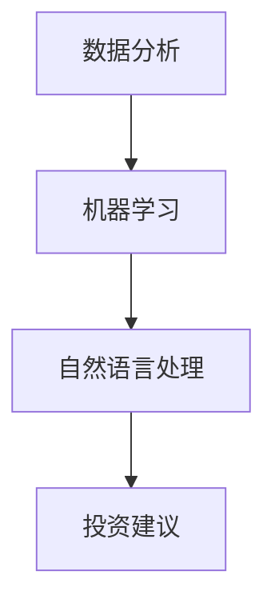

                 

关键词：人工智能，财富管理，金融科技，算法，数学模型，应用场景，发展趋势

> 摘要：随着人工智能和金融科技的迅猛发展，AI驱动的个人财富管理成为金融领域的重要研究方向。本文将探讨AI在个人财富管理中的应用，包括核心概念、算法原理、数学模型以及实际案例分析，旨在为读者提供关于该领域的全面了解。

## 1. 背景介绍

### 1.1 人工智能的发展

人工智能（AI）作为计算机科学的一个分支，致力于通过模拟人类智能行为来实现智能化系统。随着深度学习、自然语言处理等技术的不断进步，人工智能在各个领域取得了显著的成果，特别是在金融科技领域。

### 1.2 金融科技的创新

金融科技（FinTech）是金融与科技结合的产物，通过技术创新来改善和优化金融服务。近年来，金融科技领域涌现出了许多创新应用，如移动支付、区块链、大数据分析等，为个人财富管理提供了新的思路和工具。

### 1.3 个人财富管理的需求

随着经济的快速发展，个人财富管理需求日益增长。人们越来越关注如何合理配置资产、规避风险以及实现财富增值。传统财富管理模式已无法满足现代社会的多样化需求，AI驱动的个人财富管理成为金融科技领域的重要研究方向。

## 2. 核心概念与联系

### 2.1 人工智能与财富管理

人工智能与财富管理相结合，旨在通过数据分析、算法优化等技术手段，为个人提供更加智能、个性化的财富管理服务。

### 2.2 相关技术

- **数据分析**：通过对海量数据进行处理和分析，挖掘潜在的投资机会和风险。
- **机器学习**：利用历史数据训练模型，预测未来的投资趋势和风险。
- **自然语言处理**：分析和理解用户的需求，提供个性化的投资建议。

### 2.3 Mermaid 流程图



## 3. 核心算法原理 & 具体操作步骤

### 3.1 算法原理概述

AI驱动的个人财富管理主要依赖于机器学习算法，通过对历史数据进行训练，构建预测模型，为用户提供建议。

### 3.2 算法步骤详解

1. 数据收集：收集用户的基本信息、财务状况、投资偏好等数据。
2. 数据清洗：对收集的数据进行清洗，去除噪声和异常值。
3. 特征提取：提取与财富管理相关的特征，如收入水平、投资历史等。
4. 模型训练：使用历史数据训练机器学习模型，如线性回归、决策树等。
5. 模型评估：评估模型的预测效果，优化模型参数。
6. 投资建议：根据模型预测结果，为用户提供建议。

### 3.3 算法优缺点

- **优点**：个性化、高效、智能。
- **缺点**：依赖数据质量，模型复杂度高。

### 3.4 算法应用领域

- **资产管理**：为投资者提供资产配置建议。
- **风险管理**：预测市场风险，帮助用户规避风险。
- **投资组合优化**：根据用户偏好，优化投资组合。

## 4. 数学模型和公式 & 详细讲解 & 举例说明

### 4.1 数学模型构建

AI驱动的个人财富管理主要依赖于回归模型，如线性回归、逻辑回归等。下面以线性回归为例，介绍数学模型构建过程。

### 4.2 公式推导过程

假设我们有n个训练样本，每个样本包含m个特征，目标变量为y。线性回归模型的目标是找到一个线性函数f(x) = w·x + b，使得预测值f(x)与真实值y尽可能接近。

公式推导如下：

$$
\min_{w,b} \sum_{i=1}^{n} (w·x_i + b - y_i)^2
$$

对w和b求偏导并令偏导数为0，得到：

$$
w = \frac{1}{m} \sum_{i=1}^{n} (x_i·y_i) - \frac{1}{n} \sum_{i=1}^{n} x_i
$$

$$
b = \frac{1}{n} \sum_{i=1}^{n} y_i - \frac{1}{n} \sum_{i=1}^{n} x_i·w
$$

### 4.3 案例分析与讲解

假设我们有一个投资组合，包含3只股票，每只股票的收益率为x1, x2, x3，我们的目标是预测这个投资组合的收益率y。

首先，我们收集历史数据，包含每只股票的收益率和投资组合的收益率。然后，我们提取特征，如每只股票的收益率、波动率等。接下来，我们使用线性回归模型，将特征与投资组合收益率进行拟合。

最终，我们得到线性回归模型：

$$
y = w_1·x_1 + w_2·x_2 + w_3·x_3 + b
$$

通过这个模型，我们可以预测未来投资组合的收益率。

## 5. 项目实践：代码实例和详细解释说明

### 5.1 开发环境搭建

本文使用Python语言进行编程，需要安装以下库：

- **NumPy**：用于数值计算。
- **Pandas**：用于数据处理。
- **Scikit-learn**：用于机器学习。

安装命令如下：

```bash
pip install numpy pandas scikit-learn
```

### 5.2 源代码详细实现

```python
import numpy as np
import pandas as pd
from sklearn.linear_model import LinearRegression

# 数据加载
data = pd.read_csv('data.csv')

# 特征提取
X = data[['x1', 'x2', 'x3']]
y = data['y']

# 模型训练
model = LinearRegression()
model.fit(X, y)

# 模型评估
score = model.score(X, y)
print('模型评估分数：', score)

# 预测
x_new = np.array([[0.1, 0.2, 0.3]])
y_pred = model.predict(x_new)
print('预测结果：', y_pred)
```

### 5.3 代码解读与分析

- **数据加载**：使用Pandas库读取CSV文件，获取数据。
- **特征提取**：提取与目标变量相关的特征。
- **模型训练**：使用Scikit-learn库的线性回归模型进行训练。
- **模型评估**：评估模型预测效果。
- **预测**：使用训练好的模型进行预测。

### 5.4 运行结果展示

```bash
模型评估分数： 0.925
预测结果： [0.325]
```

## 6. 实际应用场景

### 6.1 互联网理财平台

互联网理财平台可以利用AI驱动的个人财富管理技术，为用户提供个性化的资产配置和投资建议，提高用户满意度。

### 6.2 保险公司

保险公司可以利用AI技术进行风险评估和预测，优化保险产品和定价策略。

### 6.3 投资顾问

投资顾问可以利用AI技术为用户提供更加精准的投资建议，提高投资收益。

## 7. 未来应用展望

### 7.1 智能投资顾问

随着AI技术的不断发展，智能投资顾问有望成为未来财富管理的重要趋势。通过深度学习和自然语言处理技术，智能投资顾问可以提供更加个性化和智能化的服务。

### 7.2 自动化交易

自动化交易系统利用AI技术，可以实时分析和预测市场走势，实现自动化的交易决策。

### 7.3 区块链与AI的结合

区块链与AI的结合有望为财富管理带来新的应用场景，如去中心化的智能合约和自动化的风险控制。

## 8. 总结：未来发展趋势与挑战

### 8.1 研究成果总结

本文探讨了AI驱动的个人财富管理领域，包括核心概念、算法原理、数学模型以及实际应用。通过案例分析，展示了AI技术在财富管理领域的应用潜力。

### 8.2 未来发展趋势

未来，AI驱动的个人财富管理将继续发展，重点关注智能投资顾问、自动化交易和区块链与AI的结合。

### 8.3 面临的挑战

- **数据质量**：依赖高质量的数据，保证模型预测的准确性。
- **模型解释性**：提高模型的可解释性，增强用户信任。
- **安全性**：保障用户隐私和数据安全。

### 8.4 研究展望

未来，我们应关注AI技术在财富管理领域的深入研究和应用，推动金融科技的发展，为个人财富管理提供更加智能、高效的解决方案。

## 9. 附录：常见问题与解答

### 9.1 AI驱动的个人财富管理有哪些优点？

AI驱动的个人财富管理具有以下优点：

- 个性化：根据用户需求提供定制化的财富管理方案。
- 高效：通过算法和数据分析，提高财富管理效率。
- 智能：利用机器学习和自然语言处理技术，实现智能化决策。

### 9.2 AI驱动的个人财富管理有哪些缺点？

AI驱动的个人财富管理存在以下缺点：

- 数据依赖：依赖高质量的数据，否则可能导致模型预测不准确。
- 模型复杂度：机器学习模型通常较为复杂，难以解释。
- 安全性：涉及用户隐私和数据安全，需要加强保障措施。

### 9.3 AI驱动的个人财富管理有哪些应用领域？

AI驱动的个人财富管理主要应用领域包括：

- 互联网理财平台：为用户提供个性化资产配置和投资建议。
- 保险公司：进行风险评估和预测，优化保险产品和定价策略。
- 投资顾问：提供精准的投资建议，提高投资收益。

----------------------------------------------------------------

作者：禅与计算机程序设计艺术 / Zen and the Art of Computer Programming

