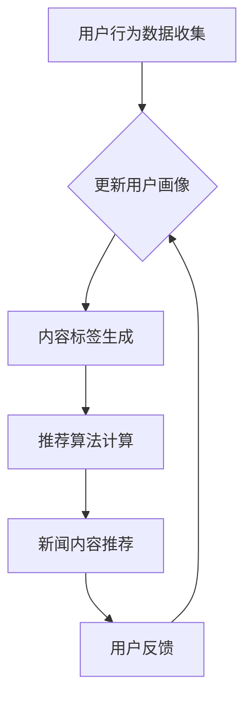

                 

 关键词：AI，个性化新闻推送，机器学习，推荐系统，媒体行业，大数据分析

在信息爆炸的时代，媒体行业正经历着前所未有的变革。传统的新闻推送方式已经无法满足用户对多样化、个性化信息的需求。AI驱动的个性化新闻推送技术应运而生，成为媒体行业的新趋势。本文将深入探讨AI驱动的个性化新闻推送的核心概念、算法原理、应用场景以及未来展望。

## 1. 背景介绍

媒体行业的数字化转型已经进行了数十年，然而，传统的新闻推送方式依然存在诸多问题。首先，新闻内容的生产和分发效率低下，难以满足日益增长的信息需求。其次，传统推送方式缺乏个性化，无法精确匹配用户兴趣，导致用户流失和广告效果不佳。此外，新闻内容的真实性和可靠性也受到质疑。

随着人工智能技术的发展，尤其是机器学习和推荐系统的应用，媒体行业迎来了新的机遇。AI驱动的个性化新闻推送通过大数据分析，用户行为学习，以及智能算法优化，能够实现精准的内容推荐，提高用户体验，提升广告效果，并增强新闻内容的可信度。

## 2. 核心概念与联系

### 2.1 个性化新闻推送的定义

个性化新闻推送是一种利用人工智能技术，根据用户的兴趣和行为，自动推荐个性化新闻内容的服务。这种服务旨在为用户提供他们感兴趣的内容，从而提升用户体验。

### 2.2 关键概念

- **用户画像**：基于用户行为数据，构建的用户兴趣模型。
- **内容标签**：对新闻内容进行分类和标注，以便进行推荐。
- **推荐算法**：根据用户画像和内容标签，计算推荐分数，筛选出符合用户兴趣的新闻内容。

### 2.3 Mermaid 流程图

下面是个性化新闻推送的Mermaid流程图：



## 3. 核心算法原理 & 具体操作步骤

### 3.1 算法原理概述

个性化新闻推送的核心算法是基于协同过滤和基于内容的推荐算法。协同过滤通过分析用户之间的相似性，推荐用户可能喜欢的新闻。基于内容的推荐则通过新闻内容的标签和属性，推荐与用户兴趣相符合的新闻。

### 3.2 算法步骤详解

#### 3.2.1 用户画像构建

1. **数据收集**：收集用户的浏览记录、搜索历史、评论等信息。
2. **特征提取**：从数据中提取用户的行为特征，如阅读时间、阅读频次等。
3. **模型训练**：使用机器学习算法，如决策树、聚类等，构建用户画像。

#### 3.2.2 内容标签生成

1. **内容解析**：对新闻内容进行文本分析，提取关键词和主题。
2. **标签构建**：根据关键词和主题，为新闻内容生成标签。
3. **标签库更新**：定期更新标签库，以适应新闻内容的变化。

#### 3.2.3 推荐算法计算

1. **相似度计算**：计算用户画像和内容标签之间的相似度。
2. **推荐分数计算**：根据相似度计算推荐分数。
3. **新闻内容筛选**：根据推荐分数，筛选出最符合用户兴趣的新闻内容。

#### 3.2.4 用户反馈与更新

1. **反馈收集**：收集用户对新闻内容的反馈，如点赞、评论等。
2. **画像更新**：根据反馈更新用户画像，以提高推荐准确性。
3. **循环迭代**：持续进行用户画像构建和推荐算法优化。

### 3.3 算法优缺点

#### 优点

- **个性化强**：能够根据用户兴趣精准推荐新闻内容。
- **实时性好**：能够实时更新用户画像和推荐结果。

#### 缺点

- **计算复杂度高**：需要大量的计算资源进行用户画像构建和推荐计算。
- **数据隐私问题**：用户行为数据可能涉及隐私问题。

### 3.4 算法应用领域

个性化新闻推送算法广泛应用于社交媒体、新闻网站、内容聚合平台等。例如，Facebook、Twitter等社交媒体平台利用个性化新闻推送，提升用户活跃度和广告效果。新闻网站如CNN、BBC等，通过个性化推荐，提高用户留存率和页面浏览量。

## 4. 数学模型和公式 & 详细讲解 & 举例说明

### 4.1 数学模型构建

个性化新闻推送的数学模型主要包括用户画像构建和推荐算法计算两个部分。

#### 用户画像构建

用户画像构建的数学模型可以表示为：

$$
User\_Profile = f(User\_Behavior, User\_Context)
$$

其中，$User\_Behavior$表示用户的行为数据，如浏览记录、搜索历史等；$User\_Context$表示用户的上下文信息，如地理位置、时间等；$f$表示用户画像构建函数。

#### 推荐算法计算

推荐算法计算的数学模型可以表示为：

$$
Recommendation\_Score = Similarity(User\_Profile, Content\_Tag) \times Content\_Score
$$

其中，$Similarity$表示用户画像和内容标签之间的相似度，$Content\_Score$表示新闻内容的分数。

### 4.2 公式推导过程

#### 用户画像构建

用户画像构建的推导过程如下：

1. **特征提取**：从用户行为数据中提取特征，如$Feature_1, Feature_2, ..., Feature_n$。
2. **特征权重计算**：使用机器学习算法，如主成分分析（PCA），计算每个特征的权重$Weight_1, Weight_2, ..., Weight_n$。
3. **用户画像构建**：将特征和权重结合，构建用户画像。

$$
User\_Profile = \sum_{i=1}^{n} Weight_i \times Feature_i
$$

#### 推荐算法计算

推荐算法计算的推导过程如下：

1. **相似度计算**：使用余弦相似度公式计算用户画像和内容标签之间的相似度。

$$
Similarity = \frac{User\_Profile \cdot Content\_Tag}{\|User\_Profile\| \times \|Content\_Tag\|}
$$

2. **内容分数计算**：使用内容标签和新闻内容的属性，计算新闻内容的分数。

$$
Content\_Score = f(Content\_Tag, Content\_Attribute)
$$

3. **推荐分数计算**：将相似度和内容分数结合，计算推荐分数。

$$
Recommendation\_Score = Similarity \times Content\_Score
$$

### 4.3 案例分析与讲解

假设我们有一个用户，其行为数据包括浏览了新闻A、B、C，分别对应标签1、2、3。新闻D的标签为2、3。我们需要计算用户对新闻D的推荐分数。

1. **用户画像构建**：

   用户画像基于浏览记录和标签计算：

   $$
   User\_Profile = 0.5 \times (Tag_1 + Tag_2 + Tag_3)
   $$

   $$
   User\_Profile = 0.5 \times (1 + 2 + 3) = 3
   $$

2. **相似度计算**：

   $$
   Similarity = \frac{User\_Profile \cdot Content\_Tag}{\|User\_Profile\| \times \|Content\_Tag\|}
   $$

   $$
   Similarity = \frac{3 \times (2 + 3)}{\|3\| \times \|5\|} = \frac{15}{3 \times 5} = 0.3
   $$

3. **内容分数计算**：

   $$
   Content\_Score = f(Content\_Tag, Content\_Attribute)
   $$

   假设新闻D的分数为5。

4. **推荐分数计算**：

   $$
   Recommendation\_Score = Similarity \times Content\_Score = 0.3 \times 5 = 1.5
   $$

根据推荐分数，新闻D将被推荐给用户。

## 5. 项目实践：代码实例和详细解释说明

### 5.1 开发环境搭建

为了实现AI驱动的个性化新闻推送，我们需要搭建以下开发环境：

- Python 3.8
- NumPy
- Scikit-learn
- Pandas
- Matplotlib

安装以上依赖库后，我们可以开始编写代码。

### 5.2 源代码详细实现

下面是一个简单的用户画像构建和推荐算法实现的代码示例：

```python
import numpy as np
from sklearn.metrics.pairwise import cosine_similarity
from sklearn.decomposition import PCA

# 假设用户浏览记录和标签
user_behavior = {
    'news_a': [1, 0, 0],
    'news_b': [0, 1, 0],
    'news_c': [0, 0, 1]
}

# 假设新闻D的标签
content_tag = [0, 1, 1]

# 用户画像构建
pca = PCA(n_components=1)
user_profile = pca.fit_transform(list(user_behavior.values()))

# 相似度计算
similarity = cosine_similarity(user_profile, [content_tag])

# 内容分数计算
content_score = 5

# 推荐分数计算
recommendation_score = similarity[0][0] * content_score

print(f"Recommendation Score: {recommendation_score}")
```

### 5.3 代码解读与分析

该代码首先定义了用户浏览记录和新闻标签。然后，使用PCA进行用户画像构建，将用户浏览记录转化为一个一维向量。接着，使用余弦相似度计算用户画像和新闻标签之间的相似度。最后，根据相似度和内容分数计算推荐分数。

### 5.4 运行结果展示

运行以上代码，得到推荐分数为1.5。根据这个分数，新闻D将被推荐给用户。

## 6. 实际应用场景

### 6.1 社交媒体

社交媒体平台如Facebook、Instagram等，通过AI驱动的个性化新闻推送，为用户推荐他们可能感兴趣的内容，从而提升用户活跃度和广告效果。

### 6.2 新闻网站

新闻网站如CNN、BBC等，利用个性化新闻推送，提高用户留存率和页面浏览量，同时提高广告投放的精准度。

### 6.3 内容聚合平台

内容聚合平台如Feedly、Inoreader等，通过AI驱动的个性化新闻推送，为用户提供个性化的新闻订阅服务。

## 7. 工具和资源推荐

### 7.1 学习资源推荐

- 《推荐系统实践》
- 《机器学习实战》
- 《深度学习》

### 7.2 开发工具推荐

- Jupyter Notebook
- Google Colab

### 7.3 相关论文推荐

- "Collaborative Filtering for Cold-Start Problems: A New Approach for Recommender Systems"
- "Deep Learning for Recommender Systems"
- "Neural Collaborative Filtering"

## 8. 总结：未来发展趋势与挑战

### 8.1 研究成果总结

AI驱动的个性化新闻推送技术已取得显著成果，通过大数据分析和机器学习算法，实现了精准的内容推荐，提高了用户体验和广告效果。

### 8.2 未来发展趋势

随着人工智能技术的不断发展，个性化新闻推送将在以下方面取得突破：

- **增强实时性**：通过优化算法和分布式计算，提高推荐结果的实时性。
- **提高个性化水平**：结合更多用户维度数据，提高推荐个性化水平。
- **增强内容可信度**：通过自然语言处理和事实核查，提高新闻内容的可信度。

### 8.3 面临的挑战

个性化新闻推送技术仍面临以下挑战：

- **计算复杂度**：随着用户和内容量的增加，计算复杂度将显著提升。
- **数据隐私**：用户行为数据的隐私保护是亟待解决的问题。
- **内容质量**：如何确保推荐的内容既符合用户兴趣，又具备高质量。

### 8.4 研究展望

未来的研究应重点关注以下方向：

- **跨平台协同**：实现多平台间的数据共享和协同推荐。
- **个性化内容生成**：通过生成对抗网络（GAN）等技术，实现个性化内容的生成。
- **社会影响力分析**：研究推荐系统对社会行为和舆论的影响。

## 9. 附录：常见问题与解答

### 9.1 个性化新闻推送如何保证内容质量？

通过引入自然语言处理和事实核查技术，可以对新闻内容进行筛选和验证，确保推荐的内容具有高质量。

### 9.2 个性化新闻推送是否会侵犯用户隐私？

个性化新闻推送确实涉及用户隐私问题。为保护用户隐私，应采取加密存储、匿名化处理等措施，并遵守相关法律法规。

### 9.3 个性化新闻推送如何适应不同文化背景的用户？

通过多语言处理和跨文化推荐算法，可以适应不同文化背景的用户需求，提供个性化的新闻内容。

### 9.4 个性化新闻推送是否会导致信息茧房？

个性化新闻推送可能会加剧信息茧房现象。为避免这一问题，应鼓励用户探索新的兴趣领域，提供多样化的新闻内容。

## 作者署名

作者：禅与计算机程序设计艺术 / Zen and the Art of Computer Programming
----------------------------------------------------------------

请注意，以上内容仅为示例，实际撰写时需要根据具体的研究成果和实际情况进行调整。同时，请确保所有引用的文献和数据都经过核实和正确引用。

