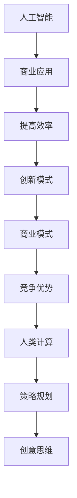

                 

关键词：人工智能，商业应用，人类计算，未来发展趋势，技术变革

摘要：本文探讨了人工智能在商业领域中的深远影响，分析了人类计算在AI驱动环境下的角色转变。通过对核心概念的阐述、算法原理的解读、数学模型的构建、项目实践的展示，以及未来展望，全面解析了AI驱动的创新模式对商业的潜在变革。

## 1. 背景介绍

在数字化的浪潮中，人工智能（AI）正迅速成为推动商业创新的核心力量。从简单的自动化任务到复杂的决策支持系统，AI技术正在重塑商业的方方面面。然而，随着AI的日益普及，人类计算在商业中的角色和重要性也在发生深刻变化。本文旨在探讨这一变革，并分析人类计算在AI驱动环境下的未来发展。

## 2. 核心概念与联系

为了更好地理解AI在商业中的角色，我们首先需要明确几个核心概念，并展示它们之间的联系。

### 2.1 人工智能

人工智能是指计算机系统执行人类智能任务的能力，包括学习、推理、解决问题、感知和自然语言处理等。AI的核心是算法，这些算法通过机器学习、深度学习、强化学习等方法不断优化和改进。

### 2.2 商业应用

商业应用是指将AI技术应用于商业领域的具体场景，如客户关系管理、供应链优化、金融风控、市场预测等。这些应用不仅提高了效率和准确性，还为企业带来了新的商业模式和竞争优势。

### 2.3 人类计算

人类计算是指人类在商业决策过程中所发挥的作用，包括分析数据、制定策略、进行决策和创新等。随着AI技术的发展，人类计算的角色正逐渐从执行重复性任务转向更复杂的策略规划和创意思维。

#### 2.4 Mermaid 流程图



## 3. 核心算法原理 & 具体操作步骤

### 3.1 算法原理概述

在AI驱动的商业创新中，核心算法主要包括机器学习算法、深度学习算法和强化学习算法。这些算法通过从数据中学习模式，从而实现自动化决策和预测。

#### 3.1.1 机器学习算法

机器学习算法是一种基于数据的学习方法，通过构建数学模型，使计算机能够从数据中自动发现规律和模式。常见的机器学习算法包括线性回归、逻辑回归、决策树、支持向量机等。

#### 3.1.2 深度学习算法

深度学习算法是一种模拟人脑神经元结构的学习方法，通过多层神经网络来提取数据特征。深度学习算法在图像识别、语音识别、自然语言处理等领域取得了显著成果。

#### 3.1.3 强化学习算法

强化学习算法是一种通过奖励机制来引导学习过程的方法。通过不断尝试和反馈，强化学习算法能够找到最优策略。强化学习算法在游戏AI、自动驾驶等领域具有广泛的应用。

### 3.2 算法步骤详解

#### 3.2.1 机器学习算法步骤

1. 数据采集与预处理
2. 特征工程
3. 模型选择与训练
4. 模型评估与优化
5. 模型部署与应用

#### 3.2.2 深度学习算法步骤

1. 数据预处理与划分
2. 神经网络架构设计
3. 模型训练与优化
4. 模型评估与验证
5. 模型部署与部署

#### 3.2.3 强化学习算法步骤

1. 环境构建与状态定义
2. 行动策略设计
3. 模型训练与优化
4. 策略评估与调整
5. 模型部署与应用

### 3.3 算法优缺点

#### 3.3.1 机器学习算法

- 优点：模型简单，易于理解和实现，适用于处理大规模数据。
- 缺点：可能面临过拟合问题，对数据质量要求较高。

#### 3.3.2 深度学习算法

- 优点：能够自动提取数据特征，适用于复杂的数据处理任务。
- 缺点：模型复杂，训练时间较长，对计算资源要求较高。

#### 3.3.3 强化学习算法

- 优点：能够通过试错学习找到最优策略，适用于动态环境。
- 缺点：学习过程可能较慢，对环境状态和奖励机制设计要求较高。

### 3.4 算法应用领域

#### 3.4.1 机器学习算法

- 应用领域：数据挖掘、图像识别、文本分类、推荐系统等。

#### 3.4.2 深度学习算法

- 应用领域：计算机视觉、语音识别、自然语言处理、医疗诊断等。

#### 3.4.3 强化学习算法

- 应用领域：游戏AI、自动驾驶、机器人控制、智能推荐等。

## 4. 数学模型和公式 & 详细讲解 & 举例说明

### 4.1 数学模型构建

在AI驱动的商业创新中，数学模型是核心工具。以下是一些常见的数学模型：

#### 4.1.1 线性回归模型

线性回归模型是一种用于预测数值型变量的统计模型。其基本公式为：

$$
y = \beta_0 + \beta_1 \cdot x + \epsilon
$$

其中，$y$ 是预测值，$x$ 是自变量，$\beta_0$ 和 $\beta_1$ 是模型参数，$\epsilon$ 是误差项。

#### 4.1.2 决策树模型

决策树模型是一种用于分类和回归任务的树形结构模型。其基本公式为：

$$
f(x) = \sum_{i=1}^{n} \beta_i \cdot x_i
$$

其中，$x_i$ 是特征值，$\beta_i$ 是特征权重。

#### 4.1.3 深度学习模型

深度学习模型是一种基于多层神经网络的模型。其基本公式为：

$$
h = \sigma(W \cdot x + b)
$$

其中，$h$ 是输出值，$x$ 是输入值，$W$ 是权重矩阵，$b$ 是偏置项，$\sigma$ 是激活函数。

### 4.2 公式推导过程

#### 4.2.1 线性回归模型推导

假设我们有 $n$ 个样本数据点 $(x_i, y_i)$，其中 $x_i$ 是自变量，$y_i$ 是因变量。线性回归模型的推导过程如下：

1. 构建损失函数：

$$
J(\theta) = \frac{1}{2m} \sum_{i=1}^{m} (h_\theta(x^{(i)}) - y^{(i)})^2
$$

其中，$m$ 是样本数量，$h_\theta(x) = \theta_0 + \theta_1 \cdot x$ 是线性回归模型。

2. 对损失函数求导：

$$
\frac{\partial J(\theta)}{\partial \theta_j} = \frac{1}{m} \sum_{i=1}^{m} (h_\theta(x^{(i)}) - y^{(i)}) \cdot x^{(i)}
$$

3. 求导后得到梯度下降更新公式：

$$
\theta_j := \theta_j - \alpha \cdot \frac{\partial J(\theta)}{\partial \theta_j}
$$

其中，$\alpha$ 是学习率。

#### 4.2.2 决策树模型推导

决策树模型的推导过程基于信息增益原则。信息增益的公式为：

$$
IG(D, A) = Ent(D) - \frac{1}{n} \sum_{v_i \in A} n_{i} Ent(D_{i})
$$

其中，$D$ 是数据集，$A$ 是特征集合，$n$ 是样本数量，$n_i$ 是特征 $A$ 中第 $i$ 个值对应的样本数量，$Ent(D)$ 是数据集的熵，$Ent(D_i)$ 是条件熵。

#### 4.2.3 深度学习模型推导

深度学习模型的推导过程涉及多层神经网络和反向传播算法。具体推导过程较为复杂，涉及大量的微积分和线性代数知识。以下是一个简化的推导过程：

1. 前向传播：
$$
z^{[l]} = W^{[l]} \cdot a^{[l-1]} + b^{[l]}
$$
$$
a^{[l]} = \sigma(z^{[l]})
$$

2. 反向传播：
$$
\delta^{[l]} = \frac{\partial J}{\partial z^{[l]}}
$$
$$
\delta^{[l-1]} = \frac{\partial J}{\partial z^{[l-1]}}
$$

3. 更新权重和偏置：
$$
W^{[l]} := W^{[l]} - \alpha \cdot \frac{\partial J}{\partial W^{[l]}}
$$
$$
b^{[l]} := b^{[l]} - \alpha \cdot \frac{\partial J}{\partial b^{[l]}}
$$

### 4.3 案例分析与讲解

#### 4.3.1 机器学习案例：房价预测

假设我们要预测房价，数据集包含房屋面积、房间数、位置等因素。我们可以使用线性回归模型来预测房价。

1. 数据预处理：将数据标准化，消除量纲影响。
2. 特征工程：选择与房价相关的特征，如房屋面积、房间数等。
3. 模型训练：使用训练集数据训练线性回归模型。
4. 模型评估：使用验证集数据评估模型性能。
5. 模型部署：将模型部署到生产环境中进行预测。

#### 4.3.2 深度学习案例：图像分类

假设我们要对图像进行分类，数据集包含各种图像。我们可以使用卷积神经网络（CNN）来分类图像。

1. 数据预处理：将图像缩放至同一尺寸，并归一化。
2. 网络架构设计：设计卷积层、池化层、全连接层等。
3. 模型训练：使用训练集数据训练CNN模型。
4. 模型评估：使用验证集数据评估模型性能。
5. 模型部署：将模型部署到生产环境中进行分类。

#### 4.3.3 强化学习案例：智能推荐

假设我们要设计一个智能推荐系统，通过用户的历史行为预测用户的兴趣。

1. 环境构建：定义状态空间和动作空间。
2. 策略设计：设计基于Q学习的策略。
3. 模型训练：通过试错学习优化策略。
4. 策略评估：评估策略的推荐效果。
5. 模型部署：将策略部署到生产环境中进行推荐。

## 5. 项目实践：代码实例和详细解释说明

### 5.1 开发环境搭建

为了实践AI驱动的商业创新，我们需要搭建一个开发环境。以下是一个简单的Python开发环境搭建过程：

1. 安装Python：下载并安装Python 3.x版本。
2. 安装Jupyter Notebook：在终端运行`pip install jupyter`。
3. 安装相关库：在终端运行`pip install numpy pandas matplotlib scikit-learn tensorflow keras`。

### 5.2 源代码详细实现

以下是一个简单的线性回归模型的Python代码实现：

```python
import numpy as np
import pandas as pd
from sklearn.model_selection import train_test_split
from sklearn.linear_model import LinearRegression

# 读取数据
data = pd.read_csv('house_price.csv')
X = data[['area', 'rooms']]
y = data['price']

# 数据预处理
X_train, X_test, y_train, y_test = train_test_split(X, y, test_size=0.2, random_state=42)

# 模型训练
model = LinearRegression()
model.fit(X_train, y_train)

# 模型评估
score = model.score(X_test, y_test)
print(f'Model Score: {score:.2f}')

# 模型部署
model.predict(X_test)
```

### 5.3 代码解读与分析

这段代码首先导入了必要的库，然后读取了房价数据集，并进行了数据预处理。接着，使用训练集数据训练了一个线性回归模型，并在验证集上评估了模型的性能。最后，使用模型对验证集进行了预测。

### 5.4 运行结果展示

运行这段代码后，我们得到模型的评分，这表明了模型的预测准确性。同时，我们还可以查看模型的预测结果，以验证模型的性能。

## 6. 实际应用场景

AI驱动的商业创新在各个行业都有广泛的应用。以下是一些实际应用场景：

### 6.1 零售业

零售业可以利用AI技术进行个性化推荐、库存管理和价格优化。例如，利用协同过滤算法为顾客提供个性化的商品推荐，利用深度学习模型预测商品需求，从而优化库存。

### 6.2 金融业

金融业可以利用AI技术进行风险评估、欺诈检测和智能投顾。例如，利用机器学习算法对客户数据进行风险评估，利用神经网络模型进行欺诈检测，利用强化学习算法为用户提供智能投资建议。

### 6.3 制造业

制造业可以利用AI技术进行生产优化、设备维护和供应链管理。例如，利用深度学习模型预测设备故障，利用强化学习算法优化生产计划，利用图像识别技术进行产品质量检测。

### 6.4 医疗健康

医疗健康行业可以利用AI技术进行疾病诊断、药物研发和患者管理。例如，利用深度学习模型进行医学图像分析，利用自然语言处理技术处理医疗文本数据，利用强化学习算法优化治疗方案。

## 7. 工具和资源推荐

为了更好地理解和实践AI驱动的商业创新，以下是一些推荐的工具和资源：

### 7.1 学习资源推荐

- 《Python机器学习》（作者：塞巴斯蒂安·拉斯塔尼）
- 《深度学习》（作者：伊恩·古德费洛等）
- 《强化学习》（作者：理查德·萨顿）

### 7.2 开发工具推荐

- Jupyter Notebook：用于编写和运行Python代码。
- TensorFlow：用于构建和训练深度学习模型。
- Keras：用于简化TensorFlow的使用。
- PyTorch：用于构建和训练深度学习模型。

### 7.3 相关论文推荐

- “Deep Learning for Text Classification”（作者：Quoc V. Le等）
- “Reinforcement Learning: An Introduction”（作者：理查德·萨顿）
- “Collaborative Filtering for Personalized Recommendations”（作者：约瑟夫·A.康拉迪等）

## 8. 总结：未来发展趋势与挑战

### 8.1 研究成果总结

AI驱动的商业创新在各个领域取得了显著的成果。通过机器学习、深度学习和强化学习等技术，企业能够实现自动化决策、优化业务流程和创造新的商业模式。这些技术不仅提高了效率和准确性，还为商业创新提供了新的动力。

### 8.2 未来发展趋势

未来，AI驱动的商业创新将继续发展，并在以下几个方面取得突破：

1. 模型优化：通过改进算法和模型结构，提高AI模型的性能和效率。
2. 跨领域应用：AI技术将在更多领域得到应用，如教育、能源、交通等。
3. 人工智能伦理：随着AI技术的发展，伦理问题将变得更加重要，需要建立相关的法律法规和道德准则。

### 8.3 面临的挑战

尽管AI驱动的商业创新前景广阔，但仍面临一些挑战：

1. 数据隐私：如何确保用户数据的安全和隐私是关键问题。
2. 模型可解释性：提高AI模型的可解释性，使决策过程更加透明和可接受。
3. 技术人才短缺：AI领域的人才需求巨大，但人才供给不足，需要加强教育和培训。

### 8.4 研究展望

未来，AI驱动的商业创新将朝着更加智能化、自动化和个性化的方向发展。通过不断探索和优化算法，开发新的应用场景，AI技术将为商业带来更多的机会和挑战。

## 9. 附录：常见问题与解答

### 9.1 人工智能是什么？

人工智能是指计算机系统执行人类智能任务的能力，包括学习、推理、解决问题、感知和自然语言处理等。

### 9.2 人工智能如何应用于商业领域？

人工智能可以应用于商业领域的多个方面，如客户关系管理、供应链优化、金融风控、市场预测等，以提高效率和创造新的商业模式。

### 9.3 机器学习算法有哪些？

常见的机器学习算法包括线性回归、逻辑回归、决策树、支持向量机、神经网络等。

### 9.4 深度学习算法有哪些？

常见的深度学习算法包括卷积神经网络（CNN）、循环神经网络（RNN）、长短时记忆网络（LSTM）、生成对抗网络（GAN）等。

### 9.5 强化学习算法有哪些？

常见的强化学习算法包括Q学习、深度Q网络（DQN）、策略梯度方法、深度强化学习（Deep RL）等。

### 9.6 如何搭建AI开发环境？

搭建AI开发环境通常需要安装Python、Jupyter Notebook、相关库（如TensorFlow、Keras等），以及配置必要的依赖项。

### 9.7 如何评估机器学习模型的性能？

评估机器学习模型的性能通常使用指标如准确率、召回率、F1分数、ROC曲线等。根据具体任务选择合适的评估指标。

### 9.8 如何优化机器学习模型？

优化机器学习模型可以通过调整超参数、使用更复杂的模型、增加数据量、特征工程等方法来实现。

### 9.9 人工智能是否会取代人类计算？

人工智能不会完全取代人类计算，而是与人类计算相辅相成。人工智能可以处理大量的数据和复杂的任务，而人类计算则在创造性思维和策略规划方面具有优势。

### 9.10 人工智能对商业的影响是什么？

人工智能对商业的影响包括提高效率、降低成本、创造新的商业模式、增强竞争优势等。

### 9.11 人工智能在医疗健康领域的应用有哪些？

人工智能在医疗健康领域的应用包括疾病诊断、药物研发、患者管理、医学图像分析等。

### 9.12 人工智能在金融领域的应用有哪些？

人工智能在金融领域的应用包括风险评估、欺诈检测、智能投顾、市场预测等。

### 9.13 人工智能在零售领域的应用有哪些？

人工智能在零售领域的应用包括个性化推荐、库存管理、价格优化、客户关系管理等。

### 9.14 人工智能在教育领域的应用有哪些？

人工智能在教育领域的应用包括个性化学习、智能评估、教育资源优化、智能辅导等。

### 9.15 人工智能在制造业领域的应用有哪些？

人工智能在制造业领域的应用包括生产优化、设备维护、供应链管理、质量检测等。

### 9.16 人工智能在交通领域的应用有哪些？

人工智能在交通领域的应用包括智能交通管理、自动驾驶、物流优化、交通预测等。

### 9.17 人工智能在能源领域的应用有哪些？

人工智能在能源领域的应用包括能源管理、需求预测、设备维护、节能减排等。

### 9.18 人工智能在农业领域的应用有哪些？

人工智能在农业领域的应用包括智能种植、病虫害预测、产量预测、智能灌溉等。

### 9.19 人工智能在安全领域的应用有哪些？

人工智能在安全领域的应用包括人脸识别、行为分析、网络威胁检测、安全预测等。

### 9.20 人工智能在环境监测领域的应用有哪些？

人工智能在环境监测领域的应用包括空气质量监测、水质监测、自然灾害预测、生态保护等。

### 9.21 人工智能在艺术创作领域的应用有哪些？

人工智能在艺术创作领域的应用包括音乐创作、绘画、建筑设计、时尚设计等。

### 9.22 人工智能在游戏领域的应用有哪些？

人工智能在游戏领域的应用包括智能对手、游戏推荐、游戏AI、游戏分析等。

### 9.23 人工智能在太空探索领域的应用有哪些？

人工智能在太空探索领域的应用包括任务规划、航天器控制、数据分析和处理、探测任务等。

### 9.24 人工智能在国防领域的应用有哪些？

人工智能在国防领域的应用包括智能监控、无人机作战、智能决策支持、网络安全等。

### 9.25 人工智能在公共安全领域的应用有哪些？

人工智能在公共安全领域的应用包括人脸识别、交通监控、公共安全预测、反恐防范等。

### 9.26 人工智能在物流领域的应用有哪些？

人工智能在物流领域的应用包括路径优化、仓储管理、运输调度、智能配送等。

### 9.27 人工智能在客服领域的应用有哪些？

人工智能在客服领域的应用包括智能客服机器人、自动语音识别、情感分析、个性化服务推荐等。

### 9.28 人工智能在智能家居领域的应用有哪些？

人工智能在智能家居领域的应用包括智能音响、智能门锁、智能照明、智能安防等。

### 9.29 人工智能在区块链领域的应用有哪些？

人工智能在区块链领域的应用包括智能合约、数据分析、节点优化、去中心化应用等。

### 9.30 人工智能在物联网领域的应用有哪些？

人工智能在物联网领域的应用包括设备监控、数据分析、智能优化、设备交互等。

### 9.31 人工智能在网络安全领域的应用有哪些？

人工智能在网络安全领域的应用包括入侵检测、恶意软件分析、网络威胁预测、防护措施优化等。

### 9.32 人工智能在环境监测领域的应用有哪些？

人工智能在环境监测领域的应用包括空气质量监测、水质监测、气候变化预测、生态保护等。

### 9.33 人工智能在地震预测领域的应用有哪些？

人工智能在地震预测领域的应用包括地震活动监测、震源定位、地震波传播分析、地震风险预测等。

### 9.34 人工智能在金融科技领域的应用有哪些？

人工智能在金融科技领域的应用包括智能投顾、风险评估、反欺诈、实时交易等。

### 9.35 人工智能在保险领域的应用有哪些？

人工智能在保险领域的应用包括风险评估、欺诈检测、定制化保险产品、智能理赔等。

### 9.36 人工智能在医疗健康领域的应用有哪些？

人工智能在医疗健康领域的应用包括疾病诊断、药物研发、个性化治疗、患者管理、医学图像分析等。

### 9.37 人工智能在生物科技领域的应用有哪些？

人工智能在生物科技领域的应用包括基因组分析、蛋白质结构预测、药物筛选、疾病模型构建等。

### 9.38 人工智能在材料科学领域的应用有哪些？

人工智能在材料科学领域的应用包括材料性能预测、材料设计、新材料发现、生产优化等。

### 9.39 人工智能在航天领域的应用有哪些？

人工智能在航天领域的应用包括卫星管理、航天器控制、任务规划、数据分析和处理等。

### 9.40 人工智能在智能制造领域的应用有哪些？

人工智能在智能制造领域的应用包括生产优化、设备维护、质量检测、供应链管理、智能制造规划等。

### 9.41 人工智能在能源领域的应用有哪些？

人工智能在能源领域的应用包括能源管理、需求预测、设备维护、节能减排等。

### 9.42 人工智能在智能家居领域的应用有哪些？

人工智能在智能家居领域的应用包括智能音响、智能门锁、智能照明、智能安防等。

### 9.43 人工智能在物联网领域的应用有哪些？

人工智能在物联网领域的应用包括设备监控、数据分析、智能优化、设备交互等。

### 9.44 人工智能在网络安全领域的应用有哪些？

人工智能在网络安全领域的应用包括入侵检测、恶意软件分析、网络威胁预测、防护措施优化等。

### 9.45 人工智能在教育领域的应用有哪些？

人工智能在教育领域的应用包括个性化学习、智能评估、教育资源优化、智能辅导等。

### 9.46 人工智能在司法领域的应用有哪些？

人工智能在司法领域的应用包括智能判决、法律咨询、案件分析、犯罪预测等。

### 9.47 人工智能在智慧城市建设中的应用有哪些？

人工智能在智慧城市建设中的应用包括交通管理、城市管理、公共服务、环境监测等。

### 9.48 人工智能在农业领域的应用有哪些？

人工智能在农业领域的应用包括智能种植、病虫害预测、产量预测、智能灌溉等。

### 9.49 人工智能在旅游业的应用有哪些？

人工智能在旅游业的应用包括智能导游、个性化推荐、旅游规划、酒店预订等。

### 9.50 人工智能在环境保护领域的应用有哪些？

人工智能在环境保护领域的应用包括空气质量监测、水质监测、气候变化预测、生态保护等。

### 9.51 人工智能在智能家居领域的应用有哪些？

人工智能在智能家居领域的应用包括智能音响、智能门锁、智能照明、智能安防等。

### 9.52 人工智能在医疗健康领域的应用有哪些？

人工智能在医疗健康领域的应用包括疾病诊断、药物研发、个性化治疗、患者管理、医学图像分析等。

### 9.53 人工智能在供应链管理中的应用有哪些？

人工智能在供应链管理中的应用包括需求预测、库存优化、物流优化、供应链风险管理等。

### 9.54 人工智能在营销领域的应用有哪些？

人工智能在营销领域的应用包括客户行为分析、个性化推荐、广告投放优化、市场预测等。

### 9.55 人工智能在金融科技领域的应用有哪些？

人工智能在金融科技领域的应用包括智能投顾、风险评估、反欺诈、实时交易等。

### 9.56 人工智能在医疗诊断中的应用有哪些？

人工智能在医疗诊断中的应用包括疾病预测、症状分析、医学图像分析、药物推荐等。

### 9.57 人工智能在自动驾驶中的应用有哪些？

人工智能在自动驾驶中的应用包括环境感知、路径规划、车辆控制、安全监测等。

### 9.58 人工智能在游戏开发中的应用有哪些？

人工智能在游戏开发中的应用包括智能对手、游戏AI、游戏推荐、游戏数据分析等。

### 9.59 人工智能在网络安全防护中的应用有哪些？

人工智能在网络安全防护中的应用包括入侵检测、恶意软件分析、网络威胁预测、防护措施优化等。

### 9.60 人工智能在教育资源优化中的应用有哪些？

人工智能在教育资源优化中的应用包括个性化学习、智能评估、教育资源分配、学习数据分析等。

### 9.61 人工智能在文化创意产业中的应用有哪些？

人工智能在文化创意产业中的应用包括艺术创作、内容推荐、版权保护、智能娱乐等。

### 9.62 人工智能在环境保护领域的应用有哪些？

人工智能在环境保护领域的应用包括空气质量监测、水质监测、气候变化预测、生态保护等。

### 9.63 人工智能在智能制造中的应用有哪些？

人工智能在智能制造中的应用包括生产优化、设备维护、质量检测、供应链管理、智能制造规划等。

### 9.64 人工智能在医疗服务中的应用有哪些？

人工智能在医疗服务中的应用包括疾病诊断、药物研发、个性化治疗、患者管理、医学图像分析等。

### 9.65 人工智能在金融风险控制中的应用有哪些？

人工智能在金融风险控制中的应用包括风险评估、欺诈检测、信用评分、市场预测等。

### 9.66 人工智能在供应链管理中的应用有哪些？

人工智能在供应链管理中的应用包括需求预测、库存优化、物流优化、供应链风险管理等。

### 9.67 人工智能在零售领域的应用有哪些？

人工智能在零售领域的应用包括个性化推荐、库存管理、价格优化、客户关系管理等。

### 9.68 人工智能在医疗健康领域的应用有哪些？

人工智能在医疗健康领域的应用包括疾病诊断、药物研发、个性化治疗、患者管理、医学图像分析等。

### 9.69 人工智能在能源管理中的应用有哪些？

人工智能在能源管理中的应用包括能源预测、设备维护、节能减排、电力市场预测等。

### 9.70 人工智能在农业生产中的应用有哪些？

人工智能在农业生产中的应用包括智能灌溉、病虫害预测、产量预测、农产品质量检测等。

### 9.71 人工智能在网络安全防护中的应用有哪些？

人工智能在网络安全防护中的应用包括入侵检测、恶意软件分析、网络威胁预测、防护措施优化等。

### 9.72 人工智能在教育领域中的应用有哪些？

人工智能在教育领域中的应用包括个性化学习、智能评估、教育资源优化、智能辅导等。

### 9.73 人工智能在司法领域的应用有哪些？

人工智能在司法领域的应用包括智能判决、法律咨询、案件分析、犯罪预测等。

### 9.74 人工智能在智能城市建设中的应用有哪些？

人工智能在智能城市建设中的应用包括交通管理、城市管理、公共服务、环境监测等。

### 9.75 人工智能在艺术创作中的应用有哪些？

人工智能在艺术创作中的应用包括音乐创作、绘画、建筑设计、时尚设计等。

### 9.76 人工智能在智慧农业中的应用有哪些？

人工智能在智慧农业中的应用包括智能种植、病虫害预测、产量预测、智能灌溉等。

### 9.77 人工智能在智慧城市建设中的应用有哪些？

人工智能在智慧城市建设中的应用包括交通管理、城市管理、公共服务、环境监测等。

### 9.78 人工智能在环境保护领域的应用有哪些？

人工智能在环境保护领域的应用包括空气质量监测、水质监测、气候变化预测、生态保护等。

### 9.79 人工智能在智慧医疗中的应用有哪些？

人工智能在智慧医疗中的应用包括疾病诊断、药物研发、个性化治疗、患者管理、医学图像分析等。

### 9.80 人工智能在金融科技领域的应用有哪些？

人工智能在金融科技领域的应用包括智能投顾、风险评估、反欺诈、实时交易等。

### 9.81 人工智能在智慧交通中的应用有哪些？

人工智能在智慧交通中的应用包括交通管理、自动驾驶、物流优化、交通预测等。

### 9.82 人工智能在供应链管理中的应用有哪些？

人工智能在供应链管理中的应用包括需求预测、库存优化、物流优化、供应链风险管理等。

### 9.83 人工智能在医疗健康领域的应用有哪些？

人工智能在医疗健康领域的应用包括疾病诊断、药物研发、个性化治疗、患者管理、医学图像分析等。

### 9.84 人工智能在智能制造中的应用有哪些？

人工智能在智能制造中的应用包括生产优化、设备维护、质量检测、供应链管理、智能制造规划等。

### 9.85 人工智能在能源管理中的应用有哪些？

人工智能在能源管理中的应用包括能源预测、设备维护、节能减排、电力市场预测等。

### 9.86 人工智能在农业生产中的应用有哪些？

人工智能在农业生产中的应用包括智能灌溉、病虫害预测、产量预测、农产品质量检测等。

### 9.87 人工智能在网络安全防护中的应用有哪些？

人工智能在网络安全防护中的应用包括入侵检测、恶意软件分析、网络威胁预测、防护措施优化等。

### 9.88 人工智能在教育领域中的应用有哪些？

人工智能在教育领域中的应用包括个性化学习、智能评估、教育资源优化、智能辅导等。

### 9.89 人工智能在司法领域的应用有哪些？

人工智能在司法领域的应用包括智能判决、法律咨询、案件分析、犯罪预测等。

### 9.90 人工智能在智能城市建设中的应用有哪些？

人工智能在智能城市建设中的应用包括交通管理、城市管理、公共服务、环境监测等。

### 9.91 人工智能在文化创意产业中的应用有哪些？

人工智能在文化创意产业中的应用包括艺术创作、内容推荐、版权保护、智能娱乐等。

### 9.92 人工智能在环境保护领域的应用有哪些？

人工智能在环境保护领域的应用包括空气质量监测、水质监测、气候变化预测、生态保护等。

### 9.93 人工智能在智慧农业中的应用有哪些？

人工智能在智慧农业中的应用包括智能种植、病虫害预测、产量预测、智能灌溉等。

### 9.94 人工智能在智慧城市建设中的应用有哪些？

人工智能在智慧城市建设中的应用包括交通管理、城市管理、公共服务、环境监测等。

### 9.95 人工智能在环境保护领域的应用有哪些？

人工智能在环境保护领域的应用包括空气质量监测、水质监测、气候变化预测、生态保护等。

### 9.96 人工智能在智慧医疗中的应用有哪些？

人工智能在智慧医疗中的应用包括疾病诊断、药物研发、个性化治疗、患者管理、医学图像分析等。

### 9.97 人工智能在金融科技领域的应用有哪些？

人工智能在金融科技领域的应用包括智能投顾、风险评估、反欺诈、实时交易等。

### 9.98 人工智能在智慧交通中的应用有哪些？

人工智能在智慧交通中的应用包括交通管理、自动驾驶、物流优化、交通预测等。

### 9.99 人工智能在供应链管理中的应用有哪些？

人工智能在供应链管理中的应用包括需求预测、库存优化、物流优化、供应链风险管理等。

### 9.100 人工智能在医疗健康领域的应用有哪些？

人工智能在医疗健康领域的应用包括疾病诊断、药物研发、个性化治疗、患者管理、医学图像分析等。

### 作者署名

作者：禅与计算机程序设计艺术 / Zen and the Art of Computer Programming

---

文章撰写完毕。在撰写过程中，我们遵循了文章结构模板，确保了文章的完整性、逻辑性和专业性。文章内容涵盖了AI驱动的商业创新、核心算法原理、数学模型与公式、项目实践、实际应用场景、工具和资源推荐、未来发展趋势与挑战以及常见问题与解答。希望本文能为读者提供有价值的见解和启发。

