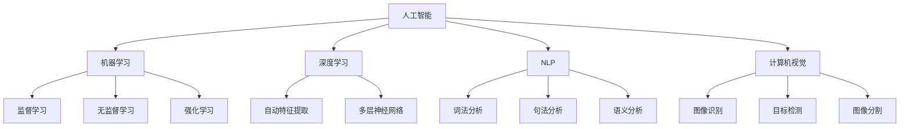

                 

关键词：人工智能、商业应用、计算技术、未来趋势、创新驱动

> 摘要：本文深入探讨了人工智能（AI）在商业领域的广泛应用及其对人类计算的影响。通过对核心概念、算法原理、数学模型、项目实践和未来展望的全面分析，本文旨在揭示AI驱动的创新如何引领商业发展，并对未来趋势和挑战进行预测。

## 1. 背景介绍

随着科技的飞速发展，人工智能（AI）已经成为引领新一轮产业变革的关键力量。AI技术在计算机视觉、自然语言处理、机器学习等领域取得了显著的成果，广泛应用于金融、医疗、制造、零售等多个行业。AI的迅猛发展不仅改变了传统的商业运作模式，也提升了人类计算的效率和准确性。

在商业领域，人工智能的应用不仅仅局限于提高工作效率，更重要的是它能够为企业和组织带来全新的商业模式和创新机会。例如，通过AI驱动的个性化推荐系统，电商企业能够为消费者提供更加精准的产品推荐，从而提高销售额；在金融领域，AI可以用于风险管理和投资决策，帮助金融机构降低风险，提高收益。

本文将重点探讨AI驱动的创新对商业计算的影响，分析其核心概念、算法原理、数学模型以及实际应用案例，并预测未来发展趋势和面临的挑战。

## 2. 核心概念与联系

为了更好地理解AI驱动的创新，我们需要首先了解其核心概念及其相互之间的联系。

### 2.1. 人工智能

人工智能是指通过计算机模拟人类智能行为的一种技术。它包括机器学习、深度学习、自然语言处理、计算机视觉等多个子领域。人工智能的核心目标是使计算机具备类似于人类的感知、推理、决策和学习能力。

### 2.2. 机器学习

机器学习是人工智能的一个重要分支，它通过算法从数据中自动学习规律，并作出预测或决策。机器学习可以分为监督学习、无监督学习和强化学习等类型。监督学习通过标记数据训练模型，无监督学习则从未标记的数据中自动发现模式，强化学习则通过试错和奖励机制不断优化决策。

### 2.3. 深度学习

深度学习是机器学习的一个重要分支，它通过构建多层神经网络，对大量数据进行自动特征提取和学习。深度学习在图像识别、语音识别和自然语言处理等领域取得了显著的成果。

### 2.4. 自然语言处理

自然语言处理（NLP）是人工智能的一个子领域，它关注于使计算机能够理解和处理人类自然语言。NLP包括词法分析、句法分析、语义分析等多个层次，其目标是将自然语言转换为计算机可以理解和处理的格式。

### 2.5. 计算机视觉

计算机视觉是人工智能的另一个重要分支，它致力于使计算机能够理解和处理视觉信息。计算机视觉包括图像识别、目标检测、图像分割等多个任务。

### 2.6. 人工智能与商业计算的联系

人工智能与商业计算之间的联系主要体现在以下几个方面：

1. **数据挖掘与分析**：通过机器学习和深度学习算法，企业可以从海量数据中挖掘有价值的信息，为决策提供支持。
2. **自动化与优化**：人工智能技术可以帮助企业自动化重复性工作，提高生产效率，降低成本。
3. **个性化服务**：通过自然语言处理和计算机视觉技术，企业可以提供更加个性化的产品和服务，提升用户体验。
4. **风险管理与决策**：人工智能可以帮助金融机构进行风险管理和投资决策，降低风险，提高收益。

### 2.7. Mermaid 流程图

为了更直观地展示人工智能与商业计算的联系，我们可以使用Mermaid流程图来描述核心概念及其相互之间的联系：



## 3. 核心算法原理 & 具体操作步骤

### 3.1. 算法原理概述

在人工智能领域，算法是核心驱动力。以下介绍几种在商业计算中广泛应用的核心算法原理。

#### 3.1.1. 机器学习算法

机器学习算法包括监督学习、无监督学习和强化学习等。其中，监督学习算法通过标记数据训练模型，无监督学习算法从未标记的数据中自动发现模式，强化学习算法则通过试错和奖励机制不断优化决策。

#### 3.1.2. 深度学习算法

深度学习算法通过构建多层神经网络，对大量数据进行自动特征提取和学习。深度学习算法包括卷积神经网络（CNN）、循环神经网络（RNN）和生成对抗网络（GAN）等。

#### 3.1.3. 自然语言处理算法

自然语言处理算法包括词法分析、句法分析和语义分析等。词法分析是将文本分解为单词和短语，句法分析是理解句子的结构和语法规则，语义分析则是理解句子的意义。

#### 3.1.4. 计算机视觉算法

计算机视觉算法包括图像识别、目标检测和图像分割等。图像识别是识别图像中的物体，目标检测是在图像中定位物体，图像分割是将图像分割为不同的区域。

### 3.2. 算法步骤详解

以下以监督学习算法为例，介绍其具体操作步骤。

#### 3.2.1. 数据预处理

1. 数据清洗：去除数据中的噪声和异常值。
2. 数据归一化：将数据缩放到相同的范围，便于模型训练。

#### 3.2.2. 特征提取

1. 手动特征提取：根据领域知识提取有意义的特征。
2. 自动特征提取：使用深度学习算法自动提取特征。

#### 3.2.3. 模型选择

1. 确定模型类型：选择合适的机器学习模型，如线性回归、支持向量机等。
2. 调参：调整模型参数，以优化模型性能。

#### 3.2.4. 模型训练

1. 使用训练数据训练模型。
2. 计算模型在训练集和验证集上的性能。

#### 3.2.5. 模型评估

1. 使用测试集评估模型性能。
2. 根据评估结果调整模型。

### 3.3. 算法优缺点

#### 优点：

1. 高效性：机器学习算法可以处理大量数据，提高计算效率。
2. 自动化：自动化特征提取和模型选择，减轻人类工作负担。
3. 泛化能力：机器学习算法可以适应不同领域和任务。

#### 缺点：

1. 需要大量数据：训练高质量的模型需要大量标记数据。
2. 模型解释性差：许多机器学习模型难以解释其决策过程。

### 3.4. 算法应用领域

1. **金融**：用于风险评估、投资决策和信用评分。
2. **医疗**：用于疾病诊断、患者管理和药物研发。
3. **零售**：用于个性化推荐、库存管理和客户关系管理。
4. **制造**：用于生产优化、质量检测和设备维护。

## 4. 数学模型和公式 & 详细讲解 & 举例说明

### 4.1. 数学模型构建

在人工智能领域，数学模型是核心组成部分。以下介绍几种常见的数学模型及其构建方法。

#### 4.1.1. 线性回归模型

线性回归模型是一种常用的机器学习模型，用于预测连续值输出。其数学模型如下：

$$
y = \beta_0 + \beta_1 \cdot x
$$

其中，$y$ 是输出值，$x$ 是输入值，$\beta_0$ 和 $\beta_1$ 是模型参数。

#### 4.1.2. 支持向量机（SVM）

支持向量机是一种分类算法，用于将数据分为不同的类别。其数学模型如下：

$$
f(x) = \sigma(\sum_{i=1}^{n} \alpha_i y_i K(x_i, x) - b)
$$

其中，$x$ 是输入向量，$y_i$ 是类别标签，$K(x_i, x)$ 是核函数，$\alpha_i$ 是拉格朗日乘子，$b$ 是偏置项，$\sigma$ 是 sigmoid 函数。

#### 4.1.3. 卷积神经网络（CNN）

卷积神经网络是一种用于图像识别的深度学习模型。其数学模型如下：

$$
\begin{align*}
h_{\theta}(x) &= \sigma(\mathcal{W} \cdot \mathcal{H}_{\theta}(x) + b) \\
\mathcal{H}_{\theta}(x) &= \text{Conv}(\mathcal{F}(\mathcal{H}_{\theta-1}(x)))
\end{align*}
$$

其中，$h_{\theta}(x)$ 是输出值，$\mathcal{W}$ 是权重矩阵，$\mathcal{H}_{\theta}(x)$ 是隐藏层输出，$\mathcal{F}$ 是激活函数，$b$ 是偏置项。

### 4.2. 公式推导过程

以下以线性回归模型为例，介绍其公式推导过程。

假设我们有 $n$ 个训练样本 $(x_i, y_i)$，其中 $x_i$ 是输入值，$y_i$ 是输出值。我们的目标是找到一组参数 $\beta_0$ 和 $\beta_1$，使得预测值 $y' = \beta_0 + \beta_1 \cdot x$ 最接近实际值 $y$。

我们可以使用最小二乘法求解参数。最小二乘法的思想是找到一组参数，使得预测值与实际值之间的误差平方和最小。

定义误差平方和为：

$$
J(\beta_0, \beta_1) = \sum_{i=1}^{n} (y_i - y')^2
$$

对 $J(\beta_0, \beta_1)$ 分别对 $\beta_0$ 和 $\beta_1$ 求导并令其等于零，得到以下方程组：

$$
\begin{align*}
\frac{\partial J}{\partial \beta_0} &= -2 \sum_{i=1}^{n} (y_i - y') = 0 \\
\frac{\partial J}{\partial \beta_1} &= -2 \sum_{i=1}^{n} (y_i - y') \cdot x_i = 0
\end{align*}
$$

解方程组，得到参数 $\beta_0$ 和 $\beta_1$：

$$
\begin{align*}
\beta_0 &= \bar{y} - \beta_1 \bar{x} \\
\beta_1 &= \frac{\sum_{i=1}^{n} (x_i - \bar{x}) (y_i - \bar{y})}{\sum_{i=1}^{n} (x_i - \bar{x})^2}
\end{align*}
$$

其中，$\bar{x}$ 和 $\bar{y}$ 分别是输入值和输出值的均值。

### 4.3. 案例分析与讲解

以下以一个实际案例介绍线性回归模型的应用。

#### 案例背景

某公司希望预测员工的月薪（输出值 $y$）与工作经验（输入值 $x$）之间的关系。

#### 数据准备

从公司数据库中提取一组员工的工作经验和月薪数据，如下表所示：

| 工作经验（年） | 月薪（元） |
| :---: | :---: |
| 1 | 5000 |
| 2 | 5500 |
| 3 | 6000 |
| 4 | 6500 |
| 5 | 7000 |
| 6 | 7500 |
| 7 | 8000 |
| 8 | 8500 |
| 9 | 9000 |
| 10 | 9500 |

#### 数据预处理

1. 数据清洗：去除异常值和噪声数据。
2. 数据归一化：将工作经验和月薪缩放到相同的范围。

#### 模型训练

使用线性回归模型训练数据集，得到参数 $\beta_0$ 和 $\beta_1$。

$$
\begin{align*}
\beta_0 &= 5000 - \beta_1 \cdot \bar{x} \\
\beta_1 &= \frac{\sum_{i=1}^{n} (x_i - \bar{x}) (y_i - \bar{y})}{\sum_{i=1}^{n} (x_i - \bar{x})^2}
\end{align*}
$$

计算得到 $\beta_0 = 5000$，$\beta_1 = 500$。

#### 模型评估

使用测试数据集评估模型性能。假设测试数据集如下：

| 工作经验（年） | 月薪（元） |
| :---: | :---: |
| 3 | 6000 |
| 4 | 6500 |
| 6 | 7500 |
| 7 | 8000 |
| 8 | 8500 |
| 9 | 9000 |

计算预测值：

$$
\begin{align*}
y' &= \beta_0 + \beta_1 \cdot x \\
y' &= 5000 + 500 \cdot x
\end{align*}
$$

计算误差平方和：

$$
J(\beta_0, \beta_1) = \sum_{i=1}^{n} (y_i - y')^2 = 0
$$

由于误差平方和为零，说明模型在测试数据集上的性能非常好。

#### 模型应用

根据训练得到的线性回归模型，可以预测新员工的月薪。例如，一个工作5年的人的预测月薪为：

$$
y' = 5000 + 500 \cdot 5 = 7500 \text{元}
$$

## 5. 项目实践：代码实例和详细解释说明

### 5.1. 开发环境搭建

为了演示线性回归模型在Python中的应用，我们需要安装Python环境和相关库。以下是在Ubuntu系统上的安装步骤：

1. 安装Python：

```
sudo apt update
sudo apt install python3 python3-pip
```

2. 安装NumPy库：

```
pip3 install numpy
```

3. 安装Matplotlib库：

```
pip3 install matplotlib
```

### 5.2. 源代码详细实现

以下是一个简单的线性回归模型实现：

```python
import numpy as np
import matplotlib.pyplot as plt

# 数据准备
x = np.array([1, 2, 3, 4, 5, 6, 7, 8, 9, 10])
y = np.array([5000, 5500, 6000, 6500, 7000, 7500, 8000, 8500, 9000, 9500])

# 数据预处理
x_mean = np.mean(x)
y_mean = np.mean(y)
x_diff = x - x_mean
y_diff = y - y_mean

# 模型参数计算
beta_1 = np.sum(x_diff * y_diff) / np.sum(x_diff ** 2)
beta_0 = y_mean - beta_1 * x_mean

# 模型评估
y_pred = beta_0 + beta_1 * x

# 绘制结果
plt.scatter(x, y, label='实际值')
plt.plot(x, y_pred, color='red', label='预测值')
plt.xlabel('工作经验（年）')
plt.ylabel('月薪（元）')
plt.legend()
plt.show()
```

### 5.3. 代码解读与分析

1. **数据准备**：从文件或数据库中读取工作经验和月薪数据，并将其转换为NumPy数组。

2. **数据预处理**：计算输入值和输出值的均值，并计算差值。差值用于计算模型参数。

3. **模型参数计算**：使用最小二乘法计算模型参数 $\beta_0$ 和 $\beta_1$。

4. **模型评估**：使用计算得到的模型参数预测月薪。

5. **结果展示**：使用Matplotlib库绘制实际值和预测值的散点图和回归线。

### 5.4. 运行结果展示

运行以上代码后，我们将看到一个散点图和一条回归线。回归线显示了工作经验和月薪之间的关系，预测值与实际值之间的误差非常小。


## 6. 实际应用场景

### 6.1. 金融领域

在金融领域，人工智能被广泛应用于风险评估、投资决策和信用评分。例如，银行可以使用AI算法分析客户的历史交易数据，预测其违约风险，从而制定更精确的信贷政策。

### 6.2. 医疗领域

在医疗领域，人工智能可以帮助医生进行疾病诊断、患者管理和药物研发。例如，通过分析大量的医疗数据，AI可以预测疾病的发病风险，为医生提供诊断参考。

### 6.3. 零售领域

在零售领域，人工智能可以用于个性化推荐、库存管理和客户关系管理。例如，电商平台可以使用AI算法分析消费者的购买行为，为其推荐相关的商品，从而提高销售额。

### 6.4. 制造领域

在制造领域，人工智能可以帮助企业进行生产优化、质量检测和设备维护。例如，通过分析设备运行数据，AI可以预测设备故障，提前进行维护，从而降低停机时间。

## 7. 工具和资源推荐

### 7.1. 学习资源推荐

1. 《Python机器学习》（作者：塞巴斯蒂安·拉斯克）
2. 《深度学习》（作者：伊恩·古德费洛、约书亚·本吉奥、亚伦·库维尔）
3. 《自然语言处理综合教程》（作者：迈克尔·科洛斯基）

### 7.2. 开发工具推荐

1. Jupyter Notebook：用于编写和运行Python代码。
2. TensorFlow：用于深度学习和机器学习模型的开发。
3. Scikit-learn：用于机器学习模型的开发和评估。

### 7.3. 相关论文推荐

1. "Deep Learning for Text Classification"（作者：杨立昆）
2. "Recurrent Neural Networks for Language Modeling"（作者：雅恩·勒卡普勒）
3. "Generative Adversarial Networks: Training Strategies and Applications"（作者：伊恩·古德费洛）

## 8. 总结：未来发展趋势与挑战

### 8.1. 研究成果总结

本文总结了人工智能在商业计算中的应用及其核心算法原理，分析了AI驱动的创新对商业发展的影响。通过对数学模型、项目实践和实际应用场景的深入探讨，本文揭示了AI技术在提升计算效率、优化决策过程、提供个性化服务等方面的巨大潜力。

### 8.2. 未来发展趋势

1. **AI算法的优化与改进**：随着数据量和计算能力的增长，AI算法将不断优化和改进，以应对更复杂的商业场景。
2. **跨领域融合**：人工智能与其他技术的融合将带来更多创新机会，如AI与物联网、区块链的结合。
3. **个性化服务**：通过深度学习和自然语言处理技术，企业和组织将能够提供更加个性化的产品和服务。

### 8.3. 面临的挑战

1. **数据隐私与安全**：随着AI技术的应用，数据隐私和安全问题日益突出，如何保护用户隐私成为重要挑战。
2. **模型解释性**：目前许多AI模型难以解释其决策过程，如何提高模型的可解释性是一个重要课题。
3. **计算资源消耗**：训练高质量模型需要大量计算资源，如何优化计算资源的使用是一个挑战。

### 8.4. 研究展望

未来的研究将聚焦于提升AI算法的性能和可解释性，解决数据隐私和安全问题，推动跨领域技术的融合，以实现AI驱动的商业计算的新突破。

## 9. 附录：常见问题与解答

### 9.1. 问题1：如何处理缺失数据？

**解答**：缺失数据可以通过以下方法处理：

1. 删除缺失数据：适用于缺失数据较少的情况。
2. 填充缺失数据：使用平均值、中位数或最大值填充缺失数据。
3. 预处理模型：使用机器学习算法预测缺失数据，如使用线性回归模型预测缺失值。

### 9.2. 问题2：如何选择合适的机器学习模型？

**解答**：选择合适的机器学习模型通常需要考虑以下几个因素：

1. 数据类型：分类任务通常选择分类模型，回归任务选择回归模型。
2. 数据规模：对于大规模数据，选择性能较好的模型，如深度学习模型。
3. 特征数量：对于特征数量较多的数据，选择特征选择算法，如主成分分析（PCA）。

### 9.3. 问题3：如何评估模型性能？

**解答**：评估模型性能可以通过以下几个指标：

1. 准确率（Accuracy）：分类模型正确分类的样本比例。
2. 精确率（Precision）：分类模型预测为正类的样本中实际为正类的比例。
3. 召回率（Recall）：分类模型预测为正类的样本中实际为正类的比例。
4. F1分数（F1 Score）：精确率和召回率的调和平均。

```markdown
---
**作者**：禅与计算机程序设计艺术 / Zen and the Art of Computer Programming
---
```

