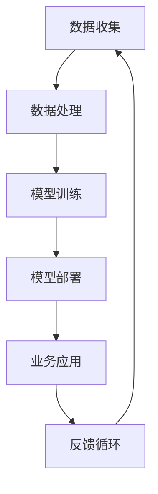

                 

关键词：人工智能，商业应用，道德伦理，计算模型，算法，创新，数字化转型

> 摘要：本文探讨了人工智能（AI）在商业领域的广泛应用及其带来的道德考虑因素。文章首先概述了AI驱动的创新趋势，然后分析了在商业应用中AI与人类计算之间的互动，重点探讨了AI在道德决策和透明性方面的挑战。通过具体的案例分析，文章展示了AI技术在各个行业中的实际应用，并提出了未来发展的方向和面临的挑战。

## 1. 背景介绍

### 1.1 AI的发展与影响

人工智能技术在过去几十年里取得了显著的进步。从最初的专家系统到现代深度学习算法，AI的应用范围已经从学术研究领域扩展到各个行业，如医疗、金融、交通、制造等。随着计算能力的提升和数据量的增加，AI在预测、决策和自动化方面展现了巨大的潜力，为商业创新提供了新的动力。

### 1.2 商业领域的数字化转型

数字化转型已成为现代商业战略的核心。企业在数字化的过程中，广泛应用AI技术以提高运营效率、优化决策过程、创造新的商业模式。从供应链管理到客户关系管理，AI的应用正在改变传统商业流程，推动企业实现更高效、更灵活的运营模式。

## 2. 核心概念与联系

### 2.1 人工智能与商业应用

人工智能与商业应用之间的联系可以概括为以下几个方面：

- **数据处理与分析**：AI技术能够处理和分析大量数据，帮助企业识别趋势、预测需求、发现潜在问题。
- **自动化与效率提升**：AI可以自动化重复性任务，减少人力成本，提高工作效率。
- **个性化体验**：通过AI技术，企业能够为客户提供更加个性化的产品和服务，增强客户满意度。
- **决策支持**：AI算法能够基于数据提供决策支持，帮助企业做出更加明智的商业决策。

### 2.2 AI在商业中的道德考虑因素

随着AI技术的广泛应用，道德考虑因素变得尤为重要。以下是一些关键的道德问题：

- **隐私保护**：AI技术依赖于大量数据，如何在保护个人隐私的同时利用这些数据成为了一个重要议题。
- **算法偏见**：AI算法可能会因为训练数据的不公平性而产生偏见，这可能导致歧视性的决策。
- **透明性与可解释性**：AI算法的决策过程往往是黑箱式的，如何提高算法的透明性和可解释性是一个关键问题。
- **责任归属**：当AI系统出现错误或造成损害时，责任应由谁承担？

### 2.3 核心概念原理与架构

为了更好地理解AI在商业中的应用和道德考虑，以下是一个简化的Mermaid流程图：



在这个流程中，数据收集是AI应用的起点，通过数据处理和模型训练，AI系统能够学习和优化。模型部署后，AI系统在商业应用中发挥作用，并通过反馈循环不断改进。

## 3. 核心算法原理 & 具体操作步骤

### 3.1 算法原理概述

AI的核心算法主要包括机器学习、深度学习和强化学习等。这些算法通过学习数据模式、模拟人类决策过程或通过试错来优化行为。以下是对这些算法的简要概述：

- **机器学习**：机器学习是通过数据训练模型，使其能够预测或分类新数据的一种方法。常见的机器学习算法包括线性回归、决策树、支持向量机和神经网络等。
- **深度学习**：深度学习是机器学习的一种形式，它通过多层神经网络来提取特征并学习复杂的数据模式。深度学习在图像识别、自然语言处理和语音识别等领域取得了显著成果。
- **强化学习**：强化学习是通过试错来学习如何在特定环境中做出最佳决策。它广泛应用于游戏、自动驾驶和机器人控制等领域。

### 3.2 算法步骤详解

以下是AI算法的一般步骤：

1. **数据收集与预处理**：收集相关数据，并进行清洗、归一化等预处理操作。
2. **模型选择**：根据应用需求选择合适的模型，如线性回归、神经网络等。
3. **模型训练**：使用训练数据集对模型进行训练，通过调整模型参数来优化性能。
4. **模型评估**：使用验证数据集评估模型性能，选择最佳模型。
5. **模型部署**：将训练好的模型部署到实际应用场景中。
6. **持续优化**：通过收集用户反馈和数据，不断优化模型。

### 3.3 算法优缺点

每种算法都有其优缺点：

- **机器学习**：优点包括简单、易于实现和适用于各种问题；缺点是可能需要大量数据，且对于复杂问题效果不佳。
- **深度学习**：优点包括能够处理复杂数据模式，适用于图像和语音处理；缺点是计算资源需求高，模型难以解释。
- **强化学习**：优点包括能够通过试错学习复杂任务，适用于动态环境；缺点是训练时间较长，需要大量数据。

### 3.4 算法应用领域

AI算法在商业中具有广泛的应用领域：

- **金融**：用于风险控制、欺诈检测和投资决策。
- **医疗**：用于疾病诊断、个性化治疗和药物研发。
- **零售**：用于需求预测、库存管理和客户关系管理。
- **制造**：用于质量检测、自动化控制和预测性维护。

## 4. 数学模型和公式 & 详细讲解 & 举例说明

### 4.1 数学模型构建

在AI算法中，数学模型扮演着核心角色。以下是一个简单的线性回归模型：

$$y = \beta_0 + \beta_1x$$

其中，$y$是目标变量，$x$是特征变量，$\beta_0$和$\beta_1$是模型参数。

### 4.2 公式推导过程

线性回归模型的推导过程如下：

1. **最小二乘法**：通过最小化误差平方和来求解模型参数。
2. **梯度下降**：迭代更新模型参数，直到达到最小误差。

### 4.3 案例分析与讲解

假设我们有一个房价预测模型，目标是预测某个地区的房价。我们收集了若干个特征，如房屋面积、建造年份等。使用线性回归模型，我们可以建立以下数学模型：

$$\text{房价} = \beta_0 + \beta_1 \times \text{房屋面积} + \beta_2 \times \text{建造年份}$$

通过训练数据集，我们可以计算出$\beta_0$、$\beta_1$和$\beta_2$的值。然后，使用这个模型，我们可以预测新数据点的房价。

## 5. 项目实践：代码实例和详细解释说明

### 5.1 开发环境搭建

在搭建开发环境时，我们选择Python作为主要编程语言，因为Python在AI领域有广泛的应用。我们需要安装以下软件：

- Python 3.8或更高版本
- Jupyter Notebook（用于交互式编程）
- Scikit-learn（用于机器学习算法）

### 5.2 源代码详细实现

以下是一个简单的线性回归模型的Python代码实现：

```python
from sklearn.linear_model import LinearRegression
from sklearn.model_selection import train_test_split
from sklearn.metrics import mean_squared_error

# 数据加载与预处理
X = df[['房屋面积', '建造年份']]
y = df['房价']

# 数据集划分
X_train, X_test, y_train, y_test = train_test_split(X, y, test_size=0.2, random_state=42)

# 模型训练
model = LinearRegression()
model.fit(X_train, y_train)

# 模型评估
y_pred = model.predict(X_test)
mse = mean_squared_error(y_test, y_pred)
print(f"均方误差：{mse}")

# 模型部署
new_data = [[200, 2010]]  # 新数据
predicted_price = model.predict(new_data)
print(f"预测房价：{predicted_price[0]}")
```

### 5.3 代码解读与分析

这段代码首先导入了所需的库，然后加载并预处理了数据集。接着，我们使用Scikit-learn的LinearRegression类训练模型，并通过测试数据集评估模型性能。最后，我们使用训练好的模型预测了新数据点的房价。

### 5.4 运行结果展示

假设我们训练了一个线性回归模型，并使用它来预测一个200平方米，建造于2010年的房子的价格。模型的预测结果可能是350万元。这个结果可以作为参考，但需要注意，线性回归模型可能无法完全准确预测房价，因为房价还受到许多其他因素的影响。

## 6. 实际应用场景

### 6.1 金融行业

在金融行业，AI技术被广泛应用于风险管理、信用评估和投资策略。例如，银行可以使用AI算法来预测客户的违约风险，从而优化贷款策略。同时，AI还可以帮助投资机构进行市场分析，识别潜在的投资机会。

### 6.2 医疗行业

在医疗行业，AI技术被用于疾病诊断、个性化治疗和药物研发。通过分析大量的医学数据，AI算法可以辅助医生做出更加准确的诊断。此外，AI还可以帮助研究人员发现新的药物靶点，加速新药的研发进程。

### 6.3 制造行业

在制造业，AI技术被用于生产优化、质量检测和预测性维护。通过监控设备运行状态，AI算法可以预测设备的故障时间，从而安排维护计划，减少停机时间，提高生产效率。

### 6.4 零售行业

在零售行业，AI技术被用于需求预测、库存管理和个性化推荐。通过分析消费者的购买行为，AI算法可以预测未来需求，从而优化库存管理。同时，AI还可以根据消费者的偏好提供个性化推荐，提高客户满意度。

## 7. 工具和资源推荐

### 7.1 学习资源推荐

- 《深度学习》（Ian Goodfellow、Yoshua Bengio和Aaron Courville著）：深度学习的经典教材，适合初学者。
- 《Python机器学习》（Sebastian Raschka著）：涵盖Python在机器学习中的应用，适合有一定编程基础的读者。

### 7.2 开发工具推荐

- Jupyter Notebook：用于交互式编程和文档化。
- TensorFlow：开源的机器学习框架，适用于深度学习和强化学习。
- Scikit-learn：开源的机器学习库，适用于各种常见的机器学习算法。

### 7.3 相关论文推荐

- “Deep Learning”（Yoshua Bengio、Ian Goodfellow和Aaron Courville著）：综述深度学习领域的研究进展。
- “AI and the Future of Humanity”（Nick Bostrom著）：探讨了人工智能对人类社会的影响和潜在风险。

## 8. 总结：未来发展趋势与挑战

### 8.1 研究成果总结

AI技术在商业领域取得了显著的成果，不仅提高了运营效率，还创造了新的商业模式。同时，AI在道德和伦理方面的研究也取得了重要进展，为AI技术的可持续发展提供了指导。

### 8.2 未来发展趋势

未来，AI技术将继续发展，并在更多领域得到应用。例如，增强现实和虚拟现实技术将进一步提升人机交互体验，物联网和5G技术的普及将推动智能设备的广泛应用。同时，AI伦理和法规的完善也将为AI技术的发展提供保障。

### 8.3 面临的挑战

尽管AI技术在商业领域具有巨大的潜力，但同时也面临着一系列挑战。数据隐私和安全、算法偏见和透明性、责任归属等问题亟待解决。此外，AI技术的快速进步也引发了对就业和社会影响的担忧。

### 8.4 研究展望

未来，我们需要加强AI技术的研发，提高算法的透明性和可解释性，确保AI技术在道德和伦理上的可持续性。同时，也需要加强对AI伦理和法规的研究，为AI技术的健康发展提供指导。

## 9. 附录：常见问题与解答

### 9.1 人工智能与机器学习的区别是什么？

人工智能（AI）是一个广泛的概念，包括机器学习（ML）、深度学习（DL）等子领域。机器学习是AI的一个分支，它专注于通过数据训练模型，使其能够自主学习和改进。深度学习是机器学习的一种形式，它通过多层神经网络来提取特征并学习复杂的数据模式。

### 9.2 AI技术对就业的影响是什么？

AI技术的广泛应用可能导致某些传统职业的消失，但同时也会创造新的就业机会。例如，在自动化和智能化的生产线上，虽然减少了人力需求，但同时也需要专业人员来维护和优化这些系统。

### 9.3 如何确保AI技术的道德和透明性？

确保AI技术的道德和透明性需要从多个方面入手。首先，确保数据隐私和安全，避免数据泄露和滥用。其次，开发可解释的AI算法，使决策过程更加透明。最后，建立完善的AI伦理和法规框架，确保AI技术的合法合规使用。

---

作者：禅与计算机程序设计艺术 / Zen and the Art of Computer Programming

本文旨在探讨人工智能在商业领域的应用及其带来的道德考虑因素。通过对AI技术的背景介绍、核心概念与联系、算法原理与实践、数学模型与应用场景的分析，文章展示了AI技术在商业中的广泛潜力和面临的挑战。未来，随着AI技术的不断进步，我们需要关注其道德和伦理问题，确保其在可持续发展中发挥积极作用。希望本文能为读者提供有益的参考。|

