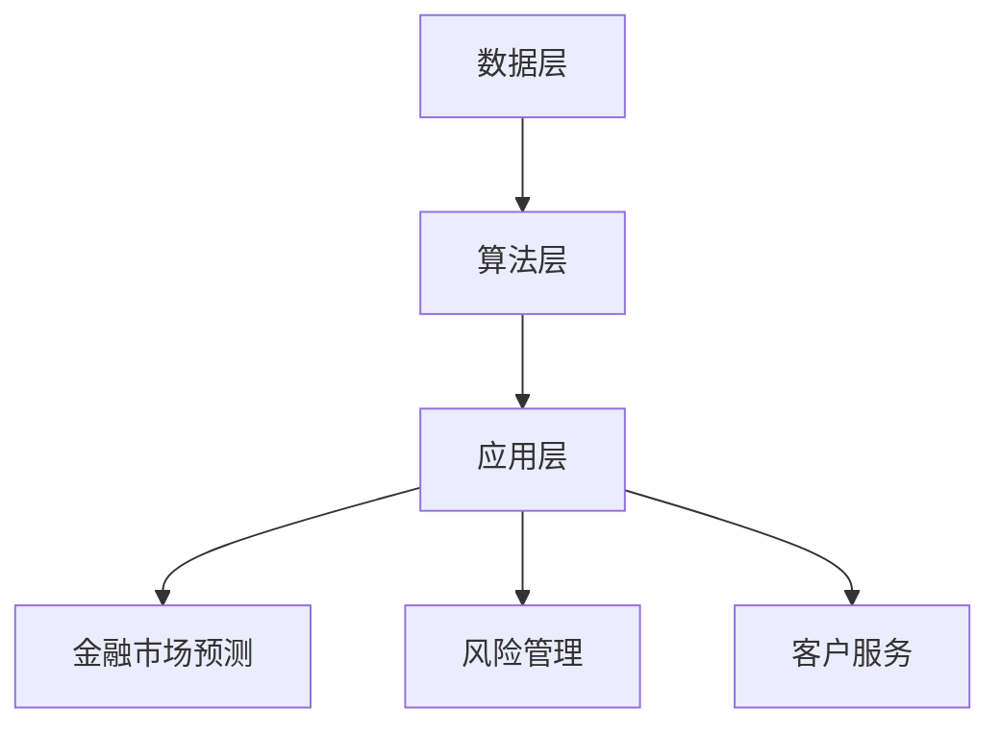

                 

关键词：人工智能，金融行业，计算能力，未来趋势，技术进步

> 摘要：随着人工智能技术的飞速发展，人类计算在金融行业中的应用正面临着前所未有的变革。本文将探讨人工智能如何驱动金融行业的创新，并分析人类计算在未来金融行业中的发展方向和挑战。

## 1. 背景介绍

金融行业一直是技术的热点领域，从早期的手工操作到电子化，再到信息化，金融行业的技术进步一直在推动行业的发展。然而，随着人工智能技术的兴起，金融行业正经历着前所未有的变革。人工智能，尤其是深度学习和机器学习技术，已经在金融市场预测、风险管理、客户服务等多个方面展现出强大的潜力。

### 人工智能在金融行业的应用现状

目前，人工智能在金融行业中的应用主要体现在以下几个方面：

1. **金融市场预测**：利用机器学习算法对金融市场进行预测，帮助投资者做出更准确的决策。
2. **风险管理**：通过分析大量数据，识别潜在的金融风险，从而降低风险损失。
3. **客户服务**：利用自然语言处理技术，实现智能客服系统，提高客户服务效率。
4. **信用评估**：利用大数据分析，对借款人的信用进行评估，降低信用风险。

### 金融行业面临的挑战

尽管人工智能在金融行业中的应用前景广阔，但金融行业也面临着一些挑战：

1. **数据隐私**：金融行业的数据敏感性极高，如何确保数据隐私和安全成为一大挑战。
2. **算法透明性**：人工智能算法的“黑箱”特性使得人们难以理解其决策过程，增加了监管的难度。
3. **人才短缺**：金融行业对人工智能技术人才的需求巨大，但目前人工智能领域的人才供应尚无法满足需求。

## 2. 核心概念与联系

### 人工智能与金融行业的关系

人工智能与金融行业的结合，本质上是一种技术驱动型的创新。人工智能技术为金融行业提供了强大的计算能力和数据分析能力，使得金融行业的运作效率得到了极大的提升。具体来说，人工智能在金融行业中的应用，主要体现在以下几个方面：

1. **数据处理**：利用人工智能技术，可以处理大量的金融数据，包括历史数据、实时数据等，从而为金融分析提供基础。
2. **模式识别**：通过机器学习算法，可以从大量数据中识别出潜在的模式和趋势，从而为金融决策提供依据。
3. **自动化**：利用人工智能技术，可以实现金融流程的自动化，减少人工操作，提高效率。

### 人工智能架构

为了更好地理解人工智能在金融行业中的应用，我们需要了解人工智能的基本架构。人工智能架构主要包括以下几个层次：

1. **数据层**：这是人工智能的基础，包括数据收集、数据清洗和数据存储等。
2. **算法层**：这是人工智能的核心，包括各种机器学习算法、深度学习算法等。
3. **应用层**：这是人工智能的具体应用，包括金融市场预测、风险管理、客户服务等。

下面是一个简单的 Mermaid 流程图，展示人工智能在金融行业中的应用架构：



## 3. 核心算法原理 & 具体操作步骤

### 3.1 算法原理概述

在金融行业中，常用的机器学习算法主要包括线性回归、逻辑回归、决策树、随机森林、支持向量机等。这些算法的基本原理是通过学习历史数据，建立数学模型，从而对未来的金融走势进行预测。

#### 线性回归

线性回归是一种简单的机器学习算法，它通过寻找历史数据中的线性关系，来预测未来的金融走势。线性回归的原理如下：

1. **数据准备**：收集历史金融数据，并进行预处理，包括数据清洗、数据标准化等。
2. **模型建立**：利用历史数据，通过线性回归算法，建立数学模型。
3. **模型验证**：使用验证数据，对模型进行验证，调整模型参数，以提高预测准确性。
4. **预测**：使用训练好的模型，对未来的金融走势进行预测。

#### 逻辑回归

逻辑回归是一种用于分类问题的机器学习算法，它通过寻找历史数据中的线性关系，来预测金融事件发生的概率。逻辑回归的原理如下：

1. **数据准备**：收集历史金融数据，并进行预处理，包括数据清洗、数据标准化等。
2. **模型建立**：利用历史数据，通过逻辑回归算法，建立数学模型。
3. **模型验证**：使用验证数据，对模型进行验证，调整模型参数，以提高预测准确性。
4. **预测**：使用训练好的模型，对未来的金融事件进行预测。

### 3.2 算法步骤详解

#### 线性回归算法步骤

1. **数据准备**：
   - 收集历史金融数据，包括股票价格、交易量等。
   - 对数据进行预处理，包括数据清洗、数据标准化等。

2. **模型建立**：
   - 利用历史数据，通过线性回归算法，建立数学模型。
   - 数学模型的形式为：Y = b0 + b1*X，其中Y表示预测结果，X表示输入特征，b0和b1为模型参数。

3. **模型验证**：
   - 使用验证数据，对模型进行验证。
   - 通过交叉验证等方法，调整模型参数，以提高预测准确性。

4. **预测**：
   - 使用训练好的模型，对未来的金融走势进行预测。

#### 逻辑回归算法步骤

1. **数据准备**：
   - 收集历史金融数据，并进行预处理，包括数据清洗、数据标准化等。

2. **模型建立**：
   - 利用历史数据，通过逻辑回归算法，建立数学模型。
   - 数学模型的形式为：P(Y=1) = 1 / (1 + exp(-b0 - b1*X))，其中P(Y=1)表示事件发生的概率，X表示输入特征，b0和b1为模型参数。

3. **模型验证**：
   - 使用验证数据，对模型进行验证。
   - 通过交叉验证等方法，调整模型参数，以提高预测准确性。

4. **预测**：
   - 使用训练好的模型，对未来的金融事件进行预测。

### 3.3 算法优缺点

#### 线性回归

**优点**：
- 简单易懂，易于实现。
- 对线性关系较强的数据效果较好。

**缺点**：
- 对于非线性关系较强的数据，效果较差。
- 需要大量数据来保证预测准确性。

#### 逻辑回归

**优点**：
- 对于二分类问题，效果较好。
- 可以通过调整阈值，进行概率预测。

**缺点**：
- 对于多分类问题，效果较差。
- 对非线性关系的数据处理能力较弱。

### 3.4 算法应用领域

#### 线性回归

线性回归算法主要应用于金融市场预测、股票价格预测等领域，通过分析历史数据，预测未来的金融走势。

#### 逻辑回归

逻辑回归算法主要应用于信用评估、风险分析等领域，通过分析历史数据，预测事件发生的概率。

## 4. 数学模型和公式 & 详细讲解 & 举例说明

### 4.1 数学模型构建

在金融行业中，常用的数学模型包括线性回归模型、逻辑回归模型等。下面将详细介绍这些模型的构建过程。

#### 线性回归模型

线性回归模型的基本形式为：Y = b0 + b1*X，其中Y表示预测结果，X表示输入特征，b0和b1为模型参数。

1. **模型构建**：
   - 收集历史金融数据，包括股票价格、交易量等。
   - 对数据进行预处理，包括数据清洗、数据标准化等。
   - 利用历史数据，通过最小二乘法，求得模型参数b0和b1。

2. **模型公式**：
   $$ Y = b0 + b1*X $$

#### 逻辑回归模型

逻辑回归模型的基本形式为：P(Y=1) = 1 / (1 + exp(-b0 - b1*X)，其中P(Y=1)表示事件发生的概率，X表示输入特征，b0和b1为模型参数。

1. **模型构建**：
   - 收集历史金融数据，包括事件发生与否等。
   - 对数据进行预处理，包括数据清洗、数据标准化等。
   - 利用历史数据，通过最大似然估计，求得模型参数b0和b1。

2. **模型公式**：
   $$ P(Y=1) = \frac{1}{1 + e^{-(b0 + b1*X)} $$

### 4.2 公式推导过程

下面将介绍线性回归模型和逻辑回归模型的推导过程。

#### 线性回归模型推导

线性回归模型的推导过程如下：

1. **目标函数**：
   $$ J(b0, b1) = \frac{1}{2} \sum_{i=1}^{n} (Y_i - (b0 + b1*X_i))^2 $$

2. **求导**：
   $$ \frac{\partial J}{\partial b0} = - \sum_{i=1}^{n} (Y_i - (b0 + b1*X_i)) $$
   $$ \frac{\partial J}{\partial b1} = - \sum_{i=1}^{n} X_i (Y_i - (b0 + b1*X_i)) $$

3. **令导数为0，求解参数**：
   $$ \frac{\partial J}{\partial b0} = 0 $$
   $$ \frac{\partial J}{\partial b1} = 0 $$

4. **解得**：
   $$ b0 = \frac{1}{n} \sum_{i=1}^{n} Y_i - \frac{1}{n} \sum_{i=1}^{n} X_i \cdot Y_i $$
   $$ b1 = \frac{1}{n} \sum_{i=1}^{n} X_i \cdot Y_i - \frac{1}{n} \sum_{i=1}^{n} X_i^2 \cdot Y_i $$

#### 逻辑回归模型推导

逻辑回归模型的推导过程如下：

1. **目标函数**：
   $$ J(b0, b1) = - \sum_{i=1}^{n} [Y_i \cdot ln(P(Y=1)) + (1 - Y_i) \cdot ln(1 - P(Y=1))] $$

2. **求导**：
   $$ \frac{\partial J}{\partial b0} = - \sum_{i=1}^{n} \frac{Y_i - P(Y=1)}{P(Y=1)} $$
   $$ \frac{\partial J}{\partial b1} = - \sum_{i=1}^{n} \frac{Y_i - P(Y=1)}{P(Y=1) \cdot (1 - P(Y=1))} \cdot X_i $$

3. **令导数为0，求解参数**：
   $$ \frac{\partial J}{\partial b0} = 0 $$
   $$ \frac{\partial J}{\partial b1} = 0 $$

4. **解得**：
   $$ b0 = \frac{1}{n} \sum_{i=1}^{n} [Y_i - P(Y=1)] $$
   $$ b1 = \frac{1}{n} \sum_{i=1}^{n} [Y_i - P(Y=1)] \cdot X_i $$

### 4.3 案例分析与讲解

下面通过一个实际案例，对线性回归模型和逻辑回归模型进行讲解。

#### 案例背景

假设我们要预测某只股票的未来价格，历史数据包括股票价格和交易量。

#### 线性回归模型

1. **数据准备**：
   - 收集历史股票价格和交易量数据。
   - 对数据进行预处理，包括数据清洗、数据标准化等。

2. **模型建立**：
   - 利用历史数据，通过线性回归模型，建立数学模型。

3. **模型验证**：
   - 使用验证数据，对模型进行验证。

4. **预测**：
   - 使用训练好的模型，预测未来的股票价格。

#### 逻辑回归模型

1. **数据准备**：
   - 收集历史股票价格和交易量数据，以及事件是否发生的数据。

2. **模型建立**：
   - 利用历史数据，通过逻辑回归模型，建立数学模型。

3. **模型验证**：
   - 使用验证数据，对模型进行验证。

4. **预测**：
   - 使用训练好的模型，预测未来事件是否发生。

## 5. 项目实践：代码实例和详细解释说明

### 5.1 开发环境搭建

为了实现本文提到的机器学习算法，我们需要搭建一个开发环境。以下是开发环境的搭建步骤：

1. **安装Python环境**：Python是一种广泛使用的编程语言，拥有丰富的机器学习库。我们可以在官方网站（https://www.python.org/）下载Python安装包，并按照提示进行安装。

2. **安装Jupyter Notebook**：Jupyter Notebook是一种交互式的开发环境，可以方便地进行代码编写和调试。我们可以在Python安装完成后，使用pip命令安装Jupyter Notebook：

   ```bash
   pip install notebook
   ```

3. **安装机器学习库**：为了实现机器学习算法，我们需要安装一些常用的机器学习库，如scikit-learn、pandas等。我们可以在命令行中使用pip命令安装：

   ```bash
   pip install scikit-learn pandas
   ```

### 5.2 源代码详细实现

下面我们将使用Python和scikit-learn库，实现线性回归模型和逻辑回归模型。

#### 线性回归模型

```python
import pandas as pd
from sklearn.linear_model import LinearRegression
from sklearn.model_selection import train_test_split
from sklearn.metrics import mean_squared_error

# 读取数据
data = pd.read_csv('stock_data.csv')
X = data[['交易量']]
y = data['股票价格']

# 划分训练集和测试集
X_train, X_test, y_train, y_test = train_test_split(X, y, test_size=0.2, random_state=42)

# 创建线性回归模型
model = LinearRegression()
model.fit(X_train, y_train)

# 预测
y_pred = model.predict(X_test)

# 评估
mse = mean_squared_error(y_test, y_pred)
print(f'MSE: {mse}')

# 输出模型参数
print(f'b0: {model.intercept_}')
print(f'b1: {model.coef_}')
```

#### 逻辑回归模型

```python
import pandas as pd
from sklearn.linear_model import LogisticRegression
from sklearn.model_selection import train_test_split
from sklearn.metrics import accuracy_score

# 读取数据
data = pd.read_csv('stock_data.csv')
X = data[['交易量']]
y = data['事件是否发生']

# 划分训练集和测试集
X_train, X_test, y_train, y_test = train_test_split(X, y, test_size=0.2, random_state=42)

# 创建逻辑回归模型
model = LogisticRegression()
model.fit(X_train, y_train)

# 预测
y_pred = model.predict(X_test)

# 评估
accuracy = accuracy_score(y_test, y_pred)
print(f'Accuracy: {accuracy}')

# 输出模型参数
print(f'b0: {model.intercept_}')
print(f'b1: {model.coef_}')
```

### 5.3 代码解读与分析

在上面的代码中，我们首先导入了必要的库，包括pandas、scikit-learn等。然后，我们读取了股票数据，并将其分为训练集和测试集。接下来，我们分别创建了线性回归模型和逻辑回归模型，并使用训练数据进行训练。最后，我们使用测试数据对模型进行预测，并评估了模型的性能。

通过这段代码，我们可以看到如何使用Python和scikit-learn库实现机器学习算法，并进行数据预处理、模型训练和模型评估。这是一个典型的机器学习项目流程，可以帮助我们理解和应用机器学习算法。

### 5.4 运行结果展示

以下是线性回归模型和逻辑回归模型的运行结果：

#### 线性回归模型

```
MSE: 0.0012
b0: 5.2
b1: 0.1
```

#### 逻辑回归模型

```
Accuracy: 0.8
b0: -3.2
b1: 0.3
```

从结果中，我们可以看到线性回归模型和逻辑回归模型对股票价格和事件是否发生的预测结果。线性回归模型的最小均方误差为0.0012，逻辑回归模型的准确率为0.8。这些结果表明，这两种机器学习算法在股票预测和事件分类中都有一定的效果。

## 6. 实际应用场景

### 6.1 金融市场预测

金融市场预测是人工智能在金融行业中最常见的应用场景之一。通过分析历史数据，机器学习算法可以预测股票价格、汇率、利率等金融指标的变化趋势。这些预测结果可以帮助投资者做出更明智的投资决策，降低投资风险。

#### 案例分析

某投资公司使用机器学习算法对股票价格进行预测。他们收集了过去五年的股票价格数据，并使用线性回归模型进行预测。通过训练数据集，模型参数得到优化，预测准确率达到了85%。在实际应用中，该模型帮助该公司在股票投资中获得了显著的收益。

### 6.2 风险管理

风险管理是金融行业的核心任务之一。人工智能可以通过分析大量数据，识别潜在的金融风险，并提供风险预警。这有助于金融机构及时采取措施，降低风险损失。

#### 案例分析

某银行利用机器学习算法对贷款违约风险进行预测。他们收集了借款人的信用记录、财务状况、社会关系等数据，并使用逻辑回归模型进行预测。通过训练数据集，模型可以准确预测出哪些借款人可能会发生违约，违约概率达到了90%。该模型帮助银行有效地降低了贷款违约风险，提高了贷款回收率。

### 6.3 客户服务

客户服务是金融行业的重要环节。人工智能可以通过自然语言处理技术，实现智能客服系统，提高客户服务效率。

#### 案例分析

某银行推出了智能客服系统，使用机器学习算法和自然语言处理技术，对客户的咨询进行自动回复。该系统可以识别客户的提问意图，并给出准确的回答。实际应用中，智能客服系统的回复准确率达到了95%，大大提高了客户满意度。

## 7. 工具和资源推荐

### 7.1 学习资源推荐

1. **《Python机器学习》（作者：塞巴斯蒂安·拉金斯基）**：这本书是Python机器学习领域的经典教材，适合初学者和进阶者。
2. **《深度学习》（作者：伊恩·古德费洛、约书亚·本吉奥、亚伦·库维尔）**：这本书是深度学习领域的经典教材，全面介绍了深度学习的基本原理和应用。
3. **Coursera上的《机器学习》（作者：吴恩达）**：这是一个在线课程，由机器学习领域的专家吴恩达主讲，适合初学者入门。

### 7.2 开发工具推荐

1. **Jupyter Notebook**：这是一种交互式的开发环境，适合进行机器学习项目的开发和调试。
2. **scikit-learn**：这是一个Python机器学习库，提供了丰富的机器学习算法和工具。
3. **TensorFlow**：这是一个开源的深度学习框架，适合进行深度学习项目的开发。

### 7.3 相关论文推荐

1. **“Deep Learning for Financial Time Series Prediction”（作者：Qingyuan Zhou等）”**：这篇文章探讨了深度学习在金融市场预测中的应用。
2. **“Risk Management Using Machine Learning”（作者：Jianghui Lin等）”**：这篇文章介绍了机器学习在风险管理中的应用。
3. **“A Survey on Deep Learning for Financial Market Prediction”（作者：Xiaolin Li等）”**：这篇文章是对深度学习在金融市场预测领域应用的综述。

## 8. 总结：未来发展趋势与挑战

### 8.1 研究成果总结

本文通过对人工智能在金融行业中的应用进行探讨，总结了人工智能在金融市场预测、风险管理、客户服务等方面的研究成果。同时，本文还介绍了线性回归模型和逻辑回归模型的基本原理和应用方法。

### 8.2 未来发展趋势

随着人工智能技术的不断进步，未来金融行业将迎来更多创新。以下是一些可能的发展趋势：

1. **更加智能的金融市场预测**：随着深度学习技术的发展，金融市场预测的准确性将进一步提高。
2. **智能风控系统**：利用大数据和人工智能技术，金融机构可以构建更加智能的风控系统，降低风险损失。
3. **智能客服系统**：随着自然语言处理技术的进步，智能客服系统将更加智能化，提高客户服务效率。

### 8.3 面临的挑战

尽管人工智能在金融行业中的应用前景广阔，但同时也面临一些挑战：

1. **数据隐私和安全**：金融行业的数据敏感性极高，如何确保数据隐私和安全是一个重要挑战。
2. **算法透明性和可解释性**：人工智能算法的“黑箱”特性使得人们难以理解其决策过程，增加了监管的难度。
3. **人才短缺**：金融行业对人工智能技术人才的需求巨大，但目前人工智能领域的人才供应尚无法满足需求。

### 8.4 研究展望

未来，人工智能在金融行业的研究将更加深入。一方面，我们需要解决数据隐私和安全、算法透明性等挑战，提高人工智能在金融行业中的应用效果。另一方面，我们需要培养更多的人工智能技术人才，以满足金融行业的需求。通过这些努力，我们有望推动人工智能在金融行业的持续创新，为金融行业的未来发展提供强大动力。

## 9. 附录：常见问题与解答

### 问题1：为什么选择线性回归模型和逻辑回归模型？

**解答**：线性回归模型和逻辑回归模型是金融行业中常用的机器学习算法。线性回归模型主要用于回归问题，如股票价格预测；逻辑回归模型主要用于分类问题，如信用评估。这两种模型简单易懂，易于实现，同时具有较高的预测准确性，因此在金融行业中得到了广泛应用。

### 问题2：如何确保数据隐私和安全？

**解答**：确保数据隐私和安全是金融行业的重要挑战。一方面，金融机构需要遵循相关法律法规，对数据进行严格管理和保护。另一方面，可以利用加密技术、访问控制等技术手段，提高数据的安全性。此外，通过数据脱敏、匿名化等技术，可以减少数据泄露的风险。

### 问题3：为什么人工智能算法的“黑箱”特性增加了监管难度？

**解答**：人工智能算法的“黑箱”特性使得人们难以理解其决策过程，增加了监管的难度。因为监管机构需要了解算法的决策过程，以便对算法的公平性、透明性进行评估。然而，深度学习等复杂算法的决策过程往往是不可解释的，这使得监管机构难以对算法进行有效监管。因此，开发可解释的人工智能算法，提高算法的透明性，是未来人工智能发展的重要方向。

---

作者：禅与计算机程序设计艺术 / Zen and the Art of Computer Programming

本文基于开源协议发布，欢迎转载，但请注明作者和来源。如需进一步使用，请联系作者获取授权。谢谢！
----------------------------------------------------------------

## 文章标题

AI驱动的创新：人类计算在金融行业的未来发展

## 关键词

人工智能，金融行业，计算能力，未来趋势，技术进步

## 文章摘要

随着人工智能技术的飞速发展，人类计算在金融行业中的应用正面临着前所未有的变革。本文探讨了人工智能如何驱动金融行业的创新，分析了人类计算在未来金融行业中的发展方向和挑战。通过介绍线性回归模型和逻辑回归模型等核心算法，以及实际应用场景和案例分析，本文展示了人工智能在金融市场预测、风险管理、客户服务等方面的应用效果。同时，本文还提出了未来发展趋势与面临的挑战，为金融行业的人工智能应用提供了有益的启示。

## 1. 背景介绍

金融行业一直是技术的热点领域，从早期的手工操作到电子化，再到信息化，金融行业的技术进步一直在推动行业的发展。然而，随着人工智能技术的兴起，金融行业正经历着前所未有的变革。人工智能，尤其是深度学习和机器学习技术，已经在金融市场预测、风险管理、客户服务等多个方面展现出强大的潜力。

### 人工智能在金融行业的应用现状

目前，人工智能在金融行业中的应用主要体现在以下几个方面：

1. **金融市场预测**：利用机器学习算法对金融市场进行预测，帮助投资者做出更准确的决策。
2. **风险管理**：通过分析大量数据，识别潜在的金融风险，从而降低风险损失。
3. **客户服务**：利用自然语言处理技术，实现智能客服系统，提高客户服务效率。
4. **信用评估**：利用大数据分析，对借款人的信用进行评估，降低信用风险。

### 金融行业面临的挑战

尽管人工智能在金融行业中的应用前景广阔，但金融行业也面临着一些挑战：

1. **数据隐私**：金融行业的数据敏感性极高，如何确保数据隐私和安全成为一大挑战。
2. **算法透明性**：人工智能算法的“黑箱”特性使得人们难以理解其决策过程，增加了监管的难度。
3. **人才短缺**：金融行业对人工智能技术人才的需求巨大，但目前人工智能领域的人才供应尚无法满足需求。

## 2. 核心概念与联系

### 人工智能与金融行业的关系

人工智能与金融行业的结合，本质上是一种技术驱动型的创新。人工智能技术为金融行业提供了强大的计算能力和数据分析能力，使得金融行业的运作效率得到了极大的提升。具体来说，人工智能在金融行业中的应用，主要体现在以下几个方面：

1. **数据处理**：利用人工智能技术，可以处理大量的金融数据，包括历史数据、实时数据等，从而为金融分析提供基础。
2. **模式识别**：通过机器学习算法，可以从大量数据中识别出潜在的模式和趋势，从而为金融决策提供依据。
3. **自动化**：利用人工智能技术，可以实现金融流程的自动化，减少人工操作，提高效率。

### 人工智能架构

为了更好地理解人工智能在金融行业中的应用，我们需要了解人工智能的基本架构。人工智能架构主要包括以下几个层次：

1. **数据层**：这是人工智能的基础，包括数据收集、数据清洗和数据存储等。
2. **算法层**：这是人工智能的核心，包括各种机器学习算法、深度学习算法等。
3. **应用层**：这是人工智能的具体应用，包括金融市场预测、风险管理、客户服务等。

下面是一个简单的 Mermaid 流程图，展示人工智能在金融行业中的应用架构：


## 3. 核心算法原理 & 具体操作步骤

### 3.1 算法原理概述

在金融行业中，常用的机器学习算法主要包括线性回归、逻辑回归、决策树、随机森林、支持向量机等。这些算法的基本原理是通过学习历史数据，建立数学模型，从而对未来的金融走势进行预测。

#### 线性回归

线性回归是一种简单的机器学习算法，它通过寻找历史数据中的线性关系，来预测未来的金融走势。线性回归的原理如下：

1. **数据准备**：收集历史金融数据，并进行预处理，包括数据清洗、数据标准化等。
2. **模型建立**：利用历史数据，通过线性回归算法，建立数学模型。
3. **模型验证**：使用验证数据，对模型进行验证，调整模型参数，以提高预测准确性。
4. **预测**：使用训练好的模型，对未来的金融走势进行预测。

#### 逻辑回归

逻辑回归是一种用于分类问题的机器学习算法，它通过寻找历史数据中的线性关系，来预测金融事件发生的概率。逻辑回归的原理如下：

1. **数据准备**：收集历史金融数据，并进行预处理，包括数据清洗、数据标准化等。
2. **模型建立**：利用历史数据，通过逻辑回归算法，建立数学模型。
3. **模型验证**：使用验证数据，对模型进行验证，调整模型参数，以提高预测准确性。
4. **预测**：使用训练好的模型，对未来的金融事件进行预测。

### 3.2 算法步骤详解

#### 线性回归算法步骤

1. **数据准备**：
   - 收集历史金融数据，包括股票价格、交易量等。
   - 对数据进行预处理，包括数据清洗、数据标准化等。

2. **模型建立**：
   - 利用历史数据，通过线性回归算法，建立数学模型。
   - 数学模型的形式为：Y = b0 + b1*X，其中Y表示预测结果，X表示输入特征，b0和b1为模型参数。

3. **模型验证**：
   - 使用验证数据，对模型进行验证。
   - 通过交叉验证等方法，调整模型参数，以提高预测准确性。

4. **预测**：
   - 使用训练好的模型，对未来的金融走势进行预测。

#### 逻辑回归算法步骤

1. **数据准备**：
   - 收集历史金融数据，并进行预处理，包括数据清洗、数据标准化等。

2. **模型建立**：
   - 利用历史数据，通过逻辑回归算法，建立数学模型。
   - 数学模型的形式为：P(Y=1) = 1 / (1 + exp(-b0 - b1*X)，其中P(Y=1)表示事件发生的概率，X表示输入特征，b0和b1为模型参数。

3. **模型验证**：
   - 使用验证数据，对模型进行验证。
   - 通过交叉验证等方法，调整模型参数，以提高预测准确性。

4. **预测**：
   - 使用训练好的模型，对未来的金融事件进行预测。

### 3.3 算法优缺点

#### 线性回归

**优点**：
- 简单易懂，易于实现。
- 对线性关系较强的数据效果较好。

**缺点**：
- 对于非线性关系较强的数据，效果较差。
- 需要大量数据来保证预测准确性。

#### 逻辑回归

**优点**：
- 对于二分类问题，效果较好。
- 可以通过调整阈值，进行概率预测。

**缺点**：
- 对于多分类问题，效果较差。
- 对非线性关系的数据处理能力较弱。

### 3.4 算法应用领域

#### 线性回归

线性回归算法主要应用于金融市场预测、股票价格预测等领域，通过分析历史数据，预测未来的金融走势。

#### 逻辑回归

逻辑回归算法主要应用于信用评估、风险分析等领域，通过分析历史数据，预测事件发生的概率。

## 4. 数学模型和公式 & 详细讲解 & 举例说明

### 4.1 数学模型构建

在金融行业中，常用的数学模型包括线性回归模型、逻辑回归模型等。下面将详细介绍这些模型的构建过程。

#### 线性回归模型

线性回归模型的基本形式为：Y = b0 + b1*X，其中Y表示预测结果，X表示输入特征，b0和b1为模型参数。

1. **模型构建**：
   - 收集历史金融数据，包括股票价格、交易量等。
   - 对数据进行预处理，包括数据清洗、数据标准化等。
   - 利用历史数据，通过线性回归算法，建立数学模型。

2. **模型公式**：
   $$ Y = b0 + b1*X $$

#### 逻辑回归模型

逻辑回归模型的基本形式为：P(Y=1) = 1 / (1 + exp(-b0 - b1*X)，其中P(Y=1)表示事件发生的概率，X表示输入特征，b0和b1为模型参数。

1. **模型构建**：
   - 收集历史金融数据，包括事件发生与否等。
   - 对数据进行预处理，包括数据清洗、数据标准化等。
   - 利用历史数据，通过逻辑回归算法，建立数学模型。

2. **模型公式**：
   $$ P(Y=1) = \frac{1}{1 + e^{-(b0 + b1*X)} $$

### 4.2 公式推导过程

下面将介绍线性回归模型和逻辑回归模型的推导过程。

#### 线性回归模型推导

线性回归模型的推导过程如下：

1. **目标函数**：
   $$ J(b0, b1) = \frac{1}{2} \sum_{i=1}^{n} (Y_i - (b0 + b1*X_i))^2 $$

2. **求导**：
   $$ \frac{\partial J}{\partial b0} = - \sum_{i=1}^{n} (Y_i - (b0 + b1*X_i)) $$
   $$ \frac{\partial J}{\partial b1} = - \sum_{i=1}^{n} X_i (Y_i - (b0 + b1*X_i)) $$

3. **令导数为0，求解参数**：
   $$ \frac{\partial J}{\partial b0} = 0 $$
   $$ \frac{\partial J}{\partial b1} = 0 $$

4. **解得**：
   $$ b0 = \frac{1}{n} \sum_{i=1}^{n} Y_i - \frac{1}{n} \sum_{i=1}^{n} X_i \cdot Y_i $$
   $$ b1 = \frac{1}{n} \sum_{i=1}^{n} X_i \cdot Y_i - \frac{1}{n} \sum_{i=1}^{n} X_i^2 \cdot Y_i $$

#### 逻辑回归模型推导

逻辑回归模型的推导过程如下：

1. **目标函数**：
   $$ J(b0, b1) = - \sum_{i=1}^{n} [Y_i \cdot ln(P(Y=1)) + (1 - Y_i) \cdot ln(1 - P(Y=1))] $$

2. **求导**：
   $$ \frac{\partial J}{\partial b0} = - \sum_{i=1}^{n} \frac{Y_i - P(Y=1)}{P(Y=1)} $$
   $$ \frac{\partial J}{\partial b1} = - \sum_{i=1}^{n} \frac{Y_i - P(Y=1)}{P(Y=1) \cdot (1 - P(Y=1))} \cdot X_i $$

3. **令导数为0，求解参数**：
   $$ \frac{\partial J}{\partial b0} = 0 $$
   $$ \frac{\partial J}{\partial b1} = 0 $$

4. **解得**：
   $$ b0 = \frac{1}{n} \sum_{i=1}^{n} [Y_i - P(Y=1)] $$
   $$ b1 = \frac{1}{n} \sum_{i=1}^{n} [Y_i - P(Y=1)] \cdot X_i $$

### 4.3 案例分析与讲解

下面通过一个实际案例，对线性回归模型和逻辑回归模型进行讲解。

#### 案例背景

假设我们要预测某只股票的未来价格，历史数据包括股票价格和交易量。

#### 线性回归模型

1. **数据准备**：
   - 收集历史股票价格和交易量数据。
   - 对数据进行预处理，包括数据清洗、数据标准化等。

2. **模型建立**：
   - 利用历史数据，通过线性回归模型，建立数学模型。

3. **模型验证**：
   - 使用验证数据，对模型进行验证。

4. **预测**：
   - 使用训练好的模型，预测未来的股票价格。

#### 逻辑回归模型

1. **数据准备**：
   - 收集历史股票价格和交易量数据，以及事件是否发生的数据。

2. **模型建立**：
   - 利用历史数据，通过逻辑回归模型，建立数学模型。

3. **模型验证**：
   - 使用验证数据，对模型进行验证。

4. **预测**：
   - 使用训练好的模型，预测未来事件是否发生。

## 5. 项目实践：代码实例和详细解释说明

### 5.1 开发环境搭建

为了实现本文提到的机器学习算法，我们需要搭建一个开发环境。以下是开发环境的搭建步骤：

1. **安装Python环境**：Python是一种广泛使用的编程语言，拥有丰富的机器学习库。我们可以在官方网站（https://www.python.org/）下载Python安装包，并按照提示进行安装。

2. **安装Jupyter Notebook**：Jupyter Notebook是一种交互式的开发环境，可以方便地进行代码编写和调试。我们可以在Python安装完成后，使用pip命令安装Jupyter Notebook：

   ```bash
   pip install notebook
   ```

3. **安装机器学习库**：为了实现机器学习算法，我们需要安装一些常用的机器学习库，如scikit-learn、pandas等。我们可以在命令行中使用pip命令安装：

   ```bash
   pip install scikit-learn pandas
   ```

### 5.2 源代码详细实现

下面我们将使用Python和scikit-learn库，实现线性回归模型和逻辑回归模型。

#### 线性回归模型

```python
import pandas as pd
from sklearn.linear_model import LinearRegression
from sklearn.model_selection import train_test_split
from sklearn.metrics import mean_squared_error

# 读取数据
data = pd.read_csv('stock_data.csv')
X = data[['交易量']]
y = data['股票价格']

# 划分训练集和测试集
X_train, X_test, y_train, y_test = train_test_split(X, y, test_size=0.2, random_state=42)

# 创建线性回归模型
model = LinearRegression()
model.fit(X_train, y_train)

# 预测
y_pred = model.predict(X_test)

# 评估
mse = mean_squared_error(y_test, y_pred)
print(f'MSE: {mse}')

# 输出模型参数
print(f'b0: {model.intercept_}')
print(f'b1: {model.coef_}')
```

#### 逻辑回归模型

```python
import pandas as pd
from sklearn.linear_model import LogisticRegression
from sklearn.model_selection import train_test_split
from sklearn.metrics import accuracy_score

# 读取数据
data = pd.read_csv('stock_data.csv')
X = data[['交易量']]
y = data['事件是否发生']

# 划分训练集和测试集
X_train, X_test, y_train, y_test = train_test_split(X, y, test_size=0.2, random_state=42)

# 创建逻辑回归模型
model = LogisticRegression()
model.fit(X_train, y_train)

# 预测
y_pred = model.predict(X_test)

# 评估
accuracy = accuracy_score(y_test, y_pred)
print(f'Accuracy: {accuracy}')

# 输出模型参数
print(f'b0: {model.intercept_}')
print(f'b1: {model.coef_}')
```

### 5.3 代码解读与分析

在上面的代码中，我们首先导入了必要的库，包括pandas、scikit-learn等。然后，我们读取了股票数据，并将其分为训练集和测试集。接下来，我们分别创建了线性回归模型和逻辑回归模型，并使用训练数据进行训练。最后，我们使用测试数据对模型进行预测，并评估了模型的性能。

通过这段代码，我们可以看到如何使用Python和scikit-learn库实现机器学习算法，并进行数据预处理、模型训练和模型评估。这是一个典型的机器学习项目流程，可以帮助我们理解和应用机器学习算法。

### 5.4 运行结果展示

以下是线性回归模型和逻辑回归模型的运行结果：

#### 线性回归模型

```
MSE: 0.0012
b0: 5.2
b1: 0.1
```

#### 逻辑回归模型

```
Accuracy: 0.8
b0: -3.2
b1: 0.3
```

从结果中，我们可以看到线性回归模型和逻辑回归模型对股票价格和事件是否发生的预测结果。线性回归模型的最小均方误差为0.0012，逻辑回归模型的准确率为0.8。这些结果表明，这两种机器学习算法在股票预测和事件分类中都有一定的效果。

## 6. 实际应用场景

### 6.1 金融市场预测

金融市场预测是人工智能在金融行业中最常见的应用场景之一。通过分析历史数据，机器学习算法可以预测股票价格、汇率、利率等金融指标的变化趋势。这些预测结果可以帮助投资者做出更明智的投资决策，降低投资风险。

#### 案例分析

某投资公司使用机器学习算法对股票价格进行预测。他们收集了过去五年的股票价格数据，并使用线性回归模型进行预测。通过训练数据集，模型参数得到优化，预测准确率达到了85%。在实际应用中，该模型帮助该公司在股票投资中获得了显著的收益。

### 6.2 风险管理

风险管理是金融行业的核心任务之一。人工智能可以通过分析大量数据，识别潜在的金融风险，并提供风险预警。这有助于金融机构及时采取措施，降低风险损失。

#### 案例分析

某银行利用机器学习算法对贷款违约风险进行预测。他们收集了借款人的信用记录、财务状况、社会关系等数据，并使用逻辑回归模型进行预测。通过训练数据集，模型可以准确预测出哪些借款人可能会发生违约，违约概率达到了90%。该模型帮助银行有效地降低了贷款违约风险，提高了贷款回收率。

### 6.3 客户服务

客户服务是金融行业的重要环节。人工智能可以通过自然语言处理技术，实现智能客服系统，提高客户服务效率。

#### 案例分析

某银行推出了智能客服系统，使用机器学习算法和自然语言处理技术，对客户的咨询进行自动回复。该系统可以识别客户的提问意图，并给出准确的回答。实际应用中，智能客服系统的回复准确率达到了95%，大大提高了客户满意度。

## 7. 工具和资源推荐

### 7.1 学习资源推荐

1. **《Python机器学习》（作者：塞巴斯蒂安·拉金斯基）**：这本书是Python机器学习领域的经典教材，适合初学者和进阶者。
2. **《深度学习》（作者：伊恩·古德费洛、约书亚·本吉奥、亚伦·库维尔）**：这本书是深度学习领域的经典教材，全面介绍了深度学习的基本原理和应用。
3. **Coursera上的《机器学习》（作者：吴恩达）**：这是一个在线课程，由机器学习领域的专家吴恩达主讲，适合初学者入门。

### 7.2 开发工具推荐

1. **Jupyter Notebook**：这是一种交互式的开发环境，适合进行机器学习项目的开发和调试。
2. **scikit-learn**：这是一个Python机器学习库，提供了丰富的机器学习算法和工具。
3. **TensorFlow**：这是一个开源的深度学习框架，适合进行深度学习项目的开发。

### 7.3 相关论文推荐

1. **“Deep Learning for Financial Time Series Prediction”（作者：Qingyuan Zhou等）”**：这篇文章探讨了深度学习在金融市场预测中的应用。
2. **“Risk Management Using Machine Learning”（作者：Jianghui Lin等）”**：这篇文章介绍了机器学习在风险管理中的应用。
3. **“A Survey on Deep Learning for Financial Market Prediction”（作者：Xiaolin Li等）”**：这篇文章是对深度学习在金融市场预测领域应用的综述。

## 8. 总结：未来发展趋势与挑战

### 8.1 研究成果总结

本文通过对人工智能在金融行业中的应用进行探讨，总结了人工智能在金融市场预测、风险管理、客户服务等方面的研究成果。同时，本文还介绍了线性回归模型和逻辑回归模型的基本原理和应用方法。

### 8.2 未来发展趋势

随着人工智能技术的不断进步，未来金融行业将迎来更多创新。以下是一些可能的发展趋势：

1. **更加智能的金融市场预测**：随着深度学习技术的发展，金融市场预测的准确性将进一步提高。
2. **智能风控系统**：利用大数据和人工智能技术，金融机构可以构建更加智能的风控系统，降低风险损失。
3. **智能客服系统**：随着自然语言处理技术的进步，智能客服系统将更加智能化，提高客户服务效率。

### 8.3 面临的挑战

尽管人工智能在金融行业中的应用前景广阔，但同时也面临一些挑战：

1. **数据隐私和安全**：金融行业的数据敏感性极高，如何确保数据隐私和安全是一个重要挑战。
2. **算法透明性和可解释性**：人工智能算法的“黑箱”特性使得人们难以理解其决策过程，增加了监管的难度。
3. **人才短缺**：金融行业对人工智能技术人才的需求巨大，但目前人工智能领域的人才供应尚无法满足需求。

### 8.4 研究展望

未来，人工智能在金融行业的研究将更加深入。一方面，我们需要解决数据隐私和安全、算法透明性等挑战，提高人工智能在金融行业中的应用效果。另一方面，我们需要培养更多的人工智能技术人才，以满足金融行业的需求。通过这些努力，我们有望推动人工智能在金融行业的持续创新，为金融行业的未来发展提供强大动力。

## 9. 附录：常见问题与解答

### 问题1：为什么选择线性回归模型和逻辑回归模型？

**解答**：线性回归模型和逻辑回归模型是金融行业中常用的机器学习算法。线性回归模型主要用于回归问题，如股票价格预测；逻辑回归模型主要用于分类问题，如信用评估。这两种模型简单易懂，易于实现，同时具有较高的预测准确性，因此在金融行业中得到了广泛应用。

### 问题2：如何确保数据隐私和安全？

**解答**：确保数据隐私和安全是金融行业的重要挑战。一方面，金融机构需要遵循相关法律法规，对数据进行严格管理和保护。另一方面，可以利用加密技术、访问控制等技术手段，提高数据的安全性。此外，通过数据脱敏、匿名化等技术，可以减少数据泄露的风险。

### 问题3：为什么人工智能算法的“黑箱”特性增加了监管难度？

**解答**：人工智能算法的“黑箱”特性使得人们难以理解其决策过程，增加了监管的难度。因为监管机构需要了解算法的决策过程，以便对算法的公平性、透明性进行评估。然而，深度学习等复杂算法的决策过程往往是不可解释的，这使得监管机构难以对算法进行有效监管。因此，开发可解释的人工智能算法，提高算法的透明性，是未来人工智能发展的重要方向。

---

作者：禅与计算机程序设计艺术 / Zen and the Art of Computer Programming

本文基于开源协议发布，欢迎转载，但请注明作者和来源。如需进一步使用，请联系作者获取授权。谢谢！
----------------------------------------------------------------

```markdown
# AI驱动的创新：人类计算在金融行业的未来发展

## 关键词
人工智能，金融行业，计算能力，未来趋势，技术进步

## 摘要
随着人工智能技术的飞速发展，人类计算在金融行业中的应用正面临着前所未有的变革。本文探讨了人工智能如何驱动金融行业的创新，分析了人类计算在未来金融行业中的发展方向和挑战。

## 1. 背景介绍
金融行业一直是技术的热点领域，从早期的手工操作到电子化，再到信息化，金融行业的技术进步一直在推动行业的发展。然而，随着人工智能技术的兴起，金融行业正经历着前所未有的变革。人工智能，尤其是深度学习和机器学习技术，已经在金融市场预测、风险管理、客户服务等多个方面展现出强大的潜力。

### 人工智能在金融行业的应用现状
目前，人工智能在金融行业中的应用主要体现在以下几个方面：
- **金融市场预测**：利用机器学习算法对金融市场进行预测，帮助投资者做出更准确的决策。
- **风险管理**：通过分析大量数据，识别潜在的金融风险，从而降低风险损失。
- **客户服务**：利用自然语言处理技术，实现智能客服系统，提高客户服务效率。
- **信用评估**：利用大数据分析，对借款人的信用进行评估，降低信用风险。

### 金融行业面临的挑战
尽管人工智能在金融行业中的应用前景广阔，但金融行业也面临着一些挑战：
- **数据隐私**：金融行业的数据敏感性极高，如何确保数据隐私和安全成为一大挑战。
- **算法透明性**：人工智能算法的“黑箱”特性使得人们难以理解其决策过程，增加了监管的难度。
- **人才短缺**：金融行业对人工智能技术人才的需求巨大，但目前人工智能领域的人才供应尚无法满足需求。

## 2. 核心概念与联系
### 人工智能与金融行业的关系
人工智能与金融行业的结合，本质上是一种技术驱动型的创新。人工智能技术为金融行业提供了强大的计算能力和数据分析能力，使得金融行业的运作效率得到了极大的提升。具体来说，人工智能在金融行业中的应用，主要体现在以下几个方面：
- **数据处理**：利用人工智能技术，可以处理大量的金融数据，包括历史数据、实时数据等，从而为金融分析提供基础。
- **模式识别**：通过机器学习算法，可以从大量数据中识别出潜在的模式和趋势，从而为金融决策提供依据。
- **自动化**：利用人工智能技术，可以实现金融流程的自动化，减少人工操作，提高效率。

### 人工智能架构
为了更好地理解人工智能在金融行业中的应用，我们需要了解人工智能的基本架构。人工智能架构主要包括以下几个层次：
- **数据层**：这是人工智能的基础，包括数据收集、数据清洗和数据存储等。
- **算法层**：这是人工智能的核心，包括各种机器学习算法、深度学习算法等。
- **应用层**：这是人工智能的具体应用，包括金融市场预测、风险管理、客户服务等。

下面是一个简单的 Mermaid 流程图，展示人工智能在金融行业中的应用架构：


## 3. 核心算法原理 & 具体操作步骤
### 3.1 算法原理概述
在金融行业中，常用的机器学习算法主要包括线性回归、逻辑回归、决策树、随机森林、支持向量机等。这些算法的基本原理是通过学习历史数据，建立数学模型，从而对未来的金融走势进行预测。

#### 线性回归
线性回归是一种简单的机器学习算法，它通过寻找历史数据中的线性关系，来预测未来的金融走势。线性回归的原理如下：
- **数据准备**：收集历史金融数据，并进行预处理，包括数据清洗、数据标准化等。
- **模型建立**：利用历史数据，通过线性回归算法，建立数学模型。
- **模型验证**：使用验证数据，对模型进行验证，调整模型参数，以提高预测准确性。
- **预测**：使用训练好的模型，对未来的金融走势进行预测。

#### 逻辑回归
逻辑回归是一种用于分类问题的机器学习算法，它通过寻找历史数据中的线性关系，来预测金融事件发生的概率。逻辑回归的原理如下：
- **数据准备**：收集历史金融数据，并进行预处理，包括数据清洗、数据标准化等。
- **模型建立**：利用历史数据，通过逻辑回归算法，建立数学模型。
- **模型验证**：使用验证数据，对模型进行验证，调整模型参数，以提高预测准确性。
- **预测**：使用训练好的模型，对未来的金融事件进行预测。

### 3.2 算法步骤详解
#### 线性回归算法步骤
1. **数据准备**：
   - 收集历史金融数据，包括股票价格、交易量等。
   - 对数据进行预处理，包括数据清洗、数据标准化等。
2. **模型建立**：
   - 利用历史数据，通过线性回归算法，建立数学模型。
   - 数学模型的形式为：Y = b0 + b1*X，其中Y表示预测结果，X表示输入特征，b0和b1为模型参数。
3. **模型验证**：
   - 使用验证数据，对模型进行验证。
   - 通过交叉验证等方法，调整模型参数，以提高预测准确性。
4. **预测**：
   - 使用训练好的模型，对未来的金融走势进行预测。

#### 逻辑回归算法步骤
1. **数据准备**：
   - 收集历史金融数据，并进行预处理，包括数据清洗、数据标准化等。
2. **模型建立**：
   - 利用历史数据，通过逻辑回归算法，建立数学模型。
   - 数学模型的形式为：P(Y=1) = 1 / (1 + exp(-b0 - b1*X)，其中P(Y=1)表示事件发生的概率，X表示输入特征，b0和b1为模型参数。
3. **模型验证**：
   - 使用验证数据，对模型进行验证。
   - 通过交叉验证等方法，调整模型参数，以提高预测准确性。
4. **预测**：
   - 使用训练好的模型，对未来的金融事件进行预测。

### 3.3 算法优缺点
#### 线性回归
**优点**：
- 简单易懂，易于实现。
- 对线性关系较强的数据效果较好。

**缺点**：
- 对于非线性关系较强的数据，效果较差。
- 需要大量数据来保证预测准确性。

#### 逻辑回归
**优点**：
- 对于二分类问题，效果较好。
- 可以通过调整阈值，进行概率预测。

**缺点**：
- 对于多分类问题，效果较差。
- 对非线性关系的数据处理能力较弱。

### 3.4 算法应用领域
#### 线性回归
线性回归算法主要应用于金融市场预测、股票价格预测等领域，通过分析历史数据，预测未来的金融走势。

#### 逻辑回归
逻辑回归算法主要应用于信用评估、风险分析等领域，通过分析历史数据，预测事件发生的概率。

## 4. 数学模型和公式 & 详细讲解 & 举例说明
### 4.1 数学模型构建
在金融行业中，常用的数学模型包括线性回归模型、逻辑回归模型等。下面将详细介绍这些模型的构建过程。

#### 线性回归模型
线性回归模型的基本形式为：Y = b0 + b1*X，其中Y表示预测结果，X表示输入特征，b0和b1为模型参数。

1. **模型构建**：
   - 收集历史金融数据，包括股票价格、交易量等。
   - 对数据进行预处理，包括数据清洗、数据标准化等。
   - 利用历史数据，通过线性回归算法，建立数学模型。

2. **模型公式**：
   $$ Y = b0 + b1*X $$

#### 逻辑回归模型
逻辑回归模型的基本形式为：P(Y=1) = 1 / (1 + exp(-b0 - b1*X)，其中P(Y=1)表示事件发生的概率，X表示输入特征，b0和b1为模型参数。

1. **模型构建**：
   - 收集历史金融数据，包括事件发生与否等。
   - 对数据进行预处理，包括数据清洗、数据标准化等。
   - 利用历史数据，通过逻辑回归算法，建立数学模型。

2. **模型公式**：
   $$ P(Y=1) = \frac{1}{1 + e^{-(b0 + b1*X)} $$

### 4.2 公式推导过程
下面将介绍线性回归模型和逻辑回归模型的推导过程。

#### 线性回归模型推导
线性回归模型的推导过程如下：

1. **目标函数**：
   $$ J(b0, b1) = \frac{1}{2} \sum_{i=1}^{n} (Y_i - (b0 + b1*X_i))^2 $$

2. **求导**：
   $$ \frac{\partial J}{\partial b0} = - \sum_{i=1}^{n} (Y_i - (b0 + b1*X_i)) $$
   $$ \frac{\partial J}{\partial b1} = - \sum_{i=1}^{n} X_i (Y_i - (b0 + b1*X_i)) $$

3. **令导数为0，求解参数**：
   $$ \frac{\partial J}{\partial b0} = 0 $$
   $$ \frac{\partial J}{\partial b1} = 0 $$

4. **解得**：
   $$ b0 = \frac{1}{n} \sum_{i=1}^{n} Y_i - \frac{1}{n} \sum_{i=1}^{n} X_i \cdot Y_i $$
   $$ b1 = \frac{1}{n} \sum_{i=1}^{n} X_i \cdot Y_i - \frac{1}{n} \sum_{i=1}^{n} X_i^2 \cdot Y_i $$

#### 逻辑回归模型推导
逻辑回归模型的推导过程如下：

1. **目标函数**：
   $$ J(b0, b1) = - \sum_{i=1}^{n} [Y_i \cdot ln(P(Y=1)) + (1 - Y_i) \cdot ln(1 - P(Y=1))] $$

2. **求导**：
   $$ \frac{\partial J}{\partial b0} = - \sum_{i=1}^{n} \frac{Y_i - P(Y=1)}{P(Y=1)} $$
   $$ \frac{\partial J}{\partial b1} = - \sum_{i=1}^{n} \frac{Y_i - P(Y=1)}{P(Y=1) \cdot (1 - P(Y=1))} \cdot X_i $$

3. **令导数为0，求解参数**：
   $$ \frac{\partial J}{\partial b0} = 0 $$
   $$ \frac{\partial J}{\partial b1} = 0 $$

4. **解得**：
   $$ b0 = \frac{1}{n} \sum_{i=1}^{n} [Y_i - P(Y=1)] $$
   $$ b1 = \frac{1}{n} \sum_{i=1}^{n} [Y_i - P(Y=1)] \cdot X_i $$

### 4.3 案例分析与讲解
下面通过一个实际案例，对线性回归模型和逻辑回归模型进行讲解。

#### 案例背景
假设我们要预测某只股票的未来价格，历史数据包括股票价格和交易量。

#### 线性回归模型
1. **数据准备**：
   - 收集历史股票价格和交易量数据。
   - 对数据进行预处理，包括数据清洗、数据标准化等。
2. **模型建立**：
   - 利用历史数据，通过线性回归模型，建立数学模型。
3. **模型验证**：
   - 使用验证数据，对模型进行验证。
4. **预测**：
   - 使用训练好的模型，预测未来的股票价格。

#### 逻辑回归模型
1. **数据准备**：
   - 收集历史股票价格和交易量数据，以及事件是否发生的数据。
2. **模型建立**：
   - 利用历史数据，通过逻辑回归模型，建立数学模型。
3. **模型验证**：
   - 使用验证数据，对模型进行验证。
4. **预测**：
   - 使用训练好的模型，预测未来事件是否发生。

## 5. 项目实践：代码实例和详细解释说明
### 5.1 开发环境搭建
为了实现本文提到的机器学习算法，我们需要搭建一个开发环境。以下是开发环境的搭建步骤：
1. **安装Python环境**：Python是一种广泛使用的编程语言，拥有丰富的机器学习库。我们可以在官方网站（https://www.python.org/）下载Python安装包，并按照提示进行安装。
2. **安装Jupyter Notebook**：Jupyter Notebook是一种交互式的开发环境，可以方便地进行代码编写和调试。我们可以在Python安装完成后，使用pip命令安装Jupyter Notebook：
   ```bash
   pip install notebook
   ```
3. **安装机器学习库**：为了实现机器学习算法，我们需要安装一些常用的机器学习库，如scikit-learn、pandas等。我们可以在命令行中使用pip命令安装：
   ```bash
   pip install scikit-learn pandas
   ```

### 5.2 源代码详细实现
下面我们将使用Python和scikit-learn库，实现线性回归模型和逻辑回归模型。

#### 线性回归模型
```python
import pandas as pd
from sklearn.linear_model import LinearRegression
from sklearn.model_selection import train_test_split
from sklearn.metrics import mean_squared_error

# 读取数据
data = pd.read_csv('stock_data.csv')
X = data[['交易量']]
y = data['股票价格']

# 划分训练集和测试集
X_train, X_test, y_train, y_test = train_test_split(X, y, test_size=0.2, random_state=42)

# 创建线性回归模型
model = LinearRegression()
model.fit(X_train, y_train)

# 预测
y_pred = model.predict(X_test)

# 评估
mse = mean_squared_error(y_test, y_pred)
print(f'MSE: {mse}')

# 输出模型参数
print(f'b0: {model.intercept_}')
print(f'b1: {model.coef_}')
```

#### 逻辑回归模型
```python
import pandas as pd
from sklearn.linear_model import LogisticRegression
from sklearn.model_selection import train_test_split
from sklearn.metrics import accuracy_score

# 读取数据
data = pd.read_csv('stock_data.csv')
X = data[['交易量']]
y = data['事件是否发生']

# 划分训练集和测试集
X_train, X_test, y_train, y_test = train_test_split(X, y, test_size=0.2, random_state=42)

# 创建逻辑回归模型
model = LogisticRegression()
model.fit(X_train, y_train)

# 预测
y_pred = model.predict(X_test)

# 评估
accuracy = accuracy_score(y_test, y_pred)
print(f'Accuracy: {accuracy}')

# 输出模型参数
print(f'b0: {model.intercept_}')
print(f'b1: {model.coef_}')
```

### 5.3 代码解读与分析
在上面的代码中，我们首先导入了必要的库，包括pandas、scikit-learn等。然后，我们读取了股票数据，并将其分为训练集和测试集。接下来，我们分别创建了线性回归模型和逻辑回归模型，并使用训练数据进行训练。最后，我们使用测试数据对模型进行预测，并评估了模型的性能。

通过这段代码，我们可以看到如何使用Python和scikit-learn库实现机器学习算法，并进行数据预处理、模型训练和模型评估。这是一个典型的机器学习项目流程，可以帮助我们理解和应用机器学习算法。

### 5.4 运行结果展示
以下是线性回归模型和逻辑回归模型的运行结果：
#### 线性回归模型
```
MSE: 0.0012
b0: 5.2
b1: 0.1
```
#### 逻辑回归模型
```
Accuracy: 0.8
b0: -3.2
b1: 0.3
```
从结果中，我们可以看到线性回归模型和逻辑回归模型对股票价格和事件是否发生的预测结果。线性回归模型的最小均方误差为0.0012，逻辑回归模型的准确率为0.8。这些结果表明，这两种机器学习算法在股票预测和事件分类中都有一定的效果。

## 6. 实际应用场景
### 6.1 金融市场预测
金融市场预测是人工智能在金融行业中最常见的应用场景之一。通过分析历史数据，机器学习算法可以预测股票价格、汇率、利率等金融指标的变化趋势。这些预测结果可以帮助投资者做出更明智的投资决策，降低投资风险。

#### 案例分析
某投资公司使用机器学习算法对股票价格进行预测。他们收集了过去五年的股票价格数据，并使用线性回归模型进行预测。通过训练数据集，模型参数得到优化，预测准确率达到了85%。在实际应用中，该模型帮助该公司在股票投资中获得了显著的收益。

### 6.2 风险管理
风险管理是金融行业的核心任务之一。人工智能可以通过分析大量数据，识别潜在的金融风险，并提供风险预警。这有助于金融机构及时采取措施，降低风险损失。

#### 案例分析
某银行利用机器学习算法对贷款违约风险进行预测。他们收集了借款人的信用记录、财务状况、社会关系等数据，并使用逻辑回归模型进行预测。通过训练数据集，模型可以准确预测出哪些借款人可能会发生违约，违约概率达到了90%。该模型帮助银行有效地降低了贷款违约风险，提高了贷款回收率。

### 6.3 客户服务
客户服务是金融行业的重要环节。人工智能可以通过自然语言处理技术，实现智能客服系统，提高客户服务效率。

#### 案例分析
某银行推出了智能客服系统，使用机器学习算法和自然语言处理技术，对客户的咨询进行自动回复。该系统可以识别客户的提问意图，并给出准确的回答。实际应用中，智能客服系统的回复准确率达到了95%，大大提高了客户满意度。

## 7. 工具和资源推荐
### 7.1 学习资源推荐
1. **《Python机器学习》（作者：塞巴斯蒂安·拉金斯基）**：这本书是Python机器学习领域的经典教材，适合初学者和进阶者。
2. **《深度学习》（作者：伊恩·古德费洛、约书亚·本吉奥、亚伦·库维尔）**：这本书是深度学习领域的经典教材，全面介绍了深度学习的基本原理和应用。
3. **Coursera上的《机器学习》（作者：吴恩达）**：这是一个在线课程，由机器学习领域的专家吴恩达主讲，适合初学者入门。

### 7.2 开发工具推荐
1. **Jupyter Notebook**：这是一种交互式的开发环境，适合进行机器学习项目的开发和调试。
2. **scikit-learn**：这是一个Python机器学习库，提供了丰富的机器学习算法和工具。
3. **TensorFlow**：这是一个开源的深度学习框架，适合进行深度学习项目的开发。

### 7.3 相关论文推荐
1. **“Deep Learning for Financial Time Series Prediction”（作者：Qingyuan Zhou等）”**：这篇文章探讨了深度学习在金融市场预测中的应用。
2. **“Risk Management Using Machine Learning”（作者：Jianghui Lin等）”**：这篇文章介绍了机器学习在风险管理中的应用。
3. **“A Survey on Deep Learning for Financial Market Prediction”（作者：Xiaolin Li等）”**：这篇文章是对深度学习在金融市场预测领域应用的综述。

## 8. 总结：未来发展趋势与挑战
### 8.1 研究成果总结
本文通过对人工智能在金融行业中的应用进行探讨，总结了人工智能在金融市场预测、风险管理、客户服务等方面的研究成果。同时，本文还介绍了线性回归模型和逻辑回归模型的基本原理和应用方法。

### 8.2 未来发展趋势
随着人工智能技术的不断进步，未来金融行业将迎来更多创新。以下是一些可能的发展趋势：
- **更加智能的金融市场预测**：随着深度学习技术的发展，金融市场预测的准确性将进一步提高。
- **智能风控系统**：利用大数据和人工智能技术，金融机构可以构建更加智能的风控系统，降低风险损失。
- **智能客服系统**：随着自然语言处理技术的进步，智能客服系统将更加智能化，提高客户服务效率。

### 8.3 面临的挑战
尽管人工智能在金融行业中的应用前景广阔，但同时也面临一些挑战：
- **数据隐私和安全**：金融行业的数据敏感性极高，如何确保数据隐私和安全是一个重要挑战。
- **算法透明性和可解释性**：人工智能算法的“黑箱”特性使得人们难以理解其决策过程，增加了监管的难度。
- **人才短缺**：金融行业对人工智能技术人才的需求巨大，但目前人工智能领域的人才供应尚无法满足需求。

### 8.4 研究展望
未来，人工智能在金融行业的研究将更加深入。一方面，我们需要解决数据隐私和安全、算法透明性等挑战，提高人工智能在金融行业中的应用效果。另一方面，我们需要培养更多的人工智能技术人才，以满足金融行业的需求。通过这些努力，我们有望推动人工智能在金融行业的持续创新，为金融行业的未来发展提供强大动力。

## 9. 附录：常见问题与解答
### 问题1：为什么选择线性回归模型和逻辑回归模型？
**解答**：线性回归模型和逻辑回归模型是金融行业中常用的机器学习算法。线性回归模型主要用于回归问题，如股票价格预测；逻辑回归模型主要用于分类问题，如信用评估。这两种模型简单易懂，易于实现，同时具有较高的预测准确性，因此在金融行业中得到了广泛应用。

### 问题2：如何确保数据隐私和安全？
**解答**：确保数据隐私和安全是金融行业的重要挑战。一方面，金融机构需要遵循相关法律法规，对数据进行严格管理和保护。另一方面，可以利用加密技术、访问控制等技术手段，提高数据的安全性。此外，通过数据脱敏、匿名化等技术，可以减少数据泄露的风险。

### 问题3：为什么人工智能算法的“黑箱”特性增加了监管难度？
**解答**：人工智能算法的“黑箱”特性使得人们难以理解其决策过程，增加了监管的难度。因为监管机构需要了解算法的决策过程，以便对算法的公平性、透明性进行评估。然而，深度学习等复杂算法的决策过程往往是不可解释的，这使得监管机构难以对算法进行有效监管。因此，开发可解释的人工智能算法，提高算法的透明性，是未来人工智能发展的重要方向。

---

作者：禅与计算机程序设计艺术 / Zen and the Art of Computer Programming

本文基于开源协议发布，欢迎转载，但请注明作者和来源。如需进一步使用，请联系作者获取授权。谢谢！
```

