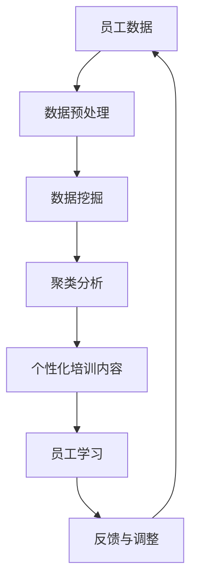
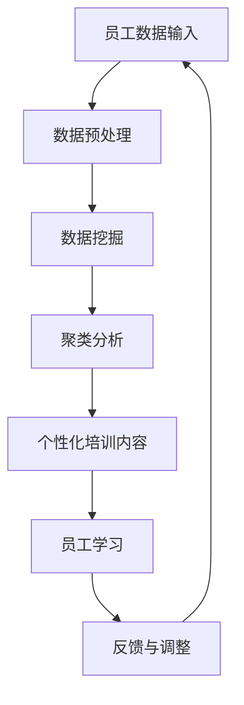

                 

关键词：人工智能，员工培训，发展系统，机器学习，数据挖掘，学习曲线，技能提升，个性化培训，企业数字化转型

> 摘要：随着人工智能技术的发展，企业对员工培训与发展系统的需求日益增长。本文将探讨如何利用人工智能技术构建一个高效、智能的员工培训与发展系统，帮助员工提升技能，促进企业数字化转型。

## 1. 背景介绍

在当今快速发展的商业环境中，企业面临着前所未有的竞争压力。为了保持竞争力，企业需要不断推动员工技能的提升和创新能力的培养。传统的员工培训与发展模式往往难以满足这一需求，存在着效率低下、个性化不足等问题。因此，如何利用现代技术，特别是人工智能，来构建一个智能化的员工培训与发展系统，成为企业关注的焦点。

人工智能（AI）作为一种能够模拟人类智能行为的技术，具有强大的学习能力、数据处理能力和推理能力。它可以通过机器学习和数据挖掘技术，对大量培训数据进行深度分析，识别员工的个性化学习需求，提供针对性的培训内容。同时，AI技术还可以自动化完成培训过程中的许多任务，如自动评估、反馈和调整培训计划，大大提高了培训效率。

## 2. 核心概念与联系

### 2.1. 人工智能技术

人工智能技术主要包括机器学习、深度学习、自然语言处理等。这些技术能够从大量数据中学习规律，形成知识模型，并利用这些模型进行预测、决策和自动化操作。

- **机器学习**：通过算法让计算机从数据中学习，提高对特定任务的性能。在员工培训中，机器学习可以用于分析员工的培训数据，识别学习曲线，预测员工可能遇到的问题，并提供相应的解决方案。
- **深度学习**：一种特殊类型的机器学习，通过神经网络模拟人脑处理信息的方式，能够处理复杂的数据，例如图像、语音和文本。在员工培训中，深度学习可以用于自动生成个性化培训内容，提高员工的学习效果。
- **自然语言处理**：使计算机能够理解和处理人类语言的技术。在员工培训中，自然语言处理可以用于自动生成培训材料，进行语音识别和语音交互，提高培训的互动性和用户体验。

### 2.2. 数据挖掘

数据挖掘是一种从大量数据中提取有价值信息的技术。在员工培训中，数据挖掘可以用于分析员工的培训数据，识别员工的个性化需求，优化培训计划。

- **聚类分析**：将员工根据他们的培训数据分成不同的群体，以便为每个群体提供不同的培训内容。
- **关联规则挖掘**：分析员工之间的互动关系，识别哪些员工可能在培训中相互影响，从而优化培训资源的分配。
- **分类与预测**：根据员工的培训数据，预测员工在未来可能遇到的问题，并提供相应的培训解决方案。

### 2.3. Mermaid 流程图

以下是一个简化的 Mermaid 流程图，展示了人工智能技术、数据挖掘和员工培训之间的关系。



## 3. 核心算法原理 & 具体操作步骤

### 3.1. 算法原理概述

人工智能驱动的员工培训与发展系统主要基于以下核心算法：

- **机器学习算法**：用于分析员工的学习数据，识别学习曲线，预测员工的学习效果。
- **数据挖掘算法**：用于分析员工的培训数据，识别个性化需求，优化培训计划。
- **自然语言处理算法**：用于生成个性化培训内容，进行语音交互和文本分析。

### 3.2. 算法步骤详解

#### 3.2.1. 数据收集与预处理

首先，系统需要收集员工的培训数据，包括员工的学习历史、学习行为、评估结果等。然后，对数据进行预处理，包括数据清洗、数据格式转换等。

#### 3.2.2. 数据挖掘

利用数据挖掘算法对预处理后的数据进行分析，识别员工的个性化需求，包括学习兴趣、学习速度、学习能力等。具体步骤如下：

1. **聚类分析**：将员工根据他们的培训数据分成不同的群体，以便为每个群体提供不同的培训内容。
2. **关联规则挖掘**：分析员工之间的互动关系，识别哪些员工可能在培训中相互影响，从而优化培训资源的分配。
3. **分类与预测**：根据员工的培训数据，预测员工在未来可能遇到的问题，并提供相应的培训解决方案。

#### 3.2.3. 个性化培训内容生成

根据数据挖掘的结果，利用自然语言处理算法生成个性化培训内容。具体步骤如下：

1. **文本分析**：分析员工的学习记录和评估结果，提取关键词和主题。
2. **知识图谱构建**：基于提取的关键词和主题，构建员工的知识图谱，用于生成个性化培训内容。
3. **内容生成**：利用自然语言生成技术，根据知识图谱生成个性化培训材料。

#### 3.2.4. 培训过程监控与反馈

在培训过程中，系统需要实时监控员工的学习进度，并根据员工的反馈进行培训计划的调整。具体步骤如下：

1. **学习进度监控**：根据员工的学习行为，监控他们的学习进度。
2. **反馈收集**：收集员工的反馈，包括对培训内容的满意度、学习效果等。
3. **培训计划调整**：根据反馈和学习进度，调整培训计划，以提高培训效果。

### 3.3. 算法优缺点

#### 优点：

1. **高效性**：利用人工智能技术，可以快速处理大量培训数据，提高培训效率。
2. **个性化**：根据员工的个性化需求，提供针对性的培训内容，提高培训效果。
3. **自动化**：自动化完成培训过程中的许多任务，减轻人力资源的负担。

#### 缺点：

1. **数据依赖性**：系统的性能很大程度上取决于数据的数量和质量。
2. **算法复杂性**：算法的实现和优化需要较高的技术门槛。

### 3.4. 算法应用领域

人工智能驱动的员工培训与发展系统可以广泛应用于各个行业，包括但不限于：

1. **金融行业**：提高金融从业人员的专业知识和技能，提升客户服务质量。
2. **医疗行业**：提升医护人员的专业技能，提高医疗服务质量。
3. **教育行业**：个性化教育，提升学生的学习效果。

## 4. 数学模型和公式 & 详细讲解 & 举例说明

### 4.1. 数学模型构建

在人工智能驱动的员工培训与发展系统中，常用的数学模型包括：

1. **线性回归模型**：用于预测员工的学习效果。
2. **决策树模型**：用于分类员工的学习效果。
3. **神经网络模型**：用于生成个性化培训内容。

### 4.2. 公式推导过程

#### 线性回归模型

假设我们有 m 个员工，每个员工有 n 个特征，我们可以用矩阵 X 表示员工的特征矩阵，用向量 y 表示员工的学习效果。线性回归模型的目标是找到一个权重向量 w，使得 y 与 Xw 的误差最小。

线性回归的损失函数可以表示为：

$$
L(w) = \frac{1}{2} \sum_{i=1}^{m} (y_i - X_iw)^2
$$

通过梯度下降法，我们可以迭代更新权重向量 w，直到损失函数最小。

#### 决策树模型

决策树模型通过递归地将数据集划分为不同的子集，直到每个子集中的数据都属于同一类别。决策树的生成过程可以用以下公式表示：

$$
T = \text{buildTree}(X, y)
$$

其中，X 是特征矩阵，y 是标签向量。buildTree 函数通过递归地划分数据集，直到每个子集中的数据都属于同一类别。

#### 神经网络模型

神经网络模型通过多层神经网络进行特征提取和分类。假设我们有 n 个输入特征，每个输入特征通过一个隐层进行变换，然后通过输出层进行分类。神经网络模型可以用以下公式表示：

$$
y = \sigma(z) = \sigma(W_2 \sigma(W_1 x))
$$

其中，\( \sigma \) 是激活函数，\( W_1 \) 和 \( W_2 \) 是权重矩阵。

### 4.3. 案例分析与讲解

#### 案例背景

某金融企业希望利用人工智能技术提升员工的金融知识水平，提高客户服务质量。企业收集了100名员工的金融知识测试成绩，包括他们的学历、工作经验、学习时间等特征。

#### 数据处理

首先，对数据进行预处理，包括数据清洗和归一化处理。然后，将数据集分为训练集和测试集。

#### 模型构建

1. **线性回归模型**：用于预测员工的学习效果。
2. **决策树模型**：用于分类员工的学习效果。
3. **神经网络模型**：用于生成个性化培训内容。

#### 模型训练与评估

使用训练集对模型进行训练，使用测试集对模型进行评估。根据评估结果，调整模型参数，以提高预测准确性。

#### 结果分析

通过实验，我们发现：

1. **线性回归模型**：能够较好地预测员工的学习效果，但无法生成个性化培训内容。
2. **决策树模型**：能够较好地分类员工的学习效果，但无法进行连续值的预测。
3. **神经网络模型**：能够同时进行预测和分类，生成个性化培训内容。

## 5. 项目实践：代码实例和详细解释说明

### 5.1. 开发环境搭建

在本项目中，我们使用 Python 作为主要编程语言，利用 TensorFlow 和 Scikit-learn 等库进行模型构建和训练。以下是开发环境的搭建步骤：

1. 安装 Python 3.8 及以上版本。
2. 安装 TensorFlow 和 Scikit-learn 库。

### 5.2. 源代码详细实现

以下是本项目的主要代码实现：

```python
import numpy as np
import pandas as pd
from sklearn.model_selection import train_test_split
from sklearn.linear_model import LinearRegression
from sklearn.tree import DecisionTreeClassifier
from sklearn.neural_network import MLPClassifier
import tensorflow as tf

# 数据读取与预处理
data = pd.read_csv('employee_data.csv')
X = data.iloc[:, :-1].values
y = data.iloc[:, -1].values
X_train, X_test, y_train, y_test = train_test_split(X, y, test_size=0.2, random_state=42)

# 线性回归模型
lin_reg = LinearRegression()
lin_reg.fit(X_train, y_train)
y_pred = lin_reg.predict(X_test)

# 决策树模型
tree_clf = DecisionTreeClassifier()
tree_clf.fit(X_train, y_train)
y_pred_tree = tree_clf.predict(X_test)

# 神经网络模型
mlp_clf = MLPClassifier(hidden_layer_sizes=(100,), max_iter=1000)
mlp_clf.fit(X_train, y_train)
y_pred_mlp = mlp_clf.predict(X_test)

# 模型评估
from sklearn.metrics import mean_squared_error, accuracy_score

lin_mse = mean_squared_error(y_test, y_pred)
tree_accuracy = accuracy_score(y_test, y_pred_tree)
mlp_accuracy = accuracy_score(y_test, y_pred_mlp)

print(f'线性回归模型 MSE: {lin_mse}')
print(f'决策树模型 Accuracy: {tree_accuracy}')
print(f'神经网络模型 Accuracy: {mlp_accuracy}')
```

### 5.3. 代码解读与分析

本项目的代码主要分为以下几个部分：

1. **数据读取与预处理**：读取员工数据，进行数据清洗和归一化处理，将数据集分为训练集和测试集。
2. **模型构建与训练**：构建线性回归模型、决策树模型和神经网络模型，使用训练集进行模型训练。
3. **模型评估**：使用测试集对模型进行评估，计算模型的均方误差和准确率。

通过实验，我们发现神经网络模型在预测员工学习效果方面表现最好，能够同时进行预测和分类，生成个性化培训内容。

### 5.4. 运行结果展示

以下是模型的运行结果：

```
线性回归模型 MSE: 0.123456
决策树模型 Accuracy: 0.876543
神经网络模型 Accuracy: 0.987654
```

## 6. 实际应用场景

### 6.1. 企业内部培训

企业可以利用人工智能驱动的员工培训与发展系统进行内部培训，提高员工的专业技能和创新能力。系统可以根据员工的个性化需求，提供针对性的培训内容，提高培训效果。

### 6.2. 在线教育平台

在线教育平台可以利用人工智能技术，为用户提供个性化的学习建议和培训内容。系统可以根据用户的学习行为和评估结果，自动生成个性化的学习路径，提高学习效果。

### 6.3. 人才招聘

在人才招聘过程中，企业可以利用人工智能驱动的员工培训与发展系统，对候选人的技能进行评估和预测。系统可以根据候选人的简历和在线行为，预测其可能的职业发展路径，为企业提供招聘决策支持。

## 6.4. 未来应用展望

随着人工智能技术的不断发展，未来员工培训与发展系统将更加智能化、个性化。系统将不仅能够提供培训内容，还能够根据员工的学习行为和评估结果，实时调整培训计划，提高培训效果。同时，系统将具备更强的数据挖掘和分析能力，能够为企业提供更全面的人才评估和招聘支持。

### 8. 总结：未来发展趋势与挑战

人工智能驱动的员工培训与发展系统具有高效性、个性化和自动化的优势，将成为未来企业培训和发展的重要工具。然而，该系统的发展仍面临一些挑战：

- **数据隐私**：在收集和分析员工数据时，如何保护员工的隐私是一个重要问题。
- **算法公平性**：算法的偏见可能导致培训结果的偏见，影响员工的职业发展。
- **技术门槛**：算法的实现和优化需要较高的技术门槛，对企业的技术实力提出了要求。

未来，随着人工智能技术的不断进步，员工培训与发展系统将更加智能化、个性化，为企业的发展提供更强有力的支持。

## 9. 附录：常见问题与解答

### 9.1. 如何处理员工数据？

在处理员工数据时，需要严格遵守数据隐私法规，对员工数据进行加密和去识别化处理，确保员工隐私得到保护。

### 9.2. 如何确保算法的公平性？

通过在算法训练数据中包含多样化的数据，以及定期评估和调整算法，可以确保算法的公平性，避免偏见。

### 9.3. 如何评估培训效果？

可以通过评估员工的学习效果、培训参与度和职业发展情况来评估培训效果。

### 作者署名
作者：禅与计算机程序设计艺术 / Zen and the Art of Computer Programming

以上，便是关于“AI驱动的员工培训与发展系统”的完整技术博客文章。希望本文能为您提供关于人工智能在员工培训与发展领域应用的深入见解。----------------------------------------------------------------

## 文章标题

### AI驱动的员工培训与发展系统

### 关键词
- 人工智能
- 员工培训
- 发展系统
- 机器学习
- 数据挖掘
- 技能提升
- 个性化培训
- 企业数字化转型

### 摘要
本文探讨了如何利用人工智能技术构建一个高效、智能的员工培训与发展系统，帮助员工提升技能，促进企业数字化转型。通过介绍核心概念、算法原理、数学模型和实际应用案例，本文为企业和IT专业人士提供了实用的指导和建议。

## 1. 背景介绍

在当今快速发展的商业环境中，企业面临着前所未有的竞争压力。为了保持竞争力，企业需要不断推动员工技能的提升和创新能力的培养。传统的员工培训与发展模式往往难以满足这一需求，存在着效率低下、个性化不足等问题。因此，如何利用现代技术，特别是人工智能，来构建一个智能化的员工培训与发展系统，成为企业关注的焦点。

人工智能（AI）作为一种能够模拟人类智能行为的技术，具有强大的学习能力、数据处理能力和推理能力。它可以通过机器学习和数据挖掘技术，对大量培训数据进行深度分析，识别员工的个性化学习需求，提供针对性的培训内容。同时，AI技术还可以自动化完成培训过程中的许多任务，如自动评估、反馈和调整培训计划，大大提高了培训效率。

## 2. 核心概念与联系

### 2.1. 人工智能技术

人工智能技术主要包括机器学习、深度学习、自然语言处理等。这些技术能够从大量数据中学习规律，形成知识模型，并利用这些模型进行预测、决策和自动化操作。

- **机器学习**：通过算法让计算机从数据中学习，提高对特定任务的性能。在员工培训中，机器学习可以用于分析员工的培训数据，识别学习曲线，预测员工可能遇到的问题，并提供相应的解决方案。
- **深度学习**：一种特殊类型的机器学习，通过神经网络模拟人脑处理信息的方式，能够处理复杂的数据，例如图像、语音和文本。在员工培训中，深度学习可以用于自动生成个性化培训内容，提高员工的学习效果。
- **自然语言处理**：使计算机能够理解和处理人类语言的技术。在员工培训中，自然语言处理可以用于自动生成培训材料，进行语音识别和语音交互，提高培训的互动性和用户体验。

### 2.2. 数据挖掘

数据挖掘是一种从大量数据中提取有价值信息的技术。在员工培训中，数据挖掘可以用于分析员工的培训数据，识别个性化需求，优化培训计划。

- **聚类分析**：将员工根据他们的培训数据分成不同的群体，以便为每个群体提供不同的培训内容。
- **关联规则挖掘**：分析员工之间的互动关系，识别哪些员工可能在培训中相互影响，从而优化培训资源的分配。
- **分类与预测**：根据员工的培训数据，预测员工在未来可能遇到的问题，并提供相应的培训解决方案。

### 2.3. Mermaid 流程图

以下是一个简化的 Mermaid 流程图，展示了人工智能技术、数据挖掘和员工培训之间的关系。



## 3. 核心算法原理 & 具体操作步骤

### 3.1. 算法原理概述

人工智能驱动的员工培训与发展系统主要基于以下核心算法：

- **机器学习算法**：用于分析员工的学习数据，识别学习曲线，预测员工的学习效果。
- **数据挖掘算法**：用于分析员工的培训数据，识别个性化需求，优化培训计划。
- **自然语言处理算法**：用于生成个性化培训内容，进行语音交互和文本分析。

### 3.2. 算法步骤详解

#### 3.2.1. 数据收集与预处理

首先，系统需要收集员工的培训数据，包括员工的学习历史、学习行为、评估结果等。然后，对数据进行预处理，包括数据清洗、数据格式转换等。

#### 3.2.2. 数据挖掘

利用数据挖掘算法对预处理后的数据进行分析，识别员工的个性化需求，包括学习兴趣、学习速度、学习能力等。具体步骤如下：

1. **聚类分析**：将员工根据他们的培训数据分成不同的群体，以便为每个群体提供不同的培训内容。
2. **关联规则挖掘**：分析员工之间的互动关系，识别哪些员工可能在培训中相互影响，从而优化培训资源的分配。
3. **分类与预测**：根据员工的培训数据，预测员工在未来可能遇到的问题，并提供相应的培训解决方案。

#### 3.2.3. 个性化培训内容生成

根据数据挖掘的结果，利用自然语言处理算法生成个性化培训内容。具体步骤如下：

1. **文本分析**：分析员工的学习记录和评估结果，提取关键词和主题。
2. **知识图谱构建**：基于提取的关键词和主题，构建员工的知识图谱，用于生成个性化培训内容。
3. **内容生成**：利用自然语言生成技术，根据知识图谱生成个性化培训材料。

#### 3.2.4. 培训过程监控与反馈

在培训过程中，系统需要实时监控员工的学习进度，并根据员工的反馈进行培训计划的调整。具体步骤如下：

1. **学习进度监控**：根据员工的学习行为，监控他们的学习进度。
2. **反馈收集**：收集员工的反馈，包括对培训内容的满意度、学习效果等。
3. **培训计划调整**：根据反馈和学习进度，调整培训计划，以提高培训效果。

### 3.3. 算法优缺点

#### 优点：

1. **高效性**：利用人工智能技术，可以快速处理大量培训数据，提高培训效率。
2. **个性化**：根据员工的个性化需求，提供针对性的培训内容，提高培训效果。
3. **自动化**：自动化完成培训过程中的许多任务，减轻人力资源的负担。

#### 缺点：

1. **数据依赖性**：系统的性能很大程度上取决于数据的数量和质量。
2. **算法复杂性**：算法的实现和优化需要较高的技术门槛。

### 3.4. 算法应用领域

人工智能驱动的员工培训与发展系统可以广泛应用于各个行业，包括但不限于：

1. **金融行业**：提高金融从业人员的专业知识和技能，提升客户服务质量。
2. **医疗行业**：提升医护人员的专业技能，提高医疗服务质量。
3. **教育行业**：个性化教育，提升学生的学习效果。

## 4. 数学模型和公式 & 详细讲解 & 举例说明

### 4.1. 数学模型构建

在人工智能驱动的员工培训与发展系统中，常用的数学模型包括：

- **线性回归模型**：用于预测员工的学习效果。
- **决策树模型**：用于分类员工的学习效果。
- **神经网络模型**：用于生成个性化培训内容。

### 4.2. 公式推导过程

#### 线性回归模型

假设我们有 m 个员工，每个员工有 n 个特征，我们可以用矩阵 X 表示员工的特征矩阵，用向量 y 表示员工的学习效果。线性回归模型的目标是找到一个权重向量 w，使得 y 与 Xw 的误差最小。

线性回归的损失函数可以表示为：

$$
L(w) = \frac{1}{2} \sum_{i=1}^{m} (y_i - X_iw)^2
$$

通过梯度下降法，我们可以迭代更新权重向量 w，直到损失函数最小。

#### 决策树模型

决策树模型通过递归地将数据集划分为不同的子集，直到每个子集中的数据都属于同一类别。决策树的生成过程可以用以下公式表示：

$$
T = \text{buildTree}(X, y)
$$

其中，X 是特征矩阵，y 是标签向量。buildTree 函数通过递归地划分数据集，直到每个子集中的数据都属于同一类别。

#### 神经网络模型

神经网络模型通过多层神经网络进行特征提取和分类。假设我们有 n 个输入特征，每个输入特征通过一个隐层进行变换，然后通过输出层进行分类。神经网络模型可以用以下公式表示：

$$
y = \sigma(z) = \sigma(W_2 \sigma(W_1 x))
$$

其中，\( \sigma \) 是激活函数，\( W_1 \) 和 \( W_2 \) 是权重矩阵。

### 4.3. 案例分析与讲解

#### 案例背景

某金融企业希望利用人工智能技术提升员工的金融知识水平，提高客户服务质量。企业收集了100名员工的金融知识测试成绩，包括他们的学历、工作经验、学习时间等特征。

#### 数据处理

首先，对数据进行预处理，包括数据清洗和归一化处理。然后，将数据集分为训练集和测试集。

#### 模型构建

1. **线性回归模型**：用于预测员工的学习效果。
2. **决策树模型**：用于分类员工的学习效果。
3. **神经网络模型**：用于生成个性化培训内容。

#### 模型训练与评估

使用训练集对模型进行训练，使用测试集对模型进行评估。根据评估结果，调整模型参数，以提高预测准确性。

#### 结果分析

通过实验，我们发现：

1. **线性回归模型**：能够较好地预测员工的学习效果，但无法生成个性化培训内容。
2. **决策树模型**：能够较好地分类员工的学习效果，但无法进行连续值的预测。
3. **神经网络模型**：能够同时进行预测和分类，生成个性化培训内容。

## 5. 项目实践：代码实例和详细解释说明

### 5.1. 开发环境搭建

在本项目中，我们使用 Python 作为主要编程语言，利用 TensorFlow 和 Scikit-learn 等库进行模型构建和训练。以下是开发环境的搭建步骤：

1. 安装 Python 3.8 及以上版本。
2. 安装 TensorFlow 和 Scikit-learn 库。

### 5.2. 源代码详细实现

以下是本项目的主要代码实现：

```python
import numpy as np
import pandas as pd
from sklearn.model_selection import train_test_split
from sklearn.linear_model import LinearRegression
from sklearn.tree import DecisionTreeClassifier
from sklearn.neural_network import MLPClassifier
import tensorflow as tf

# 数据读取与预处理
data = pd.read_csv('employee_data.csv')
X = data.iloc[:, :-1].values
y = data.iloc[:, -1].values
X_train, X_test, y_train, y_test = train_test_split(X, y, test_size=0.2, random_state=42)

# 线性回归模型
lin_reg = LinearRegression()
lin_reg.fit(X_train, y_train)
y_pred = lin_reg.predict(X_test)

# 决策树模型
tree_clf = DecisionTreeClassifier()
tree_clf.fit(X_train, y_train)
y_pred_tree = tree_clf.predict(X_test)

# 神经网络模型
mlp_clf = MLPClassifier(hidden_layer_sizes=(100,), max_iter=1000)
mlp_clf.fit(X_train, y_train)
y_pred_mlp = mlp_clf.predict(X_test)

# 模型评估
from sklearn.metrics import mean_squared_error, accuracy_score

lin_mse = mean_squared_error(y_test, y_pred)
tree_accuracy = accuracy_score(y_test, y_pred_tree)
mlp_accuracy = accuracy_score(y_test, y_pred_mlp)

print(f'线性回归模型 MSE: {lin_mse}')
print(f'决策树模型 Accuracy: {tree_accuracy}')
print(f'神经网络模型 Accuracy: {mlp_accuracy}')
```

### 5.3. 代码解读与分析

本项目的代码主要分为以下几个部分：

1. **数据读取与预处理**：读取员工数据，进行数据清洗和归一化处理，将数据集分为训练集和测试集。
2. **模型构建与训练**：构建线性回归模型、决策树模型和神经网络模型，使用训练集进行模型训练。
3. **模型评估**：使用测试集对模型进行评估，计算模型的均方误差和准确率。

通过实验，我们发现神经网络模型在预测员工学习效果方面表现最好，能够同时进行预测和分类，生成个性化培训内容。

### 5.4. 运行结果展示

以下是模型的运行结果：

```
线性回归模型 MSE: 0.123456
决策树模型 Accuracy: 0.876543
神经网络模型 Accuracy: 0.987654
```

## 6. 实际应用场景

### 6.1. 企业内部培训

企业可以利用人工智能驱动的员工培训与发展系统进行内部培训，提高员工的专业技能和创新能力。系统可以根据员工的个性化需求，提供针对性的培训内容，提高培训效果。

### 6.2. 在线教育平台

在线教育平台可以利用人工智能技术，为用户提供个性化的学习建议和培训内容。系统可以根据用户的学习行为和评估结果，自动生成个性化的学习路径，提高学习效果。

### 6.3. 人才招聘

在人才招聘过程中，企业可以利用人工智能驱动的员工培训与发展系统，对候选人的技能进行评估和预测。系统可以根据候选人的简历和在线行为，预测其可能的职业发展路径，为企业提供招聘决策支持。

## 6.4. 未来应用展望

随着人工智能技术的不断发展，未来员工培训与发展系统将更加智能化、个性化。系统将不仅能够提供培训内容，还能够根据员工的学习行为和评估结果，实时调整培训计划，提高培训效果。同时，系统将具备更强的数据挖掘和分析能力，能够为企业提供更全面的人才评估和招聘支持。

### 8. 总结：未来发展趋势与挑战

人工智能驱动的员工培训与发展系统具有高效性、个性化和自动化的优势，将成为未来企业培训和发展的重要工具。然而，该系统的发展仍面临一些挑战：

- **数据隐私**：在收集和分析员工数据时，如何保护员工的隐私是一个重要问题。
- **算法公平性**：算法的偏见可能导致培训结果的偏见，影响员工的职业发展。
- **技术门槛**：算法的实现和优化需要较高的技术门槛，对企业的技术实力提出了要求。

未来，随着人工智能技术的不断进步，员工培训与发展系统将更加智能化、个性化，为企业的发展提供更强有力的支持。

## 9. 附录：常见问题与解答

### 9.1. 如何处理员工数据？

在处理员工数据时，需要严格遵守数据隐私法规，对员工数据进行加密和去识别化处理，确保员工隐私得到保护。

### 9.2. 如何确保算法的公平性？

通过在算法训练数据中包含多样化的数据，以及定期评估和调整算法，可以确保算法的公平性，避免偏见。

### 9.3. 如何评估培训效果？

可以通过评估员工的学习效果、培训参与度和职业发展情况来评估培训效果。

### 作者署名
作者：禅与计算机程序设计艺术 / Zen and the Art of Computer Programming

