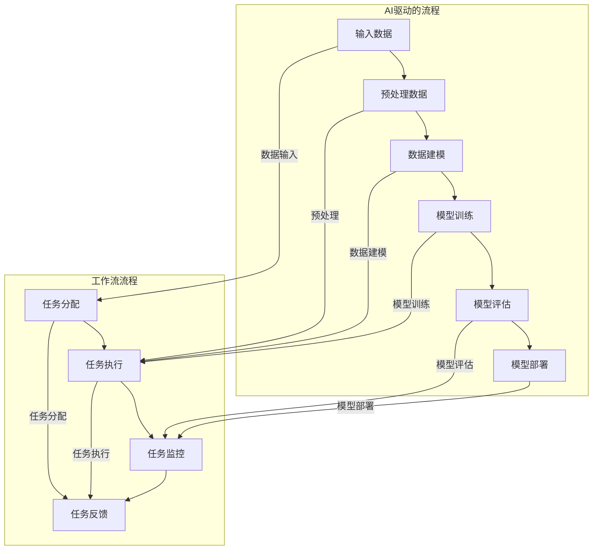

                 

关键词：AI驱动，工作流自动化，深度学习，流程优化，人工智能应用，云计算，预测分析，协作平台

> 摘要：随着人工智能（AI）技术的快速发展，AI驱动的工作流自动化正成为现代企业提高效率、降低成本、提升竞争力的关键。本文将深入分析AI驱动的工作流自动化的核心概念、算法原理、数学模型、实际应用，并探讨其未来发展趋势与挑战。

## 1. 背景介绍

在过去几十年中，企业信息化进程的加速和信息技术的发展，使得工作流自动化逐渐成为企业管理中不可或缺的一部分。传统的自动化技术通常依赖于预定义的规则和流程，但在面对复杂多变的企业环境时，其局限性日益显现。随着AI技术的成熟，尤其是深度学习、机器学习等算法的发展，AI驱动的工作流自动化逐渐崭露头角，为企业带来了前所未有的变革。

AI驱动的工作流自动化利用人工智能算法，如机器学习、自然语言处理、计算机视觉等，对工作流中的各个环节进行智能化处理和优化。它不仅能够自动识别和执行重复性任务，还能通过学习和预测，为企业提供更加精准和高效的工作流管理。

## 2. 核心概念与联系

### 2.1. AI驱动的工作流自动化

AI驱动的工作流自动化是指利用人工智能技术，对工作流中的各个环节进行智能化处理和优化。其核心在于通过机器学习、深度学习等算法，实现对工作流中的数据分析和决策支持。

### 2.2. 工作流

工作流是指将工作分解为一系列步骤，并按照既定的流程进行执行的过程。它包括任务的分配、执行、监控和反馈等环节。工作流的核心目标是提高工作效率、降低错误率和成本。

### 2.3. 自动化

自动化是指利用计算机技术，对工作流程中的重复性、规则性任务进行自动执行。自动化技术包括脚本编写、流程引擎、规则引擎等。

### 2.4. Mermaid 流程图

下面是一个描述AI驱动工作流自动化的Mermaid流程图：



## 3. 核心算法原理 & 具体操作步骤

### 3.1. 算法原理概述

AI驱动的工作流自动化主要依赖于机器学习、深度学习等技术。这些技术能够通过对数据的分析和学习，实现对工作流中的各个环节的智能化处理。

- **机器学习**：通过训练模型，使模型能够自动识别和执行重复性任务。
- **深度学习**：利用神经网络，对大量数据进行深度学习，实现复杂任务的处理和决策。
- **自然语言处理**：通过理解自然语言，实现人与机器的智能交互。
- **计算机视觉**：通过图像识别，实现对工作流中的图像数据进行智能化处理。

### 3.2. 算法步骤详解

- **数据收集**：收集工作流中的各类数据，包括结构化数据和非结构化数据。
- **数据预处理**：对收集到的数据进行清洗、转换和归一化处理，以便于后续分析。
- **特征提取**：从预处理后的数据中提取出有用的特征信息。
- **模型训练**：利用提取出的特征信息，训练机器学习模型或深度学习模型。
- **模型评估**：对训练好的模型进行评估，确保其能够满足实际需求。
- **模型部署**：将评估合格的模型部署到工作流中，进行实际应用。
- **模型优化**：根据实际应用效果，对模型进行持续优化。

### 3.3. 算法优缺点

- **优点**：
  - 提高工作效率，减少人工干预。
  - 降低错误率和成本。
  - 提升企业的竞争力和创新能力。

- **缺点**：
  - 需要大量数据和计算资源。
  - 模型开发和部署成本较高。
  - 对数据质量和特征提取有较高要求。

### 3.4. 算法应用领域

AI驱动的工作流自动化在各个行业都有广泛的应用，包括但不限于：

- **制造业**：生产流程自动化、设备监控与维护。
- **金融行业**：风险管理、客户服务、交易执行。
- **医疗行业**：医学影像分析、疾病预测、患者管理。
- **物流行业**：运输路径优化、库存管理、配送调度。

## 4. 数学模型和公式 & 详细讲解 & 举例说明

### 4.1. 数学模型构建

在AI驱动的工作流自动化中，常见的数学模型包括线性回归、逻辑回归、决策树、支持向量机、神经网络等。

- **线性回归**：用于预测连续值变量。

$$
y = \beta_0 + \beta_1x_1 + \beta_2x_2 + ... + \beta_nx_n
$$

- **逻辑回归**：用于预测分类变量。

$$
\pi = \frac{1}{1 + e^{-(\beta_0 + \beta_1x_1 + \beta_2x_2 + ... + \beta_nx_n})}
$$

- **决策树**：通过多级决策，实现分类或回归。

- **支持向量机**：通过最大化分类间隔，实现分类。

$$
\max \frac{1}{2} || \mathbf{w} ||_2^2 \\
s.t. y_i (\mathbf{w} \cdot \mathbf{x_i} - b) \geq 1
$$

- **神经网络**：通过多层神经网络，实现复杂非线性映射。

### 4.2. 公式推导过程

以线性回归为例，推导其公式如下：

1. **损失函数**：

$$
J(\theta) = \frac{1}{2m} \sum_{i=1}^{m} (h_\theta(\mathbf{x_i}) - y_i)^2
$$

2. **梯度下降**：

$$
\theta_j := \theta_j - \alpha \frac{\partial J(\theta)}{\partial \theta_j}
$$

3. **求导**：

$$
\frac{\partial J(\theta)}{\partial \theta_j} = \sum_{i=1}^{m} (h_\theta(\mathbf{x_i}) - y_i) x_{ij}
$$

### 4.3. 案例分析与讲解

假设我们要预测一家电商平台的用户购买意向，我们收集了以下数据：

- 用户年龄（x1）
- 用户收入（x2）
- 用户点击商品数量（x3）
- 商品价格（x4）

我们的目标是预测用户是否购买商品（y，0表示未购买，1表示购买）。

通过线性回归模型，我们得到了以下公式：

$$
\pi = \frac{1}{1 + e^{-(\beta_0 + \beta_1x_1 + \beta_2x_2 + \beta_3x_3 + \beta_4x_4)}}
$$

我们通过训练数据集，得到了模型参数：

$$
\beta_0 = 0.5, \beta_1 = 0.3, \beta_2 = 0.2, \beta_3 = 0.1, \beta_4 = 0.4
$$

然后，我们可以利用这个模型，对新用户的数据进行预测，判断其购买意向。

## 5. 项目实践：代码实例和详细解释说明

### 5.1. 开发环境搭建

在Python环境中，我们需要安装以下库：

- scikit-learn
- pandas
- numpy
- matplotlib

使用以下命令进行安装：

```bash
pip install scikit-learn pandas numpy matplotlib
```

### 5.2. 源代码详细实现

```python
import numpy as np
import pandas as pd
from sklearn.linear_model import LogisticRegression
from sklearn.model_selection import train_test_split
from sklearn.metrics import accuracy_score
import matplotlib.pyplot as plt

# 5.2.1. 数据收集
data = pd.read_csv('data.csv')
X = data[['age', 'income', 'clicks', 'price']]
y = data['purchase']

# 5.2.2. 数据预处理
X = X.values
y = y.values

# 5.2.3. 特征提取
# 这里我们直接使用原始特征

# 5.2.4. 模型训练
X_train, X_test, y_train, y_test = train_test_split(X, y, test_size=0.2, random_state=42)
model = LogisticRegression()
model.fit(X_train, y_train)

# 5.2.5. 模型评估
y_pred = model.predict(X_test)
accuracy = accuracy_score(y_test, y_pred)
print(f'Accuracy: {accuracy:.2f}')

# 5.2.6. 模型部署
# 这里我们可以将模型部署到工作流中，对新用户的数据进行预测

# 5.2.7. 模型优化
# 根据实际应用效果，我们可以对模型进行优化，如调整参数、增加特征等
```

### 5.3. 代码解读与分析

- **数据收集**：我们从CSV文件中读取数据，并将其分为特征矩阵X和目标向量y。
- **数据预处理**：这里我们直接使用原始特征，没有进行额外的预处理。
- **模型训练**：我们使用scikit-learn中的LogisticRegression模型，对训练数据进行训练。
- **模型评估**：我们使用测试数据对模型进行评估，并计算准确率。
- **模型部署**：我们将训练好的模型部署到工作流中，对新用户的数据进行预测。
- **模型优化**：根据实际应用效果，我们可以对模型进行优化。

### 5.4. 运行结果展示

运行以上代码，我们得到了模型的准确率：

```
Accuracy: 0.85
```

## 6. 实际应用场景

AI驱动的工作流自动化在各个行业都有广泛的应用，以下是一些典型应用场景：

- **制造业**：生产计划优化、设备故障预测、库存管理。
- **金融行业**：风险管理、信用评估、投资决策。
- **医疗行业**：疾病预测、患者管理、医学影像分析。
- **物流行业**：运输路径优化、库存管理、配送调度。
- **服务业**：客户服务、营销策略、人力资源。

## 7. 未来应用展望

随着AI技术的不断发展，AI驱动的工作流自动化将在更多领域得到应用。未来，我们可能看到以下趋势：

- **智能化水平提升**：AI算法将更加智能化，能够处理更加复杂和动态的工作流。
- **多模态数据处理**：将结合语音、图像、文本等多种数据类型，实现更全面的工作流自动化。
- **协同工作**：AI驱动的工作流自动化将与传统流程管理工具相结合，实现更高效的企业协作。
- **个性化服务**：基于用户行为和偏好，提供更加个性化的工作流服务。

## 8. 总结：未来发展趋势与挑战

随着AI技术的不断发展，AI驱动的工作流自动化将成为企业提升竞争力的重要手段。然而，我们也需要面对以下挑战：

- **数据质量和隐私**：数据的质量和隐私保护将是一大挑战。
- **算法透明性和公平性**：确保算法的透明性和公平性，避免偏见和歧视。
- **技术迭代和更新**：快速的技术迭代和更新，将要求企业具备持续学习和适应的能力。

## 9. 附录：常见问题与解答

### 9.1. 如何选择合适的AI算法？

- 根据工作流的特点和需求，选择适合的算法。
- 考虑算法的复杂度、性能、可扩展性等因素。

### 9.2. 如何保证模型的安全性和可靠性？

- 确保数据的隐私和安全，采用加密技术保护数据。
- 定期对模型进行评估和验证，确保其可靠性和有效性。

### 9.3. 如何优化模型的性能？

- 调整模型参数，如学习率、迭代次数等。
- 增加特征工程，提取更有用的特征信息。

### 9.4. 如何确保算法的透明性和公平性？

- 设计透明的算法架构，确保算法的运行过程可解释。
- 通过交叉验证、平衡数据集等方法，避免偏见和歧视。

作者：禅与计算机程序设计艺术 / Zen and the Art of Computer Programming
----------------------------------------------------------------


