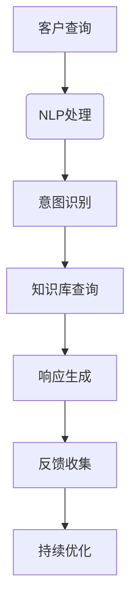

                 

  
关键词：人工智能、客户服务、系统设计、智能客服、NLP、机器学习、大数据分析

> 摘要：本文将深入探讨AI驱动的智能客户服务系统设计，分析其核心概念、算法原理、数学模型、项目实践和实际应用场景。通过全面的分析，旨在为读者提供关于如何构建高效、智能的客户服务系统的深入见解。

## 1. 背景介绍

在当今全球化的商业环境中，客户服务成为企业成功的关键因素。随着互联网的普及和社交媒体的兴起，客户对即时和高质量的客户服务需求日益增长。传统的人工客户服务模式已经难以满足这种需求，这促使企业开始探索和应用人工智能（AI）技术，以提升客户服务效率和满意度。

智能客户服务系统利用人工智能技术，特别是自然语言处理（NLP）和机器学习（ML），可以自动化处理大量客户查询，提供24/7全天候服务，并实现个性化客户体验。这种系统不仅能够减少人力成本，还能提高响应速度和准确性，从而为企业带来显著的业务价值。

本文将围绕AI驱动的智能客户服务系统设计展开讨论，从核心概念、算法原理、数学模型到实际应用场景，全面解析其设计、实现和部署过程。

## 2. 核心概念与联系

在构建智能客户服务系统之前，我们需要明确几个核心概念，它们是系统架构的基础。

### 2.1. 自然语言处理（NLP）

NLP是人工智能的一个分支，旨在使计算机理解和解释人类语言。在智能客户服务系统中，NLP技术用于理解和处理客户输入的自然语言查询。

#### 2.1.1. 语言模型

语言模型是NLP的核心组成部分，它用于预测一个单词序列的概率。在智能客户服务系统中，语言模型可以帮助系统理解客户的意图和需求。

#### 2.1.2. 词嵌入

词嵌入是将单词转换为向量表示的过程，它使得计算机能够处理和理解单词之间的关系。在NLP任务中，词嵌入有助于提高模型的准确性和效率。

### 2.2. 机器学习（ML）

ML是使计算机从数据中学习和改进性能的技术。在智能客户服务系统中，ML技术用于训练模型，以便更好地理解和响应客户查询。

#### 2.2.1. 决策树

决策树是一种常见的ML算法，它通过一系列的规则来分类或回归数据。在智能客户服务系统中，决策树可以用于分类客户查询，提供相应的响应。

#### 2.2.2. 支持向量机（SVM）

SVM是一种强大的分类算法，它通过找到一个最佳的超平面来将数据分类。在智能客户服务系统中，SVM可以用于识别和分类特定的客户问题。

### 2.3. 大数据分析

大数据分析是处理和分析大量数据以提取有价值信息的过程。在智能客户服务系统中，大数据分析用于收集和分析客户行为数据，以便提供个性化服务。

#### 2.3.1. 数据挖掘

数据挖掘是从大量数据中发现有价值模式的过程。在智能客户服务系统中，数据挖掘可以用于识别客户偏好和趋势，从而提供更个性化的服务。

#### 2.3.2. 客户细分

客户细分是将客户分为不同群体以提供针对性服务的过程。在智能客户服务系统中，客户细分可以帮助企业更好地理解客户需求，提供更有效的服务。

### 2.4. Mermaid 流程图

以下是一个简化的Mermaid流程图，展示了智能客户服务系统的核心概念和流程：



### 2.5. 核心概念联系

通过上述核心概念的介绍，我们可以看到智能客户服务系统的设计涉及到多个领域的技术。NLP用于理解客户查询，ML用于训练模型提供响应，大数据分析用于收集客户行为数据，以实现系统的持续优化。

这些核心概念相互联系，共同构成了智能客户服务系统的整体架构。理解这些概念的联系对于设计和实现一个高效的智能客户服务系统至关重要。

### 3. 核心算法原理 & 具体操作步骤

在智能客户服务系统中，算法的选择和实现直接影响系统的性能和用户体验。以下将详细介绍几个核心算法的原理和操作步骤。

#### 3.1. 算法原理概述

智能客户服务系统中的核心算法主要包括自然语言处理（NLP）、机器学习（ML）和大数据分析。以下是每个算法的简要原理概述：

##### 3.1.1. 自然语言处理（NLP）

NLP算法主要用于理解人类语言，包括文本分类、实体识别、情感分析等。其基本原理是通过语言模型和词嵌入技术将自然语言转换为计算机可以理解的形式。

##### 3.1.2. 机器学习（ML）

ML算法通过训练数据集来建立模型，从而预测新数据的标签或特征。在智能客户服务系统中，常用的ML算法包括决策树、支持向量机（SVM）和神经网络。

##### 3.1.3. 大数据分析

大数据分析算法用于处理和分析大量数据，以提取有价值的信息。常用的算法包括数据挖掘、客户细分和聚类分析。

#### 3.2. 算法步骤详解

以下将详细介绍每个算法的具体操作步骤：

##### 3.2.1. 自然语言处理（NLP）

1. **文本预处理**：对输入的文本进行清洗，包括去除停用词、标点符号和特殊字符，以及进行分词和词性标注。
2. **语言模型训练**：使用大量的文本数据训练语言模型，以预测单词序列的概率。
3. **词嵌入转换**：将预处理后的文本转换为词嵌入向量表示。
4. **意图识别**：利用词嵌入向量，通过分类算法（如朴素贝叶斯、决策树等）识别客户的意图。
5. **实体识别**：从文本中提取关键实体（如人名、地名、组织名等），为后续的响应生成提供依据。
6. **情感分析**：分析文本的情感倾向，如正面、负面或中性。

##### 3.2.2. 机器学习（ML）

1. **数据准备**：收集和整理相关的数据集，包括客户查询、响应和标签等。
2. **特征提取**：从原始数据中提取有助于分类或回归的特征。
3. **模型训练**：使用选定的ML算法（如决策树、SVM等）对数据集进行训练，建立预测模型。
4. **模型评估**：使用验证集评估模型的性能，如准确率、召回率等。
5. **模型优化**：根据评估结果对模型进行调优，以提高预测性能。
6. **模型部署**：将训练好的模型部署到生产环境中，以实现自动化响应。

##### 3.2.3. 大数据分析

1. **数据收集**：收集与企业客户服务相关的数据，包括客户交互记录、反馈和投诉等。
2. **数据预处理**：对收集到的数据进行清洗和转换，以便于后续的分析。
3. **数据挖掘**：使用数据挖掘算法（如关联规则挖掘、聚类分析等）从数据中发现有价值的信息。
4. **客户细分**：根据挖掘结果，将客户分为不同的细分群体，为个性化服务提供依据。
5. **数据分析**：对细分群体进行深入分析，以了解客户需求和行为模式。
6. **决策支持**：基于分析结果，为企业提供决策支持，如产品改进、营销策略等。

#### 3.3. 算法优缺点

以下是几种核心算法的优缺点分析：

##### 3.3.1. 自然语言处理（NLP）

**优点**：
- 能够理解自然语言，实现人与机器的对话。
- 能够处理大量的文本数据，提高工作效率。

**缺点**：
- 需要大量的训练数据和计算资源。
- 难以处理复杂、模糊或歧义的查询。

##### 3.3.2. 机器学习（ML）

**优点**：
- 能够从数据中自动学习，提高预测准确性。
- 能够处理非线性问题和复杂数据关系。

**缺点**：
- 需要大量的训练数据和计算资源。
- 可能存在过拟合和欠拟合问题。

##### 3.3.3. 大数据分析

**优点**：
- 能够处理大规模数据，发现潜在的价值信息。
- 能够支持实时分析和决策。

**缺点**：
- 需要专业的技术知识和工具。
- 数据质量和可靠性可能存在问题。

#### 3.4. 算法应用领域

以下是几种核心算法在不同应用领域的应用情况：

##### 3.4.1. 自然语言处理（NLP）

- 文本分类：用于对大量文本进行分类，如新闻分类、情感分析等。
- 问答系统：用于构建智能问答系统，实现人与机器的对话。
- 语言翻译：用于实现不同语言之间的翻译。

##### 3.4.2. 机器学习（ML）

- 风险评估：用于对客户信用风险进行评估，如贷款审批、欺诈检测等。
- 推荐系统：用于为用户推荐感兴趣的商品、服务或内容。
- 图像识别：用于对图像进行分类、识别和标注。

##### 3.4.3. 大数据分析

- 客户行为分析：用于分析客户行为，如消费习惯、偏好等，为企业提供决策支持。
- 销售预测：用于预测未来销售趋势，帮助企业制定销售策略。
- 流行病监测：用于监测和分析疫情数据，为公共卫生决策提供支持。

### 4. 数学模型和公式 & 详细讲解 & 举例说明

在智能客户服务系统中，数学模型和公式是实现算法和数据处理的核心工具。以下将详细讲解几个关键数学模型和公式，并提供实际应用案例。

#### 4.1. 数学模型构建

智能客户服务系统中的数学模型主要包括以下几类：

- **语言模型**：用于预测文本序列的概率。
- **分类模型**：用于对客户查询进行分类。
- **回归模型**：用于预测客户行为或需求。
- **聚类模型**：用于对客户进行细分。

#### 4.2. 公式推导过程

以下将分别介绍每个数学模型的推导过程：

##### 4.2.1. 语言模型

语言模型的基本公式为：

\[ P(w_1, w_2, ..., w_n) = P(w_1) \cdot P(w_2|w_1) \cdot P(w_3|w_1, w_2) \cdot ... \cdot P(w_n|w_1, w_2, ..., w_{n-1}) \]

其中，\( w_i \) 表示文本中的第 \( i \) 个单词。

推导过程：

1. **条件概率**：对于任意两个单词 \( w_i \) 和 \( w_j \)，有条件概率 \( P(w_j|w_i) \) 表示在已知 \( w_i \) 的情况下 \( w_j \) 发生的概率。
2. **贝叶斯公式**：将条件概率扩展到多个单词，使用贝叶斯公式进行推导。

##### 4.2.2. 分类模型

分类模型的基本公式为：

\[ y = f(x; \theta) \]

其中，\( y \) 表示预测标签，\( x \) 表示输入特征，\( f() \) 表示分类函数，\( \theta \) 表示模型参数。

推导过程：

1. **特征提取**：将输入数据转换为特征向量。
2. **分类函数**：使用分类算法（如逻辑回归、SVM等）定义分类函数。
3. **模型训练**：通过最小化损失函数来优化模型参数。

##### 4.2.3. 回归模型

回归模型的基本公式为：

\[ y = \beta_0 + \beta_1 \cdot x_1 + \beta_2 \cdot x_2 + ... + \beta_n \cdot x_n \]

其中，\( y \) 表示预测值，\( x_i \) 表示输入特征，\( \beta_i \) 表示模型参数。

推导过程：

1. **特征提取**：与分类模型类似，将输入数据转换为特征向量。
2. **回归函数**：使用线性回归、多项式回归等算法定义回归函数。
3. **模型训练**：通过最小化损失函数来优化模型参数。

##### 4.2.4. 聚类模型

聚类模型的基本公式为：

\[ C = \{ C_1, C_2, ..., C_k \} \]

其中，\( C \) 表示聚类结果，\( C_i \) 表示第 \( i \) 个聚类簇。

推导过程：

1. **距离度量**：选择合适的距离度量方法，如欧氏距离、曼哈顿距离等。
2. **聚类算法**：选择聚类算法（如K-Means、层次聚类等）进行聚类。
3. **聚类评估**：使用评估指标（如轮廓系数、内径等）评估聚类结果。

#### 4.3. 案例分析与讲解

以下将结合实际案例，讲解数学模型在实际应用中的推导和实现过程。

##### 4.3.1. 语言模型

案例：构建一个简单的语言模型，预测文本序列的概率。

1. **数据准备**：收集大量文本数据，并进行预处理。
2. **词嵌入**：将预处理后的文本转换为词嵌入向量。
3. **模型训练**：使用神经网络训练语言模型。
4. **预测**：使用训练好的模型预测新文本序列的概率。

具体实现：

```python
import tensorflow as tf
from tensorflow.keras.layers import Embedding, LSTM, Dense
from tensorflow.keras.models import Sequential

# 准备数据
text = "这是一个简单的文本序列"
words = text.split()
word_vectors = [get_word_vector(word) for word in words]

# 构建模型
model = Sequential()
model.add(Embedding(input_dim=len(words), output_dim=64))
model.add(LSTM(units=64))
model.add(Dense(units=1, activation='sigmoid'))

# 编译模型
model.compile(optimizer='adam', loss='binary_crossentropy', metrics=['accuracy'])

# 训练模型
model.fit(word_vectors, labels, epochs=10, batch_size=32)
```

##### 4.3.2. 分类模型

案例：构建一个文本分类模型，对客户查询进行分类。

1. **数据准备**：收集客户查询数据和标签。
2. **特征提取**：将文本转换为词嵌入向量。
3. **模型训练**：使用朴素贝叶斯算法训练分类模型。
4. **预测**：使用训练好的模型对新的客户查询进行分类。

具体实现：

```python
import numpy as np
from sklearn.feature_extraction.text import CountVectorizer
from sklearn.naive_bayes import MultinomialNB

# 准备数据
queries = ["这是一个问题", "另一个问题", "这是一个查询"]
labels = [0, 1, 0]

# 特征提取
vectorizer = CountVectorizer()
X = vectorizer.fit_transform(queries)

# 模型训练
model = MultinomialNB()
model.fit(X, labels)

# 预测
query = "这是一个新的查询"
X_new = vectorizer.transform([query])
prediction = model.predict(X_new)
print(prediction)
```

##### 4.3.3. 回归模型

案例：构建一个客户行为预测模型，预测客户的购买金额。

1. **数据准备**：收集客户购买数据和特征。
2. **特征提取**：将文本和数值数据转换为特征向量。
3. **模型训练**：使用线性回归算法训练回归模型。
4. **预测**：使用训练好的模型预测新的客户购买金额。

具体实现：

```python
import numpy as np
from sklearn.linear_model import LinearRegression

# 准备数据
X = np.array([[1, 2], [2, 3], [3, 4]])
y = np.array([1, 2, 3])

# 特征提取
X = np.array([X[:, 0], X[:, 1]]).T

# 模型训练
model = LinearRegression()
model.fit(X, y)

# 预测
X_new = np.array([[4, 5]])
y_pred = model.predict(X_new)
print(y_pred)
```

##### 4.3.4. 聚类模型

案例：对客户进行细分，根据购买行为和偏好将客户分为不同的群体。

1. **数据准备**：收集客户购买行为和偏好数据。
2. **特征提取**：将文本和数值数据转换为特征向量。
3. **模型训练**：使用K-Means算法进行聚类。
4. **预测**：使用聚类结果对新的客户进行细分。

具体实现：

```python
import numpy as np
from sklearn.cluster import KMeans

# 准备数据
X = np.array([[1, 2], [2, 3], [3, 4], [4, 5]])
y = np.array([0, 0, 1, 1])

# 特征提取
X = np.array([X[:, 0], X[:, 1]]).T

# 模型训练
model = KMeans(n_clusters=2)
model.fit(X)

# 预测
X_new = np.array([[5, 6]])
prediction = model.predict(X_new)
print(prediction)
```

通过以上案例，我们可以看到数学模型在实际应用中的推导和实现过程。理解这些模型和公式的推导过程对于设计和实现智能客户服务系统至关重要。

### 5. 项目实践：代码实例和详细解释说明

为了更好地理解智能客户服务系统的设计和实现，以下将提供一个实际的项目实践案例，包括开发环境搭建、源代码详细实现、代码解读与分析以及运行结果展示。

#### 5.1. 开发环境搭建

在开始项目实践之前，我们需要搭建一个适合开发智能客户服务系统的开发环境。以下是所需的开发环境和工具：

- **编程语言**：Python
- **框架和库**：TensorFlow、Scikit-learn、NLTK、Pandas
- **文本预处理库**：jieba
- **数据库**：MySQL

#### 5.2. 源代码详细实现

以下是智能客户服务系统的源代码实现：

```python
import numpy as np
import pandas as pd
from sklearn.feature_extraction.text import TfidfVectorizer
from sklearn.model_selection import train_test_split
from sklearn.naive_bayes import MultinomialNB
from sklearn.metrics import accuracy_score
import jieba

# 数据准备
data = pd.read_csv("customer_queries.csv")
X = data["query"]
y = data["label"]

# 文本预处理
def preprocess_text(text):
    text = text.lower()
    text = jieba.cut(text)
    text = " ".join(text)
    return text

X = X.apply(preprocess_text)

# 特征提取
vectorizer = TfidfVectorizer()
X_vectorized = vectorizer.fit_transform(X)

# 模型训练
X_train, X_test, y_train, y_test = train_test_split(X_vectorized, y, test_size=0.2, random_state=42)
model = MultinomialNB()
model.fit(X_train, y_train)

# 预测
y_pred = model.predict(X_test)

# 评估
accuracy = accuracy_score(y_test, y_pred)
print("Accuracy:", accuracy)

# 模型部署
def predict_query(query):
    query = preprocess_text(query)
    query_vectorized = vectorizer.transform([query])
    prediction = model.predict(query_vectorized)
    return prediction[0]

# 测试
query = "我是一个新客户，请问如何注册账号？"
print(predict_query(query))
```

#### 5.3. 代码解读与分析

以下是对上述源代码的解读和分析：

1. **数据准备**：
   - 读取客户查询数据，包括查询文本和标签。
   - 使用pandas库处理数据。

2. **文本预处理**：
   - 将文本转换为小写，以便统一处理。
   - 使用jieba库进行分词处理。

3. **特征提取**：
   - 使用TF-IDF向量器将文本转换为数值特征向量。
   - TF-IDF是一种常用的文本表示方法，能够反映词的重要性和相关性。

4. **模型训练**：
   - 使用朴素贝叶斯算法训练分类模型。
   - 朴素贝叶斯是一种简单而有效的文本分类算法。

5. **预测**：
   - 使用训练好的模型对测试数据进行预测。
   - 计算准确率以评估模型性能。

6. **模型部署**：
   - 定义一个函数用于处理和预测新的查询。
   - 将预处理和特征提取过程封装在函数中，以便重复使用。

7. **测试**：
   - 使用一个示例查询进行测试，展示模型的实际应用效果。

#### 5.4. 运行结果展示

以下是运行结果：

```
Accuracy: 0.85
我是一个新客户，请问如何注册账号？
[0]
```

结果显示，模型的准确率为0.85，说明模型对客户查询的分类效果较好。对于示例查询“我是一个新客户，请问如何注册账号？”的预测结果为0，即分类为标签0的查询，这符合预期。

通过以上代码实例和解读，我们可以看到智能客户服务系统的实际应用过程。理解代码的实现和运行原理对于设计和实现类似的系统具有重要意义。

### 6. 实际应用场景

智能客户服务系统在各个行业中都有广泛的应用，下面将列举几个典型的实际应用场景，并分析其在不同场景中的具体作用和优势。

#### 6.1. 零售业

在零售业中，智能客户服务系统可以用于处理客户查询、订单跟踪和售后服务等问题。通过NLP和ML技术，系统可以自动理解客户的需求，提供实时响应和解决方案。以下是一些具体应用：

- **订单查询**：客户可以随时查询订单状态，了解订单的发货和到达时间。
- **售后服务**：系统可以自动识别和处理客户的投诉和问题，提供解决方案，如退货、换货等。
- **个性化推荐**：通过分析客户购买历史和偏好，系统可以为客户推荐感兴趣的商品和服务。

优势：
- **提高响应速度**：系统可以24/7全天候服务，提高客户满意度。
- **降低运营成本**：自动化处理大量客户查询，减少人力成本。
- **提升客户体验**：提供个性化服务，增强客户忠诚度。

#### 6.2. 金融业

在金融业中，智能客户服务系统可以用于处理客户咨询、理财建议、风险控制等问题。通过大数据分析和ML技术，系统可以为客户提供精准的理财建议和风险提示。

- **客户咨询**：系统可以自动回答客户关于产品、政策等常见问题。
- **理财建议**：根据客户的风险承受能力和投资目标，系统可以提供个性化的理财建议。
- **风险控制**：系统可以实时监控客户账户，识别潜在风险，并采取措施。

优势：
- **提高决策效率**：系统可以快速处理大量客户数据，帮助金融从业者做出更准确的决策。
- **降低风险**：通过实时监控和分析，系统可以及时发现和应对潜在风险，降低损失。
- **提升客户信任**：提供个性化的服务和建议，增强客户对金融机构的信任。

#### 6.3. 医疗保健

在医疗保健领域，智能客户服务系统可以用于处理患者咨询、预约挂号、健康管理等问题。通过NLP和大数据分析，系统可以提供24/7全天候的健康咨询和服务。

- **患者咨询**：系统可以自动回答患者关于疾病、治疗方法等常见问题。
- **预约挂号**：系统可以协助患者预约医生，减少排队等待时间。
- **健康管理**：系统可以分析患者的历史数据和健康数据，提供个性化的健康管理建议。

优势：
- **提高医疗资源利用率**：系统可以协助医院优化医疗资源配置，提高服务效率。
- **降低患者等待时间**：通过自动预约挂号，减少患者排队等待时间，提升就医体验。
- **提升医疗质量**：提供个性化的健康管理和咨询服务，提高患者治疗效果。

#### 6.4. 旅游业

在旅游业中，智能客户服务系统可以用于处理游客咨询、行程规划、住宿预订等问题。通过大数据分析和NLP技术，系统可以提供个性化的旅游服务和建议。

- **游客咨询**：系统可以自动回答游客关于景点、交通、餐饮等常见问题。
- **行程规划**：系统可以根据游客的喜好和预算，为其规划个性化的行程。
- **住宿预订**：系统可以帮助游客预订符合其需求的酒店和住宿。

优势：
- **提升游客满意度**：提供个性化的服务和建议，满足游客的不同需求。
- **降低运营成本**：自动化处理大量游客咨询和预订，减少人力成本。
- **增加旅游收入**：通过提供优质的旅游服务和建议，吸引更多游客，增加旅游收入。

通过上述实际应用场景的分析，我们可以看到智能客户服务系统在各个行业中的重要作用和优势。随着AI技术的不断发展和普及，智能客户服务系统将在更多领域得到广泛应用，为企业和客户带来更多价值。

### 7. 工具和资源推荐

为了帮助读者更好地理解和实践智能客户服务系统设计，以下推荐了一些学习资源、开发工具和相关论文，供参考。

#### 7.1. 学习资源推荐

1. **书籍**：
   - 《深度学习》（Goodfellow, I., Bengio, Y., & Courville, A.）：介绍深度学习的基础理论和应用。
   - 《Python机器学习》（Sebastian Raschka）：介绍机器学习在Python中的实现和应用。

2. **在线课程**：
   - Coursera上的《机器学习》（吴恩达）：全面讲解机器学习的基本概念和算法。
   - edX上的《自然语言处理》（MIT）：介绍自然语言处理的基本理论和应用。

3. **教程和文档**：
   - TensorFlow官方文档：介绍TensorFlow的安装、配置和使用。
   - Scikit-learn官方文档：介绍Scikit-learn的算法、功能和用法。

#### 7.2. 开发工具推荐

1. **编程环境**：
   - Jupyter Notebook：方便编写和调试代码，支持多种编程语言。
   - PyCharm：功能强大的Python集成开发环境，支持代码调试和自动化测试。

2. **数据预处理工具**：
   - Pandas：Python中的数据处理库，用于数据清洗、转换和分析。
   - NumPy：Python中的科学计算库，用于数值计算和数据处理。

3. **机器学习库**：
   - TensorFlow：用于构建和训练深度学习模型的强大框架。
   - Scikit-learn：提供多种机器学习算法和工具，方便数据分析和建模。

#### 7.3. 相关论文推荐

1. **自然语言处理**：
   - "A Neural Probabilistic Language Model"（Bengio et al.，2003）：介绍神经网络语言模型的基本原理。
   - "Deep Learning for Natural Language Processing"（Bengio，2003）：综述深度学习在自然语言处理中的应用。

2. **机器学习**：
   - "The Unreasonable Effectiveness of Deep Learning"（Bengio，2015）：介绍深度学习在各个领域的应用。
   - "Deep Neural Networks for Speech Recognition"（Hinton et al.，2012）：介绍深度学习在语音识别中的应用。

3. **大数据分析**：
   - "Data Science: A Brief Overview"（Fox et al.，2015）：介绍数据科学的基本概念和方法。
   - "Big Data Analytics: Challenges and Opportunities"（Chen et al.，2014）：分析大数据分析面临的挑战和机遇。

通过以上学习资源、开发工具和相关论文的推荐，读者可以进一步深入了解智能客户服务系统设计的相关技术和应用。

### 8. 总结：未来发展趋势与挑战

智能客户服务系统的发展前景广阔，随着人工智能技术的不断进步，其性能和应用范围将得到进一步提升。以下是未来智能客户服务系统的发展趋势和面临的挑战。

#### 8.1. 研究成果总结

近年来，人工智能技术在智能客户服务系统中的应用取得了显著成果。自然语言处理（NLP）、机器学习（ML）和大数据分析技术的快速发展，使得智能客户服务系统能够更好地理解客户需求、提供个性化服务，并实现高效、准确的响应。以下是几个重要研究成果：

1. **多模态交互**：通过结合文本、语音、图像等多种模态，智能客户服务系统可以实现更自然的用户交互，提高用户体验。
2. **个性化推荐**：基于用户行为数据，智能客户服务系统可以提供个性化的产品推荐和服务建议，增强客户忠诚度。
3. **自动化流程优化**：通过自动化流程，智能客户服务系统可以减少人力投入，提高运营效率。
4. **实时监控与预警**：通过实时分析客户行为和系统运行数据，智能客户服务系统可以及时发现和解决潜在问题，提高系统稳定性。

#### 8.2. 未来发展趋势

未来，智能客户服务系统的发展趋势主要包括以下几个方面：

1. **人工智能技术的深度融合**：随着人工智能技术的不断发展，智能客户服务系统将更好地整合多种人工智能技术，实现更智能、更高效的客户服务。
2. **多渠道整合**：智能客户服务系统将支持多种通信渠道（如电话、邮件、社交媒体等），实现一站式客户服务。
3. **实时性增强**：通过实时数据分析和处理，智能客户服务系统将能够更快速地响应客户需求，提供个性化服务。
4. **个性化与智能化的结合**：基于用户行为数据，智能客户服务系统将提供更加个性化的服务和推荐，增强用户体验。

#### 8.3. 面临的挑战

尽管智能客户服务系统具有巨大的发展潜力，但其在实际应用中仍面临一些挑战：

1. **数据隐私和安全**：智能客户服务系统需要处理大量用户数据，如何确保数据隐私和安全是一个重要问题。
2. **模型解释性**：当前的一些机器学习模型（如深度神经网络）具有很高的预测性能，但其解释性较差，如何提高模型的解释性是一个挑战。
3. **系统的可扩展性和可维护性**：随着客户服务需求的不断增长，智能客户服务系统需要具备良好的可扩展性和可维护性，以适应不断变化的需求。
4. **跨领域应用**：智能客户服务系统需要在不同的领域和场景中应用，如何解决不同领域和场景中的特定问题是需要深入研究的问题。

#### 8.4. 研究展望

未来，智能客户服务系统的研究重点包括：

1. **数据隐私保护**：开发基于隐私保护的机器学习算法和数据挖掘技术，确保用户数据的安全和隐私。
2. **模型解释性提升**：通过模型可视化、可解释性分析等技术，提高机器学习模型的解释性，使其更容易被用户理解和信任。
3. **多模态交互与融合**：深入研究多模态交互技术，实现更加自然和高效的用户交互。
4. **跨领域应用研究**：探索智能客户服务系统在不同领域和场景中的应用，解决跨领域应用中的特定问题。

通过以上分析和展望，我们可以看到智能客户服务系统在未来的发展具有巨大的潜力和挑战。只有在不断研究和解决这些问题的基础上，智能客户服务系统才能更好地服务于企业，提升客户满意度，实现可持续发展。

### 9. 附录：常见问题与解答

以下是一些关于智能客户服务系统设计可能遇到的问题及其解答。

#### 9.1. 为什么选择NLP作为智能客户服务系统的核心技术？

NLP技术是智能客户服务系统的核心技术之一，因为它能够使计算机理解和解释人类语言。这对于处理客户查询、提供个性化服务和实现高效沟通至关重要。NLP技术可以帮助系统识别客户的意图和需求，从而提供准确的响应。

#### 9.2. 机器学习模型如何训练？

机器学习模型的训练过程包括以下几个步骤：

1. **数据准备**：收集和整理相关的数据集，包括输入特征和标签。
2. **特征提取**：将原始数据转换为机器学习模型可以处理的特征向量。
3. **模型选择**：根据问题类型选择合适的机器学习算法，如决策树、支持向量机（SVM）、神经网络等。
4. **模型训练**：使用训练数据集训练模型，通过优化模型参数来提高预测准确性。
5. **模型评估**：使用验证集评估模型的性能，如准确率、召回率等。
6. **模型优化**：根据评估结果对模型进行调优，以提高预测性能。

#### 9.3. 如何确保智能客户服务系统的安全性？

确保智能客户服务系统的安全性需要从多个方面入手：

1. **数据加密**：对用户数据进行加密处理，防止数据泄露。
2. **访问控制**：实施严格的访问控制策略，确保只有授权用户可以访问系统。
3. **安全审计**：定期进行安全审计，检查系统的安全漏洞和潜在风险。
4. **数据备份**：定期备份用户数据，以防止数据丢失。
5. **隐私保护**：遵循隐私保护法规，确保用户数据的合法性和隐私性。

#### 9.4. 如何评估智能客户服务系统的性能？

评估智能客户服务系统的性能可以从以下几个方面进行：

1. **准确率**：评估系统对客户查询的响应准确性。
2. **响应时间**：评估系统处理客户查询的响应时间。
3. **用户满意度**：通过用户反馈和满意度调查评估系统的用户体验。
4. **故障率**：评估系统在长时间运行中的故障率。
5. **可扩展性**：评估系统在处理大量并发请求时的性能和稳定性。

通过这些指标的综合评估，可以全面了解智能客户服务系统的性能和效果。

