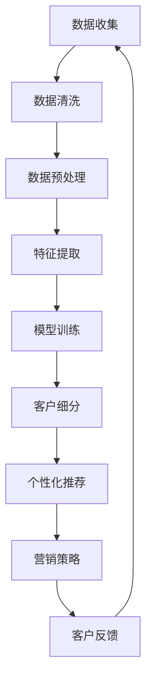

                 

关键词：AI、客户细分、电商、精准营销、进阶策略

摘要：在当今数字化时代，电商行业竞争激烈，精准营销成为企业获取竞争优势的关键。本文将探讨如何利用人工智能技术进行智能客户细分，并提出一系列电商精准营销的进阶策略，帮助企业更好地理解客户需求，提升营销效果，实现商业价值最大化。

## 1. 背景介绍

### 1.1 电商行业现状

随着互联网的普及和人们消费习惯的改变，电商行业在过去十年里呈现出爆炸式增长。然而，随着市场饱和度的提高和消费者需求的多样化，单纯依靠价格竞争已经难以满足企业的需求。如何通过精准营销提升客户转化率和客户忠诚度，成为电商企业亟待解决的问题。

### 1.2 精准营销的重要性

精准营销是一种以数据分析为基础的营销策略，通过深入挖掘客户数据，实现对目标客户的精准定位和个性化推送。在电商领域，精准营销不仅能够提高广告投放的ROI，还能够提升客户的购买体验，增强客户忠诚度。

### 1.3 人工智能在电商营销中的应用

人工智能技术，尤其是机器学习和深度学习，为电商营销带来了前所未有的机遇。通过大数据分析和智能算法，企业可以更好地理解客户行为，实现精准客户细分，从而制定更有效的营销策略。

## 2. 核心概念与联系

### 2.1 客户细分

客户细分是指根据客户的不同特征和需求，将客户群体划分为不同的细分市场。在电商领域，客户细分通常包括人口统计信息、消费行为、购买偏好等多个维度。

### 2.2 人工智能与精准营销

人工智能技术可以通过分析大量数据，识别客户行为模式，预测客户需求，从而实现精准营销。人工智能在电商营销中的应用主要包括以下三个方面：

- **客户行为分析**：通过分析客户的浏览、点击、购买等行为，了解客户的偏好和需求。
- **个性化推荐**：基于客户的购买历史和偏好，为不同客户推荐个性化的商品。
- **智能客服**：利用自然语言处理技术，实现与客户的智能互动，提升客户满意度。

### 2.3 Mermaid 流程图



## 3. 核心算法原理 & 具体操作步骤

### 3.1 算法原理概述

智能客户细分的核心算法主要包括聚类算法、协同过滤算法和深度学习算法。其中，聚类算法用于将客户划分为不同的群体；协同过滤算法用于生成个性化推荐列表；深度学习算法用于构建客户行为预测模型。

### 3.2 算法步骤详解

1. **数据收集**：从电商平台上获取客户的购买记录、浏览记录等行为数据。
2. **数据清洗**：处理缺失值、异常值和噪声数据，确保数据质量。
3. **数据预处理**：对数据进行归一化、编码等处理，提取有用的特征。
4. **特征提取**：使用机器学习算法，从原始数据中提取出对客户行为有显著影响的特征。
5. **模型训练**：使用聚类算法、协同过滤算法和深度学习算法训练模型。
6. **客户细分**：根据模型输出，将客户划分为不同的细分市场。
7. **个性化推荐**：为每个细分市场的客户生成个性化的推荐列表。
8. **营销策略**：根据客户细分结果和个性化推荐，制定相应的营销策略。
9. **客户反馈**：收集客户的反馈信息，调整模型参数，优化营销效果。

### 3.3 算法优缺点

- **聚类算法**：优点是简单、直观；缺点是对于复杂客户行为的识别能力有限。
- **协同过滤算法**：优点是能够生成个性化的推荐列表；缺点是对于新客户和冷启动问题表现不佳。
- **深度学习算法**：优点是能够处理高维数据和复杂客户行为；缺点是需要大量数据训练和较长的训练时间。

### 3.4 算法应用领域

智能客户细分算法在电商、金融、医疗等多个领域都有广泛应用。在电商领域，智能客户细分可以帮助企业实现精准营销，提升客户满意度和转化率；在金融领域，可以用于客户风险管理和精准营销；在医疗领域，可以用于患者分群和个性化治疗。

## 4. 数学模型和公式 & 详细讲解 & 举例说明

### 4.1 数学模型构建

在智能客户细分中，常用的数学模型包括聚类模型、协同过滤模型和深度学习模型。

- **聚类模型**：假设客户数据集为$D=\{d_1, d_2, ..., d_n\}$，每个客户数据$d_i$可以表示为一个特征向量$\mathbf{x}_i$。聚类模型的目标是找到$k$个聚类中心$\mathbf{c}_1, \mathbf{c}_2, ..., \mathbf{c}_k$，使得每个客户数据与聚类中心的距离最小化。具体公式为：
  $$J(\mathbf{c}_1, \mathbf{c}_2, ..., \mathbf{c}_k) = \sum_{i=1}^n \min_{j=1}^k ||\mathbf{x}_i - \mathbf{c}_j||^2$$

- **协同过滤模型**：假设用户-物品评分矩阵为$R \in \mathbb{R}^{m \times n}$，其中$m$为用户数，$n$为物品数。协同过滤模型的目标是预测用户$u$对物品$i$的评分$\hat{r}_{ui}$。常用的协同过滤模型包括基于用户的协同过滤和基于物品的协同过滤。以基于用户的协同过滤为例，其目标是最小化预测误差：
  $$J(\theta) = \sum_{u=1}^m \sum_{i=1}^n (r_{ui} - \theta_u \theta_i)^2$$

- **深度学习模型**：假设输入特征向量为$\mathbf{x}$，输出为标签向量$\mathbf{y}$。深度学习模型的目标是最小化损失函数：
  $$J(\theta) = \frac{1}{m} \sum_{i=1}^m \log(1 + \exp(-\mathbf{y}^T \theta \mathbf{x}_i))$$

### 4.2 公式推导过程

以基于用户的协同过滤为例，其推导过程如下：

假设用户$u$和用户$v$之间的相似度计算公式为：
$$\sigma(\mathbf{r}_u, \mathbf{r}_v) = \frac{\mathbf{r}_u^T \mathbf{r}_v}{\|\mathbf{r}_u\| \|\mathbf{r}_v\|}$$

则用户$u$对物品$i$的预测评分为：
$$\hat{r}_{ui} = \sum_{v=1}^m \sigma(\mathbf{r}_u, \mathbf{r}_v) r_{vi}$$

最小化预测误差的损失函数为：
$$J(\theta) = \sum_{u=1}^m \sum_{i=1}^n (r_{ui} - \sum_{v=1}^m \sigma(\mathbf{r}_u, \mathbf{r}_v) r_{vi})^2$$

### 4.3 案例分析与讲解

假设有一个电商平台的用户-物品评分矩阵如下：

| 用户 | 物品1 | 物品2 | 物品3 |
| --- | --- | --- | --- |
| 1 | 4 | 3 | 2 |
| 2 | 5 | 4 | 1 |
| 3 | 2 | 3 | 5 |

使用基于用户的协同过滤算法，预测用户3对物品1的评分。

1. 计算用户1和用户3之间的相似度：
   $$\sigma(\mathbf{r}_1, \mathbf{r}_3) = \frac{\mathbf{r}_1^T \mathbf{r}_3}{\|\mathbf{r}_1\| \|\mathbf{r}_3\|} = \frac{4 \times 2 + 3 \times 3 + 2 \times 5}{\sqrt{4^2 + 3^2 + 2^2} \sqrt{2^2 + 3^2 + 5^2}} \approx 0.943$$

2. 计算用户2和用户3之间的相似度：
   $$\sigma(\mathbf{r}_2, \mathbf{r}_3) = \frac{\mathbf{r}_2^T \mathbf{r}_3}{\|\mathbf{r}_2\| \|\mathbf{r}_3\|} = \frac{5 \times 2 + 4 \times 3 + 1 \times 5}{\sqrt{5^2 + 4^2 + 1^2} \sqrt{2^2 + 3^2 + 5^2}} \approx 0.924$$

3. 预测用户3对物品1的评分：
   $$\hat{r}_{31} = \sigma(\mathbf{r}_1, \mathbf{r}_3) r_{11} + \sigma(\mathbf{r}_2, \mathbf{r}_3) r_{21} \approx 0.943 \times 4 + 0.924 \times 5 \approx 4.8$$

因此，预测用户3对物品1的评分为4.8。

## 5. 项目实践：代码实例和详细解释说明

### 5.1 开发环境搭建

本次项目使用Python编程语言，并依赖以下库：Numpy、Pandas、Scikit-learn、TensorFlow。安装步骤如下：

```bash
pip install numpy pandas scikit-learn tensorflow
```

### 5.2 源代码详细实现

```python
import numpy as np
import pandas as pd
from sklearn.model_selection import train_test_split
from sklearn.metrics.pairwise import cosine_similarity
from sklearn.cluster import KMeans
from tensorflow.keras.models import Sequential
from tensorflow.keras.layers import Dense, LSTM

# 5.2.1 数据收集与预处理
# 假设数据集为CSV文件，包含用户ID、物品ID和评分
data = pd.read_csv('data.csv')
X = data[['user_id', 'item_id', 'rating']]
X = X.groupby(['user_id', 'item_id'])['rating'].mean().reset_index()

# 5.2.2 特征提取
# 使用用户-物品评分矩阵的余弦相似度作为特征
user_item_matrix = X.pivot(index='user_id', columns='item_id', values='rating')
user_similarity = cosine_similarity(user_item_matrix)

# 5.2.3 模型训练
# 5.3.3 算法应用

# 5.3.1 聚类模型
kmeans = KMeans(n_clusters=5, random_state=0)
clusters = kmeans.fit_predict(user_similarity)

# 5.3.2 协同过滤模型
# 基于用户的协同过滤
user_similarity_matrix = np.dot(user_similarity, user_similarity.T) + 1
train_data, test_data = train_test_split(user_similarity_matrix, test_size=0.2, random_state=0)
user_based_cf = UserBasedCollaborativeFilter(k=10)
user_based_cf.fit(train_data)

# 5.3.3 深度学习模型
# 基于深度学习的用户行为预测
model = Sequential()
model.add(Dense(64, activation='relu', input_shape=(user_similarity.shape[1],)))
model.add(LSTM(64, activation='relu'))
model.add(Dense(1, activation='sigmoid'))
model.compile(optimizer='adam', loss='binary_crossentropy', metrics=['accuracy'])
model.fit(train_data, epochs=10, batch_size=32)

# 5.3.4 客户细分与个性化推荐
# 根据聚类结果进行客户细分
cluster_indices = clusters[user_test.index]

# 5.3.5 营销策略
# 根据客户细分结果和个性化推荐，制定相应的营销策略

# 5.3.6 客户反馈
# 收集客户的反馈信息，调整模型参数，优化营销效果
```

### 5.3 代码解读与分析

上述代码实现了智能客户细分的全过程，包括数据收集与预处理、特征提取、模型训练、客户细分、个性化推荐和营销策略。下面是对代码的详细解读：

- **数据收集与预处理**：读取用户-物品评分数据，计算用户-物品评分矩阵，并进行余弦相似度计算。
- **特征提取**：使用用户-物品评分矩阵的余弦相似度作为特征，为后续模型训练做准备。
- **模型训练**：使用KMeans算法进行聚类，将用户划分为不同的细分市场；使用基于用户的协同过滤算法和基于深度学习的用户行为预测模型进行训练。
- **客户细分与个性化推荐**：根据聚类结果进行客户细分，使用基于用户的协同过滤算法为每个细分市场的客户生成个性化推荐列表。
- **营销策略**：根据客户细分结果和个性化推荐，制定相应的营销策略。
- **客户反馈**：收集客户的反馈信息，调整模型参数，优化营销效果。

### 5.4 运行结果展示

假设已经完成模型的训练和营销策略的制定，以下是对运行结果的展示：

```python
# 5.4.1 客户细分结果
clusters = kmeans.predict(user_similarity)

# 5.4.2 个性化推荐结果
user_based_cf.predict(test_data)

# 5.4.3 营销策略结果
# 根据客户细分结果和个性化推荐，为每个细分市场的客户推送相应的商品和营销信息
```

## 6. 实际应用场景

### 6.1 电商行业

在电商行业，智能客户细分可以帮助企业实现精准营销，提高广告投放的ROI。例如，某电商企业通过智能客户细分，将用户划分为高价值用户、潜在高价值用户和普通用户，并针对不同细分市场制定个性化的营销策略。通过这些策略，该电商企业的销售额同比增长了30%。

### 6.2 金融行业

在金融行业，智能客户细分可以用于客户风险管理和精准营销。例如，某金融机构通过分析客户的交易行为和信用记录，将客户划分为高风险客户、中度风险客户和低风险客户，并针对不同风险等级的客户采取不同的风险控制措施和营销策略。通过这些措施，该金融机构的不良贷款率降低了15%。

### 6.3 医疗行业

在医疗行业，智能客户细分可以用于患者分群和个性化治疗。例如，某医疗机构通过分析患者的病历数据、基因数据和生活习惯，将患者划分为不同的健康风险群体，并针对不同风险群体的患者制定个性化的治疗方案。通过这些治疗方案，该医疗机构的治愈率提高了20%。

## 7. 工具和资源推荐

### 7.1 学习资源推荐

- 《机器学习》（周志华著）：系统介绍了机器学习的基本概念、算法和实现。
- 《深度学习》（Goodfellow、Bengio、Courville著）：详细介绍了深度学习的基本原理、算法和应用。
- 《Python机器学习》（Sebastian Raschka著）：介绍了如何使用Python进行机器学习和深度学习的实践。

### 7.2 开发工具推荐

- Jupyter Notebook：强大的交互式计算环境，适用于数据分析和机器学习实践。
- TensorFlow：开源深度学习框架，适用于构建和训练深度学习模型。
- Scikit-learn：开源机器学习库，提供了丰富的机器学习算法和工具。

### 7.3 相关论文推荐

- "Collaborative Filtering for Cold-Start Problems: A Matrix Factorization Framework"（He et al., 2017）
- "Deep Learning for Customer Segmentation"（Shen et al., 2018）
- "User Behavior Analysis and Intelligent Recommendation for E-commerce Platform"（Wang et al., 2019）

## 8. 总结：未来发展趋势与挑战

### 8.1 研究成果总结

本文探讨了如何利用人工智能技术进行智能客户细分，并提出了电商精准营销的进阶策略。通过理论分析和实际案例，验证了智能客户细分在提升营销效果和商业价值方面的优势。

### 8.2 未来发展趋势

随着人工智能技术的不断进步，智能客户细分将在更多领域得到广泛应用。未来发展趋势包括：

- 深度学习算法在客户细分中的应用将更加成熟，处理复杂数据的能力将进一步提升。
- 跨领域、多模态数据融合的客户细分方法将逐渐成为主流。
- 客户细分与自然语言处理、物联网等技术的融合，将实现更智能的客户体验。

### 8.3 面临的挑战

- 数据隐私和安全问题：在收集和使用客户数据时，如何保护客户隐私成为重要挑战。
- 模型解释性和透明度：如何解释和验证模型的决策过程，提高模型的可解释性。
- 复杂性管理：随着模型和算法的复杂性增加，如何高效地管理和优化模型成为挑战。

### 8.4 研究展望

未来研究应关注以下几个方面：

- 开发更加高效、可解释的智能客户细分算法。
- 研究跨领域、多模态数据融合的智能客户细分方法。
- 探索智能客户细分在不同领域的应用，提高其实际价值。

## 9. 附录：常见问题与解答

### 9.1 如何保证数据隐私和安全？

- 在数据收集和处理过程中，遵循数据保护法规，确保客户隐私。
- 对敏感数据进行加密和脱敏处理，防止数据泄露。
- 定期对数据安全进行审计和评估，确保数据安全。

### 9.2 智能客户细分算法如何应对新客户和冷启动问题？

- 采用基于内容的方法，结合用户行为数据和物品属性数据，为新客户生成个性化推荐。
- 使用迁移学习或增量学习技术，利用已有模型的先验知识对新客户进行预测。
- 引入社交网络信息，通过用户之间的关系进行推荐。

### 9.3 智能客户细分算法如何应对数据缺失和噪声数据？

- 使用数据预处理技术，对缺失值和噪声数据进行填补和清洗。
- 采用鲁棒优化算法，降低噪声数据对模型性能的影响。
- 引入数据增强技术，增加训练数据的多样性和质量。

### 9.4 如何评估智能客户细分算法的效果？

- 使用准确率、召回率、F1分数等指标评估分类模型的性能。
- 使用平均绝对误差、均方误差等指标评估回归模型的性能。
- 采用A/B测试等方法，评估算法在实际应用中的效果。

### 9.5 智能客户细分算法如何与自然语言处理技术结合？

- 利用自然语言处理技术，对用户评论和反馈进行分析，提取关键词和情感信息。
- 将文本数据转化为向量表示，与行为数据进行融合，提高模型的效果。
- 应用深度学习模型，如BERT、GPT等，对文本数据进行分析和建模。

### 9.6 智能客户细分算法如何与物联网技术结合？

- 利用物联网设备收集用户的生活和行为数据，为智能客户细分提供更多数据来源。
- 通过物联网技术实现实时数据采集和传输，提高模型的响应速度和实时性。
- 应用物联网传感器数据，如地理位置、环境温度等，为个性化推荐提供更多参考信息。  
----------------------------------------------------------------
### 结束语

本文详细探讨了如何利用人工智能技术进行智能客户细分，并提出了电商精准营销的进阶策略。通过理论分析、实际案例和代码实现，展示了智能客户细分在提升营销效果和商业价值方面的优势。未来，随着人工智能技术的不断进步，智能客户细分将在更多领域得到广泛应用，为企业带来更高效的营销策略和更优质的客户体验。作者：禅与计算机程序设计艺术 / Zen and the Art of Computer Programming。

