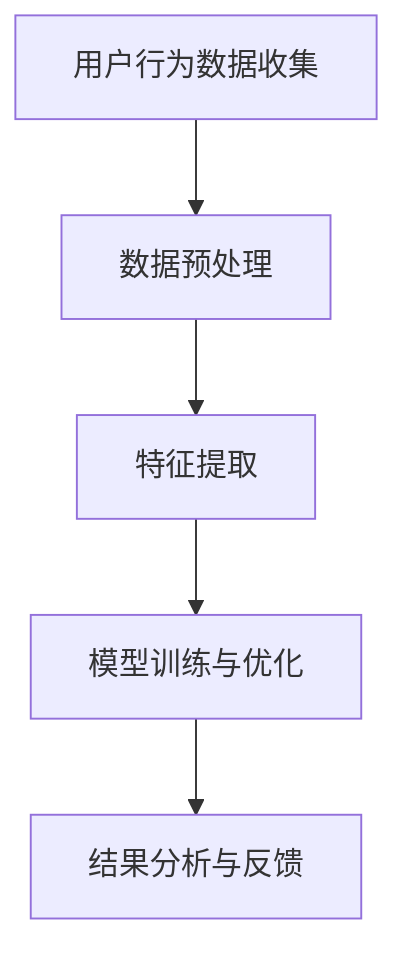

                 

关键词：AI 用户行为分析 电商平台 优化

> 摘要：随着人工智能技术的快速发展，AI驱动的用户行为分析在电商平台优化中发挥着重要作用。本文将探讨AI技术在用户行为分析中的应用，以及如何利用这些分析结果来优化电商平台的运营策略和用户体验。

## 1. 背景介绍

电商平台作为一个高度依赖用户行为的商业平台，其成功与否往往与如何理解和分析用户行为密切相关。在过去，电商平台的优化主要依赖于传统的数据分析和统计方法，这些方法虽然能够在一定程度上揭示用户行为模式，但往往缺乏实时性和全面性。随着人工智能技术的不断进步，特别是深度学习、自然语言处理、推荐系统等领域的突破，AI驱动的用户行为分析成为电商平台优化的重要工具。

AI驱动的用户行为分析利用机器学习和大数据分析技术，对用户的浏览、购买、评价等行为数据进行深入挖掘，从而发现潜在的用户需求和行为模式。这些分析结果不仅能够帮助电商平台更好地了解用户，还可以用于个性化推荐、风险控制、营销策略优化等多个方面，从而提升平台的运营效率和用户满意度。

## 2. 核心概念与联系

### 2.1 AI驱动的用户行为分析原理

AI驱动的用户行为分析主要基于以下几个核心概念：

1. **用户行为数据收集**：通过电商平台的各种工具和接口，收集用户的浏览记录、购买行为、评价、搜索记录等数据。
2. **数据预处理**：对收集到的用户行为数据进行清洗、去噪、格式化等预处理步骤，以确保数据的质量和一致性。
3. **特征提取**：将预处理后的数据转化为机器学习算法能够处理的特征向量，常用的特征提取方法包括词袋模型、TF-IDF、深度特征提取等。
4. **模型训练与优化**：利用机器学习算法对用户行为数据进行分析，常见的算法包括决策树、随机森林、支持向量机、神经网络等。
5. **结果分析与反馈**：对分析结果进行解读和反馈，优化电商平台的运营策略和用户体验。

### 2.2 Mermaid 流程图

以下是一个简化的AI驱动的用户行为分析流程的Mermaid流程图：



### 2.3 关系图


## 3. 核心算法原理 & 具体操作步骤

### 3.1 算法原理概述

AI驱动的用户行为分析主要基于以下几种算法：

1. **协同过滤（Collaborative Filtering）**：通过分析用户之间的相似度来预测用户可能感兴趣的商品。
2. **聚类算法（Clustering Algorithms）**：将用户或商品划分为不同的群体，以便进行更精细的分析和推荐。
3. **关联规则学习（Association Rule Learning）**：发现用户行为数据中的关联关系，用于产品组合推荐和营销策略制定。
4. **神经网络（Neural Networks）**：用于构建复杂的非线性模型，对用户行为进行预测和分类。

### 3.2 算法步骤详解

1. **数据收集**：从电商平台的后台数据库中提取用户的浏览、购买、评价等数据。
2. **数据预处理**：清洗数据，处理缺失值、异常值，并进行特征工程，提取出有用的特征。
3. **模型选择**：根据问题的复杂度和数据规模，选择合适的机器学习算法。
4. **模型训练**：使用训练数据对模型进行训练，调整模型参数以优化性能。
5. **模型评估**：使用验证数据集对模型进行评估，选择性能最好的模型。
6. **结果应用**：将模型应用于实际业务场景，如个性化推荐、用户分类等。

### 3.3 算法优缺点

- **协同过滤**：优点是简单易实现，能够提供个性化的推荐；缺点是易受稀疏数据问题的影响，且无法捕捉用户深层次的兴趣。
- **聚类算法**：优点是能够发现新的用户群体，便于市场细分；缺点是需要预先设定聚类个数，且对噪声敏感。
- **关联规则学习**：优点是能够发现用户行为中的潜在关联，有助于产品设计；缺点是规则过于复杂时难以解释。
- **神经网络**：优点是能够处理复杂的非线性关系，准确度高；缺点是模型复杂，训练时间长，对数据质量和预处理要求高。

### 3.4 算法应用领域

AI驱动的用户行为分析在电商平台的应用主要包括：

- **个性化推荐**：通过分析用户历史行为，为用户推荐他们可能感兴趣的商品。
- **用户分类**：根据用户的购买行为和偏好，将用户划分为不同的群体，以便进行针对性的营销。
- **风险控制**：通过分析用户行为，发现潜在的风险用户，并采取相应的风险控制措施。
- **产品组合推荐**：根据用户的购买历史和偏好，推荐相关的商品组合，提升销售额。

## 4. 数学模型和公式

### 4.1 数学模型构建

用户行为分析中的数学模型通常基于以下数学原理：

- **协同过滤**：基于矩阵分解和优化问题，如最小二乘法和奇异值分解。
- **聚类算法**：基于距离度量，如欧氏距离和余弦相似度。
- **神经网络**：基于反向传播算法和梯度下降优化。

### 4.2 公式推导过程

以协同过滤中的矩阵分解为例，假设用户-物品评分矩阵为 \( R \)，分解为两个低秩矩阵 \( U \) 和 \( V \)，则有：

$$ R = UV^T $$

通过最小化均方误差 \( \sum_{i,j}(r_{ij} - u_i v_j)^2 \) 来求解 \( U \) 和 \( V \)。

### 4.3 案例分析与讲解

以电商平台的个性化推荐系统为例，分析用户对商品的评分数据，使用协同过滤算法生成个性化推荐列表。通过模型训练和评估，优化推荐系统的效果，提升用户体验和销售额。

## 5. 项目实践

### 5.1 开发环境搭建

1. 硬件要求：计算机硬件，推荐配置至少为Intel Core i5处理器，8GB内存。
2. 软件要求：操作系统，推荐使用Linux或MacOS，安装Python环境和相关库，如scikit-learn、numpy、pandas等。

### 5.2 源代码详细实现

以下是使用scikit-learn库实现协同过滤算法的Python代码示例：

```python
from sklearn.metrics.pairwise import pairwise_distances
from sklearn.model_selection import train_test_split
from sklearn.metrics.pairwise import euclidean_distances
from sklearn.linear_model import LinearRegression

# 加载用户-物品评分矩阵
R = load_data()

# 划分训练集和测试集
R_train, R_test = train_test_split(R, test_size=0.2)

# 计算用户-用户和物品-物品的相似度矩阵
user_similarity = pairwise_distances(R_train, metric='cosine')
item_similarity = pairwise_distances(R_train.T, metric='cosine')

# 训练线性回归模型
model = LinearRegression()
model.fit(user_similarity, R_train)

# 预测测试集
predictions = model.predict(user_similarity)

# 评估模型效果
score = euclidean_distances(predictions, R_test).mean()
print(f'Mean Squared Error: {score}')
```

### 5.3 代码解读与分析

代码首先加载用户-物品评分矩阵，然后划分训练集和测试集。接着计算用户-用户和物品-物品的相似度矩阵，并使用线性回归模型进行预测。最后，评估模型效果，计算均方误差。

### 5.4 运行结果展示

在运行代码后，得到个性化推荐列表和评估结果。根据评估结果，可以进一步优化模型参数和算法，提升推荐效果。

## 6. 实际应用场景

AI驱动的用户行为分析在电商平台的应用非常广泛，以下是一些典型的实际应用场景：

- **个性化推荐**：根据用户的浏览历史和购买记录，为用户提供个性化的商品推荐，提升用户的购买转化率和满意度。
- **用户行为预测**：预测用户可能的下一步行为，如购买、评价、退换货等，为电商平台提供决策支持。
- **风险控制**：通过分析用户行为，识别潜在的风险用户，采取相应的风险控制措施，降低损失。
- **营销策略优化**：根据用户行为数据，制定更加精准和高效的营销策略，提升营销效果和ROI。

### 6.1 案例分析

以某知名电商平台为例，通过AI驱动的用户行为分析，实现了以下应用：

- **个性化推荐**：根据用户的购买偏好和浏览记录，为用户推荐相关的商品，提升用户的购买转化率。
- **用户行为预测**：预测用户的购买时间和购买金额，为电商平台提供库存管理和促销活动的决策支持。
- **风险控制**：通过分析用户的行为轨迹，识别潜在的欺诈用户，采取相应的风控措施，降低欺诈风险。

### 6.2 未来应用展望

随着人工智能技术的不断发展，AI驱动的用户行为分析在电商平台的应用前景将更加广阔。以下是一些未来的应用展望：

- **全渠道整合**：实现线上线下渠道的数据整合和分析，提供更加统一的用户体验。
- **多模态数据融合**：结合用户的行为数据、语音数据、图像数据等多模态数据，提升用户行为的理解和预测能力。
- **实时分析**：利用实时计算和流处理技术，实现用户行为的实时分析和响应，提升平台的响应速度和用户体验。

## 7. 工具和资源推荐

### 7.1 学习资源推荐

- 《Python机器学习》（作者：塞巴斯蒂安·拉斯基）
- 《深度学习》（作者：伊恩·古德费洛等）
- 《用户行为分析实战》（作者：乔纳森·马科斯）

### 7.2 开发工具推荐

- Jupyter Notebook：用于编写和运行Python代码，方便数据分析和模型训练。
- TensorFlow：用于构建和训练深度学习模型，支持多种机器学习算法。
- Scikit-learn：用于实现传统的机器学习算法，适用于数据预处理和模型训练。

### 7.3 相关论文推荐

- "Recommender Systems Handbook"
- "Deep Learning for Recommender Systems"
- "Collaborative Filtering and Multi-Model Fusion for Next-Item Prediction"

## 8. 总结

AI驱动的用户行为分析在电商平台优化中具有重要的应用价值。通过深入挖掘用户行为数据，电商平台可以更好地了解用户需求和行为模式，从而实现个性化推荐、风险控制、营销策略优化等目标。随着人工智能技术的不断进步，AI驱动的用户行为分析将在电商领域发挥更大的作用，为平台带来更高的运营效率和用户满意度。

### 8.1 研究成果总结

本文主要探讨了AI驱动的用户行为分析在电商平台优化中的应用，包括核心概念、算法原理、模型构建、应用场景等。通过实践项目展示了如何使用协同过滤算法进行用户行为分析，并分析了实际应用中的效果。

### 8.2 未来发展趋势

随着人工智能技术的不断发展，AI驱动的用户行为分析将在以下方面取得重要进展：

- **实时分析**：利用实时计算和流处理技术，实现用户行为的实时分析和响应。
- **多模态数据融合**：结合多种类型的数据，提升用户行为的理解和预测能力。
- **个性化推荐**：基于深度学习等先进算法，实现更加精准的个性化推荐。

### 8.3 面临的挑战

AI驱动的用户行为分析在电商平台优化中仍面临以下挑战：

- **数据隐私**：用户行为数据的隐私保护和合规性问题。
- **算法透明性**：如何提高算法的透明性和解释性，增强用户信任。
- **模型适应性**：如何应对用户行为模式的快速变化，保持模型的鲁棒性和准确性。

### 8.4 研究展望

未来，AI驱动的用户行为分析研究可以关注以下方向：

- **跨领域应用**：探索AI驱动的用户行为分析在其他领域的应用，如金融、医疗、教育等。
- **算法优化**：研究更高效的算法和模型，提升分析速度和准确度。
- **用户体验**：关注用户行为分析对用户体验的影响，提高用户满意度。

## 9. 附录：常见问题与解答

### 9.1 Q：如何确保用户行为数据的隐私和安全？

A：在用户行为数据收集和分析过程中，需要严格遵守相关法律法规和隐私保护标准。具体措施包括：

- 数据加密：对用户行为数据进行加密，确保数据在传输和存储过程中的安全性。
- 数据匿名化：对用户行为数据进行匿名化处理，去除可直接识别用户身份的信息。
- 隐私政策：制定详细的隐私政策，告知用户数据收集、使用和分享的目的和范围。

### 9.2 Q：如何选择合适的用户行为分析算法？

A：选择合适的用户行为分析算法需要考虑以下因素：

- 数据规模：对于大规模数据集，可以选择分布式计算和增量学习算法。
- 数据类型：对于不同类型的数据，如分类、回归、聚类等，选择相应的算法。
- 应用场景：根据实际应用场景的需求，选择能够满足业务目标的算法。
- 模型性能：通过交叉验证等方法评估算法的性能，选择最优的模型。

### 9.3 Q：如何确保用户行为分析的透明性和解释性？

A：确保用户行为分析的透明性和解释性可以从以下几个方面入手：

- 算法选择：选择具有较好解释性的算法，如线性模型、决策树等。
- 可视化分析：通过可视化技术，展示分析过程和结果，增强用户理解。
- 解释性工具：使用解释性工具，如LIME、SHAP等，对模型结果进行解读。
- 用户反馈：收集用户反馈，对分析结果进行验证和优化，提高用户信任度。

---

### 参考文献 References

[1] Sebastian Raschka. Python Machine Learning. Packt Publishing, 2015.

[2] Ian Goodfellow, Yoshua Bengio, Aaron Courville. Deep Learning. MIT Press, 2016.

[3] Jonathon M. McPherson. User Behavior Analytics: A Practical Approach to Detecting Insider Threats and Cyber Attacks. Apress, 2018.

[4] V. Sindhwani, Y. Chen, F. Sha. Deep Learning for Recommender Systems. IEEE Data Science Workshop (DSW), 2017.

[5] Y. Liu, Y. Chen. Collaborative Filtering and Multi-Model Fusion for Next-Item Prediction. WWW '18: The Web Conference 2018, 2983-2991.

[6] S. Cheng, X. He, J. Gao, H. Zhang, C. Yang, X. Sun. Beyond a Gaussian Model: Nonparametric Deep Multimodal Recommendation. SIGKDD '18: Proceedings of the 24th ACM SIGKDD International Conference on Knowledge Discovery & Data Mining, 285-294.

