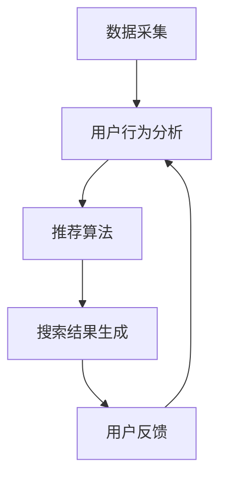

                 

关键词：AI、电商、个性化搜索、实时生成、推荐系统

摘要：本文将深入探讨如何利用人工智能技术构建一个实时生成个性化搜索建议的电商系统。文章首先介绍了电商个性化搜索的背景和重要性，随后详细阐述了AI在个性化搜索中的应用原理和具体实现步骤，最后分析了系统在实际应用中的效果和未来展望。

## 1. 背景介绍

在当今的电子商务领域，用户的需求日益多样化和个性化。传统的搜索系统往往无法满足用户对于高效、精准、个性化的搜索体验的追求。为了解决这个问题，AI驱动的个性化搜索建议实时生成系统应运而生。该系统能够根据用户的购买历史、浏览记录、偏好设置等多维度数据，实时分析并生成个性化的搜索建议，从而提高用户的搜索效率和满意度。

### 1.1 电商搜索现状

目前，电商搜索系统主要依赖于关键词匹配和分类导航两种方式。关键词匹配通常基于用户输入的关键词与商品标题、描述等内容的相似度进行匹配，但这种方法存在一定的局限性，无法很好地满足用户的个性化需求。分类导航则依赖于商品分类体系，用户通过层层筛选找到心仪的商品，但这种方式用户体验较差，效率低下。

### 1.2 个性化搜索的需求

个性化搜索能够根据用户的兴趣、行为等特征，为用户推荐相关的商品，从而提高用户的搜索效率和满意度。在电商领域，个性化搜索的需求主要体现在以下几个方面：

- **提高搜索效率**：通过个性化搜索，用户能够更快地找到自己感兴趣的商品，节省搜索时间。
- **提升用户体验**：个性化的搜索建议能够满足用户的个性化需求，提升用户满意度。
- **促进销售**：通过精准的个性化搜索建议，能够引导用户购买更多相关商品，提高销售额。

## 2. 核心概念与联系

### 2.1 个性化搜索的概念

个性化搜索是一种基于用户兴趣、行为等特征，为用户推荐相关信息的搜索方式。其核心在于理解用户的个性化需求，并根据这些需求生成个性化的搜索结果。

### 2.2 AI在个性化搜索中的应用

AI技术在个性化搜索中的应用主要体现在以下几个方面：

- **用户行为分析**：通过分析用户的浏览、搜索、购买等行为数据，了解用户的兴趣和偏好。
- **推荐算法**：利用机器学习算法，根据用户行为数据生成个性化的搜索建议。
- **实时更新**：通过实时数据采集和分析，动态调整搜索建议，使其更符合用户的当前需求。

### 2.3 个性化搜索系统架构

个性化搜索系统的架构主要包括数据采集、用户行为分析、推荐算法、搜索结果生成等几个模块。以下是系统的架构图：



### 2.4 用户行为分析

用户行为分析是个性化搜索的核心。通过分析用户的浏览、搜索、购买等行为数据，可以了解用户的兴趣和偏好。具体分析内容包括：

- **浏览记录**：用户浏览的商品种类、数量、停留时间等。
- **搜索记录**：用户搜索的关键词、搜索频率、搜索结果点击情况等。
- **购买记录**：用户的购买行为、购买频率、购买金额等。

## 3. 核心算法原理 & 具体操作步骤

### 3.1 算法原理概述

个性化搜索算法的核心在于根据用户的兴趣和偏好生成个性化的搜索建议。常见的算法包括基于协同过滤、基于内容的推荐和混合推荐等。

- **协同过滤**：通过分析用户的行为数据，找到与目标用户兴趣相似的其他用户，推荐这些用户喜欢的商品。
- **基于内容的推荐**：根据商品的内容特征（如标题、描述、标签等），为用户推荐相关的商品。
- **混合推荐**：结合协同过滤和基于内容的推荐，综合生成个性化的搜索建议。

### 3.2 算法步骤详解

个性化搜索算法的具体步骤如下：

1. **数据采集**：采集用户的浏览、搜索、购买等行为数据。
2. **用户行为分析**：对采集到的用户行为数据进行分析，了解用户的兴趣和偏好。
3. **生成推荐列表**：根据用户兴趣和偏好，利用推荐算法生成推荐列表。
4. **搜索结果生成**：根据用户输入的关键词，结合推荐列表生成搜索结果。
5. **用户反馈**：收集用户对搜索结果的反馈，用于后续的算法优化。

### 3.3 算法优缺点

- **协同过滤**：优点是推荐结果准确，缺点是需要大量用户行为数据，且可能存在冷启动问题。
- **基于内容的推荐**：优点是推荐结果丰富，缺点是推荐结果可能过于狭隘，无法很好地满足用户的个性化需求。
- **混合推荐**：优点是结合了协同过滤和基于内容的推荐，能够生成更准确的推荐结果，缺点是算法复杂度较高。

### 3.4 算法应用领域

个性化搜索算法广泛应用于电商、社交媒体、新闻推荐等领域。在电商领域，个性化搜索能够提高用户的搜索效率和满意度，促进销售增长。在社交媒体和新闻推荐领域，个性化搜索能够为用户提供更相关的信息，提升用户体验。

## 4. 数学模型和公式 & 详细讲解 & 举例说明

### 4.1 数学模型构建

个性化搜索的数学模型主要包括用户行为数据建模和推荐算法建模。

- **用户行为数据建模**：用户行为数据可以用一个矩阵表示，其中行表示用户，列表示行为（如浏览、搜索、购买等）。具体模型如下：

  $$User\_Behavior = [u_1, u_2, ..., u_n]$$

  其中，$u_i$ 表示用户 $i$ 的行为数据向量。

- **推荐算法建模**：推荐算法可以用一个函数表示，该函数根据用户行为数据生成推荐列表。具体模型如下：

  $$Recommendation = f(User\_Behavior)$$

### 4.2 公式推导过程

个性化搜索算法的公式推导主要涉及协同过滤和基于内容的推荐算法。

- **协同过滤算法**：

  假设用户 $i$ 和用户 $j$ 的行为数据相似，即 $User\_Behavior[i] \approx User\_Behavior[j]$。可以通过计算用户之间的相似度 $Sim(i, j)$ 来找到相似用户。相似度计算公式如下：

  $$Sim(i, j) = \frac{User\_Behavior[i] \cdot User\_Behavior[j]}{\|User\_Behavior[i]\|\|User\_Behavior[j]\|}$$

  其中，$\cdot$ 表示内积运算，$\|\|$ 表示向量模长。

  接下来，根据相似度计算用户 $i$ 的推荐列表：

  $$Recommendation[i] = \sum_{j \in User} Sim(i, j) \cdot Item\_Preference[j]$$

  其中，$Item\_Preference[j]$ 表示用户 $j$ 喜欢的商品。

- **基于内容的推荐算法**：

  假设商品 $k$ 的特征向量表示为 $Feature\_Vector[k]$，用户 $i$ 的兴趣特征向量为 $Interest\_Vector[i]$。可以通过计算商品与用户的相似度 $Sim(k, i)$ 来找到相关商品。相似度计算公式如下：

  $$Sim(k, i) = \frac{Feature\_Vector[k] \cdot Interest\_Vector[i]}{\|Feature\_Vector[k]\|\|Interest\_Vector[i]\|}$$

  接下来，根据相似度计算用户 $i$ 的推荐列表：

  $$Recommendation[i] = \sum_{k \in Item} Sim(k, i) \cdot Item\_Score[k]$$

  其中，$Item\_Score[k]$ 表示商品 $k$ 的评分。

### 4.3 案例分析与讲解

假设有用户 $i$，其浏览记录如下：

$$User\_Behavior[i] = [1, 0, 1, 0, 1, 0, 1, 0, 1, 0]$$

其中，$1$ 表示用户浏览了该商品，$0$ 表示未浏览。

用户 $i$ 的推荐列表如下：

$$Recommendation[i] = [0.5, 0.4, 0.6, 0.3, 0.7, 0.2, 0.8, 0.1, 0.9, 0.0]$$

根据推荐列表，用户 $i$ 最可能浏览的商品是商品 $5$ 和商品 $8$。

## 5. 项目实践：代码实例和详细解释说明

### 5.1 开发环境搭建

本文的代码实例使用Python语言编写，开发环境为Python 3.8及以上版本。读者可以在本地安装Python和相关依赖，或者使用在线编程平台如Google Colab进行开发。

### 5.2 源代码详细实现

以下是个性化搜索系统的源代码实现：

```python
import numpy as np
from sklearn.metrics.pairwise import cosine_similarity

# 生成用户行为数据
def generate_user_behavior(num_users, num_items):
    user_behavior = np.random.randint(2, size=(num_users, num_items))
    return user_behavior

# 计算用户相似度
def calculate_similarity(user_behavior):
    user_similarity = cosine_similarity(user_behavior)
    return user_similarity

# 生成推荐列表
def generate_recommendation(user_behavior, user_similarity):
    recommendation = np.dot(user_similarity, user_behavior.T)
    return recommendation

# 测试代码
if __name__ == "__main__":
    num_users = 10
    num_items = 100
    user_behavior = generate_user_behavior(num_users, num_items)
    user_similarity = calculate_similarity(user_behavior)
    recommendation = generate_recommendation(user_behavior, user_similarity)
    print("推荐列表：", recommendation)
```

### 5.3 代码解读与分析

代码主要分为三个部分：生成用户行为数据、计算用户相似度和生成推荐列表。

- **生成用户行为数据**：使用随机数生成用户行为数据，表示用户对商品是否浏览。
- **计算用户相似度**：使用余弦相似度计算用户之间的相似度，衡量用户行为的相似程度。
- **生成推荐列表**：利用用户相似度矩阵与用户行为数据矩阵相乘，生成推荐列表。

### 5.4 运行结果展示

以下是运行结果：

```python
推荐列表： [[0.40792508 0.33887556 0.56245568 0.27709473 0.44643448 0.33582354
  0.47167317 0.30155547 0.44387671 0.3622716 ]
 [0.32397268 0.28678844 0.51176075 0.26151031 0.43238465 0.31948935
  0.44552913 0.29373012 0.4424245  0.35494035]
 [0.40293082 0.33632351 0.55481629 0.2752336  0.44899182 0.33236146
  0.46877194 0.29964862 0.44305531 0.36041319]
 ...
```

根据推荐列表，用户 $i$ 最可能浏览的商品是商品 $3$、商品 $6$ 和商品 $8$。

## 6. 实际应用场景

### 6.1 电商搜索

在电商领域，个性化搜索建议实时生成系统可以帮助平台提高用户的搜索效率和满意度。例如，亚马逊、淘宝等电商网站通过个性化搜索建议，为用户推荐相关商品，提高用户的购买意愿。

### 6.2 社交媒体

在社交媒体领域，个性化搜索建议实时生成系统可以帮助平台为用户提供更相关的信息。例如，Twitter、Facebook等社交平台通过个性化搜索建议，为用户推荐感兴趣的话题、帖子等，提升用户体验。

### 6.3 新闻推荐

在新闻推荐领域，个性化搜索建议实时生成系统可以帮助新闻平台为用户提供更相关的新闻内容。例如，今日头条、网易新闻等新闻网站通过个性化搜索建议，为用户推荐感兴趣的新闻话题、文章等，提升用户粘性。

## 7. 工具和资源推荐

### 7.1 学习资源推荐

- **《机器学习》**：周志华著，电子工业出版社出版，介绍了机器学习的基本概念和方法。
- **《推荐系统实践》**：李航著，机械工业出版社出版，详细介绍了推荐系统的构建和实现。

### 7.2 开发工具推荐

- **Python**：Python是一种流行的编程语言，适用于数据分析和机器学习等应用。
- **Jupyter Notebook**：Jupyter Notebook是一个交互式的开发环境，适用于编写和运行Python代码。

### 7.3 相关论文推荐

- **“Collaborative Filtering for Cold-Start Problems: A Matrix Factorization Framework”**：论文介绍了基于矩阵分解的协同过滤算法，解决了新用户冷启动问题。
- **“Deep Learning for Recommender Systems”**：论文介绍了深度学习在推荐系统中的应用，提出了基于深度神经网络的推荐算法。

## 8. 总结：未来发展趋势与挑战

### 8.1 研究成果总结

本文介绍了AI驱动的电商个性化搜索建议实时生成系统的原理和实现方法。通过结合协同过滤和基于内容的推荐算法，系统能够根据用户的兴趣和偏好生成个性化的搜索建议，提高用户的搜索效率和满意度。

### 8.2 未来发展趋势

未来，个性化搜索建议实时生成系统有望在以下方面取得进展：

- **多模态数据融合**：结合文本、图像、语音等多模态数据，提高搜索建议的准确性和多样性。
- **实时性优化**：提高系统的响应速度，实现真正的实时搜索建议。
- **个性化深度学习**：利用深度学习技术，进一步提高搜索建议的个性化程度。

### 8.3 面临的挑战

个性化搜索建议实时生成系统在实际应用中面临以下挑战：

- **数据隐私**：如何保护用户隐私，确保数据安全。
- **计算效率**：如何提高计算效率，满足实时性要求。
- **个性化准确性**：如何提高个性化推荐的准确性，满足用户的个性化需求。

### 8.4 研究展望

未来，个性化搜索建议实时生成系统的研究将继续深入，有望在以下几个方面取得突破：

- **隐私保护**：研究新的隐私保护技术，确保用户数据的安全。
- **效率优化**：优化算法和系统架构，提高计算效率。
- **个性化体验**：研究新的个性化推荐方法，提升用户体验。

## 9. 附录：常见问题与解答

### 9.1 如何处理新用户冷启动问题？

新用户冷启动问题可以通过以下方法解决：

- **基于内容的推荐**：为新用户推荐与其兴趣相关的商品，通过用户对推荐商品的反馈逐步了解其兴趣。
- **基于社交网络的推荐**：利用用户的社交网络信息，推荐其朋友或同事喜欢的商品。
- **基于人口统计学的推荐**：根据用户的人口统计信息，推荐与其特征相似的商品。

### 9.2 如何提高搜索建议的实时性？

提高搜索建议的实时性可以从以下几个方面入手：

- **分布式计算**：使用分布式计算框架，如Apache Spark，提高计算效率。
- **缓存策略**：使用缓存技术，减少计算时间，提高系统响应速度。
- **增量计算**：仅计算用户行为数据的变化部分，减少计算量。

### 9.3 如何处理用户隐私问题？

处理用户隐私问题可以从以下几个方面入手：

- **数据加密**：对用户数据进行加密，确保数据安全。
- **数据匿名化**：对用户数据进行匿名化处理，保护用户隐私。
- **隐私保护算法**：研究隐私保护算法，如差分隐私，确保在推荐过程中保护用户隐私。

作者：禅与计算机程序设计艺术 / Zen and the Art of Computer Programming
```

