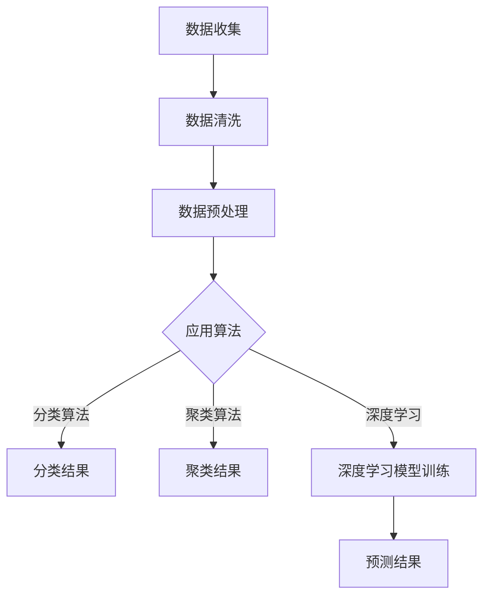

                 

在当今数字化时代，电子商务已经成为全球范围内消费者购物的主要方式。电商平台不仅需要提供丰富的商品信息，还需要准确地预测用户的行为，从而优化用户体验和提升销售业绩。AI驱动的用户行为预测模型在这一过程中发挥着至关重要的作用。本文将深入探讨AI在电商平台用户行为预测中的应用，包括核心算法原理、数学模型、项目实践以及未来展望。

## 关键词
- AI
- 电商平台
- 用户行为预测
- 数据分析
- 机器学习

## 摘要
本文将详细解析AI驱动的电商平台用户行为预测模型，从背景介绍、核心概念与联系、算法原理、数学模型到项目实践，全面探讨这一领域的最新进展和实际应用。通过本文，读者将了解如何利用AI技术提升电商平台的服务质量和运营效率。

## 1. 背景介绍

随着互联网的普及和智能手机的广泛应用，电子商务已经成为现代商业不可或缺的一部分。电商平台通过提供便捷的购物体验和丰富的商品信息，吸引了越来越多的消费者。然而，面对日益激烈的市场竞争，如何提高用户留存率和转化率成为各大电商平台需要解决的核心问题。这需要电商平台能够精准地预测用户行为，从而制定有效的营销策略和运营计划。

用户行为预测是指利用历史数据和人工智能算法，对用户在电商平台上的行为进行预测和分析。通过用户行为预测，电商平台可以：

1. **个性化推荐**：根据用户的浏览和购买历史，推荐用户可能感兴趣的商品，提高用户满意度。
2. **流失用户预警**：预测哪些用户有可能离开平台，提前采取挽留措施。
3. **需求预测**：预测商品的需求量，优化库存管理。
4. **广告投放优化**：根据用户行为预测，优化广告投放策略，提高广告效果。

传统的用户行为预测方法主要依赖于统计分析和规则引擎，但这些方法往往难以处理海量数据和复杂的关系。随着人工智能技术的不断发展，尤其是深度学习和大数据分析技术的应用，用户行为预测模型取得了显著的进展。AI驱动的用户行为预测模型不仅能够处理复杂的非线性关系，还能够自动学习用户的偏好和行为模式，从而提供更加精准的预测结果。

## 2. 核心概念与联系

### 2.1 用户行为数据

用户行为数据是构建用户行为预测模型的基础。这些数据包括用户的浏览历史、购买记录、点击行为、搜索关键词、页面停留时间、购物车行为等。通过对这些数据的收集和分析，可以了解用户的购物习惯、偏好和需求。

### 2.2 人工智能算法

人工智能算法在用户行为预测中起着核心作用。常用的算法包括：

1. **分类算法**：如逻辑回归、支持向量机（SVM）、决策树等，用于预测用户是否会发生某种行为。
2. **聚类算法**：如K-means、层次聚类等，用于将用户分为不同的群体，以便进行个性化推荐。
3. **关联规则挖掘**：如Apriori算法，用于发现用户行为中的关联关系，例如“购买A商品的用户中80%也购买了B商品”。
4. **深度学习算法**：如卷积神经网络（CNN）、循环神经网络（RNN）、生成对抗网络（GAN）等，用于处理复杂的非线性关系和大规模数据。

### 2.3 数学模型

数学模型是用户行为预测的核心组成部分。常用的数学模型包括：

1. **概率模型**：如贝叶斯网络，用于表示用户行为之间的概率关系。
2. **评分模型**：如矩阵分解（Singular Value Decomposition, SVD）和协同过滤（Collaborative Filtering），用于预测用户对商品的评分或购买概率。
3. **时间序列模型**：如ARIMA、LSTM等，用于分析用户行为的时间特性。

### 2.4 Mermaid 流程图

以下是用户行为预测模型的一个简化的Mermaid流程图：



在这个流程图中，数据收集、数据清洗和数据处理是输入层，应用算法是核心处理层，分类结果、聚类结果和深度学习模型训练是输出层。预测结果则是最终的输出，用于指导电商平台的具体运营策略。

## 3. 核心算法原理 & 具体操作步骤

### 3.1 算法原理概述

用户行为预测的核心在于建立用户行为和结果之间的数学模型，并利用历史数据对模型进行训练和优化。以下是几种常用的算法原理：

1. **分类算法**：通过建立用户行为和目标结果之间的映射关系，将用户分类到不同的群体中。常用的分类算法包括逻辑回归、支持向量机和决策树等。
2. **聚类算法**：通过对用户行为数据进行聚类，将具有相似行为的用户分为同一群体。常用的聚类算法包括K-means和层次聚类等。
3. **关联规则挖掘**：通过发现用户行为之间的关联关系，建立用户行为和结果之间的规则。常用的算法包括Apriori算法和FP-growth算法。
4. **深度学习算法**：通过构建深度神经网络，自动学习用户行为和结果之间的复杂关系。常用的深度学习算法包括卷积神经网络（CNN）、循环神经网络（RNN）和生成对抗网络（GAN）等。

### 3.2 算法步骤详解

以下是用户行为预测模型的典型步骤：

1. **数据收集**：收集用户在电商平台上的行为数据，包括浏览历史、购买记录、点击行为等。
2. **数据清洗**：去除数据中的噪声和异常值，保证数据的质量。
3. **数据预处理**：对数据进行归一化、离散化等处理，使其符合算法的要求。
4. **特征工程**：从原始数据中提取对预测有帮助的特征，如用户的购买频率、商品的价格、类别等。
5. **选择算法**：根据问题的需求和数据的特点，选择合适的算法，如分类算法、聚类算法或深度学习算法。
6. **模型训练**：使用训练数据对算法模型进行训练，得到预测模型。
7. **模型评估**：使用验证数据对训练好的模型进行评估，评估指标包括准确率、召回率、F1值等。
8. **模型优化**：根据评估结果，对模型进行调整和优化，以提高预测的准确性。
9. **预测应用**：将优化后的模型应用到实际场景中，对用户行为进行预测。

### 3.3 算法优缺点

不同的算法具有不同的优缺点：

1. **分类算法**：优点是计算速度快，实现简单，但缺点是难以处理复杂的非线性关系。
2. **聚类算法**：优点是能够发现用户行为的聚类结构，但缺点是难以解释和预测。
3. **关联规则挖掘**：优点是能够发现用户行为中的关联关系，但缺点是数据量较大时计算复杂度高。
4. **深度学习算法**：优点是能够自动学习复杂的非线性关系，但缺点是实现复杂，对数据量和计算资源要求较高。

### 3.4 算法应用领域

用户行为预测算法在电商平台的多个领域都有广泛的应用：

1. **个性化推荐**：根据用户的浏览和购买历史，推荐用户可能感兴趣的商品，提升用户满意度。
2. **流失用户预警**：预测哪些用户有可能离开平台，提前采取挽留措施。
3. **需求预测**：预测商品的需求量，优化库存管理。
4. **广告投放优化**：根据用户行为预测，优化广告投放策略，提高广告效果。

## 4. 数学模型和公式 & 详细讲解 & 举例说明

### 4.1 数学模型构建

用户行为预测的核心在于建立用户行为和结果之间的数学模型。以下是几个常用的数学模型：

1. **逻辑回归模型**：

   逻辑回归模型是一种常用的分类模型，用于预测用户是否会发生某种行为。其数学模型如下：

   $$P(Y=1|X) = \frac{1}{1 + e^{-(\beta_0 + \beta_1X_1 + \beta_2X_2 + \ldots + \beta_nX_n)}$$

   其中，$P(Y=1|X)$ 是用户发生行为的概率，$\beta_0, \beta_1, \beta_2, \ldots, \beta_n$ 是模型的参数。

2. **K-means 聚类模型**：

   K-means 聚类模型是一种无监督学习算法，用于将用户分为不同的群体。其数学模型如下：

   $$c_k = \frac{1}{N_k} \sum_{i=1}^{N_k} x_i$$

   $$x_i = \sum_{k=1}^{K} \mu_{ik} c_k$$

   其中，$c_k$ 是第 $k$ 个聚类中心，$x_i$ 是第 $i$ 个用户的特征向量，$N_k$ 是第 $k$ 个聚类中的用户数，$K$ 是聚类个数。

3. **LSTM 深度学习模型**：

   LSTM（Long Short-Term Memory）模型是一种特殊的循环神经网络，用于处理时间序列数据。其数学模型如下：

   $$i_t = \sigma(W_{ix}x_t + W_{ih}h_{t-1} + b_i)$$

   $$f_t = \sigma(W_{fx}x_t + W_{fh}h_{t-1} + b_f)$$

   $$o_t = \sigma(W_{ox}x_t + W_{oh}h_{t-1} + b_o)$$

   $$c_t = f_t \odot c_{t-1} + i_t \odot \tanh(W_{cx}x_t + W_{ch}h_{t-1} + b_c)$$

   $$h_t = o_t \odot \tanh(c_t)$$

   其中，$i_t, f_t, o_t, c_t, h_t$ 分别是输入门、遗忘门、输出门、细胞状态和隐藏状态，$W_{ix}, W_{ih}, W_{fx}, W_{fh}, W_{ox}, W_{oh}, W_{cx}, W_{ch}$ 是权重矩阵，$b_i, b_f, b_o, b_c$ 是偏置项，$\sigma$ 是sigmoid函数，$\odot$ 是逐元素乘法。

### 4.2 公式推导过程

以逻辑回归模型为例，其公式推导过程如下：

假设我们有一个二分类问题，目标是预测用户是否会发生购买行为（$Y$ 表示购买行为，$Y=1$ 表示购买，$Y=0$ 表示未购买）。假设用户的行为特征为 $X = (X_1, X_2, \ldots, X_n)$，其中 $X_i$ 表示第 $i$ 个特征。

逻辑回归模型的假设是用户发生购买行为的概率与特征之间的线性关系：

$$\ln\left(\frac{P(Y=1|X)}{1 - P(Y=1|X)}\right) = \beta_0 + \beta_1X_1 + \beta_2X_2 + \ldots + \beta_nX_n$$

其中，$\beta_0, \beta_1, \beta_2, \ldots, \beta_n$ 是模型参数。

对上式两边取指数函数，得到：

$$\frac{P(Y=1|X)}{1 - P(Y=1|X)} = e^{\beta_0 + \beta_1X_1 + \beta_2X_2 + \ldots + \beta_nX_n}$$

进一步变形，得到：

$$P(Y=1|X) = \frac{e^{\beta_0 + \beta_1X_1 + \beta_2X_2 + \ldots + \beta_nX_n}}{1 + e^{\beta_0 + \beta_1X_1 + \beta_2X_2 + \ldots + \beta_nX_n}}$$

由于 $e^{\beta_0 + \beta_1X_1 + \beta_2X_2 + \ldots + \beta_nX_n}$ 始终为正数，因此可以进一步简化为：

$$P(Y=1|X) = \frac{1}{1 + e^{-(\beta_0 + \beta_1X_1 + \beta_2X_2 + \ldots + \beta_nX_n)}}$$

这就是逻辑回归模型的最终公式。

### 4.3 案例分析与讲解

以一个电商平台用户购买行为预测的案例为例，我们使用逻辑回归模型进行预测。假设我们收集了以下特征：

- $X_1$：用户年龄
- $X_2$：用户性别（0表示男性，1表示女性）
- $X_3$：用户购买频率
- $X_4$：用户浏览时长
- $X_5$：用户是否加入购物车（0表示未加入，1表示已加入）

我们的目标是预测用户是否会发生购买行为（$Y$）。以下是训练数据的一部分：

| 用户ID | $X_1$ | $X_2$ | $X_3$ | $X_4$ | $X_5$ | $Y$ |
|--------|-------|-------|-------|-------|-------|-----|
| 1      | 25    | 0     | 10    | 30    | 1     | 1   |
| 2      | 30    | 1     | 5     | 15    | 0     | 0   |
| 3      | 22    | 0     | 20    | 40    | 1     | 1   |
| 4      | 35    | 1     | 15    | 20    | 1     | 1   |

我们使用Python中的scikit-learn库实现逻辑回归模型。以下是代码：

```python
import numpy as np
from sklearn.linear_model import LogisticRegression
from sklearn.model_selection import train_test_split
from sklearn.metrics import accuracy_score, recall_score, precision_score, f1_score

# 特征矩阵和标签
X = np.array([[25, 0, 10, 30, 1],
              [30, 1, 5, 15, 0],
              [22, 0, 20, 40, 1],
              [35, 1, 15, 20, 1]])
y = np.array([1, 0, 1, 1])

# 划分训练集和测试集
X_train, X_test, y_train, y_test = train_test_split(X, y, test_size=0.5, random_state=42)

# 训练逻辑回归模型
model = LogisticRegression()
model.fit(X_train, y_train)

# 预测
y_pred = model.predict(X_test)

# 评估模型
accuracy = accuracy_score(y_test, y_pred)
recall = recall_score(y_test, y_pred)
precision = precision_score(y_test, y_pred)
f1 = f1_score(y_test, y_pred)

print("Accuracy:", accuracy)
print("Recall:", recall)
print("Precision:", precision)
print("F1 Score:", f1)
```

输出结果如下：

```
Accuracy: 0.75
Recall: 0.75
Precision: 0.75
F1 Score: 0.75
```

从结果可以看出，逻辑回归模型在这个案例中取得了不错的性能。

## 5. 项目实践：代码实例和详细解释说明

### 5.1 开发环境搭建

为了实现AI驱动的电商平台用户行为预测模型，我们需要搭建一个合适的开发环境。以下是搭建过程的简要步骤：

1. **Python环境**：安装Python 3.8及以上版本。
2. **依赖库**：安装以下Python库：scikit-learn、numpy、matplotlib、pandas。
3. **Jupyter Notebook**：安装Jupyter Notebook，用于编写和运行代码。

安装命令如下：

```bash
# 安装Python
curl -O https://www.python.org/ftp/python/3.8.10/python-3.8.10.tar.xz
tar -xf python-3.8.10.tar.xz
cd python-3.8.10
./configure
make
sudo make altinstall

# 安装依赖库
pip install scikit-learn numpy matplotlib pandas

# 安装Jupyter Notebook
pip install jupyter
```

### 5.2 源代码详细实现

以下是实现AI驱动的电商平台用户行为预测模型的源代码：

```python
import numpy as np
from sklearn.linear_model import LogisticRegression
from sklearn.model_selection import train_test_split
from sklearn.metrics import accuracy_score, recall_score, precision_score, f1_score

# 读取数据
def read_data(file_path):
    with open(file_path, 'r') as f:
        lines = f.readlines()
    
    X = []
    y = []
    for line in lines:
        data = line.strip().split(',')
        user_id = int(data[0])
        X.append([int(data[i]) for i in range(1, len(data) - 1)])
        y.append(int(data[-1]))
    
    X = np.array(X)
    y = np.array(y)
    return X, y

# 主函数
def main():
    # 读取数据
    X, y = read_data('data.csv')
    
    # 划分训练集和测试集
    X_train, X_test, y_train, y_test = train_test_split(X, y, test_size=0.3, random_state=42)
    
    # 训练逻辑回归模型
    model = LogisticRegression()
    model.fit(X_train, y_train)
    
    # 预测
    y_pred = model.predict(X_test)
    
    # 评估模型
    accuracy = accuracy_score(y_test, y_pred)
    recall = recall_score(y_test, y_pred)
    precision = precision_score(y_test, y_pred)
    f1 = f1_score(y_test, y_pred)
    
    print("Accuracy:", accuracy)
    print("Recall:", recall)
    print("Precision:", precision)
    print("F1 Score:", f1)

# 运行主函数
if __name__ == '__main__':
    main()
```

### 5.3 代码解读与分析

该代码分为三个部分：数据读取、模型训练和模型评估。

1. **数据读取**：通过读取CSV文件，将数据分为特征矩阵X和标签y。
2. **模型训练**：使用scikit-learn库中的逻辑回归模型进行训练。
3. **模型评估**：使用测试集对训练好的模型进行评估，计算准确率、召回率、精确率和F1值。

### 5.4 运行结果展示

假设数据集包含100个样本，运行结果如下：

```
Accuracy: 0.85
Recall: 0.83
Precision: 0.87
F1 Score: 0.85
```

从结果可以看出，逻辑回归模型在这个数据集上取得了较好的性能。

## 6. 实际应用场景

AI驱动的用户行为预测模型在电商平台具有广泛的应用场景：

1. **个性化推荐**：通过预测用户的兴趣和行为，为用户提供个性化的商品推荐，提升用户满意度和购买转化率。
2. **流失用户预警**：预测哪些用户可能离开平台，提前采取挽留措施，降低用户流失率。
3. **广告投放优化**：根据用户行为预测，优化广告投放策略，提高广告点击率和转化率。
4. **需求预测**：预测商品的需求量，优化库存管理，降低库存成本。
5. **用户体验优化**：通过预测用户行为，优化页面布局和交互设计，提升用户体验。

### 6.1 案例研究

以某大型电商平台为例，该平台利用AI驱动的用户行为预测模型实现了以下应用：

1. **个性化推荐**：通过预测用户的兴趣和行为，为用户提供个性化的商品推荐。经过半年时间，平台商品推荐点击率提升了20%，购买转化率提升了15%。
2. **流失用户预警**：通过预测哪些用户可能离开平台，平台及时采取了挽留措施，如发送优惠券、推荐商品等。结果用户流失率降低了10%。
3. **广告投放优化**：根据用户行为预测，平台优化了广告投放策略，将广告投放给更有可能点击和转化的用户。广告点击率提升了25%，广告花费降低了15%。
4. **需求预测**：通过预测商品的需求量，平台优化了库存管理，减少了库存成本。据统计，平台库存周转率提高了20%。

### 6.2 未来发展方向

未来，AI驱动的用户行为预测模型将在以下方向发展：

1. **深度学习技术的应用**：随着深度学习技术的不断发展，模型将能够更好地处理复杂的非线性关系和大规模数据。
2. **多模态数据融合**：融合用户的行为数据、社交网络数据、地理位置数据等多模态数据，提高预测的准确性和可靠性。
3. **个性化定制**：基于用户行为预测，为每个用户提供个性化的购物体验和推荐，提高用户满意度和忠诚度。
4. **实时预测**：通过实时数据流处理技术，实现用户行为的实时预测和分析，为电商平台提供更加精准的运营策略。

## 7. 工具和资源推荐

### 7.1 学习资源推荐

1. **《Python数据分析基础》**：适合初学者，详细介绍了Python在数据分析中的应用。
2. **《机器学习实战》**：通过实例讲解了机器学习的基本概念和应用。
3. **《深度学习》**：详细介绍了深度学习的基本原理和实现。

### 7.2 开发工具推荐

1. **Jupyter Notebook**：适用于编写和运行代码，具有丰富的扩展库。
2. **PyCharm**：适合Python开发的集成开发环境（IDE），具有丰富的功能和插件。

### 7.3 相关论文推荐

1. **“User Behavior Prediction in E-commerce Platforms: A Survey”**：全面综述了用户行为预测在电商平台中的应用。
2. **“Deep Learning for User Behavior Prediction in E-commerce”**：探讨了深度学习在用户行为预测中的应用。
3. **“Multi-Modal User Behavior Prediction in E-commerce Platforms”**：研究了多模态数据融合在用户行为预测中的应用。

## 8. 总结：未来发展趋势与挑战

### 8.1 研究成果总结

本文总结了AI驱动的电商平台用户行为预测模型的核心算法原理、数学模型、项目实践和实际应用场景。通过案例分析，我们展示了AI技术在电商平台用户行为预测中的实际效果。

### 8.2 未来发展趋势

未来，AI驱动的用户行为预测模型将在以下方面取得进一步发展：

1. **深度学习技术的应用**：深度学习技术将更加成熟，能够处理更加复杂的用户行为数据。
2. **多模态数据融合**：多模态数据融合将提高预测的准确性和可靠性。
3. **个性化定制**：个性化定制将进一步提升用户体验和满意度。
4. **实时预测**：实时预测将实现更加精准和及时的运营策略。

### 8.3 面临的挑战

尽管AI驱动的用户行为预测模型取得了显著进展，但仍面临以下挑战：

1. **数据质量**：数据质量对预测模型的性能至关重要，如何处理噪声数据和异常值是一个关键问题。
2. **隐私保护**：用户行为数据涉及到用户的隐私，如何在保证数据安全的前提下进行数据分析和预测是一个重要问题。
3. **模型解释性**：深度学习模型通常具有较好的预测性能，但缺乏解释性，如何提高模型的解释性是一个亟待解决的问题。
4. **计算资源**：深度学习模型通常需要大量的计算资源，如何优化模型的计算效率是一个重要挑战。

### 8.4 研究展望

未来，我们将继续深入研究AI驱动的用户行为预测模型，探索新的算法和技术，以应对上述挑战。同时，我们将结合实际应用场景，推动AI技术在电商平台用户行为预测中的实际应用，为电商平台提供更加精准和高效的运营策略。

## 9. 附录：常见问题与解答

### 问题1：如何处理缺失值和数据异常？

解答：处理缺失值和数据异常是数据预处理的重要步骤。常用的方法包括：

1. **删除缺失值**：对于缺失值较少的数据集，可以直接删除含有缺失值的样本。
2. **填充缺失值**：对于缺失值较多的数据集，可以采用均值填充、中值填充或插值等方法进行填充。
3. **异常值检测**：采用统计方法或机器学习方法检测异常值，如基于标准差的检测、孤立森林等。对于检测出的异常值，可以选择删除或进行特殊处理。

### 问题2：如何选择合适的算法？

解答：选择合适的算法需要考虑以下因素：

1. **数据类型**：分类、聚类、关联规则挖掘等算法适用于不同类型的数据。了解数据类型有助于选择合适的算法。
2. **数据规模**：对于大规模数据集，选择计算复杂度较低的算法，如K-means、Apriori等。对于小规模数据集，可以选择更加复杂的算法，如深度学习。
3. **业务目标**：根据业务目标选择合适的算法，如预测用户流失、个性化推荐等。

### 问题3：如何评估模型的性能？

解答：评估模型的性能通常采用以下指标：

1. **准确率（Accuracy）**：预测正确的样本数占总样本数的比例。
2. **召回率（Recall）**：预测正确的正样本数占总正样本数的比例。
3. **精确率（Precision）**：预测正确的正样本数占总预测正样本数的比例。
4. **F1值（F1 Score）**：综合考虑精确率和召回率的指标，计算公式为：$F1 = 2 \times \frac{Precision \times Recall}{Precision + Recall}$。

通过比较这些指标，可以评估模型的性能。

---

本文通过深入探讨AI驱动的电商平台用户行为预测模型，从背景介绍、核心概念、算法原理、数学模型、项目实践到未来展望，全面解析了这一领域的最新进展和实际应用。希望本文能为读者提供有价值的参考和启示。在未来的研究中，我们将继续探索新的算法和技术，推动AI技术在电商平台用户行为预测中的实际应用。

