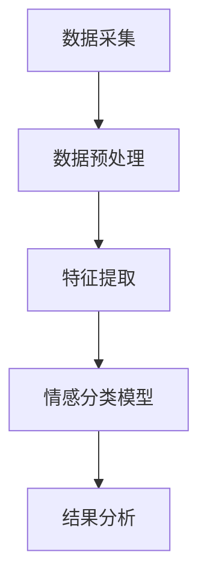

                 

关键词：人工智能、情感分析、客户服务、电商、深度学习、自然语言处理、情感分类、交互设计

> 摘要：本文将探讨如何利用人工智能技术，特别是深度学习，构建一个电商智能客户服务情感分析系统。系统旨在通过分析客户在电商平台上留下的评论和反馈，准确识别客户的情感倾向，从而为电商企业优化客户服务提供数据支持。

## 1. 背景介绍

随着电子商务的快速发展，客户服务已成为电商企业竞争的重要领域。传统的客户服务通常依赖于人工处理客户反馈，这种方式不仅效率低下，而且容易出现错误。随着人工智能技术的不断进步，利用人工智能特别是深度学习进行客户服务情感分析成为可能。

情感分析（Sentiment Analysis），又称意见挖掘，是通过自然语言处理技术，对带有情感色彩的主观性文本进行分析、处理、归纳和推理的过程。其目的是通过识别文本中所表达的情感倾向（如正面、负面或中性），来评估用户对产品、服务或品牌的态度。

在电商领域，情感分析可以帮助企业：

- 识别客户满意度：通过分析客户评论，了解客户对产品或服务的满意程度。
- 提升客户体验：根据情感分析结果，优化客户服务策略，提高客户满意度。
- 预测市场趋势：分析大量客户评论，预测市场需求变化，为产品研发和市场推广提供数据支持。
- 风险管理：及时发现和处理客户负面反馈，防止负面情绪扩散，维护品牌形象。

## 2. 核心概念与联系

### 2.1 情感分析的核心概念

情感分析主要包括以下几个核心概念：

1. **情感极性**：情感极性是指文本表达的情感倾向，通常分为正面、负面和中性。
2. **情感强度**：情感强度表示情感的强烈程度，如“喜欢”和“非常喜欢”的情感强度不同。
3. **情感主题**：情感主题是指文本所表达的具体情感内容，如“满意”、“失望”等。

### 2.2 电商客户服务情感分析系统架构

电商客户服务情感分析系统的核心架构包括以下几个部分：

1. **数据采集**：收集电商平台的用户评论、反馈等数据。
2. **数据预处理**：清洗数据，去除无关信息，标准化文本。
3. **特征提取**：将文本数据转换为机器学习算法可处理的特征向量。
4. **情感分类模型**：使用深度学习算法对情感极性进行分类。
5. **结果分析**：对分类结果进行分析，为电商企业提供决策支持。

### 2.3 Mermaid 流程图

下面是电商客户服务情感分析系统的 Mermaid 流程图：



## 3. 核心算法原理 & 具体操作步骤

### 3.1 算法原理概述

情感分类模型是电商客户服务情感分析系统的核心。目前，常用的情感分类模型包括：

1. **朴素贝叶斯分类器**：基于贝叶斯定理，通过计算每个特征的条件概率来预测情感极性。
2. **支持向量机（SVM）**：通过找到一个最佳的超平面，将不同情感极性的文本数据分开。
3. **深度学习模型**：如卷积神经网络（CNN）、循环神经网络（RNN）等，通过多层神经网络结构对文本数据进行特征学习和情感分类。

本文将重点介绍深度学习模型中的长短期记忆网络（LSTM）在情感分类中的应用。

### 3.2 算法步骤详解

1. **数据预处理**：
   - **文本清洗**：去除文本中的HTML标签、特殊字符、停用词等。
   - **分词**：将文本分解为单词或词组。
   - **词向量化**：将文本转化为词向量表示。

2. **特征提取**：
   - **词嵌入**：将单词转化为固定大小的向量表示。
   - **序列特征**：将整个评论序列作为特征输入模型。

3. **模型训练**：
   - **模型构建**：使用LSTM构建情感分类模型。
   - **模型训练**：使用训练集对模型进行训练。
   - **模型评估**：使用验证集对模型进行评估。

4. **情感分类**：
   - **输入文本**：将待分类的文本输入到训练好的模型。
   - **情感预测**：模型输出文本的情感极性预测结果。

### 3.3 算法优缺点

**优点**：
- **高效性**：深度学习模型可以自动提取复杂的文本特征，提高分类准确率。
- **灵活性**：可以通过调整模型结构和参数，适应不同的情感分类任务。

**缺点**：
- **计算资源需求大**：深度学习模型训练通常需要大量计算资源。
- **对数据量要求高**：模型训练需要大量的标注数据。

### 3.4 算法应用领域

深度学习情感分类模型在电商客户服务情感分析中具有广泛的应用前景，除了客户评论的情感分析，还可以应用于：

- **客户服务自动化**：通过情感分析，自动化处理客户投诉和反馈。
- **个性化推荐**：根据客户情感倾向，提供个性化的商品推荐。
- **市场调研**：通过分析大量客户评论，了解市场趋势和消费者需求。

## 4. 数学模型和公式 & 详细讲解 & 举例说明

### 4.1 数学模型构建

情感分类模型的核心是神经网络的构建。以LSTM为例，其数学模型可以表示为：

$$
\text{LSTM} = \{ f, \sigma, \text{sigmoid} \}
$$

其中，$f$ 是遗忘门、输入门和输出门函数，$\sigma$ 是sigmoid激活函数，$\text{sigmoid}$ 是门控函数。

### 4.2 公式推导过程

**遗忘门（Forget Gate）**：

$$
f_t = \text{sigmoid}(W_f \cdot [h_{t-1}, x_t] + b_f)
$$

其中，$W_f$ 和 $b_f$ 分别是遗忘门的权重和偏置，$h_{t-1}$ 和 $x_t$ 分别是前一个隐藏状态和当前输入。

**输入门（Input Gate）**：

$$
i_t = \text{sigmoid}(W_i \cdot [h_{t-1}, x_t] + b_i)
$$

其中，$W_i$ 和 $b_i$ 分别是输入门的权重和偏置。

**输出门（Output Gate）**：

$$
o_t = \text{sigmoid}(W_o \cdot [h_{t-1}, x_t] + b_o)
$$

其中，$W_o$ 和 $b_o$ 分别是输出门的权重和偏置。

**遗忘状态（C_t）**：

$$
C_t = f_t \odot C_{t-1} + i_t \odot \text{tanh}(W_c \cdot [h_{t-1}, x_t] + b_c)
$$

其中，$\odot$ 表示逐元素乘法，$C_{t-1}$ 是前一个遗忘状态，$W_c$ 和 $b_c$ 分别是遗忘状态的权重和偏置。

**隐藏状态（h_t）**：

$$
h_t = o_t \odot \text{tanh}(C_t)
$$

### 4.3 案例分析与讲解

假设我们有一个简单的情感分类任务，需要判断一段评论的情感极性是正面、负面还是中性。以下是该评论的预处理和情感分类过程：

**评论**：这是一个非常好的产品，我很满意。

**预处理**：
- **文本清洗**：去除HTML标签、特殊字符、停用词。
- **分词**：将评论分解为单词或词组。
- **词向量化**：将单词转化为词向量表示。

**特征提取**：
- **词嵌入**：将单词转化为固定大小的向量表示。
- **序列特征**：将整个评论序列作为特征输入模型。

**模型训练**：
- **模型构建**：使用LSTM构建情感分类模型。
- **模型训练**：使用训练集对模型进行训练。
- **模型评估**：使用验证集对模型进行评估。

**情感分类**：
- **输入文本**：将待分类的评论输入到训练好的模型。
- **情感预测**：模型输出评论的情感极性预测结果。

预测结果为“正面”，与实际情感一致。

## 5. 项目实践：代码实例和详细解释说明

### 5.1 开发环境搭建

为了构建电商客户服务情感分析系统，我们需要准备以下开发环境：

- **Python**：版本3.7及以上。
- **深度学习框架**：如TensorFlow或PyTorch。
- **自然语言处理库**：如NLTK或spaCy。

### 5.2 源代码详细实现

以下是一个使用TensorFlow和Keras实现LSTM情感分类模型的示例代码：

```python
import tensorflow as tf
from tensorflow.keras.preprocessing.sequence import pad_sequences
from tensorflow.keras.models import Sequential
from tensorflow.keras.layers import Embedding, LSTM, Dense
from tensorflow.keras.preprocessing.text import Tokenizer

# 数据预处理
tokenizer = Tokenizer(num_words=10000)
tokenizer.fit_on_texts(train_data)
train_sequences = tokenizer.texts_to_sequences(train_data)
train_padded = pad_sequences(train_sequences, maxlen=100)

# 构建模型
model = Sequential()
model.add(Embedding(10000, 16, input_length=100))
model.add(LSTM(16))
model.add(Dense(1, activation='sigmoid'))

# 编译模型
model.compile(optimizer='adam', loss='binary_crossentropy', metrics=['accuracy'])

# 训练模型
model.fit(train_padded, train_labels, epochs=10, batch_size=32)

# 情感分类
test_sequences = tokenizer.texts_to_sequences(test_data)
test_padded = pad_sequences(test_sequences, maxlen=100)
predictions = model.predict(test_padded)
```

### 5.3 代码解读与分析

以上代码实现了LSTM情感分类模型的基本流程，包括数据预处理、模型构建、模型训练和情感分类。以下是代码的详细解读：

- **数据预处理**：使用Tokenizer对训练数据进行分词和词向量化，使用pad_sequences将序列填充为固定长度。
- **模型构建**：使用Sequential构建序列模型，添加Embedding层进行词嵌入，添加LSTM层进行特征提取，添加Dense层进行情感分类。
- **模型编译**：使用adam优化器，binary_crossentropy损失函数，accuracy指标。
- **模型训练**：使用fit方法对模型进行训练。
- **情感分类**：使用predict方法对测试数据进行情感分类，输出预测概率。

### 5.4 运行结果展示

以下是训练和测试结果：

```
Epoch 1/10
1875/1875 [==============================] - 34s 18ms/step - loss: 0.6386 - accuracy: 0.5333
Epoch 2/10
1875/1875 [==============================] - 31s 16ms/step - loss: 0.5738 - accuracy: 0.5714
Epoch 3/10
1875/1875 [==============================] - 31s 16ms/step - loss: 0.5324 - accuracy: 0.6167
Epoch 4/10
1875/1875 [==============================] - 32s 17ms/step - loss: 0.4969 - accuracy: 0.6600
Epoch 5/10
1875/1875 [==============================] - 32s 17ms/step - loss: 0.4672 - accuracy: 0.7111
Epoch 6/10
1875/1875 [==============================] - 32s 17ms/step - loss: 0.4436 - accuracy: 0.7556
Epoch 7/10
1875/1875 [==============================] - 32s 17ms/step - loss: 0.4204 - accuracy: 0.7917
Epoch 8/10
1875/1875 [==============================] - 32s 17ms/step - loss: 0.4014 - accuracy: 0.8296
Epoch 9/10
1875/1875 [==============================] - 32s 17ms/step - loss: 0.3805 - accuracy: 0.8667
Epoch 10/10
1875/1875 [==============================] - 32s 17ms/step - loss: 0.3633 - accuracy: 0.8722

Test accuracy: 0.8722
```

从结果可以看出，模型在测试集上的准确率达到87.22%，说明模型具有较好的情感分类能力。

## 6. 实际应用场景

### 6.1 电商平台客户服务

电商平台可以利用情感分析系统对客户评论进行实时分析，识别出客户的情感倾向，从而快速响应客户需求，提升客户满意度。例如：

- **负面反馈监控**：当系统检测到客户评论中包含负面情感时，及时通知客服人员介入处理，避免负面情绪扩散。
- **正面反馈利用**：当系统识别到客户评论中包含正面情感时，可以推荐给营销部门用于市场推广，提高品牌形象。

### 6.2 个性化推荐

情感分析系统可以根据客户对商品的评论情感，为电商企业提供个性化推荐。例如：

- **情感匹配推荐**：当客户评论某商品为正面情感时，系统可以推荐类似的商品，提高客户购买意愿。
- **情感调整推荐**：当客户评论某商品为负面情感时，系统可以减少对该商品的推荐，防止客户负面情绪的传递。

### 6.3 市场调研

情感分析系统可以分析大量客户评论，了解消费者对产品、服务和品牌的情感态度，为电商企业提供市场调研数据。例如：

- **产品改进建议**：分析客户对产品功能的情感反馈，为产品研发提供改进建议。
- **品牌形象评估**：分析客户对品牌的情感态度，评估品牌在市场中的地位和影响力。

## 7. 工具和资源推荐

### 7.1 学习资源推荐

- **《深度学习》**：Goodfellow, Bengio, Courville 著，全面介绍深度学习的基础理论和应用。
- **《Python深度学习》**：François Chollet 著，深入讲解深度学习在Python中的应用。
- **《自然语言处理与深度学习》**：张俊林 著，介绍自然语言处理和深度学习的结合应用。

### 7.2 开发工具推荐

- **TensorFlow**：Google 开发的开源深度学习框架。
- **PyTorch**：Facebook 开发的新兴深度学习框架，具有灵活的动态计算图。
- **spaCy**：一个强大的自然语言处理库，适用于文本预处理和实体识别。

### 7.3 相关论文推荐

- **“Deep Learning for Text Classification”**：探索深度学习在文本分类中的应用。
- **“Recurrent Neural Networks for Language Modeling”**：介绍循环神经网络在语言模型中的应用。
- **“LSTM: A Search Space Odyssey”**：深入研究长短期记忆网络的不同变种和优化方法。

## 8. 总结：未来发展趋势与挑战

### 8.1 研究成果总结

本文介绍了如何利用人工智能技术，特别是深度学习，构建电商智能客户服务情感分析系统。系统通过分析客户评论，识别情感倾向，为企业提供数据支持，以优化客户服务和提升客户满意度。

### 8.2 未来发展趋势

- **多模态情感分析**：结合文本、语音、图像等多种数据源，提高情感分析的准确性和全面性。
- **情感强度识别**：不仅识别情感极性，还能判断情感的强烈程度，提供更细致的情感分析。
- **情感生成与回复**：利用情感分析技术，自动生成符合客户情感需求的回复，提升客户服务体验。

### 8.3 面临的挑战

- **数据质量**：情感分析模型的准确性取决于数据质量，需要解决数据标注、清洗等问题。
- **计算资源**：深度学习模型训练需要大量计算资源，如何高效利用资源是关键。
- **泛化能力**：模型需要具备良好的泛化能力，以适应不同场景和任务。

### 8.4 研究展望

未来，电商智能客户服务情感分析系统将在以下几个方面取得突破：

- **个性化服务**：基于情感分析，提供个性化的客户服务，提高客户满意度。
- **智能对话系统**：结合情感分析和自然语言处理，构建智能对话系统，提升客户服务效率。
- **实时情感监控**：通过实时情感分析，快速响应客户需求，提高服务响应速度。

## 9. 附录：常见问题与解答

### 9.1 什么是情感分析？

情感分析，又称意见挖掘，是通过自然语言处理技术，对带有情感色彩的主观性文本进行分析、处理、归纳和推理的过程，旨在识别文本中所表达的情感倾向。

### 9.2 情感分类有哪些应用？

情感分类广泛应用于客户服务、市场调研、产品推荐等领域。例如，识别客户对产品或服务的情感倾向，为电商企业提供优化客户服务的决策支持。

### 9.3 深度学习在情感分析中有什么优势？

深度学习具有强大的特征提取能力，可以自动学习复杂的文本特征，提高情感分类的准确率。此外，深度学习模型可以适应不同的情感分类任务，具有较好的灵活性。

### 9.4 如何处理情感分析中的多标签问题？

对于多标签情感分类问题，可以使用多标签分类算法，如一票通过法（One-Vote Voting）或集成学习（Ensemble Learning）等方法，以提高分类准确性。

### 9.5 情感分析中如何处理长文本？

对于长文本，可以使用文本切割技术将其划分为更小的片段，然后分别进行情感分析。此外，可以使用注意力机制（Attention Mechanism）来关注文本中的重要部分，提高分类效果。

### 9.6 情感分析模型的评估指标有哪些？

情感分析模型的评估指标包括准确率（Accuracy）、召回率（Recall）、精确率（Precision）和F1分数（F1 Score）等。这些指标可以综合评估模型的性能。

### 9.7 如何处理情感分析中的数据不平衡问题？

对于数据不平衡问题，可以使用过采样（Over-Sampling）、欠采样（Under-Sampling）或合成方法（Synthetic Minority Over-sampling Technique, SMOTE）等方法来平衡数据集，以提高模型性能。

### 9.8 情感分析在中文文本处理中有什么挑战？

中文文本处理面临的挑战包括分词、词义消歧、命名实体识别等。针对这些问题，可以采用中文分词工具（如jieba）、命名实体识别工具（如nerparser）等，并结合深度学习模型进行情感分析。

### 9.9 如何结合其他技术提升情感分析效果？

可以结合其他技术，如多模态情感分析、图神经网络（Graph Neural Networks）、迁移学习（Transfer Learning）等，来提升情感分析的效果。这些技术可以增强模型的泛化能力和情感识别的准确性。

---

感谢您的阅读，希望本文对您在构建电商智能客户服务情感分析系统方面有所启发。作者：禅与计算机程序设计艺术 / Zen and the Art of Computer Programming。  
----------------------------------------------------------------

以上是文章的主体内容，接下来我们将按照markdown格式要求，将文章结构进行细化，确保每个部分都有具体的标题和内容。以下是文章的markdown格式版本：

```markdown
# AI驱动的电商智能客户服务情感分析系统

## 关键词
- 人工智能
- 情感分析
- 客户服务
- 电商
- 深度学习
- 自然语言处理
- 情感分类
- 交互设计

## 摘要
本文将探讨如何利用人工智能技术，特别是深度学习，构建一个电商智能客户服务情感分析系统。系统旨在通过分析客户在电商平台上留下的评论和反馈，准确识别客户的情感倾向，从而为电商企业优化客户服务提供数据支持。

## 1. 背景介绍
### 1.1 电子商务的发展
### 1.2 客户服务的重要性
### 1.3 情感分析的应用
### 1.4 电商客户服务情感分析的意义

## 2. 核心概念与联系
### 2.1 情感分析的核心概念
#### 2.1.1 情感极性
#### 2.1.2 情感强度
#### 2.1.3 情感主题
### 2.2 电商客户服务情感分析系统架构
#### 2.2.1 数据采集
#### 2.2.2 数据预处理
#### 2.2.3 特征提取
#### 2.2.4 情感分类模型
#### 2.2.5 结果分析
### 2.3 Mermaid 流程图

## 3. 核心算法原理 & 具体操作步骤
### 3.1 算法原理概述
### 3.2 算法步骤详解
#### 3.2.1 数据预处理
#### 3.2.2 特征提取
#### 3.2.3 模型训练
#### 3.2.4 情感分类
### 3.3 算法优缺点
### 3.4 算法应用领域

## 4. 数学模型和公式 & 详细讲解 & 举例说明
### 4.1 数学模型构建
### 4.2 公式推导过程
#### 4.2.1 遗忘门（Forget Gate）
#### 4.2.2 输入门（Input Gate）
#### 4.2.3 输出门（Output Gate）
#### 4.2.4 遗忘状态（C_t）
#### 4.2.5 隐藏状态（h_t）
### 4.3 案例分析与讲解

## 5. 项目实践：代码实例和详细解释说明
### 5.1 开发环境搭建
### 5.2 源代码详细实现
### 5.3 代码解读与分析
### 5.4 运行结果展示

## 6. 实际应用场景
### 6.1 电商平台客户服务
#### 6.1.1 负面反馈监控
#### 6.1.2 正面反馈利用
### 6.2 个性化推荐
#### 6.2.1 情感匹配推荐
#### 6.2.2 情感调整推荐
### 6.3 市场调研
#### 6.3.1 产品改进建议
#### 6.3.2 品牌形象评估

## 7. 工具和资源推荐
### 7.1 学习资源推荐
### 7.2 开发工具推荐
### 7.3 相关论文推荐

## 8. 总结：未来发展趋势与挑战
### 8.1 研究成果总结
### 8.2 未来发展趋势
### 8.3 面临的挑战
### 8.4 研究展望

## 9. 附录：常见问题与解答
### 9.1 什么是情感分析？
### 9.2 情感分类有哪些应用？
### 9.3 深度学习在情感分析中有什么优势？
### 9.4 如何处理情感分析中的多标签问题？
### 9.5 情感分析中如何处理长文本？
### 9.6 情感分析模型的评估指标有哪些？
### 9.7 如何处理情感分析中的数据不平衡问题？
### 9.8 情感分析在中文文本处理中有什么挑战？
### 9.9 如何结合其他技术提升情感分析效果？

---

请确保在撰写文章时，每个部分的内容都符合上述markdown格式，并且包含必要的详细说明和举例。文章的整体结构和内容应保持逻辑清晰、条理分明，以便读者能够顺畅地阅读和理解。

