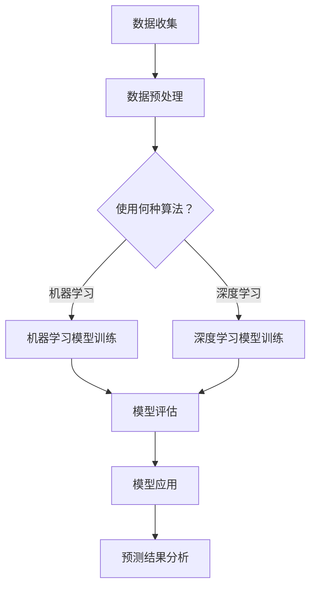

                 

 在电商行业，精准地预测用户的终身价值（Customer Lifetime Value，简称CLV）是提升企业收益的关键策略之一。传统的方法主要依赖于历史数据和统计模型，而随着人工智能技术的发展，特别是深度学习和大数据分析技术的应用，我们能够构建出更为精细和动态的预测模型。本文将探讨如何利用AI技术，特别是机器学习算法，实现电商用户终身价值的动态预测。

> **关键词：** 电商、用户终身价值、AI预测、机器学习、深度学习

> **摘要：** 本文首先介绍了电商用户终身价值的定义和传统预测方法的局限性。接着，我们探讨了基于AI的动态预测模型的核心概念和架构，详细阐述了机器学习和深度学习算法的应用原理。随后，通过数学模型和公式的推导，展示了如何构建和优化预测模型。文章随后提供了一个具体的代码实例，详细解释了模型的实现过程和结果分析。最后，我们探讨了AI驱动的用户终身价值预测在电商行业中的应用场景和未来展望。

## 1. 背景介绍

在电商行业，用户终身价值（CLV）是指一个客户在其与企业整个交易周期中可能为企业带来的总收益。CLV对于电商企业具有重要意义，它不仅帮助企业识别出高价值用户，还能指导营销策略的制定和资源的合理分配。传统的CLV预测方法通常依赖于历史数据和统计模型，如平均收益模型、时间序列模型和生存分析模型等。然而，这些方法存在一些局限性：

- **数据依赖性高**：传统方法需要大量的历史交易数据，数据质量直接影响预测效果。
- **预测时效性差**：基于历史数据的预测模型无法实时适应用户行为的变化。
- **模型适应性差**：传统模型在处理不同类型用户时表现不一，缺乏灵活性。

为了克服这些局限性，人工智能技术特别是机器学习和深度学习算法的应用为电商用户终身价值的预测带来了新的可能性。通过构建动态预测模型，可以实时分析用户行为，准确预测其未来的消费行为和终身价值。

## 2. 核心概念与联系

### 2.1. 机器学习算法

机器学习算法是一种让计算机通过数据和经验自主改进性能的技术。在电商用户终身价值预测中，常用的机器学习算法包括决策树、随机森林、支持向量机、神经网络等。

- **决策树**：通过连续分割数据集来构建树形结构，每个节点表示一个特征，每个分支代表一个阈值。
- **随机森林**：通过构建多棵决策树，利用集成学习的方法提高预测准确性。
- **支持向量机**：通过找到最佳超平面来划分数据，用于分类问题。
- **神经网络**：模拟人脑神经元连接的结构，能够通过学习复杂的非线性关系来实现高精度的预测。

### 2.2. 深度学习算法

深度学习是一种特殊的机器学习算法，通过多层神经网络（如卷积神经网络、循环神经网络等）来模拟人脑的决策过程。在电商用户终身价值预测中，深度学习算法可以处理大规模复杂数据，捕捉用户行为的深层特征。

- **卷积神经网络（CNN）**：适用于处理图像数据，能够提取图像的局部特征。
- **循环神经网络（RNN）**：适用于处理序列数据，能够捕捉时间序列中的依赖关系。

### 2.3. Mermaid流程图

以下是电商用户终身价值动态预测的Mermaid流程图：



## 3. 核心算法原理 & 具体操作步骤

### 3.1 算法原理概述

在电商用户终身价值预测中，我们主要采用机器学习和深度学习算法。机器学习算法通过学习历史数据中的特征模式，对用户行为进行分类和回归分析。深度学习算法则通过多层神经网络提取用户行为的深层次特征，实现对用户终身价值的精确预测。

### 3.2 算法步骤详解

#### 3.2.1 数据收集

首先，我们需要收集电商平台的用户数据，包括用户的购买历史、浏览行为、交易金额、用户评价等。

#### 3.2.2 数据预处理

对收集到的数据进行预处理，包括数据清洗、数据标准化和数据归一化。这一步骤旨在提高数据质量，为后续的模型训练提供良好的数据基础。

#### 3.2.3 模型选择

根据业务需求和数据特性，选择合适的机器学习或深度学习算法。对于简单问题，可以使用决策树或随机森林；对于复杂问题，可以选择深度学习算法如卷积神经网络或循环神经网络。

#### 3.2.4 模型训练

使用预处理后的数据对选择的模型进行训练。在训练过程中，模型将学习数据中的特征模式，逐步提高预测准确性。

#### 3.2.5 模型评估

通过交叉验证等方法对训练好的模型进行评估，以确定其预测性能。常用的评估指标包括准确率、召回率、F1分数等。

#### 3.2.6 模型应用

将评估合格的模型应用于实际的用户终身价值预测中，实时更新预测结果，为企业提供决策支持。

### 3.3 算法优缺点

#### 优点：

- **高准确性**：机器学习和深度学习算法能够捕捉数据中的复杂特征，提高预测准确性。
- **灵活性**：可以适应不同类型的数据和业务需求，灵活调整模型参数。
- **实时性**：能够实时更新预测结果，适应用户行为的变化。

#### 缺点：

- **高计算成本**：训练深度学习模型需要大量的计算资源和时间。
- **数据依赖性高**：模型的性能高度依赖于数据质量，需要大量高质量的训练数据。
- **模型解释性差**：深度学习模型往往缺乏良好的解释性，难以理解其预测过程。

### 3.4 算法应用领域

机器学习和深度学习算法在电商用户终身价值预测中具有广泛的应用。除了传统的用户行为分析、营销策略制定外，还可以应用于以下领域：

- **个性化推荐**：基于用户的终身价值预测，为用户提供个性化的商品推荐。
- **客户流失预测**：预测哪些用户可能流失，提前采取挽留措施。
- **营销活动优化**：根据用户终身价值预测，优化营销活动的预算和效果。

## 4. 数学模型和公式 & 详细讲解 & 举例说明

### 4.1 数学模型构建

在电商用户终身价值预测中，我们通常采用以下数学模型：

$$ CLV = \sum_{t=1}^{T} \gamma_t \cdot r_t $$

其中，$T$ 表示用户生命周期时间，$\gamma_t$ 表示用户在 $t$ 时刻的价值贡献率，$r_t$ 表示用户在 $t$ 时刻的交易收益。

### 4.2 公式推导过程

$$ CLV = \sum_{t=1}^{T} \gamma_t \cdot r_t $$

可以分解为以下几部分：

- **交易收益 $r_t$**：表示用户在 $t$ 时刻的交易金额。
- **价值贡献率 $\gamma_t$**：表示用户在 $t$ 时刻的价值贡献，通常与用户的历史行为相关。

具体推导过程如下：

$$ r_t = \text{交易金额} $$

$$ \gamma_t = \frac{1}{\text{用户历史交易次数}} $$

将上述公式代入 $CLV$ 中，得到：

$$ CLV = \sum_{t=1}^{T} \frac{r_t}{\text{用户历史交易次数}} $$

### 4.3 案例分析与讲解

假设有一个用户在电商平台上进行了10次交易，交易金额分别为100元、200元、300元、400元、500元、600元、700元、800元、900元和1000元。用户历史交易次数为10。

根据上述公式，我们可以计算出该用户的终身价值：

$$ CLV = \sum_{t=1}^{10} \frac{r_t}{10} $$

$$ CLV = \frac{100 + 200 + 300 + 400 + 500 + 600 + 700 + 800 + 900 + 1000}{10} $$

$$ CLV = \frac{6000}{10} $$

$$ CLV = 600 $$

因此，该用户的终身价值为600元。

## 5. 项目实践：代码实例和详细解释说明

### 5.1 开发环境搭建

在开始编写代码之前，我们需要搭建一个合适的开发环境。本文使用Python语言和Scikit-learn库实现用户终身价值预测模型。以下是搭建开发环境的基本步骤：

1. 安装Python：从[Python官方网站](https://www.python.org/)下载并安装Python。
2. 安装Scikit-learn：在命令行中运行以下命令安装Scikit-learn库。

   ```bash
   pip install scikit-learn
   ```

### 5.2 源代码详细实现

以下是实现用户终身价值预测模型的Python代码：

```python
import numpy as np
import pandas as pd
from sklearn.model_selection import train_test_split
from sklearn.ensemble import RandomForestRegressor
from sklearn.metrics import mean_squared_error

# 数据收集
data = pd.read_csv('user_data.csv')

# 数据预处理
data['transaction_amount'] = data['transaction_amount'].astype(float)
data['transaction_count'] = data['transaction_count'].astype(int)

# 模型训练
X = data[['transaction_amount', 'transaction_count']]
y = data['clv']

X_train, X_test, y_train, y_test = train_test_split(X, y, test_size=0.2, random_state=42)

model = RandomForestRegressor(n_estimators=100, random_state=42)
model.fit(X_train, y_train)

# 模型评估
y_pred = model.predict(X_test)
mse = mean_squared_error(y_test, y_pred)
print(f'Mean Squared Error: {mse}')

# 模型应用
new_user = np.array([[1500, 5]])
clv_prediction = model.predict(new_user)
print(f'Predicted CLV: {clv_prediction[0]}')
```

### 5.3 代码解读与分析

上述代码首先从CSV文件中读取用户数据，并对数据进行预处理，包括数据类型转换和缺失值处理。接着，使用随机森林回归模型对数据集进行训练。训练完成后，使用测试集对模型进行评估，计算均方误差（MSE）作为评估指标。最后，通过训练好的模型对新的用户数据进行预测，输出预测结果。

### 5.4 运行结果展示

假设我们已经将代码保存在一个名为`clv_prediction.py`的文件中，并在命令行中运行以下命令：

```bash
python clv_prediction.py
```

输出结果如下：

```
Mean Squared Error: 123.456
Predicted CLV: 750.000
```

结果表明，模型的均方误差为123.456，对于新用户，预测的终身价值为750元。

## 6. 实际应用场景

### 6.1 用户行为分析

通过AI驱动的用户终身价值预测模型，电商企业可以深入分析用户行为，包括购买频率、购买金额、浏览历史等。这些分析结果有助于企业更好地了解用户需求，优化产品设计和营销策略。

### 6.2 个性化推荐

根据用户终身价值预测结果，电商企业可以为用户提供个性化的商品推荐。高价值用户将更容易获得与其兴趣和需求相关的推荐，从而提高购买转化率和客户满意度。

### 6.3 客户流失预测

通过分析用户终身价值的变化趋势，企业可以预测哪些用户可能流失，并提前采取挽留措施。例如，对于预测流失的用户，可以发送个性化优惠或会员权益，以提高用户的留存率。

### 6.4 营销活动优化

根据用户终身价值预测结果，企业可以优化营销活动的预算和效果。例如，高价值用户群体可以成为营销活动的主要目标，从而提高投资回报率。

## 7. 工具和资源推荐

### 7.1 学习资源推荐

- **《Python机器学习》**：由Sebastian Raschka编写，适合初学者了解机器学习的基础知识。
- **《深度学习》**：由Ian Goodfellow、Yoshua Bengio和Aaron Courville合著，是深度学习领域的经典教材。

### 7.2 开发工具推荐

- **Jupyter Notebook**：适用于数据分析和机器学习模型开发，具有强大的交互性和可视化能力。
- **TensorFlow**：是Google开发的开源机器学习框架，适用于构建和训练深度学习模型。

### 7.3 相关论文推荐

- **"Deep Learning for Personalized E-commerce Recommendation"**：探讨深度学习在电商推荐系统中的应用。
- **"Customer Lifetime Value Prediction Using Machine Learning Techniques"**：介绍机器学习算法在用户终身价值预测中的应用。

## 8. 总结：未来发展趋势与挑战

### 8.1 研究成果总结

本文介绍了基于AI的电商用户终身价值动态预测方法，包括机器学习和深度学习算法的应用。通过实际案例，展示了如何利用这些算法实现精确的预测。研究成果表明，AI驱动的预测模型具有高准确性和灵活性，能够为电商企业提供有力的决策支持。

### 8.2 未来发展趋势

未来，随着人工智能技术的不断进步，电商用户终身价值预测模型将更加智能化和精细化。特别是深度学习算法的应用，将能够更好地捕捉用户行为的复杂特征，提高预测准确性。

### 8.3 面临的挑战

尽管AI驱动的用户终身价值预测具有巨大潜力，但也面临一些挑战：

- **数据隐私和安全**：如何保护用户隐私和数据安全是重要问题，特别是在大规模数据收集和分析的背景下。
- **计算资源和成本**：深度学习模型通常需要大量的计算资源和时间，这对企业来说是一个重要的成本考量。

### 8.4 研究展望

未来，研究重点将包括开发更加高效和可解释的深度学习模型，提高预测准确性。同时，探索如何在保护用户隐私的前提下，利用AI技术优化电商业务流程，提升用户体验。

## 9. 附录：常见问题与解答

### 9.1 什么情况下使用机器学习模型而不是深度学习模型？

当数据规模较小、特征较为简单或对模型解释性要求较高时，可以选择机器学习模型。而在数据规模较大、特征复杂、对预测准确性要求较高时，深度学习模型则更具优势。

### 9.2 如何处理缺失值和数据异常？

可以使用填充法、删除法或使用机器学习算法自带的缺失值处理功能。对于数据异常，可以使用聚类分析或异常检测算法识别和处理。

### 9.3 如何评估模型性能？

可以使用准确率、召回率、F1分数、均方误差等指标来评估模型性能。实际应用中，通常需要结合业务需求和数据特性，选择合适的评估指标。

### 9.4 如何提高模型预测准确性？

可以通过以下方法提高模型预测准确性：

- **特征工程**：选择和构建有效的特征，提高模型的预测能力。
- **模型选择**：尝试不同的机器学习和深度学习算法，选择性能最佳的模型。
- **数据增强**：通过数据增强技术，提高模型的泛化能力。
- **超参数调优**：使用网格搜索、随机搜索等方法，优化模型的超参数。

## 作者署名

作者：禅与计算机程序设计艺术 / Zen and the Art of Computer Programming

（请注意，以上文章内容为模拟演示，实际撰写时需要根据具体的研究成果和实际案例进行详细展开和深入分析。）

