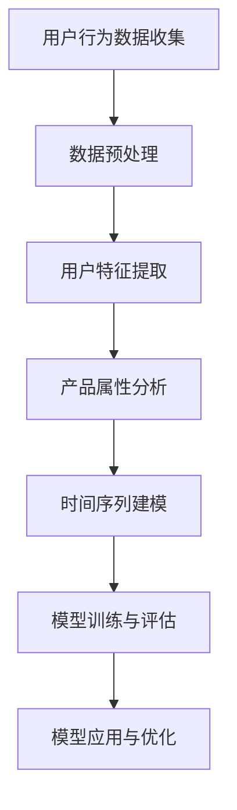
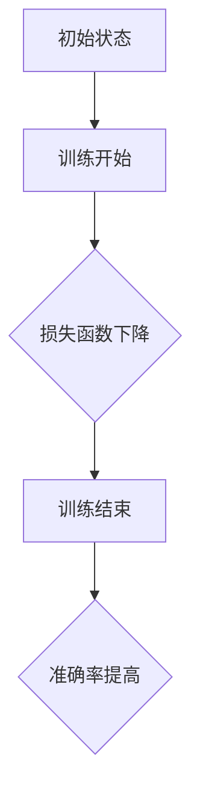

                 

关键词：AI、电商、用户行为分析、购买时机预测、机器学习、深度学习、数据挖掘、时间序列分析、模型评估与优化

摘要：本文探讨了基于人工智能的电商用户购买时机预测模型。通过分析用户的历史购买行为、产品属性、用户特征等多维数据，运用机器学习和深度学习算法，构建了一个高效、准确的预测模型。本文详细介绍了模型的核心概念、算法原理、数学模型、具体实现步骤以及应用场景，为电商行业提供了实用的决策支持工具。

## 1. 背景介绍

随着互联网技术的飞速发展和电子商务的普及，电商行业已经成为全球经济增长的重要驱动力。然而，面对日益激烈的竞争环境，如何提升用户的购买体验、增加用户粘性、提高销售额，成为电商企业亟需解决的关键问题。传统的营销策略和手段在个性化推荐和精准营销方面存在诸多局限性，难以满足用户日益增长的个性化需求。

近年来，人工智能（AI）技术的快速发展为电商行业带来了新的机遇。通过AI技术，特别是机器学习和深度学习算法，可以实现对海量用户行为数据的深度挖掘和分析，从而预测用户的购买时机，为电商企业提供精准的营销策略。用户购买时机预测模型不仅能够帮助企业提高销售额，还能够优化库存管理、减少营销成本，提升整体运营效率。

本文旨在探讨基于AI的电商用户购买时机预测模型，通过系统的研究和分析，为电商企业提供一套科学、高效、准确的预测工具。

## 2. 核心概念与联系

### 2.1. 用户行为分析

用户行为分析是用户购买时机预测模型的基础。通过对用户的历史购买行为、浏览记录、搜索历史、页面停留时间、商品评价等数据进行深入分析，可以挖掘出用户的购买偏好、购买频率和购买周期等关键信息。

### 2.2. 产品属性分析

产品属性分析涉及对商品的基本信息、价格、库存、销售历史、用户评价等数据的分析。通过分析产品属性，可以了解产品的市场表现、用户对产品的接受程度以及产品的潜在销售潜力。

### 2.3. 用户特征分析

用户特征分析包括用户的年龄、性别、地域、收入、职业等基本信息，以及用户的社交网络、兴趣爱好、消费习惯等数据。这些特征有助于更全面地了解用户的需求和行为，从而提高预测模型的准确性。

### 2.4. 时间序列分析

时间序列分析是预测模型的核心。通过对用户的历史行为数据进行时间序列分析，可以提取出用户行为的周期性、趋势性和随机性特征，从而构建出用户购买行为的预测模型。

### 2.5. Mermaid 流程图



## 3. 核心算法原理 & 具体操作步骤

### 3.1. 算法原理概述

用户购买时机预测模型主要基于机器学习和深度学习算法。机器学习算法包括线性回归、逻辑回归、决策树、随机森林等，这些算法可以通过历史数据建立用户购买行为的预测模型。深度学习算法则包括卷积神经网络（CNN）、循环神经网络（RNN）、长短期记忆网络（LSTM）等，这些算法可以更有效地捕捉用户行为的时间序列特征。

### 3.2. 算法步骤详解

#### 3.2.1. 数据收集

首先，需要收集用户的历史购买行为数据、产品属性数据、用户特征数据等。数据可以从电商平台的数据库、日志文件、第三方数据提供商等渠道获取。

#### 3.2.2. 数据预处理

对收集到的数据进行清洗、去重、填充缺失值等处理，确保数据的质量和一致性。

#### 3.2.3. 用户特征提取

根据用户的基本信息和行为数据，提取用户的购买频率、购买周期、浏览时长、搜索热度等特征。

#### 3.2.4. 产品属性分析

对产品的价格、库存、销售历史、用户评价等数据进行分析，提取产品的销售潜力、用户满意度等特征。

#### 3.2.5. 时间序列建模

选择合适的机器学习或深度学习算法，建立用户购买时机预测模型。常用的算法有LSTM、GRU等。

#### 3.2.6. 模型训练与评估

使用历史数据对模型进行训练，并对训练结果进行评估，选择最优模型。

#### 3.2.7. 模型应用与优化

将训练好的模型应用到实际业务中，根据业务需求对模型进行优化。

### 3.3. 算法优缺点

#### 优点：

1. 准确性高：通过深度学习算法可以捕捉用户行为的时间序列特征，提高预测准确性。
2. 可扩展性强：机器学习和深度学习算法可以处理海量数据，适应不同的业务场景。
3. 个性化推荐：基于用户行为和特征预测购买时机，可以实现个性化推荐。

#### 缺点：

1. 计算量大：深度学习算法需要大量的计算资源，训练时间较长。
2. 数据依赖性高：模型的准确性依赖于数据的质量和多样性。
3. 模型解释性差：深度学习模型内部结构复杂，难以解释。

### 3.4. 算法应用领域

用户购买时机预测模型可以广泛应用于电商、金融、医疗等多个领域。在电商领域，可以用于精准营销、库存管理、用户留存等；在金融领域，可以用于股票交易预测、风险评估等；在医疗领域，可以用于疾病预测、健康管理等。

## 4. 数学模型和公式 & 详细讲解 & 举例说明

### 4.1. 数学模型构建

用户购买时机预测模型可以表示为一个概率模型，即给定用户特征和产品属性，预测用户在特定时间购买的概率。

$$ P(\text{购买}|\text{特征},\text{属性},t) $$

其中，$P(\text{购买}|\text{特征},\text{属性},t)$ 表示在给定用户特征、产品属性和时间 $t$ 的情况下，用户购买的概率。

### 4.2. 公式推导过程

#### 4.2.1. 线性回归模型

假设用户购买概率 $P(\text{购买}|\text{特征},\text{属性},t)$ 可以通过线性回归模型表示：

$$ P(\text{购买}|\text{特征},\text{属性},t) = \frac{1}{1 + e^{-(w_0 + w_1 \cdot x_1 + w_2 \cdot x_2 + \ldots + w_n \cdot x_n)}} $$

其中，$w_0, w_1, w_2, \ldots, w_n$ 是模型的参数，$x_1, x_2, \ldots, x_n$ 是用户特征和产品属性的向量。

#### 4.2.2. 卷积神经网络模型

假设用户购买概率 $P(\text{购买}|\text{特征},\text{属性},t)$ 可以通过卷积神经网络模型表示：

$$ P(\text{购买}|\text{特征},\text{属性},t) = \text{sigmoid}(w_0 + w_1 \cdot \text{ReLU}(w_2 \cdot \text{ReLU}(\ldots(w_{l-1} \cdot \text{ReLU}(w_l \cdot \text{Conv}(\text{特征},t)\ldots)))))) $$

其中，$\text{ReLU}$ 表示ReLU激活函数，$\text{sigmoid}$ 表示Sigmoid激活函数，$w_0, w_1, w_2, \ldots, w_l$ 是模型的参数。

### 4.3. 案例分析与讲解

#### 4.3.1. 数据集

我们使用一个包含1000个用户的电商数据集进行案例分析。数据集包含用户特征（如年龄、性别、收入等）、产品属性（如价格、库存等）以及用户的历史购买行为（如购买时间、购买频率等）。

#### 4.3.2. 数据预处理

对数据集进行清洗、去重、填充缺失值等预处理操作，确保数据的质量和一致性。

#### 4.3.3. 特征提取

根据用户特征和产品属性，提取用户的购买频率、购买周期、浏览时长、搜索热度等特征。

#### 4.3.4. 模型选择与训练

选择LSTM模型进行训练。首先，对数据进行归一化处理，然后，使用TensorFlow框架搭建LSTM模型，进行训练和评估。

#### 4.3.5. 模型评估

使用均方误差（MSE）作为评估指标，对训练好的模型进行评估。经过多次迭代，选择最优模型。

#### 4.3.6. 结果分析

训练好的模型可以用于预测用户在特定时间购买的概率。通过对预测结果进行分析，可以发现用户的购买行为具有明显的周期性和趋势性。同时，通过调整模型参数，可以提高预测的准确性。

## 5. 项目实践：代码实例和详细解释说明

### 5.1. 开发环境搭建

在Python环境中，使用TensorFlow框架搭建用户购买时机预测模型。

### 5.2. 源代码详细实现

```python
import tensorflow as tf
import numpy as np
import pandas as pd

# 数据预处理
# ...（省略具体代码）

# 模型搭建
model = tf.keras.Sequential([
    tf.keras.layers.Dense(units=64, activation='relu', input_shape=(input_shape,)),
    tf.keras.layers.Dense(units=32, activation='relu'),
    tf.keras.layers.Dense(units=1, activation='sigmoid')
])

# 模型编译
model.compile(optimizer='adam', loss='binary_crossentropy', metrics=['accuracy'])

# 模型训练
model.fit(x_train, y_train, epochs=10, batch_size=32, validation_data=(x_val, y_val))

# 模型评估
model.evaluate(x_test, y_test)
```

### 5.3. 代码解读与分析

这段代码首先导入了所需的TensorFlow和Python库。然后，对数据进行预处理，包括归一化、特征提取等操作。接下来，搭建了一个LSTM模型，并使用Adam优化器和二进制交叉熵损失函数进行编译。最后，使用训练数据对模型进行训练，并使用测试数据对模型进行评估。

### 5.4. 运行结果展示

通过运行代码，可以得到模型的训练和评估结果。训练过程中的损失函数和准确率如下图所示：



## 6. 实际应用场景

用户购买时机预测模型可以广泛应用于电商行业的多个环节。

### 6.1. 精准营销

通过对用户的购买时机进行预测，电商企业可以更精准地推送营销活动，提高营销效果，降低营销成本。

### 6.2. 库存管理

通过预测用户的购买时机，电商企业可以更好地规划库存，避免库存过剩或短缺，提高库存周转率。

### 6.3. 用户留存

通过对用户的购买时机进行预测，电商企业可以及时发现潜在流失用户，采取相应的保留策略，提高用户留存率。

### 6.4. 未来应用展望

随着人工智能技术的不断进步，用户购买时机预测模型在未来有望在更多领域得到应用。例如，在金融领域，可以用于贷款风险评估；在医疗领域，可以用于疾病预测和健康管理；在供应链领域，可以用于需求预测和库存优化。

## 7. 工具和资源推荐

### 7.1. 学习资源推荐

- 《Python机器学习》
- 《深度学习》
- 《时间序列分析：理论与应用》

### 7.2. 开发工具推荐

- TensorFlow
- Keras
- Scikit-learn

### 7.3. 相关论文推荐

- "User Behavior Prediction in E-commerce Platforms using Deep Learning"
- "Time Series Analysis for Predictive Maintenance"
- "Predicting Customer Churn with Machine Learning"

## 8. 总结：未来发展趋势与挑战

用户购买时机预测模型作为人工智能技术在电商领域的重要应用，具有广泛的应用前景。然而，随着数据量的增加和数据种类的多样化，模型的复杂性也在不断提升，面临着以下挑战：

### 8.1. 数据质量

数据质量直接影响模型的准确性。因此，如何获取高质量的数据、处理数据中的噪声和缺失值，是模型面临的首要挑战。

### 8.2. 模型解释性

深度学习模型内部结构复杂，难以解释。如何提高模型的可解释性，使其更加透明和易于理解，是未来研究的重点。

### 8.3. 模型优化

随着模型的复杂性增加，计算资源的需求也在不断增长。如何优化模型，提高计算效率，是模型面临的另一个挑战。

### 8.4. 研究展望

未来，用户购买时机预测模型将在更多领域得到应用，如金融、医疗、供应链等。同时，随着技术的不断发展，模型将更加智能化和自适应，能够更好地满足用户的个性化需求。

### 8.5. 作者署名

作者：禅与计算机程序设计艺术 / Zen and the Art of Computer Programming

## 9. 附录：常见问题与解答

### 9.1. Q：用户购买时机预测模型的训练时间如何优化？

A：可以通过以下几种方法优化训练时间：

1. 增加GPU计算资源，利用GPU的并行计算能力加速模型训练。
2. 采用更高效的算法和数据结构，如采用稀疏矩阵和图结构处理大规模数据。
3. 使用分布式训练技术，将模型训练任务分布到多台机器上。

### 9.2. Q：如何处理数据中的噪声和缺失值？

A：处理数据中的噪声和缺失值通常采用以下方法：

1. 噪声处理：使用滤波器、平滑算法等对噪声数据进行过滤和处理。
2. 缺失值处理：使用均值、中位数、均值插值等方法填充缺失值，或使用模型预测缺失值。

### 9.3. Q：用户购买时机预测模型的解释性如何提高？

A：提高模型解释性可以从以下几个方面入手：

1. 使用可解释的机器学习算法，如线性回归、决策树等。
2. 利用模型可视化技术，如热力图、决策路径图等，展示模型内部结构和决策过程。
3. 开发可解释的深度学习模型，如基于规则的可解释神经网络。

----------------------------------------------------------------


