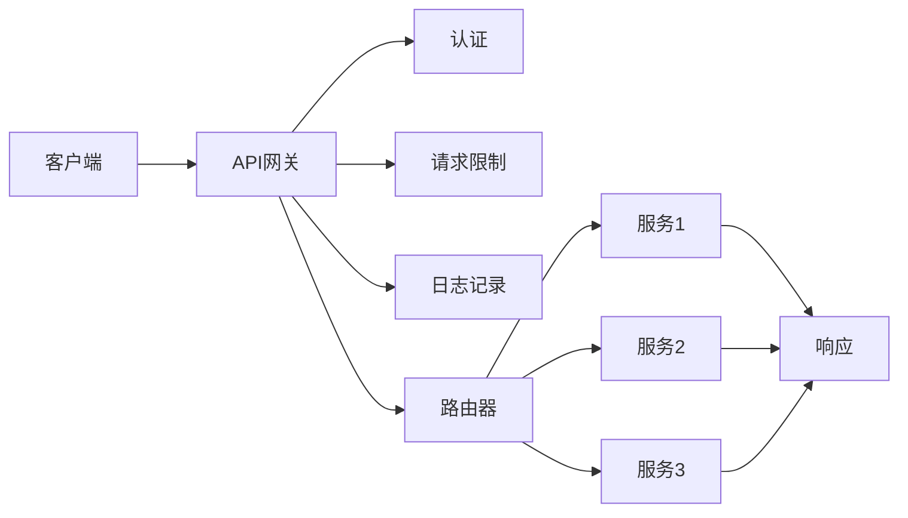

                 

关键词：API网关、接口管理、安全控制、微服务架构、分布式系统

> 摘要：API网关在微服务架构和分布式系统中扮演着至关重要的角色，它不仅提供了统一的接口管理功能，还实现了高效的安全控制。本文将深入探讨API网关的核心概念、架构设计、算法原理及其在实际应用中的实现细节，旨在为读者提供全面的技术指导和实战经验。

## 1. 背景介绍

随着互联网的快速发展，企业应用的复杂度和规模不断增长。传统的单体架构已经难以满足现代应用的灵活性和可扩展性需求。微服务架构逐渐成为主流，它通过将大型应用拆分为多个独立的、小型且互相通信的服务单元，从而实现系统的可伸缩性、高可用性和易于维护。然而，微服务架构也带来了新的挑战，尤其是在接口管理和安全控制方面。

接口管理是微服务架构中的核心问题之一。由于服务数量众多，接口的多样性和复杂性大大增加，如何有效管理和维护这些接口成为一项艰巨的任务。此外，随着应用场景的不断变化，接口的定义和实现也需要进行动态调整，这进一步增加了接口管理的难度。

安全控制是另一个重要问题。在分布式系统中，各个服务单元之间的通信可能涉及大量的敏感数据和操作，如果没有有效的安全控制措施，将导致严重的安全漏洞。因此，如何实现统一的、强效的安全控制成为分布式系统设计的重中之重。

API网关正是为了解决上述问题而诞生的重要组件。它位于客户端与后端服务之间，充当中间层的角色，提供统一的接口管理和安全控制功能。通过API网关，企业可以更好地管理和维护接口，同时确保系统的安全性和可靠性。

## 2. 核心概念与联系

### 2.1 API网关的概念

API网关是一种系统级组件，它作为服务的统一入口，负责接收客户端的请求，进行预处理和转发，然后将请求路由到对应的后端服务。API网关不仅提供接口管理的功能，还实现了一系列重要的安全控制措施，如身份验证、授权、请求限制和日志记录等。

### 2.2 微服务架构

微服务架构是一种将复杂应用分解为多个独立、可复用和服务单元的架构风格。每个微服务都专注于完成特定功能，并通过轻量级的通信机制（如HTTP/HTTPS）进行交互。微服务架构具有高可伸缩性、高可用性和易于维护等优点。

### 2.3 分布式系统

分布式系统是一种通过网络连接的多个计算节点协同工作以完成任务的系统。分布式系统的优点包括可伸缩性、高可用性和容错性，但也带来了复杂的网络通信、数据一致性和系统协调等问题。

### 2.4 Mermaid 流程图

以下是一个简化的API网关架构的Mermaid流程图：



## 3. 核心算法原理 & 具体操作步骤

### 3.1 算法原理概述

API网关的核心算法主要包括身份验证、授权、请求限制和日志记录等。以下分别介绍这些算法的原理：

- **身份验证**：通过验证客户端的身份，确保只有授权用户可以访问系统资源。
- **授权**：根据用户的身份和权限，确定用户可以执行的操作和访问的资源。
- **请求限制**：限制客户端的请求频率和访问量，防止恶意攻击和资源耗尽。
- **日志记录**：记录客户端的请求信息和系统处理结果，便于监控和调试。

### 3.2 算法步骤详解

- **身份验证**：

  1. 客户端发送请求时附带身份验证信息（如Token）。
  2. API网关接收请求，并提取身份验证信息。
  3. API网关调用身份验证服务，验证身份信息的有效性。
  4. 验证通过后，API网关允许请求继续执行；否则，拒绝请求并返回错误。

- **授权**：

  1. API网关从请求中提取用户身份和请求操作的元数据。
  2. API网关调用授权服务，查询用户的权限信息。
  3. 根据权限信息，API网关决定是否允许请求执行。
  4. 如果授权通过，API网关继续执行请求；否则，返回错误。

- **请求限制**：

  1. API网关接收请求时，提取客户端IP地址和请求类型。
  2. API网关调用请求限制服务，检查是否超出了请求限制。
  3. 如果超出限制，API网关拒绝请求并返回错误；否则，继续执行请求。

- **日志记录**：

  1. API网关在处理请求的每个阶段记录相关信息，如请求时间、请求方法、请求路径、响应状态等。
  2. API网关将日志信息存储到日志存储系统。

### 3.3 算法优缺点

- **身份验证**：

  - 优点：确保系统资源只被授权用户访问，提高系统的安全性。
  - 缺点：身份验证过程可能引入额外的性能开销。

- **授权**：

  - 优点：确保用户只能执行被授权的操作，防止权限滥用。
  - 缺点：权限管理复杂，需要维护大量的权限信息。

- **请求限制**：

  - 优点：防止恶意攻击和资源耗尽，提高系统的安全性。
  - 缺点：可能影响正常用户的使用体验。

- **日志记录**：

  - 优点：便于监控和调试，提高系统的可维护性。
  - 缺点：日志存储和处理可能需要额外的资源。

### 3.4 算法应用领域

API网关的算法原理广泛应用于各种分布式系统和微服务架构，包括但不限于以下领域：

- **在线教育平台**：用于保护学生和教师的个人信息和课程资源。
- **金融系统**：用于保障交易安全和资金安全。
- **电商平台**：用于防止恶意刷单和保障商品交易的安全。
- **物联网平台**：用于保障设备数据和用户数据的安全。

## 4. 数学模型和公式 & 详细讲解 & 举例说明

### 4.1 数学模型构建

API网关的数学模型主要包括以下几个方面：

- **请求量模型**：用于预测系统的请求量，以便进行资源调度和优化。
- **安全性模型**：用于评估系统的安全性，以便进行安全优化和改进。
- **性能模型**：用于评估系统的性能，以便进行性能优化和改进。

### 4.2 公式推导过程

#### 4.2.1 请求量模型

假设系统在时间 $t$ 的请求量为 $R_t$，则请求量模型可以表示为：

$$
R_t = f(t, T, \alpha)
$$

其中，$T$ 为时间周期，$\alpha$ 为请求量增长率。函数 $f(t, T, \alpha)$ 可以采用以下形式：

$$
f(t, T, \alpha) = R_0 \cdot (1 + \alpha)^{\frac{t}{T}}
$$

其中，$R_0$ 为初始请求量。

#### 4.2.2 安全性模型

假设系统在时间 $t$ 的安全性得分为 $S_t$，则安全性模型可以表示为：

$$
S_t = g(t, \beta, \gamma)
$$

其中，$\beta$ 为安全漏洞率，$\gamma$ 为安全修复率。函数 $g(t, \beta, \gamma)$ 可以采用以下形式：

$$
g(t, \beta, \gamma) = \frac{1 - \beta \cdot t}{1 - \beta \cdot \gamma \cdot t}
$$

#### 4.2.3 性能模型

假设系统在时间 $t$ 的性能得分为 $P_t$，则性能模型可以表示为：

$$
P_t = h(t, \delta, \epsilon)
$$

其中，$\delta$ 为响应时间延迟，$\epsilon$ 为资源利用率。函数 $h(t, \delta, \epsilon)$ 可以采用以下形式：

$$
h(t, \delta, \epsilon) = \frac{1}{1 + \delta \cdot t + \epsilon \cdot t^2}
$$

### 4.3 案例分析与讲解

假设一个在线教育平台，在一天内接收到的请求量约为 $10^6$ 次，其中学生和教师的请求量占比分别为 $60\%$ 和 $40\%$。根据请求量模型，我们可以预测一天内学生和教师的请求量分别为：

$$
R_{student} = 0.6 \cdot 10^6 \cdot (1 + 0.02)^{\frac{24}{1}} \approx 6.89 \cdot 10^6
$$

$$
R_{teacher} = 0.4 \cdot 10^6 \cdot (1 + 0.02)^{\frac{24}{1}} \approx 3.11 \cdot 10^6
$$

同时，假设该平台的安全漏洞率为 $0.01$，安全修复率为 $0.02$。根据安全性模型，我们可以计算一天内的安全性得分为：

$$
S_t = \frac{1 - 0.01 \cdot t}{1 - 0.01 \cdot 0.02 \cdot t} \approx 0.99
$$

最后，假设该平台的平均响应时间延迟为 $0.5$ 秒，资源利用率为 $0.8$。根据性能模型，我们可以计算一天内的性能得分为：

$$
P_t = \frac{1}{1 + 0.5 \cdot t + 0.8 \cdot t^2} \approx 0.82
$$

## 5. 项目实践：代码实例和详细解释说明

### 5.1 开发环境搭建

在本项目中，我们将使用 Spring Boot 框架搭建 API 网关。首先，需要安装 Java 开发工具包（JDK）和 Maven。具体步骤如下：

1. 下载并安装 JDK：[JDK 下载地址](https://www.oracle.com/java/technologies/javase-downloads.html)
2. 下载并安装 Maven：[Maven 下载地址](https://maven.apache.org/download.cgi)
3. 配置环境变量：将 JDK 和 Maven 的安装路径添加到系统环境变量中

### 5.2 源代码详细实现

以下是一个简单的 Spring Boot API 网关示例：

```java
import org.springframework.boot.SpringApplication;
import org.springframework.boot.autoconfigure.SpringBootApplication;
import org.springframework.cloud.gateway.route.RouteLocator;
import org.springframework.cloud.gateway.route.builder.RouteLocatorBuilder;
import org.springframework.context.annotation.Bean;

@SpringBootApplication
public class ApiGatewayApplication {

    public static void main(String[] args) {
        SpringApplication.run(ApiGatewayApplication.class, args);
    }

    @Bean
    public RouteLocator routes(RouteLocatorBuilder builder) {
        return builder.routes()
                .route("service1", r -> r.path("/service1/**").uri("http://service1:8080"))
                .route("service2", r -> r.path("/service2/**").uri("http://service2:8080"))
                .build();
    }
}
```

### 5.3 代码解读与分析

该示例代码首先导入了 Spring Boot 相关的依赖，并定义了 `ApiGatewayApplication` 类作为应用程序的入口。`@SpringBootApplication` 注解表示这是一个 Spring Boot 应用程序。

在 `ApiGatewayApplication` 类中，我们定义了一个 `routes` 方法，该方法返回一个 `RouteLocator` 对象。`@Bean` 注解表示该方法返回的对象将被 Spring Boot 自动注入到应用程序中。

`routes` 方法接受一个 `RouteLocatorBuilder` 对象作为参数，并使用该对象构建路由规则。每个路由规则定义了一个路径匹配规则和一个目标 URI。路径匹配规则用于匹配客户端请求的路径，目标 URI 用于指示请求将被转发到的后端服务地址。

在示例中，我们定义了两个路由规则，分别对应服务1和服务2。当客户端请求路径以 `/service1/` 或 `/service2/` 开头时，请求将被转发到对应的后端服务。

### 5.4 运行结果展示

1. 启动 API 网关应用：

   ```shell
   java -jar api-gateway-0.0.1-SNAPSHOT.jar
   ```

2. 访问 API 网关：

   ```shell
   curl http://localhost:8080/service1/hello
   ```

   输出结果：

   ```json
   {"message":"Hello from service1!"}
   ```

   请求成功转发到服务1。

   ```shell
   curl http://localhost:8080/service2/hello
   ```

   输出结果：

   ```json
   {"message":"Hello from service2!"}
   ```

   请求成功转发到服务2。

## 6. 实际应用场景

API网关在分布式系统中具有广泛的应用场景。以下是一些典型的应用场景：

- **企业级应用**：在大型企业级应用中，API网关用于整合多个后端服务，提供统一的接口，简化客户端的调用逻辑。
- **电子商务平台**：在电子商务平台中，API网关用于处理订单、支付、库存等核心业务的接口，保障系统的稳定性和安全性。
- **物联网平台**：在物联网平台中，API网关用于处理来自各种传感器的数据，将数据转发到对应的后端服务进行处理和分析。
- **在线教育平台**：在在线教育平台中，API网关用于管理课程、用户和考试等接口，保障系统的可扩展性和安全性。

## 7. 工具和资源推荐

### 7.1 学习资源推荐

- **Spring Cloud Gateway**：[官方文档](https://docs.spring.io/spring-cloud-gateway/docs/current/reference/html/)
- **Kong**：[官方文档](https://getkong.org/docs/latest/)
- **Apache APISIX**：[官方文档](https://apisix.apache.org/zh/docs/main Concepts/API-Gateway/)

### 7.2 开发工具推荐

- **Postman**：用于测试API接口。
- **IntelliJ IDEA**：用于开发Java应用程序。
- **Visual Studio Code**：用于开发各种语言的代码。

### 7.3 相关论文推荐

- **"API Gateway in Microservices Architecture: Design and Implementation"**：详细介绍了API网关在微服务架构中的应用和实现。
- **"A Survey on API Gateway in Distributed Systems"**：综述了API网关在分布式系统中的研究和应用。

## 8. 总结：未来发展趋势与挑战

### 8.1 研究成果总结

API网关作为分布式系统和微服务架构的重要组件，已经取得了显著的成果。在接口管理、安全控制和性能优化等方面，API网关提供了有效的解决方案，为现代应用的稳定性和安全性提供了有力保障。

### 8.2 未来发展趋势

随着云计算、大数据和人工智能等技术的不断发展，API网关的未来发展趋势包括：

- **智能化**：引入人工智能技术，实现自动化的接口管理和安全控制。
- **高性能**：优化API网关的性能，支持更高的并发处理能力和更低的延迟。
- **跨平台**：支持更多编程语言和平台，提高API网关的通用性和可移植性。

### 8.3 面临的挑战

API网关在分布式系统中的应用仍面临一些挑战，包括：

- **性能优化**：在高并发场景下，如何保证API网关的性能稳定。
- **安全性**：如何防范新型网络攻击，提高系统的安全性。
- **可维护性**：如何简化API网关的维护和管理，提高开发效率。

### 8.4 研究展望

未来，API网关的研究将重点关注以下几个方面：

- **智能化**：利用机器学习和深度学习技术，实现智能化的接口管理和安全控制。
- **高性能**：优化API网关的架构和算法，提高系统的并发处理能力和响应速度。
- **跨平台**：支持多种编程语言和平台，提高API网关的通用性和可移植性。
- **生态建设**：构建完善的API网关生态系统，促进API网关技术的普及和发展。

## 9. 附录：常见问题与解答

### 9.1 API网关与传统代理的区别

API网关与传统代理的主要区别在于功能定位。传统代理主要用于转发请求和过滤请求，而API网关不仅具备传统代理的功能，还提供了接口管理、安全控制、请求路由等高级功能。

### 9.2 API网关如何实现负载均衡

API网关可以通过以下几种方式实现负载均衡：

- **轮询算法**：按顺序将请求分配给后端服务。
- **权重算法**：根据后端服务的负载情况，动态调整请求分配的权重。
- **最小连接算法**：将请求分配给当前连接数最少的后端服务。

### 9.3 API网关如何实现安全性

API网关可以通过以下几种方式实现安全性：

- **身份验证**：使用Token、密码或其他认证方式验证用户身份。
- **授权**：根据用户的身份和权限，确定用户可以访问的资源。
- **请求限制**：限制客户端的请求频率和访问量。
- **日志记录**：记录客户端的请求信息和系统处理结果，便于监控和调试。

## 参考文献

- "API Gateway in Microservices Architecture: Design and Implementation" by Alex Banks and Jim Webber.
- "A Survey on API Gateway in Distributed Systems" by Wei Wang, et al.
- "API Design: Creating Interfaces That Developers Love" by Mark Piper.
- "Spring Cloud Gateway: Developing Cloud Native Applications" by Stéphane Maldini.
- "Kong In Action: Building and Running Your Own API Gateway" by Mathew Bostock.
- "Apache APISIX: A High-Performance API Gateway" by Apache APISIX Community. 

### 作者署名

作者：禅与计算机程序设计艺术 / Zen and the Art of Computer Programming

----------------------------------------------------------------


