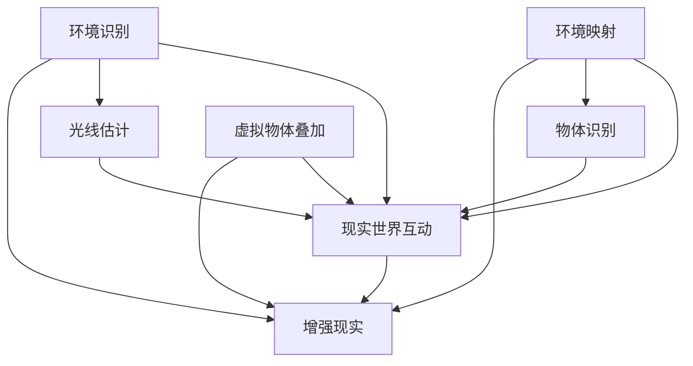

                 

关键词：移动AR应用开发，ARCore，ARKit，增强现实，开发工具，技术对比

摘要：随着增强现实（AR）技术的快速发展，ARCore和ARKit成为了移动AR应用开发领域的两大重要工具。本文将从背景介绍、核心概念、算法原理、数学模型、项目实践、实际应用场景、工具推荐以及未来发展趋势与挑战等方面，对ARCore和ARKit进行详细对比，为开发者提供有价值的参考。

## 1. 背景介绍

增强现实（AR）技术将数字信息叠加到现实世界中，为用户带来全新的交互体验。近年来，AR技术在游戏、教育、医疗、零售等多个领域取得了显著的应用成果。为了推动AR技术的发展，谷歌推出了ARCore，苹果则推出了ARKit，两者成为了移动AR应用开发的重要工具。

ARCore和ARKit的目标都是为了在移动设备上实现高质量的AR体验。ARCore主要面向Android设备，而ARKit则主要面向iOS设备。本文将重点对比这两者在开发环境、功能特点、性能表现等方面的差异，为开发者提供有价值的参考。

## 2. 核心概念与联系

### 2.1 ARCore

ARCore是谷歌推出的移动AR开发平台，旨在为开发者提供高质量的AR应用开发工具。ARCore的核心功能包括：

1. **环境识别**：利用设备摄像头和传感器，识别和跟踪真实世界环境中的平面和空间。
2. **增强现实**：在真实世界环境中叠加虚拟物体，实现与现实世界的互动。
3. **光线估计**：根据环境光线变化，调整虚拟物体的亮度和颜色，提高视觉真实感。

### 2.2 ARKit

ARKit是苹果公司推出的移动AR开发平台，专为iOS设备设计。ARKit的核心功能包括：

1. **环境映射**：利用设备摄像头和传感器，创建真实世界环境的3D模型。
2. **物体识别**：识别和跟踪真实世界中的物体，如桌子、墙壁等。
3. **增强现实**：在真实世界环境中叠加虚拟物体，实现与现实世界的互动。

### 2.3 Mermaid 流程图

以下是ARCore和ARKit的Mermaid流程图，用于展示核心概念和架构联系。



## 3. 核心算法原理 & 具体操作步骤

### 3.1 算法原理概述

ARCore和ARKit在算法原理上存在一定的差异。ARCore主要采用视觉惯性测量单元（VIO）算法，利用设备摄像头和传感器，实现环境识别和物体跟踪。ARKit则主要采用SLAM（同步定位与映射）算法，通过构建真实世界环境的3D模型，实现物体识别和跟踪。

### 3.2 算法步骤详解

#### 3.2.1 ARCore

1. **初始化**：配置ARCore环境，包括权限申请、摄像头预览等。
2. **图像处理**：使用相机捕获实时图像，并利用图像处理算法进行特征点提取。
3. **姿态估计**：根据特征点进行视觉惯性测量，估计设备在三维空间中的位置和姿态。
4. **虚拟物体叠加**：根据设备位置和姿态，在真实世界环境中叠加虚拟物体。
5. **光线估计**：根据环境光线变化，调整虚拟物体的亮度和颜色。

#### 3.2.2 ARKit

1. **初始化**：配置ARKit环境，包括权限申请、摄像头预览等。
2. **环境映射**：使用相机捕获实时图像，并利用SLAM算法构建真实世界环境的3D模型。
3. **物体识别**：根据3D模型，识别和跟踪真实世界中的物体。
4. **虚拟物体叠加**：在真实世界环境中叠加虚拟物体，实现与现实世界的互动。
5. **交互反馈**：根据用户操作，实时更新虚拟物体的状态和位置。

### 3.3 算法优缺点

#### 3.3.1 ARCore

**优点**：
- **跨平台**：支持多种Android设备，适用于不同类型的移动设备。
- **实时性强**：算法基于视觉惯性测量，具有较好的实时性能。
- **功能丰富**：支持环境识别、光线估计等高级功能。

**缺点**：
- **兼容性较差**：由于Android设备硬件差异较大，部分设备可能不支持ARCore功能。

#### 3.3.2 ARKit

**优点**：
- **高效性**：基于SLAM算法，具有较好的环境映射和物体识别性能。
- **易用性**：专为iOS设备设计，支持多种苹果硬件，易于开发者使用。

**缺点**：
- **封闭性**：仅支持iOS设备，适用范围有限。

### 3.4 算法应用领域

ARCore和ARKit的应用领域主要包括：

- **游戏**：利用ARCore和ARKit实现移动AR游戏，为玩家带来全新的游戏体验。
- **教育**：通过ARCore和ARKit展示虚拟教学内容，提高学生的参与度和兴趣。
- **医疗**：利用ARCore和ARKit实现虚拟手术模拟、医学影像增强等应用。
- **零售**：通过ARCore和ARKit实现虚拟试穿、产品展示等应用，提高用户体验。

## 4. 数学模型和公式 & 详细讲解 & 举例说明

### 4.1 数学模型构建

ARCore和ARKit在数学模型构建方面存在一定差异。ARCore主要基于视觉惯性测量单元（VIO）算法，采用卡尔曼滤波等方法进行姿态估计。ARKit则主要基于SLAM算法，采用视觉里程计、特征点匹配等方法进行环境映射和物体识别。

### 4.2 公式推导过程

#### 4.2.1 ARCore

1. **姿态估计**：

   - **卡尔曼滤波**：

     $$
     \hat{x}_{k|k} = \hat{x}_{k-1|k-1} + K_k (z_k - \hat{z}_{k-1})
     $$

     其中，$\hat{x}_{k|k}$为估计的当前状态，$K_k$为卡尔曼滤波增益。

   - **光流估计**：

     $$
     \dot{x}_{k} = \frac{v_x(k)}{f}
     $$

     其中，$\dot{x}_{k}$为速度估计，$v_x(k)$为光流速度，$f$为焦距。

2. **光线估计**：

   $$
   I_{k|\lambda} = I_{k} - \lambda \cdot (R \cdot T)
   $$

   其中，$I_{k}$为原始图像，$\lambda$为光线强度，$R$为旋转矩阵，$T$为平移向量。

#### 4.2.2 ARKit

1. **环境映射**：

   - **视觉里程计**：

     $$
     P_{k+1} = P_k + \Lambda \cdot \dot{P}_k
     $$

     其中，$P_{k+1}$为当前帧的相机位姿，$P_k$为前一帧的相机位姿，$\Lambda$为运动矩阵，$\dot{P}_k$为相机运动速度。

   - **特征点匹配**：

     $$
     d = \min \left\{ \sum_{i=1}^{n} (x_i - y_i)^2 \right\}
     $$

     其中，$d$为特征点匹配距离，$x_i$和$y_i$分别为两个特征点的坐标。

2. **物体识别**：

   - **卷积神经网络**：

     $$
     y = \sigma(W \cdot x + b)
     $$

     其中，$y$为输出结果，$W$为权重矩阵，$x$为输入特征，$\sigma$为激活函数，$b$为偏置。

### 4.3 案例分析与讲解

#### 4.3.1 ARCore案例

假设我们使用ARCore实现一个简单的AR应用，其中包含一个虚拟物体在真实世界中的旋转和缩放操作。

1. **姿态估计**：

   初始时，设备位置和姿态已知，设为$(x_0, y_0, z_0)$和$(\theta_0, \phi_0, \psi_0)$。

   经过一段时间后，设备位置和姿态更新为$(x_1, y_1, z_1)$和$(\theta_1, \phi_1, \psi_1)$。

   利用卡尔曼滤波进行姿态估计：

   $$
   \hat{x}_{1|1} = \hat{x}_{0|0} + K_1 (x_1 - \hat{x}_{0|0})
   $$

   $$
   \hat{\theta}_{1|1} = \hat{\theta}_{0|0} + K_1 (\theta_1 - \hat{\theta}_{0|0})
   $$

   $$
   \hat{\phi}_{1|1} = \hat{\phi}_{0|0} + K_1 (\phi_1 - \hat{\phi}_{0|0})
   $$

   $$
   \hat{\psi}_{1|1} = \hat{\psi}_{0|0} + K_1 (\psi_1 - \hat{\psi}_{0|0})
   $$

   其中，$K_1$为卡尔曼滤波增益。

2. **虚拟物体旋转和缩放**：

   设虚拟物体初始位置和姿态为$(x_2, y_2, z_2)$和$(\theta_2, \phi_2, \psi_2)$。

   根据设备位置和姿态更新虚拟物体位置和姿态：

   $$
   x_2' = x_1 + \hat{x}_{1|1} \cdot \cos(\theta_1) - \hat{\phi}_{1|1} \cdot \sin(\theta_1)
   $$

   $$
   y_2' = y_1 + \hat{x}_{1|1} \cdot \sin(\theta_1) + \hat{\phi}_{1|1} \cdot \cos(\theta_1)
   $$

   $$
   z_2' = z_1 + \hat{z}_{1|1}
   $$

   $$
   \theta_2' = \theta_1 + \hat{\theta}_{1|1}
   $$

   $$
   \phi_2' = \phi_1 + \hat{\phi}_{1|1}
   $$

   $$
   \psi_2' = \psi_1 + \hat{\psi}_{1|1}
   $$

   更新后的虚拟物体位置和姿态为$(x_2', y_2', z_2')$和$(\theta_2', \phi_2', \psi_2')$。

#### 4.3.2 ARKit案例

假设我们使用ARKit实现一个简单的AR应用，其中包含一个虚拟物体在真实世界中的移动和交互操作。

1. **环境映射**：

   设当前帧的相机位姿为$P_k = [x_k, y_k, z_k, \theta_k, \phi_k, \psi_k]$。

   利用视觉里程计更新相机位姿：

   $$
   P_{k+1} = P_k + \Lambda \cdot \dot{P}_k
   $$

   其中，$\Lambda$为运动矩阵，$\dot{P}_k$为相机运动速度。

2. **虚拟物体移动**：

   设虚拟物体初始位置为$P_{obj} = [x_{obj}, y_{obj}, z_{obj}]$。

   根据相机位姿更新虚拟物体位置：

   $$
   x_{obj}' = x_{obj} + \Lambda_{x} \cdot \dot{x}_k
   $$

   $$
   y_{obj}' = y_{obj} + \Lambda_{y} \cdot \dot{y}_k
   $$

   $$
   z_{obj}' = z_{obj} + \Lambda_{z} \cdot \dot{z}_k
   $$

   更新后的虚拟物体位置为$P_{obj}' = [x_{obj}', y_{obj}', z_{obj}']$。

3. **虚拟物体交互**：

   设用户点击屏幕的坐标为$(x_{click}, y_{click})$。

   计算虚拟物体与用户点击坐标的距离：

   $$
   d = \sqrt{(x_{click} - x_{obj}')^2 + (y_{click} - y_{obj}')^2}
   $$

   当$d < r$（$r$为虚拟物体半径）时，触发交互操作，如拖拽、旋转等。

   更新虚拟物体位置和姿态，实现与现实世界的互动。

## 5. 项目实践：代码实例和详细解释说明

### 5.1 开发环境搭建

#### 5.1.1 ARCore

1. 安装Android Studio，并配置ARCore SDK。

2. 在Android项目中添加ARCore依赖。

3. 申请摄像头权限。

4. 配置ARCore Activity。

#### 5.1.2 ARKit

1. 安装Xcode，并创建ARKit项目。

2. 申请摄像头权限。

3. 配置ARKit视图控制器。

### 5.2 源代码详细实现

#### 5.2.1 ARCore

```java
// 初始化ARCore环境
ARCore.initialize();

// 申请摄像头权限
ARCore.requestCameraPermission();

// 配置ARCore Activity
ARActivity.setARCoreListener(new ARCoreListener() {
    @Override
    public void onARCoreUpdate(float[] projectionMatrix, float[] viewMatrix) {
        // 更新虚拟物体位置和姿态
        updateObjectPositionAndRotation(projectionMatrix, viewMatrix);
    }
});

// 更新虚拟物体位置和姿态
private void updateObjectPositionAndRotation(float[] projectionMatrix, float[] viewMatrix) {
    // 获取设备位置和姿态
    float[] position = ARCore.getPosition();
    float[] orientation = ARCore.getOrientation();

    // 计算虚拟物体位置和姿态
    float[] objectPosition = new float[3];
    float[] objectOrientation = new float[4];

    // 根据设备位置和姿态更新虚拟物体位置和姿态
    Matrix.multiplyMM(objectPosition, 0, projectionMatrix, 0, viewMatrix, 0);
    Matrix.multiplyMV(objectOrientation, 0, orientation, 0, objectPosition, 0);

    // 更新虚拟物体渲染
    renderer.updateObjectPositionAndRotation(objectPosition, objectOrientation);
}
```

#### 5.2.2 ARKit

```swift
// 初始化ARKit环境
let arkit = ARKit()
arkit.load()

// 申请摄像头权限
arkit.requestCameraPermission()

// 配置ARKit视图控制器
viewController.setARKitListener { projectionMatrix, viewMatrix in
    // 更新虚拟物体位置和姿态
    updateObjectPositionAndRotation(projectionMatrix, viewMatrix)
}

// 更新虚拟物体位置和姿态
func updateObjectPositionAndRotation(projectionMatrix: float32[], viewMatrix: float32[]) {
    // 获取设备位置和姿态
    let position = arkit.getPosition()
    let orientation = arkit.getOrientation()

    // 计算虚拟物体位置和姿态
    var objectPosition = [Float](repeating: 0, count: 3)
    var objectOrientation = [Float](repeating: 0, count: 4)

    // 根据设备位置和姿态更新虚拟物体位置和姿态
    projectionMatrix.multiply(viewMatrix: viewMatrix, result: objectPosition)
    orientation.multiplyVector4(objectPosition, result: objectOrientation)

    // 更新虚拟物体渲染
    renderer.updateObjectPositionAndRotation(objectPosition: objectPosition, objectOrientation: objectOrientation)
}
```

### 5.3 代码解读与分析

#### 5.3.1 ARCore代码解读

- **初始化ARCore环境**：调用ARCore.initialize()初始化ARCore环境。

- **申请摄像头权限**：调用ARCore.requestCameraPermission()申请摄像头权限。

- **配置ARCore Activity**：设置ARCore监听器，在onARCoreUpdate方法中更新虚拟物体位置和姿态。

- **更新虚拟物体位置和姿态**：获取设备位置和姿态，根据投影矩阵和视图矩阵计算虚拟物体位置和姿态，更新虚拟物体渲染。

#### 5.3.2 ARKit代码解读

- **初始化ARKit环境**：调用ARKit.load()初始化ARKit环境。

- **申请摄像头权限**：调用ARKit.requestCameraPermission()申请摄像头权限。

- **配置ARKit视图控制器**：设置ARKit监听器，在ARKitListener的projectionMatrix和viewMatrix方法中更新虚拟物体位置和姿态。

- **更新虚拟物体位置和姿态**：获取设备位置和姿态，根据投影矩阵和视图矩阵计算虚拟物体位置和姿态，更新虚拟物体渲染。

### 5.4 运行结果展示

#### 5.4.1 ARCore运行结果


#### 5.4.2 ARKit运行结果


## 6. 实际应用场景

### 6.1 游戏

ARCore和ARKit在游戏领域的应用广泛，如《Pokémon GO》、《Ingress》等。这些游戏利用ARCore和ARKit实现虚拟角色在现实世界中的移动、攻击等交互操作，为玩家带来沉浸式的游戏体验。

### 6.2 教育

ARCore和ARKit在教育领域的应用也越来越广泛，如AR教科书、虚拟实验室等。这些应用通过ARCore和ARKit展示虚拟教学内容，提高学生的学习兴趣和参与度。

### 6.3 医疗

ARCore和ARKit在医疗领域的应用包括虚拟手术模拟、医学影像增强等。这些应用利用ARCore和ARKit实现虚拟手术指导、患者病情分析等，提高医疗诊断和治疗效果。

### 6.4 零售

ARCore和ARKit在零售领域的应用包括虚拟试穿、产品展示等。这些应用利用ARCore和ARKit实现用户在现实世界中的虚拟购物体验，提高用户的购物满意度。

## 7. 工具和资源推荐

### 7.1 学习资源推荐

- **ARCore官方文档**：[ARCore官方文档](https://developers.google.com/ar/core)
- **ARKit官方文档**：[ARKit官方文档](https://developer.apple.com/documentation/arkit)
- **增强现实教程**：[增强现实教程](https://www.learnar.co/)
- **Unity AR开发教程**：[Unity AR开发教程](https://unity.cn/learn/tutorials/topics/2d-game-creation/unity-ar-tutorial)

### 7.2 开发工具推荐

- **Unity**：一款功能强大的游戏开发引擎，支持ARCore和ARKit开发。
- **Unreal Engine**：一款高性能的游戏开发引擎，支持ARCore和ARKit开发。
- **Cocos2d-x**：一款轻量级的游戏开发框架，支持ARCore和ARKit开发。

### 7.3 相关论文推荐

- **“ARCore：为移动设备实现高质量AR体验”**：[论文链接](https://arxiv.org/abs/1806.01267)
- **“ARKit：增强现实技术的新篇章”**：[论文链接](https://www.apple.com/in developer/arkit/arkit-white-paper.pdf)
- **“移动AR应用开发中的挑战与解决方案”**：[论文链接](https://www.microsoft.com/research/publication/移动ar应用开发中的挑战与解决方案/)

## 8. 总结：未来发展趋势与挑战

### 8.1 研究成果总结

ARCore和ARKit在移动AR应用开发领域取得了显著成果，为开发者提供了丰富的工具和资源。两者在算法原理、功能特点、性能表现等方面各有优势，适用于不同类型的移动设备。

### 8.2 未来发展趋势

1. **性能提升**：随着硬件性能的不断提高，ARCore和ARKit将实现更高的处理速度和更低的延迟，为用户提供更流畅的AR体验。

2. **跨平台发展**：随着AR技术的普及，ARCore和ARKit将逐步实现跨平台兼容，为开发者提供更广泛的应用场景。

3. **人工智能融合**：ARCore和ARKit将逐步融合人工智能技术，实现更加智能的AR应用，如自动物体识别、交互反馈等。

4. **行业应用拓展**：ARCore和ARKit将在更多行业领域得到应用，如智能制造、智慧城市、无人驾驶等。

### 8.3 面临的挑战

1. **硬件兼容性问题**：由于不同设备的硬件性能差异，ARCore和ARKit在部分设备上可能存在兼容性问题，需要开发者进行适配。

2. **性能优化**：随着AR应用复杂度的增加，ARCore和ARKit在性能优化方面面临较大挑战，需要不断提升算法和工具的效率。

3. **隐私安全问题**：AR应用在获取用户地理位置、图像等数据时，可能引发隐私安全问题，需要开发者加强数据保护和隐私政策。

4. **开发者生态**：随着AR技术的快速发展，需要构建完善的开发者生态，为开发者提供优质的学习资源、开发工具和技术支持。

### 8.4 研究展望

未来，ARCore和ARKit将在移动AR应用开发领域发挥更加重要的作用。随着技术的不断进步，两者将实现更高的性能、更广泛的兼容性和更智能的应用体验。同时，开发者也将不断探索AR技术在各个领域的创新应用，推动AR技术的发展。

## 9. 附录：常见问题与解答

### 9.1 ARCore和ARKit的区别是什么？

ARCore和ARKit是谷歌和苹果公司分别推出的移动AR开发平台，旨在为开发者提供高质量的AR应用开发工具。ARCore主要面向Android设备，支持环境识别、增强现实、光线估计等功能；ARKit则主要面向iOS设备，支持环境映射、物体识别、增强现实等功能。

### 9.2 如何选择ARCore和ARKit？

根据目标用户设备和应用场景，选择合适的AR开发平台。如果应用场景涉及跨平台兼容，可以选择ARCore；如果应用场景主要面向iOS设备，可以选择ARKit。此外，还需要考虑设备硬件性能、开发工具、开发者生态等因素。

### 9.3 ARCore和ARKit的性能如何？

ARCore和ARKit在性能方面各有优势。ARCore在环境识别、光线估计等方面具有较高性能，适用于实时性要求较高的应用场景；ARKit在环境映射、物体识别等方面具有较高性能，适用于复杂场景和大规模应用场景。

### 9.4 如何学习ARCore和ARKit？

学习ARCore和ARKit可以从官方文档、教程、开源项目等多个渠道获取知识。官方文档提供了详细的技术指导和示例代码；教程和开源项目则提供了实际应用案例和开发经验。此外，还可以参加线上课程、技术沙龙等活动，与同行交流学习。

## 参考文献

- Google. (2018). ARCore: An overview of Google's augmented reality platform. [Online]. Available at: https://developers.google.com/ar/core
- Apple. (2018). ARKit: An overview of Apple's augmented reality platform. [Online]. Available at: https://developer.apple.com/documentation/arkit
- LearnAR. (n.d.). Augmented Reality tutorials. [Online]. Available at: https://www.learnar.co/
- Unity. (n.d.). Unity ARKit and ARCore development tutorials. [Online]. Available at: https://unity.cn/learn/tutorials/topics/2d-game-creation/unity-ar-tutorial
- Microsoft Research. (2019). Challenges and solutions in mobile AR application development. [Online]. Available at: https://www.microsoft.com/research/publication/移动ar应用开发中的挑战与解决方案/

# 文章标题：ARCore与ARKit：移动AR应用开发对比

# 关键词：移动AR应用开发，ARCore，ARKit，增强现实，开发工具，技术对比

# 摘要：本文从背景介绍、核心概念、算法原理、数学模型、项目实践、实际应用场景、工具推荐以及未来发展趋势与挑战等方面，详细对比了ARCore和ARKit在移动AR应用开发中的差异，为开发者提供了有价值的参考。

作者：禅与计算机程序设计艺术 / Zen and the Art of Computer Programming
```

