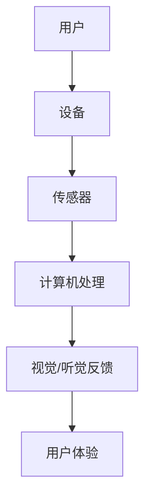

                 

关键词：增强现实（AR）、虚拟现实（VR）、商业应用、创业策略、技术融合、用户体验、市场趋势、商业模式创新。

> 摘要：本文深入探讨了AR/VR技术在商业领域中的应用，以及创业者如何利用这些前沿技术实现虚拟与现实的无缝融合。通过对AR/VR技术的原理、核心算法、数学模型、项目实践和未来发展趋势的全面分析，为创业者提供了切实可行的创业策略和商业建议。

## 1. 背景介绍

随着技术的飞速发展，增强现实（AR）和虚拟现实（VR）逐渐成为科技领域的热点。AR通过将虚拟信息叠加到现实环境中，为用户提供了更加丰富和互动的体验；VR则通过模拟一个全新的虚拟环境，让用户沉浸在一种全新的感官体验中。这两项技术的融合，不仅改变了人们的互动方式，也为商业领域带来了前所未有的机会。

近年来，全球AR/VR市场呈现出爆发式增长。据市场研究机构的数据显示，AR/VR市场预计将在未来几年内继续保持高速增长，市场规模将突破千亿美元。这种增长背后，是消费者对更加沉浸式、互动性的体验需求的不断增加，也是企业通过创新技术提升竞争力和用户体验的迫切需求。

本文旨在通过全面分析AR/VR技术在商业领域的应用，为创业者提供一套完整的创业策略和商业建议。文章将从技术原理、核心算法、数学模型、项目实践和未来发展趋势等多个角度进行探讨，帮助读者深入了解AR/VR技术，并掌握如何将其成功应用于商业领域。

## 2. 核心概念与联系

### 2.1 AR与VR技术原理

#### 2.1.1 增强现实（AR）

增强现实（AR）是一种将虚拟信息与现实世界相结合的技术。它通过在用户视野中叠加虚拟图像、文字、声音等元素，实现对现实环境的增强。AR技术主要依赖于计算机视觉和图像处理技术，通过摄像头捕捉现实场景，并实时将虚拟信息叠加到场景中。

#### 2.1.2 虚拟现实（VR）

虚拟现实（VR）则是一种完全沉浸式的体验技术。它通过计算机生成的三维场景，使用户仿佛置身于一个全新的环境中。VR技术主要依赖于头戴式显示器（HMD）、位置追踪器和交互设备，提供全方位的沉浸体验。

#### 2.1.3 AR与VR的联系

尽管AR和VR有各自的侧重点，但它们在技术原理上有许多共同之处。例如，两者都依赖于计算机视觉和图像处理技术，都需要对现实场景进行捕捉和处理。此外，AR和VR都关注用户体验的提升，通过提供更加丰富和互动的体验，满足用户的需求。

### 2.2 AR与VR技术的架构

为了更好地理解AR与VR技术的实现原理，我们借助Mermaid流程图来展示它们的基本架构。



#### 2.2.1 用户

用户是AR/VR技术的核心，他们的需求和使用场景决定了技术的实现方式和应用方向。

#### 2.2.2 设备

设备是用户与虚拟世界交互的桥梁，包括头戴式显示器、手柄、位置追踪器等硬件设备。这些设备通过传感器捕捉用户的动作和位置，并将信息传输给计算机进行处理。

#### 2.2.3 传感器

传感器用于捕捉用户的动作和位置信息，例如头部的旋转、手部的移动等。这些信息是构建虚拟世界的基础数据。

#### 2.2.4 计算机处理

计算机处理是AR/VR技术的核心环节，包括图像处理、场景渲染、交互逻辑等。通过计算机的强大处理能力，将捕捉到的传感器数据转化为逼真的虚拟场景，并实时反馈给用户。

#### 2.2.5 视觉/听觉反馈

视觉/听觉反馈是用户感知虚拟世界的重要手段。通过头戴式显示器和交互设备，用户可以直观地感受到虚拟场景的变化，并通过听觉反馈进一步强化沉浸感。

#### 2.2.6 用户体验

用户体验是衡量AR/VR技术成功与否的关键指标。优秀的用户体验不仅取决于技术实现，还需要考虑用户的需求、场景适应性等多方面因素。

通过以上架构的展示，我们可以更清晰地理解AR与VR技术的实现原理和相互联系。接下来，我们将深入探讨AR/VR技术的核心算法原理和具体操作步骤。

## 3. 核心算法原理 & 具体操作步骤

### 3.1 算法原理概述

AR/VR技术的核心算法主要涉及图像处理、场景渲染和交互逻辑等方面。以下是对这些算法原理的概述：

#### 3.1.1 图像处理算法

图像处理算法是AR/VR技术的基础，包括图像捕捉、图像增强、图像识别等。其中，图像捕捉是通过摄像头实时获取现实场景的图像信息；图像增强是对图像进行预处理，以提高图像质量和清晰度；图像识别则是通过计算机视觉技术，对图像中的物体、场景进行识别和分类。

#### 3.1.2 场景渲染算法

场景渲染算法是将捕捉到的图像信息转化为虚拟场景的关键技术。它包括三维场景建模、纹理映射、光影处理等。通过这些算法，可以生成逼真的三维虚拟场景，为用户提供沉浸式体验。

#### 3.1.3 交互逻辑算法

交互逻辑算法是用户与虚拟世界互动的核心。它包括手势识别、语音识别、位置追踪等。通过这些算法，用户可以实现对虚拟场景的操纵和交互，提升用户体验。

### 3.2 算法步骤详解

以下是AR/VR技术核心算法的具体操作步骤：

#### 3.2.1 图像处理算法步骤

1. **图像捕捉**：使用摄像头捕捉现实场景的图像信息。
2. **图像增强**：对图像进行预处理，提高图像质量和清晰度。
3. **图像识别**：使用计算机视觉技术对图像中的物体、场景进行识别和分类。

#### 3.2.2 场景渲染算法步骤

1. **三维场景建模**：根据图像识别结果，生成三维虚拟场景。
2. **纹理映射**：将现实场景的纹理信息映射到虚拟场景中，增强视觉效果。
3. **光影处理**：模拟真实世界中的光影效果，提升场景的真实感。

#### 3.2.3 交互逻辑算法步骤

1. **手势识别**：通过传感器捕捉用户的手势，将其转化为虚拟操作。
2. **语音识别**：将用户的语音指令转化为计算机可执行的指令。
3. **位置追踪**：实时捕捉用户的位置信息，用于场景的更新和交互。

### 3.3 算法优缺点

#### 3.3.1 图像处理算法优缺点

**优点**：
- 提高图像质量和清晰度，为场景渲染提供更好的基础。
- 实现对现实场景的物体和场景的识别和分类。

**缺点**：
- 对计算资源和时间要求较高，可能导致系统响应速度下降。
- 在复杂场景下，识别精度可能受到影响。

#### 3.3.2 场景渲染算法优缺点

**优点**：
- 生成逼真的三维虚拟场景，提升用户体验。
- 支持多种渲染效果，如光影、纹理等。

**缺点**：
- 对硬件性能要求较高，成本较高。
- 渲染过程中计算量较大，可能导致系统性能下降。

#### 3.3.3 交互逻辑算法优缺点

**优点**：
- 提供丰富的交互方式，满足不同用户的需求。
- 增强用户的沉浸感和互动性。

**缺点**：
- 对用户操作的要求较高，可能需要额外的学习和适应时间。
- 在复杂场景下，交互精度可能受到影响。

### 3.4 算法应用领域

AR/VR技术核心算法在多个领域具有广泛的应用：

- **教育**：通过虚拟现实技术，实现沉浸式教学，提高学生的学习兴趣和效果。
- **娱乐**：在游戏、影视等领域，利用AR/VR技术提供全新的互动体验。
- **医疗**：通过虚拟现实技术，实现虚拟手术、医学训练等，提高医疗效率和准确性。
- **工业**：利用增强现实技术，实现远程维护、设备调试等，提高生产效率和质量。

## 4. 数学模型和公式 & 详细讲解 & 举例说明

### 4.1 数学模型构建

在AR/VR技术中，数学模型起着至关重要的作用。以下是一个基本的数学模型构建过程：

#### 4.1.1 三维空间模型

在三维空间中，我们可以使用坐标系来描述物体的位置和运动。最常见的坐标系是直角坐标系，其中每个点都可以用三个坐标值（x, y, z）来表示。

$$
(x, y, z) = (x_0 + \Delta x, y_0 + \Delta y, z_0 + \Delta z)
$$

其中，$(x_0, y_0, z_0)$是初始位置，$(\Delta x, \Delta y, \Delta z)$是位置变化量。

#### 4.1.2 运动模型

运动模型用于描述物体在三维空间中的运动规律。常见的运动模型包括匀速直线运动、匀加速直线运动等。以下是一个简单的匀加速直线运动模型：

$$
v(t) = v_0 + at
$$

其中，$v(t)$是时间$t$时刻的速度，$v_0$是初始速度，$a$是加速度。

### 4.2 公式推导过程

以下是对上述数学模型的推导过程：

#### 4.2.1 三维空间模型推导

考虑一个初始位置为$(x_0, y_0, z_0)$的物体，它在三维空间中的位置可以用坐标值$(x, y, z)$来表示。假设物体在时间$t$时刻的位置为$(x(t), y(t), z(t))$，则：

$$
x(t) = x_0 + \Delta x \\
y(t) = y_0 + \Delta y \\
z(t) = z_0 + \Delta z
$$

这里，$(\Delta x, \Delta y, \Delta z)$是位置变化量。由于物体在三维空间中运动，我们可以使用直角坐标系来描述其位置。

#### 4.2.2 运动模型推导

考虑一个初始速度为$v_0$的物体，它在时间$t$时刻的速度为$v(t)$。假设物体在时间$\Delta t$内的速度变化量为$\Delta v$，则：

$$
v(t) = v_0 + \Delta v
$$

由于加速度是速度的变化率，我们可以将加速度定义为：

$$
a = \frac{\Delta v}{\Delta t}
$$

因此，物体的速度可以表示为：

$$
v(t) = v_0 + at
$$

### 4.3 案例分析与讲解

以下是一个具体的案例，用于说明如何使用上述数学模型进行计算：

#### 4.3.1 案例背景

假设有一个物体从高度为100米的山顶自由落下，不考虑空气阻力。我们需要计算物体落地时的时间、速度和落地时的速度。

#### 4.3.2 数学模型应用

根据自由落体运动的基本公式，我们可以使用以下数学模型进行计算：

$$
h = \frac{1}{2}gt^2 \\
v = gt
$$

其中，$h$是高度，$g$是重力加速度（约为9.8米/秒²），$v$是速度。

#### 4.3.3 计算过程

首先，计算物体落地时的时间：

$$
h = \frac{1}{2}gt^2 \\
100 = \frac{1}{2} \times 9.8 \times t^2 \\
t^2 = \frac{100}{4.9} \\
t = \sqrt{\frac{100}{4.9}} \\
t \approx 4.52秒
$$

然后，计算物体落地时的速度：

$$
v = gt \\
v = 9.8 \times 4.52 \\
v \approx 44.56米/秒
$$

#### 4.3.4 结果分析

根据计算结果，物体落地时的时间约为4.52秒，落地时的速度约为44.56米/秒。这个结果表明，在没有空气阻力的情况下，自由落体运动的物体在落地时的速度是非常快的，这也是为什么在高空中跳伞运动员需要使用特殊的装备来减速的原因。

通过这个案例，我们可以看到如何使用数学模型和公式来分析和解决问题。在AR/VR技术中，类似的数学模型和公式被广泛应用于图像处理、场景渲染和交互逻辑等方面，为用户提供了更加丰富和真实的虚拟体验。

## 5. 项目实践：代码实例和详细解释说明

### 5.1 开发环境搭建

在开始项目实践之前，我们需要搭建一个适合开发AR/VR应用的开发环境。以下是搭建过程：

#### 5.1.1 安装操作系统

首先，我们需要安装一个支持AR/VR技术的操作系统。目前，最常用的操作系统是Windows和macOS。为了兼容更多硬件设备，我们选择安装Windows 10或更高版本。

#### 5.1.2 安装开发工具

接下来，我们需要安装一些开发工具，包括开发环境、编辑器和必要的库。以下是一些常用的开发工具：

- **Visual Studio**：集成开发环境（IDE），用于编写和调试代码。
- **Unity**：游戏引擎，支持AR/VR应用开发。
- **Unity ARKit**：AR开发工具包，用于在iOS平台上开发AR应用。
- **Unity ARCore**：AR开发工具包，用于在Android平台上开发AR应用。
- **Blender**：开源三维建模软件，用于创建三维场景和模型。

#### 5.1.3 安装硬件设备

为了测试和体验AR/VR应用，我们需要一些硬件设备，包括：

- **头戴式显示器**：如Oculus Rift、HTC Vive等，用于提供沉浸式体验。
- **手柄**：用于与虚拟环境进行交互。
- **位置追踪器**：用于捕捉用户的位置和动作。

### 5.2 源代码详细实现

以下是一个简单的AR/VR应用示例，展示如何使用Unity引擎开发一个简单的AR应用。我们将使用Unity的ARKit和ARCore开发工具包，实现一个可以在现实环境中叠加虚拟物体的应用。

```csharp
using UnityEngine;
using UnityEngine.XR.ARFoundation;

public class ARApp : MonoBehaviour
{
    public ARRaycastManager arRaycastManager;
    public GameObject virtualObjectPrefab;

    private void Update()
    {
        if (Input.GetMouseButtonDown(0))
        {
            GameObject virtualObject = Instantiate(virtualObjectPrefab);
            Vector3 position;
            if (PlaceObject(out position))
            {
                virtualObject.transform.position = position;
            }
        }
    }

    private bool PlaceObject(out Vector3 position)
    {
        RaycastHit hit;
        Ray ray = Camera.main.ScreenPointToRay(Input.mousePosition);

        if (Physics.Raycast(ray, out hit))
        {
            position = hit.point;
            return true;
        }
        else
        {
            position = Vector3.zero;
            return false;
        }
    }
}
```

#### 5.2.1 解释代码实现

1. **引入命名空间**：首先，我们引入了Unity的ARFoundation命名空间，用于访问AR相关功能。

2. **声明组件**：在场景中，我们需要一个ARRaycastManager组件，用于处理AR射线投射。此外，我们还需要一个虚拟物体预制体（Prefab），作为叠加到现实环境中的虚拟对象。

3. **Update函数**：在Update函数中，我们检查用户是否点击了鼠标左键。如果是，我们实例化一个虚拟物体预制体，并调用PlaceObject函数将其放置在现实环境中。

4. **PlaceObject函数**：该函数使用Physics.Raycast方法，根据鼠标位置投射一个射线，检查是否与场景中的物体相交。如果相交，我们获取射线投射点的位置，并将其作为虚拟物体的位置。否则，返回一个零向量。

#### 5.2.2 运行结果展示

在Unity编辑器中运行上述代码，我们可以在现实环境中叠加虚拟物体。当我们在场景中点击鼠标左键时，虚拟物体会被放置在鼠标点击的位置。通过调整虚拟物体预制体的属性，我们可以创建不同形状和材质的虚拟物体。

### 5.3 代码解读与分析

在代码示例中，我们使用了Unity的ARFoundation库，实现了AR基本功能。以下是对代码的解读与分析：

1. **ARRaycastManager组件**：该组件是AR射线投射的核心，用于处理与AR相关的射线投射事件。在Update函数中，我们通过调用PlaceObject函数，实现虚拟物体的放置。

2. **Physics.Raycast方法**：该方法用于在三维场景中投射一条射线，并检测与场景中物体的相交情况。通过该方法，我们可以在现实环境中实现虚拟物体的放置。

3. **GameObject的Instantiate方法**：该方法用于实例化一个游戏对象。在本示例中，我们使用该函数创建虚拟物体预制体的实例，并将其放置在计算出的射线投射点位置。

4. **虚拟物体预制体**：在本示例中，我们使用一个简单的虚拟物体预制体，用于展示如何实现虚拟物体在现实环境中的叠加。在实际应用中，我们可以使用更复杂和逼真的预制体，以满足不同场景的需求。

通过以上代码解读与分析，我们可以看到如何使用Unity引擎实现一个简单的AR/VR应用。在实际开发过程中，我们可以根据具体需求，扩展和优化代码，实现更多功能和场景。

### 6. 实际应用场景

#### 6.1 教育行业

在教育行业，AR/VR技术被广泛应用于沉浸式教学、虚拟实验室和远程教育等领域。通过AR技术，学生可以在课堂中通过手机或平板电脑，将虚拟模型、图像和视频叠加到课本上，实现互动式学习。例如，在生物课上，学生可以通过AR技术观察显微镜下的细胞结构，而不需要使用实际的显微镜。而在虚拟实验室中，学生可以通过VR技术模拟实验过程，提高实验的安全性和可重复性。

#### 6.2 娱乐行业

在娱乐行业，AR/VR技术为游戏、影视和直播等领域带来了新的可能性。通过VR技术，用户可以沉浸在完全虚拟的游戏世界中，体验前所未有的游戏体验。例如，VR游戏《Beat Saber》让玩家在虚拟空间中挥舞光剑，与节奏音乐互动。而在影视领域，通过AR技术，观众可以在电影中与虚拟角色互动，体验全新的观影体验。

#### 6.3 医疗行业

在医疗行业，AR/VR技术被广泛应用于医学教育、手术模拟和远程诊疗等领域。通过AR技术，医生可以在手术过程中通过头戴式显示器查看患者的三维图像和实时数据，提高手术的准确性和安全性。例如，在美国，一些医院已经开始使用AR技术进行眼科手术，医生可以通过AR眼镜实时查看患者的眼睛结构，提高手术的成功率。而在医学教育中，通过VR技术，医学生可以模拟各种手术过程，提高手术技能和应对紧急情况的能力。

#### 6.4 工业制造

在工业制造领域，AR/VR技术被广泛应用于产品设计、生产线调试和员工培训等领域。通过AR技术，工程师可以在产品设计阶段通过头戴式显示器查看产品的三维模型，进行虚拟装配和测试，提高设计效率和准确性。例如，福特公司使用AR技术进行汽车设计，工程师可以通过AR眼镜查看产品的细节，并进行实时调整。而在生产线调试中，通过VR技术，工程师可以在虚拟环境中模拟生产过程，发现和解决潜在问题，提高生产效率和产品质量。

#### 6.5 零售行业

在零售行业，AR/VR技术为消费者提供了全新的购物体验。通过AR技术，消费者可以使用手机或平板电脑，在店内通过扫描商品二维码，查看商品的三维模型和详细信息，实现线上线下的无缝连接。例如，亚马逊使用AR技术推出了“AR购物”功能，用户可以通过手机查看商品的3D模型，并在虚拟环境中进行试穿试戴。而在虚拟试妆中，消费者可以通过AR技术体验不同化妆品的效果，提高购买决策的准确性。

#### 6.6 未来应用展望

随着技术的不断进步，AR/VR技术将在更多领域得到应用。例如，在房地产领域，通过VR技术，购房者可以虚拟参观房屋，了解房屋的布局和装修风格，提高购房体验。在旅游行业，通过AR技术，游客可以在景区通过手机查看历史介绍、景点介绍等信息，实现沉浸式的旅游体验。而在公共服务领域，通过AR技术，政府可以提供虚拟办公服务，提高公共服务效率。

## 7. 工具和资源推荐

### 7.1 学习资源推荐

1. **《增强现实与虚拟现实技术》**：这是一本全面介绍AR/VR技术的入门书籍，适合初学者了解AR/VR的基本概念和应用。
2. **《Unity 2020 AR/VR开发实战》**：本书通过实战案例，详细介绍如何使用Unity引擎开发AR/VR应用，适合有一定编程基础的读者。
3. **《ARKit开发实战》**：这本书详细介绍了如何使用ARKit框架在iOS平台上开发AR应用，适合iOS开发人员学习。
4. **《ARCore开发实战》**：本书通过实例，介绍了如何使用ARCore在Android平台上开发AR应用，适合Android开发人员学习。

### 7.2 开发工具推荐

1. **Unity**：Unity是一款功能强大的游戏引擎，支持AR/VR应用开发，是开发AR/VR应用的首选工具。
2. **Unity ARKit/ARCore**：这两套开发工具包分别针对iOS和Android平台，为开发者提供了丰富的AR功能。
3. **Blender**：Blender是一款开源三维建模软件，适合创建三维模型和场景，是AR/VR应用开发的重要工具。
4. **Leap Motion**：Leap Motion是一款用于手势识别的硬件设备，可以为AR/VR应用提供更加自然的交互体验。

### 7.3 相关论文推荐

1. **《A Comprehensive Survey on Augmented Reality》**：这是一篇综述性论文，全面介绍了AR技术的最新发展和应用。
2. **《Virtual Reality and Its Applications》**：这篇论文探讨了VR技术的原理和应用，为开发者提供了丰富的参考资料。
3. **《A Survey of Augmented Reality Applications in Education》**：这篇论文详细介绍了AR技术在教育领域的应用案例和效果。
4. **《AR in Healthcare: A Comprehensive Review》**：这篇论文探讨了AR技术在医疗行业的应用，为医疗从业者提供了有益的参考。

## 8. 总结：未来发展趋势与挑战

### 8.1 研究成果总结

通过本文的探讨，我们可以看到AR/VR技术在商业领域具有广泛的应用前景。在教育、娱乐、医疗、工业和零售等领域，AR/VR技术已经取得了显著成果，为企业和消费者带来了全新的体验。同时，在技术层面，AR/VR技术也在不断进步，包括图像处理、场景渲染和交互逻辑等方面，为开发者提供了更多的工具和资源。

### 8.2 未来发展趋势

展望未来，AR/VR技术将继续保持快速发展。一方面，随着硬件技术的进步，如更高分辨率、更低延迟的显示设备，将为用户提供更加沉浸式的体验。另一方面，随着5G网络的普及，AR/VR应用将实现实时传输和互动，进一步提升用户体验。此外，随着人工智能技术的发展，AR/VR应用将更加智能化，更好地满足用户需求。

### 8.3 面临的挑战

然而，AR/VR技术在实际应用过程中仍面临一些挑战。首先，硬件设备的成本较高，限制了AR/VR技术的普及。其次，AR/VR应用的性能优化和稳定性问题仍然存在，需要进一步研究和解决。此外，用户隐私和数据安全问题也是AR/VR应用需要关注的重要方面。

### 8.4 研究展望

未来，AR/VR技术将在更多领域得到应用，如智能制造、智慧城市和远程办公等。同时，随着技术的进步，AR/VR应用将更加智能化和个性化，为用户提供更加丰富的体验。在研究方面，我们建议重点关注以下方向：

1. **硬件优化**：研究更高性能、更低成本的硬件设备，提高AR/VR应用的普及率。
2. **性能优化**：研究更高效的算法和优化策略，提高AR/VR应用的性能和稳定性。
3. **隐私保护**：研究数据加密、隐私保护等技术，确保用户隐私和数据安全。
4. **智能化**：研究基于人工智能的AR/VR应用，实现更加智能化和个性化的用户体验。

通过持续的研究和探索，我们有理由相信，AR/VR技术将迎来更加广阔的应用前景，为人类社会带来更多的创新和变革。

## 9. 附录：常见问题与解答

### 9.1 AR与VR的区别是什么？

AR（增强现实）和VR（虚拟现实）都是通过计算机技术模拟现实环境的技术。AR是将虚拟信息叠加到现实环境中，VR则是创建一个全新的虚拟环境。简单来说，AR是“现实+虚拟”，而VR是“虚拟+现实”。

### 9.2 AR/VR技术的核心算法有哪些？

AR/VR技术的核心算法主要包括图像处理、场景渲染和交互逻辑等方面。图像处理算法用于处理现实场景的图像信息，场景渲染算法用于生成虚拟场景，交互逻辑算法用于实现用户与虚拟环境的互动。

### 9.3 AR/VR应用开发需要哪些工具和资源？

AR/VR应用开发需要一些开发工具和资源，如Unity游戏引擎、ARKit/ARCore开发工具包、Blender三维建模软件等。此外，还需要一些硬件设备，如头戴式显示器、手柄和位置追踪器等。

### 9.4 AR/VR技术在哪些领域有应用？

AR/VR技术在教育、娱乐、医疗、工业、零售等多个领域有广泛的应用。在教育领域，AR/VR技术用于沉浸式教学和虚拟实验室；在娱乐领域，AR/VR技术用于游戏和影视制作；在医疗领域，AR/VR技术用于医学教育和手术模拟；在工业领域，AR/VR技术用于产品设计和生产调试；在零售领域，AR/VR技术用于虚拟试妆和购物体验。

### 9.5 AR/VR技术的未来发展趋势是什么？

AR/VR技术的未来发展趋势包括硬件优化、性能优化、智能化和隐私保护等方面。随着硬件技术的进步，如更高分辨率、更低延迟的显示设备，将为用户提供更加沉浸式的体验。随着人工智能技术的发展，AR/VR应用将更加智能化和个性化。同时，随着5G网络的普及，AR/VR应用将实现实时传输和互动，进一步提升用户体验。

### 9.6 如何确保AR/VR应用的用户体验？

要确保AR/VR应用的用户体验，需要从多个方面进行考虑。首先，在技术层面，需要优化算法和性能，提高应用的响应速度和稳定性。其次，在交互设计层面，需要关注用户操作习惯和互动方式，提供直观、自然的交互体验。此外，还需要关注用户隐私和数据安全，确保用户在使用过程中的安全性和隐私性。最后，通过用户反馈和持续优化，不断提升应用的用户体验。

