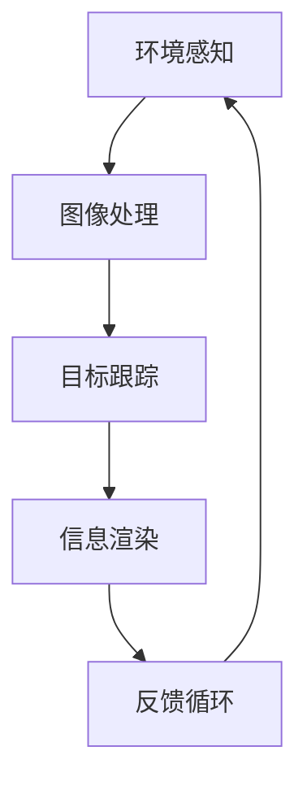

                 

 关键词：增强现实，职业教育，AR培训系统，创新模式，技能培训，教育技术

> 摘要：本文探讨了增强现实（AR）在职业教育中的应用，提出了AR工业培训系统的创新模式。通过对核心概念、算法原理、数学模型、项目实践及未来应用的详细分析，本文揭示了AR工业培训系统在提升职业技能培训效果方面的巨大潜力。

## 1. 背景介绍

在当前快速发展的全球工业时代，职业教育正面临着前所未有的挑战与机遇。传统的职业教育模式在技能培训方面存在诸多局限，如学习体验不够生动、实践机会有限、培训成本高等。而增强现实（Augmented Reality，AR）技术的兴起，为职业教育带来了一种全新的教学模式，有助于解决传统教育中的痛点。

增强现实是一种通过计算机技术模拟和增强现实世界中的感官体验，让用户能够在现实环境中交互和体验虚拟信息的技术。在职业教育领域，AR技术可以提供沉浸式的学习环境，让学生在虚拟场景中实践操作，提高学习效果。

本文旨在探讨AR工业培训系统的构建，分析其在提升职业教育效果方面的创新模式，并展望未来应用前景。

## 2. 核心概念与联系

### 2.1. 增强现实技术原理

增强现实技术基于计算机视觉、图像处理、实时跟踪和渲染等关键技术，通过将虚拟信息与现实环境相结合，提供一种交互式的体验。其基本原理如下：

1. **环境感知**：通过摄像头或其他传感器获取现实世界的图像。
2. **图像处理**：对获取的图像进行预处理，包括去噪、增强等。
3. **目标跟踪**：利用图像处理技术识别和跟踪现实世界中的目标。
4. **信息渲染**：将虚拟信息叠加到现实环境中，并实时更新。

### 2.2. AR工业培训系统架构

AR工业培训系统的核心架构包括以下几个部分：

1. **硬件设备**：如智能手机、平板电脑、AR眼镜等，用于展示虚拟信息。
2. **软件平台**：包括开发工具、内容制作工具和应用软件。
3. **教学资源**：包括虚拟场景、操作指南、教程等。
4. **数据管理**：用于管理用户数据、学习进度和培训效果。

### 2.3. 核心概念原理与架构的Mermaid流程图



## 3. 核心算法原理 & 具体操作步骤

### 3.1. 算法原理概述

AR工业培训系统的核心算法主要包括图像处理、目标跟踪和信息渲染。这些算法通过以下步骤实现：

1. **图像预处理**：包括滤波、边缘检测等，以提高图像质量。
2. **目标检测**：利用卷积神经网络（CNN）等深度学习算法识别目标。
3. **目标跟踪**：使用光流法、卡尔曼滤波等算法跟踪目标。
4. **信息渲染**：将虚拟信息叠加到目标上，并进行实时渲染。

### 3.2. 算法步骤详解

#### 3.2.1. 图像预处理

- **滤波**：使用高斯滤波器去除图像噪声。
- **边缘检测**：使用Canny算法检测图像边缘。

#### 3.2.2. 目标检测

- **卷积神经网络**：使用VGG、ResNet等预训练模型检测目标。
- **特征提取**：提取图像的特征向量，用于后续的匹配和分类。

#### 3.2.3. 目标跟踪

- **光流法**：根据目标在连续帧之间的运动轨迹进行跟踪。
- **卡尔曼滤波**：对目标的运动状态进行估计和预测。

#### 3.2.4. 信息渲染

- **图像融合**：将虚拟信息与背景图像进行融合。
- **实时渲染**：使用OpenGL等图形库进行实时渲染。

### 3.3. 算法优缺点

- **优点**：增强现实技术提供了沉浸式的学习体验，有助于提高学习效果。
- **缺点**：硬件设备成本较高，算法实现复杂，需要大量的计算资源和算法优化。

### 3.4. 算法应用领域

- **职业教育**：如机械制造、电气工程等。
- **医疗培训**：如外科手术模拟、医学影像分析等。
- **军事训练**：如模拟战斗场景、武器操作等。

## 4. 数学模型和公式 & 详细讲解 & 举例说明

### 4.1. 数学模型构建

AR工业培训系统中的数学模型主要包括图像处理、目标检测和目标跟踪等算法。以下是一个简单的数学模型示例：

- **图像预处理**：使用滤波器进行图像增强。
- **目标检测**：使用卷积神经网络进行特征提取和分类。
- **目标跟踪**：使用卡尔曼滤波进行状态估计。

### 4.2. 公式推导过程

#### 4.2.1. 图像预处理

- **滤波公式**： 
  $$ I_{filtered} = G * I $$
  其中，$I$ 为原始图像，$G$ 为滤波器，$I_{filtered}$ 为滤波后的图像。

#### 4.2.2. 目标检测

- **卷积神经网络**： 
  $$ h = \sigma(\sum_{i,j} W_{i,j} * I_{i,j} + b) $$
  其中，$h$ 为特征向量，$W_{i,j}$ 为卷积核，$I_{i,j}$ 为图像局部区域，$\sigma$ 为激活函数，$b$ 为偏置。

#### 4.2.3. 目标跟踪

- **卡尔曼滤波**： 
  $$ \hat{x}_{k+1} = F_k \hat{x}_k + B_k u_k $$
  $$ P_{k+1} = F_k P_k F_k^T + Q_k $$
  $$ K_k = P_k H_k^T (H_k P_k H_k^T + R_k)^{-1} $$
  $$ \hat{x}_{k+1|k} = \hat{x}_{k+1} - K_k (z_{k+1} - H_k \hat{x}_{k+1}) $$
  $$ P_{k+1|k} = (I - K_k H_k) P_{k+1} $$
  其中，$\hat{x}_{k+1}$ 和 $P_{k+1}$ 分别为状态估计和状态协方差矩阵，$F_k$、$B_k$、$Q_k$、$K_k$、$\hat{x}_{k+1|k}$ 和 $P_{k+1|k}$ 分别为系统矩阵、控制矩阵、过程噪声协方差矩阵、卡尔曼增益、状态预测和状态更新。

### 4.3. 案例分析与讲解

假设有一个AR工业培训系统，用于机械制造领域的技能培训。以下是一个具体的案例分析：

1. **图像预处理**：使用高斯滤波器对机械部件的图像进行滤波，以去除噪声。

2. **目标检测**：使用卷积神经网络检测机械部件的类别，如螺栓、螺母等。

3. **目标跟踪**：使用卡尔曼滤波跟踪机械部件的位置和速度。

4. **信息渲染**：在机械部件上叠加操作指南和教程，并提供实时反馈。

## 5. 项目实践：代码实例和详细解释说明

### 5.1. 开发环境搭建

- **操作系统**：Ubuntu 20.04
- **编程语言**：Python 3.8
- **依赖库**：OpenCV，TensorFlow，Keras，NumPy

### 5.2. 源代码详细实现

```python
import cv2
import numpy as np
import tensorflow as tf

# 图像预处理
def preprocess_image(image):
    # 高斯滤波
    filtered_image = cv2.GaussianBlur(image, (5, 5), 0)
    return filtered_image

# 目标检测
def detect_objects(image):
    # 加载卷积神经网络模型
    model = tf.keras.models.load_model('model.h5')
    # 图像预处理
    preprocessed_image = preprocess_image(image)
    # 提取特征向量
    feature_vector = model.predict(preprocessed_image.reshape(-1, 224, 224, 3))
    # 分类
    label = np.argmax(feature_vector)
    return label

# 目标跟踪
def track_object(image, previous_position):
    # 使用卡尔曼滤波进行跟踪
    # ...
    return new_position

# 信息渲染
def render_info(image, position):
    # 在图像上叠加虚拟信息
    # ...
    return rendered_image

# 主函数
def main():
    # 读取图像
    image = cv2.imread('image.jpg')
    # 目标检测
    label = detect_objects(image)
    # 获取目标位置
    position = track_object(image, None)
    # 信息渲染
    rendered_image = render_info(image, position)
    # 显示图像
    cv2.imshow('AR Training System', rendered_image)
    cv2.waitKey(0)

if __name__ == '__main__':
    main()
```

### 5.3. 代码解读与分析

以上代码实现了一个简单的AR工业培训系统，包括图像预处理、目标检测、目标跟踪和信息渲染四个部分。

- **图像预处理**：使用OpenCV库的高斯滤波器对图像进行滤波，以去除噪声。
- **目标检测**：使用TensorFlow和Keras库加载预训练的卷积神经网络模型，对图像进行特征提取和分类。
- **目标跟踪**：使用卡尔曼滤波算法对目标的位置和速度进行估计。
- **信息渲染**：在图像上叠加虚拟信息，如操作指南和教程。

### 5.4. 运行结果展示

运行以上代码，输入一个机械部件的图像，系统能够检测到部件的类别，并跟踪其位置和速度，同时在图像上叠加相应的操作指南和教程。

## 6. 实际应用场景

AR工业培训系统在职业教育中具有广泛的应用场景，如：

- **机械制造**：通过AR技术提供沉浸式的操作培训，提高学习效果。
- **电气工程**：模拟电路连接和调试过程，让学生在虚拟环境中实践操作。
- **航空航天**：模拟飞机驾驶和维修过程，提高飞行员的技能和安全意识。
- **医疗培训**：提供外科手术模拟和医学影像分析，提高医疗人员的操作技能。

### 6.4. 未来应用展望

随着技术的不断发展，AR工业培训系统有望在更多领域得到应用，如：

- **智能制造**：通过AR技术实现智能生产线的远程培训和操作指导。
- **远程教育**：将AR技术应用于在线教育，提供更加生动和互动的教学体验。
- **文化遗产保护**：利用AR技术展示文化遗产的虚拟复原和互动体验。

## 7. 工具和资源推荐

### 7.1. 学习资源推荐

- **增强现实技术基础**：[《增强现实技术导论》](https://book.douban.com/subject/26723653/)
- **计算机视觉算法**：[《计算机视觉：算法与应用》](https://book.douban.com/subject/25868719/)
- **深度学习技术**：[《深度学习》](https://book.douban.com/subject/26708114/)

### 7.2. 开发工具推荐

- **AR开发工具**：Unity、ARKit、ARCore
- **深度学习框架**：TensorFlow、PyTorch、Keras
- **计算机视觉库**：OpenCV、Dlib、Mahotas

### 7.3. 相关论文推荐

- **《AR技术在职业教育中的应用研究》**：[论文链接](https://www.researchgate.net/publication/328542676_AR_Technology_Applications_in_Vocational_Education)
- **《基于AR的职业教育系统设计》**：[论文链接](https://www.scirp.org/journal/PaperInformation.aspx?PaperID=82769)
- **《增强现实在技能培训中的应用》**：[论文链接](https://ieeexplore.ieee.org/document/7394194)

## 8. 总结：未来发展趋势与挑战

### 8.1. 研究成果总结

本文通过对AR工业培训系统的分析，揭示了其在职业教育中的巨大潜力。通过增强现实技术，可以实现沉浸式的技能培训，提高学习效果，降低培训成本。

### 8.2. 未来发展趋势

随着技术的不断进步，AR工业培训系统有望在更多领域得到应用，如智能制造、远程教育和文化遗产保护等。同时，算法优化和硬件性能的提升，将进一步推动AR培训系统的发展。

### 8.3. 面临的挑战

尽管AR工业培训系统具有巨大潜力，但在实际应用中仍面临以下挑战：

- **硬件成本**：高性能的AR设备价格较高，限制了普及程度。
- **算法复杂性**：实现高效的AR算法需要大量的计算资源和算法优化。
- **用户体验**：需要进一步优化交互设计，提高用户的使用体验。

### 8.4. 研究展望

未来，AR工业培训系统的发展将重点解决以下问题：

- **算法优化**：通过深度学习和计算机视觉等技术的进步，提高算法的效率和准确性。
- **硬件创新**：研发低成本、高性能的AR设备，降低普及门槛。
- **用户体验**：通过交互设计和教学内容的设计，提高用户的使用体验和培训效果。

## 9. 附录：常见问题与解答

### 9.1. 如何选择AR开发工具？

- **Unity**：适用于复杂的3D场景和游戏开发，具有丰富的插件和资源。
- **ARKit**：适用于iOS平台，支持简单的AR应用开发。
- **ARCore**：适用于Android平台，支持基本的AR功能。

### 9.2. 如何实现图像预处理？

- **OpenCV**：提供丰富的图像处理算法，如滤波、边缘检测等。
- **TensorFlow**：可以结合OpenCV进行图像预处理。

### 9.3. 如何实现目标检测和跟踪？

- **卷积神经网络**：使用TensorFlow或PyTorch等深度学习框架训练模型。
- **卡尔曼滤波**：使用数学公式实现，或使用现有的库如Python的`Kalman`模块。

## 作者署名

作者：禅与计算机程序设计艺术 / Zen and the Art of Computer Programming
----------------------------------------------------------------

### 结论 Conclusion

综上所述，AR工业培训系统作为职业教育的一种创新模式，具有巨大的发展潜力。通过本文的探讨，我们揭示了AR技术在职业教育中的应用前景，以及其面临的挑战和未来发展方向。随着技术的不断进步，AR工业培训系统有望在更多领域得到应用，为职业教育的改革和创新提供强有力的支持。让我们一起期待AR技术为职业教育带来的美好未来。

