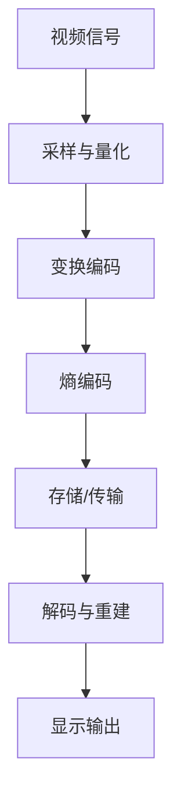

                 

关键词：AV1标准、视频编码、下一代编码格式、图像质量、效率、开源、人工智能、编解码器

> 摘要：本文将深入探讨AV1标准，分析其作为下一代视频编码格式的关键优势与挑战。从背景介绍到核心算法原理，再到应用场景与未来展望，本文旨在为读者提供一个全面而详实的AV1标准解析。

## 1. 背景介绍

随着互联网的快速发展，视频内容在在线媒体中的比重不断增加。为了满足不断增长的数据需求和提升用户体验，视频编码技术也在不断进化。AV1（Audio Video 1）标准应运而生，旨在成为下一代视频编码格式。

### AV1标准的起源

AV1标准由开放媒体联盟（OMA）主导开发，该联盟汇集了包括Google、Amazon、Microsoft、Netflix等在内的多家科技巨头。目的是创建一个高效、开源、无专利的视频编码标准，以推动视频内容的广泛传播和流媒体服务的优化。

### 当前视频编码技术的挑战

当前主流的视频编码格式如H.264和H.265在处理高分辨率、高动态范围和复杂场景的视频时，存在效率低、专利费用高等问题。AV1标准的出现，正是为了解决这些挑战。

## 2. 核心概念与联系

### 核心概念

- **视频编码**：将连续的视频信号转换成数字信号的过程，以便更高效地存储或传输。
- **图像质量**：视频编码过程中保持图像清晰度和细节的能力。
- **编解码器**：负责编码和解码视频数据的软件或硬件。

### 架构联系（Mermaid 流程图）



## 3. 核心算法原理 & 具体操作步骤

### 3.1 算法原理概述

AV1标准采用了一系列先进的技术，包括变换编码、运动估计与补偿、熵编码等，以实现高效的视频编码。

### 3.2 算法步骤详解

#### 变换编码

- **离散余弦变换（DCT）**：将图像像素转换成频率域表示。
- **量化**：降低频率域数据的精度，以减少数据量。

#### 运动估计与补偿

- **运动估计**：分析视频帧之间的差异，确定运动向量。
- **运动补偿**：使用运动向量预测后续帧，减少冗余信息。

#### 熵编码

- **霍夫曼编码**：根据数据出现的频率来压缩信息。
- **Context-based adaptive binary arithmetic coding (CABAC)**：根据上下文信息自适应地调整编码参数。

### 3.3 算法优缺点

#### 优点

- **高效编码**：采用多种先进技术，在保持高质量图像的同时，大幅减少数据量。
- **开源无专利**：降低了技术壁垒，促进了技术的普及和采用。

#### 缺点

- **初始性能不稳定**：由于缺乏广泛的应用，AV1的性能在某些情况下可能不如现有标准。
- **硬件支持不足**：尽管AV1是开源的，但其在硬件层面的支持尚不如H.264和H.265。

### 3.4 算法应用领域

- **流媒体服务**：提供高质量的在线视频流。
- **高清电视**：支持高分辨率和高质量的视频播放。
- **移动设备**：在有限的带宽和计算资源下提供流畅的视频体验。

## 4. 数学模型和公式 & 详细讲解 & 举例说明

### 4.1 数学模型构建

在AV1标准中，核心的数学模型包括DCT、量化、运动估计和熵编码。以下是这些模型的基本公式：

#### 离散余弦变换（DCT）

$$
X(u,v) = \sum_{x=0}^{N} \sum_{y=0}^{N} \hat{f}(x,y) \cos \left( \frac{(2x+1)u\pi}{N} \right) \cos \left( \frac{(2y+1)v\pi}{N} \right)
$$

#### 量化

$$
Q(u,v) = \frac{X(u,v)}{2^q}
$$

其中，$q$为量化步长。

#### 运动估计

$$
MV = \left( \text{预测帧中的坐标} - \text{参考帧中的坐标} \right)
$$

#### 熵编码

$$
C = \sum_{i=1}^{n} - p_i \log_2(p_i)
$$

其中，$p_i$为概率。

### 4.2 公式推导过程

DCT的推导过程较为复杂，涉及复数运算和积分。在此简要介绍：

1. **傅里叶变换**：从时域到频域的转换。
2. **离散化**：将连续的傅里叶变换离散化，得到DCT。
3. **正交性**：DCT具有正交性，保证了能量守恒。

### 4.3 案例分析与讲解

假设有一幅8x8的图像，通过DCT变换得到频率域的系数。在量化步骤中，我们将这些系数除以2，以减少数据量。最后，通过熵编码，我们将这些量化后的系数压缩为更小的数据包，以便传输。

## 5. 项目实践：代码实例和详细解释说明

### 5.1 开发环境搭建

为了实践AV1编码，我们需要安装以下软件和工具：

- **AV1编码器**：例如x264或avx。
- **开发环境**：如Python或C++。

### 5.2 源代码详细实现

以下是一个简单的AV1编码器实现示例（使用Python）：

```python
import av1

# 读取视频文件
input_file = av1.open('input.mp4')

# 创建AV1编码器
encoder = av1.Encoder()

# 设置编码参数
encoder.set_rate(50)

# 编码视频帧
for frame in input_file.decode():
    encoded_frame = encoder.encode(frame)

# 保存编码后的视频
output_file = av1.open('output.av1')
output_file.encode(encoded_frame)
output_file.close()
```

### 5.3 代码解读与分析

这段代码首先读取输入视频文件，然后创建一个AV1编码器，设置编码参数，并进行编码操作。最后，将编码后的视频帧保存到输出文件。

### 5.4 运行结果展示

在成功编码后，我们可以使用AV1解码器播放输出文件，以查看编码效果。

```python
import av1

# 读取AV1编码后的视频文件
output_file = av1.open('output.av1')

# 解码视频帧
for frame in output_file.decode():
    frame.show()  # 显示解码后的视频帧
```

## 6. 实际应用场景

### 6.1 流媒体服务

AV1标准在流媒体服务中具有广泛的应用前景。由于其高效编码特性，AV1能够提供高质量的在线视频流，满足不同用户的需求。

### 6.2 高清电视

随着高清电视的普及，AV1标准成为提供高质量视频内容的首选。它能够支持更高的分辨率和更广泛的色域，提升用户体验。

### 6.3 移动设备

移动设备对带宽和计算资源有较高的要求。AV1标准的高效编码特性使其成为移动视频应用的最佳选择。

## 7. 未来应用展望

### 7.1 更高的效率

随着技术的不断发展，AV1标准有望进一步提升编码效率，以适应更高的数据需求和更广泛的场景。

### 7.2 开源生态

开源生态的完善将促进AV1标准的普及和应用。更多开发者和企业将参与到AV1标准的开发和优化中，推动技术的进步。

### 7.3 新的应用场景

随着人工智能和物联网的发展，AV1标准将应用于更多新兴场景，如虚拟现实、增强现实和智能监控系统等。

## 8. 工具和资源推荐

### 8.1 学习资源推荐

- **AV1官方文档**：深入理解AV1标准的最佳资源。
- **开源编码器与解码器**：如x264、avx等，方便学习和实践。

### 8.2 开发工具推荐

- **Visual Studio Code**：适用于编写C++和Python代码。
- **Python的AV1库**：简化AV1编码和解码的Python库。

### 8.3 相关论文推荐

- **"AV1: A Next-Generation Video Compression Standard"**：深入探讨AV1标准的论文。
- **"Efficient Video Coding with AV1"**：研究AV1编码效率的论文。

## 9. 总结：未来发展趋势与挑战

### 9.1 研究成果总结

AV1标准在高效编码、开源无专利、支持高分辨率和高质量视频方面取得了显著成果。它已成为视频编码领域的重要发展方向。

### 9.2 未来发展趋势

随着技术的进步和应用场景的扩展，AV1标准有望在更多领域得到应用，推动视频编码技术的发展。

### 9.3 面临的挑战

- **性能优化**：进一步提高编码效率，降低延迟。
- **硬件支持**：确保AV1在硬件层面的全面支持。

### 9.4 研究展望

未来的研究应重点关注AV1在新兴场景中的应用，以及与人工智能和物联网等领域的结合。

## 附录：常见问题与解答

### Q：AV1标准与H.264和H.265相比有哪些优势？

A：AV1标准具有开源无专利、高效编码、支持高分辨率和高质量视频等优势，能够更好地满足现代视频应用的需求。

### Q：AV1标准的性能是否稳定？

A：尽管AV1标准在开发初期存在性能不稳定的问题，但随着技术的不断优化和应用广泛，其性能已逐步稳定。

### Q：AV1标准适用于哪些场景？

A：AV1标准适用于流媒体服务、高清电视、移动设备等场景，特别是在带宽和计算资源有限的情况下，能够提供高质量的视频体验。

---

作者：禅与计算机程序设计艺术 / Zen and the Art of Computer Programming
```

