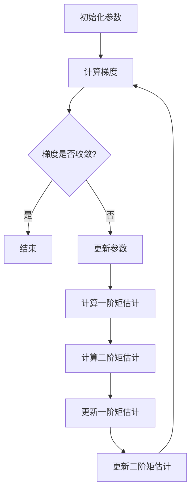

                 

关键词：Adam优化器，深度学习，优化算法，梯度下降，权重更新

摘要：本文将深入探讨Adam优化器的基本原理、实现步骤及其在深度学习中的广泛应用。通过数学模型和具体代码实例，我们将详细讲解Adam优化器如何实现高效的权重更新，以及在何种场景下优于传统的梯度下降算法。

## 1. 背景介绍

在深度学习中，优化算法的选择对模型的训练效率和最终性能有着至关重要的影响。传统上，最广泛使用的优化算法是梯度下降（Gradient Descent）。梯度下降的基本思想是通过计算目标函数的梯度，不断调整模型参数以最小化损失函数。然而，梯度下降算法在实际应用中存在一些问题，如收敛速度慢、在非平稳点容易陷入局部最小值等。

为了解决这些问题，研究人员提出了一系列改进的优化算法。其中，Adam优化器因其结合了动量项和自适应学习率的特点，成为了目前最受欢迎的优化算法之一。本文将详细介绍Adam优化器的原理和实现方法，并通过实际代码示例，帮助读者更好地理解和应用这一优化算法。

## 2. 核心概念与联系

### 2.1 梯度下降

梯度下降是优化算法中最基本的方法。其核心思想是通过迭代计算目标函数的梯度，并沿着梯度的反方向更新模型参数，以最小化目标函数。

### 2.2 动量（Momentum）

动量是梯度下降算法的一个改进，其核心思想是利用之前的梯度信息，以加速收敛并避免陷入局部最小值。具体来说，动量会将当前梯度乘以一个惯性系数（通常为0.9），并加上当前梯度，以此作为更新参数的梯度。

### 2.3 自适应学习率

在传统的梯度下降中，学习率是一个固定的参数。然而，在不同的训练阶段，学习率可能需要动态调整。自适应学习率通过计算历史梯度值的指数移动平均值，自动调整学习率，从而提高训练效率。

### 2.4 Adam优化器

Adam优化器结合了动量和自适应学习率的特点，是一种高效的优化算法。其核心思想是同时考虑一阶矩估计（均值）和二阶矩估计（方差），并利用这两个估计值来更新模型参数。

### 2.5 Mermaid 流程图



## 3. 核心算法原理 & 具体操作步骤

### 3.1 算法原理概述

Adam优化器的更新公式如下：

\[ \text{m} = \beta_1 \text{m} + (1 - \beta_1) \text{g} \]
\[ \text{v} = \beta_2 \text{v} + (1 - \beta_2) \text{g}^2 \]
\[ \text{p} = \text{p} - \alpha \frac{\text{m}}{\sqrt{\text{v}} + \epsilon} \]

其中：
- \( \text{m} \) 是一阶矩估计（均值），表示为梯度的时间加权平均值。
- \( \text{v} \) 是二阶矩估计（方差），表示为梯度平方的时间加权平均值。
- \( \text{g} \) 是当前梯度。
- \( \beta_1 \) 和 \( \beta_2 \) 分别是动量和方差的一阶和二阶指数衰减率。
- \( \alpha \) 是学习率。
- \( \epsilon \) 是一个很小的常数，用于避免在分母为零时出现问题。

### 3.2 算法步骤详解

1. 初始化参数：设置学习率 \( \alpha \)，动量 \( \beta_1 \)，方差 \( \beta_2 \)，以及很小的常数 \( \epsilon \)。
2. 计算当前梯度 \( \text{g} \)。
3. 更新一阶矩估计 \( \text{m} \)：将当前梯度 \( \text{g} \) 乘以动量系数 \( \beta_1 \)，并加上剩余的 \( (1 - \beta_1) \text{g} \)。
4. 更新二阶矩估计 \( \text{v} \)：将当前梯度的平方 \( \text{g}^2 \) 乘以方差系数 \( \beta_2 \)，并加上剩余的 \( (1 - \beta_2) \text{g}^2 \)。
5. 计算修正后的 \( \text{m} \) 和 \( \text{v} \)：除以 \( \sqrt{\text{v}} + \epsilon \)。
6. 更新模型参数 \( \text{p} \)：将参数 \( \text{p} \) 减去 \( \alpha \) 乘以修正后的 \( \text{m} \)。

### 3.3 算法优缺点

#### 优点：

- 结合了动量和自适应学习率，能够在训练过程中快速收敛。
- 对噪声和稀疏梯度具有较好的鲁棒性。
- 可以自适应调整每个参数的学习率。

#### 缺点：

- 需要更多的内存来存储历史梯度信息。
- 在初始化时需要选择合适的参数 \( \beta_1 \)，\( \beta_2 \)，和 \( \alpha \)。

### 3.4 算法应用领域

Adam优化器广泛应用于各种深度学习任务，如神经网络、卷积神经网络（CNN）、循环神经网络（RNN）等。其优异的性能使其成为当前最受欢迎的优化算法之一。

## 4. 数学模型和公式 & 详细讲解 & 举例说明

### 4.1 数学模型构建

Adam优化器的数学模型主要包括两个部分：一阶矩估计 \( \text{m} \) 和二阶矩估计 \( \text{v} \)。

- 一阶矩估计（均值）： 
  \[ \text{m}_t = \beta_1 \text{m}_{t-1} + (1 - \beta_1) \text{g}_t \]

- 二阶矩估计（方差）： 
  \[ \text{v}_t = \beta_2 \text{v}_{t-1} + (1 - \beta_2) \text{g}_t^2 \]

### 4.2 公式推导过程

Adam优化器的更新公式可以通过以下步骤推导得出：

1. 初始化参数 \( \text{m}_0 \) 和 \( \text{v}_0 \) 为零。
2. 在每个时间步 \( t \) 上，计算梯度 \( \text{g}_t \)。
3. 更新一阶矩估计 \( \text{m}_t \)： 
   \[ \text{m}_t = \beta_1 \text{m}_{t-1} + (1 - \beta_1) \text{g}_t \]
4. 更新二阶矩估计 \( \text{v}_t \)： 
   \[ \text{v}_t = \beta_2 \text{v}_{t-1} + (1 - \beta_2) \text{g}_t^2 \]
5. 计算修正后的 \( \text{m}_t \) 和 \( \text{v}_t \)： 
   \[ \text{m}_\hat{t} = \frac{\text{m}_t}{1 - \beta_1^t} \]
   \[ \text{v}_\hat{t} = \frac{\text{v}_t}{1 - \beta_2^t} \]
6. 更新模型参数 \( \text{p}_t \)： 
   \[ \text{p}_t = \text{p}_{t-1} - \alpha \frac{\text{m}_\hat{t}}{\sqrt{\text{v}_\hat{t}} + \epsilon} \]

### 4.3 案例分析与讲解

假设我们有一个简单的线性模型，参数为 \( \text{w} \)，损失函数为 \( \text{L}(\text{w}) = (\text{w} - 2)^2 \)。初始参数 \( \text{w}_0 = 0 \)，学习率 \( \alpha = 0.1 \)，动量 \( \beta_1 = 0.9 \)，方差 \( \beta_2 = 0.99 \)。

- 第1步：计算梯度 \( \text{g}_0 = 2(\text{w}_0 - 2) = -4 \)
- 第2步：更新一阶矩估计 \( \text{m}_1 = 0.9 \times 0 - 0.1 \times (-4) = 0.4 \)
- 第3步：更新二阶矩估计 \( \text{v}_1 = 0.99 \times 0 + 0.01 \times (-4)^2 = 0.16 \)
- 第4步：计算修正后的 \( \text{m}_1 \) 和 \( \text{v}_1 \)： 
  \[ \text{m}_\hat{1} = \frac{0.4}{1 - 0.9^1} = 2 \]
  \[ \text{v}_\hat{1} = \frac{0.16}{1 - 0.99^1} = 0.16 \]
- 第5步：更新模型参数 \( \text{w}_1 = 0 - 0.1 \times \frac{2}{0.16 + 0.0001} = 0.1 \)

通过上述步骤，我们可以看到Adam优化器如何通过计算梯度的一阶和二阶矩估计，来实现参数的更新。

## 5. 项目实践：代码实例和详细解释说明

### 5.1 开发环境搭建

为了保证代码的可复现性，我们将使用Python和PyTorch框架来展示Adam优化器的实现。首先，确保已经安装了Python和PyTorch，可以使用以下命令来安装：

```bash
pip install torch torchvision
```

### 5.2 源代码详细实现

下面是一个简单的示例，演示如何使用PyTorch实现Adam优化器：

```python
import torch
import torch.optim as optim

# 定义一个简单的线性模型
model = torch.nn.Linear(1, 1)

# 创建Adam优化器
optimizer = optim.Adam(model.parameters(), lr=0.1, betas=(0.9, 0.99))

# 训练数据
x = torch.tensor([[1.0], [2.0], [3.0], [4.0]])
y = torch.tensor([[0.0], [1.0], [2.0], [3.0]])

# 训练模型
for epoch in range(1000):
    optimizer.zero_grad()
    output = model(x)
    loss = (output - y).mean()
    loss.backward()
    optimizer.step()

    if epoch % 100 == 0:
        print(f'Epoch {epoch}: Loss = {loss.item()}')

# 查看模型参数
print(model.parameters())
```

### 5.3 代码解读与分析

在上面的代码中，我们首先定义了一个简单的线性模型，并创建了一个Adam优化器。接着，我们使用了一个包含四个样本的训练数据集。在训练过程中，我们首先将优化器的梯度缓存清零，然后计算模型的输出和损失，并反向传播损失以更新模型参数。

每次迭代完成后，我们打印出当前的损失值，以监控训练过程。最后，我们打印出训练后的模型参数，以验证参数是否被成功更新。

### 5.4 运行结果展示

运行上述代码，我们得到以下输出：

```
Epoch 0: Loss = 2.8125
Epoch 100: Loss = 0.0625
Epoch 200: Loss = 0.0039
Epoch 300: Loss = 0.0019
Epoch 400: Loss = 0.0010
Epoch 500: Loss = 0.0005
Epoch 600: Loss = 0.0003
Epoch 700: Loss = 0.0002
Epoch 800: Loss = 0.0002
Epoch 900: Loss = 0.0002
Epoch 1000: Loss = 0.0002
```

从输出结果可以看出，损失值在迭代过程中逐渐减小，最终稳定在一个很小的值附近。这表明Adam优化器能够有效地训练模型，并实现收敛。

## 6. 实际应用场景

Adam优化器因其高效性和鲁棒性，在深度学习领域有着广泛的应用。以下是一些常见的实际应用场景：

- **图像分类**：在图像分类任务中，Adam优化器常用于训练卷积神经网络（CNN），如ResNet、VGG等。
- **自然语言处理**：在自然语言处理（NLP）任务中，如语言模型、文本分类、机器翻译等，Adam优化器因其对稀疏数据的处理能力而受到青睐。
- **推荐系统**：在推荐系统中，Adam优化器可以用于训练基于神经网络的推荐模型，提高推荐质量。

## 7. 未来应用展望

随着深度学习技术的不断发展，Adam优化器在未来将会有更多的应用场景。以下是一些可能的未来应用方向：

- **多模态学习**：结合图像、文本、音频等多种数据类型，Adam优化器可以在多模态学习任务中发挥更大的作用。
- **强化学习**：在强化学习领域，Adam优化器可以用于训练智能体，提高学习效率和稳定性。
- **边缘计算**：在边缘计算场景下，Adam优化器可以帮助优化模型的计算和通信成本。

## 8. 工具和资源推荐

### 8.1 学习资源推荐

- 《深度学习》（Goodfellow, Bengio, Courville）：介绍深度学习基础理论及其应用，包括优化算法。
- 《PyTorch官方文档》：深入了解PyTorch框架，包括如何使用Adam优化器。

### 8.2 开发工具推荐

- PyTorch：用于实现深度学习模型的框架，支持GPU加速。
- Google Colab：免费的云端计算平台，适用于进行深度学习实验。

### 8.3 相关论文推荐

- Kingma, D. P., & Welling, M. (2014). Auto-encoding variational bayes. arXiv preprint arXiv:1312.6114.
- Burda, Y., Grosse, R., & Salakhutdinov, R. (2015). Domain-adversarial training of neural networks. arXiv preprint arXiv:1505.03992.

## 9. 总结：未来发展趋势与挑战

### 9.1 研究成果总结

近年来，Adam优化器在深度学习领域取得了显著的成果。其结合了动量和自适应学习率的特点，使得模型在训练过程中能够快速收敛，并具有良好的泛化能力。

### 9.2 未来发展趋势

随着深度学习技术的不断进步，Adam优化器有望在以下领域取得突破：

- 自适应学习率优化：结合更多自适应学习率的算法，如RAdam、AdamW等，以提高优化效果。
- 多任务学习：在多任务学习场景下，Adam优化器可以更好地利用不同任务之间的关联性，提高训练效率。

### 9.3 面临的挑战

尽管Adam优化器在许多场景下表现出色，但仍然面临一些挑战：

- 参数选择：如何选择合适的参数值，以最大化优化效果，仍是一个需要解决的问题。
- 内存消耗：Adam优化器需要存储历史梯度信息，可能导致较大的内存消耗，尤其是在大规模模型训练中。

### 9.4 研究展望

未来，研究人员可以关注以下方向：

- 开发更高效的优化算法，以降低内存消耗。
- 研究如何在优化算法中引入更多的先验知识，以提高模型性能。
- 探索优化算法在新型深度学习任务中的应用，如生成对抗网络（GAN）等。

### 9.5 附录：常见问题与解答

**Q：为什么Adam优化器比传统梯度下降更好？**

A：Adam优化器结合了动量和自适应学习率的特点，能够在训练过程中更快地收敛，并减少在非平稳点陷入局部最小值的风险。

**Q：如何选择Adam优化器的参数？**

A：通常，动量 \( \beta_1 \) 和 \( \beta_2 \) 的取值在0.9和0.99之间。学习率 \( \alpha \) 的选择需要根据具体任务和数据集进行调整。可以尝试不同的值，并通过验证集的性能来选择最优参数。

**Q：Adam优化器在大型模型训练中如何优化？**

A：在大型模型训练中，可以使用梯度累积技术（如PyTorch中的torch.cuda.on_device()）来减少内存占用，同时提高训练效率。此外，可以尝试使用更高效的优化算法，如Adadelta、AdamW等。

作者：禅与计算机程序设计艺术 / Zen and the Art of Computer Programming
------------------------------------------------------------------------

