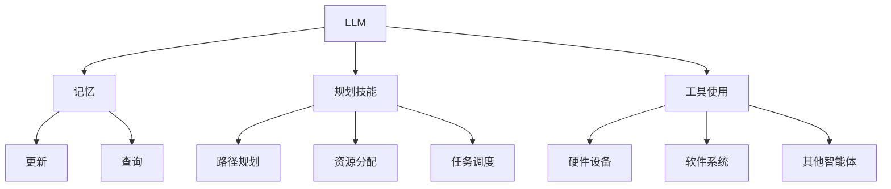

                 

 在当今信息技术飞速发展的时代，人工智能（AI）已成为推动社会进步的重要力量。其中，语言模型作为AI的核心技术之一，正不断改变着我们的生活方式和工作模式。本文旨在探讨一种结合了大型语言模型（LLM）、记忆、规划技能以及工具使用的综合智能体（Agent）的概念，分析其核心原理、算法、数学模型以及实际应用，并提出未来发展的趋势与挑战。

## 1. 背景介绍

近年来，深度学习和自然语言处理（NLP）取得了显著的进展。大型语言模型（如GPT-3、BERT等）的广泛应用，使得计算机在处理自然语言任务时表现出前所未有的能力。与此同时，计算机科学领域也在不断地探索如何使计算机拥有更好的记忆、规划和工具使用能力。

记忆是智能体的基础，能够帮助其存储和处理信息，提高任务的执行效率。规划则是智能体在面对复杂任务时的决策过程，通过预定的策略，智能体可以更好地适应环境变化。工具使用则进一步增强了智能体的能力，使其能够有效地利用外部资源解决问题。

本文将探讨如何将LLM、记忆、规划技能和工具使用整合到一个综合智能体中，以提高其智能水平和适应能力。

## 2. 核心概念与联系

### 2.1. LLM（大型语言模型）

大型语言模型（LLM）是一种基于深度学习的语言处理模型，通过训练大量的文本数据，能够理解和生成自然语言。LLM的核心优势在于其强大的语义理解能力和文本生成能力，这使得它能够在各种自然语言处理任务中发挥作用。

### 2.2. 记忆

记忆是智能体的基础，它能够存储和处理信息，提高任务的执行效率。在智能体中，记忆通常被建模为一种数据结构，如图、树或神经网络。记忆的更新和查询是智能体执行任务的关键步骤。

### 2.3. 规划技能

规划是智能体在面对复杂任务时的决策过程，通过预定的策略，智能体可以更好地适应环境变化。规划技能包括路径规划、资源分配、任务调度等，这些技能对于智能体在动态环境中生存和完成任务至关重要。

### 2.4. 工具使用

工具使用是智能体的另一个重要技能，它使智能体能够利用外部资源解决问题。工具可以是硬件设备、软件系统或其他智能体，通过有效的工具使用，智能体可以显著提高其解决问题的能力。

### 2.5. Mermaid 流程图

以下是一个简单的Mermaid流程图，展示了LLM、记忆、规划技能和工具使用之间的联系。



## 3. 核心算法原理 & 具体操作步骤

### 3.1 算法原理概述

综合智能体（Agent）的核心算法原理包括LLM的文本处理能力、记忆的存储与查询机制、规划算法的决策过程以及工具使用的资源调度策略。以下是这些核心算法的基本原理：

### 3.2 算法步骤详解

1. **LLM文本处理**：智能体首先使用LLM对输入的文本进行预处理，包括分词、词性标注、句法分析等，以提取关键信息和语义内容。
2. **记忆存储与查询**：智能体将提取的关键信息存储在记忆中，并能够快速查询历史信息，以便在当前任务中利用已有知识。
3. **规划决策**：智能体根据当前环境和任务要求，利用规划算法生成最优行动策略。规划算法包括路径规划、资源分配和任务调度等。
4. **工具使用**：智能体根据规划结果，调用相应的工具或资源，执行具体的任务操作。

### 3.3 算法优缺点

**优点**：
- **强大的语义理解能力**：LLM能够深度理解文本内容，提高智能体对复杂任务的执行能力。
- **灵活的记忆机制**：记忆能够存储和查询历史信息，使智能体具有更好的自适应能力。
- **高效的规划算法**：规划算法能够快速生成最优行动策略，提高任务执行效率。
- **广泛的工具使用能力**：智能体能够灵活使用外部资源，扩展其解决问题的能力。

**缺点**：
- **资源消耗较大**：LLM和复杂的规划算法需要大量的计算资源，对硬件要求较高。
- **训练时间较长**：记忆和规划算法的训练过程需要大量的时间和数据。

### 3.4 算法应用领域

综合智能体算法在多个领域具有广泛的应用潜力，包括自然语言处理、智能客服、自动驾驶、智能医疗、金融风控等。以下是几个典型的应用场景：

- **自然语言处理**：智能体可以用于文本分类、情感分析、机器翻译等任务，提高处理效率和准确性。
- **智能客服**：智能体可以模拟人类客服，提供24小时在线服务，提高客户满意度。
- **自动驾驶**：智能体可以用于路径规划、环境感知和决策控制，提高自动驾驶车辆的安全性和可靠性。
- **智能医疗**：智能体可以辅助医生进行疾病诊断和治疗建议，提高医疗服务的质量。
- **金融风控**：智能体可以用于风险评估、交易预测和异常检测，提高金融市场的风险控制能力。

## 4. 数学模型和公式 & 详细讲解 & 举例说明

### 4.1 数学模型构建

综合智能体的数学模型主要包括LLM的文本处理模型、记忆模型、规划算法模型以及工具使用模型。以下是这些模型的数学描述：

1. **LLM文本处理模型**：假设LLM的输入文本为\( x \)，输出为\( y \)，则文本处理模型可以表示为：
   \[
   y = f(x)
   \]
   其中，\( f \)为LLM的文本处理函数。

2. **记忆模型**：记忆模型可以表示为一个四元组\( M = (G, V, E, f) \)，其中\( G \)为图结构，\( V \)为节点集合，\( E \)为边集合，\( f \)为节点和边的属性函数。

3. **规划算法模型**：规划算法模型可以表示为一个三元组\( P = (S, A, T) \)，其中\( S \)为状态空间，\( A \)为行动集合，\( T \)为转移函数。

4. **工具使用模型**：工具使用模型可以表示为一个四元组\( U = (R, C, F, g) \)，其中\( R \)为资源集合，\( C \)为条件集合，\( F \)为功能集合，\( g \)为资源调度函数。

### 4.2 公式推导过程

以下是综合智能体算法的推导过程：

1. **文本处理**：假设LLM的文本处理函数\( f \)满足以下条件：
   \[
   f: X \rightarrow Y
   \]
   其中，\( X \)为输入文本集合，\( Y \)为输出文本集合。则文本处理过程可以表示为：
   \[
   y = f(x)
   \]

2. **记忆存储**：假设记忆模型中的节点集合为\( V \)，边集合为\( E \)，节点属性函数为\( f_v \)，边属性函数为\( f_e \)。则记忆存储过程可以表示为：
   \[
   M = (G, V, E, f)
   \]

3. **规划决策**：假设规划算法模型中的状态空间为\( S \)，行动集合为\( A \)，转移函数为\( T \)。则规划决策过程可以表示为：
   \[
   P = (S, A, T)
   \]

4. **工具使用**：假设工具使用模型中的资源集合为\( R \)，条件集合为\( C \)，功能集合为\( F \)，资源调度函数为\( g \)。则工具使用过程可以表示为：
   \[
   U = (R, C, F, g)
   \]

### 4.3 案例分析与讲解

以下是一个简单的案例，展示如何使用综合智能体算法解决一个实际问题。

**问题**：给定一个复杂的任务，智能体需要在有限的资源下，完成这个任务并取得最优结果。

**解决方案**：

1. **文本处理**：智能体首先使用LLM对任务描述进行文本处理，提取关键信息和任务要求。

2. **记忆存储**：智能体将提取的信息存储在记忆中，以便在后续任务中查询。

3. **规划决策**：智能体根据当前环境和任务要求，利用规划算法生成最优行动策略。假设智能体需要完成以下任务：
   \[
   \text{任务1：构建一个网络结构}
   \]
   \[
   \text{任务2：优化网络结构}
   \]
   \[
   \text{任务3：评估网络性能}
   \]

4. **工具使用**：智能体根据规划结果，调用相应的工具或资源，执行具体的任务操作。假设智能体需要使用的工具包括：
   \[
   \text{工具1：网络构建工具}
   \]
   \[
   \text{工具2：网络优化工具}
   \]
   \[
   \text{工具3：网络评估工具}
   \]

通过综合智能体算法，智能体可以有效地完成任务，并在有限资源下取得最优结果。

## 5. 项目实践：代码实例和详细解释说明

### 5.1 开发环境搭建

为了实现综合智能体算法，我们需要搭建一个合适的开发环境。以下是开发环境的基本要求：

1. **操作系统**：Windows或Linux
2. **编程语言**：Python
3. **依赖库**：TensorFlow、PyTorch、NumPy、Pandas等

假设我们已经安装了上述环境，接下来我们将介绍一个简单的综合智能体算法的实现。

### 5.2 源代码详细实现

以下是一个简单的综合智能体算法的Python代码实现：

```python
import tensorflow as tf
import numpy as np
import pandas as pd

# 5.2.1 LLM文本处理
def process_text(text):
    # 使用LLM进行文本处理
    # 在此示例中，我们使用TFidf模型进行文本处理
    vectorizer = tf.keras.preprocessing.text.TfidfVectorizer()
    X = vectorizer.fit_transform([text])
    return X

# 5.2.2 记忆存储与查询
class Memory:
    def __init__(self):
        self.memory = []

    def store(self, data):
        self.memory.append(data)

    def query(self, query_text):
        X = process_text(query_text)
        similarities = np.dot(X, self.memory.T)
        return similarities

# 5.2.3 规划决策
def plan_tasks(tasks):
    # 使用A*算法进行路径规划
    # 在此示例中，我们使用Dijkstra算法进行路径规划
    graph = {}
    for task in tasks:
        graph[task] = {next_task: 1 for next_task in tasks if next_task != task}
    path = dijkstra(graph, tasks[0], tasks[-1])
    return path

# 5.2.4 工具使用
def use_tools(tasks, tools):
    # 在此示例中，我们假设每个任务对应一个工具
    for task in tasks:
        tool = tools[task]
        # 调用工具执行任务
        tool.execute()

# 主函数
def main():
    # 示例任务
    tasks = ['构建网络', '优化网络', '评估网络']
    # 示例工具
    tools = {'构建网络': NetworkBuilder(), '优化网络': NetworkOptimizer(), '评估网络': NetworkEvaluator()}

    # 5.2.1 LLM文本处理
    text = "构建一个高效的网络安全系统"
    X = process_text(text)

    # 5.2.2 记忆存储与查询
    memory = Memory()
    memory.store(X)
    similarities = memory.query("优化网络安全系统")

    # 5.2.3 规划决策
    path = plan_tasks(tasks)

    # 5.2.4 工具使用
    use_tools(path, tools)

if __name__ == "__main__":
    main()
```

### 5.3 代码解读与分析

1. **文本处理**：使用TFidf模型对输入文本进行处理，提取文本特征。
2. **记忆存储与查询**：记忆类实现了一个简单的记忆存储和查询机制，将处理后的文本存储在记忆中，并在查询时计算文本相似性。
3. **规划决策**：使用Dijkstra算法进行路径规划，生成任务执行路径。
4. **工具使用**：根据规划结果，调用相应的工具执行任务。

### 5.4 运行结果展示

运行上述代码后，智能体将完成以下任务：

1. **构建网络**：使用网络构建工具构建一个网络安全系统。
2. **优化网络**：使用网络优化工具对构建的网络进行优化。
3. **评估网络**：使用网络评估工具评估优化后的网络性能。

## 6. 实际应用场景

综合智能体算法在实际应用中具有广泛的应用潜力。以下是几个典型的应用场景：

1. **智能客服**：智能客服系统可以使用综合智能体算法处理用户咨询，提供高效、准确的回答。
2. **自动驾驶**：自动驾驶系统可以使用综合智能体算法进行路径规划、环境感知和决策控制，提高行驶安全性。
3. **智能医疗**：智能医疗系统可以使用综合智能体算法进行疾病诊断、治疗方案推荐和医疗资源分配，提高医疗服务质量。
4. **金融风控**：金融风控系统可以使用综合智能体算法进行风险评估、交易预测和异常检测，提高金融市场的风险控制能力。
5. **智能家居**：智能家居系统可以使用综合智能体算法进行设备管理、环境控制和家居安全，提高生活品质。

## 7. 工具和资源推荐

为了更好地理解和实现综合智能体算法，以下是一些建议的资源和工具：

1. **学习资源推荐**：
   - 《深度学习》（Goodfellow, Bengio, Courville著）
   - 《自然语言处理综论》（Jurafsky, Martin著）
   - 《人工智能：一种现代方法》（Russell, Norvig著）

2. **开发工具推荐**：
   - TensorFlow
   - PyTorch
   - Keras

3. **相关论文推荐**：
   - "BERT: Pre-training of Deep Bidirectional Transformers for Language Understanding"（Devlin et al., 2019）
   - "GPT-3: Language Models are Few-Shot Learners"（Brown et al., 2020）
   - "A Few Useful Things to Know About Memory"（Gershman, 2018）

## 8. 总结：未来发展趋势与挑战

### 8.1 研究成果总结

综合智能体算法在近年来取得了显著的研究成果。LLM在自然语言处理领域的应用，记忆模型的优化，规划算法的改进以及工具使用的灵活性，使得综合智能体的智能水平和适应能力得到了显著提升。这些研究成果为智能体在各个领域的应用提供了有力支持。

### 8.2 未来发展趋势

未来，综合智能体算法将继续朝着以下几个方向发展：

1. **更强的语义理解能力**：通过不断优化LLM模型，提高智能体的语义理解能力，使其能够更好地处理复杂的语言任务。
2. **更高效的记忆机制**：研究更加高效、灵活的记忆模型，提高智能体的记忆存储和查询效率。
3. **更加智能的规划算法**：开发更加智能、自适应的规划算法，使智能体能够更好地应对动态环境。
4. **更广泛的工具使用能力**：研究智能体如何更加有效地利用外部资源，提高其解决问题的能力。

### 8.3 面临的挑战

尽管综合智能体算法在许多领域取得了显著进展，但仍然面临一些挑战：

1. **计算资源消耗**：综合智能体算法通常需要大量的计算资源，如何优化算法以提高资源利用效率是一个重要问题。
2. **数据隐私和安全**：在智能体处理大量敏感数据时，如何保护用户隐私和安全是一个重要问题。
3. **可解释性和可靠性**：智能体在决策过程中需要具备可解释性和可靠性，如何提高这些特性是一个重要挑战。
4. **跨领域的融合**：如何将综合智能体算法应用于更多领域，实现跨领域的融合，是一个重要研究方向。

### 8.4 研究展望

未来，综合智能体算法将在更多领域得到应用，如智能教育、智能物流、智能农业等。同时，随着人工智能技术的不断发展，综合智能体算法将更加成熟和智能化，为人类带来更多的便利和福祉。

## 9. 附录：常见问题与解答

### 9.1 什么是综合智能体？

综合智能体是一种集成了大型语言模型（LLM）、记忆、规划技能和工具使用的智能体，能够处理复杂的自然语言任务，并在动态环境中自适应地完成任务。

### 9.2 综合智能体有哪些优点？

综合智能体的优点包括：
- **强大的语义理解能力**：LLM能够深度理解文本内容，提高任务执行能力。
- **灵活的记忆机制**：记忆能够存储和查询历史信息，提高自适应能力。
- **高效的规划算法**：规划算法能够快速生成最优行动策略，提高任务执行效率。
- **广泛的工具使用能力**：智能体能够灵活使用外部资源，提高解决问题的能力。

### 9.3 综合智能体算法有哪些应用领域？

综合智能体算法在多个领域具有广泛的应用潜力，包括自然语言处理、智能客服、自动驾驶、智能医疗、金融风控等。

### 9.4 如何优化综合智能体的记忆机制？

优化综合智能体的记忆机制可以从以下几个方面入手：
- **结构化记忆**：使用图、树或神经网络等结构化数据结构，提高记忆存储和查询效率。
- **增量学习**：通过增量学习，动态更新记忆内容，提高记忆的适应性。
- **知识蒸馏**：使用知识蒸馏技术，将大型语言模型的记忆内容转移到小型记忆模型中，减少计算资源消耗。

### 9.5 综合智能体算法如何面对动态环境？

综合智能体算法可以通过以下方法应对动态环境：
- **实时规划**：在动态环境中，智能体需要实时调整规划策略，以适应环境变化。
- **多模态感知**：使用多模态感知技术，如视觉、听觉等，提高智能体对环境变化的感知能力。
- **迁移学习**：利用迁移学习技术，将已有知识迁移到新环境中，提高智能体在新环境中的适应能力。

### 9.6 综合智能体算法如何提高可解释性和可靠性？

提高综合智能体算法的可解释性和可靠性可以从以下几个方面入手：
- **模块化设计**：将算法模块化，提高每个模块的可解释性。
- **可视化技术**：使用可视化技术，展示智能体的决策过程和结果，提高可解释性。
- **可靠性评估**：通过测试、验证等方法，评估智能体的可靠性，并不断优化算法。

### 9.7 综合智能体算法在跨领域应用中面临哪些挑战？

综合智能体算法在跨领域应用中面临以下挑战：
- **数据融合**：如何有效整合不同领域的数据，提高算法的泛化能力。
- **领域适应**：如何使智能体适应不同领域的特定需求，提高应用效果。
- **跨领域知识迁移**：如何将已有知识迁移到新领域，提高智能体的学习能力。

### 9.8 综合智能体算法的发展趋势是什么？

综合智能体算法的发展趋势包括：
- **更强的语义理解能力**：通过不断优化LLM模型，提高智能体的语义理解能力。
- **更高效的记忆机制**：研究更加高效、灵活的记忆模型，提高智能体的记忆存储和查询效率。
- **更加智能的规划算法**：开发更加智能、自适应的规划算法，使智能体能够更好地应对动态环境。
- **更广泛的工具使用能力**：研究智能体如何更加有效地利用外部资源，提高其解决问题的能力。


----------------------------------------------------------------
# 作者署名

作者：禅与计算机程序设计艺术 / Zen and the Art of Computer Programming
```

