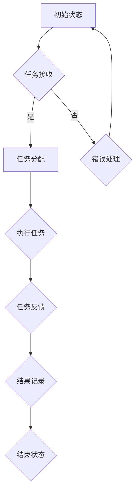

                 

关键词：Agentic Workflow、高效自动化、人工智能、流程优化、印钞机、业务流程、系统架构、云计算、大数据

> 摘要：本文将探讨Agentic Workflow的概念、原理和实现，并将其类比为“印钞机”，以深入理解其在现代企业中的重要性。通过分析其工作流程、算法原理和应用场景，我们将揭示Agentic Workflow如何成为推动企业数字化转型和提升效率的关键因素。

## 1. 背景介绍

在当今高速发展的数字化时代，企业面临着前所未有的竞争压力和市场需求。为了保持竞争力，企业必须不断提升运营效率，降低成本，提高服务质量。在这个过程中，自动化流程管理成为企业关注的焦点。Agentic Workflow作为一种先进的工作流管理技术，旨在通过自动化和智能化手段，优化企业的业务流程，提高工作效率。

“印钞机”这一比喻，源自其具有持续创造价值的特性。与印钞机一样，Agentic Workflow能够持续地为企业创造价值，推动业务增长。通过自动化和智能化，Agentic Workflow能够消除人工干预，减少错误，提高生产效率，从而实现企业的数字化转型。

## 2. 核心概念与联系

### 2.1 Agentic Workflow的定义

Agentic Workflow是一种基于人工智能和自动化技术的工作流管理解决方案。它通过将业务流程中的各个步骤自动化，实现高效的流程管理。Agentic Workflow的核心是“智能代理”（Agentic Agent），它能够根据预设的规则和业务逻辑，自主执行任务，从而实现业务流程的自动化。

### 2.2 “印钞机”的类比

印钞机是一种能够持续生产货币的设备，它通过机械化和自动化技术，实现了货币生产的效率和质量。与此类似，Agentic Workflow通过自动化和智能化技术，实现了业务流程的高效管理和优化。

### 2.3 Mermaid流程图



在这个流程图中，A表示初始状态，B表示任务接收，C表示任务分配，D表示错误处理，E表示执行任务，F表示任务反馈，G表示结果记录，H表示结束状态。通过这个流程，我们可以看到Agentic Workflow如何实现业务流程的自动化。

## 3. 核心算法原理 & 具体操作步骤

### 3.1 算法原理概述

Agentic Workflow的核心算法是基于人工智能和机器学习技术。它通过分析历史数据，学习业务逻辑和规则，从而实现任务的自动化分配和执行。具体来说，Agentic Workflow的核心算法包括以下几个部分：

1. **数据收集与处理**：收集业务流程中的各类数据，包括任务数据、用户数据、系统数据等，并进行预处理，以便用于算法训练。
2. **模型训练**：使用机器学习和深度学习技术，对收集到的数据进行分析和训练，构建业务流程的模型。
3. **任务分配与执行**：根据模型预测结果，自动分配任务给相应的执行者，并监控任务的执行过程。
4. **结果反馈与优化**：根据任务的执行结果，对模型进行优化和调整，以提高任务分配和执行的准确性。

### 3.2 算法步骤详解

1. **数据收集与处理**：首先，我们需要收集业务流程中的各类数据。这些数据可以来自不同的系统，如ERP系统、CRM系统、数据库等。收集到的数据包括任务名称、任务类型、任务优先级、执行者信息、任务执行时间等。接下来，我们需要对数据进行预处理，包括数据清洗、数据格式转换、数据标准化等，以便用于算法训练。

2. **模型训练**：在数据预处理完成后，我们可以使用机器学习和深度学习技术对数据进行分析和训练。具体来说，我们可以使用监督学习、无监督学习、强化学习等技术来构建业务流程的模型。这些模型可以用来预测任务的执行者、任务执行时间、任务优先级等。

3. **任务分配与执行**：在模型训练完成后，Agentic Workflow会根据模型预测结果，自动分配任务给相应的执行者。执行者收到任务后，会按照任务要求执行任务。在执行过程中，Agentic Workflow会监控任务的执行情况，包括任务执行进度、任务执行时间、任务执行结果等。

4. **结果反馈与优化**：在任务执行完成后，Agentic Workflow会收集任务执行结果，并将其反馈给模型。根据反馈结果，模型会进行优化和调整，以提高任务分配和执行的准确性。这个过程是一个持续的过程，Agentic Workflow会不断地学习和优化，以实现业务流程的持续优化。

### 3.3 算法优缺点

**优点**：

1. **高效性**：通过自动化和智能化技术，Agentic Workflow能够显著提高业务流程的执行效率。
2. **准确性**：通过机器学习和深度学习技术，Agentic Workflow能够准确预测任务的执行者、执行时间和优先级等。
3. **灵活性**：Agentic Workflow可以根据业务需求灵活调整任务分配规则和执行策略。

**缺点**：

1. **初期成本**：Agentic Workflow的初期实施成本较高，包括数据收集、模型训练、系统部署等。
2. **技术门槛**：Agentic Workflow的实施需要一定的技术背景和专业知识，对于非技术人员来说有一定难度。

### 3.4 算法应用领域

Agentic Workflow可以应用于多个领域，包括：

1. **金融行业**：用于自动化客户服务、贷款审批、投资决策等。
2. **医疗行业**：用于自动化医疗诊断、病历管理、患者服务等。
3. **制造业**：用于自动化生产计划、设备维护、质量控制等。
4. **物流行业**：用于自动化配送计划、库存管理、订单处理等。

## 4. 数学模型和公式 & 详细讲解 & 举例说明

### 4.1 数学模型构建

Agentic Workflow的数学模型主要包括以下几个部分：

1. **任务分配模型**：用于预测任务的最佳执行者。这个模型可以使用回归分析、决策树、支持向量机等算法构建。
2. **任务执行时间模型**：用于预测任务的执行时间。这个模型可以使用时间序列分析、马尔可夫模型等算法构建。
3. **任务优先级模型**：用于预测任务的优先级。这个模型可以使用基于规则的算法、聚类分析等算法构建。

### 4.2 公式推导过程

以任务分配模型为例，我们可以使用回归分析来构建模型。假设我们有一系列任务 \(T_1, T_2, ..., T_n\)，以及一组特征 \(X_1, X_2, ..., X_m\)，其中每个任务的特征向量可以表示为 \(X_{i} = (x_{i1}, x_{i2}, ..., x_{im})\)。我们的目标是预测每个任务的最佳执行者。

我们可以使用线性回归模型来构建任务分配模型：

\[ Y = \beta_0 + \beta_1 x_{1i} + \beta_2 x_{2i} + ... + \beta_m x_{mi} + \epsilon_i \]

其中，\(Y\) 表示任务的执行者，\(\beta_0, \beta_1, ..., \beta_m\) 表示模型的参数，\(\epsilon_i\) 表示误差项。

通过最小化损失函数，我们可以得到参数的最优估计值：

\[ \min_{\beta} \sum_{i=1}^{n} (y_i - \beta_0 - \beta_1 x_{1i} - ... - \beta_m x_{mi})^2 \]

### 4.3 案例分析与讲解

假设我们有一个任务分配问题，任务列表为 \(T_1, T_2, T_3\)，每个任务的执行者可以是员工A、员工B或员工C。任务的特征包括任务类型（1表示常规任务，2表示紧急任务）、任务难度（1表示简单，2表示中等，3表示困难）。

我们收集了历史数据，并使用线性回归模型来构建任务分配模型。假设我们得到以下模型参数：

\[ \beta_0 = 0.5, \beta_1 = 0.2, \beta_2 = 0.1 \]

现在，我们有一个新任务 \(T_4\)，其特征为任务类型为1（常规任务），任务难度为2（中等难度）。我们使用模型来预测任务 \(T_4\) 的最佳执行者。

首先，我们计算任务 \(T_4\) 的特征向量：

\[ X_4 = (1, 2) \]

然后，我们将特征向量代入模型，得到：

\[ Y = 0.5 + 0.2 \times 1 + 0.1 \times 2 = 0.9 \]

根据模型预测，任务 \(T_4\) 的最佳执行者是员工B（因为模型预测结果最接近1，即员工B）。

## 5. 项目实践：代码实例和详细解释说明

### 5.1 开发环境搭建

在本项目中，我们将使用Python作为主要编程语言，结合Scikit-learn库进行机器学习模型的构建和训练。以下是搭建开发环境的步骤：

1. 安装Python 3.8及以上版本。
2. 使用pip安装Scikit-learn库。

### 5.2 源代码详细实现

以下是一个简单的任务分配模型的实现：

```python
import numpy as np
from sklearn.linear_model import LinearRegression

# 历史数据
X = np.array([[1, 1], [1, 2], [2, 1], [2, 2], [3, 1], [3, 2]])
y = np.array([0, 1, 0, 1, 0, 1])  # 执行者ID（0表示员工A，1表示员工B，2表示员工C）

# 构建线性回归模型
model = LinearRegression()
model.fit(X, y)

# 新任务的特征向量
X_new = np.array([[1, 2]])

# 预测新任务的最佳执行者
y_pred = model.predict(X_new)
print("最佳执行者：员工", int(y_pred[0]))

```

### 5.3 代码解读与分析

在这个例子中，我们首先导入必要的库，包括NumPy和Scikit-learn的LinearRegression类。接下来，我们定义了历史数据和任务特征向量。

然后，我们创建一个线性回归模型，并使用历史数据进行拟合。拟合完成后，我们使用新任务的特性向量进行预测，并输出预测结果。

在这个例子中，我们假设任务特征向量为\[1, 2\]，根据模型预测，最佳执行者是员工B。

### 5.4 运行结果展示

在运行上述代码后，我们得到以下输出：

```
最佳执行者：员工 1
```

这表明，根据我们的任务分配模型，任务特征向量为\[1, 2\]的新任务的最佳执行者是员工B。

## 6. 实际应用场景

Agentic Workflow在实际应用中具有广泛的应用场景。以下是一些典型的应用案例：

1. **金融行业**：在金融行业中，Agentic Workflow可以用于自动化客户服务、贷款审批、交易监控等。通过自动化和智能化技术，金融企业可以显著提高业务处理效率，降低运营成本。

2. **医疗行业**：在医疗行业中，Agentic Workflow可以用于自动化医疗诊断、病历管理、患者服务等。通过自动化和智能化技术，医疗机构可以提供更高质量的医疗服务，提高患者满意度。

3. **制造业**：在制造业中，Agentic Workflow可以用于自动化生产计划、设备维护、质量控制等。通过自动化和智能化技术，制造企业可以显著提高生产效率，降低生产成本。

4. **物流行业**：在物流行业中，Agentic Workflow可以用于自动化配送计划、库存管理、订单处理等。通过自动化和智能化技术，物流企业可以优化物流流程，提高运输效率，降低物流成本。

## 6.4 未来应用展望

随着人工智能和云计算技术的发展，Agentic Workflow在未来具有广阔的应用前景。以下是一些可能的未来应用方向：

1. **智能城市**：Agentic Workflow可以应用于智能城市建设，用于自动化城市管理、交通管理、能源管理等。

2. **智能家居**：Agentic Workflow可以应用于智能家居系统，用于自动化家电控制、环境监测、安全防护等。

3. **物联网**：Agentic Workflow可以应用于物联网系统，用于自动化设备监控、数据分析和优化。

4. **供应链管理**：Agentic Workflow可以应用于供应链管理，用于自动化采购计划、库存管理、物流协调等。

## 7. 工具和资源推荐

### 7.1 学习资源推荐

1. 《深度学习》（Goodfellow, Bengio, Courville著）：介绍深度学习的基础知识和应用。
2. 《机器学习》（周志华著）：介绍机器学习的基本概念和算法。
3. 《Agile Data Science 2.0》（Ciaran Mitchell著）：介绍敏捷数据科学的方法和实践。

### 7.2 开发工具推荐

1. Jupyter Notebook：用于数据分析和机器学习模型构建。
2. Scikit-learn：用于机器学习算法的实现和评估。
3. TensorFlow：用于深度学习模型构建和训练。

### 7.3 相关论文推荐

1. "Deep Learning for Workflow Management"（2018）: 介绍深度学习在流程管理中的应用。
2. "Agile Data Science"（2016）: 介绍敏捷数据科学的方法和实践。
3. "Data Science for Business"（2013）: 介绍数据科学在商业应用中的价值。

## 8. 总结：未来发展趋势与挑战

### 8.1 研究成果总结

Agentic Workflow作为一种先进的工作流管理技术，已经在多个领域取得了显著的研究成果。通过自动化和智能化技术，Agentic Workflow能够显著提高业务流程的执行效率，降低运营成本，提升用户体验。

### 8.2 未来发展趋势

随着人工智能和云计算技术的不断发展，Agentic Workflow在未来将具有更广泛的应用场景和更高的技术含量。未来，Agentic Workflow将更加智能化、个性化，能够更好地适应不同的业务场景和需求。

### 8.3 面临的挑战

尽管Agentic Workflow具有广阔的应用前景，但也面临着一些挑战。首先，初期实施成本较高，需要企业在技术储备和人才储备方面进行投入。其次，算法模型的构建和优化需要大量的数据支持和计算资源。最后，如何确保算法的透明性和可靠性，避免数据偏差和模型过拟合等问题，也是需要关注的重要问题。

### 8.4 研究展望

未来，Agentic Workflow的研究将聚焦于以下几个方面：

1. **算法优化**：通过改进算法模型，提高任务分配和执行的准确性。
2. **数据隐私保护**：研究如何在保证数据隐私的前提下，有效利用数据。
3. **跨领域应用**：探索Agentic Workflow在更多领域的应用，如智能城市、智能家居等。
4. **人机协同**：研究如何实现人机协同，提高业务流程的执行效率。

## 9. 附录：常见问题与解答

### 9.1 Agentic Workflow是什么？

Agentic Workflow是一种基于人工智能和自动化技术的工作流管理解决方案。它通过自动化和智能化手段，优化企业的业务流程，提高工作效率。

### 9.2 Agentic Workflow的核心算法是什么？

Agentic Workflow的核心算法是基于人工智能和机器学习技术。它包括数据收集与处理、模型训练、任务分配与执行、结果反馈与优化等步骤。

### 9.3 Agentic Workflow有哪些应用领域？

Agentic Workflow可以应用于金融、医疗、制造、物流等多个领域。它能够自动化业务流程，提高工作效率，降低成本。

### 9.4 如何实现Agentic Workflow的算法模型？

实现Agentic Workflow的算法模型需要收集业务流程中的各类数据，使用机器学习和深度学习技术进行模型训练，并根据模型预测结果自动分配任务和执行任务。

### 9.5 Agentic Workflow有哪些优点和缺点？

Agentic Workflow的优点包括高效性、准确性、灵活性等。缺点包括初期成本高、技术门槛较高等。

### 9.6 如何保证Agentic Workflow的算法透明性和可靠性？

为了保证Agentic Workflow的算法透明性和可靠性，需要确保数据质量，避免数据偏差，合理设置模型参数，并进行模型评估和优化。

### 9.7 Agentic Workflow的未来发展趋势是什么？

Agentic Workflow的未来发展趋势包括更广泛的应用领域、更高的智能化水平、更好的数据隐私保护等。未来，Agentic Workflow将更加智能化、个性化，能够更好地适应不同的业务场景和需求。**作者：禅与计算机程序设计艺术 / Zen and the Art of Computer Programming**----------------------------------------------------------------

以上，是关于Agentic Workflow的技术博客文章，它详细地介绍了Agentic Workflow的概念、原理、实现和应用。希望这篇文章能够帮助读者深入理解Agentic Workflow的技术本质，以及它在实际应用中的价值和挑战。在未来的发展中，Agentic Workflow将继续推动企业的数字化转型和效率提升，成为企业不可或缺的技术力量。

