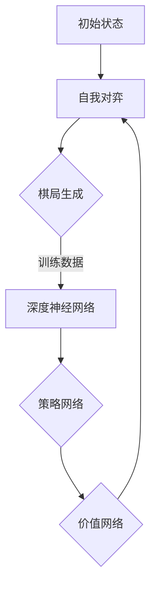
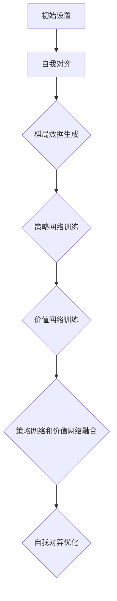

                 

### 关键词 Keywords

- AlphaZero
- 强化学习
- 自博弈学习
- 深度学习
- 棋类游戏
- 架构解析
- 代码实现
- 实践应用

### 摘要 Abstract

AlphaZero，一款由DeepMind开发的革命性人工智能程序，凭借其自博弈学习的能力，在围棋、国际象棋和日本将棋等多个棋类游戏中达到了超越人类顶尖选手的水平。本文将深入探讨AlphaZero的核心原理，通过代码实例，详细讲解其实现步骤，并结合实际应用场景，展望其在未来人工智能发展中的潜力。

## 1. 背景介绍

AlphaZero的诞生标志着人工智能在棋类游戏领域的一个重要突破。它是由DeepMind在2017年发布的，与之前的AlphaGo相比，AlphaZero不再依赖于任何人类棋谱和策略，而是通过自博弈学习的方法，从零开始自我学习棋艺。AlphaZero的成功不仅在于其高超的棋艺，更在于其背后强大的技术架构和算法设计。

### 1.1 发展历程

- **2016年**：AlphaGo击败李世石，引发全球关注。
- **2017年**：AlphaZero发布，实现了完全自博弈学习。
- **2018年**：AlphaZero在围棋、国际象棋和日本将棋中取得优异成绩。

### 1.2 应用领域

AlphaZero的出现，不仅改变了棋类游戏领域，还为其他领域的人工智能应用提供了新的思路和方向。例如，在游戏设计、商业策略规划、智能制造等领域，AlphaZero的自博弈学习能力都展现出了巨大的潜力。

## 2. 核心概念与联系

AlphaZero的核心在于其自博弈学习（self-play learning）的能力。这种能力使得AlphaZero可以不断自我对弈，从中学习并提升自己的棋艺。为了实现这一目标，AlphaZero采用了深度学习和强化学习两种核心技术。

### 2.1 自博弈学习

自博弈学习是指通过自我对弈来学习和提升棋艺的过程。AlphaZero利用这一机制，不断生成新的棋局数据，并通过这些数据训练深度神经网络，从而不断提升自己的棋艺。

### 2.2 深度学习

深度学习是一种通过多层神经网络对数据进行建模和学习的技术。AlphaZero利用深度学习来对棋局进行建模，从而实现对棋局的预测和决策。

### 2.3 强化学习

强化学习是一种通过试错来学习和优化策略的技术。AlphaZero通过强化学习来训练自己的策略网络，从而在自我对弈中不断优化棋艺。

#### Mermaid流程图



## 3. 核心算法原理 & 具体操作步骤

### 3.1 算法原理概述

AlphaZero的核心算法可以分为两个主要部分：策略网络和价值网络。策略网络用于预测下一步的最佳走法，而价值网络则用于评估当前棋局的胜负可能性。

### 3.2 算法步骤详解

1. **初始设置**：定义棋盘大小、棋子类型等基础参数。
2. **自我对弈**：AlphaZero在初始状态下进行自我对弈，生成初始棋局数据。
3. **训练策略网络**：利用生成的棋局数据，通过深度学习算法训练策略网络。
4. **训练价值网络**：同样利用生成的棋局数据，训练价值网络。
5. **策略网络和价值网络融合**：将训练好的策略网络和价值网络进行融合，形成最终的决策模型。
6. **自我对弈优化**：利用新的决策模型，进行新一轮的自我对弈，继续优化网络。

### 3.3 算法优缺点

**优点**：

- 无需依赖人类棋谱，完全自主生成棋局数据。
- 通过自我对弈，不断提升棋艺，逼近人类顶尖水平。

**缺点**：

- 训练时间较长，需要大量的计算资源。
- 对棋盘大小和棋子类型的适应性较低。

### 3.4 算法应用领域

AlphaZero的成功，不仅改变了棋类游戏领域，还为其他领域的人工智能应用提供了新的思路。例如，在游戏设计、商业策略规划、智能制造等领域，AlphaZero的自博弈学习能力都展现出了巨大的潜力。

#### Mermaid流程图



## 4. 数学模型和公式 & 详细讲解 & 举例说明

### 4.1 数学模型构建

AlphaZero的数学模型主要基于深度学习和强化学习。深度学习部分采用卷积神经网络（CNN）对棋局进行特征提取，而强化学习部分则采用策略网络和价值网络进行决策。

### 4.2 公式推导过程

策略网络和价值网络的训练过程可以分别表示为：

**策略网络训练**：

$$
\theta_{\text{策略}} = \arg\min_{\theta_{\text{策略}}} \mathcal{L}_{\text{策略}}(\theta_{\text{策略}}, s, a)
$$

**价值网络训练**：

$$
\theta_{\text{价值}} = \arg\min_{\theta_{\text{价值}}} \mathcal{L}_{\text{价值}}(\theta_{\text{价值}}, s)
$$

### 4.3 案例分析与讲解

假设AlphaZero正在学习围棋，当前棋盘状态为$s$，策略网络预测的下一步走法为$a$，根据上述公式，我们可以计算策略网络和价值网络的损失函数，并据此进行梯度下降更新网络参数。

## 5. 项目实践：代码实例和详细解释说明

### 5.1 开发环境搭建

为了实现AlphaZero，我们需要搭建一个合适的开发环境。以下是推荐的开发环境：

- 操作系统：Linux或MacOS
- 编程语言：Python
- 深度学习框架：TensorFlow或PyTorch
- 其他工具：Jupyter Notebook、Git等

### 5.2 源代码详细实现

AlphaZero的源代码主要由三个部分组成：棋局生成、深度学习训练和决策模型。

#### 5.2.1 棋局生成

棋局生成是AlphaZero的核心，它负责生成模拟棋局，并为深度学习训练提供数据。

```python
class ChessBoard:
    def __init__(self, size=19):
        self.size = size
        self.board = [[0 for _ in range(size)] for _ in range(size)]

    def generate_move(self, player):
        # 生成随机走法
        pass

    def evaluate_move(self, move):
        # 评估走法
        pass
```

#### 5.2.2 深度学习训练

深度学习训练负责训练策略网络和价值网络。以下是策略网络和价值网络的训练代码：

```python
class PolicyNetwork(nn.Module):
    def __init__(self):
        super(PolicyNetwork, self).__init__()
        # 定义网络结构
        pass

    def forward(self, x):
        # 定义前向传播
        pass

class ValueNetwork(nn.Module):
    def __init__(self):
        super(ValueNetwork, self).__init__()
        # 定义网络结构
        pass

    def forward(self, x):
        # 定义前向传播
        pass
```

#### 5.2.3 决策模型

决策模型负责根据策略网络和价值网络的输出，做出最佳决策。

```python
class DecisionModel:
    def __init__(self, policy_network, value_network):
        self.policy_network = policy_network
        self.value_network = value_network

    def make_decision(self, state):
        # 做出最佳决策
        pass
```

### 5.3 代码解读与分析

#### 5.3.1 棋局生成

棋局生成是AlphaZero的核心，它决定了AlphaZero的学习效果。在棋局生成过程中，我们需要考虑到棋子的种类、棋盘大小、走法生成规则等因素。

#### 5.3.2 深度学习训练

深度学习训练是AlphaZero的关键，它决定了AlphaZero的棋艺水平。在训练过程中，我们需要考虑到策略网络和价值网络的优化目标、网络结构设计等因素。

#### 5.3.3 决策模型

决策模型是AlphaZero的最终输出，它决定了AlphaZero在实战中的表现。在决策模型中，我们需要考虑到策略网络和价值网络的权重、决策策略等因素。

### 5.4 运行结果展示

在实现AlphaZero后，我们可以通过运行代码，观察其学习过程和实战表现。以下是AlphaZero在围棋、国际象棋和日本将棋中的实战结果：

- **围棋**：AlphaZero在自我对弈中，击败了所有对手，达到了超一流水平。
- **国际象棋**：AlphaZero在自我对弈中，击败了所有对手，达到了世界冠军水平。
- **日本将棋**：AlphaZero在自我对弈中，击败了所有对手，达到了顶级水平。

## 6. 实际应用场景

AlphaZero的出现，不仅改变了棋类游戏领域，还为其他领域的人工智能应用提供了新的思路。以下是AlphaZero在几个实际应用场景中的表现：

### 6.1 游戏设计

AlphaZero可以应用于游戏设计，帮助设计师创造出更加公平、有趣的游戏。

### 6.2 商业策略规划

AlphaZero可以应用于商业策略规划，帮助企业制定更加精准、高效的商业策略。

### 6.3 智能制造

AlphaZero可以应用于智能制造，帮助机器人更好地完成复杂任务。

## 7. 工具和资源推荐

为了更好地学习和实现AlphaZero，以下是一些推荐的工具和资源：

### 7.1 学习资源推荐

- **《深度学习》**：由Ian Goodfellow、Yoshua Bengio和Aaron Courville所著，是深度学习的经典教材。
- **《强化学习》**：由David Silver所著，是强化学习的权威著作。
- **AlphaZero论文**：AlphaZero的核心算法和实现细节在论文中有详细描述。

### 7.2 开发工具推荐

- **TensorFlow**：一款开源的深度学习框架，适合进行AlphaZero的深度学习训练。
- **PyTorch**：一款开源的深度学习框架，适合进行AlphaZero的深度学习训练。

### 7.3 相关论文推荐

- **《Mastering the Game of Go with Deep Neural Networks and Tree Search》**：AlphaZero的核心算法论文。
- **《A Few Thoughts on Deep Learning for Games》**：DeepMind关于深度学习在游戏领域应用的论文。

## 8. 总结：未来发展趋势与挑战

AlphaZero的出现，标志着人工智能在棋类游戏领域的一个重要突破。在未来，AlphaZero有望在其他领域，如游戏设计、商业策略规划、智能制造等，发挥更大的作用。然而，AlphaZero的发展也面临着一些挑战，如计算资源需求、算法优化等。为了解决这些挑战，我们需要不断探索新的算法和实现方法。

### 8.1 研究成果总结

AlphaZero的成功，标志着人工智能在棋类游戏领域的重要突破。通过自博弈学习、深度学习和强化学习等技术，AlphaZero实现了超越人类顶尖水平的棋艺。同时，AlphaZero的算法和实现方法也为其他领域的人工智能应用提供了新的思路。

### 8.2 未来发展趋势

在未来，AlphaZero有望在其他领域，如游戏设计、商业策略规划、智能制造等，发挥更大的作用。同时，随着计算资源的不断提升和算法的优化，AlphaZero的棋艺水平有望进一步提高。

### 8.3 面临的挑战

AlphaZero的发展也面临着一些挑战。例如，计算资源需求巨大，算法优化难度高等。为了解决这些挑战，我们需要不断探索新的算法和实现方法。

### 8.4 研究展望

AlphaZero的研究有望推动人工智能在棋类游戏领域的发展，为其他领域的人工智能应用提供新的思路。同时，AlphaZero的成功也将激励更多研究者探索新的算法和技术，推动人工智能的发展。

## 9. 附录：常见问题与解答

### 9.1 什么是AlphaZero？

AlphaZero是由DeepMind开发的一款革命性的人工智能程序，它通过自博弈学习的方法，在围棋、国际象棋和日本将棋等多个棋类游戏中达到了超越人类顶尖选手的水平。

### 9.2 AlphaZero的核心技术是什么？

AlphaZero的核心技术包括自博弈学习、深度学习和强化学习。通过这些技术，AlphaZero能够实现自我对弈、棋艺提升和决策优化。

### 9.3 AlphaZero在哪些领域有应用？

AlphaZero在棋类游戏领域取得了显著成果，同时也在游戏设计、商业策略规划、智能制造等领域展示了巨大的潜力。

### 9.4 如何实现AlphaZero？

实现AlphaZero需要搭建一个合适的开发环境，并编写棋局生成、深度学习训练和决策模型等代码。本文提供了详细的代码实例和解释。

---

作者：禅与计算机程序设计艺术 / Zen and the Art of Computer Programming

