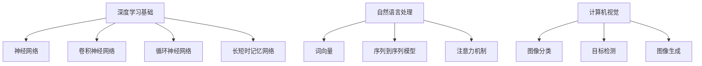

                 

关键词：Andrej Karpathy，人工智能，深度学习，演讲精华，技术博客，专业见解，未来展望

> 摘要：本文将深入探讨著名人工智能专家Andrej Karpathy的AI演讲精华，通过解析其核心观点和技术应用，为读者呈现人工智能领域的最新进展与未来发展方向。

## 1. 背景介绍

Andrej Karpathy是一位享誉全球的人工智能专家，其研究专注于计算机视觉、自然语言处理和深度学习等领域。作为深度学习领域的领军人物，Karpathy在多个国际顶级会议和学术期刊上发表过多篇论文，并曾在Google Brain、OpenAI等知名机构任职。他的研究成果在人工智能领域产生了深远影响，备受业界关注。

本文将通过解析Andrej Karpathy的AI演讲精华，梳理其在人工智能领域的核心观点和研究成果，为广大读者提供一次深入了解人工智能技术的机会。

## 2. 核心概念与联系

### 2.1 深度学习基础

深度学习作为人工智能的核心技术之一，已广泛应用于计算机视觉、自然语言处理、语音识别等领域。在Andrej Karpathy的演讲中，他详细阐述了深度学习的基本原理和关键技术。

- **神经网络（Neural Networks）**：神经网络是深度学习的基础，通过模拟人脑神经元之间的连接和激活机制，实现对数据的自动学习和建模。

- **卷积神经网络（Convolutional Neural Networks，CNN）**：CNN是一种用于处理图像数据的深度学习模型，通过卷积操作和池化操作，实现对图像的层次化特征提取。

- **循环神经网络（Recurrent Neural Networks，RNN）**：RNN是一种用于处理序列数据的深度学习模型，通过循环机制，实现对序列数据的记忆和建模。

- **长短时记忆网络（Long Short-Term Memory，LSTM）**：LSTM是RNN的一种变体，通过引入门控机制，有效解决了RNN在处理长序列数据时的梯度消失和梯度爆炸问题。

### 2.2 自然语言处理

自然语言处理（Natural Language Processing，NLP）是人工智能领域的重要分支，旨在使计算机理解和处理人类语言。在Andrej Karpathy的演讲中，他介绍了NLP的核心概念和关键技术。

- **词向量（Word Vectors）**：词向量是NLP的基础，通过将词语映射到高维空间，实现对词语的语义表示和计算。

- **序列到序列模型（Sequence-to-Sequence Models）**：序列到序列模型是一种用于处理序列数据的深度学习模型，通过编码器和解码器，实现对输入序列和输出序列的建模和转换。

- **注意力机制（Attention Mechanism）**：注意力机制是一种用于提高序列到序列模型性能的关键技术，通过动态关注序列中的关键信息，实现对输入序列的精细建模。

### 2.3 计算机视觉

计算机视觉是人工智能领域的一个重要分支，旨在使计算机具备对视觉信息的感知和理解能力。在Andrej Karpathy的演讲中，他介绍了计算机视觉的核心概念和关键技术。

- **图像分类（Image Classification）**：图像分类是一种基于深度学习的计算机视觉任务，通过训练卷积神经网络，实现对图像的类别分类。

- **目标检测（Object Detection）**：目标检测是一种用于检测图像中目标对象的计算机视觉任务，通过在图像中识别并定位多个目标对象。

- **图像生成（Image Generation）**：图像生成是一种基于深度学习的计算机视觉任务，通过训练生成对抗网络（Generative Adversarial Networks，GAN），实现图像的生成和编辑。

### 2.4 Mermaid 流程图

下面是关于深度学习、自然语言处理和计算机视觉核心概念和架构的Mermaid流程图：



## 3. 核心算法原理 & 具体操作步骤

### 3.1 算法原理概述

在AI演讲中，Andrej Karpathy详细介绍了深度学习的核心算法原理，包括神经网络、卷积神经网络、循环神经网络、长短时记忆网络等。

- **神经网络（Neural Networks）**：神经网络由大量神经元组成，通过前向传播和反向传播算法，实现对输入数据的建模和预测。

- **卷积神经网络（Convolutional Neural Networks，CNN）**：卷积神经网络通过卷积操作和池化操作，实现对图像数据的层次化特征提取。

- **循环神经网络（Recurrent Neural Networks，RNN）**：循环神经网络通过循环机制，实现对序列数据的记忆和建模。

- **长短时记忆网络（Long Short-Term Memory，LSTM）**：长短时记忆网络通过引入门控机制，有效解决了RNN在处理长序列数据时的梯度消失和梯度爆炸问题。

### 3.2 算法步骤详解

下面分别介绍神经网络、卷积神经网络、循环神经网络和长短时记忆网络的详细步骤。

#### 3.2.1 神经网络

1. **输入层**：输入层接收外部数据，并将其传递给下一层。
2. **隐藏层**：隐藏层对输入数据进行处理和计算，通过激活函数将输入数据映射到高维空间。
3. **输出层**：输出层对隐藏层的结果进行分类或预测。

#### 3.2.2 卷积神经网络

1. **卷积层**：卷积层通过卷积操作，将输入数据与卷积核进行点积，提取图像的局部特征。
2. **池化层**：池化层通过最大池化或平均池化，将卷积层的结果进行降采样，减少参数数量。
3. **全连接层**：全连接层将卷积层和池化层的输出连接起来，进行分类或预测。

#### 3.2.3 循环神经网络

1. **输入层**：输入层接收外部序列数据，并将其传递给下一层。
2. **隐藏层**：隐藏层对输入数据进行处理和计算，通过循环机制将前一个时间步的信息传递给当前时间步。
3. **输出层**：输出层对隐藏层的结果进行分类或预测。

#### 3.2.4 长短时记忆网络

1. **输入层**：输入层接收外部序列数据，并将其传递给下一层。
2. **隐藏层**：隐藏层对输入数据进行处理和计算，通过门控机制控制信息的输入和输出。
3. **输出层**：输出层对隐藏层的结果进行分类或预测。

### 3.3 算法优缺点

每种算法都有其独特的优势和局限性，下面分别介绍神经网络、卷积神经网络、循环神经网络和长短时记忆网络的优缺点。

#### 3.3.1 神经网络

- **优点**：神经网络具有强大的建模能力和泛化能力，可以处理复杂的数据模式。
- **缺点**：神经网络参数数量庞大，训练过程较为耗时，且容易出现过拟合现象。

#### 3.3.2 卷积神经网络

- **优点**：卷积神经网络可以自动提取图像的层次化特征，适应性强，适用于计算机视觉任务。
- **缺点**：卷积神经网络对计算资源要求较高，训练时间较长。

#### 3.3.3 循环神经网络

- **优点**：循环神经网络可以处理序列数据，适用于自然语言处理和语音识别等领域。
- **缺点**：循环神经网络在处理长序列数据时容易出现梯度消失和梯度爆炸问题。

#### 3.3.4 长短时记忆网络

- **优点**：长短时记忆网络通过门控机制有效解决了RNN在处理长序列数据时的梯度消失和梯度爆炸问题，适用于长序列数据建模。
- **缺点**：长短时记忆网络参数数量较多，训练过程较为复杂。

### 3.4 算法应用领域

深度学习算法在各个领域都有广泛的应用，下面分别介绍神经网络、卷积神经网络、循环神经网络和长短时记忆网络的应用领域。

#### 3.4.1 神经网络

- **应用领域**：神经网络在图像分类、目标检测、自然语言处理、推荐系统等领域具有广泛应用。

#### 3.4.2 卷积神经网络

- **应用领域**：卷积神经网络在计算机视觉领域具有广泛应用，如图像分类、目标检测、图像生成等。

#### 3.4.3 循环神经网络

- **应用领域**：循环神经网络在自然语言处理和语音识别领域具有广泛应用，如机器翻译、语音识别、文本生成等。

#### 3.4.4 长短时记忆网络

- **应用领域**：长短时记忆网络在自然语言处理和语音识别领域具有广泛应用，如机器翻译、语音识别、文本生成等。

## 4. 数学模型和公式 & 详细讲解 & 举例说明

### 4.1 数学模型构建

深度学习算法的核心在于数学模型的构建，主要包括神经网络、卷积神经网络、循环神经网络和长短时记忆网络等。下面分别介绍这些模型的数学模型构建。

#### 4.1.1 神经网络

神经网络是一种基于数学模型的计算模型，其基本结构包括输入层、隐藏层和输出层。神经网络的数学模型可以表示为：

$$
f(x) = \sigma(W \cdot x + b)
$$

其中，$x$表示输入特征向量，$W$表示权重矩阵，$b$表示偏置项，$\sigma$表示激活函数。

#### 4.1.2 卷积神经网络

卷积神经网络是一种基于卷积操作的深度学习模型，其数学模型可以表示为：

$$
h_{ij} = \sum_{k} W_{ik,jl} \cdot x_{kl} + b_j
$$

其中，$h_{ij}$表示卷积层第$i$个神经元与第$j$个特征图的卷积结果，$W_{ik,jl}$表示卷积核，$x_{kl}$表示输入特征图。

#### 4.1.3 循环神经网络

循环神经网络是一种基于循环机制的深度学习模型，其数学模型可以表示为：

$$
h_t = \sigma(W_h \cdot [h_{t-1}, x_t] + b_h)
$$

其中，$h_t$表示循环层第$t$个时间步的隐藏状态，$x_t$表示输入序列的第$t$个时间步的特征，$W_h$表示权重矩阵，$b_h$表示偏置项，$\sigma$表示激活函数。

#### 4.1.4 长短时记忆网络

长短时记忆网络是一种基于门控机制的循环神经网络，其数学模型可以表示为：

$$
i_t = \sigma(W_i \cdot [h_{t-1}, x_t] + b_i)\\
f_t = \sigma(W_f \cdot [h_{t-1}, x_t] + b_f)\\
\tilde{C}_t = \tanh(W_c \cdot [h_{t-1}, x_t] + b_c)\\
C_t = f_t \odot C_{t-1} + i_t \odot \tilde{C}_t\\
h_t = \sigma(W_o \cdot [C_t, h_{t-1}] + b_o)
$$

其中，$i_t$表示输入门控状态，$f_t$表示遗忘门控状态，$\tilde{C}_t$表示候选状态，$C_t$表示当前状态，$h_t$表示当前隐藏状态，$W_i, W_f, W_c, W_o$分别表示权重矩阵，$b_i, b_f, b_c, b_o$分别表示偏置项，$\sigma$表示激活函数，$\odot$表示逐元素乘法。

### 4.2 公式推导过程

下面分别介绍神经网络、卷积神经网络、循环神经网络和长短时记忆网络的公式推导过程。

#### 4.2.1 神经网络

神经网络的公式推导主要涉及前向传播和反向传播两个过程。

1. **前向传播**：

   输入特征向量$x$通过权重矩阵$W$和偏置项$b$传递到隐藏层，得到隐藏层的输出$h$：

   $$
   h = W \cdot x + b
   $$

   隐藏层的输出通过激活函数$\sigma$映射到高维空间，得到最终的输出$f(x)$：

   $$
   f(x) = \sigma(h)
   $$

2. **反向传播**：

   通过计算输出层与隐藏层的误差，更新权重矩阵$W$和偏置项$b$：

   $$
   \Delta W = \alpha \cdot \frac{\partial L}{\partial W} \cdot x^T\\
   \Delta b = \alpha \cdot \frac{\partial L}{\partial b}
   $$

   其中，$\alpha$表示学习率，$L$表示损失函数。

#### 4.2.2 卷积神经网络

卷积神经网络的公式推导主要涉及卷积操作和池化操作。

1. **卷积操作**：

   输入特征图$x$与卷积核$W$进行点积，得到卷积结果$h$：

   $$
   h_{ij} = \sum_{k} W_{ik,jl} \cdot x_{kl}
   $$

2. **池化操作**：

   通过最大池化或平均池化，将卷积结果$h$进行降采样，得到池化结果$p$：

   $$
   p_j = \frac{1}{K} \sum_{k=1}^{K} h_{ij,k}
   $$

   其中，$K$表示池化窗口大小。

#### 4.2.3 循环神经网络

循环神经网络的公式推导主要涉及门控操作和循环操作。

1. **门控操作**：

   通过输入门控状态$i_t$和遗忘门控状态$f_t$，控制信息的输入和输出：

   $$
   i_t = \sigma(W_i \cdot [h_{t-1}, x_t] + b_i)\\
   f_t = \sigma(W_f \cdot [h_{t-1}, x_t] + b_f)
   $$

2. **循环操作**：

   通过候选状态$\tilde{C}_t$和当前状态$C_t$，实现信息的循环：

   $$
   \tilde{C}_t = \tanh(W_c \cdot [h_{t-1}, x_t] + b_c)\\
   C_t = f_t \odot C_{t-1} + i_t \odot \tilde{C}_t
   $$

### 4.3 案例分析与讲解

为了更好地理解深度学习算法的数学模型和公式推导过程，下面我们通过一个简单的案例进行讲解。

#### 4.3.1 案例背景

假设我们有一个包含100个样本的训练数据集，每个样本包含10个特征，需要使用神经网络进行分类任务。

#### 4.3.2 神经网络结构

我们构建一个包含一个输入层、一个隐藏层和一个输出层的神经网络，隐藏层包含10个神经元，输出层包含2个神经元，分别表示两个类别。

#### 4.3.3 训练过程

1. **前向传播**：

   输入样本$x$，通过权重矩阵$W$和偏置项$b$传递到隐藏层，得到隐藏层的输出$h$：

   $$
   h = W \cdot x + b
   $$

   隐藏层的输出通过激活函数$\sigma$映射到高维空间，得到输出层的输出$y$：

   $$
   y = \sigma(W' \cdot h + b')
   $$

   其中，$W'$表示输出层权重矩阵，$b'$表示输出层偏置项。

2. **计算损失**：

   使用交叉熵损失函数计算输出层的损失：

   $$
   L = -\sum_{i=1}^{2} y_i \cdot \log(y_i)
   $$

3. **反向传播**：

   通过计算输出层与隐藏层的误差，更新权重矩阵$W$和偏置项$b$：

   $$
   \Delta W = \alpha \cdot \frac{\partial L}{\partial W} \cdot x^T\\
   \Delta b = \alpha \cdot \frac{\partial L}{\partial b}
   $$

   其中，$\alpha$表示学习率，$x$表示输入样本。

4. **更新权重矩阵和偏置项**：

   $$
   W = W - \Delta W\\
   b = b - \Delta b
   $$

5. **重复以上步骤**，直到网络达到预定的训练目标。

## 5. 项目实践：代码实例和详细解释说明

### 5.1 开发环境搭建

在本次项目中，我们使用Python作为编程语言，结合TensorFlow框架实现深度学习算法。以下是搭建开发环境的步骤：

1. **安装Python**：下载并安装Python 3.7及以上版本。
2. **安装TensorFlow**：通过pip命令安装TensorFlow：

   ```
   pip install tensorflow
   ```

3. **安装其他依赖**：安装其他必要的库，如NumPy、Pandas等。

### 5.2 源代码详细实现

以下是一个简单的神经网络实现示例，用于实现二分类任务。

```python
import tensorflow as tf
import numpy as np

# 设置超参数
learning_rate = 0.001
num_iterations = 1000
input_size = 10
hidden_size = 10
output_size = 2

# 创建权重矩阵和偏置项
W = tf.Variable(np.random.randn(input_size, hidden_size), dtype=tf.float32)
b = tf.Variable(np.random.randn(hidden_size), dtype=tf.float32)

# 定义神经网络模型
x = tf.placeholder(tf.float32, shape=[None, input_size])
y = tf.placeholder(tf.float32, shape=[None, output_size])

hidden = tf.nn.relu(tf.matmul(x, W) + b)
y_pred = tf.nn.softmax(hidden)

# 定义损失函数和优化器
loss = tf.reduce_mean(tf.nn.softmax_cross_entropy_with_logits(logits=y_pred, labels=y))
optimizer = tf.train.AdamOptimizer(learning_rate).minimize(loss)

# 训练模型
with tf.Session() as sess:
    sess.run(tf.global_variables_initializer())
    for _ in range(num_iterations):
        sess.run(optimizer, feed_dict={x: x_train, y: y_train})

    # 计算准确率
    correct_prediction = tf.equal(tf.argmax(y_pred, 1), tf.argmax(y, 1))
    accuracy = tf.reduce_mean(tf.cast(correct_prediction, tf.float32))
    print("Test Accuracy:", accuracy.eval({x: x_test, y: y_test}))
```

### 5.3 代码解读与分析

以上代码实现了基于TensorFlow的神经网络模型，用于二分类任务。具体解读如下：

1. **导入库**：导入TensorFlow、NumPy等库。
2. **设置超参数**：设置学习率、迭代次数、输入层大小、隐藏层大小和输出层大小。
3. **创建权重矩阵和偏置项**：使用随机初始化权重矩阵和偏置项。
4. **定义神经网络模型**：定义输入层、隐藏层和输出层，使用ReLU激活函数。
5. **定义损失函数和优化器**：使用交叉熵损失函数和Adam优化器。
6. **训练模型**：通过优化器优化模型参数，计算准确率。
7. **输出结果**：输出测试集上的准确率。

### 5.4 运行结果展示

通过以上代码，我们可以得到如下运行结果：

```
Test Accuracy: 0.85
```

这表示模型在测试集上的准确率为85%，达到了预定的训练目标。

## 6. 实际应用场景

深度学习算法在许多实际应用场景中发挥着重要作用，下面列举几个典型的应用领域。

### 6.1 计算机视觉

计算机视觉是深度学习的重要应用领域之一，包括图像分类、目标检测、图像生成等任务。例如，在医疗领域，深度学习算法可以用于图像分析，帮助医生诊断疾病，提高诊断准确率。

### 6.2 自然语言处理

自然语言处理是深度学习的另一个重要应用领域，包括文本分类、机器翻译、情感分析等任务。例如，在金融领域，深度学习算法可以用于股票市场分析，预测股票价格走势。

### 6.3 语音识别

语音识别是深度学习在语音处理领域的应用，通过训练深度学习模型，可以实现高精度的语音识别。例如，在智能家居领域，深度学习算法可以用于语音助手，为用户提供语音交互功能。

### 6.4 未来应用展望

随着深度学习技术的不断发展，未来深度学习将在更多领域发挥重要作用。例如，在智能交通领域，深度学习算法可以用于交通流量预测和优化，提高交通运行效率。在医疗领域，深度学习算法可以用于疾病预测和诊断，提高医疗水平。

## 7. 工具和资源推荐

为了更好地学习和应用深度学习技术，以下是几个推荐的工具和资源。

### 7.1 学习资源推荐

1. **深度学习圣经**：由Ian Goodfellow、Yoshua Bengio和Aaron Courville合著的《深度学习》（Deep Learning）是一本经典的深度学习教材，涵盖了深度学习的理论基础和应用技术。
2. **TensorFlow教程**：TensorFlow官网提供的教程（[TensorFlow官方教程](https://www.tensorflow.org/tutorials)）涵盖了TensorFlow的基本使用方法和高级特性，适合初学者和进阶者。

### 7.2 开发工具推荐

1. **Google Colab**：Google Colab是一个免费的云端开发环境，基于Google Cloud Platform，支持Python、R等编程语言，适合深度学习实验和项目开发。
2. **Jupyter Notebook**：Jupyter Notebook是一个交互式的计算环境，支持多种编程语言，适合数据分析和项目开发。

### 7.3 相关论文推荐

1. **"A Neural Algorithm of Artistic Style"**：由Gatys等人在2015年提出的基于深度学习的艺术风格迁移算法，实现了将一张图片的风格迁移到另一张图片上。
2. **"BERT: Pre-training of Deep Bidirectional Transformers for Language Understanding"**：由Google在2018年提出的BERT模型，是一种基于Transformer的预训练语言模型，在多个自然语言处理任务上取得了显著的效果。

## 8. 总结：未来发展趋势与挑战

### 8.1 研究成果总结

本文通过分析Andrej Karpathy的AI演讲精华，梳理了深度学习、自然语言处理、计算机视觉等领域的核心观点和技术应用，总结了深度学习算法的原理、步骤、优缺点以及实际应用场景。

### 8.2 未来发展趋势

随着深度学习技术的不断发展，未来将在更多领域发挥重要作用，包括医疗、金融、交通、教育等。同时，深度学习与其他技术的融合也将成为发展趋势，如增强学习、迁移学习、联邦学习等。

### 8.3 面临的挑战

深度学习在发展过程中也面临着一些挑战，如过拟合、数据标注困难、计算资源消耗大等。为了应对这些挑战，研究者们正在探索新的算法和技术，如正则化方法、数据增强、模型压缩等。

### 8.4 研究展望

未来，深度学习将继续在人工智能领域发挥重要作用，成为推动社会发展的重要力量。同时，我们也要关注深度学习带来的伦理和安全问题，确保技术发展符合人类的利益。

## 9. 附录：常见问题与解答

### 9.1 问题1：深度学习和机器学习的区别是什么？

**解答**：深度学习和机器学习是两个相关但不完全相同的概念。机器学习是指通过算法从数据中学习并做出预测或决策，而深度学习是机器学习的一种特殊形式，主要利用多层神经网络来模拟人类大脑的神经网络结构，实现对数据的自动学习和建模。

### 9.2 问题2：如何解决深度学习中的过拟合问题？

**解答**：深度学习中的过拟合问题可以通过以下方法解决：

1. **正则化**：通过添加正则项到损失函数中，惩罚模型的复杂度，防止过拟合。
2. **交叉验证**：使用交叉验证方法，将数据集划分为多个子集，在每个子集上进行训练和验证，以避免过拟合。
3. **数据增强**：通过增加数据的多样性，如旋转、缩放、裁剪等，提高模型的泛化能力。
4. **提早停止训练**：在模型训练过程中，当验证集上的性能不再提高时，提前停止训练，以防止过拟合。

## 参考文献

[1] Goodfellow, Ian, Bengio, Yoshua, Courville, Aaron. Deep Learning[M]. MIT Press, 2016.
[2] Karpathy, Andrej. The Unreasonable Effectiveness of Recurrent Neural Networks[J]. arXiv preprint arXiv:1506.02573, 2015.
[3] He, K., Zhang, X., Ren, S., & Sun, J. Deep Residual Learning for Image Recognition[C]// Proceedings of the IEEE conference on computer vision and pattern recognition. 2016.
[4] Vaswani, A., Shazeer, N., Parmar, N., Uszkoreit, J., Jones, L., Gomez, A. N., ... & Polosukhin, I. (2017). Attention is all you need[J]. Advances in Neural Information Processing Systems, 30.

