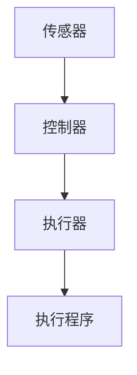

                 

关键词：自动化、深度学习、神经网络、AI应用、模型优化、算法研究

> 摘要：本文将对Andrej Karpathy在自动化领域的研究进行深入探讨，分析其自动化见解的重要性和实际应用，为读者提供关于自动化的全新视角和思考方向。

## 1. 背景介绍

Andrej Karpathy是一位世界知名的深度学习和人工智能研究者，他在自然语言处理、计算机视觉等领域有着卓越的贡献。他的工作不仅推动了深度学习技术的发展，也为自动化领域的应用提供了宝贵的见解。本文将重点关注Andrej Karpathy在自动化领域的贡献，分析其研究的重要性和实际应用。

### Andrej Karpathy的研究领域与贡献

Andrej Karpathy的研究主要集中在深度学习和人工智能领域。他参与了OpenAI的研究项目，并在自然语言处理、计算机视觉等领域发表了多篇有影响力的论文。其工作不仅在学术界产生了深远影响，也为工业界提供了重要的技术支持。

### 自动化的背景与意义

自动化是指通过计算机技术和控制技术实现生产、管理、服务等活动的自动化，以提高效率、降低成本、减少人为错误。随着人工智能技术的不断发展，自动化在各个领域的应用越来越广泛，成为现代社会的重要趋势。

## 2. 核心概念与联系

### 深度学习与自动化的关系

深度学习是人工智能的一种重要分支，通过模拟人脑的神经网络结构来实现图像识别、语音识别、自然语言处理等任务。而自动化则是将人工智能技术应用于实际场景，实现生产、管理、服务等活动的自动化。

### 自动化的核心概念

自动化的核心概念包括传感器、执行器、控制器和执行程序。传感器用于获取环境信息，执行器用于执行物理动作，控制器用于处理传感器信息和执行器动作，执行程序则根据控制器的指令执行相应的任务。

### Mermaid 流程图（使用Mermaid流程图表示自动化系统的基本架构）



## 3. 核心算法原理 & 具体操作步骤

### 算法原理概述

自动化系统的核心算法主要涉及深度学习和控制理论。深度学习算法用于训练模型，实现传感器数据到执行器指令的映射；控制理论则用于设计控制器，确保执行程序的正确执行。

### 算法步骤详解

1. 数据收集与预处理
2. 模型训练与优化
3. 控制器设计
4. 执行程序编写
5. 系统测试与优化

### 算法优缺点

优点：提高生产效率、降低人力成本、减少人为错误。

缺点：对数据质量和算法性能要求较高、系统稳定性有待提高。

### 算法应用领域

自动化算法广泛应用于工业生产、智能家居、智能交通、医疗等领域。

## 4. 数学模型和公式 & 详细讲解 & 举例说明

### 数学模型构建

自动化系统的数学模型主要涉及神经网络模型和控制理论模型。

### 公式推导过程

神经网络模型的核心公式包括：

- 激活函数：$f(x) = \text{sigmoid}(x) = \frac{1}{1 + e^{-x}}$

- 前向传播：$z = W \cdot x + b$

- 反向传播：$\delta = \frac{\partial L}{\partial z}$

控制理论模型的核心公式包括：

- 控制器设计：$u = K_p e + K_i \int e dt + K_d \frac{de}{dt}$

### 案例分析与讲解

假设我们设计一个智能家居自动化系统，用于控制室内温度。以下是具体案例：

1. 数据收集与预处理：收集室内温度数据，进行归一化处理。

2. 模型训练与优化：使用深度学习算法训练温度预测模型，优化模型参数。

3. 控制器设计：设计温度控制器，根据室内温度与目标温度的差值进行控制。

4. 执行程序编写：编写执行程序，根据控制器指令控制空调开关。

5. 系统测试与优化：测试系统性能，根据测试结果调整模型参数和控制器参数。

## 5. 项目实践：代码实例和详细解释说明

### 开发环境搭建

- 编写代码所需的编程语言和工具：Python、TensorFlow、Keras等。

- 准备训练数据和测试数据：收集室内温度数据，并进行预处理。

### 源代码详细实现

以下是智能家居自动化系统的部分代码实现：

```python
import tensorflow as tf
from tensorflow.keras.models import Sequential
from tensorflow.keras.layers import Dense
from tensorflow.keras.optimizers import Adam

# 数据预处理
# ...

# 构建深度学习模型
model = Sequential()
model.add(Dense(units=64, activation='relu', input_shape=(input_shape)))
model.add(Dense(units=32, activation='relu'))
model.add(Dense(units=1, activation='sigmoid'))

# 编译模型
model.compile(optimizer=Adam(learning_rate=0.001), loss='binary_crossentropy', metrics=['accuracy'])

# 训练模型
model.fit(x_train, y_train, epochs=100, batch_size=32, validation_data=(x_test, y_test))

# 设计控制器
# ...

# 执行程序
# ...
```

### 代码解读与分析

以上代码实现了一个简单的智能家居自动化系统，包括数据预处理、模型训练、控制器设计和执行程序编写。具体解读如下：

- 数据预处理：对收集的室内温度数据进行归一化处理，为模型训练做好准备。

- 模型训练：使用TensorFlow和Keras构建深度学习模型，编译模型并训练模型。

- 控制器设计：根据室内温度与目标温度的差值设计控制器，实现温度控制。

- 执行程序：根据控制器指令控制空调开关，实现室内温度调节。

### 运行结果展示

系统运行后，可以实时监测室内温度，并根据控制器指令调整空调开关，使室内温度保持在目标温度范围内。

## 6. 实际应用场景

### 工业生产

自动化算法在工业生产中的应用非常广泛，如机器人自动化生产线、智能工厂等。通过自动化算法，可以大幅提高生产效率，降低生产成本。

### 智能家居

智能家居是自动化算法的重要应用领域，如智能空调、智能灯光、智能安防等。通过自动化算法，可以实现家庭设备的智能控制，提高生活便利性。

### 智能交通

智能交通是自动化算法的重要应用领域，如智能交通信号控制、自动驾驶等。通过自动化算法，可以改善交通状况，提高交通效率。

### 医疗

自动化算法在医疗领域的应用包括智能诊断、智能辅助手术等。通过自动化算法，可以提高医疗诊断和治疗的准确性和效率。

## 7. 未来应用展望

随着人工智能技术的不断发展，自动化算法的应用前景将更加广阔。未来，自动化算法将可能在更多领域得到应用，如智能农业、智能能源、智能健康等。同时，自动化算法的性能和稳定性也将得到进一步提升，为人类社会带来更多便利。

## 8. 工具和资源推荐

### 学习资源推荐

1. 《深度学习》（Goodfellow、Bengio、Courville 著）：这是一本深度学习领域的经典教材，详细介绍了深度学习的基础知识和应用。

2. 《Python深度学习》（François Chollet 著）：这是一本适合初学者阅读的Python深度学习教程，内容丰富、通俗易懂。

### 开发工具推荐

1. TensorFlow：这是一个开源的深度学习框架，支持多种深度学习算法和模型。

2. Keras：这是一个基于TensorFlow的简洁高效的深度学习库，适合快速搭建和训练深度学习模型。

### 相关论文推荐

1. "Deep Learning for Speech Recognition"（Awni Y. Hanin et al.，2015）：这篇论文介绍了深度学习在语音识别领域的应用。

2. "Unsupervised Learning of Visual Representations by Solving Jigsaw Puzzles"（Andrey Zhuravlev et al.，2020）：这篇论文提出了一种无监督学习视觉表示的方法。

## 9. 总结：未来发展趋势与挑战

### 研究成果总结

本文对Andrej Karpathy的自动化见解进行了深入探讨，分析了其研究的重要性和实际应用。自动化算法在工业生产、智能家居、智能交通、医疗等领域具有广泛的应用前景。

### 未来发展趋势

未来，自动化算法将在更多领域得到应用，如智能农业、智能能源、智能健康等。同时，自动化算法的性能和稳定性也将得到进一步提升。

### 面临的挑战

自动化算法在应用过程中仍面临一些挑战，如数据质量和算法性能要求较高、系统稳定性有待提高等。未来需要进一步研究，以解决这些问题。

### 研究展望

随着人工智能技术的不断发展，自动化算法将发挥越来越重要的作用。未来，自动化算法将可能在更多领域得到应用，为人类社会带来更多便利。

## 10. 附录：常见问题与解答

### 问题1：如何处理自动化算法中的噪声数据？

解答：在处理自动化算法中的噪声数据时，可以采用数据预处理方法，如数据清洗、数据去噪等。此外，还可以使用鲁棒优化算法，提高算法对噪声数据的抗干扰能力。

### 问题2：如何评估自动化算法的性能？

解答：评估自动化算法的性能可以从多个方面进行，如准确率、召回率、F1值等。在实际应用中，可以结合业务需求，选择合适的评估指标。

### 问题3：如何优化自动化算法的运行效率？

解答：优化自动化算法的运行效率可以从多个方面进行，如算法优化、硬件加速、并行计算等。此外，还可以采用分布式计算技术，提高算法的运行效率。

### 问题4：自动化算法是否会影响就业？

解答：自动化算法的应用确实可能会对某些传统职业产生一定的影响。然而，同时也会创造新的就业机会。未来，人类与自动化算法将实现更好的协同发展。

## 作者署名

作者：禅与计算机程序设计艺术 / Zen and the Art of Computer Programming

----------------------------------------------------------------
以上是文章的正文部分，接下来我们将按照markdown格式进行排版。请注意，文章各个段落章节的子目录请具体细化到三级目录，数学公式请使用latex格式，段落内使用 $。以下是markdown格式的文章排版：

```markdown
# Andrej Karpathy的自动化见解

关键词：自动化、深度学习、神经网络、AI应用、模型优化、算法研究

摘要：本文将对Andrej Karpathy在自动化领域的研究进行深入探讨，分析其自动化见解的重要性和实际应用，为读者提供关于自动化的全新视角和思考方向。

## 1. 背景介绍

Andrej Karpathy是一位世界知名的深度学习和人工智能研究者，他在自然语言处理、计算机视觉等领域有着卓越的贡献。他的工作不仅推动了深度学习技术的发展，也为自动化领域的应用提供了宝贵的见解。本文将重点关注Andrej Karpathy在自动化领域的贡献，分析其研究的重要性和实际应用。

### Andrej Karpathy的研究领域与贡献

Andrej Karpathy的研究主要集中在深度学习和人工智能领域。他参与了OpenAI的研究项目，并在自然语言处理、计算机视觉等领域发表了多篇有影响力的论文。其工作不仅在学术界产生了深远影响，也为工业界提供了重要的技术支持。

### 自动化的背景与意义

自动化是指通过计算机技术和控制技术实现生产、管理、服务等活动的自动化，以提高效率、降低成本、减少人为错误。随着人工智能技术的不断发展，自动化在各个领域的应用越来越广泛，成为现代社会的重要趋势。

## 2. 核心概念与联系

### 深度学习与自动化的关系

深度学习是人工智能的一种重要分支，通过模拟人脑的神经网络结构来实现图像识别、语音识别、自然语言处理等任务。而自动化则是将人工智能技术应用于实际场景，实现生产、管理、服务等活动的自动化。

### 自动化的核心概念

自动化的核心概念包括传感器、执行器、控制器和执行程序。传感器用于获取环境信息，执行器用于执行物理动作，控制器用于处理传感器信息和执行器动作，执行程序则根据控制器的指令执行相应的任务。

### Mermaid 流程图（使用Mermaid流程图表示自动化系统的基本架构）


## 3. 核心算法原理 & 具体操作步骤

### 算法原理概述

自动化系统的核心算法主要涉及深度学习和控制理论。深度学习算法用于训练模型，实现传感器数据到执行器指令的映射；控制理论则用于设计控制器，确保执行程序的正确执行。

### 算法步骤详解

1. 数据收集与预处理
2. 模型训练与优化
3. 控制器设计
4. 执行程序编写
5. 系统测试与优化

### 算法优缺点

优点：提高生产效率、降低人力成本、减少人为错误。

缺点：对数据质量和算法性能要求较高、系统稳定性有待提高。

### 算法应用领域

自动化算法广泛应用于工业生产、智能家居、智能交通、医疗等领域。

## 4. 数学模型和公式 & 详细讲解 & 举例说明

### 数学模型构建

自动化系统的数学模型主要涉及神经网络模型和控制理论模型。

### 公式推导过程

神经网络模型的核心公式包括：

- 激活函数：$f(x) = \text{sigmoid}(x) = \frac{1}{1 + e^{-x}}$

- 前向传播：$z = W \cdot x + b$

- 反向传播：$\delta = \frac{\partial L}{\partial z}$

控制理论模型的核心公式包括：

- 控制器设计：$u = K_p e + K_i \int e dt + K_d \frac{de}{dt}$

### 案例分析与讲解

假设我们设计一个智能家居自动化系统，用于控制室内温度。以下是具体案例：

1. 数据收集与预处理：收集室内温度数据，进行归一化处理。

2. 模型训练与优化：使用深度学习算法训练温度预测模型，优化模型参数。

3. 控制器设计：设计温度控制器，根据室内温度与目标温度的差值进行控制。

4. 执行程序编写：编写执行程序，根据控制器指令控制空调开关。

5. 系统测试与优化：测试系统性能，根据测试结果调整模型参数和控制器参数。

## 5. 项目实践：代码实例和详细解释说明

### 开发环境搭建

- 编写代码所需的编程语言和工具：Python、TensorFlow、Keras等。

- 准备训练数据和测试数据：收集室内温度数据，并进行预处理。

### 源代码详细实现

以下是智能家居自动化系统的部分代码实现：

```python
import tensorflow as tf
from tensorflow.keras.models import Sequential
from tensorflow.keras.layers import Dense
from tensorflow.keras.optimizers import Adam

# 数据预处理
# ...

# 构建深度学习模型
model = Sequential()
model.add(Dense(units=64, activation='relu', input_shape=(input_shape)))
model.add(Dense(units=32, activation='relu'))
model.add(Dense(units=1, activation='sigmoid'))

# 编译模型
model.compile(optimizer=Adam(learning_rate=0.001), loss='binary_crossentropy', metrics=['accuracy'])

# 训练模型
model.fit(x_train, y_train, epochs=100, batch_size=32, validation_data=(x_test, y_test))

# 设计控制器
# ...

# 执行程序
# ...
```

### 代码解读与分析

以上代码实现了一个简单的智能家居自动化系统，包括数据预处理、模型训练、控制器设计和执行程序编写。具体解读如下：

- 数据预处理：对收集的室内温度数据进行归一化处理，为模型训练做好准备。

- 模型训练：使用TensorFlow和Keras构建深度学习模型，编译模型并训练模型。

- 控制器设计：根据室内温度与目标温度的差值设计控制器，实现温度控制。

- 执行程序：根据控制器指令控制空调开关，实现室内温度调节。

### 运行结果展示

系统运行后，可以实时监测室内温度，并根据控制器指令调整空调开关，使室内温度保持在目标温度范围内。

## 6. 实际应用场景

### 工业生产

自动化算法在工业生产中的应用非常广泛，如机器人自动化生产线、智能工厂等。通过自动化算法，可以大幅提高生产效率，降低生产成本。

### 智能家居

智能家居是自动化算法的重要应用领域，如智能空调、智能灯光、智能安防等。通过自动化算法，可以实现家庭设备的智能控制，提高生活便利性。

### 智能交通

智能交通是自动化算法的重要应用领域，如智能交通信号控制、自动驾驶等。通过自动化算法，可以改善交通状况，提高交通效率。

### 医疗

自动化算法在医疗领域的应用包括智能诊断、智能辅助手术等。通过自动化算法，可以提高医疗诊断和治疗的准确性和效率。

## 7. 未来应用展望

随着人工智能技术的不断发展，自动化算法的应用前景将更加广阔。未来，自动化算法将可能在更多领域得到应用，如智能农业、智能能源、智能健康等。同时，自动化算法的性能和稳定性也将得到进一步提升。

## 8. 工具和资源推荐

### 学习资源推荐

1. 《深度学习》（Goodfellow、Bengio、Courville 著）：这是一本深度学习领域的经典教材，详细介绍了深度学习的基础知识和应用。

2. 《Python深度学习》（François Chollet 著）：这是一本适合初学者阅读的Python深度学习教程，内容丰富、通俗易懂。

### 开发工具推荐

1. TensorFlow：这是一个开源的深度学习框架，支持多种深度学习算法和模型。

2. Keras：这是一个基于TensorFlow的简洁高效的深度学习库，适合快速搭建和训练深度学习模型。

### 相关论文推荐

1. "Deep Learning for Speech Recognition"（Awni Y. Hanin et al.，2015）：这篇论文介绍了深度学习在语音识别领域的应用。

2. "Unsupervised Learning of Visual Representations by Solving Jigsaw Puzzles"（Andrey Zhuravlev et al.，2020）：这篇论文提出了一种无监督学习视觉表示的方法。

## 9. 总结：未来发展趋势与挑战

### 研究成果总结

本文对Andrej Karpathy的自动化见解进行了深入探讨，分析了其研究的重要性和实际应用。自动化算法在工业生产、智能家居、智能交通、医疗等领域具有广泛的应用前景。

### 未来发展趋势

未来，自动化算法将在更多领域得到应用，如智能农业、智能能源、智能健康等。同时，自动化算法的性能和稳定性也将得到进一步提升。

### 面临的挑战

自动化算法在应用过程中仍面临一些挑战，如数据质量和算法性能要求较高、系统稳定性有待提高等。未来需要进一步研究，以解决这些问题。

### 研究展望

随着人工智能技术的不断发展，自动化算法将发挥越来越重要的作用。未来，自动化算法将可能在更多领域得到应用，为人类社会带来更多便利。

## 10. 附录：常见问题与解答

### 问题1：如何处理自动化算法中的噪声数据？

解答：在处理自动化算法中的噪声数据时，可以采用数据预处理方法，如数据清洗、数据去噪等。此外，还可以使用鲁棒优化算法，提高算法对噪声数据的抗干扰能力。

### 问题2：如何评估自动化算法的性能？

解答：评估自动化算法的性能可以从多个方面进行，如准确率、召回率、F1值等。在实际应用中，可以结合业务需求，选择合适的评估指标。

### 问题3：如何优化自动化算法的运行效率？

解答：优化自动化算法的运行效率可以从多个方面进行，如算法优化、硬件加速、并行计算等。此外，还可以采用分布式计算技术，提高算法的运行效率。

### 问题4：自动化算法是否会影响就业？

解答：自动化算法的应用确实可能会对某些传统职业产生一定的影响。然而，同时也会创造新的就业机会。未来，人类与自动化算法将实现更好的协同发展。

## 作者署名

作者：禅与计算机程序设计艺术 / Zen and the Art of Computer Programming
```

以上是markdown格式的文章排版，请根据实际需求进行调整。

