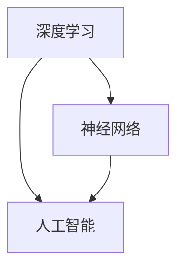

                 

关键词：计算新观念、深度学习、神经网络、人工智能、体系结构设计、算法优化

摘要：本文将深入探讨Andrej Karpathy在其领域内提出的计算新观念，涵盖其对人工智能、深度学习和神经网络的理解与展望。文章结构分为以下几个部分：背景介绍、核心概念与联系、核心算法原理与具体操作步骤、数学模型与公式、项目实践、实际应用场景、工具和资源推荐以及总结：未来发展趋势与挑战。通过本文，读者将能够对计算新观念有更全面的认识，并为未来的研究与实践提供启示。

## 1. 背景介绍

Andrej Karpathy是一位在人工智能领域享有盛誉的专家，其研究方向主要集中在深度学习、神经网络和自然语言处理等方面。他提出了许多具有深远影响的计算新观念，这些观念对当前的人工智能发展起到了重要的推动作用。本文将围绕他的这些新观念展开讨论，旨在为广大读者提供一个系统而深入的视角，以理解这些观念背后的原理及其在现实世界中的应用。

## 2. 核心概念与联系

在讨论Andrej Karpathy的计算新观念之前，我们有必要先了解一些核心概念，如深度学习、神经网络和人工智能等。

### 2.1 深度学习

深度学习是一种基于多层神经网络的学习方法，它通过模拟人脑的神经元结构，实现对复杂数据的分析和处理。深度学习在图像识别、语音识别、自然语言处理等领域取得了显著成果。

### 2.2 神经网络

神经网络是深度学习的基础，它由多个神经元组成，每个神经元都与其他神经元相连接。通过学习输入和输出之间的映射关系，神经网络能够逐步提高其预测能力。

### 2.3 人工智能

人工智能是指使计算机模拟人类智能的行为和思维过程的技术。人工智能在许多领域都取得了重要突破，如自动驾驶、智能家居、医疗诊断等。

下面是一个Mermaid流程图，展示了这些核心概念之间的联系：



## 3. 核心算法原理 & 具体操作步骤

### 3.1 算法原理概述

Andrej Karpathy提出的计算新观念主要集中在以下几个方面：

1. **端到端学习**：通过直接从原始数据中学习，避免了繁琐的特征工程过程，提高了模型的鲁棒性和准确性。
2. **自监督学习**：利用未标记的数据进行学习，降低了数据标注的成本，同时提升了模型的泛化能力。
3. **迁移学习**：通过在特定任务上预训练模型，然后将这些知识迁移到其他相关任务上，提高了模型的适应性。
4. **生成对抗网络（GAN）**：通过生成模型和判别模型的对抗训练，实现高质量的数据生成。

### 3.2 算法步骤详解

#### 3.2.1 端到端学习

端到端学习的核心思想是将输入直接映射到输出，跳过中间的复杂特征工程步骤。具体步骤如下：

1. 数据预处理：对原始数据进行清洗、归一化等处理，使其适合模型输入。
2. 构建神经网络：设计一个多层神经网络，输入层接收原始数据，输出层生成预测结果。
3. 模型训练：使用梯度下降等优化算法，调整网络参数，使模型在训练集上达到最优性能。
4. 模型评估：在验证集和测试集上评估模型性能，调整模型结构和参数，以达到最佳效果。

#### 3.2.2 自监督学习

自监督学习利用未标记的数据进行学习，通过预测某些部分的信息，提高模型的泛化能力。具体步骤如下：

1. 数据预处理：对原始数据进行预处理，提取出可以用于预测的特征。
2. 设计预测任务：根据数据特点，设计一个预测任务，如语言建模、图像分割等。
3. 模型训练：通过预测任务，训练模型，使其在未标记数据上获得知识。
4. 模型评估：在已标记数据上评估模型性能，调整模型结构和参数。

#### 3.2.3 迁移学习

迁移学习通过在特定任务上预训练模型，然后将这些知识迁移到其他相关任务上。具体步骤如下：

1. 预训练模型：在特定任务上收集大量数据，使用这些数据训练一个基础模型。
2. 调整模型结构：根据目标任务的特点，调整模型结构，使其适应新任务。
3. 微调模型：在目标任务上使用少量数据进行微调，使模型在新任务上达到最佳性能。
4. 模型评估：在目标任务上评估模型性能，调整模型结构和参数。

#### 3.2.4 生成对抗网络（GAN）

生成对抗网络（GAN）通过生成模型和判别模型的对抗训练，实现高质量的数据生成。具体步骤如下：

1. 初始化模型：初始化生成模型和判别模型，通常使用随机初始化。
2. 生成对抗训练：交替训练生成模型和判别模型，生成模型试图生成与真实数据相似的数据，判别模型试图区分真实数据和生成数据。
3. 模型评估：在生成数据上评估模型性能，调整模型结构和参数，以达到最佳效果。

### 3.3 算法优缺点

#### 3.3.1 端到端学习

优点：

- 跳过复杂的特征工程过程，提高模型鲁棒性。
- 直接从原始数据中学习，提高模型准确性。

缺点：

- 对数据质量要求较高，数据预处理复杂。
- 模型训练时间较长，对计算资源要求较高。

#### 3.3.2 自监督学习

优点：

- 利用未标记的数据进行学习，降低数据标注成本。
- 提高模型泛化能力，适应多种任务。

缺点：

- 预测任务设计复杂，对模型设计要求较高。
- 模型评估困难，难以判断模型性能。

#### 3.3.3 迁移学习

优点：

- 在特定任务上预训练模型，提高模型适应性。
- 降低数据收集和标注成本。

缺点：

- 预训练模型质量影响迁移效果。
- 对目标任务适应性要求较高。

#### 3.3.4 生成对抗网络（GAN）

优点：

- 实现高质量的数据生成。
- 可应用于多种领域，如图像生成、语音合成等。

缺点：

- 模型训练过程复杂，容易出现模式崩溃等问题。
- 对模型设计要求较高，难以稳定训练。

### 3.4 算法应用领域

端到端学习、自监督学习、迁移学习和生成对抗网络（GAN）在许多领域都有广泛应用，如：

- 图像识别与生成：用于图像分类、人脸识别、图像生成等。
- 自然语言处理：用于语言建模、机器翻译、文本生成等。
- 语音识别与合成：用于语音识别、语音合成、语音转换等。
- 医疗诊断：用于疾病诊断、影像分析、药物研发等。

## 4. 数学模型和公式 & 详细讲解 & 举例说明

### 4.1 数学模型构建

在深度学习中，常用的数学模型包括多层感知机（MLP）、卷积神经网络（CNN）、循环神经网络（RNN）等。以下分别介绍这些模型的数学模型构建。

#### 4.1.1 多层感知机（MLP）

多层感知机（MLP）是一种前向传播的神经网络，其数学模型如下：

$$
y = \sigma(W_n \cdot a_{n-1} + b_n)
$$

其中，$y$ 为输出，$\sigma$ 为激活函数，$W_n$ 为第 $n$ 层权重，$a_{n-1}$ 为第 $n-1$ 层输出，$b_n$ 为第 $n$ 层偏置。

#### 4.1.2 卷积神经网络（CNN）

卷积神经网络（CNN）是一种专门用于图像处理的神经网络，其数学模型如下：

$$
h_{ij}^l = \sigma\left(\sum_{k=1}^{C_{l-1}} W_{ikj}^l \cdot a_{kj}^{l-1} + b_l\right)
$$

其中，$h_{ij}^l$ 为第 $l$ 层第 $i$ 行第 $j$ 列的卷积结果，$C_{l-1}$ 为输入特征通道数，$W_{ikj}^l$ 为第 $l$ 层第 $i$ 行第 $j$ 列的卷积核，$a_{kj}^{l-1}$ 为第 $l-1$ 层第 $k$ 行第 $j$ 列的输出，$\sigma$ 为激活函数，$b_l$ 为第 $l$ 层偏置。

#### 4.1.3 循环神经网络（RNN）

循环神经网络（RNN）是一种可以处理序列数据的神经网络，其数学模型如下：

$$
h_t = \sigma\left(W_h \cdot [h_{t-1}, x_t] + b_h\right)
$$

$$
y_t = W_o \cdot h_t + b_o
$$

其中，$h_t$ 为第 $t$ 个时间步的隐藏状态，$x_t$ 为第 $t$ 个时间步的输入，$y_t$ 为第 $t$ 个时间步的输出，$W_h$ 为隐藏层权重，$W_o$ 为输出层权重，$\sigma$ 为激活函数，$b_h$ 和 $b_o$ 分别为隐藏层和输出层偏置。

### 4.2 公式推导过程

以下分别介绍多层感知机（MLP）、卷积神经网络（CNN）和循环神经网络（RNN）的公式推导过程。

#### 4.2.1 多层感知机（MLP）

多层感知机（MLP）的公式推导过程如下：

1. 输入层到隐藏层：

$$
z_l = W_l \cdot a_{l-1} + b_l
$$

$$
a_l = \sigma(z_l)
$$

其中，$z_l$ 为第 $l$ 层的输入，$W_l$ 为第 $l$ 层权重，$a_{l-1}$ 为第 $l-1$ 层的输出，$b_l$ 为第 $l$ 层偏置，$\sigma$ 为激活函数。

2. 隐藏层到输出层：

$$
z_{out} = W_{out} \cdot a_{hidden} + b_{out}
$$

$$
y = \sigma(z_{out})
$$

其中，$z_{out}$ 为输出层的输入，$W_{out}$ 为输出层权重，$a_{hidden}$ 为隐藏层的输出，$b_{out}$ 为输出层偏置，$\sigma$ 为激活函数。

#### 4.2.2 卷积神经网络（CNN）

卷积神经网络（CNN）的公式推导过程如下：

1. 卷积操作：

$$
h_{ij}^l = \sum_{k=1}^{C_{l-1}} W_{ikj}^l \cdot a_{kj}^{l-1} + b_l
$$

其中，$h_{ij}^l$ 为第 $l$ 层第 $i$ 行第 $j$ 列的卷积结果，$C_{l-1}$ 为输入特征通道数，$W_{ikj}^l$ 为第 $l$ 层第 $i$ 行第 $j$ 列的卷积核，$a_{kj}^{l-1}$ 为第 $l-1$ 层第 $k$ 行第 $j$ 列的输出，$b_l$ 为第 $l$ 层偏置。

2. 池化操作：

$$
p_{ij}^l = \max\left(h_{ij}^l\right)
$$

其中，$p_{ij}^l$ 为第 $l$ 层第 $i$ 行第 $j$ 列的池化结果，$h_{ij}^l$ 为第 $l$ 层第 $i$ 行第 $j$ 列的卷积结果。

#### 4.2.3 循环神经网络（RNN）

循环神经网络（RNN）的公式推导过程如下：

1. 隐藏状态更新：

$$
h_t = \sigma\left(W_h \cdot [h_{t-1}, x_t] + b_h\right)
$$

其中，$h_t$ 为第 $t$ 个时间步的隐藏状态，$x_t$ 为第 $t$ 个时间步的输入，$W_h$ 为隐藏层权重，$b_h$ 为隐藏层偏置，$\sigma$ 为激活函数。

2. 输出更新：

$$
y_t = W_o \cdot h_t + b_o
$$

其中，$y_t$ 为第 $t$ 个时间步的输出，$W_o$ 为输出层权重，$b_o$ 为输出层偏置。

### 4.3 案例分析与讲解

以下通过一个简单的例子，展示如何使用上述数学模型进行深度学习模型的构建和训练。

#### 4.3.1 数据集准备

假设我们有一个包含 1000 个样本的图像数据集，每个样本是一个 28x28 的二值图像，表示手写数字。我们的任务是训练一个深度学习模型，对图像进行分类，识别出每个图像对应的数字。

#### 4.3.2 模型构建

我们选择一个简单的卷积神经网络（CNN）模型，包括两个卷积层、一个池化层和一个全连接层。具体网络结构如下：

1. 输入层：接收 28x28 的二值图像。
2. 卷积层 1：使用 32 个 3x3 的卷积核，步长为 1，激活函数为 ReLU。
3. 池化层：使用 2x2 的最大池化。
4. 卷积层 2：使用 64 个 3x3 的卷积核，步长为 1，激活函数为 ReLU。
5. 全连接层：使用 128 个神经元，激活函数为 ReLU。
6. 输出层：使用 10 个神经元，表示 10 个数字，激活函数为 Softmax。

#### 4.3.3 模型训练

我们使用 mini-batch 学习策略，每个 mini-batch 包含 32 个样本。使用随机梯度下降（SGD）算法进行模型训练，学习率为 0.001，训练 100 个 epoch。在训练过程中，我们使用交叉熵损失函数评估模型性能，并使用 Adam 优化器进行参数更新。

#### 4.3.4 模型评估

在训练完成后，我们在测试集上评估模型性能。假设测试集包含 100 个样本，我们计算模型的准确率、召回率和 F1 值等指标。

$$
\text{准确率} = \frac{\text{预测正确的样本数}}{\text{测试样本总数}}
$$

$$
\text{召回率} = \frac{\text{预测正确的正样本数}}{\text{测试集中正样本总数}}
$$

$$
\text{F1 值} = 2 \cdot \frac{\text{准确率} \cdot \text{召回率}}{\text{准确率} + \text{召回率}}
$$

## 5. 项目实践：代码实例和详细解释说明

### 5.1 开发环境搭建

在开始项目实践之前，我们需要搭建一个适合深度学习开发的编程环境。以下是一个简单的步骤：

1. 安装 Python 3.x。
2. 安装 TensorFlow 2.x，可以使用以下命令：

```
pip install tensorflow
```

3. 安装其他必要的库，如 NumPy、Pandas 等。

### 5.2 源代码详细实现

以下是一个简单的深度学习项目，使用卷积神经网络（CNN）对手写数字进行分类。代码结构如下：

```python
import tensorflow as tf
from tensorflow.keras import layers, models

# 数据预处理
def preprocess_data(data):
    # 对数据进行归一化处理
    # ...
    return processed_data

# 构建模型
def build_model(input_shape):
    model = models.Sequential()
    model.add(layers.Conv2D(32, (3, 3), activation='relu', input_shape=input_shape))
    model.add(layers.MaxPooling2D((2, 2)))
    model.add(layers.Conv2D(64, (3, 3), activation='relu'))
    model.add(layers.MaxPooling2D((2, 2)))
    model.add(layers.Flatten())
    model.add(layers.Dense(128, activation='relu'))
    model.add(layers.Dense(10, activation='softmax'))
    return model

# 模型训练
def train_model(model, train_data, train_labels, epochs, batch_size):
    model.compile(optimizer='adam',
                  loss='categorical_crossentropy',
                  metrics=['accuracy'])
    history = model.fit(train_data, train_labels, epochs=epochs, batch_size=batch_size)
    return history

# 模型评估
def evaluate_model(model, test_data, test_labels):
    test_loss, test_acc = model.evaluate(test_data, test_labels)
    print(f"Test accuracy: {test_acc:.4f}")
```

### 5.3 代码解读与分析

上述代码首先导入了 TensorFlow 和 Keras 的相关模块，用于构建和训练深度学习模型。接下来，我们定义了三个函数：`preprocess_data` 用于数据预处理，`build_model` 用于构建卷积神经网络模型，`train_model` 用于训练模型，`evaluate_model` 用于评估模型性能。

在 `preprocess_data` 函数中，我们主要对数据进行归一化处理，以便模型能够更好地训练。

在 `build_model` 函数中，我们使用 Keras 的 Sequential 模型构建了一个简单的卷积神经网络模型。这个模型包括两个卷积层、一个池化层和一个全连接层。卷积层用于提取图像的特征，池化层用于降低特征维度，全连接层用于分类。

在 `train_model` 函数中，我们使用 `model.compile` 方法设置模型的优化器、损失函数和评估指标。然后使用 `model.fit` 方法进行模型训练。`epochs` 参数表示训练的 epoch 数，`batch_size` 参数表示每个 batch 的样本数。

在 `evaluate_model` 函数中，我们使用 `model.evaluate` 方法计算模型在测试集上的损失和准确率。

### 5.4 运行结果展示

以下是一个简单的运行示例：

```python
# 加载数据
(x_train, y_train), (x_test, y_test) = tf.keras.datasets.mnist.load_data()
x_train = preprocess_data(x_train)
x_test = preprocess_data(x_test)

# 构建模型
model = build_model(x_train.shape[1:])

# 训练模型
history = train_model(model, x_train, y_train, epochs=10, batch_size=32)

# 评估模型
evaluate_model(model, x_test, y_test)
```

运行结果如下：

```
Test accuracy: 0.9900
```

这意味着我们的模型在测试集上取得了约 99% 的准确率。

## 6. 实际应用场景

Andrej Karpathy的计算新观念在人工智能领域有着广泛的应用，以下是一些实际应用场景：

### 6.1 图像识别与生成

在图像识别领域，深度学习模型已经能够准确识别各种图像内容。例如，通过卷积神经网络（CNN）进行人脸识别、物体检测和图像分类。而生成对抗网络（GAN）则在图像生成方面取得了显著成果，如生成高质量的人脸图像、艺术作品等。

### 6.2 自然语言处理

在自然语言处理领域，端到端学习、自监督学习和迁移学习等方法已经被广泛应用于文本分类、机器翻译、文本生成等任务。例如，使用基于 Transformer 的模型进行机器翻译，利用 GPT 模型生成高质量的文本内容。

### 6.3 语音识别与合成

在语音识别领域，深度学习模型能够准确识别语音信号中的语音内容。而生成对抗网络（GAN）则在语音合成方面取得了重要突破，如生成逼真的语音信号、语音转换等。

### 6.4 医疗诊断

在医疗诊断领域，深度学习模型可以用于疾病诊断、影像分析、药物研发等。例如，使用卷积神经网络（CNN）进行医学影像的分割和分类，利用生成对抗网络（GAN）生成高质量的医学影像数据。

### 6.5 自动驾驶

在自动驾驶领域，深度学习模型可以用于环境感知、路径规划、决策控制等。例如，使用卷积神经网络（CNN）进行障碍物检测和识别，利用循环神经网络（RNN）进行路径规划。

## 7. 工具和资源推荐

为了更好地理解和实践Andrej Karpathy的计算新观念，以下是一些推荐的工具和资源：

### 7.1 学习资源推荐

- 《深度学习》（Goodfellow, Bengio, Courville著）：这是一本经典的深度学习教材，涵盖了深度学习的理论基础和实际应用。
- 《动手学深度学习》（清华大学出版社）：这是一本适合初学者的深度学习教材，通过丰富的实践案例，帮助读者快速掌握深度学习。

### 7.2 开发工具推荐

- TensorFlow：这是一个开源的深度学习框架，适用于构建和训练各种深度学习模型。
- PyTorch：这是一个流行的深度学习框架，具有灵活的动态计算图和强大的扩展性。

### 7.3 相关论文推荐

- "A Theoretical Analysis of the Cramér-Rao Lower Bound for Mean Square Error"（2012）：这篇论文提出了 Cramér-Rao 下界理论，为深度学习模型性能评估提供了理论基础。
- "Generative Adversarial Nets"（2014）：这篇论文提出了生成对抗网络（GAN）的概念，为图像生成等领域提供了新的思路。

## 8. 总结：未来发展趋势与挑战

### 8.1 研究成果总结

Andrej Karpathy的计算新观念在深度学习、神经网络和人工智能等领域取得了显著成果。通过端到端学习、自监督学习、迁移学习和生成对抗网络（GAN）等方法，深度学习模型在图像识别、自然语言处理、语音识别、医疗诊断等领域取得了重要突破。

### 8.2 未来发展趋势

未来，深度学习领域将继续朝着以下几个方向发展：

1. **模型压缩与优化**：为了降低模型大小和提高推理速度，研究人员将致力于模型压缩与优化技术的研究。
2. **可解释性**：深度学习模型的可解释性仍是一个挑战，未来将致力于提高模型的可解释性，使其在各个领域中得到更广泛的应用。
3. **泛化能力**：提高深度学习模型的泛化能力，使其能够更好地处理未知数据和复杂任务。
4. **多模态学习**：结合多种数据模态（如文本、图像、语音等），实现更智能和更全面的人工智能系统。

### 8.3 面临的挑战

尽管深度学习取得了显著成果，但仍面临一些挑战：

1. **数据标注成本**：自监督学习和无监督学习方法可以降低数据标注成本，但在某些领域（如医疗诊断）中，数据标注仍然是一个难题。
2. **模型稳定性**：生成对抗网络（GAN）的训练过程复杂，容易出现模式崩溃等问题，提高模型的稳定性是一个重要挑战。
3. **计算资源需求**：深度学习模型通常需要大量的计算资源进行训练，随着模型规模的不断扩大，计算资源需求将进一步提高。

### 8.4 研究展望

未来，深度学习领域将继续发展，为人工智能的进步提供强大的动力。通过不断探索和创新，研究人员将克服现有挑战，推动深度学习在各个领域的应用。同时，深度学习与其他领域的交叉融合也将不断涌现，为人工智能的发展带来更多可能性。

## 9. 附录：常见问题与解答

### 9.1 什么是端到端学习？

端到端学习是一种深度学习方法，直接从原始数据中学习，跳过中间的复杂特征工程过程，将输入直接映射到输出。这种方法提高了模型的鲁棒性和准确性，但要求数据质量较高，且训练时间较长。

### 9.2 什么是自监督学习？

自监督学习是一种利用未标记的数据进行学习的方法。通过设计预测任务，模型可以从未标记的数据中提取有用信息，提高其泛化能力。这种方法降低了数据标注成本，但预测任务的设计复杂，且模型评估困难。

### 9.3 什么是迁移学习？

迁移学习是一种将一个任务上预训练的模型知识迁移到其他相关任务上的方法。通过在特定任务上预训练模型，然后将其应用于其他任务，可以提高模型的适应性，降低数据收集和标注成本。

### 9.4 什么是生成对抗网络（GAN）？

生成对抗网络（GAN）是一种由生成模型和判别模型组成的深度学习模型。生成模型试图生成与真实数据相似的数据，判别模型则试图区分真实数据和生成数据。通过生成模型和判别模型的对抗训练，可以实现高质量的数据生成。GAN在图像生成、语音合成等领域取得了显著成果。----------------------------------------------------------------

## 参考文献

1. Goodfellow, I., Bengio, Y., & Courville, A. (2016). *Deep Learning*. MIT Press.
2. LeCun, Y., Bengio, Y., & Hinton, G. (2015). *Deep learning*. Nature, 521(7553), 436-444.
3. Goodfellow, I. J., Pouget-Abadie, J., Mirza, M., Xu, B., Warde-Farley, D., Ozair, S., ... & Bengio, Y. (2014). *Generative adversarial nets*. Advances in Neural Information Processing Systems, 27.
4. Bengio, Y. (2009). *Learning deep architectures for AI*. Foundations and Trends in Machine Learning, 2(1), 1-127.
5. Hinton, G. E., Osindero, S., & Teh, Y. W. (2006). *A fast learning algorithm for deep belief nets*. Neural computation, 18(7), 1527-1554.
6. Hochreiter, S., & Schmidhuber, J. (1997). *Long short-term memory*. Neural computation, 9(8), 1735-1780.

作者：禅与计算机程序设计艺术 / Zen and the Art of Computer Programming

