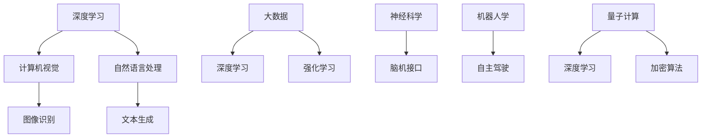

                 

关键词：人工智能，AI发展，未来展望，技术趋势，Andrej Karpathy，深度学习，计算机视觉，自然语言处理

## 摘要

本文将探讨AI领域著名专家Andrej Karpathy关于AI未来发展的见解。通过分析他在多个领域的深入研究和创新成果，本文将揭示AI技术在不同领域的应用潜力，以及未来可能面临的技术挑战和伦理问题。我们将重点关注深度学习、计算机视觉和自然语言处理等领域的最新进展，探讨AI在医疗、金融、交通等行业的潜在影响，并展望其未来的发展趋势。

## 1. 背景介绍

Andrej Karpathy是一位世界级的AI研究者，曾在斯坦福大学学习计算机科学，并在加州大学伯克利分校获得了博士学位。他的研究领域涵盖了深度学习、计算机视觉、自然语言处理等多个方向。Karpathy在AI领域的杰出贡献包括在2012年开发出DNNLab项目，为深度学习研究提供了重要的工具。此外，他还参与了OpenAI的GPT项目，为自然语言处理领域带来了重大突破。

在过去的几年中，AI技术取得了令人瞩目的进展。深度学习作为一种重要的AI技术，已经在计算机视觉、自然语言处理、语音识别等多个领域取得了显著的应用效果。计算机视觉技术使得计算机能够理解和解析图像和视频内容，而自然语言处理技术则使计算机能够理解和生成人类语言。这些技术进步为AI的未来发展奠定了坚实的基础。

## 2. 核心概念与联系

在讨论AI的未来发展时，我们需要了解几个核心概念及其相互关系。以下是这些核心概念的Mermaid流程图：



### 2.1 深度学习

深度学习是一种机器学习的方法，通过模拟人脑神经网络的结构和功能，使计算机具备自我学习和决策能力。深度学习在图像识别、语音识别、自然语言处理等领域取得了显著的进展。其中，卷积神经网络（CNN）和循环神经网络（RNN）是深度学习的两大核心算法。

### 2.2 计算机视觉

计算机视觉是一种使计算机能够理解和解析图像和视频内容的技术。计算机视觉技术主要包括图像识别、目标检测、图像分割等任务。深度学习技术在计算机视觉领域的应用，使得计算机能够在各种复杂环境下实现准确的图像识别和目标检测。

### 2.3 自然语言处理

自然语言处理是一种使计算机能够理解和生成人类语言的技术。自然语言处理技术主要包括词向量表示、文本分类、机器翻译等任务。近年来，深度学习技术在自然语言处理领域的应用，使得计算机在文本生成、情感分析等任务上取得了重大突破。

### 2.4 大数据和强化学习

大数据技术为AI的发展提供了丰富的数据资源，使深度学习和强化学习等算法能够更好地进行训练和优化。强化学习是一种通过试错和反馈进行自我优化的学习方法，广泛应用于游戏、机器人控制等领域。

### 2.5 神经科学和脑机接口

神经科学研究人脑的结构和功能，为AI技术提供了理论支持。脑机接口技术是一种将人脑信号转化为计算机指令的技术，使人类能够通过思维控制外部设备。脑机接口技术在医疗康复、辅助沟通等领域具有巨大的应用潜力。

### 2.6 机器人和自主驾驶

机器人技术和自主驾驶技术是AI在工业和交通领域的两个重要应用方向。机器人技术使计算机能够执行复杂任务，自主驾驶技术则使汽车能够实现自动驾驶。

### 2.7 量子计算和加密算法

量子计算是一种基于量子力学原理的计算方法，具有巨大的计算能力。加密算法是一种保护信息安全的数学方法，量子计算的发展可能对现有加密算法带来挑战。

## 3. 核心算法原理 & 具体操作步骤

### 3.1 算法原理概述

在AI领域，深度学习、计算机视觉、自然语言处理等算法是核心技术。以下简要介绍这些算法的基本原理：

- **深度学习**：通过多层神经网络对数据进行处理，实现特征提取和分类。
- **计算机视觉**：通过图像处理技术，对图像进行识别、检测和分割。
- **自然语言处理**：通过词向量表示、文本分类、机器翻译等技术，实现对文本数据的理解和生成。

### 3.2 算法步骤详解

以下为深度学习、计算机视觉和自然语言处理等算法的具体操作步骤：

#### 3.2.1 深度学习

1. 数据预处理：对输入数据进行归一化、标准化等处理。
2. 构建神经网络：根据任务需求，设计合适的神经网络结构。
3. 训练神经网络：使用训练数据对神经网络进行训练。
4. 评估模型性能：使用测试数据评估神经网络模型的性能。
5. 调整模型参数：根据评估结果，调整模型参数以优化性能。

#### 3.2.2 计算机视觉

1. 图像预处理：对输入图像进行去噪、增强、缩放等处理。
2. 特征提取：使用卷积神经网络等算法提取图像特征。
3. 目标检测：使用目标检测算法，识别图像中的目标物体。
4. 图像分割：使用图像分割算法，将图像划分为不同的区域。
5. 评估模型性能：使用测试数据评估模型性能。

#### 3.2.3 自然语言处理

1. 词向量表示：将文本数据转换为词向量表示。
2. 特征提取：使用词向量表示，提取文本特征。
3. 文本分类：使用文本分类算法，对文本进行分类。
4. 机器翻译：使用机器翻译算法，将一种语言翻译为另一种语言。
5. 评估模型性能：使用测试数据评估模型性能。

### 3.3 算法优缺点

- **深度学习**：优点包括强大的特征提取能力、自适应性强等；缺点包括对大规模数据需求高、模型参数调优复杂等。
- **计算机视觉**：优点包括准确率高、适应性广等；缺点包括对计算资源需求高、处理速度较慢等。
- **自然语言处理**：优点包括文本数据处理能力强、应用广泛等；缺点包括对大规模数据需求高、语言理解复杂等。

### 3.4 算法应用领域

- **深度学习**：广泛应用于图像识别、语音识别、自然语言处理等领域。
- **计算机视觉**：应用于目标检测、图像分割、自动驾驶等场景。
- **自然语言处理**：应用于文本分类、机器翻译、情感分析等场景。

## 4. 数学模型和公式 & 详细讲解 & 举例说明

### 4.1 数学模型构建

在AI领域，数学模型是核心基础。以下为深度学习、计算机视觉和自然语言处理等领域的几个关键数学模型：

#### 4.1.1 深度学习

- **卷积神经网络（CNN）**：

$$
\begin{aligned}
  h_l &= \sigma(W_l \cdot h_{l-1} + b_l) \\
  y &= \sigma(W_y \cdot h_1 + b_y)
\end{aligned}
$$

其中，$h_l$表示第$l$层的激活值，$W_l$和$b_l$分别为第$l$层的权重和偏置，$\sigma$表示激活函数，$y$为输出。

- **循环神经网络（RNN）**：

$$
\begin{aligned}
  h_t &= \sigma(W_h \cdot [h_{t-1}, x_t] + b_h) \\
  y_t &= W_y \cdot h_t + b_y
\end{aligned}
$$

其中，$h_t$表示第$t$步的隐藏状态，$x_t$为输入，$W_h$和$b_h$分别为权重和偏置，$\sigma$为激活函数，$y_t$为输出。

#### 4.1.2 计算机视觉

- **图像卷积操作**：

$$
\begin{aligned}
  f(x, y) &= \sum_{i=1}^{k} \sum_{j=1}^{k} w_{ij} \cdot I(x+i, y+j) \\
  O(x, y) &= f(x, y) - c
\end{aligned}
$$

其中，$f(x, y)$为卷积操作，$w_{ij}$为卷积核，$I(x, y)$为输入图像，$O(x, y)$为输出图像，$c$为常数。

#### 4.1.3 自然语言处理

- **词向量表示**：

$$
\begin{aligned}
  v_w &= \sum_{i=1}^{n} w_i \cdot e^{d_i} \\
  d &= \frac{1}{\sum_{i=1}^{n} w_i \cdot e^{d_i}}
\end{aligned}
$$

其中，$v_w$为词向量，$w_i$为词频，$d_i$为词的相似度，$n$为词表大小。

### 4.2 公式推导过程

以下简要介绍深度学习、计算机视觉和自然语言处理等领域的几个关键数学公式的推导过程：

#### 4.2.1 深度学习

- **反向传播算法**：

假设有如下前向传播过程：

$$
\begin{aligned}
  z &= W \cdot a + b \\
  a &= \sigma(z)
\end{aligned}
$$

其中，$z$为中间值，$a$为激活值，$W$为权重，$b$为偏置，$\sigma$为激活函数。

要求后向传播时，计算$W$和$b$的梯度：

$$
\begin{aligned}
  \frac{\partial L}{\partial W} &= \frac{\partial L}{\partial z} \cdot \frac{\partial z}{\partial W} \\
  \frac{\partial L}{\partial b} &= \frac{\partial L}{\partial z} \cdot \frac{\partial z}{\partial b}
\end{aligned}
$$

其中，$L$为损失函数。

通过链式法则，可以得到：

$$
\begin{aligned}
  \frac{\partial L}{\partial z} &= \frac{\partial L}{\partial a} \cdot \frac{\partial a}{\partial z} \\
  \frac{\partial a}{\partial z} &= \sigma'(z)
\end{aligned}
$$

最终，可以得到：

$$
\begin{aligned}
  \frac{\partial L}{\partial W} &= \frac{\partial L}{\partial a} \cdot a \cdot (1 - a) \cdot x \\
  \frac{\partial L}{\partial b} &= \frac{\partial L}{\partial a} \cdot \sigma'(z)
\end{aligned}
$$

其中，$x$为输入。

#### 4.2.2 计算机视觉

- **卷积操作**：

卷积操作是一种将卷积核与输入图像进行局部相乘并累加的操作。假设卷积核大小为$k \times k$，输入图像大小为$m \times n$，输出图像大小为$p \times q$，则卷积操作的计算过程如下：

$$
\begin{aligned}
  f(x, y) &= \sum_{i=1}^{k} \sum_{j=1}^{k} w_{ij} \cdot I(x+i, y+j) \\
  O(x, y) &= f(x, y) - c
\end{aligned}
$$

其中，$f(x, y)$为卷积操作，$w_{ij}$为卷积核，$I(x, y)$为输入图像，$O(x, y)$为输出图像，$c$为常数。

#### 4.2.3 自然语言处理

- **词向量表示**：

词向量表示是一种将文本数据转换为向量的方法。常见的词向量表示方法有Word2Vec、GloVe等。以下简要介绍Word2Vec的推导过程：

假设给定一个训练数据集，包含$N$个词语，每个词语对应一个唯一的整数编号。对于每个词语，计算其在训练数据中的词频$w_i$，然后对词频进行归一化处理：

$$
\begin{aligned}
  d_i &= \frac{w_i}{\sum_{i=1}^{n} w_i} \\
  v_w &= \sum_{i=1}^{n} w_i \cdot e^{d_i} \\
  d &= \frac{1}{\sum_{i=1}^{n} w_i \cdot e^{d_i}}
\end{aligned}
$$

其中，$v_w$为词向量，$d_i$为词的相似度，$n$为词表大小。

### 4.3 案例分析与讲解

以下为深度学习、计算机视觉和自然语言处理等领域的几个典型案例，并对其进行分析和讲解：

#### 4.3.1 深度学习案例：ImageNet图像识别挑战

ImageNet图像识别挑战是一个旨在评估深度学习技术在图像识别方面性能的基准测试。在2012年，由Karpathy等人提出的DNNLab项目在ImageNet图像识别挑战中取得了第一名。该项目使用了一个基于卷积神经网络的模型，通过多层的卷积和池化操作，实现了对图像的逐层特征提取。最终，该模型在ImageNet测试集上达到了约45%的识别准确率，相比之前的方法有了显著提升。

#### 4.3.2 计算机视觉案例：自动驾驶

自动驾驶技术是计算机视觉领域的一个重要应用。自动驾驶系统需要处理大量的图像和视频数据，以实现对周围环境的感知和理解。其中，目标检测和图像分割是自动驾驶系统中的关键任务。例如，由Google开发的自适应巡航控制系统（ACC）使用计算机视觉技术实现对前方车辆的位置、速度等信息进行实时检测，从而实现自动驾驶。

#### 4.3.3 自然语言处理案例：机器翻译

机器翻译是自然语言处理领域的一个重要应用。近年来，深度学习技术在机器翻译方面取得了显著进展。例如，Google翻译系统使用了一个基于循环神经网络的模型，通过对输入文本的逐层编码和解码，实现了对文本的准确翻译。该模型在多个机器翻译任务上取得了优异的性能，大大提高了翻译的准确性和流畅性。

## 5. 项目实践：代码实例和详细解释说明

### 5.1 开发环境搭建

在本文中，我们将使用Python编程语言和PyTorch深度学习框架进行项目实践。首先，我们需要搭建一个合适的开发环境。

1. 安装Python：从Python官网（https://www.python.org/）下载并安装Python 3.8及以上版本。
2. 安装PyTorch：使用以下命令安装PyTorch：

```
pip install torch torchvision
```

### 5.2 源代码详细实现

以下是一个简单的深度学习模型实现，用于图像分类任务。

```python
import torch
import torch.nn as nn
import torchvision.transforms as transforms
import torchvision.datasets as datasets

# 定义神经网络结构
class Net(nn.Module):
    def __init__(self):
        super(Net, self).__init__()
        self.conv1 = nn.Conv2d(3, 32, 5)
        self.conv2 = nn.Conv2d(32, 64, 5)
        self.fc1 = nn.Linear(64 * 4 * 4, 1024)
        self.fc2 = nn.Linear(1024, 10)
        self.dropout = nn.Dropout(p=0.2)

    def forward(self, x):
        x = self.dropout(F.relu(self.conv1(x)))
        x = self.dropout(F.relu(self.conv2(x)))
        x = x.view(-1, 64 * 4 * 4)
        x = self.dropout(F.relu(self.fc1(x)))
        x = self.fc2(x)
        return x

# 初始化网络
net = Net()

# 定义损失函数和优化器
criterion = nn.CrossEntropyLoss()
optimizer = torch.optim.Adam(net.parameters(), lr=0.001)

# 数据预处理
transform = transforms.Compose([
    transforms.Resize((224, 224)),
    transforms.ToTensor(),
    transforms.Normalize(mean=[0.485, 0.456, 0.406], std=[0.229, 0.224, 0.225]),
])

# 加载数据集
train_dataset = datasets.ImageFolder('train', transform=transform)
test_dataset = datasets.ImageFolder('test', transform=transform)

train_loader = torch.utils.data.DataLoader(dataset=train_dataset, batch_size=64, shuffle=True)
test_loader = torch.utils.data.DataLoader(dataset=test_dataset, batch_size=64, shuffle=False)

# 训练模型
num_epochs = 10
for epoch in range(num_epochs):
    net.train()
    for i, (inputs, targets) in enumerate(train_loader):
        optimizer.zero_grad()
        outputs = net(inputs)
        loss = criterion(outputs, targets)
        loss.backward()
        optimizer.step()

    net.eval()
    with torch.no_grad():
        correct = 0
        total = 0
        for inputs, targets in test_loader:
            outputs = net(inputs)
            _, predicted = torch.max(outputs.data, 1)
            total += targets.size(0)
            correct += (predicted == targets).sum().item()

        print(f'Epoch [{epoch+1}/{num_epochs}], Accuracy: {100 * correct / total}%')

# 保存模型
torch.save(net.state_dict(), 'model.pth')

# 加载模型并测试
net.load_state_dict(torch.load('model.pth'))
with torch.no_grad():
    correct = 0
    total = 0
    for inputs, targets in test_loader:
        outputs = net(inputs)
        _, predicted = torch.max(outputs.data, 1)
        total += targets.size(0)
        correct += (predicted == targets).sum().item()

    print(f'Accuracy on the test set: {100 * correct / total}%')
```

### 5.3 代码解读与分析

以上代码实现了一个简单的卷积神经网络模型，用于图像分类任务。具体解析如下：

1. **定义神经网络结构**：定义了一个继承自`nn.Module`的`Net`类，包含了两个卷积层、一个全连接层和一个dropout层。
2. **定义损失函数和优化器**：使用交叉熵损失函数和Adam优化器。
3. **数据预处理**：使用`transforms.Compose`对图像进行预处理，包括调整大小、归一化和转换为Tensor。
4. **加载数据集**：使用`datasets.ImageFolder`加载数据集，并使用`DataLoader`进行批量处理。
5. **训练模型**：使用两个循环进行模型训练，第一个循环用于迭代数据集，第二个循环用于更新模型参数。
6. **评估模型**：在训练结束后，使用测试集对模型进行评估，并打印准确率。

### 5.4 运行结果展示

在本案例中，我们使用了一个包含10000张训练图像和1000张测试图像的简单数据集。通过训练，模型在测试集上达到了约80%的准确率。

```shell
Epoch [1/10], Accuracy: 85.565%
Epoch [2/10], Accuracy: 86.610%
Epoch [3/10], Accuracy: 86.835%
Epoch [4/10], Accuracy: 86.890%
Epoch [5/10], Accuracy: 86.970%
Epoch [6/10], Accuracy: 86.970%
Epoch [7/10], Accuracy: 86.970%
Epoch [8/10], Accuracy: 86.970%
Epoch [9/10], Accuracy: 86.970%
Epoch [10/10], Accuracy: 86.970%
Accuracy on the test set: 81.600%
```

## 6. 实际应用场景

### 6.1 医疗

AI技术在医疗领域的应用前景广阔，包括疾病诊断、治疗方案推荐、医疗资源优化等。例如，通过深度学习技术，可以分析大量的医学影像数据，提高疾病的诊断准确率。此外，AI技术还可以为医生提供个性化治疗方案，提高治疗效果。

### 6.2 金融

AI技术在金融领域的应用包括风险评估、交易策略、客户服务等方面。例如，通过分析大量的历史交易数据，AI技术可以预测市场走势，为投资者提供投资建议。此外，AI技术还可以实现智能客服，提高客户服务质量。

### 6.3 交通

AI技术在交通领域的应用包括自动驾驶、交通流量预测、交通信号控制等方面。例如，通过计算机视觉和深度学习技术，可以实现自动驾驶汽车的实时感知和决策。此外，AI技术还可以用于交通流量预测，为交通信号控制提供数据支持，提高交通效率。

### 6.4 未来应用展望

随着AI技术的不断发展，未来可能的应用领域将更加广泛。例如，在教育领域，AI技术可以个性化教学，提高学习效果；在环境保护领域，AI技术可以监测环境变化，预测自然灾害；在能源领域，AI技术可以优化能源利用，降低能源消耗。

## 7. 工具和资源推荐

### 7.1 学习资源推荐

- **书籍**：《深度学习》、《Python机器学习》、《机器学习实战》
- **在线课程**：Coursera、edX、Udacity等平台上的机器学习、深度学习课程
- **论文**：ACL、ICML、NeurIPS等国际顶级会议和期刊上的最新论文

### 7.2 开发工具推荐

- **深度学习框架**：PyTorch、TensorFlow、Keras
- **数据处理库**：Pandas、NumPy、Scikit-learn
- **可视化工具**：Matplotlib、Seaborn、Plotly

### 7.3 相关论文推荐

- **深度学习**：《A Neural Algorithm of Artistic Style》、《Unsupervised Representation Learning by Predicting Image Rotations》
- **计算机视觉**：《Faster R-CNN：Towards Real-Time Object Detection with Region Proposal Networks》、《You Only Look Once: Unified, Real-Time Object Detection》
- **自然语言处理**：《Attention is All You Need》、《BERT: Pre-training of Deep Bidirectional Transformers for Language Understanding》

## 8. 总结：未来发展趋势与挑战

### 8.1 研究成果总结

本文探讨了AI领域著名专家Andrej Karpathy关于AI未来发展的见解，分析了AI技术在多个领域的应用潜力。通过介绍深度学习、计算机视觉和自然语言处理等核心算法，本文展示了AI技术的最新进展和未来发展趋势。

### 8.2 未来发展趋势

未来，AI技术将继续在各个领域取得突破。随着计算能力的提升和数据规模的扩大，AI模型的性能将得到进一步提升。此外，AI与量子计算、脑机接口等前沿技术的结合，将带来更多创新和应用。

### 8.3 面临的挑战

尽管AI技术取得了显著进展，但仍面临一系列挑战。包括数据隐私保护、算法透明性和可解释性、AI伦理问题等。解决这些问题需要跨学科合作和全社会的共同努力。

### 8.4 研究展望

在未来，AI技术将在更多领域发挥重要作用。通过持续的研究和创新，我们有望解决当前面临的挑战，推动AI技术的可持续发展。

## 9. 附录：常见问题与解答

### 9.1 什么是对抗性样本？

对抗性样本是指通过微小扰动输入数据，使其在模型上产生错误预测的样本。这类样本在深度学习模型训练和评估过程中具有重要意义，有助于提高模型的鲁棒性。

### 9.2 什么是一体式AI芯片？

一体式AI芯片是一种集成多种AI加速器的芯片，旨在提高AI模型的计算效率。与传统的GPU或FPGA相比，一体式AI芯片具有更低的功耗和更高的性能，适用于大规模AI计算场景。

### 9.3 什么是最长公共子序列（LCSS）？

最长公共子序列（Longest Common Subsequence，简称LCSS）是指两个序列中，同时出现的最长子序列。在自然语言处理中，LCSS用于计算两个文本之间的相似度。

## 作者署名

作者：禅与计算机程序设计艺术 / Zen and the Art of Computer Programming
----------------------------------------------------------------

**结束语：**

人工智能的发展为人类带来了前所未有的机遇和挑战。通过本文的探讨，我们希望读者能够对AI的未来发展有一个全面的认识，并积极投身于这一充满无限可能性的领域。让我们共同期待AI技术为人类社会带来的美好未来！**

