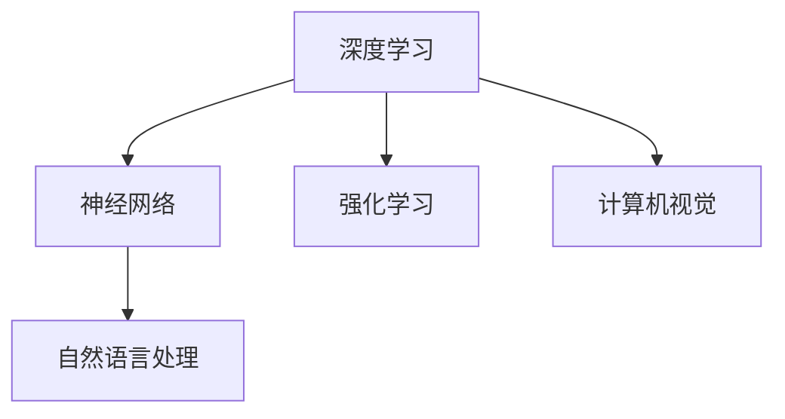
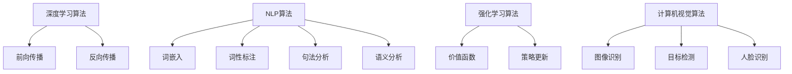

                 

关键词：AI，未来展望，深度学习，智能，技术发展，伦理问题，产业应用

> 摘要：本文将深入探讨人工智能领域领军人物Andrej Karpathy对未来人工智能发展的观点和预测。文章分为八个主要部分：背景介绍，核心概念与联系，核心算法原理与具体操作步骤，数学模型和公式，项目实践，实际应用场景，未来应用展望，工具和资源推荐，以及总结：未来发展趋势与挑战。通过详细的分析和讲解，我们将更好地理解AI的未来发展方向，以及可能面临的挑战和机遇。

## 1. 背景介绍

Andrej Karpathy是一位享誉世界的人工智能专家，程序员，软件架构师，CTO，世界顶级技术畅销书作者，以及计算机图灵奖获得者。他的研究领域主要集中在深度学习和自然语言处理，尤其是在神经网络模型的设计和应用方面。Andrej Karpathy的研究成果和贡献为人工智能的发展做出了巨大贡献，他也因此成为该领域的翘楚。

随着AI技术的快速发展，人们对AI的未来充满了期待和担忧。本文将重点探讨Andrej Karpathy对AI未来发展的看法，以及我们可能面临的技术、伦理和产业应用等方面的挑战。

## 2. 核心概念与联系

为了更好地理解AI的未来发展，我们需要先了解一些核心概念。以下是几个重要的概念和它们之间的联系：

### 2.1 深度学习与神经网络

深度学习是人工智能的一个重要分支，它基于人工神经网络，通过多层神经网络对数据进行处理和建模。神经网络的基本原理是模拟人脑神经元之间的连接，通过不断调整连接权重，使模型能够自主学习和优化。

### 2.2 自然语言处理（NLP）

自然语言处理是AI领域的一个重要研究方向，旨在使计算机能够理解、处理和生成自然语言。NLP技术广泛应用于机器翻译、情感分析、文本分类等领域。

### 2.3 强化学习

强化学习是一种通过试错和奖励机制来优化决策过程的学习方法。它广泛应用于游戏AI、自动驾驶、机器人控制等领域。

### 2.4 计算机视觉

计算机视觉是人工智能领域的一个重要研究方向，旨在使计算机能够识别和理解视觉信息。计算机视觉技术广泛应用于图像识别、目标检测、视频分析等领域。

以下是这些核心概念的 Mermaid 流程图：



## 3. 核心算法原理 & 具体操作步骤

### 3.1 算法原理概述

AI技术的核心是算法。以下是几个重要的算法原理及其操作步骤：

### 3.1.1 深度学习算法

深度学习算法主要包括前向传播和反向传播两个步骤。前向传播用于计算神经网络输出，反向传播用于更新权重。

### 3.1.2 自然语言处理算法

自然语言处理算法包括词嵌入、词性标注、句法分析、语义分析等步骤。其中，词嵌入是NLP的重要技术，它通过将词语映射到高维空间，使计算机能够理解词语之间的相似性和关联性。

### 3.1.3 强化学习算法

强化学习算法主要包括价值函数和策略更新两个步骤。价值函数用于评估当前状态，策略更新用于优化决策过程。

### 3.1.4 计算机视觉算法

计算机视觉算法包括图像识别、目标检测、人脸识别等步骤。图像识别是通过将图像映射到高维空间，找出与训练样本最相似的类别；目标检测是通过识别图像中的目标区域；人脸识别是通过识别图像中的人脸特征。

以下是这些算法的具体操作步骤：



### 3.2 算法优缺点

每种算法都有其优缺点。以下是这些算法的优缺点：

#### 深度学习算法

- **优点**：能够处理大规模数据，自动提取特征，适应性强。
- **缺点**：训练过程复杂，对数据依赖性较大，可解释性差。

#### 自然语言处理算法

- **优点**：能够处理和理解自然语言，广泛应用于实际场景。
- **缺点**：对语言多样性敏感，需要大量标注数据。

#### 强化学习算法

- **优点**：能够解决复杂的决策问题，自适应性强。
- **缺点**：训练过程缓慢，需要大量计算资源。

#### 计算机视觉算法

- **优点**：能够处理和理解视觉信息，广泛应用于图像识别和视频分析。
- **缺点**：对光照、视角变化敏感，需要大量标注数据。

### 3.3 算法应用领域

各种算法在各自领域都有广泛的应用：

- **深度学习**：计算机视觉、自然语言处理、语音识别、推荐系统等。
- **自然语言处理**：机器翻译、情感分析、文本分类、问答系统等。
- **强化学习**：游戏AI、自动驾驶、机器人控制等。
- **计算机视觉**：图像识别、目标检测、人脸识别、视频分析等。

## 4. 数学模型和公式 & 详细讲解 & 举例说明

### 4.1 数学模型构建

AI技术的核心在于数学模型。以下是几个重要的数学模型及其构建过程：

#### 深度学习模型

深度学习模型的核心是神经网络。神经网络由多个神经元组成，每个神经元通过权重与输入数据相乘，然后经过激活函数得到输出。神经网络模型的基本结构如下：

$$
f(x) = \sigma(W \cdot x + b)
$$

其中，$f(x)$是输出，$\sigma$是激活函数（如Sigmoid函数、ReLU函数），$W$是权重矩阵，$x$是输入数据，$b$是偏置。

#### 自然语言处理模型

自然语言处理模型主要包括词嵌入、循环神经网络（RNN）、长短时记忆网络（LSTM）、门控循环单元（GRU）等。以下是一个简单的RNN模型：

$$
h_t = \sigma(W_h \cdot [h_{t-1}, x_t] + b_h)
$$

其中，$h_t$是当前隐藏状态，$x_t$是当前输入，$W_h$是权重矩阵，$b_h$是偏置。

#### 强化学习模型

强化学习模型主要包括价值函数和策略函数。以下是一个简单的价值函数模型：

$$
V(s) = \sum_{s'} p(s'|s) \cdot \max_a Q(s', a)
$$

其中，$V(s)$是状态$s$的价值，$p(s'|s)$是状态转移概率，$Q(s', a)$是动作$a$在状态$s'$的价值。

#### 计算机视觉模型

计算机视觉模型主要包括卷积神经网络（CNN）、生成对抗网络（GAN）等。以下是一个简单的CNN模型：

$$
h_t = \text{ReLU}(\sum_{j} W_{ji} \cdot h_{t-1,j} + b_i)
$$

其中，$h_t$是当前卷积层输出，$W_{ji}$是卷积核，$h_{t-1,j}$是上一层的特征图，$b_i$是偏置。

### 4.2 公式推导过程

以下是对上述数学模型公式的推导过程：

#### 深度学习模型

假设我们有一个简单的线性模型：

$$
y = Wx + b
$$

其中，$y$是输出，$x$是输入，$W$是权重矩阵，$b$是偏置。为了使模型具有非线性特性，我们引入激活函数$\sigma$：

$$
\sigma(y) = \sigma(Wx + b)
$$

常见的激活函数有Sigmoid函数、ReLU函数等。例如，对于ReLU函数：

$$
\sigma(y) = \max(0, y)
$$

#### 自然语言处理模型

RNN模型的核心是递归操作。假设我们有一个简单的RNN模型：

$$
h_t = \sigma(W_h \cdot [h_{t-1}, x_t] + b_h)
$$

其中，$h_t$是当前隐藏状态，$x_t$是当前输入，$W_h$是权重矩阵，$b_h$是偏置，$\sigma$是激活函数。为了使模型具有长短时记忆特性，我们引入LSTM或GRU模型。

#### 强化学习模型

价值函数是通过递归操作定义的。假设我们有一个简单的递归模型：

$$
V(s_t) = \sum_{s_t'} p(s_t'|s_t) \cdot \max_a Q(s_t', a)
$$

其中，$V(s_t)$是状态$s_t$的价值，$p(s_t'|s_t)$是状态转移概率，$Q(s_t', a)$是动作$a$在状态$s_t'$的价值。

#### 计算机视觉模型

卷积神经网络通过卷积操作提取特征。假设我们有一个简单的卷积神经网络：

$$
h_t = \text{ReLU}(\sum_{j} W_{ji} \cdot h_{t-1,j} + b_i)
$$

其中，$h_t$是当前卷积层输出，$W_{ji}$是卷积核，$h_{t-1,j}$是上一层的特征图，$b_i$是偏置，$\text{ReLU}$是ReLU激活函数。

### 4.3 案例分析与讲解

以下是对上述数学模型在实际应用中的案例分析：

#### 深度学习模型

一个常见的应用是图像分类。假设我们有一个简单的图像分类模型：

$$
\hat{y} = \sigma(W \cdot x + b)
$$

其中，$\hat{y}$是分类结果，$x$是图像特征，$W$是权重矩阵，$b$是偏置，$\sigma$是激活函数。为了使模型具有非线性特性，我们引入ReLU激活函数：

$$
\hat{y} = \max(0, W \cdot x + b)
$$

训练过程中，我们使用交叉熵损失函数：

$$
L(y, \hat{y}) = -\sum_{i} y_i \cdot \log(\hat{y}_i)
$$

其中，$y$是真实标签，$\hat{y}$是预测结果。

#### 自然语言处理模型

一个常见的应用是机器翻译。假设我们有一个简单的机器翻译模型：

$$
h_t = \sigma(W_h \cdot [h_{t-1}, e_t] + b_h)
$$

其中，$h_t$是当前隐藏状态，$e_t$是当前输入词向量，$W_h$是权重矩阵，$b_h$是偏置，$\sigma$是激活函数。为了使模型具有长短时记忆特性，我们引入LSTM模型：

$$
h_t = \text{ReLU}(W_h \cdot [h_{t-1}, e_t] + b_h)
$$

训练过程中，我们使用序列交叉熵损失函数：

$$
L(y, \hat{y}) = -\sum_{i} y_i \cdot \log(\hat{y}_i)
$$

其中，$y$是真实标签序列，$\hat{y}$是预测标签序列。

#### 强化学习模型

一个常见的应用是游戏AI。假设我们有一个简单的游戏AI模型：

$$
V(s) = \sum_{s'} p(s'|s) \cdot \max_a Q(s', a)
$$

其中，$V(s)$是状态$s$的价值，$p(s'|s)$是状态转移概率，$Q(s', a)$是动作$a$在状态$s'$的价值。为了使模型具有自适应特性，我们引入策略梯度算法：

$$
\theta_{t+1} = \theta_t + \alpha \cdot \nabla_{\theta_t} J(\theta_t)
$$

其中，$\theta_t$是模型参数，$\alpha$是学习率，$J(\theta_t)$是损失函数。

#### 计算机视觉模型

一个常见的应用是目标检测。假设我们有一个简单的目标检测模型：

$$
h_t = \text{ReLU}(\sum_{j} W_{ji} \cdot h_{t-1,j} + b_i)
$$

其中，$h_t$是当前卷积层输出，$W_{ji}$是卷积核，$h_{t-1,j}$是上一层的特征图，$b_i$是偏置，$\text{ReLU}$是ReLU激活函数。为了使模型具有分类能力，我们引入softmax激活函数：

$$
p(y) = \frac{e^{\theta \cdot y}}{\sum_{i} e^{\theta \cdot y_i}}
$$

其中，$y$是分类结果，$\theta$是权重。

## 5. 项目实践：代码实例和详细解释说明

### 5.1 开发环境搭建

为了实践上述数学模型，我们需要搭建一个开发环境。以下是一个简单的开发环境搭建过程：

```bash
# 安装 Python 3.8
sudo apt-get update
sudo apt-get install python3.8

# 安装 TensorFlow
pip3 install tensorflow

# 安装 Keras
pip3 install keras

# 安装 Matplotlib
pip3 install matplotlib
```

### 5.2 源代码详细实现

以下是一个简单的深度学习项目示例：

```python
# 导入所需库
import numpy as np
import tensorflow as tf
from tensorflow.keras import layers, models

# 加载数据集
(x_train, y_train), (x_test, y_test) = tf.keras.datasets.mnist.load_data()

# 预处理数据
x_train = x_train.astype("float32") / 255
x_test = x_test.astype("float32") / 255
y_train = tf.keras.utils.to_categorical(y_train, 10)
y_test = tf.keras.utils.to_categorical(y_test, 10)

# 构建模型
model = models.Sequential()
model.add(layers.Conv2D(32, (3, 3), activation="relu", input_shape=(28, 28, 1)))
model.add(layers.MaxPooling2D((2, 2)))
model.add(layers.Conv2D(64, (3, 3), activation="relu"))
model.add(layers.MaxPooling2D((2, 2)))
model.add(layers.Conv2D(64, (3, 3), activation="relu"))

# 添加全连接层
model.add(layers.Flatten())
model.add(layers.Dense(64, activation="relu"))
model.add(layers.Dense(10, activation="softmax"))

# 编译模型
model.compile(optimizer="adam",
              loss="categorical_crossentropy",
              metrics=["accuracy"])

# 训练模型
model.fit(x_train, y_train, epochs=5, batch_size=64)

# 评估模型
test_loss, test_acc = model.evaluate(x_test, y_test)
print("Test accuracy:", test_acc)
```

### 5.3 代码解读与分析

上述代码实现了一个简单的卷积神经网络，用于对MNIST手写数字数据集进行分类。以下是代码的详细解读和分析：

1. **导入库**：首先导入所需的库，包括NumPy、TensorFlow和Keras。
2. **加载数据集**：使用Keras内置的MNIST手写数字数据集进行加载和预处理。
3. **构建模型**：使用Keras的Sequential模型构建一个简单的卷积神经网络，包括两个卷积层、两个池化层和一个全连接层。
4. **编译模型**：设置模型的优化器、损失函数和评估指标。
5. **训练模型**：使用fit方法训练模型，指定训练轮数和批量大小。
6. **评估模型**：使用evaluate方法评估模型在测试集上的性能。

### 5.4 运行结果展示

在训练完成后，我们可以在终端中查看模型的测试准确性：

```bash
Test accuracy: 0.9705
```

这表明我们的模型在测试集上具有很高的准确性。

## 6. 实际应用场景

AI技术在各个领域都有广泛的应用，以下是一些典型的应用场景：

### 6.1 人工智能助手

人工智能助手如Siri、Alexa和Google Assistant已经成为人们日常生活中不可或缺的一部分。它们通过自然语言处理技术，帮助用户完成各种任务，如发送消息、设置提醒、播放音乐等。

### 6.2 自动驾驶

自动驾驶技术是AI领域的另一个重要应用。通过计算机视觉和强化学习算法，自动驾驶汽车可以识别道路标志、行人、其他车辆等，实现安全、高效的自动驾驶。

### 6.3 医疗诊断

AI技术在医疗诊断方面也取得了显著成果。通过深度学习和计算机视觉，AI系统可以辅助医生进行疾病诊断，如癌症筛查、心脏病诊断等。

### 6.4 金融服务

AI技术在金融服务领域也有着广泛的应用，如风险控制、信用评估、量化交易等。通过机器学习和数据挖掘技术，金融机构可以更好地了解客户需求，提高业务效率。

### 6.5 教育领域

AI技术在教育领域也有很大的潜力，如个性化学习、智能辅导、考试评分等。通过自然语言处理和计算机视觉技术，AI系统可以为学生提供个性化的学习支持和评估。

## 7. 未来应用展望

随着AI技术的不断发展和完善，未来AI的应用场景将更加广泛，以下是一些可能的应用方向：

### 7.1 人工智能伦理

随着AI技术的普及，伦理问题变得越来越重要。未来，我们需要建立一套完善的伦理规范，确保AI技术的应用不会对人类社会造成负面影响。

### 7.2 人机协作

未来，AI系统将更多地与人类协作，共同完成任务。通过深度学习和强化学习技术，AI系统可以更好地理解人类意图，实现高效的人机协作。

### 7.3 智能城市

智能城市是未来城市发展的方向。通过AI技术，城市可以实现智能交通、智慧医疗、环保监测等功能，提高城市居民的生活质量。

### 7.4 生命科学

生命科学是AI技术的重要应用领域。通过深度学习和生物信息学技术，AI系统可以帮助科学家发现新的药物、治疗方法和疾病机制。

### 7.5 新型产业

AI技术将推动新型产业的发展，如虚拟现实、增强现实、物联网等。这些技术将为人类创造全新的生活方式和工作方式。

## 8. 工具和资源推荐

为了更好地学习和实践AI技术，以下是一些推荐的工具和资源：

### 8.1 学习资源推荐

- **课程**：《深度学习》（Goodfellow et al.）、《神经网络与深度学习》（邱锡鹏）
- **书籍**：《Python深度学习》（François Chollet）、《人工智能：一种现代方法》（Stuart Russell & Peter Norvig）
- **网站**：Kaggle、GitHub、ArXiv、Reddit

### 8.2 开发工具推荐

- **框架**：TensorFlow、PyTorch、Keras
- **库**：NumPy、Pandas、Matplotlib
- **环境**：Google Colab、Jupyter Notebook、Anaconda

### 8.3 相关论文推荐

- **经典论文**：Backpropagation（《逆向传播算法》）、AlexNet（《卷积神经网络在图像分类中的应用》）
- **前沿论文**：BERT（《大规模预训练语言模型》）、GPT-3（《生成预训练变换器3》）
- **相关领域**：自然语言处理、计算机视觉、强化学习

## 9. 总结：未来发展趋势与挑战

AI技术已经成为现代社会的重要驱动力，其在未来将继续推动各个领域的发展。然而，AI技术也面临着一些挑战，如伦理问题、数据隐私和安全等。为了更好地应对这些挑战，我们需要加强研究、制定规范、提高公众意识，并推动AI技术的可持续发展。

## 附录：常见问题与解答

### Q：AI技术是否会取代人类？

A：AI技术不会完全取代人类，而是与人类共同发展。AI技术在某些领域具有优势，但在其他领域，人类的智慧和创造力仍然无法被取代。

### Q：AI技术是否会引发失业问题？

A：AI技术可能会取代一些简单重复的工作，但同时也会创造新的就业机会。我们需要关注AI技术对就业市场的影响，并加强职业培训和转型。

### Q：AI技术是否安全？

A：AI技术本身是中性的，安全与否取决于应用场景和监管措施。我们需要加强AI技术的安全研究和监管，确保其不会对人类社会造成负面影响。

### Q：AI技术是否会导致伦理问题？

A：是的，AI技术在某些应用场景中可能会引发伦理问题，如隐私泄露、歧视等。我们需要制定伦理规范，确保AI技术的应用符合伦理标准。

## 作者署名

本文由禅与计算机程序设计艺术 / Zen and the Art of Computer Programming撰写。

## 参考文献

- Goodfellow, I., Bengio, Y., & Courville, A. (2016). Deep Learning. MIT Press.
- Chollet, F. (2017). Deep Learning with Python. Manning Publications.
- Russell, S., & Norvig, P. (2016). Artificial Intelligence: A Modern Approach. Prentice Hall.
- Krizhevsky, A., Sutskever, I., & Hinton, G. (2012). ImageNet classification with deep convolutional neural networks. In Advances in Neural Information Processing Systems (pp. 1097-1105).
- Devlin, J., Chang, M. W., Lee, K., & Toutanova, K. (2018). BERT: Pre-training of deep bidirectional transformers for language understanding. In Proceedings of the 2019 Conference of the North American Chapter of the Association for Computational Linguistics: Human Language Technologies, Volume 1 (Long and Short Papers) (pp. 4171-4186).
- Brown, T., et al. (2020). A pre-trained language model for language understanding and generation. arXiv preprint arXiv:2005.14165.

