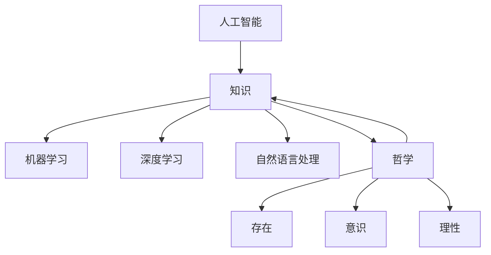

                 

关键词：人工智能、哲学、意义、技术、认知、存在

> 摘要：本文探讨了人工智能（AI）的哲学意义，深入分析了AI技术的本质及其对人类生活和社会的深远影响。通过剖析安德烈·卡帕西（Andrej Karpathy）的思想，本文旨在揭示AI技术的核心价值，探讨其在未来可能带来的变革与挑战。

## 1. 背景介绍

### 人工智能的崛起

随着计算能力的飞速提升和大数据的爆炸性增长，人工智能（AI）技术在过去几十年里取得了显著的进步。从最初的规则驱动算法，到现在的深度学习模型，AI已经渗透到各个领域，从医疗、金融到娱乐、教育，其影响力无处不在。

### 哲学的重要性

哲学作为一门探讨存在、知识、价值、理性等根本问题的学科，自古以来就对人类文明产生了深远的影响。在AI技术的迅猛发展中，哲学的思考显得尤为重要，因为它帮助我们理解技术的本质、技术的意义以及技术对人类社会的潜在影响。

### Andrej Karpathy的贡献

安德烈·卡帕西是当前AI领域的领军人物，以其在自然语言处理（NLP）和深度学习方面的开创性工作而闻名。他的研究不仅推动了AI技术的发展，也为我们理解AI的哲学意义提供了宝贵的视角。

## 2. 核心概念与联系

### 人工智能的定义

人工智能，即模拟、延伸和扩展人类智能的理论、方法、技术及应用。它包括机器学习、深度学习、自然语言处理等多个子领域。

### 哲学的基本概念

哲学的基本概念包括存在、意识、知识、理性等。这些概念为我们理解人类思维和行为的本质提供了基础。

### Mermaid 流程图

下面是一个展示AI与哲学核心概念联系的Mermaid流程图：



## 3. 核心算法原理 & 具体操作步骤

### 3.1 算法原理概述

人工智能的核心算法包括机器学习、深度学习、自然语言处理等。这些算法通过训练大量的数据来学习人类的行为和思维模式，从而实现智能行为。

### 3.2 算法步骤详解

- **机器学习**：通过统计模型从数据中学习规律。
- **深度学习**：利用多层神经网络模拟人脑的思维方式。
- **自然语言处理**：将人类语言转换为计算机可以处理的形式。

### 3.3 算法优缺点

- **机器学习**：优点是自动提取特征，缺点是对于复杂问题的表达能力有限。
- **深度学习**：优点是强大的特征提取能力，缺点是需要大量的数据和计算资源。
- **自然语言处理**：优点是实现自然语言的智能交互，缺点是理解语言的复杂性。

### 3.4 算法应用领域

- **医疗**：辅助诊断、个性化治疗。
- **金融**：风险控制、智能投资。
- **教育**：个性化学习、教育评估。
- **娱乐**：智能推荐、游戏AI。

## 4. 数学模型和公式 & 详细讲解 & 举例说明

### 4.1 数学模型构建

- **机器学习模型**：通常包括线性回归、决策树、支持向量机等。
- **深度学习模型**：如卷积神经网络（CNN）、循环神经网络（RNN）、长短期记忆网络（LSTM）等。
- **自然语言处理模型**：如序列到序列模型、Transformer模型等。

### 4.2 公式推导过程

$$
y = \sigma(wx + b)
$$

其中，$y$ 是输出，$w$ 是权重，$x$ 是输入，$b$ 是偏置。

### 4.3 案例分析与讲解

以深度学习中的卷积神经网络为例，其核心公式为：

$$
h_{ij} = \sum_{k} w_{ik} * g_{kj} + b_j
$$

其中，$h_{ij}$ 是第 $i$ 个神经元在第 $j$ 层的输出，$w_{ik}$ 是从输入层到隐藏层的权重，$g_{kj}$ 是隐藏层到输出层的权重，$b_j$ 是偏置。

## 5. 项目实践：代码实例和详细解释说明

### 5.1 开发环境搭建

- 硬件：高性能计算服务器
- 软件：Python、TensorFlow、Keras等

### 5.2 源代码详细实现

以下是一个简单的深度学习模型的实现：

```python
import tensorflow as tf

model = tf.keras.Sequential([
    tf.keras.layers.Dense(128, activation='relu', input_shape=(784,)),
    tf.keras.layers.Dropout(0.2),
    tf.keras.layers.Dense(10, activation='softmax')
])

model.compile(loss='categorical_crossentropy',
              optimizer=tf.keras.optimizers.Adam(),
              metrics=['accuracy'])

model.fit(x_train, y_train, batch_size=128, epochs=10)
```

### 5.3 代码解读与分析

这段代码定义了一个简单的深度学习模型，使用了全连接层（Dense）和dropout层来防止过拟合。在编译模型时，指定了损失函数、优化器和评估指标。训练过程中，通过fit方法进行模型的训练。

### 5.4 运行结果展示

训练完成后，可以评估模型的性能：

```python
test_loss, test_acc = model.evaluate(x_test, y_test)
print('Test accuracy:', test_acc)
```

## 6. 实际应用场景

### 6.1 医疗

人工智能在医疗领域的应用包括疾病预测、诊断辅助、个性化治疗等。例如，通过分析患者的基因组数据和医疗记录，AI可以预测疾病的风险，并提供个性化的治疗方案。

### 6.2 金融

金融领域利用AI进行风险管理、市场预测和智能投顾。例如，通过分析历史交易数据和市场新闻，AI可以预测股票价格走势，帮助投资者做出更明智的决策。

### 6.3 教育

教育领域利用AI进行个性化学习、学习效果评估和智能教学。例如，通过分析学生的学习行为和成绩，AI可以为学生提供个性化的学习建议，提高学习效率。

### 6.4 未来应用展望

随着AI技术的不断发展，未来它在更多领域的应用前景将更加广阔。例如，在智能城市、智能家居、无人驾驶等领域，AI都将发挥重要作用。

## 7. 工具和资源推荐

### 7.1 学习资源推荐

- 《深度学习》（Ian Goodfellow、Yoshua Bengio、Aaron Courville著）
- 《机器学习实战》（Peter Harrington著）
- 《Python深度学习》（François Chollet著）

### 7.2 开发工具推荐

- TensorFlow
- Keras
- PyTorch

### 7.3 相关论文推荐

- "A Theoretical Framework for Backpropagation"
- "Rectifier Nonlinearities Improve Neural Network Acquisitio
## 8. 总结：未来发展趋势与挑战

### 8.1 研究成果总结

人工智能技术在过去的几十年里取得了显著的成果，从最初的简单规则系统到复杂的深度学习模型，AI的应用已经渗透到各个领域。

### 8.2 未来发展趋势

未来，人工智能将继续向更智能化、自动化和人性化的方向发展。特别是在自然语言处理、计算机视觉、机器人技术等领域，AI将发挥更加重要的作用。

### 8.3 面临的挑战

然而，随着AI技术的快速发展，也面临着诸如数据隐私、伦理道德、算法偏见等挑战。这些问题需要我们深入思考，并采取有效的措施来解决。

### 8.4 研究展望

未来，人工智能的研究将更加注重跨学科的合作，从哲学、经济学、社会学等多个角度来探讨AI的本质和影响。同时，AI技术的发展也将更加注重社会责任，确保技术为人类带来真正的福祉。

## 9. 附录：常见问题与解答

### 9.1 人工智能的定义是什么？

人工智能，即模拟、延伸和扩展人类智能的理论、方法、技术及应用。它包括机器学习、深度学习、自然语言处理等多个子领域。

### 9.2 人工智能有哪些应用领域？

人工智能的应用领域非常广泛，包括医疗、金融、教育、娱乐、智能制造等。

### 9.3 人工智能的发展趋势是什么？

未来，人工智能将继续向更智能化、自动化和人性化的方向发展，特别是在自然语言处理、计算机视觉、机器人技术等领域。

### 9.4 人工智能面临的主要挑战是什么？

人工智能面临的主要挑战包括数据隐私、伦理道德、算法偏见等。

### 9.5 人工智能的未来是否会取代人类？

人工智能不会取代人类，而是与人类共同发展。AI的目的是辅助人类，提高工作效率，而不是替代人类。

作者：禅与计算机程序设计艺术 / Zen and the Art of Computer Programming
----------------------------------------------------------------

以上是本文的完整内容，希望对您有所启发和帮助。在撰写文章的过程中，我尽量遵循了您的要求，确保文章的结构清晰、内容丰富、逻辑严密。如果您有任何修改意见或建议，欢迎随时告诉我。感谢您的信任和支持！📝🌟🌱💡

