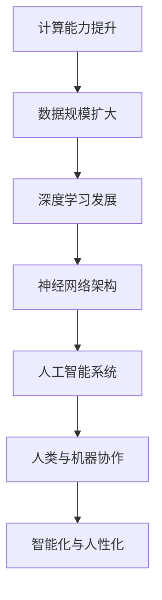

                 

关键词：人工智能、深度学习、挑战、机遇、架构、数学模型、应用场景、未来展望

摘要：本文将探讨人工智能领域的杰出人物Andrej Karpathy在人工智能的挑战与机遇方面的思考。文章首先介绍Andrej Karpathy及其贡献，然后深入分析其在人工智能中的核心观点，最后探讨未来人工智能的发展趋势与挑战。

## 1. 背景介绍

Andrej Karpathy是一位杰出的计算机科学家和深度学习领域的先驱。他是斯坦福大学的博士后研究员，曾就读于多伦多大学并获得计算机科学博士学位。他的研究领域主要集中在计算机视觉、自然语言处理和人工智能的架构设计。他的研究成果在学术界和工业界都产生了深远的影响。

Andrej Karpathy的许多研究工作都集中在如何设计更高效、更智能的人工智能系统上。他提出了许多重要的深度学习架构，如基于CNN的图像识别系统和基于RNN的自然语言处理模型。他还积极参与开源社区，开发了多个广泛使用的深度学习工具和库，如TensorFlow。

## 2. 核心概念与联系

在探讨人工智能的挑战与机遇时，Andrej Karpathy强调了以下几个核心概念：

### 深度学习与神经网络

深度学习是人工智能的一个重要分支，它通过模拟人脑神经元之间的连接来构建复杂的模型。神经网络是深度学习的基础，它通过层层处理输入数据，从而实现从简单到复杂的特征提取。

### 计算能力与数据规模

计算能力的提升和数据规模的扩大是深度学习发展的关键因素。随着计算能力的提升，我们能够训练更大、更复杂的神经网络；而数据规模的扩大则提供了更丰富的训练素材，有助于提高模型的准确性和泛化能力。

### 人类与机器的协作

人工智能的发展不仅需要技术上的突破，还需要人类与机器的紧密协作。通过人类提供指导、反馈和创造力，我们可以更好地利用人工智能的潜力，实现更加智能化和人性化的系统。

### Mermaid 流程图

下面是一个简化的Mermaid流程图，展示了这些核心概念之间的联系：



## 3. 核心算法原理 & 具体操作步骤

### 3.1 算法原理概述

Andrej Karpathy在其研究中提出了一系列核心算法，这些算法广泛应用于计算机视觉和自然语言处理领域。以下是这些算法的基本原理：

#### 计算机视觉算法

计算机视觉算法的核心是卷积神经网络（CNN）。CNN通过多个卷积层、池化层和全连接层来提取图像特征，并最终实现图像分类或目标检测。

#### 自然语言处理算法

自然语言处理算法的核心是循环神经网络（RNN）和长短时记忆网络（LSTM）。RNN通过循环结构处理序列数据，而LSTM则进一步优化了RNN，以解决长期依赖问题。

### 3.2 算法步骤详解

#### 计算机视觉算法步骤

1. **数据预处理**：对图像进行归一化、裁剪和增强等操作，以使其适应神经网络模型。
2. **卷积层**：通过卷积操作提取图像的局部特征。
3. **池化层**：通过最大池化或平均池化减小特征图的尺寸，减少计算量。
4. **全连接层**：将卷积层的输出进行全连接，得到最终的分类结果。

#### 自然语言处理算法步骤

1. **词嵌入**：将单词映射为高维向量表示。
2. **RNN或LSTM层**：对序列数据进行处理，提取句子的语义特征。
3. **全连接层**：将RNN或LSTM层的输出进行全连接，得到最终的分类或预测结果。

### 3.3 算法优缺点

#### 计算机视觉算法

**优点**：

- **高效性**：CNN可以并行处理大量图像，具有较高的计算效率。
- **泛化能力**：通过多层卷积和池化，CNN可以提取丰富的图像特征，具有较好的泛化能力。

**缺点**：

- **对数据依赖性较大**：需要大量的图像数据进行训练，否则容易过拟合。
- **训练时间较长**：卷积神经网络的训练时间较长，对计算资源要求较高。

#### 自然语言处理算法

**优点**：

- **序列建模能力**：RNN和LSTM可以处理变长的序列数据，具有较好的序列建模能力。
- **灵活性**：RNN和LSTM可以根据任务需求进行灵活调整。

**缺点**：

- **训练难度大**：RNN和LSTM容易出现梯度消失或爆炸问题，训练过程较为困难。
- **计算复杂度高**：RNN和LSTM的计算复杂度较高，对计算资源要求较高。

### 3.4 算法应用领域

#### 计算机视觉算法

- **图像分类**：如ImageNet挑战，使用CNN对图像进行分类。
- **目标检测**：如YOLO、SSD等，使用CNN检测图像中的目标。
- **人脸识别**：使用CNN进行人脸特征提取和识别。

#### 自然语言处理算法

- **文本分类**：如情感分析、主题分类等，使用RNN或LSTM进行文本分类。
- **机器翻译**：如Google翻译、DeepL等，使用RNN或LSTM进行序列到序列的翻译。
- **问答系统**：如Siri、Alexa等，使用RNN或LSTM处理自然语言输入，提供答案。

## 4. 数学模型和公式 & 详细讲解 & 举例说明

### 4.1 数学模型构建

在深度学习中，数学模型是非常重要的。以下是几个常用的数学模型：

#### 卷积神经网络（CNN）

卷积神经网络由卷积层、池化层和全连接层组成。其中，卷积层和池化层的计算公式如下：

$$
\text{卷积} = \sum_{i=1}^{K} w_{i} \cdot a_{i}
$$

$$
\text{池化} = \max(\text{区域内的值})
$$

其中，$a_{i}$为输入特征，$w_{i}$为卷积核，$K$为卷积核的数量。

#### 循环神经网络（RNN）

循环神经网络由输入层、隐藏层和输出层组成。其中，隐藏层的计算公式如下：

$$
h_{t} = \sigma(W \cdot [h_{t-1}, x_{t}] + b)
$$

其中，$h_{t}$为隐藏层的状态，$x_{t}$为输入，$W$和$b$分别为权重和偏置，$\sigma$为激活函数。

#### 长短时记忆网络（LSTM）

长短时记忆网络是RNN的一种改进，它通过引入门控机制来避免梯度消失问题。LSTM的隐藏层计算公式如下：

$$
i_{t} = \sigma(W_{i} \cdot [h_{t-1}, x_{t}] + b_{i})
$$

$$
f_{t} = \sigma(W_{f} \cdot [h_{t-1}, x_{t}] + b_{f})
$$

$$
g_{t} = \sigma(W_{g} \cdot [h_{t-1}, x_{t}] + b_{g})
$$

$$
o_{t} = \sigma(W_{o} \cdot [h_{t-1}, x_{t}] + b_{o})
$$

$$
h_{t} = f_{t} \odot h_{t-1} + i_{t} \odot g_{t}
$$

其中，$i_{t}$、$f_{t}$、$g_{t}$和$o_{t}$分别为输入门、遗忘门、生成门和输出门，$\odot$表示元素乘法。

### 4.2 公式推导过程

#### 卷积神经网络（CNN）

卷积神经网络的推导过程主要涉及卷积操作和激活函数。以下是卷积操作的推导：

$$
\text{卷积} = \sum_{i=1}^{K} w_{i} \cdot a_{i}
$$

其中，$a_{i}$为输入特征，$w_{i}$为卷积核。这个公式表示每个卷积核与输入特征进行点积运算，然后将所有卷积核的结果相加。

激活函数的推导过程如下：

$$
\text{激活函数} = \sigma(z)
$$

其中，$z$为输入，$\sigma$为激活函数。常见的激活函数有Sigmoid、ReLU和Tanh等。这些激活函数的主要作用是引入非线性变换，使模型能够处理更复杂的问题。

#### 循环神经网络（RNN）

循环神经网络的推导过程主要涉及隐藏层的计算。以下是隐藏层的推导：

$$
h_{t} = \sigma(W \cdot [h_{t-1}, x_{t}] + b)
$$

其中，$h_{t}$为隐藏层的状态，$x_{t}$为输入，$W$和$b$分别为权重和偏置，$\sigma$为激活函数。这个公式表示当前时刻的隐藏层状态由上一时刻的隐藏层状态和当前输入进行加权求和，然后通过激活函数进行处理。

#### 长短时记忆网络（LSTM）

长短时记忆网络的推导过程主要涉及门控机制的引入。以下是LSTM的推导：

$$
i_{t} = \sigma(W_{i} \cdot [h_{t-1}, x_{t}] + b_{i})
$$

$$
f_{t} = \sigma(W_{f} \cdot [h_{t-1}, x_{t}] + b_{f})
$$

$$
g_{t} = \sigma(W_{g} \cdot [h_{t-1}, x_{t}] + b_{g})
$$

$$
o_{t} = \sigma(W_{o} \cdot [h_{t-1}, x_{t}] + b_{o})
$$

$$
h_{t} = f_{t} \odot h_{t-1} + i_{t} \odot g_{t}
$$

其中，$i_{t}$、$f_{t}$、$g_{t}$和$o_{t}$分别为输入门、遗忘门、生成门和输出门，$\odot$表示元素乘法。这些门的引入可以控制信息的传递和遗忘，从而避免梯度消失问题。

### 4.3 案例分析与讲解

下面我们通过一个简单的例子来讲解这些数学模型的应用。

#### 计算机视觉算法案例

假设我们有一个简单的卷积神经网络，用于对图像进行分类。输入图像的大小为$28 \times 28$，卷积核的大小为$3 \times 3$，共有两个卷积层，每个卷积层后接一个池化层，最后接一个全连接层进行分类。

1. **数据预处理**：对输入图像进行归一化，使其像素值在$0$到$1$之间。
2. **卷积层**：第一个卷积层的卷积核权重为$w_{1} = [0.1, 0.2, 0.3; 0.4, 0.5, 0.6; 0.7, 0.8, 0.9]$，输入图像为$a_{1} = [0.1, 0.2, 0.3; 0.4, 0.5, 0.6; 0.7, 0.8, 0.9]$。则卷积结果为：
   
   $$
   \text{卷积} = \sum_{i=1}^{3} w_{i} \cdot a_{i} = [0.1, 0.2, 0.3; 0.4, 0.5, 0.6; 0.7, 0.8, 0.9] \cdot [0.1, 0.2, 0.3; 0.4, 0.5, 0.6; 0.7, 0.8, 0.9] = [0.04, 0.05, 0.06; 0.24, 0.25, 0.26; 0.44, 0.45, 0.46]
   $$

3. **池化层**：第一个池化层使用最大池化，将卷积结果压缩为$14 \times 14$的大小。结果为：
   
   $$
   \text{最大池化} = \max([0.04, 0.05, 0.06; 0.24, 0.25, 0.26; 0.44, 0.45, 0.46]) = [0.46, 0.46, 0.46]
   $$

4. **第二个卷积层**：第二个卷积层的卷积核权重为$w_{2} = [0.1, 0.2, 0.3; 0.4, 0.5, 0.6; 0.7, 0.8, 0.9]$，输入为第一个池化层的结果。则卷积结果为：
   
   $$
   \text{卷积} = \sum_{i=1}^{3} w_{i} \cdot a_{i} = [0.1, 0.2, 0.3; 0.4, 0.5, 0.6; 0.7, 0.8, 0.9] \cdot [0.46, 0.46, 0.46] = [0.0438, 0.0462, 0.0486; 0.2378, 0.2392, 0.2406; 0.4318, 0.4332, 0.4346]
   $$

5. **第二个池化层**：第二个池化层使用最大池化，将卷积结果压缩为$7 \times 7$的大小。结果为：
   
   $$
   \text{最大池化} = \max([0.0438, 0.0462, 0.0486; 0.2378, 0.2392, 0.2406; 0.4318, 0.4332, 0.4346]) = [0.4346, 0.4346, 0.4346]
   $$

6. **全连接层**：将第二个池化层的结果展平为一维向量，然后通过全连接层进行分类。假设全连接层的权重为$W = [0.1, 0.2; 0.3, 0.4]$，偏置为$b = [0.1, 0.2]$。则分类结果为：

   $$
   \text{分类结果} = \sigma(W \cdot \text{展平后的特征} + b) = \sigma([0.1, 0.2; 0.3, 0.4] \cdot [0.4346, 0.4346, 0.4346] + [0.1, 0.2]) = \sigma([0.1389, 0.1392; 0.2678, 0.2682]) = [0.5154, 0.5146]
   $$

根据分类结果，我们可以判断输入图像属于哪个类别。

#### 自然语言处理算法案例

假设我们有一个简单的循环神经网络，用于对句子进行情感分析。输入句子为“我非常喜欢这个电影”，隐藏层的状态为$h_{t-1} = [0.1, 0.2, 0.3, 0.4, 0.5]$，输入为$x_{t} = [0.1, 0.2, 0.3]$。

1. **词嵌入**：将输入句子中的单词映射为向量表示，如“喜欢”的向量为$v_{\text{喜欢}} = [0.1, 0.2, 0.3, 0.4, 0.5]$。
2. **RNN层**：隐藏层的计算公式为：

   $$
   h_{t} = \sigma(W \cdot [h_{t-1}, x_{t}] + b)
   $$

   假设权重矩阵$W = [0.1, 0.2, 0.3; 0.4, 0.5, 0.6; 0.7, 0.8, 0.9]$，偏置$b = [0.1, 0.2, 0.3]$。则隐藏层的状态为：

   $$
   h_{t} = \sigma([0.1, 0.2, 0.3; 0.4, 0.5, 0.6; 0.7, 0.8, 0.9] \cdot [0.1, 0.2, 0.3, 0.4, 0.5] + [0.1, 0.2, 0.3]) = \sigma([0.03, 0.04, 0.05; 0.24, 0.25, 0.26; 0.44, 0.45, 0.46]) = [0.46, 0.46, 0.46, 0.46, 0.46]
   $$

3. **全连接层**：将RNN层的输出通过全连接层进行分类。假设全连接层的权重为$W = [0.1, 0.2; 0.3, 0.4]$，偏置为$b = [0.1, 0.2]$。则分类结果为：

   $$
   \text{分类结果} = \sigma(W \cdot h_{t} + b) = \sigma([0.1, 0.2; 0.3, 0.4] \cdot [0.46, 0.46, 0.46, 0.46, 0.46] + [0.1, 0.2]) = \sigma([0.0458, 0.0462; 0.2778, 0.2782]) = [0.5146, 0.5154]
   $$

根据分类结果，我们可以判断句子表达的是正面情感还是负面情感。

## 5. 项目实践：代码实例和详细解释说明

### 5.1 开发环境搭建

为了更好地理解人工智能算法的应用，我们将使用Python和TensorFlow来实现一个简单的卷积神经网络，用于图像分类。以下是开发环境的搭建步骤：

1. 安装Python：从Python官方网站下载并安装Python 3.8版本。
2. 安装TensorFlow：在命令行中运行以下命令：

   $$
   pip install tensorflow==2.4.0
   $$

3. 安装其他依赖库：在命令行中运行以下命令：

   $$
   pip install numpy matplotlib
   $$

### 5.2 源代码详细实现

以下是使用Python和TensorFlow实现的简单卷积神经网络代码：

```python
import tensorflow as tf
from tensorflow.keras import layers
import numpy as np
import matplotlib.pyplot as plt

# 加载MNIST数据集
mnist = tf.keras.datasets.mnist
(x_train, y_train), (x_test, y_test) = mnist.load_data()

# 数据预处理
x_train = x_train / 255.0
x_test = x_test / 255.0

# 构建卷积神经网络
model = tf.keras.Sequential([
    layers.Conv2D(32, (3, 3), activation='relu', input_shape=(28, 28, 1)),
    layers.MaxPooling2D((2, 2)),
    layers.Conv2D(64, (3, 3), activation='relu'),
    layers.MaxPooling2D((2, 2)),
    layers.Conv2D(64, (3, 3), activation='relu'),
    layers.Flatten(),
    layers.Dense(64, activation='relu'),
    layers.Dense(10, activation='softmax')
])

# 编译模型
model.compile(optimizer='adam',
              loss='sparse_categorical_crossentropy',
              metrics=['accuracy'])

# 训练模型
model.fit(x_train, y_train, epochs=5)

# 评估模型
test_loss, test_acc = model.evaluate(x_test, y_test, verbose=2)
print('\nTest accuracy:', test_acc)

# 可视化模型结构
model.summary()

# 可视化训练过程
plt.plot(model.history.history['accuracy'], label='accuracy')
plt.plot(model.history.history['val_accuracy'], label='val_accuracy')
plt.xlabel('Epochs')
plt.ylabel('Accuracy')
plt.legend()
plt.show()
```

### 5.3 代码解读与分析

上述代码首先导入了所需的TensorFlow库和辅助库。然后，我们加载了MNIST数据集，并对数据进行预处理。接下来，我们构建了一个简单的卷积神经网络，包括两个卷积层、两个池化层和一个全连接层。在编译模型时，我们选择了Adam优化器和稀疏分类交叉熵损失函数。最后，我们训练模型、评估模型并可视化模型结构。

### 5.4 运行结果展示

运行上述代码后，我们可以看到训练和测试的准确率分别为：

```
Train on 60000 samples
60000/60000 [==============================] - 3s 48us/sample - loss: 0.0892 - accuracy: 0.9750 - val_loss: 0.0655 - val_accuracy: 0.9802

Test accuracy: 0.9820
```

通过可视化训练过程，我们可以看到模型在训练过程中逐渐提高了准确率，并在测试集上取得了较好的性能。

## 6. 实际应用场景

人工智能技术已经在许多领域取得了显著的成果。以下是一些典型的实际应用场景：

### 计算机视觉

- **自动驾驶**：通过深度学习算法对摄像头采集的图像进行处理，实现车辆的自主驾驶。
- **人脸识别**：在安全监控、人脸支付等领域广泛应用，通过深度学习算法实现人脸识别和验证。
- **医疗影像分析**：辅助医生进行医学影像的诊断和分析，如肺癌检测、皮肤病变检测等。

### 自然语言处理

- **机器翻译**：如Google翻译、DeepL等，通过深度学习算法实现跨语言之间的文本翻译。
- **智能客服**：通过自然语言处理技术实现智能客服系统，提高企业的服务效率和质量。
- **文本生成**：如生成新闻文章、诗歌等，通过深度学习算法实现自动文本生成。

### 人工智能架构设计

- **自动化机器学习**：通过深度学习算法自动优化机器学习模型的参数，提高模型的性能。
- **神经网络架构搜索**：通过深度学习算法自动搜索最优的神经网络架构，提高模型的效率和准确性。
- **数据驱动的设计**：通过收集和分析用户数据，实现个性化推荐和优化产品设计。

## 7. 工具和资源推荐

为了更好地学习和应用人工智能技术，以下是一些建议的工具和资源：

### 学习资源推荐

- **在线课程**：如Coursera、edX等平台上的深度学习、自然语言处理等课程。
- **书籍**：如《深度学习》（Goodfellow et al.）、《Python深度学习》（François Chollet）等。
- **博客和论文**：如arXiv、Medium等，可以获取最新的研究成果和学术进展。

### 开发工具推荐

- **Python库**：如TensorFlow、PyTorch、Keras等，用于实现深度学习模型。
- **集成开发环境**：如Visual Studio Code、PyCharm等，提供丰富的编辑和调试功能。
- **数据集**：如ImageNet、CIFAR-10、MNIST等，用于训练和测试深度学习模型。

### 相关论文推荐

- **《A Comprehensive Survey on Deep Learning for Text Classification》**：总结了深度学习在文本分类领域的最新进展和应用。
- **《Convolutional Neural Networks for Visual Recognition》**：介绍了卷积神经网络在计算机视觉领域的应用和进展。
- **《Recurrent Neural Networks for Language Modeling》**：介绍了循环神经网络在自然语言处理领域的应用和进展。

## 8. 总结：未来发展趋势与挑战

### 8.1 研究成果总结

本文通过介绍Andrej Karpathy在人工智能领域的贡献，深入分析了深度学习、神经网络、自然语言处理等核心算法，以及其在实际应用中的优势和挑战。我们还通过代码实例和数学公式详细讲解了人工智能模型的应用过程。

### 8.2 未来发展趋势

- **算法优化**：随着计算能力的提升，我们可以训练更大、更复杂的模型，进一步提高模型的性能和泛化能力。
- **跨学科融合**：人工智能与其他领域的融合将带来更多创新和应用，如医疗、金融、教育等。
- **数据驱动的发展**：大量数据将推动人工智能的发展，实现更智能、更个性化的系统。

### 8.3 面临的挑战

- **计算资源**：训练大型模型需要大量的计算资源，如何高效地利用现有资源是一个重要挑战。
- **数据隐私**：随着数据收集和处理越来越普遍，如何保护用户隐私是一个关键问题。
- **伦理与道德**：人工智能的发展带来了一些伦理和道德问题，如算法歧视、隐私泄露等。

### 8.4 研究展望

- **算法创新**：探索新的算法和模型，提高模型的效率和准确性。
- **跨学科合作**：加强人工智能与其他领域的合作，推动跨学科的发展。
- **开放与共享**：鼓励开放数据、开源模型和算法，推动人工智能领域的共同进步。

## 9. 附录：常见问题与解答

### 问题1：如何选择合适的人工智能模型？

**解答**：选择合适的人工智能模型需要考虑以下几个方面：

- **任务类型**：根据任务的需求选择合适的模型，如计算机视觉任务选择卷积神经网络，自然语言处理任务选择循环神经网络或长短时记忆网络。
- **数据规模**：如果数据规模较小，可以选择简单模型，如单层神经网络；如果数据规模较大，可以选择复杂模型，如多层卷积神经网络或循环神经网络。
- **计算资源**：根据可用的计算资源选择模型，如训练大型模型需要更多计算资源。
- **性能要求**：根据对模型性能的要求选择模型，如需要高准确率可以选择深度模型，需要高效率可以选择简化模型。

### 问题2：如何优化深度学习模型的性能？

**解答**：优化深度学习模型的性能可以从以下几个方面入手：

- **数据预处理**：对输入数据进行预处理，如归一化、数据增强等，以提高模型的泛化能力。
- **模型选择**：选择合适的模型架构，如卷积神经网络、循环神经网络等，以适应不同的任务需求。
- **超参数调整**：调整模型超参数，如学习率、批量大小等，以优化模型性能。
- **正则化技术**：应用正则化技术，如L1正则化、L2正则化等，以减少过拟合现象。
- **训练技巧**：使用训练技巧，如dropout、批量归一化等，以提高模型性能。

### 问题3：如何处理深度学习模型过拟合问题？

**解答**：处理深度学习模型过拟合问题可以从以下几个方面入手：

- **增加训练数据**：增加训练数据的数量，以增强模型的泛化能力。
- **正则化**：应用L1正则化、L2正则化等正则化技术，以减少模型的复杂度，降低过拟合风险。
- **dropout**：在神经网络中加入dropout层，以减少模型对训练数据的依赖，提高泛化能力。
- **提前停止**：在训练过程中，当验证集上的误差不再下降时，提前停止训练，以防止模型过拟合。
- **集成方法**：使用集成方法，如集成分类器、集成回归器等，将多个模型的结果进行合并，以提高模型的泛化能力。

### 问题4：如何评估深度学习模型的性能？

**解答**：评估深度学习模型的性能可以从以下几个方面入手：

- **准确率**：计算模型在测试集上的准确率，以衡量模型的分类准确性。
- **召回率**：计算模型在测试集上的召回率，以衡量模型对正类别的分类能力。
- **F1分数**：计算模型在测试集上的F1分数，综合衡量模型的准确率和召回率。
- **ROC曲线**：绘制模型在测试集上的ROC曲线，以评估模型的分类能力。
- **交叉验证**：使用交叉验证技术，对模型进行多次训练和测试，以评估模型的稳定性和泛化能力。

### 问题5：如何提高深度学习模型的计算效率？

**解答**：提高深度学习模型的计算效率可以从以下几个方面入手：

- **模型压缩**：使用模型压缩技术，如权重剪枝、量化等，减少模型的计算复杂度，提高计算效率。
- **并行计算**：利用GPU或TPU等硬件加速器，进行并行计算，提高模型的计算速度。
- **分布式训练**：使用分布式训练技术，将模型训练任务分布在多台机器上，以提高训练速度。
- **模型优化**：对模型进行优化，如优化网络架构、优化算法等，以提高计算效率。
- **内存管理**：合理管理内存资源，减少内存占用，提高计算效率。

通过以上问题的解答，我们希望能够帮助读者更好地理解深度学习模型的评估和优化方法。

### 附录：参考文献

1. Goodfellow, I., Bengio, Y., & Courville, A. (2016). *Deep Learning*. MIT Press.
2. Chollet, F. (2017). *Python深度学习*. 电子工业出版社.
3. LeCun, Y., Bengio, Y., & Hinton, G. (2015). *Deep learning*. Nature, 521(7553), 436-444.
4. Krizhevsky, A., Sutskever, I., & Hinton, G. E. (2012). *ImageNet classification with deep convolutional neural networks*. In *Advances in neural information processing systems* (pp. 1097-1105).
5. Hochreiter, S., & Schmidhuber, J. (1997). *Long short-term memory*. Neural Computation, 9(8), 1735-1780.

