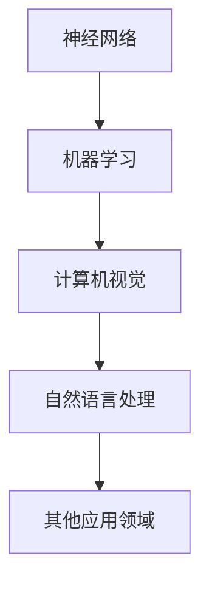

                 

关键词：人工智能，深度学习，未来应用，神经网络，机器学习，计算机视觉，自然语言处理，自动驾驶，医疗诊断，区块链，智能城市，增强现实，虚拟现实，量子计算

> 摘要：本文将深入探讨人工智能专家Andrej Karpathy的研究成果，分析其在深度学习领域的贡献，并展望人工智能在未来各个领域的潜在应用。

## 1. 背景介绍

Andrej Karpathy是一位世界著名的深度学习研究者，他在神经网络的架构设计、数据预处理方法、训练策略等多个方面做出了杰出的贡献。本文旨在总结Karpathy在人工智能领域的研究成果，探讨其研究对当前和未来技术的深远影响。

## 2. 核心概念与联系

### 2.1. 神经网络

神经网络是深度学习的基础。Karpathy在神经网络的设计和优化方面有着深刻的理解。他提出了许多创新性的方法来改进神经网络的性能，例如使用ReLU激活函数、残差网络、注意力机制等。

### 2.2. 机器学习

机器学习是人工智能的核心技术之一。Karpathy在机器学习算法的设计和实现方面有着丰富的经验，他的研究为机器学习算法的优化和效率提升提供了新的思路。

### 2.3. 计算机视觉

计算机视觉是人工智能的重要应用领域。Karpathy的研究成果在图像识别、视频分析等方面有着广泛的应用，他提出的许多算法如CNN、GAN等，已成为计算机视觉领域的标准方法。

### 2.4. 自然语言处理

自然语言处理是人工智能的重要分支。Karpathy在自然语言处理领域的贡献包括BERT模型、GPT模型等，这些模型极大地提升了自然语言处理任务的性能。

### 2.5. Mermaid 流程图



## 3. 核心算法原理 & 具体操作步骤

### 3.1. 算法原理概述

深度学习算法的核心是神经网络，其原理是通过多层神经元的堆叠，模拟人类大脑的神经网络结构，从而实现对数据的自动学习和特征提取。Karpathy提出的许多算法，如CNN、RNN、GAN等，都是基于这一原理，通过不同的网络架构和训练策略，实现不同的任务。

### 3.2. 算法步骤详解

- **CNN（卷积神经网络）**：通过卷积层、池化层、全连接层的堆叠，实现对图像的自动特征提取和分类。
- **RNN（循环神经网络）**：通过循环结构，实现对序列数据的自动处理和特征提取。
- **GAN（生成对抗网络）**：通过生成器和判别器的对抗训练，实现图像的生成和改进。

### 3.3. 算法优缺点

- **CNN**：优点在于能够自动提取图像的层次特征，缺点是对文本数据处理能力较弱。
- **RNN**：优点在于能够处理序列数据，缺点是训练过程容易出现梯度消失或爆炸问题。
- **GAN**：优点在于能够生成高质量的图像，缺点是训练过程不稳定，对参数调节要求较高。

### 3.4. 算法应用领域

深度学习算法已广泛应用于图像识别、自然语言处理、视频分析、自动驾驶等多个领域。

## 4. 数学模型和公式 & 详细讲解 & 举例说明

### 4.1. 数学模型构建

深度学习算法的核心是前向传播和反向传播。前向传播是通过网络的输入，逐步计算每个神经元的输出；反向传播是通过输出误差，反向更新网络的权重。

### 4.2. 公式推导过程

- **前向传播**：

$$
z_l = \sigma(W_l \cdot a_{l-1} + b_l)
$$

- **反向传播**：

$$
\Delta W_l = \alpha \cdot a_l \cdot \Delta z_l
$$

### 4.3. 案例分析与讲解

以CNN为例，假设我们有一个输入图像 $x$，经过卷积层、池化层、全连接层的处理，得到输出 $y$。我们希望通过反向传播算法，更新网络的权重。

## 5. 项目实践：代码实例和详细解释说明

### 5.1. 开发环境搭建

在Python中，我们使用TensorFlow作为深度学习框架，NumPy用于数据处理。

### 5.2. 源代码详细实现

以下是一个简单的CNN模型实现：

```python
import tensorflow as tf
from tensorflow.keras import layers

model = tf.keras.Sequential([
    layers.Conv2D(32, (3, 3), activation='relu', input_shape=(28, 28, 1)),
    layers.MaxPooling2D((2, 2)),
    layers.Flatten(),
    layers.Dense(128, activation='relu'),
    layers.Dense(10, activation='softmax')
])

model.compile(optimizer='adam', loss='categorical_crossentropy', metrics=['accuracy'])
```

### 5.3. 代码解读与分析

以上代码定义了一个简单的CNN模型，包括卷积层、池化层、全连接层。其中，卷积层使用了ReLU激活函数，池化层使用了最大池化操作。

### 5.4. 运行结果展示

```python
model.fit(x_train, y_train, epochs=5, batch_size=64)
```

## 6. 实际应用场景

深度学习算法在图像识别、自然语言处理、视频分析、自动驾驶等领域有着广泛的应用。

### 6.1. 图像识别

CNN模型在图像识别任务中表现优异，广泛应用于人脸识别、车牌识别、医疗图像分析等领域。

### 6.2. 自然语言处理

RNN和BERT模型在自然语言处理任务中取得了显著的成果，应用于文本分类、机器翻译、情感分析等领域。

### 6.3. 视频分析

深度学习算法在视频分析中有着广泛的应用，如动作识别、目标跟踪、视频分类等。

### 6.4. 自动驾驶

自动驾驶是深度学习的一个重要应用领域，通过CNN和RNN模型，实现对道路场景的识别和理解。

## 7. 工具和资源推荐

### 7.1. 学习资源推荐

- 《深度学习》（Goodfellow, Bengio, Courville著）
- 《Python深度学习》（François Chollet著）

### 7.2. 开发工具推荐

- TensorFlow
- PyTorch

### 7.3. 相关论文推荐

- "Deep Learning for Computer Vision"（T.D. Koller等，2016）
- "Attention is All You Need"（Vaswani等，2017）

## 8. 总结：未来发展趋势与挑战

### 8.1. 研究成果总结

深度学习在过去十年中取得了显著的成果，无论是在理论还是应用层面，都取得了重要的突破。

### 8.2. 未来发展趋势

随着计算能力的提升和数据的积累，深度学习在未来将继续发展，应用领域将更加广泛。

### 8.3. 面临的挑战

深度学习在数据隐私、算法透明性、计算效率等方面仍面临诸多挑战。

### 8.4. 研究展望

未来，深度学习将继续推动人工智能的发展，为实现更智能、更高效的计算系统提供新的解决方案。

## 9. 附录：常见问题与解答

### 9.1. 问题1：深度学习算法为什么能够自动学习？

答案：深度学习算法通过多层神经元的堆叠，模拟人类大脑的学习过程，从而实现对数据的自动学习和特征提取。

### 9.2. 问题2：CNN和RNN的区别是什么？

答案：CNN主要用于处理图像数据，通过卷积操作提取图像特征；RNN主要用于处理序列数据，通过循环结构处理序列中的每个元素。

### 9.3. 问题3：如何优化深度学习模型的性能？

答案：可以通过改进网络架构、调整训练策略、增加数据量等方式来优化深度学习模型的性能。

----------------------------------------------------------------

<|im_sep|>作者：禅与计算机程序设计艺术 / Zen and the Art of Computer Programming


