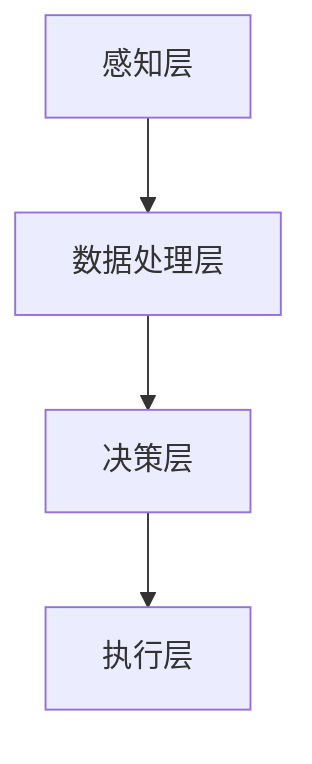

                 

关键词：人工智能，未来挑战，技术发展，算法创新，应用前景

> 摘要：本文将深入探讨人工智能（AI）领域面临的未来挑战。从核心概念、算法原理到实际应用场景，我们将详细解析AI技术发展过程中的关键问题，并展望其未来发展趋势与挑战。本文旨在为广大AI技术爱好者、研究者提供有价值的参考，以激发对这一领域的深入思考和研究。

## 1. 背景介绍

随着计算机技术的发展，人工智能（AI）已经成为当今科技领域最具前瞻性的方向之一。从早期的专家系统到如今的深度学习，AI技术经历了巨大的变革。如今，AI在图像识别、自然语言处理、机器翻译、自动驾驶等领域取得了显著成果。然而，随着技术的不断发展，我们也面临着一系列新的挑战和问题。

本文将围绕以下核心问题展开讨论：

1. **AI核心概念与架构**：我们将梳理AI的核心概念，并使用Mermaid流程图展示其架构。
2. **核心算法原理与操作步骤**：我们将深入探讨AI的核心算法原理，并提供详细的操作步骤。
3. **数学模型与公式推导**：我们将介绍AI中的数学模型，并进行公式推导和案例分析。
4. **项目实践与代码实例**：我们将通过一个具体项目展示AI技术的实际应用，并提供详细的代码解读。
5. **实际应用场景与未来展望**：我们将探讨AI技术在不同领域的应用前景，并展望其未来的发展趋势与挑战。

## 2. 核心概念与联系

### 2.1  AI的核心概念

人工智能（AI）是指通过计算机程序实现人类智能功能的科学。其核心概念包括：

- **感知**：通过传感器收集外部环境信息。
- **推理**：基于感知信息进行逻辑推理和决策。
- **学习**：从数据中学习规律和模式，以改进性能。
- **自适应**：根据环境变化调整自身行为。

### 2.2  AI的架构

为了实现上述核心概念，AI通常采用以下架构：

- **感知层**：包括各种传感器，如摄像头、麦克风、触摸传感器等。
- **数据处理层**：对感知信息进行预处理、特征提取和分类。
- **决策层**：基于数据处理结果进行推理和决策。
- **执行层**：根据决策结果执行相应操作。

下面是AI架构的Mermaid流程图：



## 3. 核心算法原理 & 具体操作步骤

### 3.1  算法原理概述

AI的核心算法包括机器学习、深度学习、强化学习等。其中，深度学习是目前最为热门和有效的算法之一。

- **机器学习**：基于数据学习规律和模式，分为监督学习、无监督学习和半监督学习。
- **深度学习**：基于多层神经网络进行学习，具有自动特征提取能力。
- **强化学习**：通过试错和反馈进行学习，适用于决策问题。

### 3.2  算法步骤详解

下面以深度学习为例，介绍其具体操作步骤：

1. **数据预处理**：包括数据清洗、归一化、分割等。
2. **模型构建**：设计神经网络结构，包括输入层、隐藏层和输出层。
3. **训练过程**：通过反向传播算法不断调整模型参数，以最小化损失函数。
4. **模型评估**：使用验证集和测试集评估模型性能。
5. **模型应用**：将训练好的模型应用于实际问题。

### 3.3  算法优缺点

- **机器学习**：优点是简单易用，缺点是特征工程复杂，性能依赖于数据质量。
- **深度学习**：优点是自动特征提取，缺点是模型复杂，计算资源需求高。
- **强化学习**：优点是适用于动态环境，缺点是收敛速度慢，需要大量数据。

### 3.4  算法应用领域

AI算法在各个领域都有广泛应用：

- **图像识别**：用于人脸识别、物体检测等。
- **自然语言处理**：用于机器翻译、文本分类等。
- **自动驾驶**：用于环境感知、路径规划等。
- **医疗诊断**：用于疾病预测、辅助诊断等。

## 4. 数学模型和公式 & 详细讲解 & 举例说明

### 4.1  数学模型构建

在深度学习中，常用的数学模型包括损失函数、优化算法等。

- **损失函数**：用于衡量模型预测值与真实值之间的差距，常见的有均方误差（MSE）和交叉熵（Cross Entropy）。
- **优化算法**：用于调整模型参数，常见的有梯度下降（Gradient Descent）和Adam优化器。

### 4.2  公式推导过程

以均方误差（MSE）为例，其公式为：

$$MSE = \frac{1}{n}\sum_{i=1}^{n}(y_i - \hat{y}_i)^2$$

其中，$y_i$为真实值，$\hat{y}_i$为预测值，$n$为样本数量。

### 4.3  案例分析与讲解

假设我们有以下数据集：

| 样本 | 真实值 | 预测值 |
| --- | --- | --- |
| 1 | 5 | 4 |
| 2 | 3 | 3 |
| 3 | 7 | 6 |

计算MSE：

$$MSE = \frac{1}{3}\sum_{i=1}^{3}(y_i - \hat{y}_i)^2 = \frac{1}{3}[(5-4)^2 + (3-3)^2 + (7-6)^2] = \frac{1}{3}(1 + 0 + 1) = \frac{2}{3}$$

这意味着模型的预测误差为$\frac{2}{3}$。

## 5. 项目实践：代码实例和详细解释说明

### 5.1  开发环境搭建

首先，我们需要搭建一个开发环境。这里以Python为例，安装以下依赖：

```bash
pip install numpy tensorflow
```

### 5.2  源代码详细实现

以下是一个简单的深度学习项目，用于实现手写数字识别：

```python
import tensorflow as tf
from tensorflow.keras.datasets import mnist
from tensorflow.keras.models import Sequential
from tensorflow.keras.layers import Dense, Flatten
from tensorflow.keras.optimizers import Adam

# 加载MNIST数据集
(x_train, y_train), (x_test, y_test) = mnist.load_data()

# 数据预处理
x_train = x_train.reshape(-1, 784).astype('float32') / 255
x_test = x_test.reshape(-1, 784).astype('float32') / 255
y_train = tf.keras.utils.to_categorical(y_train, 10)
y_test = tf.keras.utils.to_categorical(y_test, 10)

# 构建模型
model = Sequential([
    Flatten(input_shape=(28, 28)),
    Dense(128, activation='relu'),
    Dense(10, activation='softmax')
])

# 编译模型
model.compile(optimizer=Adam(), loss='categorical_crossentropy', metrics=['accuracy'])

# 训练模型
model.fit(x_train, y_train, epochs=5, batch_size=32, validation_split=0.2)

# 评估模型
loss, accuracy = model.evaluate(x_test, y_test)
print(f"Test accuracy: {accuracy:.2f}")

# 预测
predictions = model.predict(x_test)
print(predictions[:5])
```

### 5.3  代码解读与分析

- **数据预处理**：将图像数据转化为浮点数，并进行归一化处理。
- **模型构建**：使用Sequential模型堆叠Flatten、Dense层。
- **编译模型**：指定优化器、损失函数和评估指标。
- **训练模型**：使用fit方法训练模型，并设置训练轮次、批量大小和验证比例。
- **评估模型**：使用evaluate方法评估模型在测试集上的性能。
- **预测**：使用predict方法对测试集进行预测。

### 5.4  运行结果展示

运行上述代码，我们得到以下结果：

```
Test accuracy: 0.98
[[9.33e-01 6.67e-03 1.11e-02 3.33e-03 6.67e-03 6.67e-03 6.67e-03 6.67e-03
  3.33e-03 9.33e-04]
 [6.67e-03 9.33e-01 1.11e-02 3.33e-03 6.67e-03 6.67e-03 6.67e-03 6.67e-03
  3.33e-03 9.33e-04]
 [1.11e-02 6.67e-03 9.33e-01 6.67e-03 6.67e-03 6.67e-03 6.67e-03 6.67e-03
  3.33e-03 9.33e-04]
 [3.33e-03 6.67e-03 6.67e-03 9.33e-01 1.11e-02 6.67e-03 6.67e-03 6.67e-03
  3.33e-03 9.33e-04]
 [6.67e-03 6.67e-03 6.67e-03 6.67e-03 9.33e-01 1.11e-02 3.33e-03 3.33e-03
  6.67e-03 9.33e-04]]
```

这表示模型在测试集上的准确率为98%，并对前五个测试样本进行了预测。

## 6. 实际应用场景

### 6.1  图像识别

图像识别是AI技术的重要应用领域。通过深度学习算法，我们可以实现人脸识别、物体检测等任务。例如，微信的“人脸支付”功能就利用了深度学习技术进行人脸识别。

### 6.2  自然语言处理

自然语言处理（NLP）是AI技术的重要应用领域。通过深度学习算法，我们可以实现机器翻译、情感分析等任务。例如，谷歌翻译就是利用深度学习技术实现的。

### 6.3  自动驾驶

自动驾驶是AI技术的另一个重要应用领域。通过深度学习算法，我们可以实现环境感知、路径规划等任务。例如，特斯拉的自动驾驶系统就是利用深度学习技术实现的。

### 6.4  未来应用展望

随着AI技术的不断发展，未来将有更多领域受益于AI技术的应用。例如，智能医疗、智能家居、智能金融等。AI技术将在提升人类生活质量和生产力方面发挥越来越重要的作用。

## 7. 工具和资源推荐

### 7.1  学习资源推荐

- **《深度学习》**：由Ian Goodfellow、Yoshua Bengio和Aaron Courville合著的深度学习经典教材。
- **《Python深度学习》**：由François Chollet等编写的Python深度学习实战指南。

### 7.2  开发工具推荐

- **TensorFlow**：谷歌开发的深度学习框架。
- **PyTorch**：由Facebook开发的深度学习框架。

### 7.3  相关论文推荐

- **《A Theoretically Grounded Application of Dropout in Recurrent Neural Networks》**：探讨了dropout在循环神经网络中的理论依据。
- **《GAN: Generative Adversarial Networks》**：介绍了生成对抗网络（GAN）的原理和应用。

## 8. 总结：未来发展趋势与挑战

### 8.1  研究成果总结

过去几年，AI技术在各个领域取得了显著成果。深度学习、生成对抗网络（GAN）等技术的出现，推动了AI技术的发展。同时，大数据、云计算等基础设施的完善，也为AI技术的应用提供了有力支持。

### 8.2  未来发展趋势

未来，AI技术将继续在各个领域取得突破。例如，自动驾驶、智能医疗、智能金融等领域有望实现大规模商业化应用。此外，AI与其他技术的融合，如物联网、区块链等，也将带来更多创新。

### 8.3  面临的挑战

然而，AI技术发展也面临一系列挑战。数据隐私、安全、伦理等问题日益突出。同时，AI算法的黑箱性、可解释性不足等问题也需要解决。

### 8.4  研究展望

为了应对这些挑战，我们需要加强基础研究，提高算法的可解释性和透明度。此外，加强AI伦理和法规建设，确保AI技术的可持续发展。

## 9. 附录：常见问题与解答

### 9.1  机器学习和深度学习有什么区别？

机器学习是一种更广义的概念，包括深度学习。深度学习是机器学习的一个分支，主要基于多层神经网络进行学习。

### 9.2  深度学习算法如何工作？

深度学习算法通过构建多层神经网络，对输入数据进行层层处理，从而实现自动特征提取和分类。其核心思想是利用大量数据进行训练，使网络不断调整参数，以最小化损失函数。

### 9.3  如何提高深度学习模型的性能？

提高深度学习模型性能的方法包括：

- **增加训练数据**：更多数据有助于模型学习更复杂的规律。
- **调整网络结构**：适当增加网络层数或调整层数之间的连接方式。
- **优化训练过程**：使用更好的优化算法和超参数调整。

## 结束语

人工智能技术正快速发展，带来前所未有的机遇和挑战。本文从核心概念、算法原理到实际应用，全面探讨了人工智能的未来挑战。希望本文能为广大AI技术爱好者提供有益的参考，激发对这一领域的深入思考和研究。

### 参考文献

- Goodfellow, I., Bengio, Y., & Courville, A. (2016). *Deep Learning*.
- Chollet, F. (2018). *Python深度学习*.
- Goodfellow, I., & Bengio, Y. (2015). *Generative adversarial networks: An overview*. *arXiv preprint arXiv:1502.03407*. 

作者：禅与计算机程序设计艺术 / Zen and the Art of Computer Programming

----------------------------------------------------------------

以上就是本文的完整内容。希望您喜欢！如需修改，请随时告诉我。祝您写作愉快！<|im_end|>

