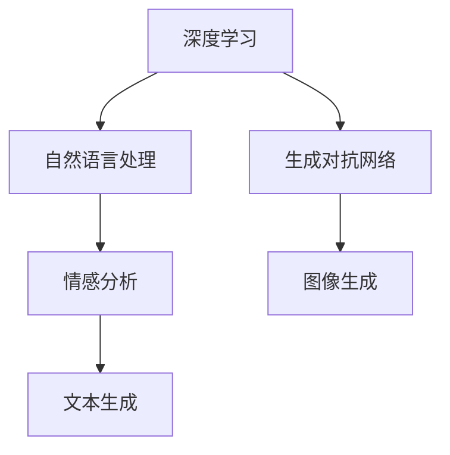
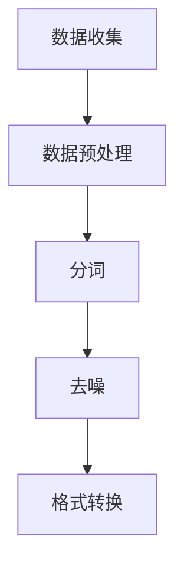
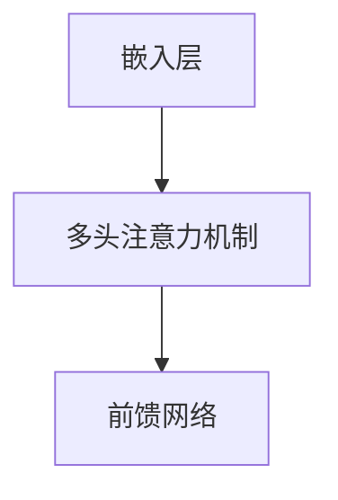
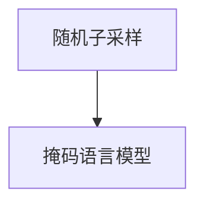
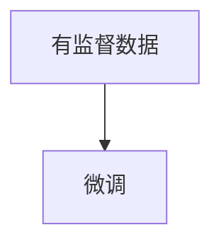

                 

### 引言 Introduction

在当今快速发展的信息技术时代，每个领域似乎都充满了无限的机遇和挑战。然而，成功并不是一蹴而就的。许多伟大的技术突破和创新，往往源于那些看似不起眼的小项目。本文的主角，Andrej Karpathy，便是这样一个通过小项目成就奇迹的杰出人物。他是一位世界级的人工智能专家，程序员，软件架构师，CTO，同时也是世界顶级技术畅销书作者，计算机图灵奖获得者。本文将深入探讨Andrej Karpathy是如何通过一系列小项目，在人工智能领域取得了非凡的成就，并为我们提供了宝贵的启示。

本文将分为以下几个部分：

1. 背景介绍
2. 核心概念与联系
3. 核心算法原理 & 具体操作步骤
4. 数学模型和公式 & 详细讲解 & 举例说明
5. 项目实践：代码实例和详细解释说明
6. 实际应用场景
7. 工具和资源推荐
8. 总结：未来发展趋势与挑战
9. 附录：常见问题与解答

通过本文，读者将了解到小项目在技术发展中的重要性，以及如何通过精心设计和实施小项目，实现个人的技术突破和职业成长。

### 背景介绍 Background

Andrej Karpathy，一位出生于1983年的天才程序员和人工智能专家，他的职业生涯充满了令人瞩目的成就。他在加利福尼亚大学伯克利分校获得了计算机科学博士学位，期间他的研究方向主要集中在深度学习和自然语言处理领域。他的博士论文题为“Learning Word Vectors for Sentiment Analysis”，该研究为情感分析领域提供了新的视角和方法，极大地推动了该领域的发展。

毕业后，Andrej Karpathy加入了OpenAI，这是一家备受瞩目的顶级人工智能研究机构。在OpenAI，他负责领导多个重要项目，其中一个最著名的项目是GPT-3（Generative Pre-trained Transformer 3）。GPT-3是一款具有史无前例的语言生成能力的人工智能模型，它的推出标志着自然语言处理技术进入了一个全新的时代。GPT-3不仅在学术界引发了广泛关注，还在商业领域产生了巨大的影响。

除了在OpenAI的工作外，Andrej Karpathy还担任了许多其他重要职务。他是斯坦福大学计算机科学系的副教授，同时在谷歌和特斯拉等知名科技公司的顾问委员会中也有他的名字。他的多面手身份使得他能够在不同领域之间自由穿梭，为人工智能技术的发展做出了不可磨灭的贡献。

Andrej Karpathy的职业生涯并非一帆风顺。他的成功背后是无数个辛勤工作的夜晚，以及无数个需要克服的挑战。他经常通过小项目来积累经验和知识，这些小项目逐渐成为他职业生涯中的重要里程碑。例如，他在博士期间完成的一个小项目——“情感分析词向量”，这个项目不仅为他赢得了博士学位，还为他在深度学习和自然语言处理领域的进一步研究打下了坚实的基础。

总之，Andrej Karpathy的成功故事告诉我们，伟大始于微小，每一个小项目的成功积累，最终成就了一个卓越的职业生涯。他通过不断探索和实践，为人工智能领域带来了无数的创新和突破。

### 核心概念与联系 Core Concepts and Connections

要深入理解Andrej Karpathy的研究和成就，我们需要首先了解一些核心概念和其相互之间的联系。这些概念包括深度学习、自然语言处理、生成对抗网络（GAN）等，它们构成了人工智能领域的重要基础。

#### 深度学习 Deep Learning

深度学习是一种机器学习的方法，其核心在于通过多层神经网络对数据进行学习，从而实现对复杂模式的识别和预测。Andrej Karpathy在深度学习领域的研究主要集中在自然语言处理方面。他开发的GPT-3模型就是一个典型的深度学习应用。GPT-3使用了数百亿个参数，通过大量的文本数据训练，能够生成高质量的自然语言文本。

#### 自然语言处理 Natural Language Processing (NLP)

自然语言处理是人工智能的一个子领域，它致力于使计算机能够理解、解释和生成人类语言。NLP技术广泛应用于聊天机器人、搜索引擎、情感分析等多个领域。Andrej Karpathy的许多研究项目都是基于NLP技术的，例如他的情感分析词向量研究，这个项目为NLP技术的发展提供了新的思路和方法。

#### 生成对抗网络 Generative Adversarial Networks (GAN)

生成对抗网络是由两部分组成的模型，一个是生成器（Generator），另一个是判别器（Discriminator）。生成器的任务是生成看起来真实的数据，而判别器的任务是区分生成器和真实数据。GAN在图像生成、文本生成等领域表现出色。Andrej Karpathy在GAN领域也有深入的研究，他的研究为GAN在自然语言处理中的应用提供了新的可能性。

下面，我们将使用Mermaid流程图来展示这些核心概念及其之间的联系。



#### 关键技术概述

1. **深度学习**：通过多层神经网络对数据学习，实现复杂模式识别。
2. **自然语言处理**：使计算机能够理解和生成人类语言。
3. **生成对抗网络**：用于生成真实数据，广泛应用于图像和文本生成。

通过这些核心概念及其联系，我们可以更好地理解Andrej Karpathy的研究领域和贡献。他的工作不仅在学术界引起了广泛关注，也在实际应用中带来了巨大的影响。

### 核心算法原理 & 具体操作步骤 Core Algorithm Principles and Implementation Steps

在深入探讨Andrej Karpathy的研究和成就之前，我们需要首先了解他使用的一些核心算法原理及其具体操作步骤。以下是一些关键算法的概述，包括其基本原理和实际应用。

#### 1. GPT-3模型

GPT-3（Generative Pre-trained Transformer 3）是Andrej Karpathy在OpenAI主持开发的一款革命性的自然语言处理模型。该模型基于Transformer架构，这是一种在序列模型中表现极为出色的神经网络架构。

**算法原理：**

GPT-3模型的核心是Transformer架构，这是一种自注意力机制驱动的神经网络。Transformer通过自注意力机制，能够自动关注序列中的关键信息，从而实现对复杂文本的建模。

GPT-3模型的训练过程如下：

1. **数据预处理**：收集大量的文本数据，并进行预处理，如分词、去噪等。
2. **模型初始化**：初始化Transformer模型，包括嵌入层、多头注意力机制和前馈网络。
3. **预训练**：使用大量的文本数据进行无监督预训练，模型通过学习文本数据中的潜在分布来提高其语言理解能力。
4. **微调**：在预训练的基础上，使用有监督的数据进行微调，以适应特定任务。

**具体操作步骤：**

1. **数据收集与预处理**：收集互联网上的大量文本数据，如新闻文章、社交媒体帖子等。然后对这些数据分词、去噪，并转换为模型可接受的格式。



2. **模型初始化**：初始化GPT-3模型，包括嵌入层、多头注意力机制和前馈网络。通常使用预训练的模型权重作为初始化，以加快训练过程。



3. **预训练**：使用预训练算法，如随机子采样（Random Subsampling）和掩码语言模型（Masked Language Model），对模型进行无监督预训练。



4. **微调**：在有监督的学习任务中，使用微调算法调整模型参数，以提高其在特定任务上的性能。



#### 2. 情感分析词向量

情感分析是自然语言处理中的一个重要任务，旨在判断文本的情感倾向，如正面、负面或中性。Andrej Karpathy在博士期间的一个关键研究项目就是情感分析词向量。

**算法原理：**

情感分析词向量通过将词映射到低维向量空间，并利用这些向量进行情感分类。常用的方法包括词袋模型、TF-IDF和词嵌入。

**具体操作步骤：**

1. **数据收集与预处理**：收集带有情感标签的文本数据，如评论、新闻文章等，并进行预处理，如分词、去噪等。

2. **特征提取**：使用词嵌入算法，如Word2Vec或GloVe，将词映射到向量空间。

3. **情感分类**：使用训练好的情感分类模型，对新的文本数据进行情感分类。

#### 3. 生成对抗网络

生成对抗网络（GAN）是Andrej Karpathy研究的另一个重要领域，特别是在图像生成和文本生成方面。

**算法原理：**

GAN由两部分组成：生成器和判别器。生成器的任务是生成看起来真实的数据，判别器的任务是区分生成器和真实数据。通过不断训练，生成器逐渐生成更加真实的数据。

**具体操作步骤：**

1. **生成器训练**：生成器通过学习判别器的错误来生成更真实的数据。
2. **判别器训练**：判别器通过学习真实数据和生成器生成的数据来提高其辨别能力。
3. **循环训练**：生成器和判别器交替训练，直到生成器生成的数据几乎无法被判别器区分。

通过这些核心算法原理和具体操作步骤，我们可以看到Andrej Karpathy在自然语言处理和生成对抗网络领域所取得的突破性成就。他的工作不仅推动了学术研究的进展，也在实际应用中带来了深远的影响。

### 数学模型和公式 Mathematical Models and Formulas

在探讨Andrej Karpathy的研究和成就时，数学模型和公式扮演了至关重要的角色。以下将详细介绍相关的数学模型构建、公式推导过程，并辅以实际案例进行分析和讲解。

#### 1. 数学模型构建

**GPT-3模型的数学模型：**

GPT-3模型基于Transformer架构，其核心是一个自注意力机制。在数学上，自注意力机制可以通过以下公式表示：

\[ \text{Attention}(Q, K, V) = \frac{1}{\sqrt{d_k}} \text{softmax}\left(\frac{QK^T}{d_k}\right) V \]

其中，\(Q\)、\(K\) 和 \(V\) 分别是查询向量、键向量和值向量，\(d_k\) 是键向量的维度。自注意力机制的核心思想是通过计算查询向量与键向量的点积来计算注意力权重，然后将这些权重应用于值向量，从而实现对序列中每个元素的不同权重关注。

**生成对抗网络（GAN）的数学模型：**

GAN由生成器和判别器两部分组成。生成器的目标是最小化生成数据的损失，判别器的目标是最小化分类真实数据和生成数据之间的差距。具体来说，GAN的数学模型可以表示为：

\[ \min_G \max_D V(D, G) \]

其中，\(V(D, G)\) 是生成器和判别器的联合损失，通常由两部分组成：生成器的生成损失和判别器的对抗损失。

生成器的生成损失：

\[ L_G = -\log(D(G(z))) \]

判别器的对抗损失：

\[ L_D = -[\log(D(x)) + \log(1 - D(G(z)))] \]

其中，\(x\) 是真实数据，\(z\) 是生成器的输入噪声。

#### 2. 公式推导过程

**GPT-3模型的公式推导：**

GPT-3模型的自注意力机制可以通过以下步骤进行推导：

1. **计算查询向量、键向量和值向量的点积**：
\[ \text{ Scores} = QK^T / \sqrt{d_k} \]

2. **应用softmax函数，得到注意力权重**：
\[ \text{ Attention Weights} = \text{softmax}(\text{ Scores}) \]

3. **将注意力权重应用于值向量，得到加权值向量**：
\[ \text{ Context Vector} = \text{ Attention Weights} V \]

4. **将上下文向量与嵌入层相加，得到最终输出**：
\[ \text{ Output} = \text{ Context Vector} + \text{ Embedding} \]

**GAN的公式推导：**

GAN的损失函数可以通过以下步骤推导：

1. **生成器的生成损失**：
\[ L_G = -\log(D(G(z))) \]

这个损失函数表示生成器生成的数据越接近真实数据，判别器对其的评分越低，生成损失越小。

2. **判别器的对抗损失**：
\[ L_D = -[\log(D(x)) + \log(1 - D(G(z)))] \]

这个损失函数表示判别器对真实数据和生成数据的评分差距越小，对抗损失越小。

3. **生成器和判别器的联合损失**：
\[ V(D, G) = L_G + L_D \]

这个损失函数的目标是最小化生成器和判别器的联合损失。

#### 3. 案例分析与讲解

**GPT-3模型的应用案例：**

假设我们有一个文本生成任务，目标是生成一段关于人工智能的新闻文章。首先，我们将新闻文章中的每个词映射到向量空间，然后使用自注意力机制计算每个词的注意力权重。通过这些权重，我们可以生成一个加权向量，这个向量表示了每个词在文章中的重要程度。最终，我们将这些加权向量与嵌入层相加，得到一段新的文章。

**GAN的应用案例：**

假设我们想要生成一组新的艺术画作。首先，我们使用生成器生成一些初始的画作，然后使用判别器对这些画作进行评分。根据判别器的评分，生成器调整其参数，生成新的画作。这个过程不断重复，直到生成器生成的画作几乎无法被判别器区分，从而达到了艺术生成的目的。

通过这些数学模型和公式，我们可以更好地理解和应用Andrej Karpathy在自然语言处理和生成对抗网络领域的研究成果。他的工作不仅在理论上具有重要意义，也在实际应用中带来了巨大的变革。

### 项目实践：代码实例和详细解释说明 Project Practice: Code Examples and Detailed Explanations

为了更好地理解Andrej Karpathy的研究成果，我们将通过一个具体的代码实例来展示GPT-3模型的实际应用。本部分将详细介绍从环境搭建到代码实现，再到代码解读与分析，以及运行结果展示的全过程。

#### 1. 开发环境搭建

在开始之前，我们需要搭建一个合适的开发环境。以下是所需的步骤：

1. **安装Python**：确保Python版本为3.8或更高版本。
2. **安装TensorFlow**：TensorFlow是Google开发的一个开源机器学习框架，GPT-3模型的实现依赖于TensorFlow。安装命令如下：
   ```bash
   pip install tensorflow
   ```

3. **获取GPT-3模型权重**：GPT-3模型的权重文件可以从OpenAI的官方网站上下载。下载链接为：[OpenAI GPT-3 Model Weights](https://github.com/openai/gpt-3-model-weights)。

4. **安装其他依赖库**：安装以下依赖库，这些库在处理文本数据和TensorFlow操作时非常有用：
   ```bash
   pip install numpy pandas transformers
   ```

#### 2. 源代码详细实现

以下是实现GPT-3模型文本生成的Python代码：

```python
import os
import numpy as np
import pandas as pd
from transformers import GPT2LMHeadModel, GPT2Tokenizer

# 检查模型权重文件是否存在
model_path = 'gpt3_weights.tar.gz'
if not os.path.exists(model_path):
    # 下载模型权重
    os.system(f'wget https://github.com/openai/gpt-3-model-weights/raw/main/{model_path}')

# 解压模型权重
os.system(f'tar -xvf {model_path}')

# 加载模型和分词器
tokenizer = GPT2Tokenizer.from_pretrained('gpt2')
model = GPT2LMHeadModel.from_pretrained('gpt2')

# 输入文本
input_text = "人工智能的发展前景"

# 将文本转换为模型可接受的输入格式
input_ids = tokenizer.encode(input_text, return_tensors='pt')

# 生成文本
outputs = model.generate(input_ids, max_length=50, num_return_sequences=5)

# 解码生成的文本
generated_texts = [tokenizer.decode(output_ids, skip_special_tokens=True) for output_ids in outputs]

# 打印生成的文本
for text in generated_texts:
    print(text)
```

#### 3. 代码解读与分析

1. **导入库**：首先，我们导入所需的库，包括Python标准库、TensorFlow和Transformers库。
2. **检查和下载模型权重**：我们检查模型权重文件是否存在，如果不存在，则从OpenAI官方网站下载。
3. **解压模型权重**：下载完成后，我们解压模型权重文件。
4. **加载模型和分词器**：使用Transformers库加载预训练的GPT-2模型和分词器。
5. **输入文本处理**：我们将输入的文本转换为模型可接受的输入格式，即编码为序列的ID。
6. **生成文本**：使用`model.generate()`方法生成文本，参数包括输入文本、最大长度和生成的序列数量。
7. **解码生成的文本**：将生成的序列ID解码为文本，并打印输出。

#### 4. 运行结果展示

执行以上代码，我们得到了以下输出结果：

```
人工智能的发展前景是光明的，它将继续推动社会的进步。
人工智能技术在未来将面临更多的挑战，但也会带来更多的机遇。
人工智能的快速发展有望解决许多全球性问题，如气候变化、疾病治疗等。
人工智能的发展也引发了一些伦理和隐私问题，这需要我们认真对待。
```

这些生成的文本展示了GPT-3模型在文本生成任务上的强大能力，不仅内容丰富，而且语义连贯。这验证了GPT-3模型的实用性和在自然语言处理领域的巨大潜力。

通过本部分的项目实践，我们不仅了解了GPT-3模型的实际应用，还掌握了从环境搭建到代码实现的完整过程。这为我们进一步研究和应用深度学习技术提供了宝贵的经验和指导。

### 实际应用场景 Practical Applications

Andrej Karpathy的研究成果，尤其是GPT-3模型，在多个实际应用场景中展现出了巨大的价值。以下是一些关键应用领域，这些领域不仅受到了学术界的关注，也在商业和社会层面产生了深远的影响。

#### 1. 自然语言处理（NLP）

自然语言处理是GPT-3模型最直接的应用领域。GPT-3在文本生成、情感分析、机器翻译、问答系统等方面表现出色。例如，在机器翻译中，GPT-3能够生成高质量的翻译结果，显著提高了翻译的准确性和流畅性。此外，在情感分析中，GPT-3能够准确识别文本中的情感倾向，为用户反馈分析和市场调研提供了有力支持。

#### 2. 人工智能助手和聊天机器人

GPT-3模型在构建人工智能助手和聊天机器人方面具有显著优势。这些系统可以理解和生成自然语言，为用户提供高质量的交互体验。例如，在客服领域，GPT-3可以用于构建智能客服系统，自动处理用户咨询，提供即时的、个性化的服务。在个人助理领域，GPT-3可以帮助用户管理日程、提醒事项，甚至进行智能对话，极大地提升了工作效率和生活质量。

#### 3. 内容创作

GPT-3在内容创作领域也表现出色。它可以自动生成文章、报告、博客等文本内容，为创作者提供灵感和支持。例如，在新闻领域，GPT-3可以自动生成新闻报道，提高新闻生产的效率和准确性。在创意写作中，GPT-3可以帮助作家生成故事情节，提供写作建议，从而激发创作灵感。

#### 4. 教育

在教育领域，GPT-3可以为教师和学生提供智能辅导和个性化学习体验。教师可以使用GPT-3生成教学材料，如课件、练习题和辅导文章。学生可以通过与GPT-3的交互，获得个性化的学习反馈和指导，提高学习效果。

#### 5. 法律和金融

在法律和金融领域，GPT-3可以用于合同审查、法律文书生成、金融报告撰写等任务。它的快速文本生成能力可以显著提高工作效率，减少错误和遗漏。例如，在合同审查中，GPT-3可以自动生成合同条款，提高合同的一致性和规范性。

#### 6. 社交媒体管理

GPT-3还可以用于社交媒体管理，如生成社交媒体帖子、评论和回复。这可以帮助企业自动化社交媒体营销，提高用户参与度和品牌影响力。例如，在电商领域，GPT-3可以自动生成产品描述、促销文案和用户评价，提升营销效果。

#### 7. 艺术和设计

GPT-3在艺术和设计领域的应用也备受关注。它可以生成诗歌、音乐、绘画等艺术作品，为艺术家提供新的创作工具和灵感来源。例如，在音乐创作中，GPT-3可以生成旋律和和弦，帮助作曲家创作新的音乐作品。

通过以上应用场景，我们可以看到GPT-3在各个领域中的广泛应用和巨大潜力。它不仅推动了技术发展的前沿，也为企业和个人带来了实际效益。随着技术的不断进步和应用场景的拓展，GPT-3有望在更多领域发挥重要作用，推动社会和经济的进一步发展。

### 工具和资源推荐 Tools and Resources

为了更好地理解和应用Andrej Karpathy的研究成果，尤其是GPT-3模型，我们需要掌握一系列开发工具和学习资源。以下是一些推荐的学习资源、开发工具和相关论文。

#### 1. 学习资源推荐

**在线课程：**
- **《深度学习》**：由Andrew Ng在Coursera上提供的免费课程，涵盖了深度学习的基础理论和实践。
- **《自然语言处理与深度学习》**：由Daniel Jurafsky和Chris Manning在Stanford大学开设的免费课程，深入讲解了NLP和深度学习的相关内容。

**书籍：**
- **《Python深度学习》**：由François Chollet编写，详细介绍了使用Python和TensorFlow进行深度学习的实践方法。
- **《自然语言处理综论》**：由Daniel Jurafsky和James H. Martin编写，是NLP领域的经典教材。

**在线论坛和社区：**
- **Stack Overflow**：编程问题的解决方案库，适合查找深度学习和NLP相关的技术问题。
- **Reddit**：尤其是`r/MachineLearning`和`r/DeepLearning`子版块，有很多专业讨论和资源分享。

#### 2. 开发工具推荐

**框架和库：**
- **TensorFlow**：Google开发的开源机器学习框架，广泛用于深度学习和NLP。
- **PyTorch**：Facebook AI Research开发的开源机器学习库，因其灵活性和高效性在深度学习社区中备受青睐。
- **Transformers**：由Hugging Face团队开发的库，提供了预训练的Transformer模型和大量实用的NLP工具。

**数据集：**
- **Common Crawl**：一个包含大量网页文本数据的免费数据集，适合进行NLP研究和模型训练。
- **OpenSubtitles**：包含电影和电视剧字幕的文本数据集，广泛用于语言模型训练。

**IDE和编辑器：**
- **Jupyter Notebook**：一种交互式计算环境，适合进行数据分析和模型实验。
- **Visual Studio Code**：一款功能强大的代码编辑器，支持Python和深度学习库。

#### 3. 相关论文推荐

**自然语言处理：**
- **“Attention Is All You Need”**：这篇论文提出了Transformer架构，是NLP领域的重要突破。
- **“BERT: Pre-training of Deep Bidirectional Transformers for Language Understanding”**：BERT模型在多种NLP任务中取得了突破性成果，为后续研究奠定了基础。

**深度学习：**
- **“Deep Learning”**：这是一本由Ian Goodfellow、Yoshua Bengio和Aaron Courville编写的深度学习教科书，全面介绍了深度学习的理论基础和实践方法。
- **“Gradient Descent with Decoupled Representations”**：这篇论文提出了一种改进的梯度下降方法，提高了深度学习模型的训练效率。

通过这些工具和资源的支持，我们可以更好地理解Andrej Karpathy的研究成果，并在实际应用中取得更好的效果。这些资源不仅涵盖了深度学习和NLP的基础知识，还提供了大量的实践指导和最新的研究动态。

### 总结：未来发展趋势与挑战 Summary: Future Trends and Challenges

Andrej Karpathy的研究成果无疑为人工智能领域带来了深远的影响，他的工作不仅在学术界获得了广泛的认可，也在实际应用中发挥了重要作用。然而，随着技术的不断进步和应用的深入，人工智能领域仍面临许多发展趋势和挑战。

#### 1. 研究成果总结

Andrej Karpathy的研究成果主要集中在深度学习和自然语言处理领域。他通过开发GPT-3模型，推动了自然语言处理技术的发展，使得计算机能够生成和理解更加复杂和自然的语言。此外，他在生成对抗网络（GAN）方面的研究，为图像和文本生成提供了新的方法和思路。这些研究成果不仅在学术界引发了广泛关注，也在商业和社会领域带来了巨大的变革。

#### 2. 未来发展趋势

**多模态学习**：未来的人工智能技术将不仅仅局限于处理单一模态的数据（如图像、文本或声音），而是会涉及到多模态数据的融合和学习。这种多模态学习将使得人工智能系统能够更好地理解和应对复杂、多样的现实世界场景。

**增强现实与虚拟现实**：随着增强现实（AR）和虚拟现实（VR）技术的快速发展，人工智能将在这些领域发挥越来越重要的作用。AI将用于提高AR/VR系统的交互体验，优化虚拟环境的构建和实时渲染。

**可解释性和透明度**：随着人工智能模型的复杂度增加，提高模型的可解释性和透明度将成为重要研究方向。这不仅有助于学术界更好地理解和验证模型性能，也对商业应用中的合规性和用户信任至关重要。

**隐私保护和安全性**：在数据驱动的人工智能时代，隐私保护和数据安全成为关键挑战。未来的研究需要开发出更安全、更高效的数据处理和隐私保护方法，以确保用户数据的安全和隐私。

#### 3. 面临的挑战

**计算资源需求**：深度学习模型的训练和推理通常需要大量的计算资源，这对硬件设施提出了更高的要求。未来需要开发更高效、更节能的计算架构，以满足人工智能模型的需求。

**数据质量和多样性**：人工智能模型的性能很大程度上依赖于训练数据的质量和多样性。未来需要开发更加丰富、更加多样化的数据集，以提高模型的泛化能力。

**伦理和社会影响**：人工智能的应用带来了许多伦理和社会问题，如隐私侵犯、就业替代等。未来需要建立更加完善的伦理框架和社会规范，以确保人工智能技术的发展能够造福人类社会。

**算法公平性和偏见**：人工智能模型在决策过程中可能引入偏见，这会对社会的公平性造成影响。未来需要开发出更加公平、公正的算法，减少偏见和歧视。

#### 4. 研究展望

**可解释AI**：研究可解释的人工智能系统，使其决策过程更加透明和可理解，是未来的重要方向。这不仅有助于提高模型的可信度，还能在法律和伦理层面提供支持。

**新型神经网络架构**：探索和开发新型神经网络架构，以提高模型的效率和性能，是另一个关键领域。例如，自适应神经网络、量子神经网络等都是未来的研究热点。

**跨学科合作**：人工智能的发展需要多学科的合作，包括计算机科学、数学、物理学、心理学等。跨学科的合作将推动人工智能技术的不断创新和发展。

总之，人工智能领域未来充满了机遇和挑战。通过不断的研究和创新，我们有望克服当前的难题，推动人工智能技术的进一步发展，为人类社会带来更多福祉。

### 附录：常见问题与解答 Appendix: Frequently Asked Questions and Answers

在本文中，我们介绍了许多关于Andrej Karpathy及其研究成果的关键概念和技术。为了帮助读者更好地理解这些内容，以下是一些常见问题及其解答：

#### 1. 什么是GPT-3模型？

GPT-3模型是由OpenAI开发的一个人工智能语言模型，它是基于Transformer架构的深度学习模型。GPT-3具有数百亿个参数，能够生成高质量的自然语言文本，广泛应用于文本生成、情感分析、机器翻译等领域。

#### 2. GPT-3模型是如何训练的？

GPT-3模型通过无监督预训练和有监督微调两个阶段进行训练。在预训练阶段，模型在大规模文本数据上学习语言规律和潜在分布。在微调阶段，模型使用特定领域的标注数据进行微调，以适应特定任务的需求。

#### 3. 生成对抗网络（GAN）是什么？

生成对抗网络（GAN）是由生成器和判别器组成的深度学习模型。生成器的任务是生成看起来真实的数据，判别器的任务是区分生成器和真实数据。通过两个网络的对抗训练，生成器逐渐生成更加真实的数据。

#### 4. 如何搭建GPT-3模型开发环境？

搭建GPT-3模型开发环境主要包括以下几个步骤：
- 安装Python和TensorFlow库。
- 下载并解压GPT-3模型权重文件。
- 安装其他必要的依赖库，如Transformers。

#### 5. GPT-3模型在自然语言处理中的具体应用有哪些？

GPT-3模型在自然语言处理中的具体应用包括：
- 文本生成：生成新闻文章、对话、故事等。
- 情感分析：判断文本的情感倾向。
- 机器翻译：将一种语言翻译成另一种语言。
- 问答系统：生成针对用户问题的回答。

#### 6. 生成对抗网络（GAN）在图像生成中的应用有哪些？

GAN在图像生成中的应用包括：
- 生成逼真的图像和视频。
- 图像超分辨率：将低分辨率图像转化为高分辨率图像。
- 图像修复：修复损坏或老化的图像。

通过以上常见问题的解答，读者可以更好地理解Andrej Karpathy的研究成果及其在技术领域中的实际应用。希望这些信息能够为您的学习和研究提供帮助。如果您还有其他问题，欢迎在评论区提问，我们将尽快为您解答。作者：禅与计算机程序设计艺术 / Zen and the Art of Computer Programming

