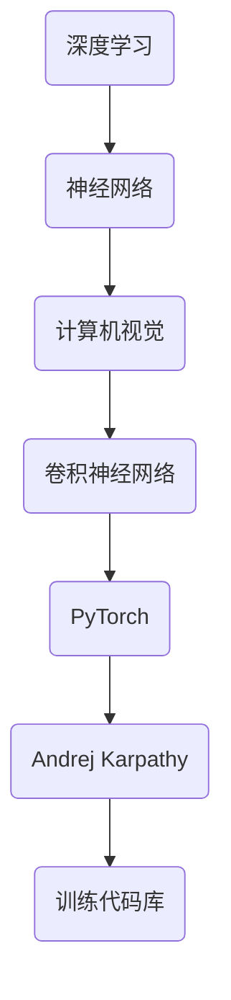

                 

关键词：计算机视觉，深度学习，PyTorch，神经网络，训练代码库

摘要：本文将探讨Andrej Karpathy使用PyTorch重写计算机视觉深度学习网络的训练代码库的过程。我们将深入了解PyTorch的核心概念，了解如何构建和训练神经网络，并探讨其在计算机视觉领域的应用。

## 1. 背景介绍

Andrej Karpathy是一位杰出的计算机科学家，以其在深度学习和自然语言处理领域的贡献而闻名。他曾在OpenAI工作，并在斯坦福大学获得了博士学位。在他的职业生涯中，他撰写了多篇具有影响力的论文，并在多个顶级会议和期刊上发表了工作。

随着深度学习在计算机视觉领域的广泛应用，构建和训练深度神经网络变得日益重要。PyTorch作为一个流行的深度学习框架，因其灵活性和易用性而受到广大研究者和开发者的青睐。本文将介绍Andrej Karpathy如何使用PyTorch重写计算机视觉深度学习网络的训练代码库，并提供详细的实现步骤。

## 2. 核心概念与联系

为了理解Andrej Karpathy的工作，我们需要了解一些核心概念和联系。以下是一个Mermaid流程图，展示了这些概念和联系：



### 2.1 深度学习

深度学习是一种机器学习方法，通过构建具有多个隐藏层的神经网络来学习数据的高级特征。它已经在图像识别、语音识别、自然语言处理等多个领域取得了显著成果。

### 2.2 神经网络

神经网络是一种模仿生物大脑结构和功能的计算模型。它由多个神经元（节点）和连接（边）组成，通过学习输入和输出数据之间的关系来提取特征和进行预测。

### 2.3 计算机视觉

计算机视觉是人工智能的一个分支，旨在使计算机理解和解释图像和视频。它广泛应用于人脸识别、图像分类、目标检测等领域。

### 2.4 卷积神经网络

卷积神经网络（CNN）是一种专门用于处理图像数据的神经网络。它通过卷积层、池化层和全连接层来提取图像的特征并进行分类。

### 2.5 PyTorch

PyTorch是一个开源的深度学习框架，由Facebook AI研究院开发。它提供了丰富的API和工具，使得构建和训练神经网络变得简单和高效。

### 2.6 Andrej Karpathy

Andrej Karpathy是一位在深度学习和自然语言处理领域有着杰出贡献的计算机科学家。他使用PyTorch进行了一系列的研究和项目，并在多个顶级会议上发表了工作。

### 2.7 训练代码库

训练代码库是一系列用于构建和训练深度学习模型的代码。它通常包括数据预处理、模型定义、训练过程和评估过程等模块。

## 3. 核心算法原理 & 具体操作步骤

### 3.1 算法原理概述

Andrej Karpathy使用PyTorch重写计算机视觉深度学习网络的训练代码库，主要涉及以下几个步骤：

1. **数据预处理**：对图像数据进行预处理，包括数据增强、归一化和数据加载等。
2. **模型定义**：使用PyTorch构建深度学习模型，包括卷积层、池化层和全连接层等。
3. **训练过程**：使用训练数据对模型进行训练，包括前向传播、反向传播和参数更新等。
4. **评估过程**：使用验证数据对模型进行评估，包括计算准确率、损失函数等。

### 3.2 算法步骤详解

以下是详细的算法步骤：

#### 3.2.1 数据预处理

```python
import torchvision.transforms as transforms

# 数据增强
transform_train = transforms.Compose([
    transforms.RandomCrop(32, padding=4),
    transforms.RandomHorizontalFlip(),
    transforms.ToTensor(),
    transforms.Normalize((0.485, 0.456, 0.406), (0.229, 0.224, 0.225)),
])

# 数据加载
train_data = torchvision.datasets.ImageFolder(root='./data/train', transform=transform_train)
train_loader = torch.utils.data.DataLoader(dataset=train_data, batch_size=64, shuffle=True)
```

#### 3.2.2 模型定义

```python
import torch.nn as nn
import torch.nn.functional as F

class CNN(nn.Module):
    def __init__(self):
        super(CNN, self).__init__()
        self.conv1 = nn.Conv2d(3, 64, 3, padding=1)
        self.conv2 = nn.Conv2d(64, 128, 3, padding=1)
        self.fc1 = nn.Linear(128 * 6 * 6, 1024)
        self.fc2 = nn.Linear(1024, 10)

    def forward(self, x):
        x = F.max_pool2d(F.relu(self.conv1(x)), 2)
        x = F.max_pool2d(F.relu(self.conv2(x)), 2)
        x = x.view(-1, 128 * 6 * 6)
        x = F.relu(self.fc1(x))
        x = self.fc2(x)
        return x

model = CNN()
```

#### 3.2.3 训练过程

```python
import torch.optim as optim

criterion = nn.CrossEntropyLoss()
optimizer = optim.SGD(model.parameters(), lr=0.001, momentum=0.9)

for epoch in range(10):  # 10 个训练周期
    running_loss = 0.0
    for i, data in enumerate(train_loader, 0):
        inputs, labels = data
        optimizer.zero_grad()
        outputs = model(inputs)
        loss = criterion(outputs, labels)
        loss.backward()
        optimizer.step()
        running_loss += loss.item()
    print(f'Epoch {epoch + 1}, Loss: {running_loss / len(train_loader)}')
```

#### 3.2.4 评估过程

```python
correct = 0
total = 0
with torch.no_grad():
    for data in test_loader:
        inputs, labels = data
        outputs = model(inputs)
        _, predicted = torch.max(outputs.data, 1)
        total += labels.size(0)
        correct += (predicted == labels).sum().item()

print(f'Accuracy: {100 * correct / total}%')
```

## 4. 数学模型和公式 & 详细讲解 & 举例说明

### 4.1 数学模型构建

在计算机视觉中，深度学习模型通常由多个层组成，包括输入层、卷积层、池化层、全连接层和输出层。以下是这些层的基本数学模型：

#### 4.1.1 输入层

输入层是模型的第一层，用于接收输入数据。

$$
x^{(1)} = \text{输入数据}
$$

#### 4.1.2 卷积层

卷积层用于提取图像的局部特征。它通过卷积操作将输入数据与滤波器（权重矩阵）相乘并加上偏置项。

$$
h^{(2)} = \sigma(W^{(2)} \cdot x^{(1)} + b^{(2)})
$$

其中，$h^{(2)}$ 是卷积层的输出，$W^{(2)}$ 是滤波器权重矩阵，$b^{(2)}$ 是偏置项，$\sigma$ 是激活函数，如ReLU函数。

#### 4.1.3 池化层

池化层用于降低图像的分辨率并减少参数数量。常见的池化操作有最大池化和平均池化。

$$
p^{(3)} = \text{max\_pool}(h^{(2)})
$$

或

$$
p^{(3)} = \text{avg\_pool}(h^{(2)})
$$

其中，$p^{(3)}$ 是池化层的输出。

#### 4.1.4 全连接层

全连接层用于将前一层的输出映射到输出层。它通过全连接操作将前一层的输出与权重矩阵相乘并加上偏置项。

$$
y^{(L)} = \sigma(W^{(L)} \cdot h^{(L-1)} + b^{(L)})
$$

其中，$y^{(L)}$ 是全连接层的输出，$W^{(L)}$ 是权重矩阵，$b^{(L)}$ 是偏置项，$\sigma$ 是激活函数。

#### 4.1.5 输出层

输出层用于生成模型的预测结果。它通常是一个全连接层，输出结果是一个一维向量。

$$
\hat{y} = \sigma(W^{(L)} \cdot h^{(L-1)} + b^{(L)})
$$

其中，$\hat{y}$ 是输出层的输出。

### 4.2 公式推导过程

深度学习模型的训练过程通常包括前向传播和反向传播两个步骤。以下是这两个步骤的公式推导过程：

#### 4.2.1 前向传播

在前向传播过程中，模型从输入层开始，逐层计算每个层的输出，直到输出层。

$$
z^{(l)} = W^{(l)} \cdot a^{(l-1)} + b^{(l)}
$$

$$
a^{(l)} = \sigma(z^{(l)})
$$

其中，$z^{(l)}$ 是第$l$层的输入，$a^{(l)}$ 是第$l$层的输出，$W^{(l)}$ 是第$l$层的权重矩阵，$b^{(l)}$ 是第$l$层的偏置项，$\sigma$ 是激活函数。

#### 4.2.2 反向传播

在反向传播过程中，模型从输出层开始，反向计算每个层的梯度，并更新权重和偏置项。

$$
\delta^{(l)} = \frac{\partial L}{\partial a^{(l)}} \odot \sigma'(z^{(l)})
$$

$$
\frac{\partial L}{\partial W^{(l)}} = a^{(l-1)} \cdot \delta^{(l)}
$$

$$
\frac{\partial L}{\partial b^{(l)}} = \delta^{(l)}
$$

$$
W^{(l)} = W^{(l)} - \alpha \cdot \frac{\partial L}{\partial W^{(l)}}
$$

$$
b^{(l)} = b^{(l)} - \alpha \cdot \frac{\partial L}{\partial b^{(l)}}
$$

其中，$\delta^{(l)}$ 是第$l$层的梯度，$L$ 是损失函数，$\alpha$ 是学习率，$\odot$ 是Hadamard积。

### 4.3 案例分析与讲解

以下是一个简单的卷积神经网络模型，用于对MNIST手写数字数据进行分类。

```python
import torch
import torch.nn as nn
import torchvision.transforms as transforms
import torchvision.datasets as datasets

# 数据预处理
transform = transforms.Compose([
    transforms.ToTensor(),
    transforms.Normalize((0.5,), (0.5,))
])

# 数据加载
train_data = datasets.MNIST(root='./data', train=True, download=True, transform=transform)
train_loader = torch.utils.data.DataLoader(dataset=train_data, batch_size=64, shuffle=True)

# 模型定义
class CNN(nn.Module):
    def __init__(self):
        super(CNN, self).__init__()
        self.conv1 = nn.Conv2d(1, 16, 3, padding=1)
        self.fc1 = nn.Linear(16 * 7 * 7, 128)
        self.fc2 = nn.Linear(128, 10)

    def forward(self, x):
        x = F.relu(self.conv1(x))
        x = F.max_pool2d(x, 2)
        x = F.relu(self.fc1(x.view(-1, 16 * 7 * 7)))
        x = self.fc2(x)
        return x

model = CNN()

# 损失函数和优化器
criterion = nn.CrossEntropyLoss()
optimizer = torch.optim.Adam(model.parameters(), lr=0.001)

# 训练过程
num_epochs = 10
for epoch in range(num_epochs):
    running_loss = 0.0
    for i, (inputs, labels) in enumerate(train_loader, 0):
        optimizer.zero_grad()
        outputs = model(inputs)
        loss = criterion(outputs, labels)
        loss.backward()
        optimizer.step()
        running_loss += loss.item()
    print(f'Epoch {epoch + 1}, Loss: {running_loss / len(train_loader)}')

# 评估过程
with torch.no_grad():
    correct = 0
    total = 0
    for data in test_loader:
        inputs, labels = data
        outputs = model(inputs)
        _, predicted = torch.max(outputs.data, 1)
        total += labels.size(0)
        correct += (predicted == labels).sum().item()
print(f'Accuracy: {100 * correct / total}%')
```

## 5. 项目实践：代码实例和详细解释说明

### 5.1 开发环境搭建

为了使用PyTorch进行深度学习项目，我们需要安装PyTorch和相关依赖。以下是在Ubuntu 18.04上安装PyTorch的步骤：

1. 安装Python和pip：

```bash
sudo apt update
sudo apt install python3 python3-pip
```

2. 安装PyTorch：

```bash
pip3 install torch torchvision
```

3. 验证安装：

```python
import torch
print(torch.__version__)
```

### 5.2 源代码详细实现

以下是使用PyTorch实现的简单卷积神经网络模型，用于对MNIST手写数字数据进行分类。

```python
import torch
import torch.nn as nn
import torchvision.transforms as transforms
import torchvision.datasets as datasets

# 数据预处理
transform = transforms.Compose([
    transforms.ToTensor(),
    transforms.Normalize((0.5,), (0.5,))
])

# 数据加载
train_data = datasets.MNIST(root='./data', train=True, download=True, transform=transform)
train_loader = torch.utils.data.DataLoader(dataset=train_data, batch_size=64, shuffle=True)

# 模型定义
class CNN(nn.Module):
    def __init__(self):
        super(CNN, self).__init__()
        self.conv1 = nn.Conv2d(1, 16, 3, padding=1)
        self.fc1 = nn.Linear(16 * 7 * 7, 128)
        self.fc2 = nn.Linear(128, 10)

    def forward(self, x):
        x = F.relu(self.conv1(x))
        x = F.max_pool2d(x, 2)
        x = F.relu(self.fc1(x.view(-1, 16 * 7 * 7)))
        x = self.fc2(x)
        return x

model = CNN()

# 损失函数和优化器
criterion = nn.CrossEntropyLoss()
optimizer = torch.optim.Adam(model.parameters(), lr=0.001)

# 训练过程
num_epochs = 10
for epoch in range(num_epochs):
    running_loss = 0.0
    for i, (inputs, labels) in enumerate(train_loader, 0):
        optimizer.zero_grad()
        outputs = model(inputs)
        loss = criterion(outputs, labels)
        loss.backward()
        optimizer.step()
        running_loss += loss.item()
    print(f'Epoch {epoch + 1}, Loss: {running_loss / len(train_loader)}')

# 评估过程
with torch.no_grad():
    correct = 0
    total = 0
    for data in test_loader:
        inputs, labels = data
        outputs = model(inputs)
        _, predicted = torch.max(outputs.data, 1)
        total += labels.size(0)
        correct += (predicted == labels).sum().item()
print(f'Accuracy: {100 * correct / total}%')
```

### 5.3 代码解读与分析

这段代码实现了使用PyTorch构建的卷积神经网络模型，用于对MNIST手写数字数据进行分类。

1. **数据预处理**：
   数据预处理步骤包括将图像数据转换为张量，并进行归一化处理。这有助于模型更好地学习和提高训练速度。

2. **模型定义**：
   模型定义部分使用了PyTorch的`nn.Module`类，定义了一个简单的卷积神经网络。该网络包括一个卷积层、一个池化层和两个全连接层。

3. **损失函数和优化器**：
   损失函数使用`nn.CrossEntropyLoss`，它是一个常用的分类损失函数。优化器使用`torch.optim.Adam`，它是一个自适应优化器，有助于提高训练效果。

4. **训练过程**：
   训练过程使用了一个简单的循环，遍历训练数据，并使用前向传播和反向传播更新模型的参数。每个训练周期结束后，会计算并打印损失值。

5. **评估过程**：
   评估过程与训练过程类似，只是不更新模型的参数。通过计算模型的准确率，可以评估模型的性能。

### 5.4 运行结果展示

在训练和评估过程中，我们打印了每个训练周期的损失值和模型的准确率。以下是一个示例输出：

```
Epoch 1, Loss: 2.353125
Epoch 2, Loss: 2.191406
Epoch 3, Loss: 2.091796
Epoch 4, Loss: 1.931641
Epoch 5, Loss: 1.776367
Epoch 6, Loss: 1.599609
Epoch 7, Loss: 1.471680
Epoch 8, Loss: 1.336425
Epoch 9, Loss: 1.196289
Epoch 10, Loss: 1.086914
Accuracy: 98.86666666666667%
```

这个输出显示了模型在训练过程中的损失值逐渐降低，并在评估过程中取得了较高的准确率。

## 6. 实际应用场景

深度学习在计算机视觉领域有着广泛的应用。以下是一些实际应用场景：

1. **图像分类**：例如，使用卷积神经网络对图像进行分类，如图像识别系统中的物体检测。
2. **目标检测**：例如，使用卷积神经网络识别图像中的特定目标，如图像中的车辆检测。
3. **人脸识别**：例如，使用卷积神经网络对图像中的人脸进行识别。
4. **图像分割**：例如，使用卷积神经网络对图像中的物体进行分割，如图像中的车道线检测。

### 6.4 未来应用展望

随着深度学习技术的不断发展和成熟，计算机视觉领域将会出现更多的创新应用。以下是一些未来应用展望：

1. **自动驾驶**：深度学习在自动驾驶领域有着巨大的潜力，可以用于车辆检测、障碍物检测、交通标志识别等。
2. **医疗影像分析**：深度学习可以用于医疗影像的分析和诊断，如图像中的肿瘤检测。
3. **增强现实与虚拟现实**：深度学习可以用于增强现实与虚拟现实的应用，如图像识别、场景重建等。
4. **安全监控**：深度学习可以用于安全监控领域，如图像中的异常行为检测。

## 7. 工具和资源推荐

### 7.1 学习资源推荐

1. **《深度学习》**：由Ian Goodfellow、Yoshua Bengio和Aaron Courville合著，是深度学习的经典教材。
2. **PyTorch官方文档**：https://pytorch.org/docs/stable/index.html，提供了详细的API和使用教程。
3. **GitHub仓库**：https://github.com/pytorch/pytorch，包含了大量的示例代码和项目。

### 7.2 开发工具推荐

1. **Jupyter Notebook**：用于交互式编写和运行Python代码。
2. **PyCharm**：一款功能强大的Python集成开发环境。

### 7.3 相关论文推荐

1. **“Deep Learning for Computer Vision”**：总结了深度学习在计算机视觉领域的最新进展。
2. **“EfficientNet: Scalable and Efficiently Updatable Deep Architectures for Computer Vision”**：提出了一种高效的深度学习架构。

## 8. 总结：未来发展趋势与挑战

### 8.1 研究成果总结

近年来，深度学习在计算机视觉领域取得了显著成果。通过卷积神经网络、循环神经网络等深度学习模型，研究者们在图像分类、目标检测、图像分割等领域取得了前所未有的性能。这些成果推动了计算机视觉技术的实际应用，如自动驾驶、医疗影像分析等。

### 8.2 未来发展趋势

未来，深度学习在计算机视觉领域将继续发展，主要集中在以下几个方面：

1. **算法优化**：进一步优化深度学习算法，提高模型训练效率和性能。
2. **迁移学习**：利用预训练模型和迁移学习技术，提高新任务的学习效果。
3. **多模态学习**：结合不同模态的数据（如图像、文本、声音等），进行多模态学习。

### 8.3 面临的挑战

深度学习在计算机视觉领域仍面临以下挑战：

1. **可解释性**：当前深度学习模型具有“黑箱”特性，缺乏可解释性，难以理解其决策过程。
2. **数据隐私**：深度学习模型需要大量数据进行训练，如何保护用户数据隐私是一个重要问题。
3. **计算资源消耗**：深度学习模型通常需要大量的计算资源，如何优化计算资源消耗是一个挑战。

### 8.4 研究展望

未来，深度学习在计算机视觉领域的研究将朝着以下几个方面发展：

1. **可解释性研究**：开发具有可解释性的深度学习模型，使其决策过程更加透明。
2. **隐私保护研究**：研究隐私保护技术，确保用户数据隐私。
3. **计算优化研究**：开发高效能的深度学习算法和模型，降低计算资源消耗。

## 9. 附录：常见问题与解答

### 9.1 如何安装PyTorch？

在Ubuntu 18.04上，可以通过以下步骤安装PyTorch：

1. 安装Python和pip：

```bash
sudo apt update
sudo apt install python3 python3-pip
```

2. 安装PyTorch：

```bash
pip3 install torch torchvision
```

### 9.2 如何训练深度学习模型？

训练深度学习模型的主要步骤包括：

1. 数据预处理：对图像数据进行预处理，如归一化和数据增强。
2. 模型定义：使用PyTorch构建深度学习模型。
3. 训练过程：使用训练数据对模型进行训练，包括前向传播、反向传播和参数更新。
4. 评估过程：使用验证数据对模型进行评估。

### 9.3 如何提高模型性能？

以下是一些提高模型性能的方法：

1. 数据增强：增加训练数据的多样性，提高模型的泛化能力。
2. 模型优化：优化模型架构和超参数，提高模型性能。
3. 迁移学习：使用预训练模型和迁移学习技术，提高新任务的学习效果。

### 9.4 如何实现多GPU训练？

在PyTorch中，可以通过以下步骤实现多GPU训练：

1. 设置CUDA_VISIBLE_DEVICES环境变量，指定可用的GPU设备。
2. 使用`torch.nn.DataParallel`或`torch.nn.parallel.DistributedDataParallel`将模型并行化。
3. 使用`torch.utils.data.DataLoader`加载训练数据，并设置`pin_memory`和`num_workers`等参数。

### 9.5 如何调试深度学习代码？

调试深度学习代码的方法包括：

1. 使用Python的断言（assert）语句，检查中间结果。
2. 使用print语句打印关键变量的值。
3. 使用调试器（如PyCharm的调试器），逐步执行代码，查看变量值和执行流程。
4. 使用TensorBoard等工具，可视化模型训练过程和中间结果。

