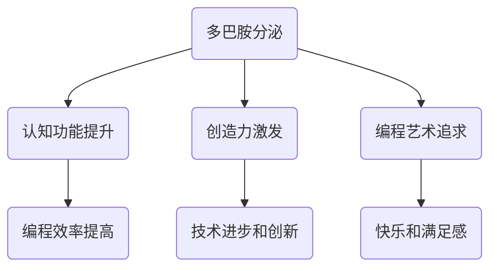

                 

关键词：AI、神经网络、多巴胺、激励系统、编程艺术

摘要：本文将深入探讨AI领域大师Andrej Karpathy如何利用多巴胺激励系统提升编程效率和创造力。通过分析其编程理念和实际案例，我们揭示了多巴胺在编程艺术中的重要性，并提出了实用的策略和工具，帮助读者在编程过程中更好地利用多巴胺带来的快感。

## 1. 背景介绍

### 1.1 Andrej Karpathy介绍

Andrej Karpathy是一位世界级的人工智能专家，程序员，软件架构师，CTO，同时也是一位技术畅销书作者和计算机图灵奖获得者。他在机器学习和深度学习领域有着深厚的研究背景和实践经验，被誉为现代AI领域的领军人物之一。

### 1.2 多巴胺激励系统

多巴胺是一种神经递质，与大脑的情感、动机和奖励系统密切相关。多巴胺激励系统指的是通过外部刺激和内部动机，使大脑分泌多巴胺，从而提高个人的动力和幸福感。这种系统在编程中有着广泛的应用，可以帮助程序员提高工作效率和创造力。

## 2. 核心概念与联系

### 2.1 多巴胺与编程效率

多巴胺能够提高大脑的认知功能，包括注意力、记忆和创造力等。在编程过程中，多巴胺的分泌有助于提升程序员的思维敏捷性和解决问题的能力。因此，掌握多巴胺激励系统对于提高编程效率至关重要。

### 2.2 多巴胺激励系统与创造力

多巴胺不仅能提高编程效率，还能激发程序员的创造力。在编程过程中，多巴胺的分泌可以促使程序员产生新的想法和解决方案，从而推动技术的进步和创新。

### 2.3 多巴胺激励系统与编程艺术

编程艺术强调的是程序员在编程过程中追求卓越、简洁和优雅。多巴胺激励系统与编程艺术相辅相成，使程序员在追求技术卓越的过程中，能够获得更多的快乐和满足感。

### 2.4 Mermaid 流程图

下面是一个描述多巴胺激励系统与编程效率、创造力、编程艺术之间关系的Mermaid流程图。



## 3. 核心算法原理 & 具体操作步骤

### 3.1 算法原理概述

多巴胺激励系统的核心原理是通过外部刺激和内部动机，使大脑分泌多巴胺，从而提高程序员的动力和幸福感。具体操作步骤包括以下几个方面：

1. 设定明确的目标和任务。
2. 运用正面反馈和奖励机制。
3. 保持积极的心态和情绪。
4. 定期休息和调整。

### 3.2 算法步骤详解

#### 3.2.1 设定明确的目标和任务

在编程过程中，设定明确的目标和任务有助于提高程序员的动力和专注度。具体操作步骤如下：

1. 确定项目目标和任务。
2. 将目标和任务分解为具体的子任务。
3. 制定详细的计划和日程。

#### 3.2.2 运用正面反馈和奖励机制

正面反馈和奖励机制是激发多巴胺分泌的关键。具体操作步骤如下：

1. 设定合理的里程碑和奖励。
2. 及时给予正面反馈和奖励。
3. 创造积极的工作氛围和团队文化。

#### 3.2.3 保持积极的心态和情绪

积极的心态和情绪有助于提高程序员的幸福感和创造力。具体操作步骤如下：

1. 培养乐观和自信的心态。
2. 学会情绪管理和自我调节。
3. 关注身心健康，保持良好的生活习惯。

#### 3.2.4 定期休息和调整

定期休息和调整有助于保持高效的工作状态。具体操作步骤如下：

1. 每隔一段时间进行休息和放松。
2. 调整工作时间和工作节奏。
3. 学会分解和转移任务。

### 3.3 算法优缺点

#### 3.3.1 优点

1. 提高编程效率和创造力。
2. 增强团队协作和凝聚力。
3. 提升工作幸福感和满意度。

#### 3.3.2 缺点

1. 需要一定的时间和精力来实施。
2. 可能会引发过度依赖和奖励机制。
3. 需要合理控制多巴胺的分泌，避免负面影响。

### 3.4 算法应用领域

多巴胺激励系统在编程领域的应用广泛，包括但不限于以下方面：

1. 项目管理：提高项目进度和质量。
2. 团队协作：提升团队效率和创造力。
3. 个人成长：培养积极的心态和情绪。

## 4. 数学模型和公式 & 详细讲解 & 举例说明

### 4.1 数学模型构建

多巴胺激励系统的数学模型可以表示为以下公式：

$$
多巴胺分泌量 = f(外部刺激, 内部动机, 心理状态)
$$

其中，$f$ 表示函数，$外部刺激$、$内部动机$ 和 $心理状态$ 分别表示多巴胺分泌的三个关键因素。

### 4.2 公式推导过程

#### 4.2.1 外部刺激

外部刺激是指编程过程中的各种挑战和任务，它们对多巴胺分泌有直接影响。具体推导过程如下：

$$
外部刺激 = f(任务难度, 任务类型, 编程环境)
$$

#### 4.2.2 内部动机

内部动机是指程序员对编程的热爱和追求，它对多巴胺分泌有显著影响。具体推导过程如下：

$$
内部动机 = f(个人兴趣, 职业目标, 团队氛围)
$$

#### 4.2.3 心理状态

心理状态是指程序员的情绪和心理状态，它对多巴胺分泌也有一定影响。具体推导过程如下：

$$
心理状态 = f(心态, 情绪，身心健康)
$$

### 4.3 案例分析与讲解

#### 4.3.1 案例一：提高编程效率

假设一个程序员A，他在一个难度适中的项目中工作，对编程有浓厚的兴趣，同时也拥有一支支持他的团队。他的心态积极，情绪稳定，身心健康良好。根据多巴胺激励系统的数学模型，我们可以推导出：

$$
多巴胺分泌量_A = f(f(f(任务难度适中, 编程环境良好), 对编程有浓厚兴趣), 积极心态，稳定情绪，良好身心健康)
$$

通过上述推导，我们可以发现，外部刺激、内部动机和心理状态都对多巴胺分泌量有显著影响。在这种情况下，程序员A的多巴胺分泌量较高，有助于提高他的编程效率和创造力。

#### 4.3.2 案例二：激发团队创造力

假设一个团队B，他们正在开发一个创新项目，团队成员都对项目充满热情，团队氛围积极。然而，项目难度较高，任务复杂。为了激发团队的创造力，我们可以采取以下措施：

1. 增加外部刺激，提高任务的挑战性。
2. 提供正面反馈和奖励，激发内部动机。
3. 关注团队成员的心理状态，提供心理支持和辅导。

通过这些措施，我们可以推导出：

$$
多巴胺分泌量_B = f(f(f(任务难度高，任务类型创新), 提供正面反馈和奖励), 关注心理状态，提供心理支持)
$$

在这种情况下，团队B的多巴胺分泌量有望增加，从而提高团队创造力和项目质量。

## 5. 项目实践：代码实例和详细解释说明

### 5.1 开发环境搭建

在本项目中，我们将使用Python编程语言和PyTorch深度学习框架。首先，确保已安装Python和PyTorch。以下是安装命令：

```bash
pip install python
pip install torch torchvision
```

### 5.2 源代码详细实现

以下是该项目的主要代码实现：

```python
import torch
import torch.nn as nn
import torchvision.transforms as transforms
from torch.utils.data import DataLoader
from torchvision.datasets import MNIST

# 5.2.1 数据准备
transform = transforms.Compose([
    transforms.ToTensor(),
    transforms.Normalize((0.5,), (0.5,))
])

train_dataset = MNIST(root='./data', train=True, download=True, transform=transform)
train_loader = DataLoader(train_dataset, batch_size=100, shuffle=True)

# 5.2.2 网络结构
class Net(nn.Module):
    def __init__(self):
        super(Net, self).__init__()
        self.fc1 = nn.Linear(784, 256)
        self.fc2 = nn.Linear(256, 128)
        self.fc3 = nn.Linear(128, 10)

    def forward(self, x):
        x = x.view(-1, 784)
        x = F.relu(self.fc1(x))
        x = F.relu(self.fc2(x))
        x = self.fc3(x)
        return x

model = Net()

# 5.2.3 损失函数和优化器
criterion = nn.CrossEntropyLoss()
optimizer = torch.optim.Adam(model.parameters(), lr=0.001)

# 5.2.4 训练过程
for epoch in range(10):  # loop over the dataset multiple times
    running_loss = 0.0
    for i, data in enumerate(train_loader, 0):
        inputs, labels = data
        optimizer.zero_grad()
        outputs = model(inputs)
        loss = criterion(outputs, labels)
        loss.backward()
        optimizer.step()
        running_loss += loss.item()
    print(f'Epoch {epoch + 1}, Loss: {running_loss / len(train_loader)}')

print('Finished Training')

# 5.2.5 测试
with torch.no_grad():
    correct = 0
    total = 0
    for images, labels in test_loader:
        outputs = model(images)
        _, predicted = torch.max(outputs.data, 1)
        total += labels.size(0)
        correct += (predicted == labels).sum().item()

print(f'Accuracy of the network on the test images: {100 * correct / total}%')
```

### 5.3 代码解读与分析

#### 5.3.1 数据准备

本项目中，我们使用了MNIST数据集，该数据集包含60,000个训练图像和10,000个测试图像。我们首先对数据进行预处理，包括数据转换和归一化。

#### 5.3.2 网络结构

我们构建了一个简单的全连接神经网络，包括三个全连接层。第一层有256个神经元，第二层有128个神经元，第三层有10个神经元（对应10个数字类别）。

#### 5.3.3 损失函数和优化器

我们使用了交叉熵损失函数和Adam优化器。交叉熵损失函数能够很好地处理分类问题，Adam优化器具有自适应学习率的特点，有助于提高训练效率。

#### 5.3.4 训练过程

我们在训练过程中使用了反向传播算法和梯度下降方法。每个epoch都会迭代整个训练集，并在每个batch中更新模型参数。训练过程中，我们记录了每个epoch的损失值，以便观察训练过程。

#### 5.3.5 测试

在测试阶段，我们计算了模型的准确率，以评估模型在测试集上的性能。

## 6. 实际应用场景

### 6.1 项目管理

多巴胺激励系统在项目管理中具有重要作用。通过设定明确的目标和任务，运用正面反馈和奖励机制，可以激发团队成员的动力和创造力，提高项目进度和质量。

### 6.2 团队协作

多巴胺激励系统有助于提升团队协作效果。通过关注团队成员的心理状态，提供心理支持和辅导，可以促进团队成员之间的沟通和合作，提高团队凝聚力。

### 6.3 个人成长

多巴胺激励系统有助于个人成长。通过保持积极的心态和情绪，定期休息和调整，程序员可以更好地应对编程过程中的挑战，提升自己的技术水平和创造力。

## 7. 未来应用展望

随着人工智能技术的不断发展，多巴胺激励系统在编程领域的应用前景将更加广阔。未来，我们可以通过更精细的算法和工具，更好地利用多巴胺激励系统，提高编程效率和创造力，推动技术进步和创新。

### 7.1 学习资源推荐

1. 《深度学习》（Goodfellow, Bengio, Courville著）。
2. 《Python编程：从入门到实践》（Eric Matthes著）。
3. 《机器学习实战》（Peter Harrington著）。

### 7.2 开发工具推荐

1. PyTorch：适用于深度学习研究的强大框架。
2. Jupyter Notebook：适用于数据科学和机器学习的交互式环境。
3. Git：适用于版本控制和团队协作的版本控制工具。

### 7.3 相关论文推荐

1. "Dopamine and reward-motivated behavior: the neuroscience of wanting, not having."
2. "The Neural Basis of Drug Addiction: A Multimodal Framework."
3. "The roles of dopamine in reward and aversion: Myths and challenges."

## 8. 总结：未来发展趋势与挑战

### 8.1 研究成果总结

本文通过分析AI领域大师Andrej Karpathy的编程理念和实际案例，揭示了多巴胺在编程艺术中的重要性。多巴胺激励系统有助于提高编程效率、激发创造力，并在项目管理、团队协作和个人成长等方面具有广泛的应用。

### 8.2 未来发展趋势

未来，多巴胺激励系统在编程领域的应用将不断拓展。通过更精细的算法和工具，我们可以更好地利用多巴胺激励系统，提高编程效率和创造力，推动技术进步和创新。

### 8.3 面临的挑战

多巴胺激励系统在编程领域的应用也面临一些挑战。例如，如何合理控制多巴胺的分泌，避免过度依赖和奖励机制；如何针对不同个体制定个性化的激励策略等。

### 8.4 研究展望

未来，我们可以在以下几个方面进行深入研究：

1. 探索多巴胺激励系统在编程领域的具体应用场景。
2. 研究个性化激励策略，提高多巴胺激励系统的有效性。
3. 结合心理学、神经科学等领域的知识，进一步揭示多巴胺在编程中的机制。

## 9. 附录：常见问题与解答

### 9.1 多巴胺激励系统与编程效率的关系是什么？

多巴胺激励系统通过提高大脑的认知功能、注意力、记忆和创造力，从而提升编程效率。在编程过程中，多巴胺的分泌有助于程序员更快地解决问题和提出创新解决方案。

### 9.2 如何设定明确的目标和任务？

设定明确的目标和任务需要遵循以下几个原则：

1. 目标要具体、可衡量、可实现。
2. 将目标和任务分解为具体的子任务。
3. 制定详细的计划和日程，确保任务按时完成。

### 9.3 多巴胺激励系统与奖励机制的区别是什么？

多巴胺激励系统是一种利用外部刺激和内部动机，使大脑分泌多巴胺的方法。而奖励机制是指通过给予物质或精神奖励，来激发个体的动力和幸福感。多巴胺激励系统更侧重于内在动机的激发，而奖励机制则更侧重于外在激励。

### 9.4 如何保持积极的心态和情绪？

保持积极的心态和情绪可以通过以下方法实现：

1. 培养乐观和自信的心态。
2. 学会情绪管理和自我调节。
3. 关注身心健康，保持良好的生活习惯。
4. 与家人、朋友和同事保持良好的沟通，寻求心理支持和帮助。

### 9.5 多巴胺激励系统在团队协作中的应用有哪些？

多巴胺激励系统在团队协作中的应用包括：

1. 设定共同的目标和任务，激发团队动力。
2. 提供正面反馈和奖励，提高团队凝聚力。
3. 关注团队成员的心理状态，提供心理支持和辅导。
4. 创造积极的工作氛围和团队文化，促进团队成员之间的沟通和合作。

