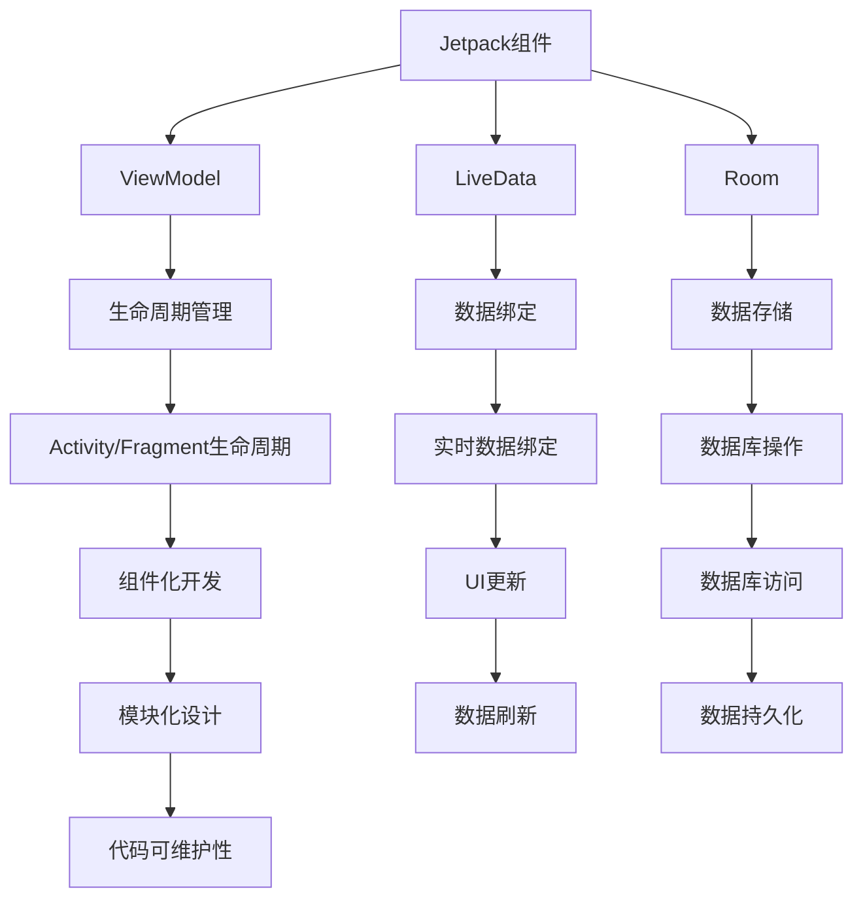

                 

 作为Android开发领域的重要组件，Jetpack的出现极大地提升了Android开发的效率。本文将深入探讨Jetpack的核心组件，以及它们如何帮助开发者构建高效、可维护的Android应用。

## 关键词

- Android Jetpack
- 开发效率
- 组件化开发
- 生命周期管理
- 视图绑定
- 实时数据绑定

## 摘要

本文将详细介绍Android Jetpack的核心组件，包括ViewModel、LiveData、Room等，并探讨它们如何帮助开发者简化复杂任务，提升开发效率。通过实际案例和代码示例，我们将展示这些组件在实际开发中的应用效果。

## 1. 背景介绍

Android作为移动操作系统，已经经历了多个版本和多年的发展。随着应用的日益复杂，开发者需要面对越来越多的挑战，如生命周期管理、数据存储、网络请求等。为了解决这些问题，Google推出了Android Jetpack。

Android Jetpack是一套由Google提供的库和工具，旨在简化Android应用开发。它包含了多个核心组件，如ViewModel、LiveData、Room等，帮助开发者解决常见的开发问题，提高开发效率和代码质量。

### 1.1 Jetpack组件的特点

- **易用性**：Jetpack组件提供了简单易用的API，使得开发者可以快速上手。
- **组件化**：Jetpack组件支持组件化开发，使得应用模块化，易于维护和扩展。
- **兼容性**：Jetpack组件支持旧版Android系统，向后兼容性好。
- **持续更新**：Google定期更新Jetpack组件，确保它们保持最新状态。

### 1.2 开发者面临的挑战

在传统的Android开发中，开发者需要手动处理许多复杂任务，如生命周期管理、数据绑定、网络请求等。这些任务不仅繁琐，而且容易出错。Jetpack组件的出现，正是为了解决这些问题，提升开发效率。

## 2. 核心概念与联系

为了更好地理解Jetpack组件，我们需要了解它们的核心概念和架构。以下是一个简化的Mermaid流程图，展示了Jetpack组件之间的关联。



### 2.1 ViewModel

ViewModel是Jetpack组件中的一个核心概念，它用于管理活动或片段的生命周期，并保存状态信息。ViewModel与LiveData和Room紧密关联，共同处理数据绑定和生命周期管理。

### 2.2 LiveData

LiveData是一个可观察的数据持有器，它用于在数据变化时通知观察者。LiveData与ViewModel配合使用，使得数据绑定变得更加简单。

### 2.3 Room

Room是Jetpack提供的数据库抽象层，它基于SQLite，提供了更加易用的API。Room与LiveData结合，实现了数据存储和实时数据绑定的无缝集成。

### 2.4 生命周期管理

生命周期管理是Android开发中的一个重要挑战。Jetpack组件通过ViewModel和LiveData，简化了生命周期管理，使得开发者可以专注于业务逻辑。

### 2.5 数据绑定

数据绑定是Android开发中的一个重要方向。Jetpack组件通过LiveData和Room，实现了实时数据绑定和数据刷新，提升了用户体验。

### 2.6 组件化开发

组件化开发是现代Android应用开发的一个重要趋势。Jetpack组件支持组件化开发，使得应用模块化，易于维护和扩展。

## 3. 核心算法原理 & 具体操作步骤

### 3.1 算法原理概述

Jetpack组件的核心算法原理可以概括为以下几点：

- **生命周期管理**：通过ViewModel和LiveData，实现自动化的生命周期管理，避免手动处理生命周期回调。
- **数据绑定**：通过LiveData和Room，实现数据的实时绑定和刷新，提升用户体验。
- **组件化开发**：通过模块化设计，实现应用的组件化，提高可维护性和扩展性。

### 3.2 算法步骤详解

- **生命周期管理**：首先，在活动或片段中创建ViewModel，并通过LiveData监听数据变化。当数据发生变化时，LiveData会自动更新UI。
- **数据绑定**：通过Room实现数据存储，将数据存储到本地数据库。当数据发生变化时，Room会自动更新LiveData，从而实现数据的实时绑定。
- **组件化开发**：将应用划分为多个组件，如用户界面、业务逻辑、数据存储等。每个组件独立开发、测试和部署，提高可维护性和扩展性。

### 3.3 算法优缺点

- **优点**：
  - 简化了生命周期管理，减少了手动处理回调的复杂度。
  - 实现了实时数据绑定，提升了用户体验。
  - 支持组件化开发，提高了应用的模块化和可维护性。

- **缺点**：
  - 依赖Google的Jetpack库，可能对项目结构有一定影响。
  - 学习曲线较陡峭，需要一定时间熟悉和使用。

### 3.4 算法应用领域

Jetpack组件广泛应用于各种Android应用场景，如：

- **社交应用**：用于管理用户数据和实时消息推送。
- **电商应用**：用于管理商品数据和购物车。
- **天气应用**：用于实时获取天气数据并更新UI。
- **新闻应用**：用于管理新闻数据和实时刷新。

## 4. 数学模型和公式 & 详细讲解 & 举例说明

为了更好地理解Jetpack组件的工作原理，我们需要引入一些数学模型和公式。以下是一个简单的示例：

### 4.1 数学模型构建

假设我们有一个简单的数据模型，用于表示用户信息。该模型包含以下属性：

- `userId`：用户的唯一标识。
- `name`：用户的名字。
- `age`：用户的年龄。

### 4.2 公式推导过程

我们可以使用以下公式来表示用户信息：

\[ \text{userInfo} = ( \text{userId}, \text{name}, \text{age} ) \]

### 4.3 案例分析与讲解

假设我们有一个用户界面，用于展示用户信息。当用户信息发生变化时，我们需要更新UI。为了实现这一点，我们可以使用LiveData和Room。

首先，我们创建一个Room数据库实体，用于存储用户信息：

```kotlin
@Entity(tableName = "users")
data class User(
    @PrimaryKey val userId: Int,
    val name: String,
    val age: Int
)
```

然后，我们创建一个Repository类，用于处理用户数据的存储和读取：

```kotlin
class UserRepository(private val database: AppDatabase) {
    val allUsers: LiveData<List<User>> = database.userDao().getAllUsers()

    suspend fun insertUser(user: User) {
        database.userDao().insertUser(user)
    }

    suspend fun deleteUser(user: User) {
        database.userDao().deleteUser(user)
    }
}
```

最后，我们在Activity中使用LiveData监听用户信息的变化，并更新UI：

```kotlin
class UserActivity : AppCompatActivity() {
    private val userRepository = UserRepository(database)

    override fun onCreate(savedInstanceState: Bundle?) {
        super.onCreate(savedInstanceState)
        setContentView(R.layout.activity_user)

        // 监听用户信息变化
        allUsers.observe(this, Observer { users ->
            // 更新UI
            for (user in users) {
                textView.text = "${user.name} (${user.age}岁)"
            }
        })

        // 添加用户
        button.setOnClickListener {
            val user = User(1, "张三", 30)
            userRepository.insertUser(user)
        }

        // 删除用户
        button2.setOnClickListener {
            val user = User(1, "张三", 30)
            userRepository.deleteUser(user)
        }
    }
}
```

通过这个示例，我们可以看到如何使用Room和LiveData实现数据的实时绑定和更新。

## 5. 项目实践：代码实例和详细解释说明

在本节中，我们将通过一个简单的示例，展示如何在实际项目中使用Jetpack组件。

### 5.1 开发环境搭建

首先，确保您的Android Studio已经更新到最新版本。然后，在项目中添加以下依赖：

```groovy
implementation 'androidx.lifecycle:lifecycle-viewmodel-ktx:2.3.1'
implementation 'androidx.lifecycle:lifecycle-livedata-ktx:2.3.1'
implementation 'androidx.room:room-runtime:2.3.0'
implementation 'androidx.room:room-ktx:2.3.0'
```

### 5.2 源代码详细实现

以下是一个简单的用户信息管理示例：

**User.kt**：

```kotlin
@Entity(tableName = "users")
data class User(
    @PrimaryKey val userId: Int,
    val name: String,
    val age: Int
)
```

**UserDao.kt**：

```kotlin
@Dao
interface UserDao {
    @Query("SELECT * FROM users")
    fun getAllUsers(): LiveData<List<User>>

    @Insert
    suspend fun insertUser(user: User)

    @Delete
    suspend fun deleteUser(user: User)
}
```

**UserRepository.kt**：

```kotlin
class UserRepository(private val database: AppDatabase) {
    val allUsers: LiveData<List<User>> = database.userDao().getAllUsers()

    suspend fun insertUser(user: User) {
        database.userDao().insertUser(user)
    }

    suspend fun deleteUser(user: User) {
        database.userDao().deleteUser(user)
    }
}
```

**UserActivity.kt**：

```kotlin
class UserActivity : AppCompatActivity() {
    private val userRepository = UserRepository(database)

    override fun onCreate(savedInstanceState: Bundle?) {
        super.onCreate(savedInstanceState)
        setContentView(R.layout.activity_user)

        // 监听用户信息变化
        allUsers.observe(this, Observer { users ->
            // 更新UI
            for (user in users) {
                textView.text = "${user.name} (${user.age}岁)"
            }
        })

        // 添加用户
        button.setOnClickListener {
            val user = User(1, "张三", 30)
            userRepository.insertUser(user)
        }

        // 删除用户
        button2.setOnClickListener {
            val user = User(1, "张三", 30)
            userRepository.deleteUser(user)
        }
    }
}
```

### 5.3 代码解读与分析

在这个示例中，我们使用了Room和LiveData实现了一个简单的用户信息管理功能。

- **User.kt**：定义了用户实体类。
- **UserDao.kt**：定义了用户数据访问对象，包括获取所有用户、插入用户和删除用户的方法。
- **UserRepository.kt**：定义了用户仓库类，用于处理用户数据的存储和读取。
- **UserActivity.kt**：定义了用户活动类，用于展示用户信息和处理用户点击事件。

通过这个示例，我们可以看到如何使用Jetpack组件简化用户信息管理的实现过程。

### 5.4 运行结果展示

运行这个示例应用后，我们可以看到用户信息会在添加或删除时实时更新，界面会自动刷新。这展示了LiveData和Room如何实现数据的实时绑定和更新。

## 6. 实际应用场景

Jetpack组件在多个实际应用场景中发挥着重要作用。以下是一些常见的应用场景：

### 6.1 社交应用

在社交应用中，用户数据和实时消息推送是核心功能。Jetpack组件可以帮助开发者简化用户信息管理、实时数据绑定和消息推送的实现。

### 6.2 电商应用

在电商应用中，商品数据和购物车管理是关键功能。Jetpack组件可以简化商品数据的存储、读取和实时更新，提高用户体验。

### 6.3 天气应用

在天气应用中，实时获取天气数据和更新UI是核心功能。Jetpack组件可以帮助开发者简化数据获取和UI更新的过程，提高应用的响应速度。

### 6.4 新闻应用

在新闻应用中，实时获取新闻数据和更新UI是关键功能。Jetpack组件可以简化新闻数据的存储、读取和实时更新，提高用户体验。

## 7. 未来应用展望

随着Android应用的发展，Jetpack组件将继续发挥重要作用。以下是一些未来应用展望：

### 7.1 人工智能

未来，人工智能技术将在Android应用中广泛应用。Jetpack组件可以简化人工智能算法的实现，提高应用的智能化水平。

### 7.2 虚拟现实

虚拟现实技术在Android应用中具有巨大潜力。Jetpack组件可以简化虚拟现实应用的开发，提高用户体验。

### 7.3 物联网

随着物联网技术的发展，Android设备将成为物联网的重要组成部分。Jetpack组件可以简化物联网应用的开发，提高设备的互操作性。

## 8. 工具和资源推荐

为了更好地学习和使用Jetpack组件，以下是一些推荐的工具和资源：

### 8.1 学习资源推荐

- **官方文档**：Android Jetpack官方文档提供了详细的使用教程和示例代码。
- **在线教程**：许多在线平台提供了关于Jetpack组件的教程，如Google Developers、Medium等。
- **书籍**：《Android Jetpack 实战》和《Android Jetpack 精讲》等书籍是学习Jetpack组件的好资源。

### 8.2 开发工具推荐

- **Android Studio**：Android Studio是开发Android应用的最佳IDE，支持Jetpack组件的集成和调试。
- **IntelliJ IDEA**：IntelliJ IDEA也是一个功能强大的IDE，适用于Jetpack组件的开发。

### 8.3 相关论文推荐

- **《Android Architecture Components》**：该论文详细介绍了Jetpack组件的设计理念和应用场景。
- **《Model-View-ViewModel》**：该论文介绍了ViewModel的设计原理和应用方法。

## 9. 总结：未来发展趋势与挑战

随着Android应用的不断发展和创新，Jetpack组件将继续发挥重要作用。未来，Jetpack组件将朝着更加智能化、模块化、高效化的方向发展。然而，这也将带来一些挑战，如算法优化、性能提升、安全防护等。为了应对这些挑战，开发者需要不断学习和掌握最新的技术，不断提升自己的开发能力。

## 附录：常见问题与解答

### Q1: 什么是Jetpack组件？

A1: Jetpack组件是Google提供的一套用于简化Android应用开发的库和工具。它包含多个核心组件，如ViewModel、LiveData、Room等，帮助开发者解决常见的开发问题，提高开发效率。

### Q2: 如何使用Jetpack组件进行数据绑定？

A2: 使用Jetpack组件进行数据绑定，可以通过LiveData监听数据变化，并在数据发生变化时自动更新UI。结合Room数据库，可以实现数据的实时绑定和刷新。

### Q3: Jetpack组件支持哪些版本Android系统？

A3: Jetpack组件支持旧版Android系统，向后兼容性好。具体支持版本可以查看官方文档。

### Q4: 如何在项目中集成Jetpack组件？

A4: 在项目中集成Jetpack组件，可以通过在build.gradle文件中添加依赖。例如：

```groovy
implementation 'androidx.lifecycle:lifecycle-viewmodel-ktx:2.3.1'
implementation 'androidx.lifecycle:lifecycle-livedata-ktx:2.3.1'
implementation 'androidx.room:room-runtime:2.3.0'
implementation 'androidx.room:room-ktx:2.3.0'
```

### Q5: Jetpack组件是否适用于所有类型的Android应用？

A5: 是的，Jetpack组件适用于多种类型的Android应用，如社交应用、电商应用、天气应用等。通过组件化开发，Jetpack组件可以提高应用的模块化和可维护性。

