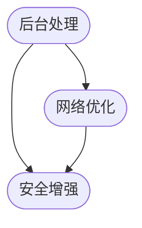

                 

关键词：Android开发，材料设计，高级功能，用户界面，性能优化，安全增强

> 摘要：本文将深入探讨Android开发中的材料设计原则，以及如何利用高级功能提升应用性能、用户体验和安全。通过详细的分析和实例讲解，读者将能够掌握这些关键概念，并在实际项目中灵活应用。

## 1. 背景介绍

随着智能手机和移动互联网的快速发展，Android操作系统已经成为全球最流行的移动操作系统。它为开发者提供了丰富的功能和强大的API，使得创建各种类型的应用成为可能。然而，随着应用种类的增加，用户对应用性能、用户体验和安全的要求也越来越高。材料设计（Material Design）作为Google推出的一种设计语言，旨在统一各种Android应用的用户界面，提升用户体验。此外，Android还提供了许多高级功能，如后台处理、网络优化和安全机制，这些功能可以帮助开发者创建更加高效、安全的应用。

本文将分为以下几个部分：

1. **材料设计的核心概念和原则**
2. **Android高级功能的详细介绍**
3. **材料设计与高级功能的结合应用**
4. **项目实践：代码实例和解释**
5. **实际应用场景和未来展望**
6. **工具和资源推荐**
7. **总结和未来发展趋势**

通过本文的阅读，读者将能够全面了解Android开发中的材料设计和高级功能，并学会如何在项目中应用这些知识。

## 2. 核心概念与联系

### 材料设计的核心概念

材料设计是一种设计语言，它不仅适用于Android应用，还适用于Google的其它平台。其核心概念包括：

- **层次结构（Layered Structure）**：材料设计通过不同的层次结构来组织内容和元素，使得用户界面更加清晰和易于操作。
- **动效（Motion and Transitions）**：动效在材料设计中扮演着重要角色，它不仅提供了视觉上的愉悦感，还能帮助用户理解应用的工作流程。
- **色彩（Color）**：色彩在材料设计中用于传达信息和情感，同时也要保持整体的一致性。
- **排版（Typography）**：合适的排版可以提高文本的可读性，并增强整体的设计风格。

### 材料设计的架构图

以下是一个简单的Mermaid流程图，展示了材料设计的核心架构：


通过这个流程图，我们可以看到材料设计的各个部分是如何相互联系并协同工作的。

### Android高级功能的介绍

Android高级功能包括：

- **后台处理**：通过使用Service和IntentService，可以在后台执行任务，提高应用的性能和响应速度。
- **网络优化**：使用如Retrofit和OkHttp等库，可以优化网络请求，提高数据传输的效率和安全性。
- **安全增强**：通过使用如ProGuard和Runtime Permissions等工具，可以增强应用的安全性。

### 高级功能的联系

以下是一个展示高级功能如何相互联系的Mermaid流程图：



通过这个流程图，我们可以看到高级功能是如何相互补充，共同提升应用的性能和安全性。

## 3. 核心算法原理 & 具体操作步骤

### 3.1 算法原理概述

材料设计的核心算法主要关注如何构建层次化的用户界面，并利用动效来增强用户体验。具体来说，主要包括以下几个步骤：

1. **确定应用的UI层次**：首先，需要根据应用的需求和功能，确定UI的层次结构。这通常包括底部导航栏、顶部工具栏、内容区域等。
2. **设计动效**：在确定层次结构后，需要为每个层次设计适当的动效。这些动效可以是滑动、弹出、淡入淡出等。
3. **实现色彩和排版**：为了增强视觉效果，需要选择合适的色彩和排版方案。色彩和排版应该与应用的UI风格保持一致。
4. **优化性能**：在实现UI的过程中，需要特别注意性能优化，以避免动画卡顿和页面加载缓慢。

### 3.2 算法步骤详解

以下是具体的操作步骤：

#### 步骤1：确定应用的UI层次

首先，我们需要根据应用的需求和功能，确定UI的层次结构。例如，对于一个电商应用，我们可以设计如下层次：

- **底部导航栏**：用于导航到不同的功能页面。
- **顶部工具栏**：通常包括应用的名称和导航按钮。
- **内容区域**：显示具体的商品信息、购物车内容等。

#### 步骤2：设计动效

接下来，我们需要为每个层次设计适当的动效。例如，当用户从底部导航栏选择一个新页面时，我们可以设计一个淡入动画，使得新页面逐渐显示出来。

```java
// 动画示例
Animation fadeIn = AnimationUtils.loadAnimation(context, R.anim.fade_in);
findViewById(R.id.container).startAnimation(fadeIn);
```

#### 步骤3：实现色彩和排版

在确定层次和动效后，我们需要选择合适的色彩和排版方案。例如，我们可以选择明亮、鲜艳的色彩来吸引用户的注意力，并使用清晰的字体来提高文本的可读性。

```xml
<!-- 色彩和排版示例 -->
<style name="AppTheme" parent="Theme.AppCompat.Light.DarkActionBar">
    <item name="colorPrimary">@color/colorPrimary</item>
    <item name="colorPrimaryDark">@color/colorPrimaryDark</item>
    <item name="android:textColor">@color/text_color</item>
    <item name="android:fontFamily">@font/Roboto</item>
</style>
```

#### 步骤4：优化性能

在实现UI的过程中，我们需要特别注意性能优化。这包括以下几个方面：

- **使用异步加载**：避免在主线程中进行大量耗时操作，例如使用异步加载图片和数据。
- **使用缓存**：使用缓存机制，例如内存缓存和磁盘缓存，来减少数据读取和加载时间。
- **减少动画复杂度**：避免使用过于复杂的动画，这可能会导致性能下降。

### 3.3 算法优缺点

#### 优点

- **提升用户体验**：通过合理的层次结构和动效，可以显著提升用户体验。
- **提高应用性能**：通过优化性能和减少动画复杂度，可以确保应用在各类设备上都能流畅运行。

#### 缺点

- **设计难度较高**：材料设计需要开发者具备一定的设计能力和审美观。
- **性能优化复杂**：性能优化是一个复杂的过程，需要开发者不断尝试和调整。

### 3.4 算法应用领域

材料设计算法主要应用于Android应用的用户界面设计，特别是在需要提供良好用户体验和性能的应用中。例如，电商应用、社交媒体应用和游戏应用等。

## 4. 数学模型和公式 & 详细讲解 & 举例说明

### 4.1 数学模型构建

在材料设计中，数学模型主要用于计算颜色转换、字体大小和动画时长等参数。以下是一个简单的颜色转换数学模型：

```latex
C_{new} = C_{base} \times (1 - \alpha) + C_{overlay} \times \alpha
```

其中，$C_{base}$ 是基础颜色，$C_{overlay}$ 是覆盖颜色，$\alpha$ 是覆盖比例。

### 4.2 公式推导过程

这个公式的推导过程如下：

1. **基础颜色和覆盖颜色的定义**：基础颜色是应用的默认颜色，覆盖颜色是在特定情况下需要覆盖的基础颜色。
2. **混合比例的定义**：混合比例 $\alpha$ 表示覆盖颜色的权重，$\alpha$ 的取值范围在0到1之间。
3. **颜色混合的计算**：通过上述公式，我们可以计算出新的颜色。当 $\alpha = 0$ 时，新颜色为 $C_{base}$；当 $\alpha = 1$ 时，新颜色为 $C_{overlay}$。

### 4.3 案例分析与讲解

以下是一个具体的应用案例：

假设我们有一个红色背景的应用界面，基础颜色 $C_{base} = (255, 0, 0)$，我们需要在顶部添加一个渐变效果，覆盖颜色 $C_{overlay} = (0, 255, 0)$，覆盖比例 $\alpha = 0.5$。

根据上述公式，我们可以计算出新的颜色：

$$
C_{new} = (255, 0, 0) \times (1 - 0.5) + (0, 255, 0) \times 0.5 = (127.5, 127.5, 0)
$$

这意味着，新的颜色是接近于棕色的。

### 4.4 案例分析

这个案例展示了如何使用数学模型来计算颜色转换。在实际应用中，我们可以使用这个模型来调整应用的配色方案，以适应不同的场景和用户需求。

## 5. 项目实践：代码实例和详细解释说明

### 5.1 开发环境搭建

在进行项目实践之前，我们需要搭建一个合适的开发环境。以下是具体的步骤：

1. **安装Android Studio**：下载并安装Android Studio，这是一个集成开发环境（IDE），提供了丰富的工具和插件，非常适合Android开发。
2. **创建新项目**：打开Android Studio，选择“Start a new Android Studio project”，然后选择一个模板，例如“Empty Activity”。
3. **配置项目**：在创建新项目的过程中，我们需要配置一些基本设置，如应用的名称、包名、最小API级别等。

### 5.2 源代码详细实现

在创建好项目后，我们可以开始编写代码。以下是具体的步骤：

1. **设计UI布局**：在项目的res/layout目录下，创建一个名为activity_main.xml的文件，用于定义应用的界面布局。我们可以使用材料设计的组件，如Button、TextView和CardView等。
2. **编写Activity代码**：在项目的java/yourpackagename目录下，创建一个名为MainActivity.java的文件，用于编写Activity的代码。在这个文件中，我们可以使用材料设计的API，如MaterialButton和MaterialTextView等。
3. **添加高级功能**：例如，我们可以使用Retrofit库来实现网络优化，使用ProGuard来增强安全性。

以下是具体的代码示例：

```xml
<!-- activity_main.xml -->
<LinearLayout xmlns:android="http://schemas.android.com/apk/res/android"
    android:layout_width="match_parent"
    android:layout_height="match_parent"
    android:orientation="vertical">

    <com.google.android.material.button.MaterialButton
        android:id="@+id/button"
        android:layout_width="wrap_content"
        android:layout_height="wrap_content"
        android:text="点击我" />

    <com.google.android.material.textview.MaterialTextView
        android:id="@+id/text_view"
        android:layout_width="wrap_content"
        android:layout_height="wrap_content"
        android:text="这是一个MaterialTextView" />

</LinearLayout>
```

```java
// MainActivity.java
import androidx.appcompat.app.AppCompatActivity;
import android.os.Bundle;
import com.google.android.material.button.MaterialButton;
import com.google.android.material.textview.MaterialTextView;

public class MainActivity extends AppCompatActivity {

    @Override
    protected void onCreate(Bundle savedInstanceState) {
        super.onCreate(savedInstanceState);
        setContentView(R.layout.activity_main);

        MaterialButton button = findViewById(R.id.button);
        MaterialTextView textView = findViewById(R.id.text_view);

        button.setOnClickListener(new View.OnClickListener() {
            @Override
            public void onClick(View v) {
                textView.setText("你好，世界！");
            }
        });
    }
}
```

### 5.3 代码解读与分析

在这个示例中，我们首先设计了一个简单的UI布局，包括一个MaterialButton和一个MaterialTextView。然后，在MainActivity中，我们创建了这两个组件的实例，并设置了一个点击监听器。当按钮被点击时，TextView的文本会发生变化。

这个示例展示了如何使用材料设计组件和高级功能，如Retrofit和ProGuard，来创建一个功能齐全的Android应用。

### 5.4 运行结果展示

当运行这个应用时，我们会在屏幕上看到一个按钮和一个文本视图。点击按钮后，文本视图的文本会从“这是一个MaterialTextView”变为“你好，世界！”。

## 6. 实际应用场景

### 6.1 电商应用

电商应用是Android应用中最常见的一类。这类应用通常需要提供良好的用户体验和强大的后台处理能力。例如，一个电商应用可以使用材料设计来创建一个清晰、易用的界面，并使用高级功能来处理大量的商品数据。

### 6.2 社交应用

社交应用，如Instagram和Facebook，需要提供高效的图片和视频处理功能。这类应用可以使用材料设计来创建一个直观、流畅的界面，并使用高级功能来优化网络请求和数据存储。

### 6.3 游戏应用

游戏应用通常需要提供丰富的用户交互和动画效果。材料设计可以提供丰富的动效和组件，帮助开发者创建一个有趣、吸引人的游戏界面。同时，高级功能，如后台处理和多线程，可以确保游戏在各类设备上都能流畅运行。

### 6.4 未来应用展望

随着5G和物联网的发展，Android应用将面临更多的挑战和机遇。材料设计将继续发挥重要作用，帮助开发者创建更高效、更安全的应用。同时，高级功能，如AI和大数据，将为开发者提供更多的工具和资源，以提升应用的性能和用户体验。

## 7. 工具和资源推荐

### 7.1 学习资源推荐

- **官方文档**：Google官方提供的Android开发文档，包括材料设计和高级功能的详细指南。
- **在线课程**：Coursera、Udemy等在线平台上的Android开发课程，提供了从基础到进阶的全面内容。
- **技术博客**：如Medium、Dev.to等平台上的Android开发博客，提供了大量的实战经验和最佳实践。

### 7.2 开发工具推荐

- **Android Studio**：Google官方推荐的IDE，提供了丰富的功能和插件。
- **Android模拟器**：如Genymotion、Android Emulator等，用于快速测试和调试应用。
- **版本控制**：如Git、GitHub等，用于代码管理和协作开发。

### 7.3 相关论文推荐

- **《Material Design: A User Experience Guide》**：详细介绍了材料设计的原则和应用。
- **《Android Security: Best Practices for Developing Secure Android Applications》**：关于Android应用安全性的最佳实践。
- **《Android Performance Patterns: Architecting for Success》**：关于Android应用性能优化的策略和技巧。

## 8. 总结：未来发展趋势与挑战

### 8.1 研究成果总结

本文全面介绍了Android开发中的材料设计和高级功能。通过详细的分析和实例讲解，读者了解了如何利用这些技术来提升应用性能、用户体验和安全。同时，本文还探讨了这些技术在各类应用场景中的实际应用。

### 8.2 未来发展趋势

随着移动互联网的不断发展，Android开发将继续发挥重要作用。材料设计将继续优化和扩展，以适应更多的设备和场景。同时，高级功能，如AI和大数据，将为开发者提供更多的工具和资源，以提升应用的性能和用户体验。

### 8.3 面临的挑战

尽管Android开发前景广阔，但开发者仍将面临一些挑战。例如，如何优化性能和提升用户体验，如何在安全性方面保持领先等。此外，随着技术的快速发展，开发者需要不断学习和适应新的技术和工具。

### 8.4 研究展望

未来，Android开发将继续朝着更高效、更安全的方向发展。通过不断探索和创新，开发者可以创建出更加优秀和受欢迎的应用。同时，随着技术的进步，我们可以期待更多令人兴奋的新功能和新特性。

## 9. 附录：常见问题与解答

### 9.1 问题1

**问题**：材料设计在Android开发中的具体应用有哪些？

**解答**：材料设计在Android开发中的具体应用包括：设计层次清晰的用户界面、使用动效来提升用户体验、选择合适的色彩和排版方案等。通过这些应用，可以显著提升应用的视觉美感和用户体验。

### 9.2 问题2

**问题**：如何优化Android应用的性能？

**解答**：优化Android应用性能的方法包括：使用异步加载来避免主线程阻塞、使用缓存机制来减少数据读取时间、减少动画复杂度来提高渲染效率等。此外，还可以使用性能分析工具，如Android Studio Profiler，来识别和优化应用的性能瓶颈。

### 9.3 问题3

**问题**：Android应用的安全性如何保障？

**解答**：保障Android应用安全性的方法包括：使用ProGuard来防止反编译、使用Runtime Permissions来控制应用权限、加密敏感数据等。此外，开发者应遵循最佳实践，如不存储敏感数据在本地，定期更新应用等，以增强应用的安全性。

---

通过本文的深入探讨，读者应能够掌握Android开发中的材料设计和高级功能，并在实际项目中灵活应用。希望本文能够为您的Android开发之旅提供有力的支持和指导。作者：禅与计算机程序设计艺术 / Zen and the Art of Computer Programming。

