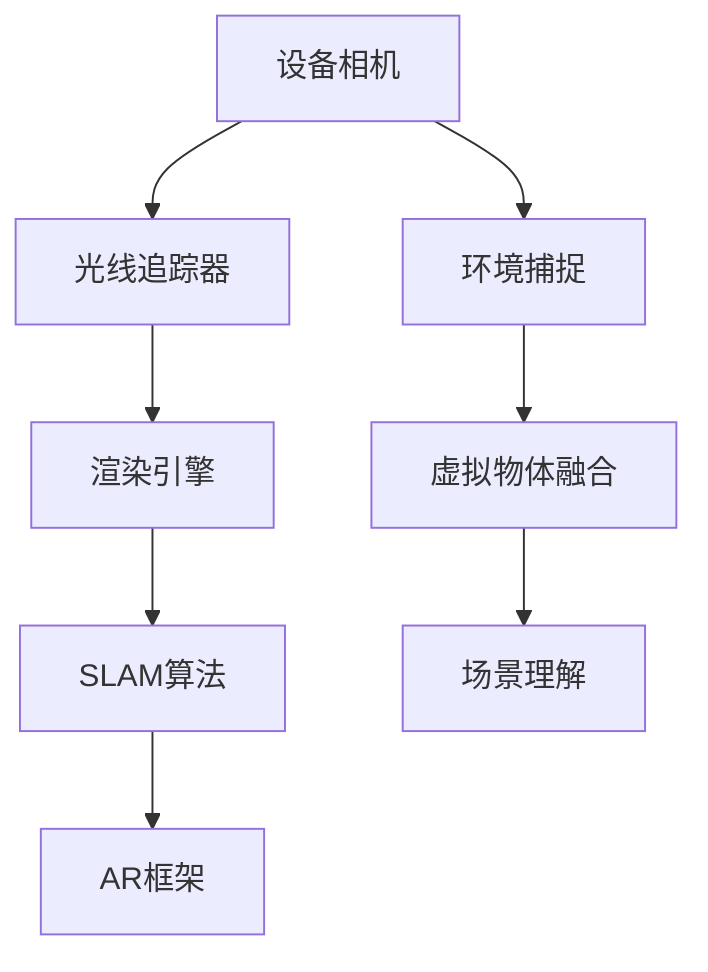

                 

关键词：增强现实（AR）、Apple ARKit、iOS开发、移动增强现实、计算机视觉、交互设计、用户体验、虚拟物体融合、实时渲染、AR应用案例

> 摘要：本文深入探讨了Apple的增强现实开发框架ARKit，介绍了其在iOS平台上的应用与实现。通过详细的架构解析、算法原理、数学模型讲解，结合实际项目实践，本文旨在为开发者提供关于移动增强现实开发的全面指南。

## 1. 背景介绍

增强现实（Augmented Reality，简称AR）是一种将数字信息叠加到真实世界场景中的技术，通过计算机视觉和图像处理等技术，将虚拟物体与现实环境无缝融合。近年来，随着移动设备的普及和计算能力的提升，AR技术逐渐从实验室走向大众，成为智能手机和移动设备的一项重要功能。

Apple ARKit是Apple公司在2017年推出的一套开发框架，旨在为iOS开发者提供一套完整的AR开发工具。ARKit利用iOS设备的摄像头、传感器和图形处理单元，实现对现实环境的实时捕捉和虚拟物体的叠加显示。它不仅简化了AR应用的开发流程，还提高了AR体验的质量和可靠性。

本文将围绕Apple ARKit在iOS平台上的增强现实开发，深入探讨其核心概念、算法原理、数学模型以及实际应用案例，帮助开发者更好地理解和应用这一强大的开发框架。

## 2. 核心概念与联系

### 2.1 ARKit核心概念

ARKit的核心概念主要包括环境捕捉、光照估计、虚拟物体融合和场景理解等。

- **环境捕捉**：通过摄像头捕捉现实环境，生成一个三维的视觉场景。
- **光照估计**：通过分析环境光照，为虚拟物体提供合适的光照效果。
- **虚拟物体融合**：将虚拟物体与现实环境无缝融合，确保视觉效果的真实性和自然性。
- **场景理解**：识别现实环境中的平面、物体等特征，为虚拟物体提供定位和锚点。

### 2.2 ARKit架构

ARKit的架构包括几个关键组件：

- **相机**：使用设备的相机捕捉实时视频流。
- **光线追踪器**：根据环境光照，为虚拟物体计算光照效果。
- **渲染引擎**：使用OpenGL ES或Metal技术，将虚拟物体渲染到屏幕上。
- **SLAM算法**：同时定位与地图构建（Simultaneous Localization and Mapping），用于确定设备在现实环境中的位置。
- **AR框架**：提供一系列API和工具，简化AR应用的开发。

### 2.3 Mermaid流程图



通过这个Mermaid流程图，我们可以清晰地看到ARKit各个组件之间的联系和数据处理流程。

## 3. 核心算法原理 & 具体操作步骤

### 3.1 算法原理概述

ARKit的核心算法包括相机追踪、SLAM、虚拟物体融合等。

- **相机追踪**：通过识别相机图像中的特征点，实时计算设备在三维空间中的位置和方向。
- **SLAM**：通过同时定位与地图构建，确定设备在现实环境中的位置，并构建环境地图。
- **虚拟物体融合**：将虚拟物体与现实环境中的特征点进行匹配，确保虚拟物体在现实中的正确位置和角度。

### 3.2 算法步骤详解

#### 3.2.1 相机追踪

1. **图像捕获**：使用设备摄像头捕获实时视频流。
2. **特征点检测**：在图像中检测可识别的特征点，如角点、边缘等。
3. **特征点匹配**：将当前帧的特征点与前一帧的特征点进行匹配。
4. **运动估计**：通过匹配结果计算相机在三维空间中的运动轨迹。

#### 3.2.2 SLAM

1. **地图构建**：根据相机追踪结果，逐步构建现实环境的三维地图。
2. **位置估计**：利用地图数据和当前相机状态，估计设备在现实环境中的位置。
3. **优化**：通过最小化位置误差，优化位置估计结果。

#### 3.2.3 虚拟物体融合

1. **物体定位**：将虚拟物体与地图中的特征点进行匹配，确定虚拟物体在现实中的位置。
2. **光照处理**：根据环境光照，为虚拟物体计算合适的光照效果。
3. **渲染**：使用渲染引擎，将虚拟物体叠加到相机视图中。

### 3.3 算法优缺点

#### 优点：

- **高精度**：ARKit基于SLAM算法，能够提供高精度的实时追踪和位置估计。
- **易用性**：ARKit提供了一系列易于使用的API和工具，简化了AR应用的开发。
- **兼容性**：ARKit支持多种iOS设备，包括iPhone和iPad。

#### 缺点：

- **性能要求**：SLAM算法对计算资源有一定要求，可能影响设备性能。
- **环境限制**：ARKit对光照和场景环境有一定要求，可能无法在所有场景下实现理想的AR效果。

### 3.4 算法应用领域

ARKit在多个领域有广泛的应用，包括：

- **教育**：通过虚拟物体融合，增强学习体验。
- **娱乐**：开发AR游戏和娱乐应用，如宝可梦GO。
- **零售**：实现虚拟试衣和产品展示。
- **医疗**：辅助手术和医疗培训。

## 4. 数学模型和公式 & 详细讲解 & 举例说明

### 4.1 数学模型构建

ARKit的数学模型主要包括相机运动模型、SLAM模型和光照模型。

#### 4.1.1 相机运动模型

相机运动模型描述了相机在三维空间中的运动轨迹。常用的模型包括：

- **旋转矩阵**：表示相机在三维空间中的旋转。
- **平移向量**：表示相机在三维空间中的平移。

#### 4.1.2 SLAM模型

SLAM模型通过同时定位与地图构建，实现相机在三维空间中的位置估计。常用的模型包括：

- **卡尔曼滤波**：用于优化位置估计结果。
- **粒子滤波**：用于处理复杂场景和不确定性。

#### 4.1.3 光照模型

光照模型用于计算虚拟物体在现实环境中的光照效果。常用的模型包括：

- **菲涅尔反射**：用于计算光线在虚拟物体表面上的反射。
- **朗伯反射**：用于计算光线在虚拟物体表面上的散射。

### 4.2 公式推导过程

#### 4.2.1 相机运动模型

假设相机在三维空间中的运动可以由旋转矩阵\(R\)和平移向量\(t\)描述，则有：

\[ T_c(t) = \begin{bmatrix} R & t \\ 0 & 1 \end{bmatrix} \]

其中，\(T_c(t)\)表示相机在时刻\(t\)的位置。

#### 4.2.2 SLAM模型

假设相机在时刻\(t\)的位置为\(x(t)\)，则通过卡尔曼滤波可以得到：

\[ x(t) = x(t-1) + v(t-1) + w(t-1) \]

其中，\(v(t-1)\)为相机运动速度，\(w(t-1)\)为噪声。

#### 4.2.3 光照模型

假设虚拟物体表面的法向量为\(n\)，光线方向向量为\(l\)，则有：

\[ I = I_0 \cdot \max(0, n \cdot l) \]

其中，\(I\)为表面光照强度，\(I_0\)为入射光强度。

### 4.3 案例分析与讲解

假设我们开发一个AR应用，用于在现实环境中展示一个虚拟物体。为了实现这一目标，我们需要进行以下步骤：

1. **相机追踪**：使用ARKit的相机追踪功能，获取当前相机在三维空间中的位置和方向。
2. **SLAM建模**：使用SLAM算法，构建现实环境的三维地图，并确定虚拟物体在现实中的位置。
3. **光照计算**：根据环境光照，计算虚拟物体表面的光照效果。
4. **渲染**：使用渲染引擎，将虚拟物体叠加到相机视图中。

通过以上步骤，我们可以实现虚拟物体与现实环境的无缝融合，提供逼真的增强现实体验。

## 5. 项目实践：代码实例和详细解释说明

### 5.1 开发环境搭建

1. **安装Xcode**：从Apple官网下载并安装最新的Xcode开发工具。
2. **创建项目**：在Xcode中创建一个新的iOS项目，选择“Single View App”模板。
3. **添加ARKit依赖**：在项目的“General”设置中，确保“Enable ARKit”选项被勾选。

### 5.2 源代码详细实现

```swift
import UIKit
import ARKit

class ViewController: UIViewController, ARSCNViewDelegate {

    var sceneView: ARSCNView!

    override func viewDidLoad() {
        super.viewDidLoad()
        
        // 设置ARSCNView为视图控制器的主视图
        sceneView = ARSCNView(frame: view.bounds)
        view.addSubview(sceneView)
        
        // 设置ARSCNView的代理
        sceneView.delegate = self
        
        // 配置AR场景
        let configuration = ARWorldTrackingConfiguration()
        configuration.planeDetection = .horizontal
        sceneView.session.run(configuration)
    }
    
    func renderer(_ renderer: SCNSceneRenderer, didAdd node: SCNNode, for anchor: ARAnchor) {
        if let planeAnchor = anchor as? ARHorizontalPlaneAnchor {
            let plane = SCNBox(width: planeAnchor.extent.x, height: 0.01, length: planeAnchor.extent.z, chamferRadius: 0)
            let planeNode = SCNNode(geometry: plane)
            planeNode.position = SCNVector3(planeAnchor.center.x, 0, planeAnchor.center.z)
            node.addChildNode(planeNode)
        }
    }
}
```

### 5.3 代码解读与分析

上述代码展示了如何使用ARKit在现实环境中创建一个平面的AR锚点。具体解读如下：

- **ARSCNView**：创建一个AR场景视图，用于显示增强现实内容。
- **ARWorldTrackingConfiguration**：配置AR场景，包括平面检测。
- **renderer(_:didAdd:for:)**：渲染器在添加一个AR锚点时调用，用于创建平面锚点。

通过以上代码，我们可以创建一个AR平面锚点，并将一个平面物体叠加到该锚点上。

### 5.4 运行结果展示

运行上述代码后，应用程序会在设备上显示一个AR平面锚点，用户可以通过调整设备的方向来观察平面的变化。这是一个简单的AR应用示例，开发者可以在此基础上添加更多的AR内容和功能。

## 6. 实际应用场景

ARKit的应用场景非常广泛，以下是一些典型的实际应用场景：

- **教育**：通过AR技术，将抽象的概念和知识以三维形式呈现，提高学习效果。
- **娱乐**：开发AR游戏和娱乐应用，如宝可梦GO，为用户提供全新的娱乐体验。
- **零售**：实现虚拟试衣和产品展示，帮助消费者更好地了解商品。
- **医疗**：辅助手术和医疗培训，提供逼真的模拟环境。
- **旅游**：为用户提供旅游景点的三维模型和相关信息，增强旅游体验。

### 6.4 未来应用展望

随着技术的不断发展和完善，ARKit在未来有广阔的应用前景：

- **更先进的SLAM算法**：提高AR应用的精度和稳定性。
- **更丰富的AR内容**：通过增加更多的AR功能和内容，提供更加丰富的用户体验。
- **跨平台AR应用**：扩展ARKit的应用范围，支持更多类型的设备和操作系统。

## 7. 工具和资源推荐

### 7.1 学习资源推荐

- **官方文档**：Apple ARKit官方文档提供了详细的开发指南和API参考。
- **在线教程**：有许多优秀的在线教程和课程，适合不同层次的开发者。

### 7.2 开发工具推荐

- **Xcode**：官方的开发工具，用于编写、构建和运行iOS应用。
- **Unity**：一个流行的游戏和AR开发平台，支持iOS平台。

### 7.3 相关论文推荐

- **"Augmented Reality: A Review of Current and Potential Applications in Education"**：探讨AR在教育中的应用。
- **"Real-Time Augmented Reality for Mobile Phones"**：介绍移动AR技术的实现。

## 8. 总结：未来发展趋势与挑战

### 8.1 研究成果总结

ARKit作为Apple推出的增强现实开发框架，凭借其高精度、易用性和兼容性，已经成为iOS平台上开发AR应用的强大工具。通过本文的详细探讨，我们了解了ARKit的核心概念、算法原理、数学模型以及实际应用案例。

### 8.2 未来发展趋势

随着技术的不断进步，ARKit有望在以下方面取得突破：

- **更高性能的SLAM算法**：提高AR应用的实时性和稳定性。
- **更丰富的AR内容**：通过增强现实技术，提供更加丰富的用户体验。
- **跨平台AR应用**：扩展ARKit的应用范围，支持更多类型的设备和操作系统。

### 8.3 面临的挑战

尽管ARKit有着广阔的应用前景，但在实际应用中仍面临一些挑战：

- **性能优化**：SLAM算法对计算资源有一定要求，如何在不影响性能的情况下提供更好的AR体验是一个挑战。
- **环境适应性**：ARKit对光照和场景环境有一定要求，如何在不同环境下实现理想的AR效果是一个难题。

### 8.4 研究展望

未来，ARKit有望在以下几个方面进行深入研究：

- **多传感器融合**：结合多种传感器数据，提高AR应用的精度和可靠性。
- **实时交互**：通过更先进的交互技术，提供更加自然的用户交互体验。
- **跨领域应用**：在医疗、教育、零售等各个领域，ARKit有望发挥更大的作用。

## 9. 附录：常见问题与解答

### 9.1 如何优化ARKit的性能？

- **降低SLAM算法的精度要求**：在保证AR体验的同时，减少计算资源的需求。
- **优化渲染流程**：通过减少渲染对象的数量和复杂度，提高渲染效率。
- **使用异步编程**：利用异步编程技术，同时执行多个任务，提高应用性能。

### 9.2 ARKit对环境有何要求？

- **光照**：ARKit对环境光照有一定要求，建议在均匀照明条件下使用。
- **场景**：ARKit需要识别和跟踪平面和物体，因此需要一定的空间环境。

通过以上问题和解答，开发者可以更好地理解和使用ARKit，为其应用提供更高质量的增强现实体验。

# 作者署名

作者：禅与计算机程序设计艺术 / Zen and the Art of Computer Programming

通过本文，我们深入探讨了Apple ARKit在iOS平台上的增强现实开发，从核心概念、算法原理到实际应用，为开发者提供了全面的技术指南。希望本文能帮助读者更好地掌握ARKit，发挥其在各个领域的潜力。在未来，随着技术的不断进步，ARKit将在更广泛的领域发挥重要作用，为用户带来更加丰富的增强现实体验。

