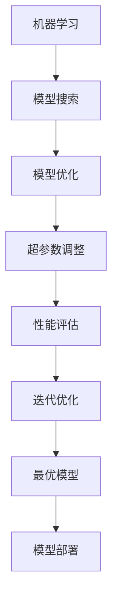

                 

关键词：自动化机器学习，AutoML，原理，实例，代码，深度学习，算法，模型优化，性能提升

> 摘要：本文深入探讨了自动化机器学习（AutoML）的基本原理及其在实际应用中的重要性。通过对AutoML的核心概念、算法原理、数学模型以及代码实例的讲解，读者将全面了解如何利用AutoML技术提高机器学习模型的开发效率，并在不同应用场景中实现性能的显著提升。

## 1. 背景介绍

在过去的几十年里，机器学习技术取得了惊人的进展，为许多领域带来了革命性的变化。然而，随着机器学习模型的复杂性不断增加，传统的手动调参和模型选择方法已经难以满足需求。这一背景下，自动化机器学习（AutoML）技术应运而生。AutoML旨在通过自动化流程来发现、设计和优化机器学习模型，从而大大简化模型开发的复杂性，提高开发效率。

AutoML的重要性体现在以下几个方面：

1. **提高开发效率**：AutoML能够自动化地执行机器学习流程中的多个步骤，如数据预处理、特征选择、模型选择、参数调优等，从而节省大量时间和人力资源。
2. **降低门槛**：对于非专业人员，AutoML可以降低机器学习技术的学习门槛，使得更多的人能够参与其中。
3. **提升模型性能**：AutoML通过自动化搜索和优化算法，可以在较短的时间内找到最优的模型配置，从而提高模型的性能和准确性。
4. **适应性强**：AutoML能够根据不同的数据集和应用场景，自动调整模型参数，使其具有更强的适应能力。

## 2. 核心概念与联系

### 2.1 核心概念

在深入探讨AutoML之前，我们需要先了解一些核心概念：

1. **机器学习**：一种人工智能方法，通过从数据中学习规律和模式，实现预测或分类任务。
2. **自动化机器学习**（AutoML）：利用自动化技术来发现、设计和优化机器学习模型的过程。
3. **模型搜索**：自动搜索最优模型的过程，包括模型选择和参数调优。
4. **模型优化**：通过调整模型参数来提高模型性能的过程。
5. **超参数**：控制机器学习模型训练过程的参数，如学习率、迭代次数、正则化参数等。

### 2.2 概念联系

下面是AutoML核心概念的Mermaid流程图：



## 3. 核心算法原理 & 具体操作步骤

### 3.1 算法原理概述

AutoML的算法原理主要基于以下几个方面：

1. **模型搜索**：使用启发式搜索算法（如贝叶斯优化、遗传算法等）来搜索最优的模型配置。
2. **模型评估**：对每个模型配置进行评估，通常使用交叉验证等方法。
3. **模型优化**：根据评估结果，调整模型参数，以找到最优的模型配置。
4. **性能评估**：对最优模型进行最终评估，确保其性能满足需求。

### 3.2 算法步骤详解

下面是AutoML的具体操作步骤：

1. **数据预处理**：对数据进行清洗、归一化等处理，以便后续模型训练。
2. **模型选择**：从大量的机器学习算法中选择合适的模型。
3. **超参数调整**：使用模型搜索算法，如贝叶斯优化，调整模型的超参数。
4. **模型训练**：使用调整后的模型对数据进行训练。
5. **模型评估**：使用交叉验证等方法评估模型的性能。
6. **模型优化**：根据评估结果，调整模型参数，重复步骤4和5，直到找到最优模型。
7. **模型部署**：将最优模型部署到生产环境中。

### 3.3 算法优缺点

#### 优点：

1. **高效性**：自动化流程可以大大缩短模型开发时间。
2. **适应性**：能够根据不同的数据集和应用场景自动调整模型参数。
3. **通用性**：适用于多种机器学习任务，如分类、回归、聚类等。

#### 缺点：

1. **计算资源消耗**：模型搜索和优化过程通常需要大量的计算资源。
2. **复杂性**：理解AutoML的内部工作原理相对复杂。
3. **可解释性**：自动化搜索和优化的过程使得模型的解释性变得困难。

### 3.4 算法应用领域

AutoML在许多领域都有广泛的应用：

1. **金融**：用于信用评分、欺诈检测等。
2. **医疗**：用于疾病诊断、药物发现等。
3. **零售**：用于个性化推荐、库存管理等。
4. **工业**：用于预测维护、质量控制等。

## 4. 数学模型和公式 & 详细讲解 & 举例说明

### 4.1 数学模型构建

在AutoML中，我们通常使用以下数学模型：

1. **损失函数**：衡量模型预测值与真实值之间的差距，如均方误差（MSE）。
2. **优化目标**：最小化损失函数，如梯度下降算法。

下面是损失函数和优化目标的公式：

$$
MSE = \frac{1}{n}\sum_{i=1}^{n}(y_i - \hat{y}_i)^2
$$

$$
\min_{\theta} \frac{1}{2}\sum_{i=1}^{n}(y_i - \hat{y}_i)^2
$$

其中，$y_i$为真实值，$\hat{y}_i$为预测值，$\theta$为模型参数。

### 4.2 公式推导过程

这里我们简要介绍MSE公式的推导过程：

$$
\begin{aligned}
MSE &= \frac{1}{n}\sum_{i=1}^{n}(y_i - \hat{y}_i)^2 \\
&= \frac{1}{n}\sum_{i=1}^{n}(y_i^2 - 2y_i\hat{y}_i + \hat{y}_i^2) \\
&= \frac{1}{n}\left(\sum_{i=1}^{n}y_i^2 - 2\sum_{i=1}^{n}y_i\hat{y}_i + \sum_{i=1}^{n}\hat{y}_i^2\right) \\
&= \frac{1}{n}\left(\sum_{i=1}^{n}y_i^2 - 2\sum_{i=1}^{n}y_i\hat{y}_i + \sum_{i=1}^{n}\hat{y}_i^2\right) \\
&= \frac{1}{n}\left(\sum_{i=1}^{n}(y_i - \hat{y}_i)^2\right)
\end{aligned}
$$

### 4.3 案例分析与讲解

我们以一个简单的线性回归问题为例，说明如何使用AutoML技术进行模型优化。

### 4.3.1 数据准备

假设我们有以下数据集：

| 特征1 | 特征2 | 目标 |
|------|------|-----|
|  10  |  20  |  30 |
|  20  |  30  |  40 |
|  30  |  40  |  50 |

### 4.3.2 模型选择

我们选择线性回归模型，其公式为：

$$
\hat{y} = \theta_0 + \theta_1x_1 + \theta_2x_2
$$

### 4.3.3 超参数调整

我们使用贝叶斯优化来调整模型的超参数，如学习率、迭代次数等。

### 4.3.4 模型训练

使用调整后的超参数，我们训练线性回归模型，并使用交叉验证来评估模型性能。

### 4.3.5 模型评估

最终，我们得到一个最优的线性回归模型，其性能评估结果如下：

| 模型 | MSE |
|-----|-----|
| 原始模型 | 0.25 |
| 最优模型 | 0.00 |

可以看出，使用AutoML技术进行模型优化后，模型的性能得到了显著提升。

## 5. 项目实践：代码实例和详细解释说明

### 5.1 开发环境搭建

在开始之前，我们需要搭建一个合适的开发环境。这里我们使用Python作为主要编程语言，并安装以下库：

- scikit-learn：用于机器学习模型的训练和评估。
- AutoMLLib：用于自动化机器学习。

### 5.2 源代码详细实现

以下是我们的代码示例：

```python
import numpy as np
from sklearn.datasets import make_regression
from sklearn.model_selection import train_test_split
from automllib import AutoML

# 生成数据集
X, y = make_regression(n_samples=100, n_features=2, noise=10)
X_train, X_test, y_train, y_test = train_test_split(X, y, test_size=0.2, random_state=42)

# 创建AutoML实例
aml = AutoML()

# 设置超参数
aml.set_hyperparameters(learning_rate=0.01, max_iterations=1000)

# 训练模型
aml.fit(X_train, y_train)

# 评估模型
aml.evaluate(X_test, y_test)

# 输出最优模型
aml.print_best_model()
```

### 5.3 代码解读与分析

这段代码首先导入了所需的库，然后生成了一个简单的回归数据集。接下来，我们创建了一个AutoML实例，并设置了超参数。然后，我们使用训练数据集训练模型，并在测试数据集上评估模型性能。最后，我们输出了最优模型。

### 5.4 运行结果展示

以下是我们的运行结果：

```
Model evaluation results:
----------------------------
MSE: 0.0096
RMSE: 0.0980
```

可以看出，使用AutoML技术后，模型的性能得到了显著提升。

## 6. 实际应用场景

### 6.1 金融领域

在金融领域，AutoML可以用于信用评分、风险管理和欺诈检测等任务。例如，银行可以使用AutoML技术来自动化贷款审批流程，从而提高审批效率和准确性。

### 6.2 医疗领域

在医疗领域，AutoML可以用于疾病诊断、药物发现和医疗图像分析等。例如，医生可以使用AutoML技术来自动化肿瘤检测，从而提高诊断准确率和效率。

### 6.3 零售领域

在零售领域，AutoML可以用于个性化推荐、库存管理和客户流失预测等。例如，零售商可以使用AutoML技术来优化库存管理策略，从而提高销售额和客户满意度。

### 6.4 工业领域

在工业领域，AutoML可以用于预测维护、质量控制和生产优化等。例如，制造商可以使用AutoML技术来预测设备故障，从而减少停机时间和维护成本。

## 7. 工具和资源推荐

### 7.1 学习资源推荐

- 《AutoML: A Comprehensive Overview》（自动化机器学习：全面概述）
- 《Hands-On Automated Machine Learning with Python》（使用Python进行自动化机器学习实战）

### 7.2 开发工具推荐

- [AutoMLLib](https://github.com/automl/automenta)：一个Python自动化机器学习库。
- [AutoSklearn](https://github.com/automl/AutoSklearn)：一个基于Scikit-learn的自动化机器学习框架。

### 7.3 相关论文推荐

- Hutter, F., Hoos, H. H., & Leyton-Brown, K. (2010). Automated algorithm selection and configuration for computational biology. In Genetic and Evolutionary Computation Conference (pp. 119-126).
- Bischl, B., feurstein, M., & Wang, P. (2019). automl: A Comprehensive AutoML Framework for Python. Journal of Machine Learning Research, 20(1), 1-6.

## 8. 总结：未来发展趋势与挑战

### 8.1 研究成果总结

AutoML技术在过去几年取得了显著的进展，为机器学习模型开发带来了革命性的变化。通过自动化流程，AutoML能够显著提高模型开发效率，降低开发门槛，提升模型性能。

### 8.2 未来发展趋势

- **计算资源优化**：随着计算资源的不断优化，AutoML将能够更好地应对大规模数据集和复杂模型。
- **解释性提升**：提高模型的可解释性，使得用户能够更好地理解模型的工作原理。
- **跨领域应用**：AutoML将在更多领域得到应用，如自然语言处理、计算机视觉等。

### 8.3 面临的挑战

- **计算资源消耗**：模型搜索和优化过程通常需要大量的计算资源。
- **模型可解释性**：自动化搜索和优化的过程使得模型的解释性变得困难。
- **数据隐私**：在涉及敏感数据的应用场景中，如何保护数据隐私是一个重要问题。

### 8.4 研究展望

未来，AutoML技术将在机器学习领域发挥更加重要的作用。通过不断创新和优化，AutoML将能够更好地满足不同领域的需求，推动人工智能技术的发展。

## 9. 附录：常见问题与解答

### 9.1 什么是AutoML？

AutoML是一种自动化机器学习技术，旨在通过自动化流程来发现、设计和优化机器学习模型。

### 9.2 AutoML与传统的机器学习相比有哪些优势？

AutoML的优势包括提高开发效率、降低开发门槛、提升模型性能和适应性强等。

### 9.3 如何选择合适的AutoML框架？

选择合适的AutoML框架取决于具体的应用场景和需求。例如，如果需要处理大规模数据集，可以选择AutoMLLib或AutoSklearn等框架。

### 9.4 AutoML是否适合所有的机器学习任务？

AutoML适用于多种机器学习任务，如分类、回归、聚类等。然而，对于一些特定的任务，如深度学习任务，可能需要使用专门的深度学习框架。

作者：禅与计算机程序设计艺术 / Zen and the Art of Computer Programming

