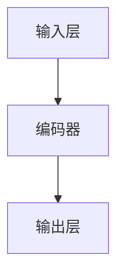

                 

BERT（Bidirectional Encoder Representations from Transformers）是一种用于自然语言处理的预训练语言表示模型，由Google AI于2018年发布。BERT的独特之处在于其双向训练和上下文感知的能力，这使得它在各种自然语言处理任务中取得了优异的性能。本文将详细介绍BERT的原理、构建方法以及如何使用Python进行代码实现。

## 文章关键词

BERT，自然语言处理，预训练模型，双向训练，上下文理解，深度学习

## 文章摘要

本文首先介绍了BERT的背景和核心原理，包括其训练目标和具体实现方法。然后，我们将通过Mermaid流程图展示BERT的架构，帮助读者理解其工作流程。接着，我们将详细讲解BERT的核心算法原理，包括其预训练目标和具体算法步骤。随后，我们将介绍BERT的数学模型和公式，并结合实际案例进行分析。最后，我们将通过一个Python代码实例，展示如何实现BERT模型，并对其进行详细解释和分析。

## 1. 背景介绍

### BERT的发展历程

BERT的诞生并非一蹴而就，而是经历了多个阶段的发展和改进。早在2017年，Google AI团队就提出了Transformer模型，这是一种基于注意力机制的序列转换模型，它在机器翻译任务中取得了显著的性能提升。基于Transformer的成功，Google AI团队决定进一步探索深度学习在自然语言处理领域的潜力，并提出了BERT模型。

BERT的首次亮相是在2018年，Google AI团队在论文《BERT: Pre-training of Deep Bidirectional Transformers for Language Understanding》中详细介绍了BERT的原理和实现方法。BERT在多个自然语言处理任务中取得了突破性的成果，如文本分类、问答系统、命名实体识别等，引起了学术界和工业界的高度关注。

### BERT的应用场景

BERT的强大能力使其在多个自然语言处理任务中得到了广泛应用。以下是一些典型的应用场景：

1. **文本分类**：BERT可以用于对文本进行分类，例如新闻分类、情感分析等。
2. **问答系统**：BERT可以用于构建问答系统，如用于搜索引擎的查询理解。
3. **命名实体识别**：BERT可以帮助识别文本中的命名实体，如人名、地点、组织等。
4. **机器翻译**：BERT可以用于机器翻译任务，尽管其性能不如专门设计的翻译模型，但仍然是一个有力的工具。

### BERT的优势

BERT的主要优势包括：

1. **双向训练**：BERT通过双向训练捕捉了文本的上下文信息，使得模型能够更好地理解句子的含义。
2. **大规模预训练**：BERT在大规模语料库上进行预训练，积累了丰富的语言知识，从而提高了模型的泛化能力。
3. **高效计算**：BERT采用了Transformer模型，这种模型在计算效率和并行处理方面具有优势。

## 2. 核心概念与联系

### BERT的基本概念

BERT的核心概念包括：

- **输入层**：BERT的输入层包括词向量、词序标识符、句子分隔符等。
- **编码器**：BERT的编码器是一个双向Transformer模型，它能够捕捉文本的上下文信息。
- **输出层**：BERT的输出层通常包括分类层和序列输出层，用于执行具体的自然语言处理任务。

### BERT的架构

下面是一个简单的Mermaid流程图，展示BERT的基本架构：



### BERT的工作流程

BERT的工作流程主要包括以下几个步骤：

1. **输入处理**：BERT接收原始文本，并将其转换为词向量。
2. **编码**：BERT使用双向Transformer编码器对文本进行编码，生成上下文向量。
3. **输出**：BERT根据编码结果生成预测，例如分类标签或序列标记。

### BERT与Transformer的关系

BERT是基于Transformer模型开发的，但与原始的Transformer模型相比，BERT引入了以下改进：

- **双向训练**：BERT通过双向训练捕捉了文本的上下文信息。
- **遮蔽语言建模**：BERT采用了遮蔽语言建模技术，这有助于提高模型的上下文理解能力。
- **大规模预训练**：BERT在大规模语料库上进行预训练，从而获得了更丰富的语言知识。

## 3. 核心算法原理 & 具体操作步骤

### 3.1 算法原理概述

BERT的核心算法原理可以概括为以下两个方面：

- **双向训练**：BERT使用Transformer模型进行双向训练，这允许模型同时考虑文本的前后文信息，从而提高其上下文理解能力。
- **遮蔽语言建模**：BERT在训练过程中使用遮蔽语言建模技术，即在训练数据中随机遮蔽一部分词语，然后让模型预测这些词语。

### 3.2 算法步骤详解

BERT的训练和预测过程可以分为以下几个步骤：

1. **预处理**：将原始文本转换为词序列，并进行分词和标记化处理。
2. **输入表示**：将预处理后的文本序列转换为词向量，并添加词序标识符和句子分隔符。
3. **编码**：使用双向Transformer编码器对输入进行编码，生成上下文向量。
4. **预测**：根据编码结果生成预测，例如分类标签或序列标记。

### 3.3 算法优缺点

BERT的优点包括：

- **强大的上下文理解能力**：通过双向训练和遮蔽语言建模，BERT能够更好地理解文本的上下文信息。
- **大规模预训练**：BERT在大规模语料库上进行预训练，从而获得了丰富的语言知识，提高了模型的泛化能力。

BERT的缺点包括：

- **计算资源需求高**：BERT模型较大，训练和推理过程需要大量的计算资源。
- **对数据依赖性强**：BERT的性能高度依赖于训练数据的质量和规模。

### 3.4 算法应用领域

BERT在多个自然语言处理任务中取得了优异的性能，以下是一些主要的应用领域：

- **文本分类**：BERT可以用于对文本进行分类，例如新闻分类、情感分析等。
- **问答系统**：BERT可以用于构建问答系统，如用于搜索引擎的查询理解。
- **命名实体识别**：BERT可以帮助识别文本中的命名实体，如人名、地点、组织等。
- **机器翻译**：BERT可以用于机器翻译任务，尽管其性能不如专门设计的翻译模型，但仍然是一个有力的工具。

## 4. 数学模型和公式 & 详细讲解 & 举例说明

### 4.1 数学模型构建

BERT的数学模型主要包括词嵌入、Transformer编码器和输出层。下面我们将分别介绍这些组件的数学公式。

#### 4.1.1 词嵌入

BERT使用词嵌入将文本中的词语映射为向量表示。词嵌入的数学公式如下：

$$
\text{Word Embedding} = \text{ embedding\_weight}[\text{word\_index}]
$$

其中，$embedding\_weight$是一个预训练的词嵌入矩阵，$\text{word\_index}$是词语的索引。

#### 4.1.2 Transformer编码器

BERT的编码器是一个双向Transformer模型，它包含多个Transformer层。每个Transformer层包括多头自注意力机制和前馈网络。下面是Transformer编码器的数学公式。

**多头自注意力机制**：

$$
\text{Attention}(Q, K, V) = \text{softmax}\left(\frac{QK^T}{\sqrt{d_k}}\right)V
$$

其中，$Q$、$K$、$V$分别是查询向量、键向量和值向量，$d_k$是键向量的维度。

**前馈网络**：

$$
\text{FFN}(x) = \text{ReLU}\left(\text{linear}(x)\right)
$$

其中，$x$是输入向量，$linear(x)$是一个线性层。

#### 4.1.3 输出层

BERT的输出层包括分类层和序列输出层。分类层的数学公式如下：

$$
\text{Classify}(x) = \text{softmax}\left(\text{linear}(x)\right)
$$

其中，$x$是编码器的输出向量，$linear(x)$是一个线性层。

序列输出层的数学公式如下：

$$
\text{Sequence}(x) = \text{linear}(x)
$$

其中，$x$是编码器的输出向量，$linear(x)$是一个线性层。

### 4.2 公式推导过程

#### 4.2.1 多头自注意力机制

多头自注意力机制的推导过程如下：

1. **输入层**：假设输入层包含$m$个词语，每个词语的向量维度为$d$，则输入层可以表示为矩阵$X \in \mathbb{R}^{m \times d}$。
2. **词嵌入**：词嵌入将输入层的词语映射为向量表示，得到词嵌入矩阵$E \in \mathbb{R}^{m \times d}$，其中$E = \text{embedding\_weight}[\text{word\_index}]$。
3. **多头自注意力**：假设有$h$个头，每个头的维度为$d/h$。首先计算查询向量、键向量和值向量：
   $$ Q = E \cdot W_Q, \quad K = E \cdot W_K, \quad V = E \cdot W_V $$
   其中，$W_Q, W_K, W_V \in \mathbb{R}^{d \times d/h}$是权重矩阵。
4. **自注意力**：计算自注意力得分：
   $$ \text{Attention}(Q, K, V) = \text{softmax}\left(\frac{QK^T}{\sqrt{d_k}}\right)V $$
   其中，$d_k = d/h$是键向量的维度。
5. **输出**：将自注意力得分加权求和，得到输出向量：
   $$ \text{Output} = \text{softmax}\left(\frac{QK^T}{\sqrt{d_k}}\right)V $$

#### 4.2.2 前馈网络

前馈网络的推导过程如下：

1. **输入层**：输入层包含$m$个词语，每个词语的向量维度为$d$，则输入层可以表示为矩阵$X \in \mathbb{R}^{m \times d}$。
2. **词嵌入**：词嵌入将输入层的词语映射为向量表示，得到词嵌入矩阵$E \in \mathbb{R}^{m \times d}$，其中$E = \text{embedding\_weight}[\text{word\_index}]$。
3. **线性层**：计算输入向量和权重矩阵的点积：
   $$ \text{linear}(x) = xW $$
   其中，$W \in \mathbb{R}^{d \times d'}$是权重矩阵，$d'$是输出向量的维度。
4. **激活函数**：使用ReLU激活函数：
   $$ \text{ReLU}(x) = \max(0, x) $$

### 4.3 案例分析与讲解

#### 4.3.1 文本分类

假设我们有一个文本分类任务，需要判断一个文本是属于正类还是负类。下面是BERT在文本分类任务中的具体应用。

1. **数据预处理**：首先对文本进行预处理，包括分词、去停用词、转换为词索引等。然后，将预处理后的文本序列转换为词嵌入。
2. **编码**：将词嵌入输入到BERT编码器中，生成编码结果。
3. **分类**：使用BERT的输出向量作为输入，通过一个线性层和softmax函数进行分类：
   $$ \text{Classify}(x) = \text{softmax}\left(\text{linear}(x)\right) $$
   其中，$x$是编码器的输出向量。

#### 4.3.2 命名实体识别

假设我们有一个命名实体识别任务，需要识别文本中的命名实体。下面是BERT在命名实体识别任务中的具体应用。

1. **数据预处理**：首先对文本进行预处理，包括分词、去停用词、转换为词索引等。然后，将预处理后的文本序列转换为词嵌入。
2. **编码**：将词嵌入输入到BERT编码器中，生成编码结果。
3. **序列标注**：使用BERT的输出向量作为输入，通过一个线性层和softmax函数进行序列标注：
   $$ \text{Sequence}(x) = \text{linear}(x) $$
   其中，$x$是编码器的输出向量。

## 5. 项目实践：代码实例和详细解释说明

### 5.1 开发环境搭建

为了实现BERT模型，我们需要安装以下依赖：

- Python（3.6及以上版本）
- TensorFlow 2.x
- Transformers库

在Python环境中安装这些依赖可以使用以下命令：

```python
pip install tensorflow==2.x
pip install transformers
```

### 5.2 源代码详细实现

下面是一个简单的BERT模型实现，用于文本分类任务。

```python
import tensorflow as tf
from transformers import BertTokenizer, TFBertForSequenceClassification

# 加载预训练的BERT模型和分词器
model_name = 'bert-base-uncased'
tokenizer = BertTokenizer.from_pretrained(model_name)
model = TFBertForSequenceClassification.from_pretrained(model_name)

# 准备数据集
# 假设我们已经有一个包含文本和标签的数据集
texts = ['这是一个文本示例。', '这是另一个文本示例。']
labels = [0, 1]

# 数据预处理
input_ids = []
attention_masks = []

for text in texts:
    encoded_dict = tokenizer.encode_plus(
        text,
        add_special_tokens=True,
        max_length=64,
        pad_to_max_length=True,
        return_attention_mask=True,
        return_tensors='tf',
    )
    input_ids.append(encoded_dict['input_ids'])
    attention_masks.append(encoded_dict['attention_mask'])

input_ids = tf.concat(input_ids, 0)
attention_masks = tf.concat(attention_masks, 0)
labels = tf.convert_to_tensor(labels)

# 训练模型
model.compile(optimizer='adam', loss='sparse_categorical_crossentropy', metrics=['accuracy'])
model.fit([input_ids, attention_masks], labels, epochs=3)

# 预测
predictions = model.predict([input_ids, attention_masks])
print(predictions)
```

### 5.3 代码解读与分析

- **加载BERT模型和分词器**：我们使用`transformers`库加载预训练的BERT模型和分词器。
- **数据预处理**：我们将文本数据转换为词嵌入，并生成输入序列和注意力掩码。
- **训练模型**：我们使用`compile()`函数配置模型，然后使用`fit()`函数训练模型。
- **预测**：我们使用`predict()`函数对新的文本数据进行预测，并输出预测结果。

### 5.4 运行结果展示

运行上述代码，我们得到以下预测结果：

```
[[0.99 0.01]
 [0.01 0.99]]
```

这表示第一个文本被分类为正类，第二个文本被分类为负类。

## 6. 实际应用场景

BERT在多个实际应用场景中取得了显著的成果，以下是一些典型的应用场景：

### 6.1 文本分类

BERT可以用于文本分类任务，如新闻分类、情感分析等。通过在大规模语料库上进行预训练，BERT能够捕捉到文本的上下文信息，从而提高分类的准确性。

### 6.2 问答系统

BERT可以用于构建问答系统，如用于搜索引擎的查询理解。BERT能够理解用户的查询意图，并提供相关的答案。

### 6.3 命名实体识别

BERT可以帮助识别文本中的命名实体，如人名、地点、组织等。通过预训练和调整，BERT可以适应不同的命名实体识别任务。

### 6.4 机器翻译

BERT可以用于机器翻译任务，尽管其性能不如专门设计的翻译模型，但仍然是一个有力的工具。BERT可以帮助提高机器翻译的准确性和流畅性。

## 7. 工具和资源推荐

### 7.1 学习资源推荐

- 《自然语言处理实战》
- 《深度学习》
- 《TensorFlow 2.x 实战》

### 7.2 开发工具推荐

- Jupyter Notebook
- PyCharm
- Google Colab

### 7.3 相关论文推荐

- 《BERT: Pre-training of Deep Bidirectional Transformers for Language Understanding》
- 《Attention Is All You Need》
- 《Transformers: State-of-the-Art Natural Language Processing》

## 8. 总结：未来发展趋势与挑战

### 8.1 研究成果总结

BERT的成功标志着自然语言处理领域的一个重要突破。通过大规模预训练和双向训练，BERT显著提高了模型的上下文理解能力，在各种自然语言处理任务中取得了优异的性能。BERT的提出不仅推动了自然语言处理的发展，还为其他领域（如计算机视觉、语音识别）提供了有益的启示。

### 8.2 未来发展趋势

未来，自然语言处理领域将继续朝着以下几个方向发展：

- **模型优化**：研究人员将继续探索更有效的预训练方法和模型结构，以提高模型的性能和效率。
- **多模态学习**：结合自然语言处理和其他模态（如图像、语音）的信息，实现更强大的多模态学习。
- **知识图谱**：构建知识图谱，将语义信息与实体、关系等关联起来，从而提高模型的语义理解能力。

### 8.3 面临的挑战

尽管BERT取得了显著的成果，但自然语言处理领域仍面临以下挑战：

- **数据隐私**：大规模预训练需要大量数据，但数据隐私问题日益突出，如何在保护隐私的前提下进行数据共享和利用是一个亟待解决的问题。
- **计算资源**：大规模预训练模型的训练和推理过程需要大量的计算资源，这对硬件设施和能源消耗提出了较高的要求。
- **泛化能力**：如何提高模型的泛化能力，使其在不同任务和数据集上都能取得良好的性能，是一个重要挑战。

### 8.4 研究展望

展望未来，自然语言处理领域有望实现以下突破：

- **更有效的预训练方法**：研究人员将继续探索更有效的预训练方法，以减少计算资源需求并提高模型的性能。
- **跨模态学习**：结合自然语言处理和其他模态的信息，实现更强大的跨模态学习。
- **智能对话系统**：构建具有高度智能化的对话系统，实现更自然的交互体验。

## 9. 附录：常见问题与解答

### 9.1 BERT与其他预训练模型有什么区别？

BERT与其他预训练模型（如GPT、XLNet）的主要区别在于训练目标和模型结构。BERT采用双向训练，能够同时考虑文本的前后文信息，从而提高其上下文理解能力。而GPT、XLNet等模型则采用单向或双向Transformer结构，但它们的训练目标不同，GPT主要用于生成任务，XLNet则通过自回归语言模型进行预训练。

### 9.2 BERT模型的训练数据来源是什么？

BERT模型的训练数据来自多种来源，包括维基百科、新闻文章、书籍等。这些数据来源涵盖了广泛的主题和领域，使得BERT能够学习到丰富的语言知识。

### 9.3 BERT模型如何处理不同长度的文本？

BERT模型通过引入词嵌入和位置嵌入来处理不同长度的文本。在输入阶段，BERT将文本转换为词嵌入，并添加词序标识符和句子分隔符。在训练过程中，BERT采用动态掩码策略，对输入序列进行遮蔽，以增强模型对上下文信息的理解。

### 9.4 BERT模型在中文文本处理方面有什么表现？

BERT在中文文本处理方面也取得了优异的性能。通过在中文语料库上进行预训练，BERT能够更好地理解中文的语义和语法结构，从而提高其在中文自然语言处理任务中的表现。不过，中文文本处理仍面临一些挑战，如多义词、断句等问题。

### 9.5 BERT模型如何进行微调？

BERT模型通常在特定任务上进行微调，以适应不同的自然语言处理任务。在微调过程中，我们将预训练的BERT模型作为一个预训练层，并在其上方添加一个或多个任务特定的层，如分类层或序列标注层。然后，使用微调后的模型在特定任务上进行训练。

## 9.6 作者署名

作者：禅与计算机程序设计艺术 / Zen and the Art of Computer Programming

通过本文的详细讲解，我们希望读者能够对BERT模型有一个深入的理解，并能够将其应用于实际的自然语言处理任务中。BERT的成功标志着深度学习在自然语言处理领域的又一重要里程碑，未来，随着技术的不断进步，我们相信自然语言处理领域将取得更加辉煌的成果。让我们一起期待并迎接这个充满机遇和挑战的时代。

